# Εξερεύνηση και σύγκριση διαφορετικών LLMs

[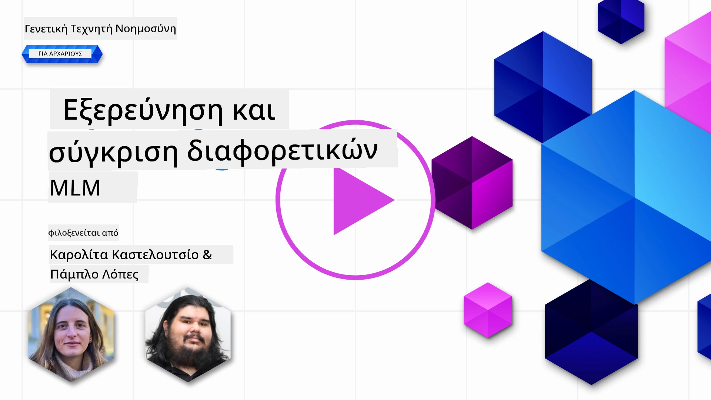](https://youtu.be/KIRUeDKscfI?si=8BHX1zvwzQBn-PlK)

> _Κάντε κλικ στην παραπάνω εικόνα για να δείτε το βίντεο αυτού του μαθήματος_

Με το προηγούμενο μάθημα, είδαμε πώς η Γενετική Τεχνητή Νοημοσύνη αλλάζει το τεχνολογικό τοπίο, πώς λειτουργούν τα Μεγάλα Γλωσσικά Μοντέλα (LLMs) και πώς μια επιχείρηση - όπως η startup μας - μπορεί να τα εφαρμόσει στις περιπτώσεις χρήσης και να αναπτυχθεί! Σε αυτό το κεφάλαιο, στοχεύουμε να συγκρίνουμε και να αντιπαραβάλλουμε διαφορετικούς τύπους μεγάλων γλωσσικών μοντέλων (LLMs) για να κατανοήσουμε τα πλεονεκτήματα και τα μειονεκτήματά τους.

Το επόμενο βήμα στο ταξίδι της startup μας είναι η εξερεύνηση του τρέχοντος τοπίου των LLMs και η κατανόηση ποια είναι κατάλληλα για τη χρήση μας.

## Εισαγωγή

Αυτό το μάθημα θα καλύψει:

- Διαφορετικούς τύπους LLMs στο τρέχον τοπίο.
- Δοκιμή, επανάληψη και σύγκριση διαφορετικών μοντέλων για τη χρήση σας στο Azure.
- Πώς να αναπτύξετε ένα LLM.

## Στόχοι Μάθησης

Μετά την ολοκλήρωση αυτού του μαθήματος, θα μπορείτε να:

- Επιλέξετε το σωστό μοντέλο για τη χρήση σας.
- Κατανοήσετε πώς να δοκιμάσετε, να επαναλάβετε και να βελτιώσετε την απόδοση του μοντέλου σας.
- Ξέρετε πώς οι επιχειρήσεις αναπτύσσουν μοντέλα.

## Κατανόηση διαφορετικών τύπων LLMs

Τα LLMs μπορούν να έχουν πολλαπλές κατηγοριοποιήσεις βάσει της αρχιτεκτονικής τους, των δεδομένων εκπαίδευσής τους και της χρήσης τους. Η κατανόηση αυτών των διαφορών θα βοηθήσει την startup μας να επιλέξει το σωστό μοντέλο για το σενάριο και να καταλάβει πώς να δοκιμάσει, να επαναλάβει και να βελτιώσει την απόδοση.

Υπάρχουν πολλοί διαφορετικοί τύποι μοντέλων LLM, η επιλογή του μοντέλου εξαρτάται από το σκοπό που θέλετε να τα χρησιμοποιήσετε, τα δεδομένα σας, πόσο είστε διατεθειμένοι να πληρώσετε και άλλα.

Ανάλογα με το αν σκοπεύετε να χρησιμοποιήσετε τα μοντέλα για κείμενο, ήχο, βίντεο, δημιουργία εικόνων κ.ά., μπορεί να επιλέξετε διαφορετικό τύπο μοντέλου.

- **Αναγνώριση ήχου και φωνής**. Τα μοντέλα τύπου Whisper είναι ακόμη χρήσιμα γενικής χρήσης μοντέλα αναγνώρισης ομιλίας, αλλά οι επιλογές παραγωγής περιλαμβάνουν πλέον νεότερα μοντέλα ομιλίας προς κείμενο, όπως τα `gpt-4o-transcribe`, `gpt-4o-mini-transcribe`, και παραλλαγές διαχωρισμού ομιλητών. Αξιολογήστε την κάλυψη γλωσσών, τον διαχωρισμό ομιλητών, την υποστήριξη σε πραγματικό χρόνο, την καθυστέρηση και το κόστος για το σενάριό σας. Μάθετε περισσότερα στην [τεκμηρίωση ομιλίας προς κείμενο της OpenAI](https://platform.openai.com/docs/guides/speech-to-text?WT.mc_id=academic-105485-koreyst).

- **Δημιουργία εικόνων**. Το DALL-E και το Midjourney είναι γνωστές επιλογές δημιουργίας εικόνων, αλλά τα τρέχοντα API εικόνας της OpenAI επικεντρώνονται στα μοντέλα GPT Image όπως `gpt-image-2`, ενώ μοντέλα όπως Stable Diffusion, Imagen, Flux και άλλες οικογένειες μοντέλων είναι επίσης κοινές επιλογές. Συγκρίνετε την προσκόλληση στο prompt, την υποστήριξη επεξεργασίας, τον έλεγχο ύφους, τις απαιτήσεις ασφαλείας και τις άδειες χρήσης. Μάθετε περισσότερα στον [οδηγό δημιουργίας εικόνων της OpenAI](https://platform.openai.com/docs/guides/images?WT.mc_id=academic-105485-koreyst) και στο Κεφάλαιο 9 αυτού του προγράμματος.

- **Δημιουργία κειμένου**. Τα μοντέλα κειμένου καλύπτουν πλέον πρωτοποριακά μοντέλα, μοντέλα συλλογισμού, μικρότερα μοντέλα χαμηλής καθυστέρησης και μοντέλα ανοιχτού βάρους. Τρέχοντα παραδείγματα περιλαμβάνουν τα μοντέλα OpenAI GPT-5.x, Anthropic Claude 4.x, Google Gemini 3.x, Meta Llama 4, και Mistral. Μην επιλέγετε μόνο με βάση την ημερομηνία κυκλοφορίας ή την τιμή· συγκρίνετε την ποιότητα της εργασίας, την καθυστέρηση, το παράθυρο συμφραζομένων, τη χρήση εργαλείων, τη συμπεριφορά ασφαλείας, τη διαθέσιμη περιοχή και το συνολικό κόστος. Ο [κατάλογος μοντέλων Microsoft Foundry](https://ai.azure.com/catalog?WT.mc_id=academic-105485-koreyst) είναι ένα καλό σημείο για να συγκρίνετε μοντέλα διαθέσιμα στο Azure.

- **Πολλαπλή τροπικότητα**. Πολλά τρέχοντα μοντέλα μπορούν να επεξεργαστούν περισσότερα από κείμενο. Μερικά δέχονται εικόνα, ήχο ή είσοδο βίντεο· μερικά μπορούν να καλέσουν εργαλεία· και εξειδικευμένα μοντέλα μπορούν να δημιουργήσουν εικόνες, ήχο ή βίντεο. Για παράδειγμα, τα τρέχοντα μοντέλα OpenAI υποστηρίζουν κείμενο και είσοδο εικόνας, τα μοντέλα Gemini μπορούν να υποστηρίξουν κείμενο, κώδικα, εικόνα, ήχο και βίντεο ανάλογα με την παραλλαγή, ενώ τα Llama 4 Scout και Maverick είναι μοντέλα ανοιχτού βάρους με εγγενή πολυτροπικότητα. Πάντα ελέγξτε την κάρτα κάθε μοντέλου για τις υποστηριζόμενες μορφές εισόδου και εξόδου πριν δημιουργήσετε ένα workflow γύρω του.

Η επιλογή ενός μοντέλου σημαίνει ότι έχετε κάποιες βασικές δυνατότητες, που όμως ίσως να μην επαρκούν. Συχνά έχετε ειδικά δεδομένα της εταιρείας που πρέπει με κάποιο τρόπο να ειπωθεί στο LLM. Υπάρχουν μερικές διαφορετικές επιλογές για το πώς να προσεγγίσετε αυτό, περισσότερα γι’ αυτό στα επερχόμενα τμήματα.

### Foundation Models έναντι LLMs

Ο όρος Foundation Model [δημιουργήθηκε από ερευνητές του Stanford](https://arxiv.org/abs/2108.07258?WT.mc_id=academic-105485-koreyst) και ορίστηκε ως μοντέλο AI που συμμορφώνεται με ορισμένα κριτήρια, όπως:

- **Εκπαιδεύονται χρησιμοποιώντας μη επιβλεπόμενη μάθηση ή αυτοεπιβλεπόμενη μάθηση**, που σημαίνει ότι εκπαιδεύονται με μη επισημασμένα πολυτροπικά δεδομένα και δεν απαιτούν ανθρώπινη επισήμανση ή ετικετοποίηση για τη διαδικασία εκπαίδευσης.
- **Είναι πολύ μεγάλα μοντέλα**, βασισμένα σε πολύ βαθιά νευρωνικά δίκτυα εκπαιδευμένα σε δισεκατομμύρια παραμέτρους.
- **Συνήθως προορίζονται να λειτουργήσουν ως 'βάση' για άλλα μοντέλα**, που σημαίνει ότι μπορούν να χρησιμοποιηθούν ως αφετηρία για την ανάπτυξη άλλων μοντέλων, με την τεχνική fine-tuning.

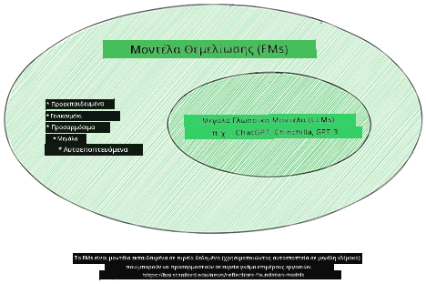

Πηγή εικόνας: [Essential Guide to Foundation Models and Large Language Models | by Babar M Bhatti | Medium
](https://thebabar.medium.com/essential-guide-to-foundation-models-and-large-language-models-27dab58f7404)

Για να διευκρινίσουμε περαιτέρω αυτή τη διάκριση, ας πάρουμε το ChatGPT ως ιστορικό παράδειγμα. Πρώιμες εκδόσεις του ChatGPT χρησιμοποίησαν το GPT-3.5 ως foundation model. Η OpenAI χρησιμοποίησε μετά δεδομένα ειδικά για συνομιλίες και τεχνικές ευθυγράμμισης για να δημιουργήσει μια βελτιωμένη έκδοση που αποδίδει καλύτερα σε σενάρια συνομιλίας, όπως chatbots. Οι σύγχρονες υπηρεσίες AI συχνά δρομολογούν ανάμεσα σε διάφορες παραλλαγές μοντέλων, οπότε το όνομα της υπηρεσίας και το όνομα του υποκείμενου μοντέλου δεν είναι πάντα το ίδιο.

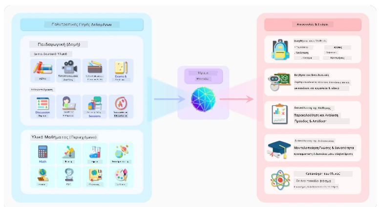

Πηγή εικόνας: [2108.07258.pdf (arxiv.org)](https://arxiv.org/pdf/2108.07258.pdf?WT.mc_id=academic-105485-koreyst)

### Ανοιχτό βάρος/ανοιχτού κώδικα έναντι ιδιόκτητων μοντέλων

Ένας άλλος τρόπος κατηγοριοποίησης των LLM είναι αν είναι ανοιχτού βάρους, ανοιχτού κώδικα ή ιδιόκτητα.

Τα μοντέλα ανοιχτού κώδικα και ανοιχτού βάρους κάνουν διαθέσιμα τα αρχεία μοντέλου για επιθεώρηση, λήψη ή προσαρμογή, αλλά οι άδειές τους διαφέρουν. Μερικά είναι πλήρως ανοιχτού κώδικα, ενώ άλλα είναι μοντέλα ανοιχτού βάρους με περιορισμούς χρήσης. Μπορούν να είναι χρήσιμα όταν μια επιχείρηση χρειάζεται μεγαλύτερο έλεγχο στην ανάπτυξη, την τοπικότητα δεδομένων, το κόστος ή την προσαρμογή. Ωστόσο, οι ομάδες πρέπει να ελέγξουν τους όρους αδειοδότησης, το κόστος παροχής υπηρεσιών, τη συντήρηση, τις ενημερώσεις ασφαλείας και την ποιότητα αξιολόγησης πριν τα χρησιμοποιήσουν σε παραγωγή. Παραδείγματα περιλαμβάνουν τα [Meta Llama 4](https://ai.meta.com/blog/llama-4-multimodal-intelligence/?WT.mc_id=academic-105485-koreyst), ορισμένα [μοντέλα Mistral](https://docs.mistral.ai/models/overview?WT.mc_id=academic-105485-koreyst) και πολλά μοντέλα φιλοξενούμενα στο [Hugging Face](https://huggingface.co/models?WT.mc_id=academic-105485-koreyst).

Τα ιδιόκτητα μοντέλα ανήκουν και φιλοξενούνται από έναν πάροχο. Αυτά τα μοντέλα συχνά είναι βελτιστοποιημένα για διαχειριζόμενη χρήση παραγωγής και μπορούν να προσφέρουν ισχυρή υποστήριξη, συστήματα ασφαλείας, ενσωμάτωση εργαλείων και κλίμακα. Ωστόσο, οι πελάτες συνήθως δεν μπορούν να επιθεωρήσουν ή να τροποποιήσουν τα βάρη των μοντέλων και πρέπει να ελέγξουν τους όρους του παρόχου για ιδιωτικότητα, διατήρηση, συμμόρφωση και αποδεκτή χρήση. Παραδείγματα περιλαμβάνουν τα [μοντέλα OpenAI](https://platform.openai.com/docs/models?WT.mc_id=academic-105485-koreyst), [Google Gemini](https://deepmind.google/models/gemini/pro/?WT.mc_id=academic-105485-koreyst) και [Anthropic Claude](https://platform.claude.com/docs/en/about-claude/models/overview?WT.mc_id=academic-105485-koreyst).

### Ενσωμάτωση έναντι δημιουργίας εικόνων έναντι δημιουργίας κειμένου και κώδικα

Τα LLM μπορούν επίσης να κατηγοριοποιηθούν ανάλογα με την έξοδο που παράγουν.

Οι ενσωματώσεις είναι ένα σύνολο μοντέλων που μπορούν να μετατρέψουν κείμενο σε αριθμητική μορφή, που ονομάζεται ενσωμάτωση, η οποία είναι μια αριθμητική αναπαράσταση του κειμένου εισόδου. Οι ενσωματώσεις διευκολύνουν τις μηχανές να κατανοήσουν τις σχέσεις μεταξύ λέξεων ή προτάσεων και μπορούν να χρησιμοποιηθούν ως είσοδοι από άλλα μοντέλα, όπως μοντέλα ταξινόμησης ή συστοιχίας που παρουσιάζουν καλύτερη απόδοση σε αριθμητικά δεδομένα. Τα μοντέλα ενσωμάτωσης χρησιμοποιούνται συχνά για μεταφορά μάθησης, όπου χτίζεται ένα μοντέλο για μια βοηθητική εργασία για την οποία υπάρχει αφθονία δεδομένων, και στη συνέχεια τα βάρη του μοντέλου (ενσωματώσεις) επαναχρησιμοποιούνται για άλλες κατώτερες εργασίες. Ένα παράδειγμα αυτής της κατηγορίας είναι οι [ενσωματώσεις OpenAI](https://platform.openai.com/docs/models/embeddings?WT.mc_id=academic-105485-koreyst).

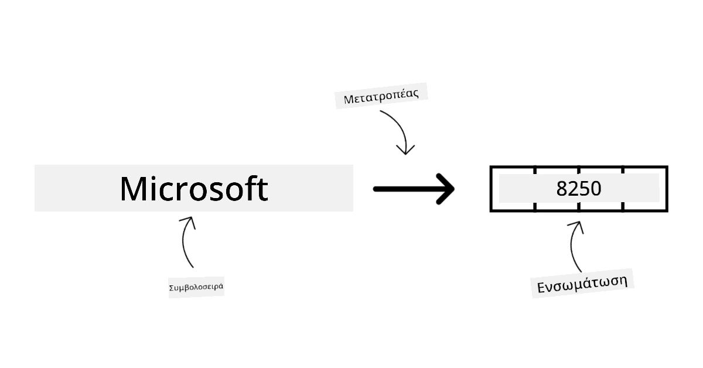

Τα μοντέλα δημιουργίας εικόνων είναι μοντέλα που παράγουν εικόνες. Αυτά τα μοντέλα χρησιμοποιούνται συχνά για επεξεργασία εικόνας, σύνθεση εικόνας και μετάφραση εικόνας. Τα μοντέλα δημιουργίας εικόνων συχνά εκπαιδεύονται σε μεγάλα σύνολα δεδομένων εικόνων, όπως το [LAION-5B](https://laion.ai/blog/laion-5b/?WT.mc_id=academic-105485-koreyst), και μπορούν να χρησιμοποιηθούν για να δημιουργήσουν νέες εικόνες ή να επεξεργαστούν υπάρχουσες εικόνες με τεχνικές όπως inpainting, super-resolution και χρωματισμός. Παραδείγματα περιλαμβάνουν τα [GPT Image models](https://platform.openai.com/docs/guides/images?WT.mc_id=academic-105485-koreyst), τα [μοντέλα Stable Diffusion](https://github.com/Stability-AI/StableDiffusion?WT.mc_id=academic-105485-koreyst) και τα μοντέλα Imagen.

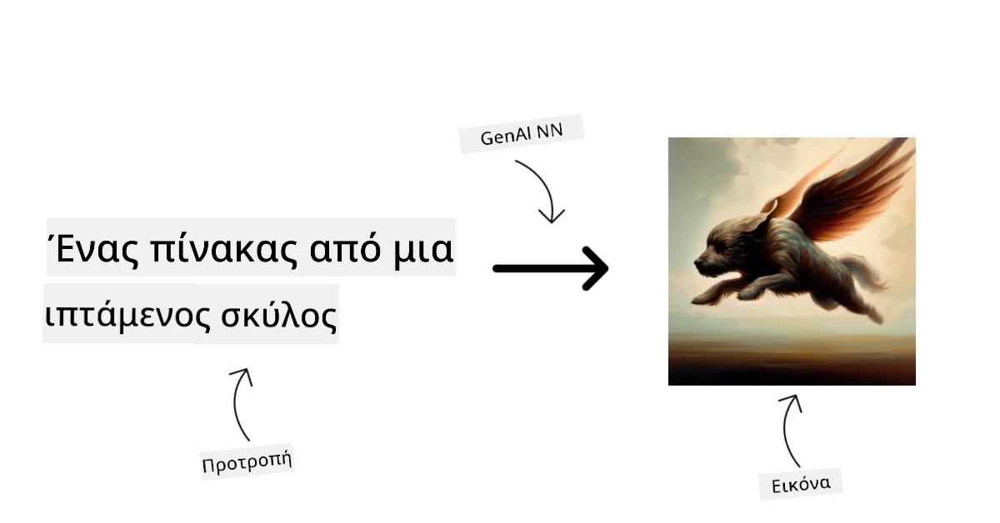

Τα μοντέλα δημιουργίας κειμένου και κώδικα είναι μοντέλα που παράγουν κείμενο ή κώδικα. Αυτά τα μοντέλα χρησιμοποιούνται συχνά για σύνοψη κειμένου, μετάφραση και απάντηση σε ερωτήσεις. Τα μοντέλα δημιουργίας κειμένου συχνά εκπαιδεύονται σε μεγάλα σύνολα δεδομένων κειμένου, όπως το [BookCorpus](https://www.cv-foundation.org/openaccess/content_iccv_2015/html/Zhu_Aligning_Books_and_ICCV_2015_paper.html?WT.mc_id=academic-105485-koreyst), και μπορούν να χρησιμοποιηθούν για να δημιουργήσουν νέο κείμενο ή να απαντήσουν σε ερωτήσεις. Τα μοντέλα δημιουργίας κώδικα, όπως το [CodeParrot](https://huggingface.co/codeparrot?WT.mc_id=academic-105485-koreyst), συνήθως εκπαιδεύονται σε μεγάλα σύνολα δεδομένων κώδικα, όπως το GitHub, και μπορούν να χρησιμοποιηθούν για να δημιουργήσουν νέο κώδικα ή να διορθώσουν σφάλματα σε υπάρχοντα κώδικα.

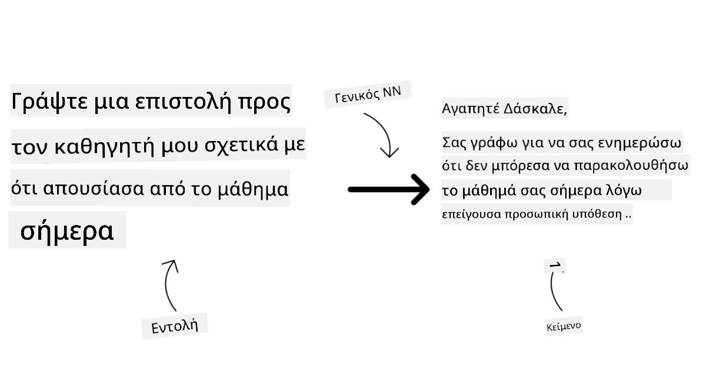

### Μοντέλα αποκωδικοποιητή έναντι μοντέλων κωδικοποιητή-αποκωδικοποιητή

Για να μιλήσουμε για τους διαφορετικούς τύπους αρχιτεκτονικής των LLMs, ας χρησιμοποιήσουμε μια αναλογία.

Φανταστείτε ότι ο διευθυντής σας ανέθεσε ένα έργο για να γράψετε ένα quiz για τους μαθητές. Έχετε δύο συναδέλφους· ο ένας επιβλέπει τη δημιουργία του περιεχομένου και ο άλλος την αναθεώρηση.

Ο δημιουργός περιεχομένου είναι σαν ένα μοντέλο αποκωδικοποιητή μόνο: μπορεί να δει το θέμα, να δει τι έχετε ήδη γράψει, και μετά να συνεχίσει να δημιουργεί περιεχόμενο βάσει αυτού του συμφραζομένου. Είναι πολύ καλός στο να γράφει ελκυστικό και ενημερωτικό περιεχόμενο, αλλά δεν είναι πάντα η καλύτερη επιλογή όταν η εργασία είναι μόνο ταξινόμηση, ανάκτηση ή κωδικοποίηση πληροφοριών. Παραδείγματα οικογενειών μοντέλων αποκωδικοποιητή μόνο περιλαμβάνουν τα μοντέλα GPT και Llama.

Ο αναθεωρητής είναι σαν μοντέλο μόνο κωδικοποιητή, βλέπει το γραπτό μάθημα και τις απαντήσεις, παρατηρεί τη σχέση μεταξύ τους και κατανοεί το συμφραζόμενο, αλλά δεν είναι καλός στη δημιουργία περιεχομένου. Ένα παράδειγμα μοντέλου μόνο κωδικοποιητή θα ήταν το BERT.

Φανταστείτε ότι μπορούμε να έχουμε κάποιον που θα μπορούσε να δημιουργήσει και να αναθεωρήσει το quiz, αυτό είναι ένα μοντέλο κωδικοποιητή-αποκωδικοποιητή. Μερικά παραδείγματα θα ήταν τα BART και T5.

### Υπηρεσία έναντι Μοντέλου

Τώρα, ας μιλήσουμε για τη διαφορά μεταξύ μιας υπηρεσίας και ενός μοντέλου. Μια υπηρεσία είναι ένα προϊόν που προσφέρεται από έναν πάροχο υπηρεσιών cloud, και συχνά είναι ένας συνδυασμός μοντέλων, δεδομένων και άλλων στοιχείων. Ένα μοντέλο είναι ο βασικός πυρήνας μιας υπηρεσίας και συχνά ένα foundation model, όπως ένα LLM.

Οι υπηρεσίες συχνά είναι βελτιστοποιημένες για παραγωγική χρήση και είναι συχνά πιο εύκολες στη χρήση από τα μοντέλα, μέσω γραφικού περιβάλλοντος χρήστη. Ωστόσο, οι υπηρεσίες δεν είναι πάντα διαθέσιμες δωρεάν και μπορεί να απαιτούν συνδρομή ή πληρωμή για χρήση, με αντάλλαγμα τη χρήση του εξοπλισμού και των πόρων του ιδιοκτήτη της υπηρεσίας, βελτιστοποιώντας τα έξοδα και επιτρέποντας εύκολη κλιμάκωση. Ένα παράδειγμα υπηρεσίας είναι το [Azure OpenAI Service](https://learn.microsoft.com/azure/ai-services/openai/overview?WT.mc_id=academic-105485-koreyst), που προσφέρει τιμολογιακή πολιτική pay-as-you-go, δηλαδή οι χρήστες χρεώνονται αναλογικά με το πόσο χρησιμοποιούν την υπηρεσία. Το Azure OpenAI Service προσφέρει επίσης ασφάλεια επιχειρηματικού επιπέδου και ένα υπεύθυνο πλαίσιο AI πάνω από τις δυνατότητες των μοντέλων.

Τα μοντέλα είναι τα τεχνουργήματα του νευρωνικού δικτύου: παράμετροι, βάρη, αρχιτεκτονική, tokenizer και υποστηρικτική διαμόρφωση. Η εκτέλεση ενός μοντέλου τοπικά ή σε ιδιωτικό περιβάλλον απαιτεί κατάλληλο υλικό, υποδομή παροχής υπηρεσιών, παρακολούθηση και είτε άδεια συμβατή με open-source/open-weight είτε εμπορική άδεια. Τα μοντέλα ανοιχτού βάρους όπως τα Llama 4 ή τα μοντέλα Mistral μπορούν να φιλοξενηθούν αυτόνομα, αλλά απαιτούν υπολογιστική ισχύ και τεχνογνωσία λειτουργίας.

## Πώς να δοκιμάσετε και να επαναλάβετε με διαφορετικά μοντέλα για να κατανοήσετε την απόδοση στο Azure

Μόλις η ομάδα μας εξερευνήσει το τρέχον τοπίο των LLMs και εντοπίσει μερικούς καλούς υποψηφίους για τα σενάριά τους, το επόμενο βήμα είναι η δοκιμή τους στα δεδομένα και στον φόρτο εργασίας τους. Αυτή είναι μια επαναληπτική διαδικασία, που γίνεται με πειράματα και μετρήσεις.
Τα περισσότερα από τα μοντέλα που αναφέραμε στα προηγούμενα παραγράφους (μοντέλα OpenAI, μοντέλα ανοικτού βάρους όπως τα Llama 4 και Mistral, και μοντέλα Hugging Face) είναι διαθέσιμα στο [Microsoft Foundry Models](https://learn.microsoft.com/azure/foundry/concepts/foundry-models-overview?WT.mc_id=academic-105485-koreyst).

Το [Microsoft Foundry](https://learn.microsoft.com/azure/foundry/what-is-foundry?WT.mc_id=academic-105485-koreyst), πρώην Azure AI Studio/Azure AI Foundry, είναι μια ενοποιημένη πλατφόρμα Azure για τη δημιουργία εφαρμογών και πρακτόρων AI. Βοηθά τους προγραμματιστές να διαχειρίζονται τον κύκλο ζωής από τα πειράματα και την αξιολόγηση έως την ανάπτυξη, την παρακολούθηση και τη διοίκηση. Ο κατάλογος μοντέλων στο Microsoft Foundry επιτρέπει στον χρήστη να:

- Βρεί το θεμελιώδες μοντέλο ενδιαφέροντος στον κατάλογο, συμπεριλαμβανομένων μοντέλων που πωλούνται από το Azure και μοντέλων από εταίρους και παρόχους της κοινότητας. Οι χρήστες μπορούν να φιλτράρουν κατά εργασία, πάροχο, άδεια, επιλογή ανάπτυξης ή όνομα.

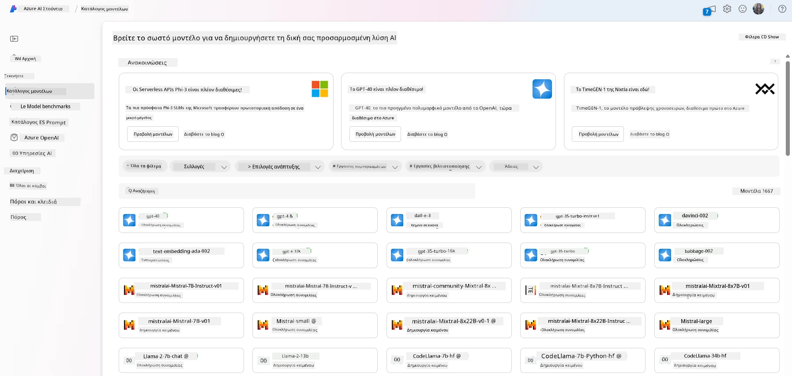

- Εξετάσουν την κάρτα μοντέλου, που περιλαμβάνει λεπτομερή περιγραφή προοριζόμενης χρήσης και δεδομένα εκπαίδευσης, παραδείγματα κώδικα και αποτελέσματα αξιολόγησης στη βιβλιοθήκη εσωτερικών αξιολογήσεων.

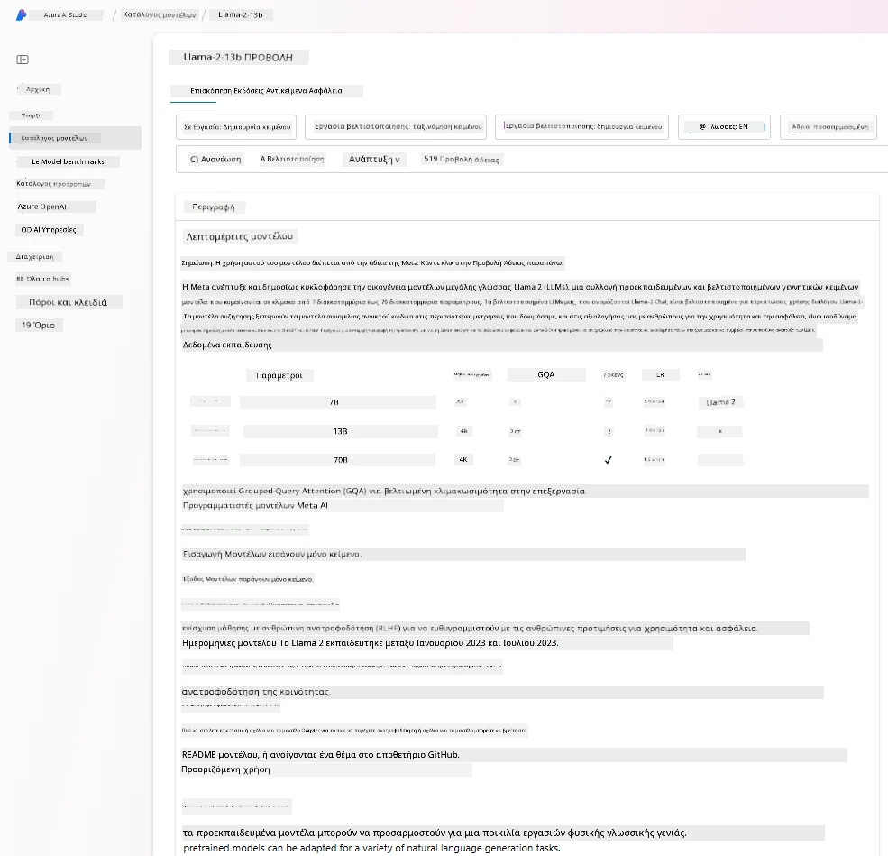

- Συγκρίνουν benchmarks μεταξύ μοντέλων και συνόλων δεδομένων που είναι διαθέσιμα στη βιομηχανία για να αξιολογήσουν ποιο καλύπτει το επιχειρηματικό σενάριο, μέσω του πίνακα [Model Benchmarks](https://learn.microsoft.com/azure/ai-studio/how-to/model-benchmarks?WT.mc_id=academic-105485-koreyst).

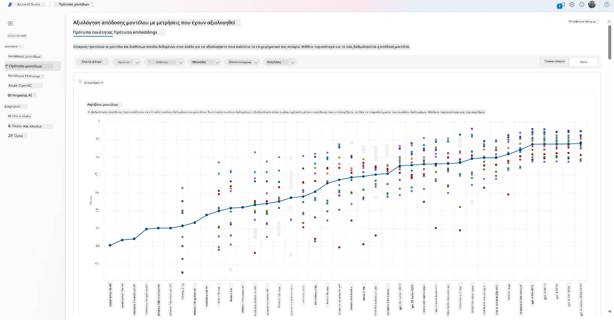

- Βελτιστοποιούν (fine-tune) υποστηριζόμενα μοντέλα με προσαρμοσμένα δεδομένα εκπαίδευσης για να βελτιώσουν την απόδοση του μοντέλου σε συγκεκριμένο φόρτο εργασίας, αξιοποιώντας τις δυνατότητες πειραματισμού και παρακολούθησης του Microsoft Foundry.

- Αναπτύσσουν το αρχικό προ-εκπαιδευμένο μοντέλο ή την έκδοση που έχει fine-tune σε απομακρυσμένο σημείο inference σε πραγματικό χρόνο, χρησιμοποιώντας διαχειριζόμενες υπολογιστικές ή serverless επιλογές ανάπτυξης, για να επιτρέψουν στις εφαρμογές να το καταναλώσουν.

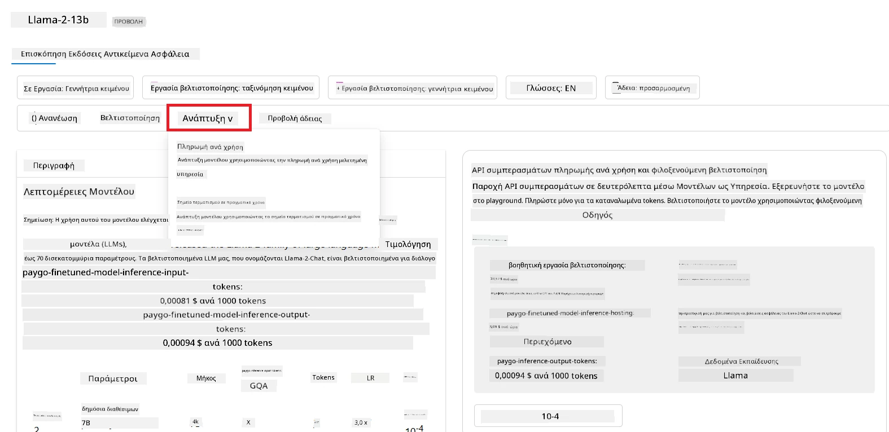

> [!NOTE]
> Δεν είναι όλα τα μοντέλα στον κατάλογο αυτή τη στιγμή διαθέσιμα για fine-tuning και/ή ανάπτυξη pay-as-you-go. Ελέγξτε την κάρτα μοντέλου για λεπτομέρειες σχετικά με τις δυνατότητες και τους περιορισμούς του μοντέλου.

## Βελτίωση αποτελεσμάτων LLM

Η ομάδα μας startup έχει εξερευνήσει διάφορα είδη LLM και μια πλατφόρμα cloud (Microsoft Foundry) που μας επιτρέπει να συγκρίνουμε διαφορετικά μοντέλα, να τα αξιολογούμε σε δεδομένα δοκιμών, να βελτιώνουμε την απόδοση και να τα αναπτύσσουμε σε endpoints inference.

Αλλά πότε πρέπει να σκεφτούν να κάνουν fine-tune σε ένα μοντέλο αντί να χρησιμοποιήσουν ένα προεκπαιδευμένο; Υπάρχουν άλλες προσεγγίσεις για να βελτιώσουν την απόδοση ενός μοντέλου σε συγκεκριμένους φόρτους εργασίας;

Υπάρχουν αρκετές προσεγγίσεις που μια επιχείρηση μπορεί να χρησιμοποιήσει για να πάρει τα αποτελέσματα που χρειάζεται από ένα LLM. Μπορείτε να επιλέξετε διαφορετικούς τύπους μοντέλων με διάφορους βαθμούς εκπαίδευσης όταν αναπτύσσετε ένα LLM σε παραγωγή, με διάφορα επίπεδα πολυπλοκότητας, κόστους και ποιότητας. Εδώ είναι μερικές διαφορετικές προσεγγίσεις:

- **Μηχανική προτροπής με συμφραζόμενα**. Η ιδέα είναι να παρέχετε αρκετό πλαίσιο όταν κάνετε την προτροπή για να εξασφαλίσετε ότι θα πάρετε τις απαντήσεις που χρειάζεστε.

- **Retrieval Augmented Generation, RAG**. Τα δεδομένα σας μπορεί να βρίσκονται σε βάση δεδομένων ή σε web endpoint, για παράδειγμα, για να διασφαλίσετε ότι αυτά τα δεδομένα, ή ένα υποσύνολό τους, περιλαμβάνονται τη στιγμή της προτροπής, μπορείτε να ανακτήσετε τα σχετικά δεδομένα και να τα κάνετε μέρος της προτροπής χρήστη.

- **Fine-tuned μοντέλο**. Εδώ, εκπαιδεύσατε περαιτέρω το μοντέλο με τα δικά σας δεδομένα, κάτι που οδήγησε το μοντέλο να είναι πιο ακριβές και ανταποκρινόμενο στις ανάγκες σας, αλλά μπορεί να είναι ακριβό.

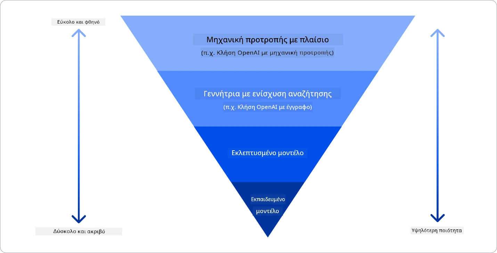

Πηγή εικόνας: [Four Ways that Enterprises Deploy LLMs | Fiddler AI Blog](https://www.fiddler.ai/blog/four-ways-that-enterprises-deploy-llms?WT.mc_id=academic-105485-koreyst)

### Μηχανική Προτροπής με Συμφραζόμενα

Τα προ-εκπαιδευμένα LLM δουλεύουν πολύ καλά σε γενικευμένες εργασίες φυσικής γλώσσας, ακόμα και αν απλά τα καλέσετε με μια σύντομη προτροπή, όπως μια πρόταση προς συμπλήρωση ή μια ερώτηση – το λεγόμενο “zero-shot” μάθημα.

Ωστόσο, όσο περισσότερο μπορεί ο χρήστης να πλαισιώσει το ερώτημά του, με λεπτομερή αίτηση και παραδείγματα – το Πλαίσιο (Context) – τόσο πιο ακριβής και πιο κοντά στις προσδοκίες του χρήστη θα είναι η απάντηση. Σε αυτή την περίπτωση, μιλάμε για “one-shot” μάθηση αν η προτροπή περιλαμβάνει μόνο ένα παράδειγμα και “few shot learning” αν περιέχει πολλαπλά παραδείγματα.
Η μηχανική προτροπής με συμφραζόμενα είναι η πιο αποδοτική σε κόστος προσέγγιση για να ξεκινήσετε.

### Retrieval Augmented Generation (RAG)

Τα LLM έχουν το περιορισμό ότι μπορούν να χρησιμοποιούν μόνο τα δεδομένα που έχουν χρησιμοποιηθεί κατά την εκπαίδευσή τους για να παράξουν μια απάντηση. Αυτό σημαίνει ότι δεν γνωρίζουν τίποτε για τα γεγονότα που συνέβησαν μετά τη διαδικασία εκπαίδευσής τους, και δεν μπορούν να έχουν πρόσβαση σε μη δημόσιες πληροφορίες (όπως εταιρικά δεδομένα).
Αυτό μπορεί να ξεπεραστεί μέσω του RAG, μιας τεχνικής που ενισχύει την προτροπή με εξωτερικά δεδομένα με τη μορφή κομματιών εγγράφων, λαμβάνοντας υπόψη τους περιορισμούς μήκους προτροπής. Αυτό υποστηρίζεται από εργαλεία βάσης δεδομένων Vector (όπως το [Azure Vector Search](https://learn.microsoft.com/azure/search/vector-search-overview?WT.mc_id=academic-105485-koreyst)) που ανακτούν τα χρήσιμα κομμάτια από ποικίλες προκαθορισμένες πηγές δεδομένων και τα προσθέτουν στο πλαίσιο της προτροπής.

Αυτή η τεχνική είναι πολύ χρήσιμη όταν μια επιχείρηση δεν έχει επαρκή δεδομένα, χρόνο ή πόρους για fine-tuning ενός LLM, αλλά ακόμα επιθυμεί να βελτιώσει την απόδοση σε έναν συγκεκριμένο φόρτο εργασίας και να μειώσει τους κινδύνους από παραπλανητικές, παρωχημένες ή ανεπαρκείς απαντήσεις.

### Fine-tuned μοντέλο

Το fine-tuning είναι μια διαδικασία που αξιοποιεί τη μεταφορά μάθησης για να ‘προσαρμόσει’ το μοντέλο σε μια υποκείμενη εργασία ή για να λύσει ένα συγκεκριμένο πρόβλημα. Σε αντίθεση με το few-shot learning και το RAG, οδηγεί στη δημιουργία ενός νέου μοντέλου, με ενημερωμένα βάρη και προκαταλήψεις. Απαιτεί ένα σύνολο παραδειγμάτων εκπαίδευσης που αποτελείται από μια μεμονωμένη είσοδο (την προτροπή) και το αντίστοιχο αποτέλεσμα (τη συμπλήρωση).
Αυτή θα ήταν η προτιμώμενη προσέγγιση αν:

- **Χρήση μικρότερων μοντέλων ειδικών εργασιών**. Μια επιχείρηση θα ήθελε να κάνει fine-tune ένα μικρότερο μοντέλο για μια στενή εργασία αντί να κάνει συνεχείς προτροπές σε ένα μεγαλύτερο μοντέλο frontier, οδηγώντας σε πιο οικονομική και ταχύτερη λύση.

- **Λαμβάνοντας υπόψη τη λανθάνουσα κατάσταση**. Η λανθάνουσα κατάσταση είναι σημαντική για μια συγκεκριμένη περίπτωση χρήσης, οπότε δεν είναι δυνατό να χρησιμοποιηθούν πολύ μακρές προτροπές ή ο αριθμός των παραδειγμάτων που πρέπει να μάθει το μοντέλο δεν ταιριάζει με το όριο μήκους της προτροπής.

- **Προσαρμογή σταθερής συμπεριφοράς**. Μια επιχείρηση έχει πολλά παραδείγματα υψηλής ποιότητας και θέλει το μοντέλο να ακολουθεί συνεπώς ένα μοτίβο εργασίας, μορφοποίηση εξόδου, τόνο ή στυλ συγκεκριμένο στον τομέα. Αν το κύριο πρόβλημα είναι φρέσκα στοιχεία ή ιδιωτική γνώση που αλλάζει συχνά, χρησιμοποιήστε το RAG αντί να βασιστείτε μόνο στο fine-tuning.

### Εκπαιδευμένο μοντέλο

Η εκπαίδευση ενός LLM από το μηδέν είναι αδιαμφισβήτητα η πιο δύσκολη και πιο σύνθετη προσέγγιση για υιοθέτηση, απαιτώντας τεράστιες ποσότητες δεδομένων, ειδικευμένους πόρους, και κατάλληλη υπολογιστική ισχύ. Αυτή η επιλογή πρέπει να θεωρείται μόνο σε ένα σενάριο όπου μια επιχείρηση έχει μια περίπτωση χρήσης ειδική στον τομέα και μεγάλη ποσότητα δεδομένων κεντρικών στον τομέα.

## Έλεγχος γνώσεων

Ποια θα μπορούσε να είναι μια καλή προσέγγιση για τη βελτίωση των αποτελεσμάτων ολοκλήρωσης LLM;

1. Μηχανική προτροπής με συμφραζόμενα
1. RAG
1. Fine-tuned μοντέλο

Α: Και οι τρεις μπορούν να βοηθήσουν. Ξεκινήστε με μηχανική προτροπής και συμφραζόμενα για γρήγορες βελτιώσεις, και χρησιμοποιήστε RAG όταν το μοντέλο χρειάζεται τρέχοντα στοιχεία ή ιδιωτικά επιχειρηματικά δεδομένα. Επιλέξτε fine-tuning όταν έχετε αρκετά παραδείγματα υψηλής ποιότητας και χρειάζεστε το μοντέλο να ακολουθεί σταθερά μια εργασία, μορφή, τόνο ή μοτίβο τομέα.

## 🚀 Πρόκληση

Διαβάστε περισσότερα για το πώς μπορείτε να [χρησιμοποιήσετε το RAG](https://learn.microsoft.com/azure/search/retrieval-augmented-generation-overview?WT.mc_id=academic-105485-koreyst) για την επιχείρησή σας.

## Καλή δουλειά, συνεχίστε τη μάθησή σας

Αφού ολοκληρώσετε αυτό το μάθημα, δείτε τη συλλογή μας [Generative AI Learning collection](https://aka.ms/genai-collection?WT.mc_id=academic-105485-koreyst) για να συνεχίσετε να αναβαθμίζετε τις γνώσεις σας στην Γενετική Τεχνητή Νοημοσύνη!

Μεταβείτε στο Μάθημα 3 όπου θα δούμε πώς να [χτίζουμε με υπευθυνότητα με τη Γενετική Τεχνητή Νοημοσύνη](../03-using-generative-ai-responsibly/README.md?WT.mc_id=academic-105485-koreyst)!

---

<!-- CO-OP TRANSLATOR DISCLAIMER START -->
**Αποποίηση ευθυνών**:
Αυτό το έγγραφο έχει μεταφραστεί χρησιμοποιώντας την υπηρεσία μετάφρασης με τεχνητή νοημοσύνη [Co-op Translator](https://github.com/Azure/co-op-translator). Ενώ επιδιώκουμε την ακρίβεια, παρακαλούμε να έχετε υπόψη ότι οι αυτοματοποιημένες μεταφράσεις ενδέχεται να περιέχουν λάθη ή ανακρίβειες. Το πρωτότυπο έγγραφο στη μητρική του γλώσσα πρέπει να θεωρείται η αυθεντική πηγή. Για κρίσιμες πληροφορίες, συνιστάται επαγγελματική ανθρώπινη μετάφραση. Δεν φέρουμε ευθύνη για τυχόν παρεξηγήσεις ή λανθασμένες ερμηνείες που προκύπτουν από τη χρήση αυτής της μετάφρασης.
<!-- CO-OP TRANSLATOR DISCLAIMER END -->