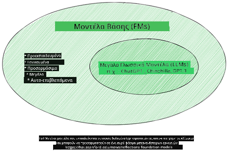
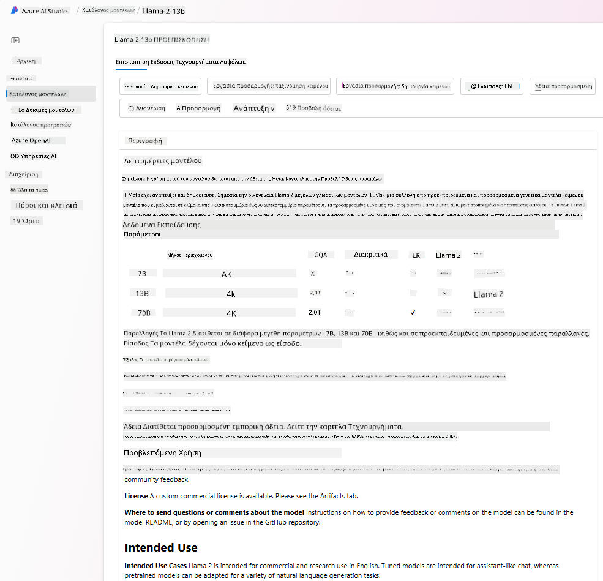
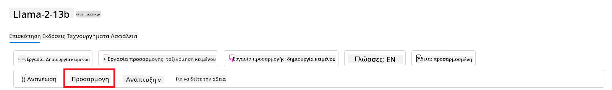
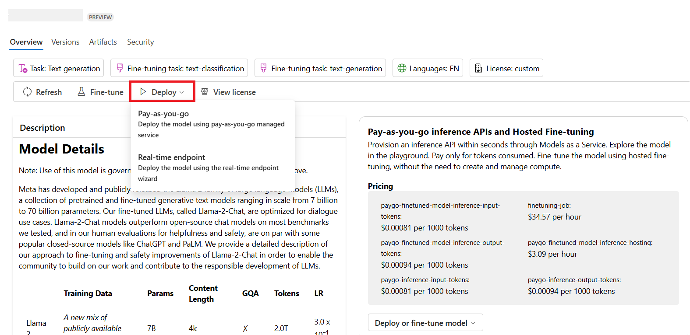

<!--
CO_OP_TRANSLATOR_METADATA:
{
  "original_hash": "e2f686f2eb794941761252ac5e8e090b",
  "translation_date": "2025-07-09T08:26:23+00:00",
  "source_file": "02-exploring-and-comparing-different-llms/README.md",
  "language_code": "el"
}
-->
# Εξερευνώντας και συγκρίνοντας διαφορετικά LLMs

> _Κάντε κλικ στην εικόνα παραπάνω για να δείτε το βίντεο αυτής της ενότητας_

Με το προηγούμενο μάθημα, είδαμε πώς η Γενετική Τεχνητή Νοημοσύνη αλλάζει το τεχνολογικό τοπίο, πώς λειτουργούν τα Μεγάλα Γλωσσικά Μοντέλα (LLMs) και πώς μια επιχείρηση - όπως το startup μας - μπορεί να τα εφαρμόσει στις περιπτώσεις χρήσης της και να αναπτυχθεί! Σε αυτό το κεφάλαιο, θα συγκρίνουμε και θα αντιπαραβάλουμε διαφορετικούς τύπους μεγάλων γλωσσικών μοντέλων (LLMs) για να κατανοήσουμε τα πλεονεκτήματα και τα μειονεκτήματά τους.

Το επόμενο βήμα στο ταξίδι του startup μας είναι να εξερευνήσουμε το τρέχον τοπίο των LLMs και να κατανοήσουμε ποια είναι κατάλληλα για την περίπτωσή μας.

## Εισαγωγή

Αυτό το μάθημα θα καλύψει:

- Διαφορετικούς τύπους LLMs στο τρέχον τοπίο.
- Δοκιμές, επαναλήψεις και σύγκριση διαφορετικών μοντέλων για την περίπτωσή σας στο Azure.
- Πώς να αναπτύξετε ένα LLM.

## Στόχοι μάθησης

Μετά την ολοκλήρωση αυτού του μαθήματος, θα μπορείτε να:

- Επιλέξετε το κατάλληλο μοντέλο για την περίπτωσή σας.
- Κατανοήσετε πώς να δοκιμάζετε, να επαναλαμβάνετε και να βελτιώνετε την απόδοση του μοντέλου σας.
- Γνωρίζετε πώς οι επιχειρήσεις αναπτύσσουν μοντέλα.

## Κατανόηση διαφορετικών τύπων LLMs

Τα LLMs μπορούν να κατηγοριοποιηθούν με βάση την αρχιτεκτονική τους, τα δεδομένα εκπαίδευσης και την περίπτωση χρήσης. Η κατανόηση αυτών των διαφορών θα βοηθήσει το startup μας να επιλέξει το κατάλληλο μοντέλο για το σενάριο και να κατανοήσει πώς να δοκιμάζει, να επαναλαμβάνει και να βελτιώνει την απόδοση.

Υπάρχουν πολλοί διαφορετικοί τύποι μοντέλων LLM, και η επιλογή σας εξαρτάται από το τι σκοπεύετε να τα χρησιμοποιήσετε, τα δεδομένα σας, πόσα είστε διατεθειμένοι να πληρώσετε και άλλα.

Ανάλογα με το αν σκοπεύετε να χρησιμοποιήσετε τα μοντέλα για κείμενο, ήχο, βίντεο, δημιουργία εικόνων κ.ά., μπορεί να επιλέξετε διαφορετικό τύπο μοντέλου.

- **Αναγνώριση ήχου και ομιλίας**. Για αυτόν τον σκοπό, τα μοντέλα τύπου Whisper είναι εξαιρετική επιλογή καθώς είναι γενικής χρήσης και στοχεύουν στην αναγνώριση ομιλίας. Έχουν εκπαιδευτεί σε ποικίλο ήχο και μπορούν να εκτελέσουν πολυγλωσσική αναγνώριση ομιλίας. Μάθετε περισσότερα για τα [μοντέλα τύπου Whisper εδώ](https://platform.openai.com/docs/models/whisper?WT.mc_id=academic-105485-koreyst).

- **Δημιουργία εικόνων**. Για δημιουργία εικόνων, τα DALL-E και Midjourney είναι δύο πολύ γνωστές επιλογές. Το DALL-E προσφέρεται από το Azure OpenAI. [Διαβάστε περισσότερα για το DALL-E εδώ](https://platform.openai.com/docs/models/dall-e?WT.mc_id=academic-105485-koreyst) και επίσης στο Κεφάλαιο 9 αυτού του προγράμματος σπουδών.

- **Δημιουργία κειμένου**. Τα περισσότερα μοντέλα έχουν εκπαιδευτεί για δημιουργία κειμένου και έχετε μεγάλη ποικιλία επιλογών από GPT-3.5 έως GPT-4. Έρχονται με διαφορετικό κόστος, με το GPT-4 να είναι το πιο ακριβό. Αξίζει να εξερευνήσετε το [Azure OpenAI playground](https://oai.azure.com/portal/playground?WT.mc_id=academic-105485-koreyst) για να αξιολογήσετε ποια μοντέλα ταιριάζουν καλύτερα στις ανάγκες σας όσον αφορά τις δυνατότητες και το κόστος.

- **Πολυμορφικότητα (Multi-modality)**. Αν θέλετε να χειριστείτε πολλαπλούς τύπους δεδομένων στην είσοδο και έξοδο, ίσως θελήσετε να εξετάσετε μοντέλα όπως [gpt-4 turbo με όραση ή gpt-4o](https://learn.microsoft.com/azure/ai-services/openai/concepts/models#gpt-4-and-gpt-4-turbo-models?WT.mc_id=academic-105485-koreyst) - τις πιο πρόσφατες εκδόσεις μοντέλων OpenAI - που μπορούν να συνδυάσουν την επεξεργασία φυσικής γλώσσας με την οπτική κατανόηση, επιτρέποντας αλληλεπιδράσεις μέσω πολυμορφικών διεπαφών.

Η επιλογή μοντέλου σημαίνει ότι αποκτάτε κάποιες βασικές δυνατότητες, που όμως μπορεί να μην είναι αρκετές. Συχνά έχετε εταιρικά δεδομένα που πρέπει να τα γνωστοποιήσετε στο LLM. Υπάρχουν μερικές διαφορετικές επιλογές για το πώς να το προσεγγίσετε, περισσότερα γι’ αυτό στις επόμενες ενότητες.

### Foundation Models έναντι LLMs

Ο όρος Foundation Model επινοήθηκε από [ερευνητές του Stanford](https://arxiv.org/abs/2108.07258?WT.mc_id=academic-105485-koreyst) και ορίστηκε ως ένα μοντέλο AI που πληροί ορισμένα κριτήρια, όπως:

- **Εκπαιδεύονται με μη επιβλεπόμενη ή αυτοεπιβλεπόμενη μάθηση**, δηλαδή εκπαιδεύονται σε μη επισημασμένα πολυμορφικά δεδομένα και δεν απαιτούν ανθρώπινη επισήμανση ή ετικετοποίηση για τη διαδικασία εκπαίδευσης.
- **Είναι πολύ μεγάλα μοντέλα**, βασισμένα σε πολύ βαθιά νευρωνικά δίκτυα εκπαιδευμένα σε δισεκατομμύρια παραμέτρους.
- **Συνήθως προορίζονται να λειτουργήσουν ως ‘βάση’ για άλλα μοντέλα**, δηλαδή μπορούν να χρησιμοποιηθούν ως αφετηρία για την κατασκευή άλλων μοντέλων μέσω fine-tuning.

Πηγή εικόνας: [Essential Guide to Foundation Models and Large Language Models | by Babar M Bhatti | Medium](https://thebabar.medium.com/essential-guide-to-foundation-models-and-large-language-models-27dab58f7404)

Για να διευκρινίσουμε περαιτέρω αυτή τη διάκριση, ας πάρουμε ως παράδειγμα το ChatGPT. Για να δημιουργηθεί η πρώτη έκδοση του ChatGPT, ένα μοντέλο που ονομάζεται GPT-3.5 χρησίμευσε ως foundation model. Αυτό σημαίνει ότι η OpenAI χρησιμοποίησε κάποια δεδομένα ειδικά για συνομιλίες ώστε να δημιουργήσει μια προσαρμοσμένη έκδοση του GPT-3.5 που ήταν εξειδικευμένη στο να αποδίδει καλά σε σενάρια συνομιλίας, όπως τα chatbots.

Πηγή εικόνας: [2108.07258.pdf (arxiv.org)](https://arxiv.org/pdf/2108.07258.pdf?WT.mc_id=academic-105485-koreyst)

### Ανοιχτού Κώδικα έναντι Ιδιόκτητων Μοντέλων

Ένας άλλος τρόπος κατηγοριοποίησης των LLMs είναι αν είναι ανοιχτού κώδικα ή ιδιόκτητα.

Τα ανοιχτού κώδικα μοντέλα είναι διαθέσιμα στο κοινό και μπορούν να χρησιμοποιηθούν από οποιονδήποτε. Συχνά διατίθενται από την εταιρεία που τα δημιούργησε ή από την ερευνητική κοινότητα. Αυτά τα μοντέλα επιτρέπεται να ελέγχονται, να τροποποιούνται και να προσαρμόζονται για διάφορες περιπτώσεις χρήσης. Ωστόσο, δεν είναι πάντα βελτιστοποιημένα για παραγωγική χρήση και μπορεί να μην έχουν την ίδια απόδοση με τα ιδιόκτητα μοντέλα. Επιπλέον, η χρηματοδότηση για τα ανοιχτού κώδικα μοντέλα μπορεί να είναι περιορισμένη, και μπορεί να μην συντηρούνται μακροπρόθεσμα ή να μην ενημερώνονται με τις πιο πρόσφατες έρευνες. Παραδείγματα δημοφιλών ανοιχτού κώδικα μοντέλων είναι τα [Alpaca](https://crfm.stanford.edu/2023/03/13/alpaca.html?WT.mc_id=academic-105485-koreyst), [Bloom](https://huggingface.co/bigscience/bloom) και [LLaMA](https://llama.meta.com).

Τα ιδιόκτητα μοντέλα ανήκουν σε εταιρείες και δεν είναι διαθέσιμα στο κοινό. Συχνά είναι βελτιστοποιημένα για παραγωγική χρήση. Ωστόσο, δεν επιτρέπεται να ελέγχονται, να τροποποιούνται ή να προσαρμόζονται για διαφορετικές περιπτώσεις χρήσης. Επιπλέον, δεν είναι πάντα δωρεάν και μπορεί να απαιτούν συνδρομή ή πληρωμή για χρήση. Οι χρήστες δεν έχουν έλεγχο στα δεδομένα που χρησιμοποιούνται για την εκπαίδευση του μοντέλου, οπότε πρέπει να εμπιστεύονται τον ιδιοκτήτη του μοντέλου για τη διασφάλιση της προστασίας δεδομένων και της υπεύθυνης χρήσης της AI. Παραδείγματα δημοφιλών ιδιόκτητων μοντέλων είναι τα [μοντέλα OpenAI](https://platform.openai.com/docs/models/overview?WT.mc_id=academic-105485-koreyst), [Google Bard](https://sapling.ai/llm/bard?WT.mc_id=academic-105485-koreyst) ή [Claude 2](https://www.anthropic.com/index/claude-2?WT.mc_id=academic-105485-koreyst).

### Ενσωμάτωση (Embedding) έναντι Δημιουργίας Εικόνας έναντι Δημιουργίας Κειμένου και Κώδικα

Τα LLMs μπορούν επίσης να κατηγοριοποιηθούν ανάλογα με το είδος της εξόδου που παράγουν.

Τα embeddings είναι μοντέλα που μετατρέπουν το κείμενο σε αριθμητική μορφή, που ονομάζεται embedding, δηλαδή μια αριθμητική αναπαράσταση του εισαγόμενου κειμένου. Τα embeddings διευκολύνουν τις μηχανές να κατανοήσουν τις σχέσεις μεταξύ λέξεων ή προτάσεων και μπορούν να χρησιμοποιηθούν ως είσοδοι από άλλα μοντέλα, όπως μοντέλα ταξινόμησης ή ομαδοποίησης που έχουν καλύτερη απόδοση σε αριθμητικά δεδομένα. Τα μοντέλα embedding χρησιμοποιούνται συχνά για μεταφορά μάθησης, όπου ένα μοντέλο κατασκευάζεται για μια βοηθητική εργασία με άφθονα δεδομένα και στη συνέχεια τα βάρη του μοντέλου (embeddings) επαναχρησιμοποιούνται για άλλες εργασίες. Ένα παράδειγμα αυτής της κατηγορίας είναι τα [OpenAI embeddings](https://platform.openai.com/docs/models/embeddings?WT.mc_id=academic-105485-koreyst).

Τα μοντέλα δημιουργίας εικόνων παράγουν εικόνες. Συχνά χρησιμοποιούνται για επεξεργασία εικόνας, σύνθεση εικόνας και μετάφραση εικόνας. Εκπαιδεύονται σε μεγάλα σύνολα δεδομένων εικόνων, όπως το [LAION-5B](https://laion.ai/blog/laion-5b/?WT.mc_id=academic-105485-koreyst), και μπορούν να δημιουργήσουν νέες εικόνες ή να επεξεργαστούν υπάρχουσες με τεχνικές όπως inpainting, υπερ-ανάλυση και χρωματισμό. Παραδείγματα είναι τα [DALL-E-3](https://openai.com/dall-e-3?WT.mc_id=academic-105485-koreyst) και τα [Stable Diffusion models](https://github.com/Stability-AI/StableDiffusion?WT.mc_id=academic-105485-koreyst).

Τα μοντέλα δημιουργίας κειμένου και κώδικα παράγουν κείμενο ή κώδικα. Χρησιμοποιούνται συχνά για περίληψη κειμένου, μετάφραση και απάντηση σε ερωτήσεις. Εκπαιδεύονται σε μεγάλα σύνολα δεδομένων κειμένου, όπως το [BookCorpus](https://www.cv-foundation.org/openaccess/content_iccv_2015/html/Zhu_Aligning_Books_and_ICCV_2015_paper.html?WT.mc_id=academic-105485-koreyst), και μπορούν να δημιουργήσουν νέο κείμενο ή να απαντήσουν σε ερωτήσεις. Τα μοντέλα δημιουργίας κώδικα, όπως το [CodeParrot](https://huggingface.co/codeparrot?WT.mc_id=academic-105485-koreyst), εκπαιδεύονται σε μεγάλα σύνολα δεδομένων κώδικα, όπως το GitHub, και μπορούν να δημιουργήσουν νέο κώδικα ή να διορθώσουν σφάλματα σε υπάρχοντα.

### Encoder-Decoder έναντι Decoder-only

Για να μιλήσουμε για τους διαφορετικούς τύπους αρχιτεκτονικής των LLMs, ας χρησιμοποιήσουμε μια αναλογία.

Φανταστείτε ότι ο διευθυντής σας σας ανέθεσε να γράψετε ένα κουίζ για τους μαθητές. Έχετε δύο συναδέλφους· ο ένας επιβλέπει τη δημιουργία του περιεχομένου και ο άλλος την αναθεώρησή του.

Ο δημιουργός περιεχομένου είναι σαν μοντέλο μόνο Decoder, μπορεί να δει το θέμα και τι έχετε ήδη γράψει και μετά να γράψει ένα μάθημα βασισμένο σε αυτό. Είναι πολύ καλός στο να γράφει ελκυστικό και ενημερωτικό περιεχόμενο, αλλά δεν είναι πολύ καλός στο να κατανοεί το θέμα και τους μαθησιακούς στόχους. Παραδείγματα μοντέλων Decoder είναι τα μοντέλα της οικογένειας GPT, όπως το GPT-3.

Ο αναθεωρητής είναι σαν μοντέλο μόνο Encoder, κοιτάζει το γραμμένο μάθημα και τις απαντήσεις, παρατηρεί τη σχέση μεταξύ τους και κατανοεί το πλαίσιο, αλλά δεν είναι καλός στη δημιουργία περιεχομένου. Ένα παράδειγμα μοντέλου μόνο Encoder είναι το BERT.

Φανταστείτε ότι μπορούμε να έχουμε κάποιον που να μπορεί και να δημιουργεί και να αναθεωρεί το κουίζ, αυτό είναι ένα μοντέλο Encoder-Decoder. Παραδείγματα είναι τα BART και T5.

### Υπηρεσία έναντι Μοντέλου

Τώρα, ας μιλήσουμε για τη διαφορά μεταξύ υπηρεσίας και μοντέλου. Μια υπηρεσία είναι ένα προϊόν που προσφέρεται από έναν πάροχο Cloud, και συχνά είναι ένας συνδυασμός μοντέλων, δεδομένων και άλλων στοιχείων. Ένα μοντέλο είναι ο βασικός πυρήνας μιας υπηρεσίας, και συνήθως είναι ένα foundation model, όπως ένα LLM.

Οι υπηρεσίες είναι συχνά βελτιστοποιημένες για παραγωγική χρήση και είναι πιο εύκολες στη χρήση από τα μοντέλα, μέσω γραφικής διεπαφής. Ωστόσο, οι υπηρεσίες δεν είναι πάντα δωρεάν και μπορεί να απαιτούν συνδρομή ή πληρωμή, σε αντάλλαγμα για τη χρήση του εξοπλισμού και των πόρων του παρόχου, βελτιστοποιώντας τα έξοδα και διευκολύνοντας την κλιμάκωση. Ένα παράδειγμα υπηρεσίας είναι το [Azure OpenAI Service](https://learn.microsoft.com/azure/ai-services/openai/overview?WT.mc_id=academic-105485-koreyst), που προσφέρει χρέωση pay-as-you-go, δηλαδή οι χρήστες χρεώνονται ανάλογα με τη χρήση της υπηρεσίας. Επιπλέον, το Azure OpenAI Service προσφέρει ασφάλεια επιπέδου επιχείρησης και ένα πλαίσιο υπεύθυνης AI πάνω από τις δυνατότητες των μοντέλων.

Τα μοντέλα είναι απλώς το Νευρωνικό Δίκτυο, με τις παραμέτρους, τα βάρη και άλλα. Επιτρέπουν στις εταιρείες να τρέχουν τοπικά, αλλά θα χρειαστεί να αγοράσουν εξοπλισμό, να δημιουργήσουν υποδομή για κλιμάκωση και να
Οι περισσότερες από τις μοντέλα που αναφέραμε στα προηγούμενα παραγράφους (μοντέλα OpenAI, ανοιχτού κώδικα μοντέλα όπως το Llama2, και transformers του Hugging Face) είναι διαθέσιμα στον [Κατάλογο Μοντέλων](https://learn.microsoft.com/azure/ai-studio/how-to/model-catalog-overview?WT.mc_id=academic-105485-koreyst) στο [Azure AI Studio](https://ai.azure.com/?WT.mc_id=academic-105485-koreyst).

Το [Azure AI Studio](https://learn.microsoft.com/azure/ai-studio/what-is-ai-studio?WT.mc_id=academic-105485-koreyst) είναι μια πλατφόρμα στο Cloud σχεδιασμένη για προγραμματιστές, ώστε να δημιουργούν εφαρμογές γεννητικής AI και να διαχειρίζονται ολόκληρο τον κύκλο ανάπτυξης – από την πειραματική φάση μέχρι την αξιολόγηση – συνδυάζοντας όλες τις υπηρεσίες Azure AI σε ένα ενιαίο κέντρο με ένα εύχρηστο γραφικό περιβάλλον. Ο Κατάλογος Μοντέλων στο Azure AI Studio επιτρέπει στον χρήστη να:

- Βρει το Foundation Model που τον ενδιαφέρει στον κατάλογο – είτε ιδιόκτητο είτε ανοιχτού κώδικα, φιλτράροντας ανά εργασία, άδεια χρήσης ή όνομα. Για να βελτιωθεί η αναζήτηση, τα μοντέλα οργανώνονται σε συλλογές, όπως η συλλογή Azure OpenAI, η συλλογή Hugging Face, και άλλες.

- Εξετάσει την κάρτα μοντέλου, που περιλαμβάνει λεπτομερή περιγραφή της προοριζόμενης χρήσης και των δεδομένων εκπαίδευσης, παραδείγματα κώδικα και αποτελέσματα αξιολόγησης στη βιβλιοθήκη εσωτερικών αξιολογήσεων.

- Συγκρίνει benchmarks ανάμεσα σε μοντέλα και σύνολα δεδομένων που είναι διαθέσιμα στη βιομηχανία, για να αξιολογήσει ποιο καλύπτει καλύτερα το επιχειρηματικό σενάριο, μέσω του πίνακα [Model Benchmarks](https://learn.microsoft.com/azure/ai-studio/how-to/model-benchmarks?WT.mc_id=academic-105485-koreyst).

- Κάνει fine-tuning στο μοντέλο με προσαρμοσμένα δεδομένα εκπαίδευσης για να βελτιώσει την απόδοση σε συγκεκριμένο φόρτο εργασίας, αξιοποιώντας τις δυνατότητες πειραματισμού και παρακολούθησης του Azure AI Studio.

- Αναπτύσσει το αρχικό προεκπαιδευμένο μοντέλο ή την έκδοση με fine-tuning σε απομακρυσμένο endpoint πραγματικού χρόνου – managed compute – ή serverless API endpoint – [pay-as-you-go](https://learn.microsoft.com/azure/ai-studio/how-to/model-catalog-overview#model-deployment-managed-compute-and-serverless-api-pay-as-you-go?WT.mc_id=academic-105485-koreyst) – ώστε οι εφαρμογές να μπορούν να το χρησιμοποιούν.

> [!NOTE]
> Δεν είναι όλα τα μοντέλα στον κατάλογο διαθέσιμα προς fine-tuning και/ή ανάπτυξη με pay-as-you-go. Ελέγξτε την κάρτα μοντέλου για λεπτομέρειες σχετικά με τις δυνατότητες και τους περιορισμούς του μοντέλου.

## Βελτίωση αποτελεσμάτων LLM

Έχουμε εξερευνήσει με την ομάδα startup μας διάφορους τύπους LLM και μια πλατφόρμα Cloud (Azure Machine Learning) που μας επιτρέπει να συγκρίνουμε διαφορετικά μοντέλα, να τα αξιολογούμε σε δοκιμαστικά δεδομένα, να βελτιώνουμε την απόδοσή τους και να τα αναπτύσσουμε σε endpoints για inference.

Αλλά πότε πρέπει να σκεφτεί κάποιος να κάνει fine-tuning σε ένα μοντέλο αντί να χρησιμοποιήσει ένα προεκπαιδευμένο; Υπάρχουν άλλες μέθοδοι για να βελτιωθεί η απόδοση ενός μοντέλου σε συγκεκριμένους φόρτους εργασίας;

Υπάρχουν αρκετές προσεγγίσεις που μια επιχείρηση μπορεί να χρησιμοποιήσει για να πάρει τα αποτελέσματα που χρειάζεται από ένα LLM. Μπορείτε να επιλέξετε διαφορετικούς τύπους μοντέλων με διαφορετικό βαθμό εκπαίδευσης όταν αναπτύσσετε ένα LLM σε παραγωγή, με διαφορετικά επίπεδα πολυπλοκότητας, κόστους και ποιότητας. Ακολουθούν μερικές διαφορετικές προσεγγίσεις:

- **Prompt engineering με πλαίσιο (context)**. Η ιδέα είναι να παρέχετε αρκετό πλαίσιο όταν κάνετε prompt, ώστε να εξασφαλίσετε ότι θα λάβετε τις απαντήσεις που χρειάζεστε.

- **Retrieval Augmented Generation, RAG**. Τα δεδομένα σας μπορεί να υπάρχουν σε μια βάση δεδομένων ή σε web endpoint, για παράδειγμα, και για να εξασφαλίσετε ότι αυτά τα δεδομένα, ή ένα υποσύνολό τους, περιλαμβάνονται τη στιγμή του prompt, μπορείτε να ανακτήσετε τα σχετικά δεδομένα και να τα ενσωματώσετε στο prompt του χρήστη.

- **Fine-tuned μοντέλο**. Εδώ, έχετε εκπαιδεύσει περαιτέρω το μοντέλο με δικά σας δεδομένα, κάτι που κάνει το μοντέλο πιο ακριβές και ανταποκρινόμενο στις ανάγκες σας, αλλά μπορεί να είναι δαπανηρό.

Πηγή εικόνας: [Four Ways that Enterprises Deploy LLMs | Fiddler AI Blog](https://www.fiddler.ai/blog/four-ways-that-enterprises-deploy-llms?WT.mc_id=academic-105485-koreyst)

### Prompt Engineering με Πλαίσιο

Τα προεκπαιδευμένα LLM λειτουργούν πολύ καλά σε γενικευμένες εργασίες φυσικής γλώσσας, ακόμα και με ένα σύντομο prompt, όπως μια πρόταση για συμπλήρωση ή μια ερώτηση – τη λεγόμενη “zero-shot” μάθηση.

Ωστόσο, όσο περισσότερο ο χρήστης μπορεί να διαμορφώσει το ερώτημά του, με μια λεπτομερή αίτηση και παραδείγματα – το Πλαίσιο (Context) – τόσο πιο ακριβής και κοντά στις προσδοκίες του χρήστη θα είναι η απάντηση. Σε αυτή την περίπτωση, μιλάμε για “one-shot” μάθηση αν το prompt περιλαμβάνει μόνο ένα παράδειγμα και “few-shot” μάθηση αν περιλαμβάνει πολλά παραδείγματα. Το prompt engineering με πλαίσιο είναι η πιο οικονομική προσέγγιση για να ξεκινήσετε.

### Retrieval Augmented Generation (RAG)

Τα LLM έχουν τον περιορισμό ότι μπορούν να χρησιμοποιήσουν μόνο τα δεδομένα που έχουν χρησιμοποιηθεί κατά την εκπαίδευσή τους για να παράγουν μια απάντηση. Αυτό σημαίνει ότι δεν γνωρίζουν τίποτα για γεγονότα που συνέβησαν μετά τη διαδικασία εκπαίδευσης και δεν έχουν πρόσβαση σε μη δημόσιες πληροφορίες (όπως εταιρικά δεδομένα).  
Αυτό μπορεί να ξεπεραστεί μέσω του RAG, μιας τεχνικής που ενισχύει το prompt με εξωτερικά δεδομένα με τη μορφή τμημάτων εγγράφων, λαμβάνοντας υπόψη τα όρια μήκους του prompt. Υποστηρίζεται από εργαλεία βάσεων δεδομένων Vector (όπως το [Azure Vector Search](https://learn.microsoft.com/azure/search/vector-search-overview?WT.mc_id=academic-105485-koreyst)) που ανακτούν τα χρήσιμα τμήματα από διάφορες προκαθορισμένες πηγές δεδομένων και τα προσθέτουν στο Πλαίσιο του prompt.

Αυτή η τεχνική είναι πολύ χρήσιμη όταν μια επιχείρηση δεν έχει αρκετά δεδομένα, χρόνο ή πόρους για fine-tuning ενός LLM, αλλά θέλει να βελτιώσει την απόδοση σε συγκεκριμένο φόρτο εργασίας και να μειώσει τον κίνδυνο ψευδών πληροφοριών, δηλαδή παραπληροφόρησης ή επιβλαβούς περιεχομένου.

### Fine-tuned μοντέλο

Το fine-tuning είναι μια διαδικασία που αξιοποιεί τη μεταφορά μάθησης (transfer learning) για να «προσαρμόσει» το μοντέλο σε μια κατώτερη εργασία ή για να λύσει ένα συγκεκριμένο πρόβλημα. Σε αντίθεση με τη few-shot μάθηση και το RAG, οδηγεί στη δημιουργία ενός νέου μοντέλου με ενημερωμένα βάρη και προκαταλήψεις. Απαιτεί ένα σύνολο παραδειγμάτων εκπαίδευσης που αποτελείται από μια είσοδο (το prompt) και την αντίστοιχη έξοδο (την ολοκλήρωση).

Αυτή θα ήταν η προτιμώμενη προσέγγιση αν:

- **Χρησιμοποιείτε fine-tuned μοντέλα**. Μια επιχείρηση θέλει να χρησιμοποιήσει λιγότερο ικανά μοντέλα με fine-tuning (όπως embedding models) αντί για μοντέλα υψηλής απόδοσης, οδηγώντας σε πιο οικονομική και γρήγορη λύση.

- **Λαμβάνετε υπόψη τη λανθάνουσα κατάσταση (latency)**. Η λανθάνουσα κατάσταση είναι σημαντική για μια συγκεκριμένη χρήση, οπότε δεν είναι δυνατό να χρησιμοποιηθούν πολύ μεγάλα prompts ή ο αριθμός των παραδειγμάτων που πρέπει να μάθει το μοντέλο δεν ταιριάζει με το όριο μήκους του prompt.

- **Θέλετε να είστε ενημερωμένοι**. Μια επιχείρηση διαθέτει πολλά ποιοτικά δεδομένα και ετικέτες αλήθειας (ground truth) και τους πόρους που απαιτούνται για να διατηρεί αυτά τα δεδομένα ενημερωμένα με την πάροδο του χρόνου.

### Εκπαιδευμένο μοντέλο

Η εκπαίδευση ενός LLM από το μηδέν είναι αναμφίβολα η πιο δύσκολη και πολύπλοκη προσέγγιση, που απαιτεί τεράστιες ποσότητες δεδομένων, εξειδικευμένους πόρους και κατάλληλη υπολογιστική ισχύ. Αυτή η επιλογή θα πρέπει να εξετάζεται μόνο σε σενάρια όπου μια επιχείρηση έχει μια ειδική περίπτωση χρήσης σε συγκεκριμένο τομέα και μεγάλο όγκο δεδομένων που σχετίζονται με τον τομέα αυτό.

## Έλεγχος γνώσεων

Ποια θα μπορούσε να είναι μια καλή προσέγγιση για να βελτιώσετε τα αποτελέσματα ολοκλήρωσης ενός LLM;

1. Prompt engineering με πλαίσιο  
1. RAG  
1. Fine-tuned μοντέλο

Α:3, αν έχετε τον χρόνο, τους πόρους και ποιοτικά δεδομένα, το fine-tuning είναι η καλύτερη επιλογή για να παραμένετε ενημερωμένοι. Ωστόσο, αν θέλετε να βελτιώσετε τα πράγματα και δεν έχετε χρόνο, αξίζει να εξετάσετε πρώτα το RAG.

## 🚀 Πρόκληση

Διαβάστε περισσότερα για το πώς μπορείτε να [χρησιμοποιήσετε το RAG](https://learn.microsoft.com/azure/search/retrieval-augmented-generation-overview?WT.mc_id=academic-105485-koreyst) για την επιχείρησή σας.

## Μπράβο, Συνεχίστε τη Μάθησή σας

Μετά την ολοκλήρωση αυτού του μαθήματος, ρίξτε μια ματιά στη [συλλογή μάθησης για Generative AI](https://aka.ms/genai-collection?WT.mc_id=academic-105485-koreyst) για να συνεχίσετε να αναβαθμίζετε τις γνώσεις σας στην Γεννητική Τεχνητή Νοημοσύνη!

Πηγαίνετε στο Μάθημα 3 όπου θα δούμε πώς να [δημιουργούμε με Generative AI με υπευθυνότητα](../03-using-generative-ai-responsibly/README.md?WT.mc_id=academic-105485-koreyst)!

**Αποποίηση ευθυνών**:  
Αυτό το έγγραφο έχει μεταφραστεί χρησιμοποιώντας την υπηρεσία αυτόματης μετάφρασης AI [Co-op Translator](https://github.com/Azure/co-op-translator). Παρόλο που επιδιώκουμε την ακρίβεια, παρακαλούμε να έχετε υπόψη ότι οι αυτόματες μεταφράσεις ενδέχεται να περιέχουν λάθη ή ανακρίβειες. Το πρωτότυπο έγγραφο στη γλώσσα του θεωρείται η αυθεντική πηγή. Για κρίσιμες πληροφορίες, συνιστάται επαγγελματική ανθρώπινη μετάφραση. Δεν φέρουμε ευθύνη για τυχόν παρεξηγήσεις ή λανθασμένες ερμηνείες που προκύπτουν από τη χρήση αυτής της μετάφρασης.