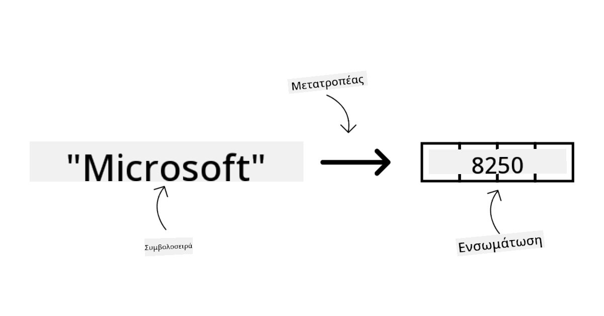
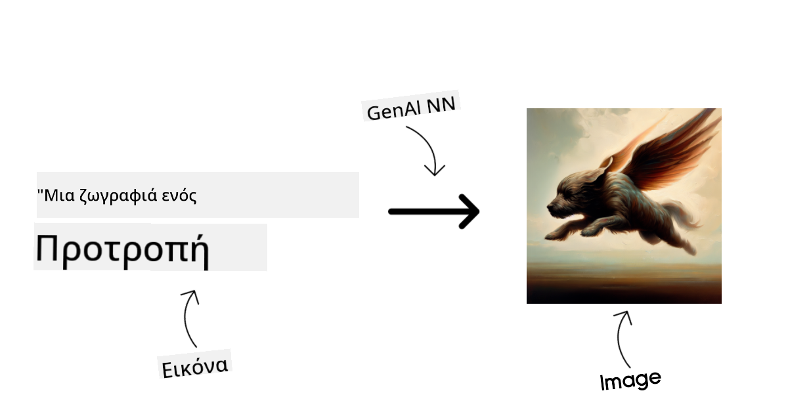
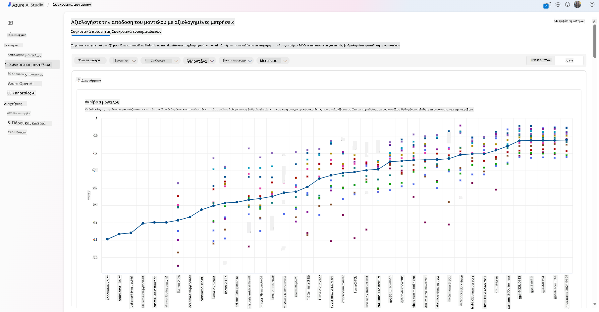

<!--
CO_OP_TRANSLATOR_METADATA:
{
  "original_hash": "6b7629b8ee4d7d874a27213e903d86a7",
  "translation_date": "2025-10-17T18:21:50+00:00",
  "source_file": "02-exploring-and-comparing-different-llms/README.md",
  "language_code": "el"
}
-->
# Εξερεύνηση και σύγκριση διαφορετικών LLMs

> _Κάντε κλικ στην εικόνα παραπάνω για να παρακολουθήσετε το βίντεο αυτού του μαθήματος_

Στο προηγούμενο μάθημα, είδαμε πώς η Γενετική Τεχνητή Νοημοσύνη αλλάζει το τεχνολογικό τοπίο, πώς λειτουργούν τα Μεγάλα Γλωσσικά Μοντέλα (LLMs) και πώς μια επιχείρηση - όπως η δική μας startup - μπορεί να τα εφαρμόσει στις περιπτώσεις χρήσης της και να αναπτυχθεί! Σε αυτό το κεφάλαιο, θα συγκρίνουμε και θα αντιπαραβάλουμε διαφορετικούς τύπους μεγάλων γλωσσικών μοντέλων (LLMs) για να κατανοήσουμε τα πλεονεκτήματα και τα μειονεκτήματά τους.

Το επόμενο βήμα στο ταξίδι της startup μας είναι η εξερεύνηση του τρέχοντος τοπίου των LLMs και η κατανόηση ποια είναι κατάλληλα για την περίπτωση χρήσης μας.

## Εισαγωγή

Αυτό το μάθημα θα καλύψει:

- Διαφορετικούς τύπους LLMs στο τρέχον τοπίο.
- Δοκιμή, επανάληψη και σύγκριση διαφορετικών μοντέλων για την περίπτωση χρήσης σας στο Azure.
- Πώς να αναπτύξετε ένα LLM.

## Στόχοι Μάθησης

Μετά την ολοκλήρωση αυτού του μαθήματος, θα μπορείτε να:

- Επιλέξετε το κατάλληλο μοντέλο για την περίπτωση χρήσης σας.
- Κατανοήσετε πώς να δοκιμάσετε, να επαναλάβετε και να βελτιώσετε την απόδοση του μοντέλου σας.
- Γνωρίζετε πώς οι επιχειρήσεις αναπτύσσουν μοντέλα.

## Κατανόηση διαφορετικών τύπων LLMs

Τα LLMs μπορούν να κατηγοριοποιηθούν με βάση την αρχιτεκτονική τους, τα δεδομένα εκπαίδευσης και την περίπτωση χρήσης. Η κατανόηση αυτών των διαφορών θα βοηθήσει τη startup μας να επιλέξει το κατάλληλο μοντέλο για το σενάριο και να κατανοήσει πώς να δοκιμάσει, να επαναλάβει και να βελτιώσει την απόδοση.

Υπάρχουν πολλοί διαφορετικοί τύποι LLM μοντέλων, και η επιλογή του μοντέλου εξαρτάται από το τι σκοπεύετε να τα χρησιμοποιήσετε, τα δεδομένα σας, πόσα είστε διατεθειμένοι να πληρώσετε και άλλα.

Ανάλογα με το αν σκοπεύετε να χρησιμοποιήσετε τα μοντέλα για κείμενο, ήχο, βίντεο, δημιουργία εικόνων κ.λπ., μπορεί να επιλέξετε έναν διαφορετικό τύπο μοντέλου.

- **Αναγνώριση ήχου και ομιλίας**. Για αυτόν τον σκοπό, τα μοντέλα τύπου Whisper είναι μια εξαιρετική επιλογή καθώς είναι γενικής χρήσης και προορίζονται για αναγνώριση ομιλίας. Είναι εκπαιδευμένα σε ποικίλο ήχο και μπορούν να εκτελέσουν πολυγλωσσική αναγνώριση ομιλίας. Μάθετε περισσότερα για τα [μοντέλα τύπου Whisper εδώ](https://platform.openai.com/docs/models/whisper?WT.mc_id=academic-105485-koreyst).

- **Δημιουργία εικόνων**. Για τη δημιουργία εικόνων, το DALL-E και το Midjourney είναι δύο πολύ γνωστές επιλογές. Το DALL-E προσφέρεται από το Azure OpenAI. [Διαβάστε περισσότερα για το DALL-E εδώ](https://platform.openai.com/docs/models/dall-e?WT.mc_id=academic-105485-koreyst) και επίσης στο Κεφάλαιο 9 αυτού του προγράμματος σπουδών.

- **Δημιουργία κειμένου**. Τα περισσότερα μοντέλα είναι εκπαιδευμένα στη δημιουργία κειμένου και έχετε μια μεγάλη ποικιλία επιλογών από το GPT-3.5 έως το GPT-4. Έρχονται με διαφορετικά κόστη, με το GPT-4 να είναι το πιο ακριβό. Αξίζει να εξετάσετε το [Azure OpenAI playground](https://oai.azure.com/portal/playground?WT.mc_id=academic-105485-koreyst) για να αξιολογήσετε ποια μοντέλα ταιριάζουν καλύτερα στις ανάγκες σας όσον αφορά τις δυνατότητες και το κόστος.

- **Πολυτροπικότητα**. Εάν θέλετε να χειριστείτε πολλούς τύπους δεδομένων στην είσοδο και την έξοδο, ίσως θέλετε να εξετάσετε μοντέλα όπως [gpt-4 turbo με όραση ή gpt-4o](https://learn.microsoft.com/azure/ai-services/openai/concepts/models#gpt-4-and-gpt-4-turbo-models?WT.mc_id=academic-105485-koreyst) - οι τελευταίες εκδόσεις των μοντέλων OpenAI - που είναι ικανά να συνδυάσουν την επεξεργασία φυσικής γλώσσας με την οπτική κατανόηση, επιτρέποντας αλληλεπιδράσεις μέσω πολυτροπικών διεπαφών.

Η επιλογή ενός μοντέλου σημαίνει ότι αποκτάτε κάποιες βασικές δυνατότητες, που μπορεί να μην είναι αρκετές όμως. Συχνά έχετε δεδομένα συγκεκριμένα για την εταιρεία που πρέπει με κάποιο τρόπο να τα γνωστοποιήσετε στο LLM. Υπάρχουν μερικές διαφορετικές επιλογές για το πώς να το προσεγγίσετε, περισσότερα για αυτό στις επόμενες ενότητες.

### Μοντέλα Βάσης έναντι LLMs

Ο όρος Μοντέλο Βάσης [δημιουργήθηκε από ερευνητές του Stanford](https://arxiv.org/abs/2108.07258?WT.mc_id=academic-105485-koreyst) και ορίζεται ως ένα μοντέλο AI που ακολουθεί κάποια κριτήρια, όπως:

- **Εκπαιδεύονται χρησιμοποιώντας μη εποπτευόμενη μάθηση ή αυτοεποπτευόμενη μάθηση**, που σημαίνει ότι εκπαιδεύονται σε μη επισημασμένα πολυτροπικά δεδομένα και δεν απαιτούν ανθρώπινη σχολιασμό ή επισήμανση δεδομένων για τη διαδικασία εκπαίδευσής τους.
- **Είναι πολύ μεγάλα μοντέλα**, βασισμένα σε πολύ βαθιά νευρωνικά δίκτυα εκπαιδευμένα σε δισεκατομμύρια παραμέτρους.
- **Συνήθως προορίζονται να χρησιμεύσουν ως "βάση" για άλλα μοντέλα**, που σημαίνει ότι μπορούν να χρησιμοποιηθούν ως σημείο εκκίνησης για την κατασκευή άλλων μοντέλων, κάτι που μπορεί να γίνει με τη λεπτομερή προσαρμογή.

Πηγή εικόνας: [Essential Guide to Foundation Models and Large Language Models | από τον Babar M Bhatti | Medium
](https://thebabar.medium.com/essential-guide-to-foundation-models-and-large-language-models-27dab58f7404)

Για να διευκρινίσουμε περαιτέρω αυτή τη διάκριση, ας πάρουμε το ChatGPT ως παράδειγμα. Για να δημιουργηθεί η πρώτη έκδοση του ChatGPT, ένα μοντέλο που ονομάζεται GPT-3.5 χρησίμευσε ως το μοντέλο βάσης. Αυτό σημαίνει ότι η OpenAI χρησιμοποίησε κάποια δεδομένα ειδικά για συνομιλίες για να δημιουργήσει μια προσαρμοσμένη έκδοση του GPT-3.5 που ήταν εξειδικευμένη στο να αποδίδει καλά σε σενάρια συνομιλιών, όπως chatbots.

Πηγή εικόνας: [2108.07258.pdf (arxiv.org)](https://arxiv.org/pdf/2108.07258.pdf?WT.mc_id=academic-105485-koreyst)

### Ανοιχτού Κώδικα έναντι Ιδιόκτητων Μοντέλων

Μια άλλη κατηγοριοποίηση των LLMs είναι αν είναι ανοιχτού κώδικα ή ιδιόκτητα.

Τα μοντέλα ανοιχτού κώδικα είναι μοντέλα που είναι διαθέσιμα στο κοινό και μπορούν να χρησιμοποιηθούν από οποιονδήποτε. Συχνά διατίθενται από την εταιρεία που τα δημιούργησε ή από την ερευνητική κοινότητα. Αυτά τα μοντέλα επιτρέπεται να επιθεωρηθούν, να τροποποιηθούν και να προσαρμοστούν για τις διάφορες περιπτώσεις χρήσης στα LLMs. Ωστόσο, δεν είναι πάντα βελτιστοποιημένα για χρήση σε παραγωγή και μπορεί να μην είναι τόσο αποδοτικά όσο τα ιδιόκτητα μοντέλα. Επιπλέον, η χρηματοδότηση για μοντέλα ανοιχτού κώδικα μπορεί να είναι περιορισμένη και μπορεί να μην συντηρούνται μακροπρόθεσμα ή να μην ενημερώνονται με την τελευταία έρευνα. Παραδείγματα δημοφιλών μοντέλων ανοιχτού κώδικα περιλαμβάνουν [Alpaca](https://crfm.stanford.edu/2023/03/13/alpaca.html?WT.mc_id=academic-105485-koreyst), [Bloom](https://huggingface.co/bigscience/bloom) και [LLaMA](https://llama.meta.com).

Τα ιδιόκτητα μοντέλα είναι μοντέλα που ανήκουν σε μια εταιρεία και δεν είναι διαθέσιμα στο κοινό. Αυτά τα μοντέλα συχνά βελτιστοποιούνται για χρήση σε παραγωγή. Ωστόσο, δεν επιτρέπεται να επιθεωρηθούν, να τροποποιηθούν ή να προσαρμοστούν για διαφορετικές περιπτώσεις χρήσης. Επιπλέον, δεν είναι πάντα διαθέσιμα δωρεάν και μπορεί να απαιτούν συνδρομή ή πληρωμή για χρήση. Επίσης, οι χρήστες δεν έχουν έλεγχο στα δεδομένα που χρησιμοποιούνται για την εκπαίδευση του μοντέλου, πράγμα που σημαίνει ότι πρέπει να εμπιστευτούν τον ιδιοκτήτη του μοντέλου για τη δέσμευση στην προστασία της ιδιωτικότητας των δεδομένων και τη χρήση της AI με υπευθυνότητα. Παραδείγματα δημοφιλών ιδιόκτητων μοντέλων περιλαμβάνουν [OpenAI models](https://platform.openai.com/docs/models/overview?WT.mc_id=academic-105485-koreyst), [Google Bard](https://sapling.ai/llm/bard?WT.mc_id=academic-105485-koreyst) ή [Claude 2](https://www.anthropic.com/index/claude-2?WT.mc_id=academic-105485-koreyst).

### Ενσωμάτωση έναντι Δημιουργίας Εικόνων έναντι Δημιουργίας Κειμένου και Κώδικα

Τα LLMs μπορούν επίσης να κατηγοριοποιηθούν με βάση την έξοδο που παράγουν.

Οι ενσωματώσεις είναι ένα σύνολο μοντέλων που μπορούν να μετατρέψουν το κείμενο σε αριθμητική μορφή, που ονομάζεται ενσωμάτωση, η οποία είναι μια αριθμητική αναπαράσταση του εισαγόμενου κειμένου. Οι ενσωματώσεις διευκολύνουν τις μηχανές να κατανοήσουν τις σχέσεις μεταξύ λέξεων ή προτάσεων και μπορούν να καταναλωθούν ως είσοδοι από άλλα μοντέλα, όπως μοντέλα ταξινόμησης ή μοντέλα ομαδοποίησης που έχουν καλύτερη απόδοση σε αριθμητικά δεδομένα. Τα μοντέλα ενσωμάτωσης χρησιμοποιούνται συχνά για μεταφορά μάθησης, όπου ένα μοντέλο κατασκευάζεται για μια υποκατάστατη εργασία για την οποία υπάρχει αφθονία δεδομένων και στη συνέχεια τα βάρη του μοντέλου (ενσωματώσεις) επαναχρησιμοποιούνται για άλλες εργασίες. Ένα παράδειγμα αυτής της κατηγορίας είναι [OpenAI embeddings](https://platform.openai.com/docs/models/embeddings?WT.mc_id=academic-105485-koreyst).

Τα μοντέλα δημιουργίας εικόνων είναι μοντέλα που δημιουργούν εικόνες. Αυτά τα μοντέλα χρησιμοποιούνται συχνά για επεξεργασία εικόνων, σύνθεση εικόνων και μετάφραση εικόνων. Τα μοντέλα δημιουργίας εικόνων εκπαιδεύονται συχνά σε μεγάλα σύνολα δεδομένων εικόνων, όπως [LAION-5B](https://laion.ai/blog/laion-5b/?WT.mc_id=academic-105485-koreyst), και μπορούν να χρησιμοποιηθούν για τη δημιουργία νέων εικόνων ή για την επεξεργασία υπαρχουσών εικόνων με τεχνικές inpainting, υπερ-ανάλυσης και χρωματισμού. Παραδείγματα περιλαμβάνουν [DALL-E-3](https://openai.com/dall-e-3?WT.mc_id=academic-105485-koreyst) και [Stable Diffusion models](https://github.com/Stability-AI/StableDiffusion?WT.mc_id=academic-105485-koreyst).

Τα μοντέλα δημιουργίας κειμένου και κώδικα είναι μοντέλα που δημιουργούν κείμενο ή κώδικα. Αυτά τα μοντέλα χρησιμοποιούνται συχνά για σύνοψη κειμένου, μετάφραση και απάντηση σε ερωτήσεις. Τα μοντέλα δημιουργίας κειμένου εκπαιδεύονται συχνά σε μεγάλα σύνολα δεδομένων κειμένου, όπως [BookCorpus](https://www.cv-foundation.org/openaccess/content_iccv_2015/html/Zhu_Aligning_Books_and_ICCV_2015_paper.html?WT.mc_id=academic-105485-koreyst), και μπορούν να χρησιμοποιηθούν για τη δημιουργία νέου κειμένου ή για την απάντηση σε ερωτήσεις. Τα μοντέλα δημιουργίας κώδικα, όπως [CodeParrot](https://huggingface.co/codeparrot?WT.mc_id=academic-105485-koreyst), εκπαιδεύονται συχνά σε μεγάλα σύνολα δεδομένων κώδικα, όπως το GitHub, και μπορούν να χρησιμοποιηθούν για τη δημιουργία νέου κώδικα ή για τη διόρθωση σφαλμάτων σε υπάρχοντα κώδικα.

### Encoder-Decoder έναντι Μόνο Decoder

Για να μιλήσουμε για τους διαφορετικούς τύπους αρχιτεκτονικής των LLMs, ας χρησιμοποιήσουμε μια αναλογία.

Φανταστείτε ότι ο διευθυντής σας σας ανέθεσε να γράψετε ένα κουίζ για τους μαθητές. Έχετε δύο συναδέλφους: ο ένας είναι υπεύθυνος για τη δημιουργία του περιεχομένου και ο άλλος για την αναθεώρησή του.

Ο δημιουργός περιεχομένου είναι σαν ένα μοντέλο Μόνο Decoder, μπορεί να δει το θέμα και να δει τι έχετε ήδη γράψει και στη συνέχεια να γράψει ένα μάθημα βάσει αυτού. Είναι πολύ καλός στο να γράφει ενδιαφέρον και ενημερωτικό περιεχόμενο, αλλά δεν είναι πολύ καλός στο να κατανοεί το θέμα και τους μαθησιακούς στόχους. Μερικά παραδείγματα μοντέλων Μόνο Decoder είναι τα μοντέλα της οικογένειας GPT, όπως το GPT-3.

Ο αναθεωρητής είναι σαν ένα μοντέλο Μόνο Encoder, κοιτάζει το μάθημα που έχει γραφτεί και τις απαντήσεις, παρατηρώντας τη σχέση μεταξύ τους και κατανοώντας το πλαίσιο, αλλά δεν είναι καλός στη δημιουργία περιεχομένου. Ένα παράδειγμα μοντέλου Μόνο Encoder θα ήταν το BERT.

Φανταστείτε ότι μπορούμε να έχουμε κάποιον που θα μπορούσε να δημιουργήσει και να αναθεωρήσει το κουίζ, αυτό είναι ένα μοντέλο Encoder-Decoder. Μερικά παραδείγματα θα ήταν το BART και το T5.

### Υπηρεσία έναντι Μοντέλου

Τώρα, ας μιλήσουμε για τη διαφορά μεταξύ μιας υπηρεσίας και ενός μοντέλου. Μια υπηρεσία είναι ένα προϊόν που προσφέρεται από έναν πάροχο υπηρεσιών cloud και είναι συχνά ένας συνδυασμός μοντέλων, δεδομένων και άλλων στοιχείων. Ένα μοντέλο είναι το βασικό στοιχείο μιας υπηρεσίας και είναι συχνά ένα μοντέλο βάσης, όπως ένα LLM.

Οι υπηρεσίες συχνά βελτιστοποιούνται για χρήση σε παραγωγή και είναι συχνά πιο εύκολες στη χρήση από τα μοντέλα, μέσω μιας γραφικής διεπαφής χρήστη. Ωστόσο, οι υπηρεσίες δεν είναι πάντα διαθέσιμες δωρεάν και μπορεί να απαιτούν συνδρομή ή πληρωμή για χρήση, σε αντάλλαγμα
Τα περισσότερα από τα μοντέλα που αναφέραμε στις προηγούμενες παραγράφους (μοντέλα της OpenAI, μοντέλα ανοιχτού κώδικα όπως το Llama2 και οι μετασχηματιστές του Hugging Face) είναι διαθέσιμα στον [Κατάλογο Μοντέλων](https://learn.microsoft.com/azure/ai-studio/how-to/model-catalog-overview?WT.mc_id=academic-105485-koreyst) στο [Azure AI Studio](https://ai.azure.com/?WT.mc_id=academic-105485-koreyst).

Το [Azure AI Studio](https://learn.microsoft.com/azure/ai-studio/what-is-ai-studio?WT.mc_id=academic-105485-koreyst) είναι μια πλατφόρμα Cloud σχεδιασμένη για προγραμματιστές, ώστε να δημιουργούν εφαρμογές γενετικής τεχνητής νοημοσύνης και να διαχειρίζονται ολόκληρο τον κύκλο ανάπτυξης - από την πειραματική φάση έως την αξιολόγηση - συνδυάζοντας όλες τις υπηρεσίες Azure AI σε έναν ενιαίο κόμβο με ένα εύχρηστο γραφικό περιβάλλον. Ο Κατάλογος Μοντέλων στο Azure AI Studio επιτρέπει στον χρήστη να:

- Βρει το Foundation Model που τον ενδιαφέρει στον κατάλογο - είτε ιδιόκτητο είτε ανοιχτού κώδικα, φιλτράροντας ανάλογα με την εργασία, την άδεια ή το όνομα. Για να βελτιωθεί η αναζήτηση, τα μοντέλα είναι οργανωμένα σε συλλογές, όπως η συλλογή Azure OpenAI, η συλλογή Hugging Face και άλλες.

- Εξετάσει την κάρτα του μοντέλου, η οποία περιλαμβάνει λεπτομερή περιγραφή της προτεινόμενης χρήσης και των δεδομένων εκπαίδευσης, δείγματα κώδικα και αποτελέσματα αξιολόγησης από τη βιβλιοθήκη εσωτερικών αξιολογήσεων.

- Συγκρίνει benchmarks μεταξύ μοντέλων και datasets που είναι διαθέσιμα στη βιομηχανία, για να αξιολογήσει ποιο ταιριάζει στο επιχειρηματικό σενάριο, μέσω του πίνακα [Model Benchmarks](https://learn.microsoft.com/azure/ai-studio/how-to/model-benchmarks?WT.mc_id=academic-105485-koreyst).

- Προσαρμόσει το μοντέλο σε δεδομένα εκπαίδευσης που έχει ο ίδιος, για να βελτιώσει την απόδοση του μοντέλου σε συγκεκριμένο φόρτο εργασίας, αξιοποιώντας τις δυνατότητες πειραματισμού και παρακολούθησης του Azure AI Studio.

- Αναπτύξει το αρχικό προεκπαιδευμένο μοντέλο ή την προσαρμοσμένη έκδοση σε απομακρυσμένη πραγματική πρόβλεψη - διαχειριζόμενη υπολογιστική ισχύ - ή σε serverless API endpoint - [pay-as-you-go](https://learn.microsoft.com/azure/ai-studio/how-to/model-catalog-overview#model-deployment-managed-compute-and-serverless-api-pay-as-you-go?WT.mc_id=academic-105485-koreyst) - για να επιτρέψει στις εφαρμογές να το χρησιμοποιούν.

> [!NOTE]
> Δεν είναι όλα τα μοντέλα στον κατάλογο διαθέσιμα για fine-tuning και/ή ανάπτυξη με pay-as-you-go. Ελέγξτε την κάρτα του μοντέλου για λεπτομέρειες σχετικά με τις δυνατότητες και τους περιορισμούς του μοντέλου.

## Βελτίωση αποτελεσμάτων LLM

Έχουμε εξερευνήσει με την ομάδα του startup μας διάφορους τύπους LLMs και μια πλατφόρμα Cloud (Azure Machine Learning) που μας επιτρέπει να συγκρίνουμε διαφορετικά μοντέλα, να τα αξιολογούμε σε δεδομένα δοκιμών, να βελτιώνουμε την απόδοση και να τα αναπτύσσουμε σε endpoints πρόβλεψης.

Αλλά πότε πρέπει να εξετάσουν το ενδεχόμενο fine-tuning ενός μοντέλου αντί να χρησιμοποιήσουν ένα προεκπαιδευμένο; Υπάρχουν άλλες προσεγγίσεις για τη βελτίωση της απόδοσης του μοντέλου σε συγκεκριμένους φόρτους εργασίας;

Υπάρχουν διάφορες προσεγγίσεις που μπορεί να χρησιμοποιήσει μια επιχείρηση για να επιτύχει τα αποτελέσματα που χρειάζεται από ένα LLM. Μπορείτε να επιλέξετε διαφορετικούς τύπους μοντέλων με διαφορετικούς βαθμούς εκπαίδευσης κατά την ανάπτυξη ενός LLM στην παραγωγή, με διαφορετικά επίπεδα πολυπλοκότητας, κόστους και ποιότητας. Ακολουθούν μερικές διαφορετικές προσεγγίσεις:

- **Prompt engineering με context**. Η ιδέα είναι να παρέχετε αρκετό context όταν κάνετε prompt, ώστε να εξασφαλίσετε ότι θα λάβετε τις απαντήσεις που χρειάζεστε.

- **Retrieval Augmented Generation, RAG**. Τα δεδομένα σας μπορεί να υπάρχουν σε μια βάση δεδομένων ή σε ένα web endpoint, για παράδειγμα. Για να διασφαλίσετε ότι αυτά τα δεδομένα ή ένα υποσύνολό τους περιλαμβάνονται κατά τη διαδικασία του prompt, μπορείτε να ανακτήσετε τα σχετικά δεδομένα και να τα κάνετε μέρος του prompt του χρήστη.

- **Fine-tuned μοντέλο**. Εδώ, εκπαιδεύετε περαιτέρω το μοντέλο με τα δικά σας δεδομένα, κάτι που οδηγεί το μοντέλο να είναι πιο ακριβές και να ανταποκρίνεται καλύτερα στις ανάγκες σας, αλλά μπορεί να είναι δαπανηρό.

Πηγή εικόνας: [Four Ways that Enterprises Deploy LLMs | Fiddler AI Blog](https://www.fiddler.ai/blog/four-ways-that-enterprises-deploy-llms?WT.mc_id=academic-105485-koreyst)

### Prompt Engineering με Context

Τα προεκπαιδευμένα LLMs λειτουργούν πολύ καλά σε γενικευμένες εργασίες φυσικής γλώσσας, ακόμα και όταν καλούνται με ένα σύντομο prompt, όπως μια πρόταση για ολοκλήρωση ή μια ερώτηση – η λεγόμενη “zero-shot” μάθηση.

Ωστόσο, όσο περισσότερο ο χρήστης μπορεί να διαμορφώσει το ερώτημά του, με μια λεπτομερή αίτηση και παραδείγματα – το Context – τόσο πιο ακριβής και κοντά στις προσδοκίες του χρήστη θα είναι η απάντηση. Σε αυτή την περίπτωση, μιλάμε για “one-shot” μάθηση αν το prompt περιλαμβάνει μόνο ένα παράδειγμα και “few-shot” μάθηση αν περιλαμβάνει πολλαπλά παραδείγματα. Το prompt engineering με context είναι η πιο οικονομική προσέγγιση για να ξεκινήσετε.

### Retrieval Augmented Generation (RAG)

Τα LLMs έχουν τον περιορισμό ότι μπορούν να χρησιμοποιούν μόνο τα δεδομένα που έχουν χρησιμοποιηθεί κατά την εκπαίδευσή τους για να δημιουργήσουν μια απάντηση. Αυτό σημαίνει ότι δεν γνωρίζουν τίποτα για γεγονότα που συνέβησαν μετά τη διαδικασία εκπαίδευσής τους και δεν μπορούν να έχουν πρόσβαση σε μη δημόσιες πληροφορίες (όπως δεδομένα εταιρείας). 

Αυτό μπορεί να ξεπεραστεί μέσω του RAG, μιας τεχνικής που ενισχύει το prompt με εξωτερικά δεδομένα με τη μορφή τμημάτων εγγράφων, λαμβάνοντας υπόψη τα όρια μήκους του prompt. Αυτό υποστηρίζεται από εργαλεία βάσεων δεδομένων Vector (όπως το [Azure Vector Search](https://learn.microsoft.com/azure/search/vector-search-overview?WT.mc_id=academic-105485-koreyst)) που ανακτούν τα χρήσιμα τμήματα από προκαθορισμένες πηγές δεδομένων και τα προσθέτουν στο Context του prompt.

Αυτή η τεχνική είναι πολύ χρήσιμη όταν μια επιχείρηση δεν έχει αρκετά δεδομένα, αρκετό χρόνο ή πόρους για να προσαρμόσει ένα LLM, αλλά θέλει να βελτιώσει την απόδοση σε έναν συγκεκριμένο φόρτο εργασίας και να μειώσει τους κινδύνους παραποιήσεων, δηλαδή παραπλανητικών ή επιβλαβών περιεχομένων.

### Fine-tuned μοντέλο

Το fine-tuning είναι μια διαδικασία που αξιοποιεί τη μεταφορά μάθησης για να "προσαρμόσει" το μοντέλο σε μια εργασία downstream ή να λύσει ένα συγκεκριμένο πρόβλημα. Σε αντίθεση με τη few-shot μάθηση και το RAG, οδηγεί στη δημιουργία ενός νέου μοντέλου, με ενημερωμένα βάρη και προκαταλήψεις. Απαιτεί ένα σύνολο παραδειγμάτων εκπαίδευσης που αποτελείται από μία είσοδο (το prompt) και την αντίστοιχη έξοδο (την ολοκλήρωση). 

Αυτή θα ήταν η προτιμώμενη προσέγγιση αν:

- **Χρήση fine-tuned μοντέλων**. Μια επιχείρηση θα ήθελε να χρησιμοποιήσει fine-tuned λιγότερο ικανές μοντέλα (όπως embedding models) αντί για μοντέλα υψηλής απόδοσης, οδηγώντας σε μια πιο οικονομική και γρήγορη λύση.

- **Λαμβάνοντας υπόψη την καθυστέρηση**. Η καθυστέρηση είναι σημαντική για μια συγκεκριμένη περίπτωση χρήσης, οπότε δεν είναι δυνατό να χρησιμοποιηθούν πολύ μεγάλα prompts ή ο αριθμός των παραδειγμάτων που πρέπει να μάθει το μοντέλο δεν ταιριάζει με το όριο μήκους του prompt.

- **Παραμένοντας ενημερωμένοι**. Μια επιχείρηση έχει πολλά δεδομένα υψηλής ποιότητας και ετικέτες αλήθειας και τους πόρους που απαιτούνται για να διατηρήσει αυτά τα δεδομένα ενημερωμένα με την πάροδο του χρόνου.

### Εκπαιδευμένο μοντέλο

Η εκπαίδευση ενός LLM από την αρχή είναι αναμφίβολα η πιο δύσκολη και η πιο περίπλοκη προσέγγιση που μπορεί να υιοθετηθεί, απαιτώντας τεράστιες ποσότητες δεδομένων, εξειδικευμένους πόρους και κατάλληλη υπολογιστική ισχύ. Αυτή η επιλογή θα πρέπει να εξεταστεί μόνο σε ένα σενάριο όπου μια επιχείρηση έχει μια περίπτωση χρήσης που αφορά συγκεκριμένο τομέα και μια μεγάλη ποσότητα δεδομένων που επικεντρώνονται στον τομέα.

## Έλεγχος γνώσεων

Ποια θα μπορούσε να είναι μια καλή προσέγγιση για τη βελτίωση των αποτελεσμάτων ολοκλήρωσης ενός LLM;

1. Prompt engineering με context  
1. RAG  
1. Fine-tuned μοντέλο  

Α:3, αν έχετε τον χρόνο και τους πόρους και δεδομένα υψηλής ποιότητας, το fine-tuning είναι η καλύτερη επιλογή για να παραμείνετε ενημερωμένοι. Ωστόσο, αν θέλετε να βελτιώσετε τα πράγματα και σας λείπει ο χρόνος, αξίζει να εξετάσετε πρώτα το RAG.

## 🚀 Πρόκληση

Διαβάστε περισσότερα για το πώς μπορείτε να [χρησιμοποιήσετε το RAG](https://learn.microsoft.com/azure/search/retrieval-augmented-generation-overview?WT.mc_id=academic-105485-koreyst) για την επιχείρησή σας.

## Καλή δουλειά, συνεχίστε τη μάθηση σας

Αφού ολοκληρώσετε αυτό το μάθημα, δείτε τη [Συλλογή Μάθησης Γενετικής Τεχνητής Νοημοσύνης](https://aka.ms/genai-collection?WT.mc_id=academic-105485-koreyst) για να συνεχίσετε να αναβαθμίζετε τις γνώσεις σας στη Γενετική Τεχνητή Νοημοσύνη!

Προχωρήστε στο Μάθημα 3, όπου θα εξετάσουμε πώς να [δημιουργούμε με Γενετική Τεχνητή Νοημοσύνη με Υπευθυνότητα](../03-using-generative-ai-responsibly/README.md?WT.mc_id=academic-105485-koreyst)!

---

**Αποποίηση ευθύνης**:  
Αυτό το έγγραφο έχει μεταφραστεί χρησιμοποιώντας την υπηρεσία αυτόματης μετάφρασης [Co-op Translator](https://github.com/Azure/co-op-translator). Παρόλο που καταβάλλουμε προσπάθειες για ακρίβεια, παρακαλούμε να έχετε υπόψη ότι οι αυτόματες μεταφράσεις ενδέχεται να περιέχουν λάθη ή ανακρίβειες. Το πρωτότυπο έγγραφο στη μητρική του γλώσσα θα πρέπει να θεωρείται η αυθεντική πηγή. Για κρίσιμες πληροφορίες, συνιστάται επαγγελματική ανθρώπινη μετάφραση. Δεν φέρουμε ευθύνη για τυχόν παρεξηγήσεις ή εσφαλμένες ερμηνείες που προκύπτουν από τη χρήση αυτής της μετάφρασης.