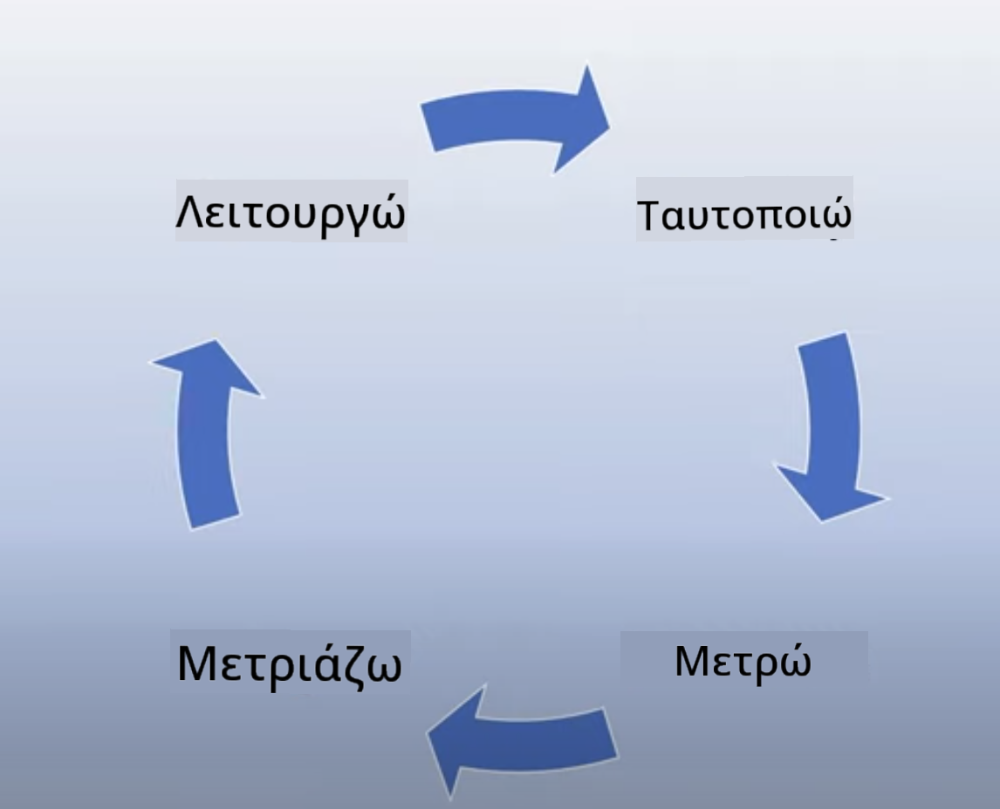
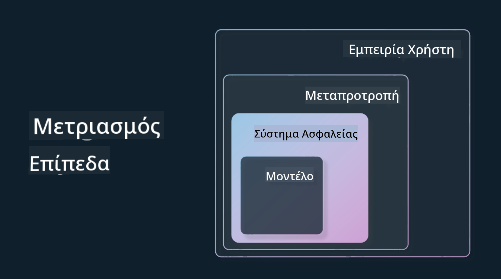

<!--
CO_OP_TRANSLATOR_METADATA:
{
  "original_hash": "4d57fad773cbeb69c5dd62e65c34200d",
  "translation_date": "2025-10-17T18:19:46+00:00",
  "source_file": "03-using-generative-ai-responsibly/README.md",
  "language_code": "el"
}
-->
# Χρήση της Γενετικής Τεχνητής Νοημοσύνης Υπεύθυνα

> _Κάντε κλικ στην εικόνα παραπάνω για να δείτε το βίντεο αυτού του μαθήματος_

Είναι εύκολο να εντυπωσιαστεί κανείς από την Τεχνητή Νοημοσύνη και ειδικά από τη Γενετική Τεχνητή Νοημοσύνη, αλλά πρέπει να σκεφτείτε πώς να τη χρησιμοποιήσετε υπεύθυνα. Πρέπει να λάβετε υπόψη σας πώς να διασφαλίσετε ότι τα αποτελέσματα είναι δίκαια, μη επιβλαβή και πολλά άλλα. Αυτό το κεφάλαιο στοχεύει να σας παρέχει το απαραίτητο πλαίσιο, τι να λάβετε υπόψη και πώς να κάνετε ενεργά βήματα για να βελτιώσετε τη χρήση της Τεχνητής Νοημοσύνης.

## Εισαγωγή

Αυτό το μάθημα θα καλύψει:

- Γιατί πρέπει να δώσετε προτεραιότητα στην Υπεύθυνη Τεχνητή Νοημοσύνη όταν δημιουργείτε εφαρμογές Γενετικής Τεχνητής Νοημοσύνης.
- Βασικές αρχές της Υπεύθυνης Τεχνητής Νοημοσύνης και πώς σχετίζονται με τη Γενετική Τεχνητή Νοημοσύνη.
- Πώς να εφαρμόσετε αυτές τις αρχές της Υπεύθυνης Τεχνητής Νοημοσύνης μέσω στρατηγικής και εργαλείων.

## Στόχοι Μάθησης

Μετά την ολοκλήρωση αυτού του μαθήματος θα γνωρίζετε:

- Τη σημασία της Υπεύθυνης Τεχνητής Νοημοσύνης όταν δημιουργείτε εφαρμογές Γενετικής Τεχνητής Νοημοσύνης.
- Πότε να σκεφτείτε και να εφαρμόσετε τις βασικές αρχές της Υπεύθυνης Τεχνητής Νοημοσύνης όταν δημιουργείτε εφαρμογές Γενετικής Τεχνητής Νοημοσύνης.
- Ποια εργαλεία και στρατηγικές είναι διαθέσιμα για να εφαρμόσετε την έννοια της Υπεύθυνης Τεχνητής Νοημοσύνης.

## Αρχές Υπεύθυνης Τεχνητής Νοημοσύνης

Ο ενθουσιασμός για τη Γενετική Τεχνητή Νοημοσύνη δεν ήταν ποτέ μεγαλύτερος. Αυτός ο ενθουσιασμός έχει φέρει πολλούς νέους προγραμματιστές, προσοχή και χρηματοδότηση σε αυτόν τον τομέα. Παρόλο που αυτό είναι πολύ θετικό για όσους θέλουν να δημιουργήσουν προϊόντα και εταιρείες χρησιμοποιώντας τη Γενετική Τεχνητή Νοημοσύνη, είναι επίσης σημαντικό να προχωρήσουμε υπεύθυνα.

Καθ' όλη τη διάρκεια αυτού του μαθήματος, επικεντρωνόμαστε στη δημιουργία της startup μας και του εκπαιδευτικού προϊόντος Τεχνητής Νοημοσύνης. Θα χρησιμοποιήσουμε τις αρχές της Υπεύθυνης Τεχνητής Νοημοσύνης: Δικαιοσύνη, Συμπερίληψη, Αξιοπιστία/Ασφάλεια, Ασφάλεια & Ιδιωτικότητα, Διαφάνεια και Λογοδοσία. Με αυτές τις αρχές, θα εξερευνήσουμε πώς σχετίζονται με τη χρήση της Γενετικής Τεχνητής Νοημοσύνης στα προϊόντα μας.

## Γιατί Πρέπει να Δώσετε Προτεραιότητα στην Υπεύθυνη Τεχνητή Νοημοσύνη

Όταν δημιουργείτε ένα προϊόν, η προσέγγιση που επικεντρώνεται στον άνθρωπο, έχοντας κατά νου το καλύτερο συμφέρον του χρήστη, οδηγεί στα καλύτερα αποτελέσματα.

Η μοναδικότητα της Γενετικής Τεχνητής Νοημοσύνης είναι η δύναμή της να δημιουργεί χρήσιμες απαντήσεις, πληροφορίες, καθοδήγηση και περιεχόμενο για τους χρήστες. Αυτό μπορεί να γίνει χωρίς πολλά χειροκίνητα βήματα, κάτι που μπορεί να οδηγήσει σε πολύ εντυπωσιακά αποτελέσματα. Χωρίς σωστό σχεδιασμό και στρατηγικές, μπορεί δυστυχώς να οδηγήσει σε επιβλαβή αποτελέσματα για τους χρήστες σας, το προϊόν σας και την κοινωνία συνολικά.

Ας δούμε μερικά (αλλά όχι όλα) από αυτά τα πιθανά επιβλαβή αποτελέσματα:

### Παραισθήσεις

Οι παραισθήσεις είναι ένας όρος που χρησιμοποιείται για να περιγράψει όταν ένα LLM παράγει περιεχόμενο που είναι είτε εντελώς παράλογο είτε κάτι που γνωρίζουμε ότι είναι λανθασμένο βάσει άλλων πηγών πληροφοριών.

Ας πάρουμε για παράδειγμα ότι δημιουργούμε μια λειτουργία για τη startup μας που επιτρέπει στους μαθητές να κάνουν ιστορικές ερωτήσεις σε ένα μοντέλο. Ένας μαθητής ρωτά την ερώτηση `Ποιος ήταν ο μοναδικός επιζών του Τιτανικού;`

Το μοντέλο παράγει μια απάντηση όπως η παρακάτω:

> _(Πηγή: [Flying bisons](https://flyingbisons.com?WT.mc_id=academic-105485-koreyst))_

Αυτή είναι μια πολύ σίγουρη και λεπτομερής απάντηση. Δυστυχώς, είναι λανθασμένη. Ακόμη και με μια ελάχιστη ποσότητα έρευνας, κάποιος θα ανακαλύψει ότι υπήρχαν περισσότεροι από ένας επιζώντες από την καταστροφή του Τιτανικού. Για έναν μαθητή που μόλις ξεκινά να ερευνά αυτό το θέμα, αυτή η απάντηση μπορεί να είναι αρκετά πειστική ώστε να μην αμφισβητηθεί και να θεωρηθεί ως γεγονός. Οι συνέπειες αυτού μπορεί να οδηγήσουν το σύστημα Τεχνητής Νοημοσύνης να είναι αναξιόπιστο και να επηρεάσει αρνητικά τη φήμη της startup μας.

Με κάθε επανάληψη οποιουδήποτε LLM, έχουμε δει βελτιώσεις στην απόδοση γύρω από την ελαχιστοποίηση των παραισθήσεων. Ακόμη και με αυτή τη βελτίωση, εμείς ως δημιουργοί εφαρμογών και χρήστες πρέπει να παραμένουμε ενήμεροι για αυτούς τους περιορισμούς.

### Επιβλαβές Περιεχόμενο

Καλύψαμε στην προηγούμενη ενότητα όταν ένα LLM παράγει λανθασμένες ή παράλογες απαντήσεις. Ένας άλλος κίνδυνος που πρέπει να γνωρίζουμε είναι όταν ένα μοντέλο απαντά με επιβλαβές περιεχόμενο.

Το επιβλαβές περιεχόμενο μπορεί να οριστεί ως:

- Παροχή οδηγιών ή ενθάρρυνση αυτοτραυματισμού ή βλάβης σε συγκεκριμένες ομάδες.
- Μίσος ή υποτιμητικό περιεχόμενο.
- Καθοδήγηση για τον σχεδιασμό οποιουδήποτε τύπου επίθεσης ή βίαιων πράξεων.
- Παροχή οδηγιών για το πώς να βρει κανείς παράνομο περιεχόμενο ή να διαπράξει παράνομες πράξεις.
- Εμφάνιση σεξουαλικά ρητού περιεχομένου.

Για τη startup μας, θέλουμε να βεβαιωθούμε ότι έχουμε τα κατάλληλα εργαλεία και στρατηγικές για να αποτρέψουμε την εμφάνιση αυτού του είδους περιεχομένου στους μαθητές.

### Έλλειψη Δικαιοσύνης

Η δικαιοσύνη ορίζεται ως «η διασφάλιση ότι ένα σύστημα Τεχνητής Νοημοσύνης είναι απαλλαγμένο από προκαταλήψεις και διακρίσεις και ότι αντιμετωπίζει όλους δίκαια και ισότιμα». Στον κόσμο της Γενετικής Τεχνητής Νοημοσύνης, θέλουμε να διασφαλίσουμε ότι οι αποκλειστικές κοσμοθεωρίες των περιθωριοποιημένων ομάδων δεν ενισχύονται από την έξοδο του μοντέλου.

Αυτοί οι τύποι εξόδων δεν είναι μόνο καταστροφικοί για τη δημιουργία θετικών εμπειριών προϊόντων για τους χρήστες μας, αλλά προκαλούν επίσης περαιτέρω κοινωνική βλάβη. Ως δημιουργοί εφαρμογών, πρέπει πάντα να έχουμε κατά νου μια ευρεία και ποικιλόμορφη βάση χρηστών όταν δημιουργούμε λύσεις με Γενετική Τεχνητή Νοημοσύνη.

## Πώς να Χρησιμοποιήσετε τη Γενετική Τεχνητή Νοημοσύνη Υπεύθυνα

Τώρα που έχουμε εντοπίσει τη σημασία της Υπεύθυνης Γενετικής Τεχνητής Νοημοσύνης, ας δούμε 4 βήματα που μπορούμε να κάνουμε για να δημιουργήσουμε τις λύσεις Τεχνητής Νοημοσύνης μας υπεύθυνα:

### Μέτρηση Πιθανών Βλαβών

Στον έλεγχο λογισμικού, δοκιμάζουμε τις αναμενόμενες ενέργειες ενός χρήστη σε μια εφαρμογή. Παρομοίως, η δοκιμή ενός ποικίλου συνόλου ερωτημάτων που είναι πιο πιθανό να χρησιμοποιήσουν οι χρήστες είναι ένας καλός τρόπος για να μετρήσουμε πιθανές βλάβες.

Δεδομένου ότι η startup μας δημιουργεί ένα εκπαιδευτικό προϊόν, θα ήταν καλό να προετοιμάσουμε μια λίστα με ερωτήματα που σχετίζονται με την εκπαίδευση. Αυτό θα μπορούσε να καλύπτει ένα συγκεκριμένο θέμα, ιστορικά γεγονότα και ερωτήματα σχετικά με τη ζωή των μαθητών.

### Μείωση Πιθανών Βλαβών

Ήρθε η ώρα να βρούμε τρόπους όπου μπορούμε να αποτρέψουμε ή να περιορίσουμε την πιθανή βλάβη που προκαλείται από το μοντέλο και τις απαντήσεις του. Μπορούμε να το δούμε σε 4 διαφορετικά επίπεδα:

- **Μοντέλο**. Επιλέγοντας το σωστό μοντέλο για τη σωστή περίπτωση χρήσης. Μεγαλύτερα και πιο σύνθετα μοντέλα όπως το GPT-4 μπορεί να προκαλέσουν μεγαλύτερο κίνδυνο επιβλαβούς περιεχομένου όταν εφαρμόζονται σε μικρότερες και πιο συγκεκριμένες περιπτώσεις χρήσης. Η χρήση των δεδομένων εκπαίδευσής σας για λεπτομερή προσαρμογή μειώνει επίσης τον κίνδυνο επιβλαβούς περιεχομένου.

- **Σύστημα Ασφάλειας**. Ένα σύστημα ασφάλειας είναι ένα σύνολο εργαλείων και ρυθμίσεων στην πλατφόρμα που εξυπηρετεί το μοντέλο και βοηθά στη μείωση της βλάβης. Ένα παράδειγμα αυτού είναι το σύστημα φιλτραρίσματος περιεχομένου στην υπηρεσία Azure OpenAI. Τα συστήματα πρέπει επίσης να ανιχνεύουν επιθέσεις jailbreak και ανεπιθύμητη δραστηριότητα όπως αιτήματα από bots.

- **Μεταπροτροπή**. Οι μεταπροτροπές και η θεμελίωση είναι τρόποι με τους οποίους μπορούμε να κατευθύνουμε ή να περιορίσουμε το μοντέλο βάσει συγκεκριμένων συμπεριφορών και πληροφοριών. Αυτό θα μπορούσε να είναι η χρήση εισόδων συστήματος για τον ορισμό συγκεκριμένων ορίων του μοντέλου. Επιπλέον, η παροχή εξόδων που είναι πιο σχετικές με το πεδίο ή τον τομέα του συστήματος.

Μπορεί επίσης να είναι η χρήση τεχνικών όπως η Ανάκτηση Ενισχυμένης Γενετικής (RAG) για να έχει το μοντέλο πρόσβαση μόνο σε πληροφορίες από μια επιλογή αξιόπιστων πηγών. Υπάρχει ένα μάθημα αργότερα σε αυτό το μάθημα για [δημιουργία εφαρμογών αναζήτησης](../08-building-search-applications/README.md?WT.mc_id=academic-105485-koreyst)

- **Εμπειρία Χρήστη**. Το τελικό επίπεδο είναι εκεί όπου ο χρήστης αλληλεπιδρά άμεσα με το μοντέλο μέσω της διεπαφής της εφαρμογής μας με κάποιο τρόπο. Με αυτόν τον τρόπο μπορούμε να σχεδιάσουμε το UI/UX για να περιορίσουμε τον χρήστη στους τύπους εισόδων που μπορεί να στείλει στο μοντέλο καθώς και το κείμενο ή τις εικόνες που εμφανίζονται στον χρήστη. Κατά την ανάπτυξη της εφαρμογής Τεχνητής Νοημοσύνης, πρέπει επίσης να είμαστε διαφανείς σχετικά με το τι μπορεί και τι δεν μπορεί να κάνει η εφαρμογή Γενετικής Τεχνητής Νοημοσύνης μας.

Έχουμε ένα ολόκληρο μάθημα αφιερωμένο στο [Σχεδιασμό UX για Εφαρμογές Τεχνητής Νοημοσύνης](../12-designing-ux-for-ai-applications/README.md?WT.mc_id=academic-105485-koreyst)

- **Αξιολόγηση μοντέλου**. Η εργασία με LLMs μπορεί να είναι δύσκολη επειδή δεν έχουμε πάντα έλεγχο στα δεδομένα που εκπαιδεύτηκε το μοντέλο. Παρ' όλα αυτά, πρέπει πάντα να αξιολογούμε την απόδοση και τα αποτελέσματα του μοντέλου. Είναι ακόμα σημαντικό να μετράμε την ακρίβεια, την ομοιότητα, τη θεμελίωση και τη συνάφεια των εξόδων του μοντέλου. Αυτό βοηθά στην παροχή διαφάνειας και εμπιστοσύνης στους ενδιαφερόμενους και στους χρήστες.

### Λειτουργία Υπεύθυνης Λύσης Γενετικής Τεχνητής Νοημοσύνης

Η δημιουργία μιας λειτουργικής πρακτικής γύρω από τις εφαρμογές Τεχνητής Νοημοσύνης σας είναι το τελικό στάδιο. Αυτό περιλαμβάνει τη συνεργασία με άλλα μέρη της startup μας όπως το Νομικό και την Ασφάλεια για να διασφαλίσουμε ότι συμμορφωνόμαστε με όλες τις κανονιστικές πολιτικές. Πριν από την κυκλοφορία, θέλουμε επίσης να δημιουργήσουμε σχέδια γύρω από την παράδοση, τη διαχείριση περιστατικών και την αναίρεση για να αποτρέψουμε οποιαδήποτε βλάβη στους χρήστες μας από την ανάπτυξη.

## Εργαλεία

Ενώ η εργασία για την ανάπτυξη λύσεων Υπεύθυνης Τεχνητής Νοημοσύνης μπορεί να φαίνεται πολύπλοκη, είναι μια εργασία που αξίζει τον κόπο. Καθώς ο τομέας της Γενετικής Τεχνητής Νοημοσύνης μεγαλώνει, περισσότερα εργαλεία για να βοηθήσουν τους προγραμματιστές να ενσωματώσουν αποτελεσματικά την υπευθυνότητα στις ροές εργασίας τους θα ωριμάσουν. Για παράδειγμα, το [Azure AI Content Safety](https://learn.microsoft.com/azure/ai-services/content-safety/overview?WT.mc_id=academic-105485-koreyst) μπορεί να βοηθήσει στην ανίχνευση επιβλαβούς περιεχομένου και εικόνων μέσω ενός αιτήματος API.

## Έλεγχος Γνώσεων

Ποια είναι μερικά πράγματα που πρέπει να προσέξετε για να διασφαλίσετε την υπεύθυνη χρήση της Τεχνητής Νοημοσύνης;

1. Ότι η απάντηση είναι σωστή.
1. Επιβλαβής χρήση, ότι η Τεχνητή Νοημοσύνη δεν χρησιμοποιείται για εγκληματικούς σκοπούς.
1. Διασφάλιση ότι η Τεχνητή Νοημοσύνη είναι απαλλαγμένη από προκαταλήψεις και διακρίσεις.

Α: Οι 2 και 3 είναι σωστές. Η Υπεύθυνη Τεχνητή Νοημοσύνη σας βοηθά να εξετάσετε πώς να μειώσετε τις επιβλαβείς επιπτώσεις και τις προκαταλήψεις και πολλά άλλα.

## 🚀 Πρόκληση

Διαβάστε για το [Azure AI Content Safety](https://learn.microsoft.com/azure/ai-services/content-safety/overview?WT.mc_id=academic-105485-koreyst) και δείτε τι μπορείτε να υιοθετήσετε για τη χρήση σας.

## Εξαιρετική Δουλειά, Συνεχίστε τη Μάθηση

Μετά την ολοκλήρωση αυτού του μαθήματος, δείτε τη [Συλλογή Μάθησης Γενε

---

**Αποποίηση ευθύνης**:  
Αυτό το έγγραφο έχει μεταφραστεί χρησιμοποιώντας την υπηρεσία μετάφρασης AI [Co-op Translator](https://github.com/Azure/co-op-translator). Παρόλο που καταβάλλουμε προσπάθειες για ακρίβεια, παρακαλούμε να έχετε υπόψη ότι οι αυτοματοποιημένες μεταφράσεις ενδέχεται να περιέχουν λάθη ή ανακρίβειες. Το πρωτότυπο έγγραφο στη μητρική του γλώσσα θα πρέπει να θεωρείται η αυθεντική πηγή. Για κρίσιμες πληροφορίες, συνιστάται επαγγελματική ανθρώπινη μετάφραση. Δεν φέρουμε ευθύνη για τυχόν παρεξηγήσεις ή εσφαλμένες ερμηνείες που προκύπτουν από τη χρήση αυτής της μετάφρασης.