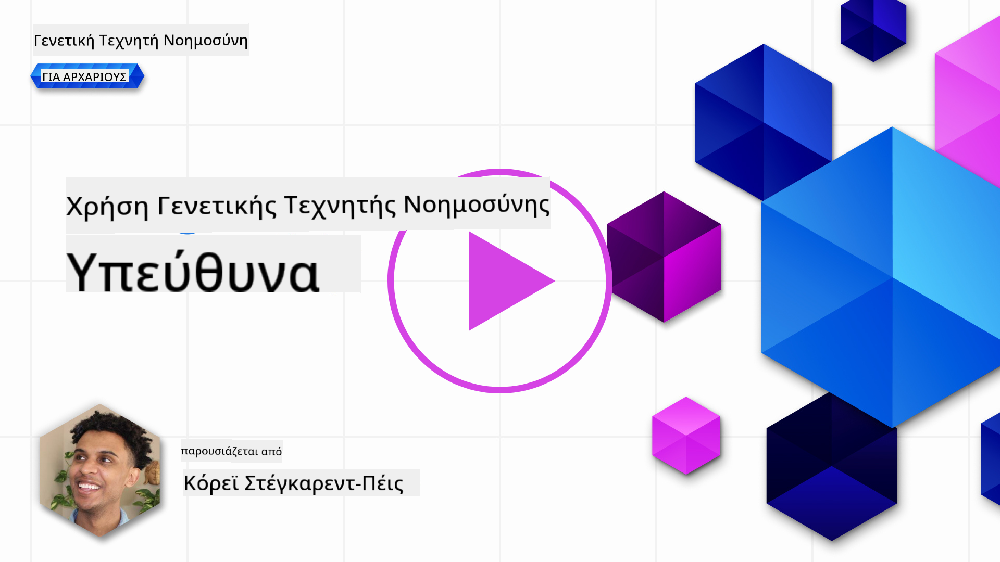

<!--
CO_OP_TRANSLATOR_METADATA:
{
  "original_hash": "7f8f4c11f8c1cb6e1794442dead414ea",
  "translation_date": "2025-07-09T08:56:10+00:00",
  "source_file": "03-using-generative-ai-responsibly/README.md",
  "language_code": "el"
}
-->
# Χρήση της Γενετικής Τεχνητής Νοημοσύνης με Υπευθυνότητα

> _Κάντε κλικ στην εικόνα παραπάνω για να δείτε το βίντεο αυτού του μαθήματος_

Είναι εύκολο να μαγευτεί κανείς από την Τεχνητή Νοημοσύνη και ειδικά από τη Γενετική Τεχνητή Νοημοσύνη, αλλά πρέπει να σκεφτεί πώς να τη χρησιμοποιήσει με υπευθυνότητα. Πρέπει να λάβετε υπόψη πώς να διασφαλίσετε ότι το αποτέλεσμα είναι δίκαιο, μη βλαβερό και άλλα. Αυτό το κεφάλαιο στοχεύει να σας δώσει το πλαίσιο που αναφέρθηκε, τι πρέπει να σκεφτείτε και πώς να κάνετε ενεργά βήματα για να βελτιώσετε τη χρήση της ΤΝ.

## Εισαγωγή

Αυτό το μάθημα θα καλύψει:

- Γιατί πρέπει να δίνετε προτεραιότητα στην Υπεύθυνη Τεχνητή Νοημοσύνη όταν δημιουργείτε εφαρμογές Γενετικής ΤΝ.
- Βασικές αρχές της Υπεύθυνης ΤΝ και πώς σχετίζονται με τη Γενετική ΤΝ.
- Πώς να εφαρμόσετε αυτές τις αρχές της Υπεύθυνης ΤΝ μέσω στρατηγικής και εργαλείων.

## Στόχοι Μάθησης

Μετά την ολοκλήρωση αυτού του μαθήματος θα γνωρίζετε:

- Τη σημασία της Υπεύθυνης ΤΝ κατά την ανάπτυξη εφαρμογών Γενετικής ΤΝ.
- Πότε να σκεφτείτε και να εφαρμόσετε τις βασικές αρχές της Υπεύθυνης ΤΝ κατά την ανάπτυξη εφαρμογών Γενετικής ΤΝ.
- Ποια εργαλεία και στρατηγικές είναι διαθέσιμα για να εφαρμόσετε την έννοια της Υπεύθυνης ΤΝ στην πράξη.

## Αρχές της Υπεύθυνης Τεχνητής Νοημοσύνης

Ο ενθουσιασμός για τη Γενετική ΤΝ δεν ήταν ποτέ μεγαλύτερος. Αυτός ο ενθουσιασμός έχει φέρει πολλούς νέους προγραμματιστές, προσοχή και χρηματοδότηση σε αυτόν τον τομέα. Ενώ αυτό είναι πολύ θετικό για όποιον θέλει να δημιουργήσει προϊόντα και εταιρείες με Γενετική ΤΝ, είναι επίσης σημαντικό να προχωράμε με υπευθυνότητα.

Καθ’ όλη τη διάρκεια αυτού του μαθήματος, εστιάζουμε στην ανάπτυξη της startup μας και του προϊόντος εκπαίδευσης ΤΝ. Θα χρησιμοποιήσουμε τις αρχές της Υπεύθυνης ΤΝ: Δικαιοσύνη, Συμπερίληψη, Αξιοπιστία/Ασφάλεια, Ασφάλεια & Ιδιωτικότητα, Διαφάνεια και Λογοδοσία. Με αυτές τις αρχές, θα εξερευνήσουμε πώς σχετίζονται με τη χρήση της Γενετικής ΤΝ στα προϊόντα μας.

## Γιατί να Δώσετε Προτεραιότητα στην Υπεύθυνη ΤΝ

Κατά την ανάπτυξη ενός προϊόντος, η ανθρωποκεντρική προσέγγιση, κρατώντας το συμφέρον του χρήστη στο επίκεντρο, οδηγεί στα καλύτερα αποτελέσματα.

Η μοναδικότητα της Γενετικής ΤΝ είναι η ικανότητά της να δημιουργεί χρήσιμες απαντήσεις, πληροφορίες, καθοδήγηση και περιεχόμενο για τους χρήστες. Αυτό μπορεί να γίνει χωρίς πολλές χειροκίνητες ενέργειες, οδηγώντας σε εντυπωσιακά αποτελέσματα. Χωρίς σωστό σχεδιασμό και στρατηγικές, δυστυχώς μπορεί να οδηγήσει και σε βλαβερά αποτελέσματα για τους χρήστες, το προϊόν και την κοινωνία συνολικά.

Ας δούμε μερικά (αλλά όχι όλα) από αυτά τα πιθανά βλαβερά αποτελέσματα:

### Παραισθήσεις

Οι παραισθήσεις είναι ένας όρος που χρησιμοποιείται για να περιγράψει όταν ένα LLM παράγει περιεχόμενο που είναι είτε εντελώς ανορθολογικό είτε γνωρίζουμε ότι είναι λανθασμένο βάσει άλλων πηγών πληροφορίας.

Ας πάρουμε για παράδειγμα ότι δημιουργούμε μια λειτουργία για την startup μας που επιτρέπει στους φοιτητές να κάνουν ιστορικές ερωτήσεις σε ένα μοντέλο. Ένας φοιτητής ρωτάει: `Ποιος ήταν ο μοναδικός επιζών του Τιτανικού;`

Το μοντέλο παράγει μια απάντηση όπως η παρακάτω:

> _(Πηγή: [Flying bisons](https://flyingbisons.com?WT.mc_id=academic-105485-koreyst))_

Αυτή είναι μια πολύ σίγουρη και λεπτομερής απάντηση. Δυστυχώς, είναι λανθασμένη. Ακόμα και με μια μικρή έρευνα, κάποιος θα ανακάλυπτε ότι υπήρχαν περισσότεροι από ένας επιζώντες του ναυαγίου του Τιτανικού. Για έναν φοιτητή που μόλις ξεκινά να ερευνά το θέμα, αυτή η απάντηση μπορεί να είναι αρκετά πειστική ώστε να μην αμφισβητηθεί και να θεωρηθεί ως γεγονός. Οι συνέπειες αυτού μπορεί να κάνουν το σύστημα ΤΝ αναξιόπιστο και να επηρεάσουν αρνητικά τη φήμη της startup μας.

Με κάθε νέα έκδοση οποιουδήποτε LLM, έχουμε δει βελτιώσεις στην απόδοση όσον αφορά τη μείωση των παραισθήσεων. Ακόμα και με αυτή τη βελτίωση, εμείς ως δημιουργοί εφαρμογών και χρήστες πρέπει να παραμένουμε ενήμεροι για αυτούς τους περιορισμούς.

### Βλαβερό Περιεχόμενο

Στην προηγούμενη ενότητα καλύψαμε πότε ένα LLM παράγει λανθασμένες ή ανορθόδοξες απαντήσεις. Ένας άλλος κίνδυνος που πρέπει να γνωρίζουμε είναι όταν ένα μοντέλο απαντά με βλαβερό περιεχόμενο.

Βλαβερό περιεχόμενο ορίζεται ως:

- Παροχή οδηγιών ή ενθάρρυνση αυτοτραυματισμού ή βλάβης σε συγκεκριμένες ομάδες.
- Μισαλλόδοξο ή υποτιμητικό περιεχόμενο.
- Καθοδήγηση στον σχεδιασμό οποιουδήποτε είδους επίθεσης ή βίαιων ενεργειών.
- Παροχή οδηγιών για εύρεση παράνομου περιεχομένου ή διάπραξη παράνομων πράξεων.
- Εμφάνιση σεξουαλικά ρητού περιεχομένου.

Για την startup μας, θέλουμε να βεβαιωθούμε ότι έχουμε τα κατάλληλα εργαλεία και στρατηγικές για να αποτρέψουμε την εμφάνιση αυτού του είδους περιεχομένου στους φοιτητές.

### Έλλειψη Δικαιοσύνης

Η δικαιοσύνη ορίζεται ως «η διασφάλιση ότι ένα σύστημα ΤΝ είναι απαλλαγμένο από προκαταλήψεις και διακρίσεις και ότι αντιμετωπίζει όλους δίκαια και ισότιμα». Στον κόσμο της Γενετικής ΤΝ, θέλουμε να διασφαλίσουμε ότι οι αποκλειστικές κοσμοθεωρίες για περιθωριοποιημένες ομάδες δεν ενισχύονται από τα αποτελέσματα του μοντέλου.

Αυτού του είδους τα αποτελέσματα δεν είναι μόνο καταστροφικά για τη δημιουργία θετικών εμπειριών προϊόντος για τους χρήστες μας, αλλά προκαλούν και περαιτέρω κοινωνική βλάβη. Ως δημιουργοί εφαρμογών, πρέπει πάντα να έχουμε στο μυαλό μας ένα ευρύ και ποικιλόμορφο κοινό χρηστών όταν αναπτύσσουμε λύσεις με Γενετική ΤΝ.

## Πώς να Χρησιμοποιήσετε τη Γενετική ΤΝ με Υπευθυνότητα

Τώρα που έχουμε αναγνωρίσει τη σημασία της Υπεύθυνης Γενετικής ΤΝ, ας δούμε 4 βήματα που μπορούμε να ακολουθήσουμε για να δημιουργήσουμε τις λύσεις ΤΝ με υπευθυνότητα:

### Μέτρηση Πιθανών Βλαβών

Στον έλεγχο λογισμικού, δοκιμάζουμε τις αναμενόμενες ενέργειες ενός χρήστη σε μια εφαρμογή. Ομοίως, η δοκιμή ενός ποικίλου συνόλου prompts που οι χρήστες πιθανότατα θα χρησιμοποιήσουν είναι ένας καλός τρόπος για να μετρήσουμε πιθανές βλάβες.

Επειδή η startup μας αναπτύσσει ένα εκπαιδευτικό προϊόν, θα ήταν καλό να προετοιμάσουμε μια λίστα με prompts σχετικά με την εκπαίδευση. Αυτό μπορεί να καλύπτει ένα συγκεκριμένο μάθημα, ιστορικά γεγονότα και prompts για τη ζωή των φοιτητών.

### Μείωση Πιθανών Βλαβών

Ήρθε η ώρα να βρούμε τρόπους για να αποτρέψουμε ή να περιορίσουμε τις πιθανές βλάβες που προκαλούνται από το μοντέλο και τις απαντήσεις του. Μπορούμε να το δούμε σε 4 διαφορετικά επίπεδα:

- **Μοντέλο**. Επιλογή του κατάλληλου μοντέλου για τη σωστή περίπτωση χρήσης. Μεγαλύτερα και πιο σύνθετα μοντέλα όπως το GPT-4 μπορεί να αυξήσουν τον κίνδυνο βλαβερού περιεχομένου όταν εφαρμόζονται σε μικρότερες και πιο συγκεκριμένες περιπτώσεις. Η χρήση των δεδομένων εκπαίδευσης για fine-tuning μειώνει επίσης τον κίνδυνο βλαβερού περιεχομένου.

- **Σύστημα Ασφαλείας**. Ένα σύστημα ασφαλείας είναι ένα σύνολο εργαλείων και ρυθμίσεων στην πλατφόρμα που εξυπηρετεί το μοντέλο και βοηθά στη μείωση της βλάβης. Ένα παράδειγμα είναι το σύστημα φιλτραρίσματος περιεχομένου στην υπηρεσία Azure OpenAI. Τα συστήματα πρέπει επίσης να ανιχνεύουν επιθέσεις jailbreak και ανεπιθύμητες δραστηριότητες όπως αιτήματα από bots.

- **Μεταπροτροπή (Metaprompt)**. Οι μεταπροτροπές και η θεμελίωση (grounding) είναι τρόποι με τους οποίους μπορούμε να κατευθύνουμε ή να περιορίσουμε το μοντέλο βάσει συγκεκριμένων συμπεριφορών και πληροφοριών. Αυτό μπορεί να γίνει με τη χρήση εισόδων συστήματος για τον ορισμό ορίων του μοντέλου. Επιπλέον, παρέχοντας αποτελέσματα που είναι πιο σχετικά με το πεδίο ή το αντικείμενο του συστήματος.

Μπορεί επίσης να χρησιμοποιηθούν τεχνικές όπως το Retrieval Augmented Generation (RAG) ώστε το μοντέλο να αντλεί πληροφορίες μόνο από μια επιλογή αξιόπιστων πηγών. Υπάρχει μάθημα αργότερα σε αυτό το μάθημα για [την ανάπτυξη εφαρμογών αναζήτησης](../08-building-search-applications/README.md?WT.mc_id=academic-105485-koreyst)

- **Εμπειρία Χρήστη**. Το τελικό επίπεδο είναι όπου ο χρήστης αλληλεπιδρά άμεσα με το μοντέλο μέσω της διεπαφής της εφαρμογής μας. Με αυτόν τον τρόπο μπορούμε να σχεδιάσουμε το UI/UX ώστε να περιορίσουμε τον χρήστη στους τύπους εισόδων που μπορεί να στείλει στο μοντέλο, καθώς και το κείμενο ή τις εικόνες που εμφανίζονται στον χρήστη. Κατά την ανάπτυξη της εφαρμογής ΤΝ, πρέπει επίσης να είμαστε διαφανείς σχετικά με το τι μπορεί και τι δεν μπορεί να κάνει η εφαρμογή Γενετικής ΤΝ.

Έχουμε ολόκληρο μάθημα αφιερωμένο στο [Σχεδιασμό UX για Εφαρμογές ΤΝ](../12-designing-ux-for-ai-applications/README.md?WT.mc_id=academic-105485-koreyst)

- **Αξιολόγηση μοντέλου**. Η εργασία με LLM μπορεί να είναι δύσκολη επειδή δεν έχουμε πάντα έλεγχο στα δεδομένα με τα οποία εκπαιδεύτηκε το μοντέλο. Παρ’ όλα αυτά, πρέπει πάντα να αξιολογούμε την απόδοση και τα αποτελέσματα του μοντέλου. Είναι σημαντικό να μετράμε την ακρίβεια, την ομοιότητα, τη θεμελίωση και τη συνάφεια του αποτελέσματος. Αυτό βοηθά στην παροχή διαφάνειας και εμπιστοσύνης σε ενδιαφερόμενους και χρήστες.

### Λειτουργία μιας Υπεύθυνης Λύσης Γενετικής ΤΝ

Η δημιουργία μιας λειτουργικής πρακτικής γύρω από τις εφαρμογές ΤΝ είναι το τελικό στάδιο. Αυτό περιλαμβάνει συνεργασία με άλλα τμήματα της startup μας όπως το Νομικό και την Ασφάλεια για να διασφαλίσουμε τη συμμόρφωση με όλες τις κανονιστικές πολιτικές. Πριν από την κυκλοφορία, θέλουμε επίσης να δημιουργήσουμε σχέδια για την παράδοση, τη διαχείριση περιστατικών και την επαναφορά, ώστε να αποτρέψουμε οποιαδήποτε βλάβη στους χρήστες μας από την ανάπτυξη προβλημάτων.

## Εργαλεία

Παρόλο που η ανάπτυξη λύσεων Υπεύθυνης ΤΝ μπορεί να φαίνεται απαιτητική, είναι μια προσπάθεια που αξίζει τον κόπο. Καθώς ο τομέας της Γενετικής ΤΝ αναπτύσσεται, περισσότερα εργαλεία που βοηθούν τους προγραμματιστές να ενσωματώνουν υπευθυνότητα στις ροές εργασίας τους θα ωριμάσουν. Για παράδειγμα, το [Azure AI Content Safety](https://learn.microsoft.com/azure/ai-services/content-safety/overview?WT.mc_id=academic-105485-koreyst) μπορεί να βοηθήσει στην ανίχνευση βλαβερού περιεχομένου και εικόνων μέσω ενός API αιτήματος.

## Έλεγχος Γνώσεων

Ποια είναι μερικά πράγματα που πρέπει να προσέξετε για να διασφαλίσετε υπεύθυνη χρήση της ΤΝ;

1. Ότι η απάντηση είναι σωστή.  
1. Η βλαβερή χρήση, ότι η ΤΝ δεν χρησιμοποιείται για εγκληματικούς σκοπούς.  
1. Η διασφάλιση ότι η ΤΝ είναι απαλλαγμένη από προκαταλήψεις και διακρίσεις.

Α: Οι απαντήσεις 2 και 3 είναι σωστές. Η Υπεύθυνη ΤΝ σας βοηθά να σκεφτείτε πώς να μειώσετε τις βλαβερές επιπτώσεις, τις προκαταλήψεις και άλλα.

## 🚀 Πρόκληση

Διαβάστε για το [Azure AI Content Safety](https://learn.microsoft.com/azure/ai-services/content-safety/overview?WT.mc_id=academic-105485-koreyst) και δείτε τι μπορείτε να υιοθετήσετε για τη δική σας χρήση.

## Μπράβο, Συνεχίστε τη Μάθησή σας

Μετά την ολοκλήρωση αυτού του μαθήματος, ρίξτε μια ματιά στη [συλλογή μάθησης για Γενετική ΤΝ](https://aka.ms/genai-collection?WT.mc_id=academic-105485-koreyst) για να συνεχίσετε να εξελίσσετε τις γνώσεις σας στη Γενετική ΤΝ!

Πηγαίνετε στο Μάθημα 4 όπου θα δούμε τα [Βασικά του Prompt Engineering](../04-prompt-engineering-fundamentals/README.md?WT.mc_id=academic-105485-koreyst)!

**Αποποίηση ευθυνών**:  
Αυτό το έγγραφο έχει μεταφραστεί χρησιμοποιώντας την υπηρεσία αυτόματης μετάφρασης AI [Co-op Translator](https://github.com/Azure/co-op-translator). Παρόλο που επιδιώκουμε την ακρίβεια, παρακαλούμε να έχετε υπόψη ότι οι αυτόματες μεταφράσεις ενδέχεται να περιέχουν λάθη ή ανακρίβειες. Το πρωτότυπο έγγραφο στη γλώσσα του θεωρείται η αυθεντική πηγή. Για κρίσιμες πληροφορίες, συνιστάται επαγγελματική ανθρώπινη μετάφραση. Δεν φέρουμε ευθύνη για τυχόν παρεξηγήσεις ή λανθασμένες ερμηνείες που προκύπτουν από τη χρήση αυτής της μετάφρασης.