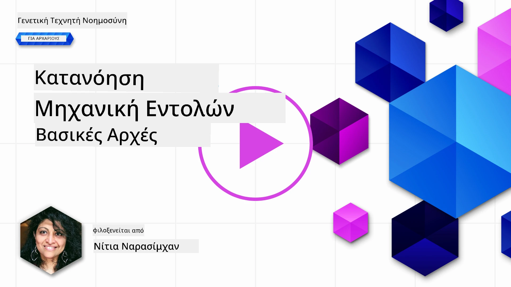
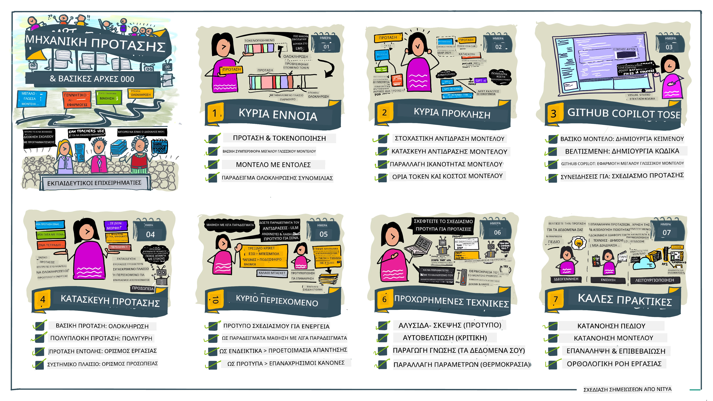
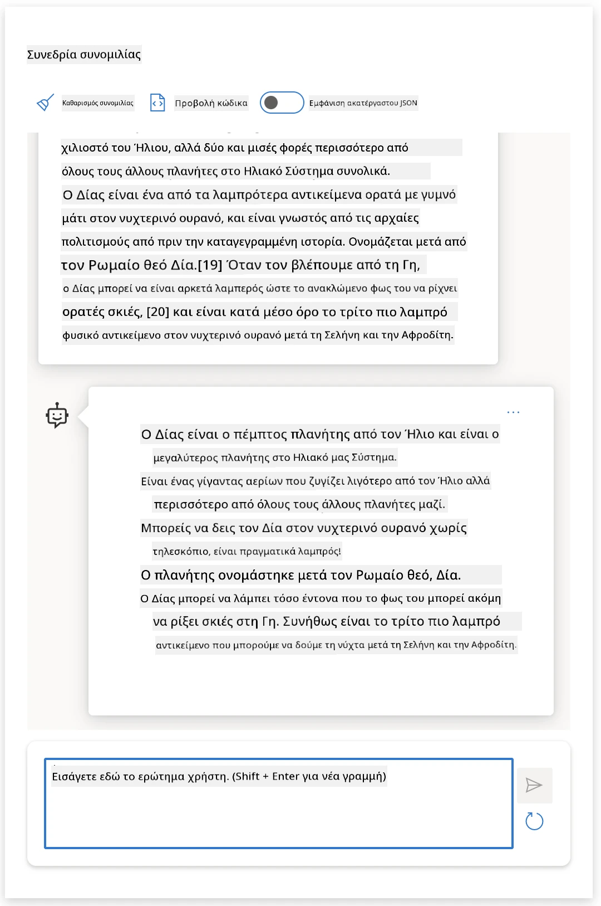
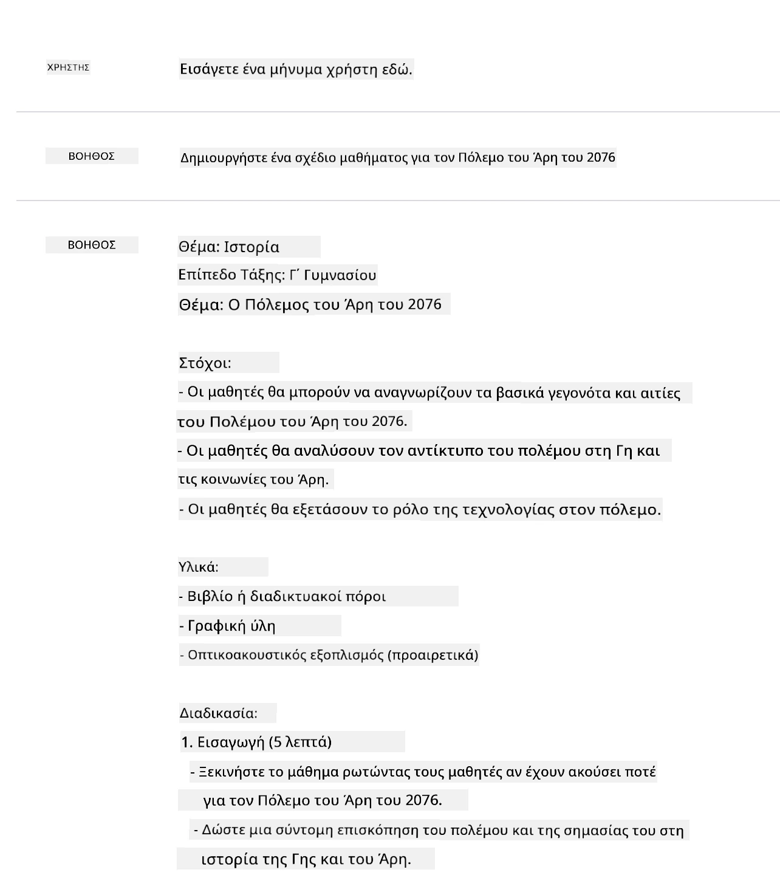
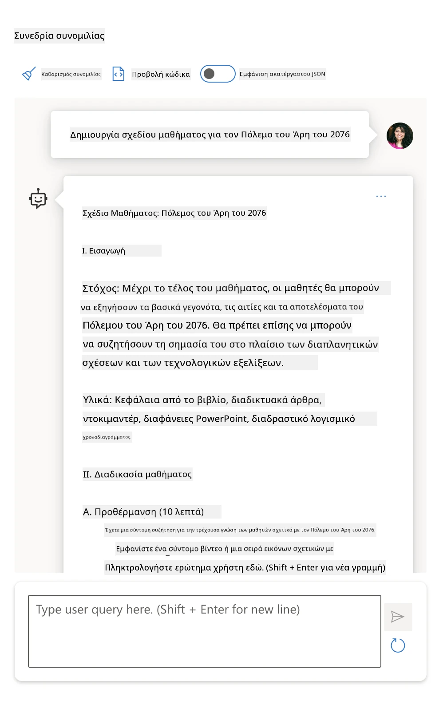
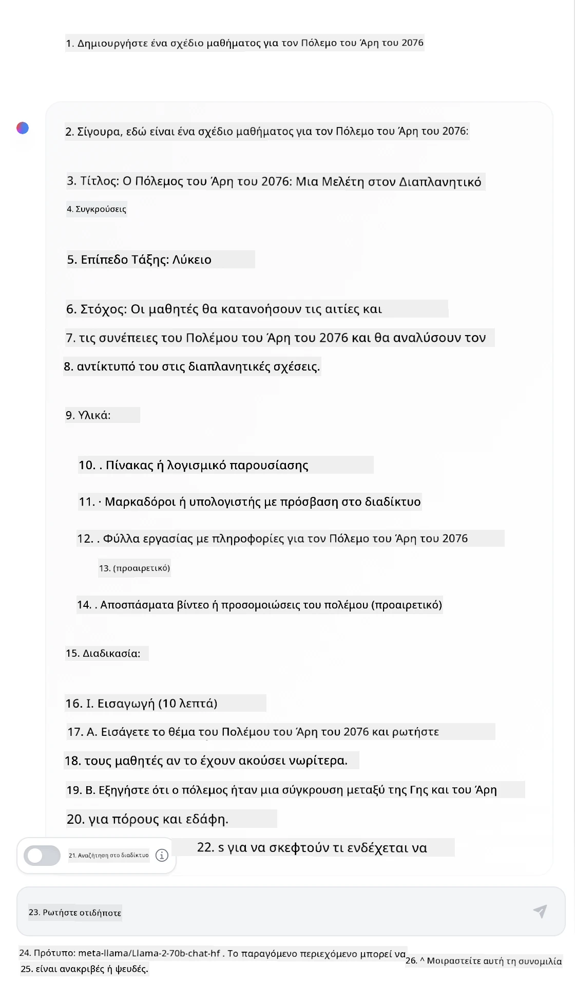

# Θεμέλια Σχεδιασμού Ερωτημάτων (Prompt Engineering)

[](https://youtu.be/GElCu2kUlRs?si=qrXsBvXnCW12epb8)

## Εισαγωγή
Αυτή η ενότητα καλύπτει βασικές έννοιες και τεχνικές για τη δημιουργία αποτελεσματικών ερωτημάτων (prompts) σε μοντέλα γεννητικής AI. Ο τρόπος που γράφετε το ερώτημά σας σε ένα LLM επίσης μετράει. Ένα προσεκτικά σχεδιασμένο ερώτημα μπορεί να επιτύχει καλύτερη ποιότητα απάντησης. Αλλά τι ακριβώς σημαίνουν οι όροι _prompt_ και _prompt engineering_; Και πώς βελτιώνω το _input_ του prompt που στέλνω στο LLM; Αυτά είναι τα ερωτήματα που θα προσπαθήσουμε να απαντήσουμε σε αυτό το κεφάλαιο και το επόμενο.

Η _Γεννητική Τεχνητή Νοημοσύνη_ μπορεί να δημιουργεί νέο περιεχόμενο (π.χ. κείμενα, εικόνες, ήχο, κώδικα κτλ.) ως αντίδραση σε αιτήματα χρηστών. Αυτό επιτυγχάνεται με _Μεγάλα Γλωσσικά Μοντέλα_ όπως η σειρά GPT της OpenAI ("Generative Pre-trained Transformer") που έχουν εκπαιδευτεί στη χρήση φυσικής γλώσσας και κώδικα.

Οι χρήστες πλέον μπορούν να αλληλεπιδράσουν με αυτά τα μοντέλα χρησιμοποιώντας οικεία παραδείγματα όπως η συνομιλία, χωρίς να χρειάζονται τεχνικές γνώσεις ή εκπαίδευση. Τα μοντέλα είναι _βασισμένα σε prompt_ – οι χρήστες στέλνουν ένα κείμενο (prompt) και λαμβάνουν την απάντηση της AI (completion). Μπορούν στη συνέχεια να "συνομιλήσουν με την AI" επαναληπτικά, σε διαλογικές συνομιλίες, βελτιώνοντας το prompt μέχρι η απάντηση να ταιριάζει στις προσδοκίες τους.

Τα "prompts" γίνονται πλέον η βασική _διεπαφή προγραμματισμού_ για εφαρμογές γεννητικής AI, λέγοντας στα μοντέλα τι να κάνουν και επηρεάζοντας την ποιότητα των επιστρεφόμενων απαντήσεων. Το "Prompt Engineering" είναι ένα ταχέως αναπτυσσόμενο πεδίο που εστιάζει στο _σχεδιασμό και την βελτιστοποίηση_ prompts για να παραδίδουν συνεπείς και ποιοτικές απαντήσεις σε κλίμακα.

## Στόχοι Μάθησης

Σε αυτό το μάθημα, θα μάθουμε τι είναι το Prompt Engineering, γιατί έχει σημασία και πώς μπορούμε να σχεδιάσουμε πιο αποτελεσματικά prompts για ένα δεδομένο μοντέλο και στόχο εφαρμογής. Θα κατανοήσουμε βασικές έννοιες και βέλτιστες πρακτικές σχεδιασμού - και θα μάθουμε για ένα διαδραστικό περιβάλλον Jupyter Notebooks "sandbox" όπου μπορούμε να δούμε αυτές τις έννοιες εφαρμοσμένες σε πραγματικά παραδείγματα.

Στο τέλος αυτού του μαθήματος θα μπορούμε να:

1. Εξηγήσουμε τι είναι το prompt engineering και γιατί έχει σημασία.
2. Περιγράψουμε τα συστατικά ενός prompt και πώς χρησιμοποιούνται.
3. Μάθουμε βέλτιστες πρακτικές και τεχνικές για prompt engineering.
4. Εφαρμόσουμε τις μάθειες τεχνικές σε πραγματικά παραδείγματα, χρησιμοποιώντας ένα endpoint της OpenAI.

## Βασικοί Όροι

Prompt Engineering: Η πρακτική σχεδιασμού και βελτίωσης εισόδων για να καθοδηγήσουν τα μοντέλα AI προς την παραγωγή επιθυμητών αποτελεσμάτων.  
Tokenization: Η διαδικασία μετατροπής κειμένου σε μικρότερες μονάδες, που ονομάζονται tokens, τις οποίες ένα μοντέλο μπορεί να κατανοήσει και να επεξεργαστεί.  
Instruction-Tuned LLMs: Μεγάλα Γλωσσικά Μοντέλα (LLMs) που έχουν βελτιωθεί με συγκεκριμένες οδηγίες για να βελτιώσουν την ακρίβεια και τη σχετικότητα των απαντήσεών τους.

## Περιβάλλον Μάθησης Sandbox

Το prompt engineering είναι προς το παρόν περισσότερο τέχνη παρά επιστήμη. Ο καλύτερος τρόπος να βελτιώσουμε την διαίσθησή μας είναι να _εξασκηθούμε περισσότερο_ και να υιοθετήσουμε μια προσέγγιση δοκιμής και λάθους που συνδυάζει γνώση του τομέα εφαρμογής με προτεινόμενες τεχνικές και βελτιστοποιήσεις ειδικές για το μοντέλο.

Το Jupyter Notebook που συνοδεύει αυτό το μάθημα παρέχει ένα περιβάλλον _sandbox_ όπου μπορείτε να δοκιμάσετε όσα μαθαίνετε – εν κινήσει ή ως μέρος της πρόκλησης κώδικα στο τέλος. Για να εκτελέσετε τις ασκήσεις, θα χρειαστείτε:

1. **Κλειδί API Azure OpenAI** – το endpoint υπηρεσίας για ένα αναπτυγμένο LLM.  
2. **Python Runtime** – στον οποίο μπορεί να εκτελεστεί το Notebook.  
3. **Τοπικές μεταβλητές περιβάλλοντος** – _ολοκληρώστε τώρα τα βήματα [SETUP](./../00-course-setup/02-setup-local.md?WT.mc_id=academic-105485-koreyst) για να είστε έτοιμοι_.

Το notebook έρχεται με _ασκήσεις εκκίνησης_ – αλλά είστε ενθαρρυμένοι να προσθέσετε δικά σας τμήματα _Markdown_ (περιγραφή) και _Κώδικα_ (αιτήματα prompt) για να δοκιμάσετε περισσότερα παραδείγματα ή ιδέες – και να χτίσετε τη διαίσθησή σας για το σχεδιασμό prompt.

## Οδηγός με Εικονογράφηση

Θέλετε να πάρετε μια συνολική εικόνα για το τι καλύπτει το μάθημα πριν εμβαθύνετε; Δείτε αυτόν τον εικονογραφημένο οδηγό, που σας δίνει μια αίσθηση των βασικών θεμάτων και σημαντικών σημείων για να σκεφτείτε σε κάθε μέρος. Ο οδικός χάρτης του μαθήματος σας οδηγεί από την κατανόηση των βασικών εννοιών και προκλήσεων μέχρι την αντιμετώπισή τους με σχετικά τεχνικές prompt engineering και βέλτιστες πρακτικές. Σημειώστε ότι το τμήμα "Προχωρημένες Τεχνικές" σε αυτόν τον οδηγό αναφέρεται σε περιεχόμενο που καλύπτεται στο _επόμενο_ κεφάλαιο αυτής της ύλης.



## Η Startup Μας

Τώρα, ας μιλήσουμε για το πώς _αυτό το θέμα_ σχετίζεται με την αποστολή της startup μας να [φέρουμε καινοτομία AI στην εκπαίδευση](https://educationblog.microsoft.com/2023/06/collaborating-to-bring-ai-innovation-to-education?WT.mc_id=academic-105485-koreyst). Θέλουμε να δημιουργήσουμε εφαρμογές με δυνατότητες AI για _προσωποποιημένη μάθηση_ – οπότε ας σκεφτούμε πώς διαφορετικοί χρήστες της εφαρμογής μας μπορεί να "σχεδιάζουν" prompts:

- **Διαχειριστές** μπορεί να ζητούν από την AI να _αναλύσει δεδομένα προγράμματος σπουδών για να εντοπίσει κενά στην κάλυψη_. Η AI μπορεί να συνοψίσει τα αποτελέσματα ή να τα απεικονίσει με κώδικα.  
- **Εκπαιδευτικοί** μπορεί να ζητούν η AI να _δημιουργήσει ένα σχέδιο μαθήματος για ένα συγκεκριμένο κοινό και θέμα_. Η AI μπορεί να κατασκευάσει το εξατομικευμένο σχέδιο σε προκαθορισμένη μορφή.  
- **Μαθητές** μπορεί να ζητούν από την AI να _τους διδάξει ένα δύσκολο μάθημα_. Η AI μπορεί να καθοδηγήσει τώρα τους μαθητές με μαθήματα, υποδείξεις & παραδείγματα προσαρμοσμένα στο επίπεδό τους.

Αυτά είναι μόνο η αρχή. Δείτε το [Prompts For Education](https://github.com/microsoft/prompts-for-edu/tree/main?WT.mc_id=academic-105485-koreyst) – μια βιβλιοθήκη ανοιχτού κώδικα με prompts επιμελημένη από ειδικούς στην εκπαίδευση – για να έχετε μια ευρύτερη εικόνα των δυνατοτήτων! _Δοκιμάστε να τρέξετε κάποια από αυτά τα prompts στο sandbox ή στο OpenAI Playground για να δείτε τι συμβαίνει!_

<!--
LESSON TEMPLATE:
This unit should cover core concept #1.
Reinforce the concept with examples and references.

CONCEPT #1:
Prompt Engineering.
Define it and explain why it is needed.
-->

## Τι είναι το Prompt Engineering;

Ξεκινήσαμε αυτό το μάθημα ορίζοντας το **Prompt Engineering** ως τη διαδικασία του _σχεδιασμού και της βελτιστοποίησης_ εισόδων κειμένου (prompts) για να παραδώσει συνεπείς και ποιοτικές απαντήσεις (completions) για έναν συγκεκριμένο στόχο εφαρμογής και μοντέλου. Μπορούμε να το σκεφτούμε ως μια διεργασία 2 βημάτων:

- _σχεδιασμός_ του αρχικού prompt για ένα δεδομένο μοντέλο και στόχο  
- _βελτίωση_ του prompt επαναληπτικά για τη βελτίωση της ποιότητας της απάντησης

Αυτή είναι αναγκαστικά μια διαδικασία δοκιμής-λάθους που απαιτεί διαίσθηση και προσπάθεια από τον χρήστη για να πετύχει βέλτιστα αποτελέσματα. Γιατί, λοιπόν, είναι σημαντικό; Για να απαντήσουμε σε αυτό το ερώτημα, πρώτα πρέπει να κατανοήσουμε τρεις έννοιες:

- _Tokenization_ = πώς το μοντέλο "βλέπει" το prompt  
- _Base LLMs_ = πώς το βασικό μοντέλο "επεξεργάζεται" ένα prompt  
- _Instruction-Tuned LLMs_ = πώς το μοντέλο πλέον μπορεί να αντιλαμβάνεται "εργασίες"

### Tokenization

Ένα LLM βλέπει τα prompts ως _σειρά από tokens_, όπου διαφορετικά μοντέλα (ή εκδόσεις ενός μοντέλου) μπορούν να διαχωρίσουν το ίδιο prompt με διαφορετικούς τρόπους. Επειδή τα LLM εκπαιδεύονται σε tokens (και όχι σε ακατέργαστο κείμενο), ο τρόπος που τα prompts μετατρέπονται σε tokens επηρεάζει άμεσα την ποιότητα της παραγόμενης απάντησης.

Για να πάρετε μια διαίσθηση για το πώς δουλεύει η tokenization, δοκιμάστε εργαλεία όπως το [OpenAI Tokenizer](https://platform.openai.com/tokenizer?WT.mc_id=academic-105485-koreyst) που φαίνεται παρακάτω. Αντιγράψτε το prompt σας – και δείτε πώς αυτό μετατρέπεται σε tokens, δίνοντας προσοχή στο πώς αντιμετωπίζονται οι χαρακτήρες κενών και τα σημεία στίξης. Σημειώστε ότι αυτό το παράδειγμα δείχνει ένα παλαιότερο LLM (GPT-3) – έτσι δοκιμάζοντας το με νεότερο μοντέλο μπορεί να παράγει διαφορετικό αποτέλεσμα.


### Έννοια: Βασικά Μοντέλα (Foundation Models)

Μόλις ένα prompt μετατραπεί σε tokens, η κύρια λειτουργία του ["Base LLM"](https://blog.gopenai.com/an-introduction-to-base-and-instruction-tuned-large-language-models-8de102c785a6?WT.mc_id=academic-105485-koreyst) (ή θεμελιώδες μοντέλο) είναι να προβλέψει το επόμενο token στη σειρά αυτή. Επειδή τα LLM έχουν εκπαιδευτεί σε τεράστια σύνολα κειμένων, έχουν καλή αίσθηση των στατιστικών συσχετίσεων μεταξύ των tokens και μπορούν να κάνουν αυτή την πρόβλεψη με κάποια βεβαιότητα. Σημειώστε ότι δεν κατανοούν το _νόημα_ των λέξεων στο prompt ή το token· βλέπουν μόνο ένα μοτίβο που μπορούν να "συμπληρώσουν" με την επόμενη πρόβλεψή τους. Μπορούν να συνεχίσουν να προβλέπουν τη σειρά μέχρι να διακοπούν από χειροκίνητη παρέμβαση ή κάποιο προκαθορισμένο όρο.

Θέλετε να δείτε πώς δουλεύει η συμπλήρωση βασισμένη σε prompt; Εισάγετε το παραπάνω prompt στο Azure OpenAI Studio [_Chat Playground_](https://oai.azure.com/playground?WT.mc_id=academic-105485-koreyst) με τις προεπιλεγμένες ρυθμίσεις. Το σύστημα είναι ρυθμισμένο ώστε να θεωρεί τα prompts ως αιτήματα πληροφοριών – οπότε θα δείτε μια συμπλήρωση που ικανοποιεί αυτό το πλαίσιο.

Αλλά τι γίνεται αν ο χρήστης θέλει να δει κάτι συγκεκριμένο που ικανοποιεί κάποιο κριτήριο ή στόχο εργασίας; Εδώ μπαίνουν στο προσκήνιο τα _instruction-tuned_ LLMs.


### Έννοια: Instruction Tuned LLMs

Ένα [Instruction Tuned LLM](https://blog.gopenai.com/an-introduction-to-base-and-instruction-tuned-large-language-models-8de102c785a6?WT.mc_id=academic-105485-koreyst) ξεκινά από το βασικό μοντέλο και το βελτιστοποιεί με παραδείγματα ή ζεύγη εισόδου/εξόδου (π.χ., "μηνύματα" πολλαπλών γύρων) που μπορεί να περιέχουν σαφείς οδηγίες – και η απάντηση από την AI προσπαθεί να ακολουθήσει αυτή την οδηγία.

Αυτό χρησιμοποιεί τεχνικές όπως την Ενισχυτική Μάθηση με Ανθρώπινη Ανατροφοδότηση (Reinforcement Learning with Human Feedback - RLHF) που εκπαιδεύουν το μοντέλο να _ακολουθεί οδηγίες_ και να _μαθαίνει από σχόλια_ ώστε να παράγει απαντήσεις που είναι καλύτερα προσαρμοσμένες σε πρακτικές εφαρμογές και πιο σχετικές με τους στόχους του χρήστη.

Ας το δοκιμάσουμε – επανεξετάστε το παραπάνω prompt, αλλά τώρα αλλάξτε το _system message_ ώστε να δώσει την εξής οδηγία ως πλαίσιο:

> _Συνοψίστε το περιεχόμενο που σας δίνεται για μαθητή δεύτερης τάξης. Κρατήστε το αποτέλεσμα σε μια παράγραφο με 3-5 κουκκίδες._

Βλέπετε πώς το αποτέλεσμα έχει ρυθμιστεί ώστε να αντανακλά τον επιθυμητό σκοπό και μορφή; Ένας εκπαιδευτικός μπορεί πλέον να χρησιμοποιήσει άμεσα αυτή την απάντηση στις διαφάνειές του για εκείνο το μάθημα.



## Γιατί χρειαζόμαστε το Prompt Engineering;

Τώρα που ξέρουμε πώς επεξεργάζονται τα prompts τα LLMs, ας μιλήσουμε για το _γιατί_ χρειαζόμαστε το prompt engineering. Η απάντηση έγκειται στο γεγονός ότι τα τρέχοντα LLM αντιμετωπίζουν μια σειρά προκλήσεων που καθιστούν πιο δύσκολη την επίτευξη _αξιόπιστων και συνεπών απαντήσεων_ χωρίς προσπάθεια στον σχεδιασμό και την βελτιστοποίηση του prompt. Για παράδειγμα:

1. **Οι απαντήσεις των μοντέλων είναι στοχαστικές.** Το _ίδιο prompt_ πιθανώς θα παράγει διαφορετικές απαντήσεις με διαφορετικά μοντέλα ή εκδόσεις μοντέλων. Και μπορεί ακόμη να παράγει διαφορετικά αποτελέσματα με το _ίδιο μοντέλο_ σε διαφορετικές χρονικές στιγμές. _Οι τεχνικές prompt engineering μπορούν να μας βοηθήσουν να ελαχιστοποιήσουμε αυτές τις μεταβολές παρέχοντας καλύτερους κανόνες προστασίας_.

2. **Τα μοντέλα μπορούν να επινοήσουν απαντήσεις.** Τα μοντέλα έχουν εκπαιδευτεί με _μεγάλα αλλά πεπερασμένα_ σύνολα δεδομένων, που σημαίνει ότι στερούνται γνώση για έννοιες εκτός της εμβέλειας εκπαίδευσης τους. Ως αποτέλεσμα, μπορούν να παράγουν συμπληρώσεις που είναι ανακριβείς, φανταστικές ή άμεσα αντιφατικές με γνωστές αλήθειες. _Οι τεχνικές prompt engineering βοηθούν τους χρήστες να εντοπίζουν και να μετριάζουν τέτοιες επινοήσεις π.χ. ζητώντας από την AI αναφορές ή αιτιολόγηση_.

3. **Οι δυνατότητες των μοντέλων θα διαφέρουν.** Νεότερα μοντέλα ή γενιές μοντέλων θα έχουν πλουσιότερες δυνατότητες αλλά φέρνουν επίσης μοναδικά χαρακτηριστικά και ζυγώσεις κόστους & πολυπλοκότητας. _Το prompt engineering μπορεί να μας βοηθήσει να αναπτύξουμε βέλτιστες πρακτικές και ροές εργασίας που αφαιρούν τις διαφορές και προσαρμόζονται σε ανάγκες συγκεκριμένων μοντέλων με επεκτάσιμο, ομαλό τρόπο_.

Ας δούμε πώς λειτουργεί αυτό πρακτικά στο OpenAI ή Azure OpenAI Playground:

- Χρησιμοποιήστε το ίδιο prompt σε διαφορετικές αναπτύξεις LLM (π.χ., OpenAI, Azure OpenAI, Hugging Face) – είδατε τις διαφορές;  
- Χρησιμοποιήστε το ίδιο prompt επανειλημμένα με την _ίδια_ ανάπτυξη LLM (π.χ., Azure OpenAI playground) – πώς διέφεραν αυτές οι παραλλαγές;

### Παράδειγμα Επινοήσεων (Fabrications)

Σε αυτό το μάθημα, χρησιμοποιούμε τον όρο **"επινόηση"** για να αναφερθούμε στο φαινόμενο όπου τα LLMs μερικές φορές παράγουν πραγματολογικά ανακριβείς πληροφορίες λόγω περιορισμών στην εκπαίδευσή τους ή άλλων παραγόντων. Μπορεί να έχετε ακούσει αυτό να αναφέρεται ως _"παραισθήσεις"_ σε δημοφιλή άρθρα ή ερευνητικές εργασίες. Ωστόσο, προτείνουμε να χρησιμοποιούμε τον όρο _"επινόηση"_ ώστε να μην ανθρωπομορφίζουμε ακούσια τη συμπεριφορά αποδίδοντας ανθρώπινα χαρακτηριστικά σε ένα αποτέλεσμα που παράγεται μηχανικά. Αυτό επίσης ενισχύει τις [Οδηγίες Υπεύθυνης AI](https://www.microsoft.com/ai/responsible-ai?WT.mc_id=academic-105485-koreyst) από άποψη ορολογίας, αποφεύγοντας όρους που μπορεί να θεωρηθούν προσβλητικοί ή μη συμπεριληπτικοί σε ορισμένα πλαίσια.

Θέλετε να πάρετε μια αίσθηση του πώς λειτουργούν οι επινοήσεις; Σκεφτείτε ένα prompt που δίνει οδηγία στην AI να δημιουργήσει περιεχόμενο για ένα ανύπαρκτο θέμα (για να διασφαλίσει ότι δεν υπάρχει στο σύνολο εκπαίδευσης). Για παράδειγμα – δοκίμασα το prompt:

> **Prompt:** δημιουργήστε ένα σχέδιο μαθήματος για τον Πόλεμο στον Άρη του 2076.
Ένας διαδικτυακός έλεγχος μου έδειξε ότι υπήρχαν φανταστικές αφηγήσεις (π.χ., τηλεοπτικές σειρές ή βιβλία) για τους πολέμους στον Άρη - αλλά κανένας το 2076. Η κοινή λογική επίσης μας λέει ότι το 2076 είναι _στο μέλλον_ και επομένως, δεν μπορεί να συνδεθεί με ένα πραγματικό γεγονός.

Τι συμβαίνει λοιπόν όταν εκτελούμε αυτή την εντολή (prompt) με διαφορετικούς παρόχους LLM;

> **Απάντηση 1**: OpenAI Playground (GPT-35)



> **Απάντηση 2**: Azure OpenAI Playground (GPT-35)



> **Απάντηση 3**: : Hugging Face Chat Playground (LLama-2)



Όπως αναμενόταν, κάθε μοντέλο (ή έκδοση μοντέλου) παράγει ελαφρώς διαφορετικές απαντήσεις χάρη στην τυχαία συμπεριφορά και τις διαφορές στην ικανότητα του μοντέλου. Για παράδειγμα, ένα μοντέλο απευθύνεται σε κοινό της 8ης τάξης ενώ το άλλο υποθέτει μαθητή λυκείου. Αλλά και τα τρία μοντέλα δημιούργησαν απαντήσεις που θα μπορούσαν να πείσουν έναν ανεπίσημο χρήστη ότι το γεγονός ήταν πραγματικό.

Τεχνικές μηχανικής προτροπών (prompt engineering) όπως το _metaprompting_ και η _ρύθμιση θερμοκρασίας_ μπορεί να μειώσουν κάπως τις κατασκευές (fabrications) των μοντέλων. Νέες _αρχιτεκτονικές_ μηχανικής προτροπών ενσωματώνουν επίσης νέα εργαλεία και τεχνικές απρόσκοπτα στη ροή της προτροπής, ώστε να μετριάσουν ή να μειώσουν ορισμένα από αυτά τα φαινόμενα.

## Μελέτη Περίπτωσης: GitHub Copilot

Ας ολοκληρώσουμε αυτή την ενότητα κάνοντας μια γεύση για το πώς η μηχανική προτροπής χρησιμοποιείται σε λύσεις πραγματικού κόσμου, εξετάζοντας μια Μελέτη Περίπτωσης: [GitHub Copilot](https://github.com/features/copilot?WT.mc_id=academic-105485-koreyst).

Το GitHub Copilot είναι ο "Συνεργάτης Προγραμματισμού με Τεχνητή Νοημοσύνη" - μετατρέπει τις κείμενες εντολές σε ολοκληρώσεις κώδικα και είναι ενσωματωμένο στο περιβάλλον ανάπτυξής σας (π.χ., Visual Studio Code) για μια απρόσκοπτη εμπειρία χρήστη. Όπως τεκμηριώνεται στη σειρά των παρακάτω ιστολογίων, η πρώτη έκδοση βασιζόταν στο μοντέλο OpenAI Codex - με τους μηχανικούς να συνειδητοποιούν γρήγορα την ανάγκη για fine-tune του μοντέλου και την ανάπτυξη καλύτερων τεχνικών μηχανικής προτροπών, προκειμένου να βελτιωθεί η ποιότητα του κώδικα. Τον Ιούλιο, παρουσιάστηκε [ένα βελτιωμένο μοντέλο AI που ξεπερνά το Codex](https://github.blog/2023-07-28-smarter-more-efficient-coding-github-copilot-goes-beyond-codex-with-improved-ai-model/?WT.mc_id=academic-105485-koreyst) για ακόμα ταχύτερες προτάσεις.

Διαβάστε τις αναρτήσεις με τη σειρά τους, για να ακολουθήσετε το ταξίδι μάθησής τους.

- **Μάιος 2023** | [Το GitHub Copilot γίνεται καλύτερο στο να κατανοεί τον κώδικά σας](https://github.blog/2023-05-17-how-github-copilot-is-getting-better-at-understanding-your-code/?WT.mc_id=academic-105485-koreyst)
- **Μάιος 2023** | [Μέσα στο GitHub: Εργασία με τα LLMs πίσω από το GitHub Copilot](https://github.blog/2023-05-17-inside-github-working-with-the-llms-behind-github-copilot/?WT.mc_id=academic-105485-koreyst)
- **Ιούνιος 2023** | [Πώς να γράψετε καλύτερες προτροπές για το GitHub Copilot](https://github.blog/2023-06-20-how-to-write-better-prompts-for-github-copilot/?WT.mc_id=academic-105485-koreyst)
- **Ιούλιος 2023** | [.. Το GitHub Copilot ξεπερνά το Codex με βελτιωμένο μοντέλο AI](https://github.blog/2023-07-28-smarter-more-efficient-coding-github-copilot-goes-beyond-codex-with-improved-ai-model/?WT.mc_id=academic-105485-koreyst)
- **Ιούλιος 2023** | [Οδηγός Προγραμματιστή για Μηχανική Προτροπών και LLMs](https://github.blog/2023-07-17-prompt-engineering-guide-generative-ai-llms/?WT.mc_id=academic-105485-koreyst)
- **Σεπτέμβριος 2023** | [Πώς να χτίσετε μια εφαρμογή LLM για επιχειρήσεις: Μαθήματα από το GitHub Copilot](https://github.blog/2023-09-06-how-to-build-an-enterprise-llm-application-lessons-from-github-copilot/?WT.mc_id=academic-105485-koreyst)

Μπορείτε επίσης να περιηγηθείτε στο [Engineering blog](https://github.blog/category/engineering/?WT.mc_id=academic-105485-koreyst) τους για περισσότερες αναρτήσεις όπως [αυτή](https://github.blog/2023-09-27-how-i-used-github-copilot-chat-to-build-a-reactjs-gallery-prototype/?WT.mc_id=academic-105485-koreyst) που δείχνουν πώς αυτά τα μοντέλα και τεχνικές _εφαρμόζονται_ για την προώθηση πρακτικών εφαρμογών.

---

<!--
LESSON TEMPLATE:
This unit should cover core concept #2.
Reinforce the concept with examples and references.

CONCEPT #2:
Prompt Design.
Illustrated with examples.
-->

## Κατασκευή Προτροπής

Έχουμε δει γιατί η μηχανική προτροπής είναι σημαντική - τώρα ας κατανοήσουμε πώς οι προτροπές _κατασκευάζονται_ ώστε να αξιολογήσουμε διαφορετικές τεχνικές για πιο αποτελεσματικό σχεδιασμό προτροπών.

### Βασική Προτροπή

Ας ξεκινήσουμε με την βασική προτροπή: μια κειμενική είσοδος που αποστέλλεται στο μοντέλο χωρίς άλλο πλαίσιο. Να ένα παράδειγμα - όταν στέλνουμε τις πρώτες λέξεις του εθνικού ύμνου των ΗΠΑ στο OpenAI [Completion API](https://platform.openai.com/docs/api-reference/completions?WT.mc_id=academic-105485-koreyst), συμπληρώνει αμέσως την απάντηση με τις επόμενες γραμμές, απεικονίζοντας τη βασική συμπεριφορά πρόβλεψης.

| Προτροπή (Είσοδος)     | Ολοκλήρωση (Έξοδος)                                                                                                                        |
| :----------------- | :----------------------------------------------------------------------------------------------------------------------------------------- |
| Oh say can you see | Ακούγεται σαν να ξεκινάς τους στίχους του "The Star-Spangled Banner," του εθνικού ύμνου των Ηνωμένων Πολιτειών. Ο πλήρης στίχος είναι ... |

### Σύνθετη Προτροπή

Τώρα ας προσθέσουμε πλαίσιο και οδηγίες σε αυτή τη βασική προτροπή. Η [Chat Completion API](https://learn.microsoft.com/azure/ai-services/openai/how-to/chatgpt?WT.mc_id=academic-105485-koreyst) μας επιτρέπει να κατασκευάσουμε μια σύνθετη προτροπή ως συλλογή _μηνυμάτων_ με:

- Ζεύγη εισόδου/εξόδου που αντικατοπτρίζουν _είσοδο_ χρήστη και _απάντηση_ βοηθού.
- Μήνυμα συστήματος που ορίζει το πλαίσιο για τη συμπεριφορά ή προσωπικότητα του βοηθού.

Το αίτημα είναι πλέον στη μορφή παρακάτω, όπου η _τοκενικοποίηση_ αιχμαλωτίζει αποτελεσματικά τις σχετικές πληροφορίες από το πλαίσιο και τη συνομιλία. Η αλλαγή του πλαισίου συστήματος μπορεί να έχει αντίστοιχο αντίκτυπο στην ποιότητα των ολοκληρώσεων με αυτές των παρεχόμενων εισόδων χρήστη.

```python
response = openai.chat.completions.create(
    model="gpt-3.5-turbo",
    messages=[
        {"role": "system", "content": "You are a helpful assistant."},
        {"role": "user", "content": "Who won the world series in 2020?"},
        {"role": "assistant", "content": "The Los Angeles Dodgers won the World Series in 2020."},
        {"role": "user", "content": "Where was it played?"}
    ]
)
```

### Προτροπή Οδηγιών

Στα παραπάνω παραδείγματα, η προτροπή του χρήστη ήταν ένα απλό κείμενο που μπορεί να ερμηνευτεί ως αίτημα για πληροφορίες. Με τις προτροπές _οδηγιών_, μπορούμε να χρησιμοποιήσουμε αυτό το κείμενο για να ορίσουμε μια εργασία με περισσότερες λεπτομέρειες, παρέχοντας καλύτερη καθοδήγηση στην AI. Να ένα παράδειγμα:

| Προτροπή (Είσοδος)                                                                                                                                                                                                                         | Ολοκλήρωση (Έξοδος)                                                                                                        | Τύπος Οδηγίας    |
| :------------------------------------------------------------------------------------------------------------------------------------------------------------------------------------------------------------------------------------- | :------------------------------------------------------------------------------------------------------------------------- | :------------------ |
| Γράψε μια περιγραφή για τον Εμφύλιο Πόλεμο                                                                                                                                                                                                | _επιστράφηκε μια απλή παράγραφος_                                                                                          | Απλή               |
| Γράψε μια περιγραφή για τον Εμφύλιο Πόλεμο. Παρέθεσε βασικές ημερομηνίες και γεγονότα και περιέγραψε τη σημασία τους                                                                                                                   | _επιστράφηκε μια παράγραφος ακολουθούμενη από λίστα βασικών ημερομηνιών γεγονότων με περιγραφές_                             | Σύνθετη            |
| Γράψε μια περιγραφή του Εμφυλίου Πολέμου σε 1 παράγραφο. Παρέθεσε 3 σημεία κουκκίδων με βασικές ημερομηνίες και τη σημασία τους. Παρέθεσε 3 επιπλέον σημεία κουκκίδων με βασικές ιστορικές προσωπικότητες και τις συνεισφορές τους. Επέστρεψε το αποτέλεσμα ως αρχείο JSON | _επιστρέφει πιο εκτενείς λεπτομέρειες σε πλαίσιο κειμένου, μορφοποιημένο ως JSON που μπορείς να αντιγράψεις-επικολλήσεις σε αρχείο και να επικυρώσεις όπως χρειάζεται_ | Σύνθετη. Μορφοποιημένη.|

## Πρωτεύον Περιεχόμενο

Στα παραπάνω παραδείγματα, η προτροπή ήταν ακόμα αρκετά ανοιχτή, επιτρέποντας στο LLM να αποφασίσει ποιο μέρος του προεκπαιδευμένου συνόλου δεδομένων του είναι σχετικό. Με το μοτίβο σχεδιασμού _πρωτεύον περιεχόμενο_, το κείμενο εισόδου χωρίζεται σε δύο μέρη:

- μια οδηγία (ενέργεια)
- σχετικό περιεχόμενο (που επηρεάζει την ενέργεια)

Να ένα παράδειγμα όπου η οδηγία είναι "περίληψη σε 2 προτάσεις".

| Προτροπή (Είσοδος)                                                                                                                                                                                                                                                                                                                                                                                                                                                                                                                                                                                                                                                                                      | Ολοκλήρωση (Έξοδος)                                                                                                                                                                                                                                                                             |
| :-------------------------------------------------------------------------------------------------------------------------------------------------------------------------------------------------------------------------------------------------------------------------------------------------------------------------------------------------------------------------------------------------------------------------------------------------------------------------------------------------------------------------------------------------------------------------------------------------------------------------------------------------------------------------------------------------- | :---------------------------------------------------------------------------------------------------------------------------------------------------------------------------------------------------------------------------------------------------------------------------------------------- |
| Ο Δίας είναι ο πέμπτος πλανήτης από τον Ήλιο και ο μεγαλύτερος στο ηλιακό σύστημα. Είναι ένας γίγαντας αερίων με μάζα χιλίων φορές μικρότερη από αυτήν του Ήλιου, αλλά δυόμισι φορές αυτήν όλων των άλλων πλανητών του ηλιακού συστήματος μαζί. Ο Δίας είναι ένα από τα πιο φωτεινά αντικείμενα που φαίνονται με γυμνό μάτι στον νυχτερινό ουρανό και είναι γνωστός σε αρχαίους πολιτισμούς πριν την καταγεγραμμένη ιστορία. Ονομάζεται από τον Ρωμαίο θεό Δία.[19] Όταν παρατηρείται από τη Γη, ο Δίας μπορεί να είναι αρκετά φωτεινός ώστε το αντανακλώμενο φως του να δημιουργεί ορατές σκιές,[20] και κατά μέσο όρο είναι το τρίτο πιο φωτεινό φυσικό αντικείμενο στον νυχτερινό ουρανό μετά τη Σελήνη και την Αφροδίτη. <br/> **Περίληψέ το σε 2 σύντομες προτάσεις** | Ο Δίας, ο πέμπτος πλανήτης από τον Ήλιο, είναι ο μεγαλύτερος στο ηλιακό σύστημα και είναι γνωστός ως ένα από τα πιο φωτεινά αντικείμενα στον νυχτερινό ουρανό. Ονομάζεται από τον Ρωμαίο θεό Δία, είναι ένας γίγαντας αερίων με μάζα δυόμισι φορές μεγαλύτερη από αυτή όλων των άλλων πλανητών μαζί.     |

Το τμήμα πρωτεύοντος περιεχομένου μπορεί να χρησιμοποιηθεί με διάφορους τρόπους για να οδηγήσει σε πιο αποτελεσματικές οδηγίες:

- **Παραδείγματα** - αντί να πούμε στο μοντέλο τι να κάνει με μια ρητή οδηγία, δίνουμε παραδείγματα για το τι να κάνει και αφήνουμε να συμπεράνει το μοτίβο.
- **Υποδείξεις** - ακολουθούμε την οδηγία με μια "υπόδειξη" που ωθεί την ολοκλήρωση, καθοδηγώντας το μοντέλο προς πιο σχετικά αποτελέσματα.
- **Πρότυπα** - είναι επαναλαμβανόμενες 'συνταγές' για προτροπές με θέσεις (μεταβλητές) που μπορούν να προσαρμοστούν με δεδομένα για συγκεκριμένες περιπτώσεις.

Ας εξερευνήσουμε όλα αυτά στην πράξη.

### Χρήση Παραδειγμάτων

Αυτή είναι μια προσέγγιση όπου χρησιμοποιείτε το πρωτεύον περιεχόμενο για να "ταΐσετε" στο μοντέλο μερικά παραδείγματα του επιθυμητού αποτελέσματος για μια δεδομένη οδηγία, και το αφήνετε να συμπεράνει το μοτίβο για την επιθυμητή έξοδο. Με βάση τον αριθμό των παραδειγμάτων που παρέχονται, μπορούμε να έχουμε zero-shot prompting, one-shot prompting, few-shot prompting κλπ.

Η προτροπή πλέον αποτελείται από τρία συστατικά:

- Περιγραφή εργασίας
- Μερικά παραδείγματα της επιθυμητής εξόδου
- Η αρχή ενός νέου παραδείγματος (που γίνεται μια έμμεση περιγραφή εργασίας)

| Τύπος Μάθησης | Προτροπή (Είσοδος)                                                                                                                                        | Ολοκλήρωση (Έξοδος)         |
| :------------ | :---------------------------------------------------------------------------------------------------------------------------------------------------- | :-------------------------- |
| Zero-shot     | "The Sun is Shining". Μεταφράστε στα Ισπανικά                                                                                                           | "El Sol está brillando".    |
| One-shot      | "The Sun is Shining" => ""El Sol está brillando". <br> "It's a Cold and Windy Day" =>                                                                 | "Es un día frío y ventoso". |
| Few-shot      | Ο παίκτης έτρεξε τις βάσεις => Μπέιζμπολ <br/> Ο παίκτης έκανε άσο => Τέννις <br/> Ο παίκτης έκανε έξι => Κρίκετ <br/> Ο παίκτης έκανε κάρφωμα =>         | Καλάθια                    |
|               |                                                                                                                                                       |                             |

Δείτε πώς έπρεπε να δώσουμε ρητή οδηγία ("Μετάφραση στα Ισπανικά") στην zero-shot προτροπή, ενώ αυτή υπονοείται στο one-shot παράδειγμα. Το few-shot παράδειγμα δείχνει πώς η προσθήκη περισσότερων παραδειγμάτων επιτρέπει στα μοντέλα να κάνουν πιο ακριβείς υποθέσεις χωρίς πρόσθετες οδηγίες.

### Υποδείξεις Προτροπής

Μια άλλη τεχνική για τη χρήση πρωτεύοντος περιεχομένου είναι να παρέχονται _υποδείξεις_ αντί για παραδείγματα. Σε αυτή την περίπτωση, δίνουμε στο μοντέλο ένα σπρωξίμο προς τη σωστή κατεύθυνση, _ξεκινώντας_ με ένα απόσπασμα το οποίο αντανακλά τη μορφή της επιθυμητής απάντησης. Το μοντέλο τότε "λαμβάνει την υπόδειξη" και συνεχίζει με ανάλογο τρόπο.

| Αριθμός Υποδείξεων | Προτροπή (Είσοδος)                                                                                                                                                                                                                                                                                                                                                                                                                                               | Ολοκλήρωση (Έξοδος)                                                                                                                                                                                                                                                                                       |
| :------------- | :----------------------------------------------------------------------------------------------------------------------------------------------------------------------------------------------------------------------------------------------------------------------------------------------------------------------------------------------------------------------------------------------------------------------------------------------------------- | :-------------------------------------------------------------------------------------------------------------------------------------------------------------------------------------------------------------------------------------------------------------------------------------------------------- |
| 0              | Ο Δίας είναι ο πέμπτος πλανήτης από τον Ήλιο και ο μεγαλύτερος στο Ηλιακό Σύστημα. Είναι γίγαντας αερίων με μάζα ένα χιλιοστό αυτής του Ήλιου, αλλά δυόμισι φορές αυτήν όλων των άλλων πλανητών μαζί. Ο Δίας είναι ένα από τα πιο φωτεινά αντικείμενα που φαίνονται με γυμνό μάτι στον νυχτερινό ουρανό και είναι γνωστός σε αρχαίους πολιτισμούς από πριν την καταγεγραμμένη ιστορία. <br/>**Περίληψέ το**                                       | Ο Δίας είναι ο μεγαλύτερος πλανήτης στο Ηλιακό μας Σύστημα και ο πέμπτος από τον Ήλιο. Είναι ένας γίγαντας αερίων με μάζα 1/1000 αυτής του Ήλιου, αλλά βαρύτερος από όλους τους άλλους πλανήτες μαζί. Οι αρχαίοι πολιτισμοί γνώριζαν τον Δία για πολύ καιρό, και είναι εύκολα ορατός στον νυχτερινό ουρανό. |
| 1              | Ο Δίας είναι ο πέμπτος πλανήτης από τον Ήλιο και ο μεγαλύτερος στο Ηλιακό Σύστημα. Είναι ένας γιγάντιος αέριος πλανήτης με μάζα το χίλιοστό αυτής του Ήλιου, αλλά δύομιση φορές μεγαλύτερη από το άθροισμα όλων των άλλων πλανητών στο Ηλιακό Σύστημα. Ο Δίας είναι ένα από τα φωτεινότερα αντικείμενα ορατά με γυμνό μάτι στον νυχτερινό ουρανό και είναι γνωστός σε αρχαίους πολιτισμούς από πριν την καταγεγραμμένη ιστορία. <br/>**Σύνοψη** <br/> Αυτό που μάθαμε είναι ότι ο Δίας | είναι ο πέμπτος πλανήτης από τον Ήλιο και ο μεγαλύτερος στο Ηλιακό Σύστημα. Είναι ένας γιγάντιος αέριος πλανήτης με μάζα το χίλιοστό αυτή του Ήλιου, αλλά δύομιση φορές μεγαλύτερη από το άθροισμα όλων των άλλων πλανητών. Είναι εύκολα ορατός με γυμνό μάτι και είναι γνωστός από την αρχαιότητα.                        |
| 2              | Ο Δίας είναι ο πέμπτος πλανήτης από τον Ήλιο και ο μεγαλύτερος στο Ηλιακό Σύστημα. Είναι ένας γιγάντιος αέριος πλανήτης με μάζα το χίλιοστό αυτής του Ήλιου, αλλά δύομιση φορές μεγαλύτερη από το άθροισμα όλων των άλλων πλανητών στο Ηλιακό Σύστημα. Ο Δίας είναι ένα από τα φωτεινότερα αντικείμενα ορατά με γυμνό μάτι στον νυχτερινό ουρανό και είναι γνωστός σε αρχαίους πολιτισμούς από πριν την καταγεγραμμένη ιστορία. <br/>**Σύνοψη** <br/> Τα 3 Κορυφαία Γεγονότα Που Μάθαμε:         | 1. Ο Δίας είναι ο πέμπτος πλανήτης από τον Ήλιο και ο μεγαλύτερος στο Ηλιακό Σύστημα. <br/> 2. Είναι ένας γιγάντιος αέριος πλανήτης με μάζα το χίλιοστό αυτή του Ήλιου...<br/> 3. Ο Δίας είναι ορατός με γυμνό μάτι από την αρχαιότητα ...                                                                       |
|                |                                                                                                                                                                                                                                                                                                                                                                                                                                                              |                                                                                                                                                                                                                                                                                                           |

### Πρότυπα Προτροπών

Ένα πρότυπο προτροπής είναι μια _προκαθορισμένη συνταγή για μια προτροπή_ που μπορεί να αποθηκευτεί και να επαναχρησιμοποιηθεί όταν απαιτείται, για να οδηγεί σε πιο συνεπή εμπειρία χρήστη σε μεγάλη κλίμακα. Στην πιο απλή του μορφή, είναι απλώς μια συλλογή παραδειγμάτων προτροπών όπως [αυτό από το OpenAI](https://platform.openai.com/examples?WT.mc_id=academic-105485-koreyst) που παρέχει τόσο τα συστατικά της διαδραστικής προτροπής (μηνύματα χρήστη και συστήματος) όσο και τη μορφή του API για να υποστηρίξει την επανάχρηση.

Σε πιο σύνθετη μορφή, όπως [αυτό το παράδειγμα από το LangChain](https://python.langchain.com/docs/concepts/prompt_templates/?WT.mc_id=academic-105485-koreyst), περιέχει _κρατήσεις θέσεων_ που μπορούν να αντικατασταθούν με δεδομένα από διάφορες πηγές (εισαγωγή χρήστη, πλαίσιο συστήματος, εξωτερικές πηγές δεδομένων κ.α.) για να δημιουργηθεί μια προτροπή δυναμικά. Αυτό μας επιτρέπει να δημιουργήσουμε μια βιβλιοθήκη επαναχρησιμοποιούμενων προτροπών που μπορούν να χρησιμοποιηθούν για να οδηγούν σε συνεπείς εμπειρίες χρήστη **προγραμματιστικά** σε μεγάλη κλίμακα.

Τέλος, η πραγματική αξία των προτύπων είναι η δυνατότητα να δημιουργούνται και να δημοσιεύονται _βιβλιοθήκες προτροπών_ για κάθετη εφαρμογή περιοχών - όπου το πρότυπο προτροπής είναι πλέον _βελτιστοποιημένο_ ώστε να αντανακλά τα συμφραζόμενα ή παραδείγματα της εφαρμογής που καθιστούν τις απαντήσεις πιο σχετικές και ακριβείς για το στοχευόμενο κοινό χρηστών. Το αποθετήριο [Prompts For Edu](https://github.com/microsoft/prompts-for-edu?WT.mc_id=academic-105485-koreyst) αποτελεί ένα εξαιρετικό παράδειγμα αυτής της προσέγγισης, επιμελώντας μια βιβλιοθήκη προτροπών για το εκπαιδευτικό τομέα με έμφαση σε βασικούς στόχους όπως ο σχεδιασμός μαθημάτων, το πρόγραμμα σπουδών, η διδασκαλία μαθητών κ.α.

## Υποστηρικτικό Περιεχόμενο

Εάν σκεφτούμε τη συναρμολόγηση μιας προτροπής ως να έχει μια οδηγία (εργασία) και ένα στόχο (κύριο περιεχόμενο), τότε το _δευτερεύον περιεχόμενο_ είναι σαν επιπλέον πλαίσιο που παρέχουμε για να **επηρεάσει την έξοδο με κάποιον τρόπο**. Μπορεί να αφορά ρυθμιστικές παραμέτρους, οδηγίες μορφοποίησης, ταξινομίες θεμάτων κ.α. που μπορούν να βοηθήσουν το μοντέλο να _προσαρμόσει_ την απάντησή του ώστε να ταιριάζει καλύτερα στους επιθυμητούς στόχους ή προσδοκίες του χρήστη.

Π.χ.: Δεδομένου ενός καταλόγου μαθημάτων με εκτενή μεταδεδομένα (όνομα, περιγραφή, επίπεδο, ετικέτες μεταδεδομένων, διδάσκων κ.α.) για όλα τα διαθέσιμα μαθήματα στο πρόγραμμα σπουδών:

- μπορούμε να ορίσουμε μια οδηγία «συνοψίστε τον κατάλογο μαθημάτων για το Φθινόπωρο 2023»
- μπορούμε να χρησιμοποιήσουμε το κύριο περιεχόμενο για να δώσουμε μερικά παραδείγματα της επιθυμητής εξόδου
- μπορούμε να χρησιμοποιήσουμε το δευτερεύον περιεχόμενο για να προσδιορίσουμε τις κορυφαίες 5 «ετικέτες» ενδιαφέροντος.

Τώρα, το μοντέλο μπορεί να παρέχει μια σύνοψη στη μορφή που δείχνουν τα παραδείγματα - αλλά αν ένα αποτέλεσμα έχει πολλαπλές ετικέτες, μπορεί να δίνει προτεραιότητα στις 5 ετικέτες του δευτερεύοντος περιεχομένου.

---

<!--
ΠΡΟΤΥΠΟ ΜΑΘΗΜΑΤΟΣ:
Αυτή η ενότητα θα καλύπτει βασική έννοια #1.
Ενισχύστε την έννοια με παραδείγματα και αναφορές.

ΕΝΝΟΙΑ #3:
Τεχνικές Μηχανικής των Προτροπών.
Ποιες είναι μερικές βασικές τεχνικές για τη μηχανική προτροπών;
Δείξτε το με ασκήσεις.
-->

## Βέλτιστες Πρακτικές Προτροπής

Τώρα που ξέρουμε πώς μπορούν να _δημιουργηθούν_ οι προτροπές, μπορούμε να αρχίσουμε να σκεφτόμαστε πώς να τις _σχεδιάσουμε_ για να αντανακλούν τις βέλτιστες πρακτικές. Το σκεφτόμαστε σε δύο μέρη - έχοντας τη σωστή _νοοτροπία_ και εφαρμόζοντας τις σωστές _τεχνικές_.

### Νοοτροπία Μηχανικής Προτροπών

Η Μηχανική Προτροπών είναι μια διαδικασία δοκιμών και λαθών, οπότε κρατήστε τρεις ευρείες κατευθυντήριες γραμμές στο νου:

1. **Η Κατανόηση του Τομέα Μετράει.** Η ακρίβεια και η συνάφεια της απάντησης εξαρτάται από τον _τομέα_ στον οποίο λειτουργεί αυτή η εφαρμογή ή ο χρήστης. Εφαρμόστε την ενστικτώδη γνώση και την εμπειρία του τομέα σας για να **προσαρμόσετε περαιτέρω τις τεχνικές**. Για παράδειγμα, ορίστε _προσωπικότητες ειδικές τομέα_ στις προτροπές συστήματος, ή χρησιμοποιήστε _πρότυπα ειδικά τομέα_ στις προτροπές χρήστη. Παρέχετε δευτερεύον περιεχόμενο που αντανακλά συμφραζόμενα ειδικά του τομέα, ή χρησιμοποιήστε _ενδείξεις και παραδείγματα ειδικά τομέα_ για να κατευθύνετε το μοντέλο σε οικείες χρήσεις.

2. **Η Κατανόηση του Μοντέλου Μετράει.** Ξέρουμε ότι τα μοντέλα είναι στοχαστικά στη φύση τους. Αλλά οι υλοποιήσεις μοντέλων μπορεί να διαφέρουν όσον αφορά στο σύνολο εκπαίδευσης που χρησιμοποιούν (προεκπαιδευμένη γνώση), τις δυνατότητες που παρέχουν (π.χ. μέσω API ή SDK) και τον τύπο περιεχομένου για τον οποίο είναι βελτιστοποιημένα (π.χ. κώδικας έναντι εικόνων έναντι κειμένου). Κατανοήστε τα πλεονεκτήματα και τους περιορισμούς του μοντέλου που χρησιμοποιείτε, και χρησιμοποιήστε αυτές τις γνώσεις για να _ιεραρχήσετε τις εργασίες_ ή να κατασκευάσετε _προσαρμοσμένα πρότυπα_ που είναι βελτιστοποιημένα για τις δυνατότητες του μοντέλου.

3. **Η Επανάληψη & Επικύρωση Μετράει.** Τα μοντέλα εξελίσσονται ραγδαία, όπως και οι τεχνικές μηχανικής προτροπών. Ως ειδικός τομέα, ενδέχεται να έχετε διαφορετικά πλαίσια ή κριτήρια για _τη συγκεκριμένη_ εφαρμογή σας, που μπορεί να μην ισχύουν για την ευρύτερη κοινότητα. Χρησιμοποιήστε εργαλεία και τεχνικές μηχανικής προτροπών για να «ξεκινήσετε» τη δημιουργία προτροπών, έπειτα επαναλάβετε και επικυρώστε τα αποτελέσματα χρησιμοποιώντας τη δική σας διαίσθηση και εμπειρία τομέα. Καταγράψτε τα ευρήματά σας και δημιουργήστε μια **βάση γνώσεων** (π.χ. βιβλιοθήκες προτροπών) που μπορούν να χρησιμοποιηθούν ως νέα βάση από άλλους, για ταχύτερες επαναλήψεις στο μέλλον.

## Βέλτιστες Πρακτικές

Τώρα ας δούμε κάποιες κοινές βέλτιστες πρακτικές που προτείνονται από τους [OpenAI](https://help.openai.com/en/articles/6654000-best-practices-for-prompt-engineering-with-openai-api?WT.mc_id=academic-105485-koreyst) και [Azure OpenAI](https://learn.microsoft.com/azure/ai-services/openai/concepts/prompt-engineering#best-practices?WT.mc_id=academic-105485-koreyst) επαγγελματίες.

| Τι                              | Γιατί                                                                                                                                                                                                                                               |
| :-------------------------------- | :------------------------------------------------------------------------------------------------------------------------------------------------------------------------------------------------------------------------------------------------ |
| Αξιολογήστε τα νεότερα μοντέλα. | Οι νέες γενιές μοντέλων πιθανόν να έχουν βελτιωμένα χαρακτηριστικά και ποιότητα - αλλά μπορεί να συνεπάγονται και υψηλότερο κόστος. Αξιολογήστε τα για επιπτώσεις και αποφασίστε μεταφορά.                                                         |
| Ξεχωρίστε οδηγίες & πλαίσιο      | Ελέγξτε αν το μοντέλο/πάροχος ορίζει _οριοθετητές_ για να διαχωρίζει καθαρά τις οδηγίες, το κύριο και δευτερεύον περιεχόμενο. Αυτό βοηθά τα μοντέλα να αποδίδουν βάρη με μεγαλύτερη ακρίβεια στους διακριτούς τοκενς.                                |
| Να είστε συγκεκριμένοι και σαφείς | Δώστε περισσότερες λεπτομέρειες για το επιθυμητό πλαίσιο, αποτέλεσμα, μήκος, μορφή, στυλ κ.α. Αυτό βελτιώνει την ποιότητα και συνέπεια των απαντήσεων. Καταγράψτε τα σαν συνταγές σε επαναχρησιμοποιήσιμα πρότυπα.                                      |
| Να είστε περιγραφικοί, να χρησιμοποιείτε παραδείγματα | Τα μοντέλα πιθανόν να ανταποκρίνονται καλύτερα σε μια προσέγγιση "δείξε και πες". Ξεκινήστε με `zero-shot` προσέγγιση όπου δίνετε μόνο οδηγία (χωρίς παραδείγματα) και μετά δοκιμάστε `few-shot` για βελτίωση, παρέχοντας λίγα παραδείγματα επιθυμητής εξόδου. Χρησιμοποιήστε αναλογίες. |
| Χρησιμοποιήστε προτροπές για εκκίνηση | Οδηγήστε το προς επιθυμητό αποτέλεσμα δίνοντάς του κάποιες αρχικές λέξεις ή φράσεις που μπορεί να χρησιμοποιήσει ως αφετηρία της απάντησής του.                                                                                                         |
| Επαναλάβετε                        | Μερικές φορές μπορεί να χρειαστεί να επαναλάβετε την οδηγία προς το μοντέλο. Δώστε οδηγίες πριν και μετά το κύριο περιεχόμενο, χρησιμοποιήστε οδηγία και προτροπή, κλπ. Επαναλάβετε & επικυρώστε για να δείτε τι δουλεύει.                          |
| Η σειρά έχει σημασία              | Η σειρά παρουσίασης πληροφοριών προς το μοντέλο μπορεί να επηρεάσει το αποτέλεσμα, ακόμα και στα παραδείγματα μάθησης, λόγω της μεροληψίας της πρόσφατης πληροφορίας. Δοκιμάστε διαφορετικές επιλογές για να δείτε τι λειτουργεί καλύτερα.              |
| Δώστε στο μοντέλο μια «έξοδο»    | Προσφέρετε στο μοντέλο μια _εναλλακτική_ απάντηση που μπορεί να δώσει αν για οποιονδήποτε λόγο δε μπορεί να ολοκληρώσει την εργασία. Αυτό μειώνει τις πιθανότητες να παραγάγει ψευδείς ή επινοημένες απαντήσεις.                                         |
|                                   |                                                                                                                                                                                                                                                   |

Όπως με κάθε βέλτιστη πρακτική, θυμηθείτε ότι _τα αποτελέσματά σας μπορεί να διαφέρουν_ ανάλογα με το μοντέλο, την εργασία και τον τομέα. Χρησιμοποιήστε αυτά ως βάση εκκίνησης και επαναλάβετε μέχρι να βρείτε τι λειτουργεί καλύτερα για εσάς. Επανεκτιμήστε συνεχώς τη διαδικασία μηχανικής προτροπών καθώς γίνονται διαθέσιμα νέα μοντέλα και εργαλεία, με έμφαση στην κλιμάκωση της διαδικασίας και την ποιότητα της απόκρισης.

<!--
ΠΡΟΤΥΠΟ ΜΑΘΗΜΑΤΟΣ:
Αυτή η ενότητα θα παρέχει μια πρόκληση κώδικα, αν εφαρμόζεται.

ΠΡΟΚΛΗΣΗ:
Σύνδεσμος σε Jupyter Notebook με μόνο σχόλια κώδικα στις οδηγίες (τα τμήματα κώδικα είναι κενά).

ΛΥΣΗ:
Σύνδεσμος σε αντίγραφο αυτού του Notebook με τις προτροπές συμπληρωμένες και εκτελεσμένες, που δείχνει ένα παράδειγμα εξόδου.
-->

## Άσκηση

Συγχαρητήρια! Φτάσατε στο τέλος του μαθήματος! Ήρθε η ώρα να δοκιμάσετε ορισμένες από αυτές τις έννοιες και τεχνικές με πραγματικά παραδείγματα!

Για την άσκησή μας, θα χρησιμοποιήσουμε ένα Jupyter Notebook με ασκήσεις που μπορείτε να ολοκληρώσετε διαδραστικά. Μπορείτε επίσης να επεκτείνετε το Notebook με δικά σας κύτταρα Markdown και Κώδικα για να εξερευνήσετε ιδέες και τεχνικές μόνοι σας.

### Για να ξεκινήσετε, κάντε fork το αποθετήριο και στη συνέχεια

- (Συνιστάται) Εκκινήστε GitHub Codespaces
- (Εναλλακτικά) Κλωνοποιήστε το αποθετήριο στη συσκευή σας και χρησιμοποιήστε το με Docker Desktop
- (Εναλλακτικά) Ανοίξτε το Notebook με το περιβάλλον εκτέλεσης της επιλογής σας.

### Στη συνέχεια, ρυθμίστε τις μεταβλητές περιβάλλοντός σας

- Αντιγράψτε το αρχείο `.env.copy` από τη ρίζα του αποθετηρίου στο `.env` και συμπληρώστε τις τιμές `AZURE_OPENAI_API_KEY`, `AZURE_OPENAI_ENDPOINT` και `AZURE_OPENAI_DEPLOYMENT`. Επιστρέψτε στην [ενότητα Learning Sandbox](../../../04-prompt-engineering-fundamentals) για να μάθετε πώς.

### Στη συνέχεια, ανοίξτε το Jupyter Notebook

- Επιλέξτε τον πυρήνα εκτέλεσης. Εάν χρησιμοποιείτε την επιλογή 1 ή 2, απλώς επιλέξτε τον προεπιλεγμένο πυρήνα Python 3.10.x που παρέχεται από το κοντέινερ ανάπτυξης.

Είστε έτοιμοι να εκτελέσετε τις ασκήσεις. Σημειώστε ότι δεν υπάρχουν _σωστές ή λάθος_ απαντήσεις εδώ — απλώς εξερευνάτε επιλογές με δοκιμές και λάθη και χτίζετε διαίσθηση για το τι λειτουργεί για ένα δεδομένο μοντέλο και εφαρμογή.

_Γι’ αυτόν τον λόγο, δεν υπάρχουν τμήματα Κώδικα Λύσης σε αυτό το μάθημα. Αντίθετα, το Notebook θα περιέχει κελιά Markdown με τίτλο "Η λύση μου:" που θα παρουσιάζει ένα παράδειγμα εξόδου για αναφορά._

 <!--
ΠΡΟΤΥΠΟ ΜΑΘΗΜΑΤΟΣ:
Τυλίξτε την ενότητα με μια περίληψη και πόρους για αυτοκατευθυνόμενη μάθηση.
-->

## Έλεγχος Γνώσεων

Ποια από τις παρακάτω είναι μια καλή προτροπή που ακολουθεί κάποιες λογικές βέλτιστες πρακτικές;

1. Δείξε μου μια εικόνα με κόκκινο αυτοκίνητο
2. Δείξε μου μια εικόνα με κόκκινο αυτοκίνητο μάρκας Volvo και μοντέλου XC90 παρκαρισμένο δίπλα σε γκρεμό με το ηλιοβασίλεμα
3. Δείξε μου μια εικόνα με κόκκινο αυτοκίνητο μάρκας Volvo και μοντέλου XC90

Α: 2, είναι η καλύτερη προτροπή καθώς παρέχει λεπτομέρειες για το «τι» και προχωρά σε συγκεκριμένα χαρακτηριστικά (όχι απλώς ένα αυτοκίνητο αλλά συγκεκριμένη μάρκα και μοντέλο) και επίσης περιγράφει το γενικό περιβάλλον. Το 3 είναι δεύτερο καλύτερο καθώς περιέχει και αυτό πολλή περιγραφή.

## 🚀 Πρόκληση

Δοκιμάστε να αξιοποιήσετε την τεχνική της "προτροπής" με την προτροπή: Ολοκλήρωσε την πρόταση "Δείξε μου μια εικόνα με κόκκινο αυτοκίνητο μάρκας Volvo και ". Τι απαντά, και πώς θα το βελτιώνατε;

## Μπράβο! Συνεχίστε τη μάθησή σας

Θέλετε να μάθετε περισσότερα για τις διάφορες έννοιες της Μηχανικής Προτροπών; Μεταβείτε στη [σελίδα συνεχούς μάθησης](https://aka.ms/genai-collection?WT.mc_id=academic-105485-koreyst) για να βρείτε άλλους εξαιρετικούς πόρους για αυτό το θέμα.

Πηγαίνετε στο Μάθημα 5 όπου θα εξετάσουμε [προχωρημένες τεχνικές προτροπής](../05-advanced-prompts/README.md?WT.mc_id=academic-105485-koreyst)!

---

<!-- CO-OP TRANSLATOR DISCLAIMER START -->
**Αποποίηση ευθυνών**:  
Αυτό το έγγραφο έχει μεταφραστεί χρησιμοποιώντας την υπηρεσία μετάφρασης με τεχνητή νοημοσύνη [Co-op Translator](https://github.com/Azure/co-op-translator). Παρόλο που επιδιώκουμε την ακρίβεια, παρακαλούμε να έχετε υπόψη σας ότι οι αυτοματοποιημένες μεταφράσεις μπορεί να περιέχουν σφάλματα ή ανακρίβειες. Το πρωτότυπο έγγραφο στη μητρική του γλώσσα πρέπει να θεωρείται η επίσημη πηγή. Για κρίσιμες πληροφορίες, συνιστάται επαγγελματική ανθρωπογενής μετάφραση. Δεν φέρουμε ευθύνη για τυχόν παρεξηγήσεις ή λανθασμένες ερμηνείες που προκύπτουν από τη χρήση αυτής της μετάφρασης.
<!-- CO-OP TRANSLATOR DISCLAIMER END -->