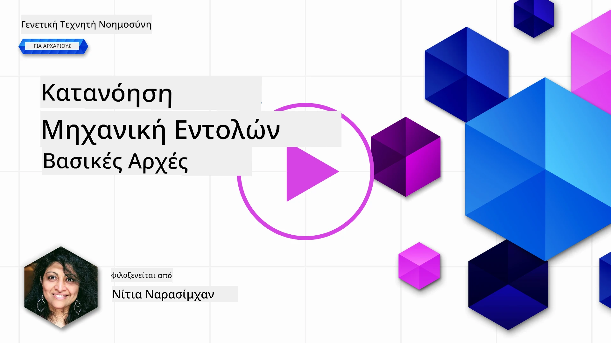
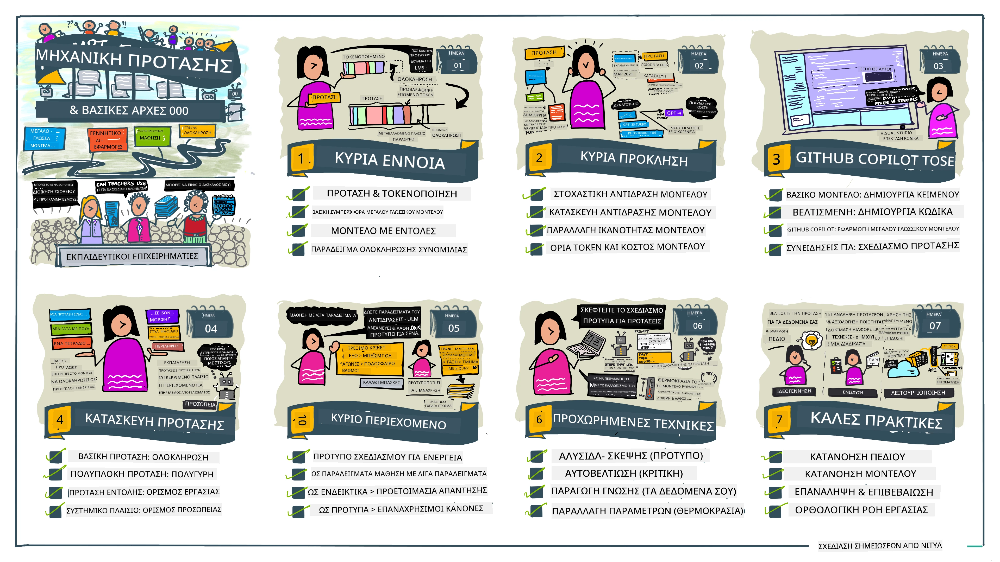
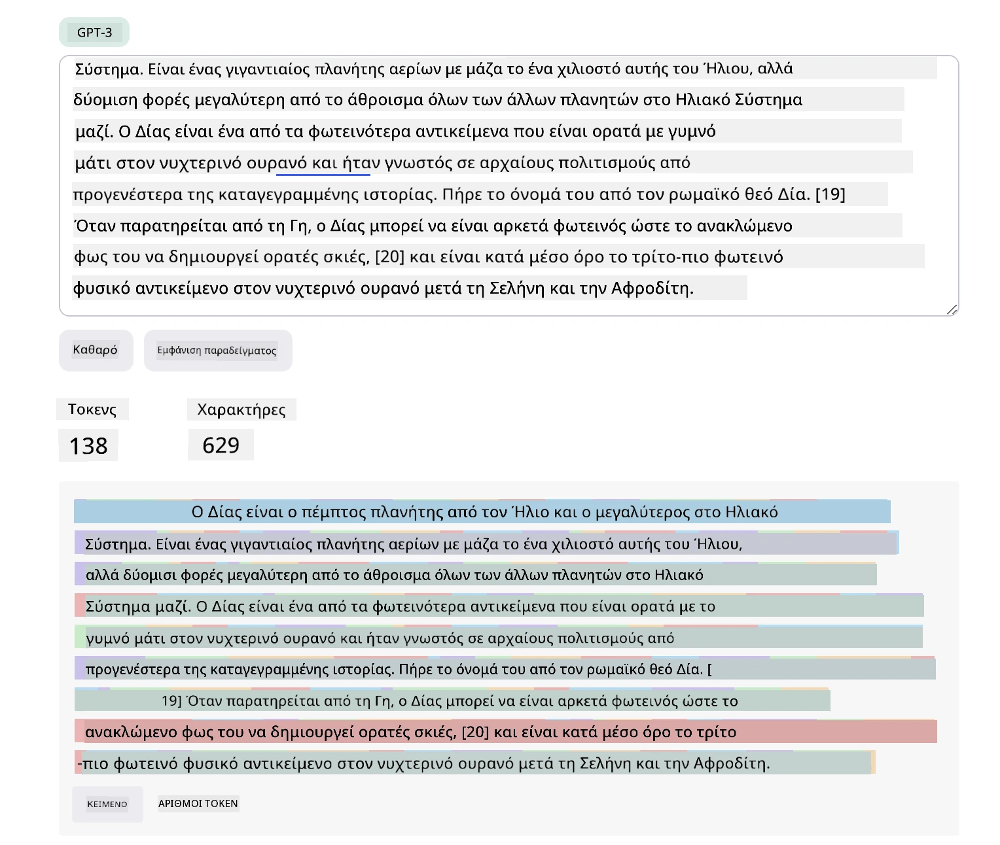
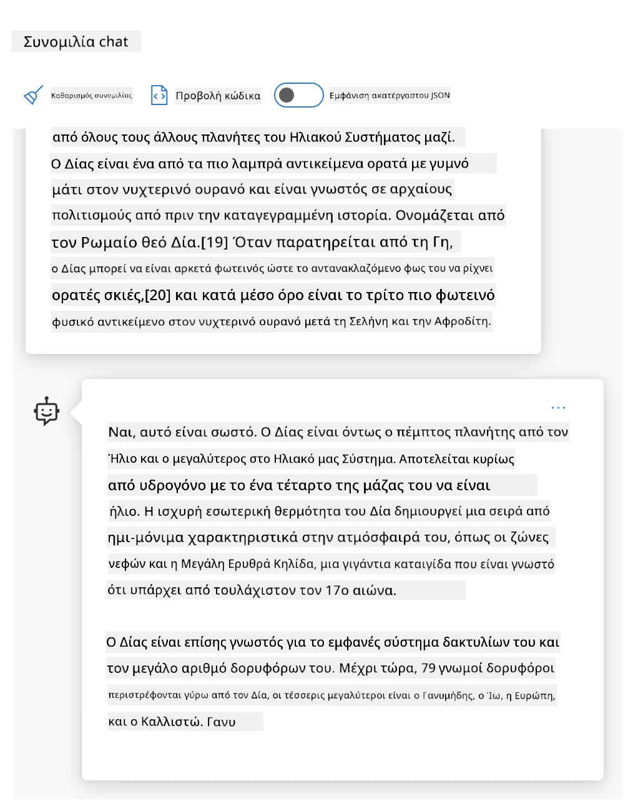
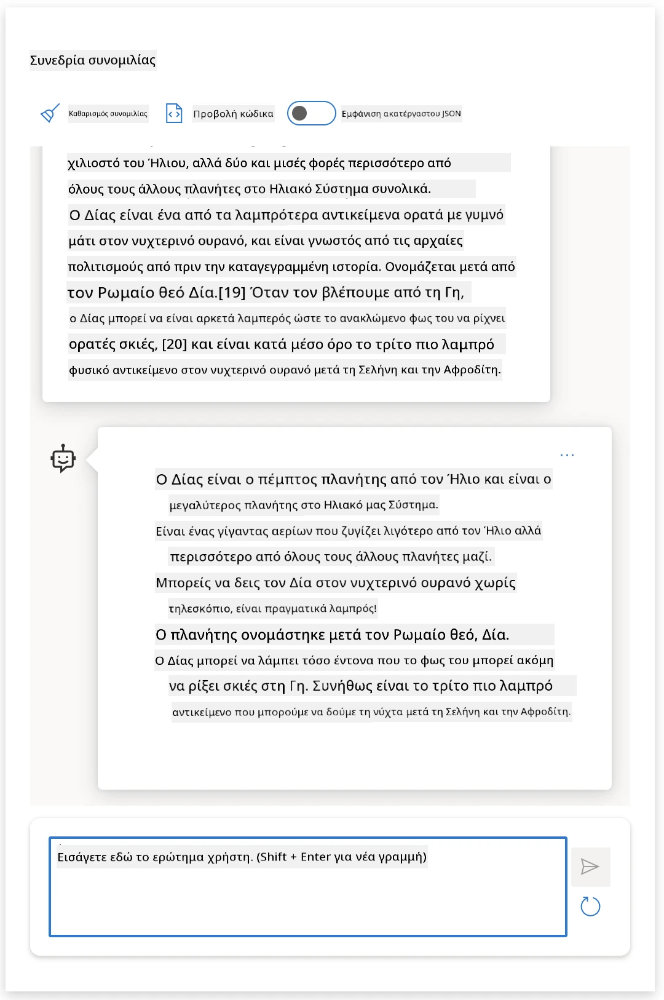
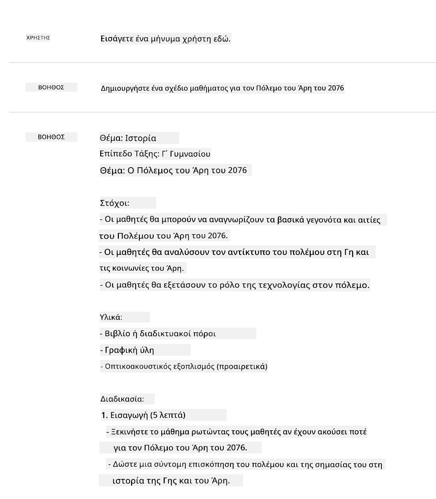
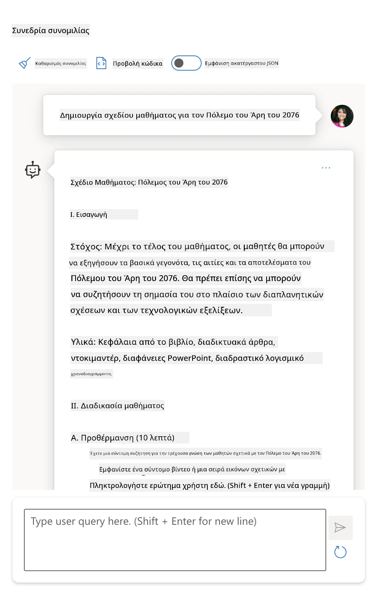
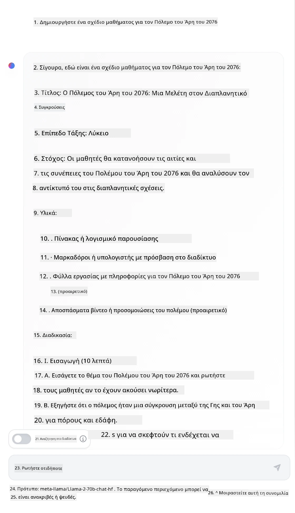

# Θεμελιώδεις Αρχές Μηχανικής Προτροπών

[](https://youtu.be/GElCu2kUlRs?si=qrXsBvXnCW12epb8)

## Εισαγωγή
Αυτή η ενότητα καλύπτει βασικές έννοιες και τεχνικές για τη δημιουργία αποτελεσματικών προτροπών σε μοντέλα γενετικής τεχνητής νοημοσύνης. Ο τρόπος με τον οποίο γράφετε την προτροπή σας προς ένα LLM έχει επίσης σημασία. Μια προσεκτικά σχεδιασμένη προτροπή μπορεί να επιτύχει καλύτερη ποιότητα απάντησης. Αλλά τι ακριβώς σημαίνουν οι όροι _προτροπή_ και _μηχανική προτροπών_; Και πώς βελτιώνω την είσοδο της προτροπής που στέλνω στο LLM; Αυτές είναι οι ερωτήσεις που θα προσπαθήσουμε να απαντήσουμε σε αυτό το κεφάλαιο και το επόμενο.

_Η γενετική ΤΝ_ είναι ικανή να δημιουργεί νέο περιεχόμενο (π.χ. κείμενο, εικόνες, ήχο, κώδικα κ.λπ.) ως απάντηση σε αιτήματα χρηστών. Το πετυχαίνει αυτό χρησιμοποιώντας _Μεγάλα Γλωσσικά Μοντέλα_ όπως η σειρά GPT της OpenAI ("Generative Pre-trained Transformer") που έχουν εκπαιδευτεί για την χρήση φυσικής γλώσσας και κώδικα.

Οι χρήστες μπορούν τώρα να αλληλεπιδρούν με αυτά τα μοντέλα χρησιμοποιώντας οικείες παραδείγματα όπως chat, χωρίς να χρειάζεται τεχνική γνώση ή εκπαίδευση. Τα μοντέλα είναι _βασισμένα σε προτροπές_ – οι χρήστες στέλνουν ένα κείμενο εισόδου (προτροπή) και λαμβάνουν την απάντηση της ΤΝ (ολοκλήρωση). Μπορούν στη συνέχεια να "συνομιλήσουν με την ΤΝ" επαναληπτικά, σε διαδοχικές συνομιλίες, βελτιώνοντας την προτροπή τους μέχρι η απάντηση να ανταποκρίνεται στις προσδοκίες τους.

Οι "προτροπές" γίνονται πλέον η βασική _διεπαφή προγραμματισμού_ για εφαρμογές γενετικής ΤΝ, λέγοντας στα μοντέλα τι να κάνουν και επηρεάζοντας την ποιότητα των επιστρεφόμενων απαντήσεων. Η "μηχανική προτροπών" είναι ένας ταχέως αναπτυσσόμενος τομέας μελέτης που εστιάζει στο _σχεδιασμό και βελτιστοποίηση_ προτροπών για να παρέχει συνεπείς και ποιοτικές απαντήσεις σε μεγάλη κλίμακα.

## Στόχοι Μάθησης

Σε αυτό το μάθημα, θα μάθουμε τι είναι η μηχανική προτροπών, γιατί έχει σημασία και πώς μπορούμε να δημιουργήσουμε πιο αποτελεσματικές προτροπές για ένα δεδομένο μοντέλο και στόχο εφαρμογής. Θα κατανοήσουμε βασικές έννοιες και βέλτιστες πρακτικές για τη μηχανική προτροπών – και θα μάθουμε για ένα διαδραστικό περιβάλλον Jupyter Notebooks "sandbox" όπου μπορούμε να δούμε αυτές τις έννοιες να εφαρμόζονται σε πραγματικά παραδείγματα.

Μέχρι το τέλος αυτού του μαθήματος θα είμαστε σε θέση να:

1. Εξηγήσουμε τι είναι η μηχανική προτροπών και γιατί έχει σημασία.
2. Περιγράψουμε τα συστατικά μιας προτροπής και πώς χρησιμοποιούνται.
3. Μάθουμε βέλτιστες πρακτικές και τεχνικές για μηχανική προτροπών.
4. Εφαρμόσουμε τις τεχνικές που μάθαμε σε πραγματικά παραδείγματα, χρησιμοποιώντας ένα endpoint OpenAI.

## Βασικοί Όροι

Μηχανική Προτροπών: Η πρακτική του σχεδιασμού και της βελτίωσης των εισόδων για να καθοδηγούν τα μοντέλα ΤΝ προς την παραγωγή επιθυμητών εξόδων.
Τοκενιοποίηση: Η διαδικασία μετατροπής κειμένου σε μικρότερες μονάδες, που ονομάζονται τοκεν, που ένα μοντέλο μπορεί να κατανοήσει και να επεξεργαστεί.
Εξοικειωμένα Με Οδηγίες LLMs: Μεγάλα Γλωσσικά Μοντέλα που έχουν βελτιωθεί με συγκεκριμένες οδηγίες για να βελτιώσουν την ακρίβεια και τη σχετικότητα των απαντήσεών τους.

## Περιβάλλον Μάθησης Sandbox

Η μηχανική προτροπών είναι επί του παρόντος περισσότερο τέχνη παρά επιστήμη. Ο καλύτερος τρόπος να βελτιώσουμε την αντίληψή μας γι' αυτήν είναι να _πρακτική περισσότερο_ και να υιοθετήσουμε μια προσέγγιση δοκιμής και λάθους που συνδυάζει εξειδίκευση πεδίου εφαρμογής με προτεινόμενες τεχνικές και βελτιστοποιήσεις ειδικές για το μοντέλο.

Το Jupyter Notebook που συνοδεύει αυτό το μάθημα παρέχει ένα περιβάλλον _sandbox_ όπου μπορείτε να δοκιμάσετε όσα μαθαίνετε – κατά τη διάρκεια ή ως μέρος της πρόκλησης κώδικα στο τέλος. Για να εκτελέσετε τις ασκήσεις, θα χρειαστείτε:

1. **Ένα κλειδί API Azure OpenAI** – το endpoint υπηρεσίας για ένα αναπτυγμένο LLM.
2. **Ένα περιβάλλον εκτέλεσης Python** – στο οποίο μπορεί να εκτελεστεί το Notebook.
3. **Τοπικές Μεταβλητές Περιβάλλοντος** – _ολοκληρώστε τώρα τα βήματα [SETUP](./../00-course-setup/02-setup-local.md?WT.mc_id=academic-105485-koreyst) για να είστε έτοιμοι_.

Το notebook περιλαμβάνει _ασκήσεις εκκίνησης_ – όμως ενθαρρύνεστε να προσθέσετε δικές σας ενότητες _Markdown_ (περιγραφή) και _Code_ (αιτήματα προτροπής) για να δοκιμάσετε περισσότερα παραδείγματα ή ιδέες – και να αναπτύξετε την αντίληψή σας για το σχεδιασμό προτροπών.

## Οδηγός με Εικονογράφηση

Θέλετε να πάρετε μια συνολική εικόνα για το τι καλύπτει αυτό το μάθημα πριν ξεκινήσετε; Δείτε αυτόν τον εικονογραφημένο οδηγό, που σας δίνει μια αίσθηση των βασικών θεμάτων και των σημαντικών συμπερασμάτων που πρέπει να σκεφτείτε σε κάθε ένα. Ο οδικός χάρτης του μαθήματος σας μεταφέρει από την κατανόηση των βασικών εννοιών και προκλήσεων στην αντιμετώπισή τους με σχετικές τεχνικές μηχανικής προτροπών και βέλτιστες πρακτικές. Σημειώστε ότι η ενότητα "Προχωρημένες Τεχνικές" σε αυτόν τον οδηγό αναφέρεται σε περιεχόμενο που καλύπτεται στο _επόμενο_ κεφάλαιο αυτού του προγράμματος σπουδών.



## Η Startup μας

Τώρα, ας μιλήσουμε για το πώς _αυτό το θέμα_ σχετίζεται με την αποστολή της startup μας για [να φέρει καινοτομία τεχνητής νοημοσύνης στην εκπαίδευση](https://educationblog.microsoft.com/2023/06/collaborating-to-bring-ai-innovation-to-education?WT.mc_id=academic-105485-koreyst). Θέλουμε να δημιουργήσουμε εφαρμογές με τεχνητή νοημοσύνη που υποστηρίζουν την _προσωποποιημένη μάθηση_ – οπότε ας σκεφτούμε πώς διαφορετικοί χρήστες της εφαρμογής μας ενδέχεται να "σχεδιάσουν" προτροπές:

- **Διαχειριστές** μπορεί να ζητήσουν από την ΤΝ να _αναλύσει δεδομένα προγράμματος σπουδών για να εντοπίσει κενά κάλυψης_. Η ΤΝ μπορεί να συνοψίσει τα αποτελέσματα ή να τα οπτικοποιήσει με κώδικα.
- **Εκπαιδευτικοί** μπορεί να ζητήσουν από την ΤΝ να _δημιουργήσει ένα σχέδιο μαθήματος για ένα στοχευμένο κοινό και θέμα_. Η ΤΝ μπορεί να κατασκευάσει το εξατομικευμένο σχέδιο σε καθορισμένη μορφή.
- **Μαθητές** μπορεί να ζητήσουν από την ΤΝ να _τους διδάξει σε ένα δύσκολο μάθημα_. Η ΤΝ μπορεί τώρα να καθοδηγήσει μαθητές με μαθήματα, υποδείξεις και παραδείγματα προσαρμοσμένα στο επίπεδό τους.

Και αυτό είναι μόνο η κορυφή του παγόβουνου. Δείτε το [Prompts For Education](https://github.com/microsoft/prompts-for-edu/tree/main?WT.mc_id=academic-105485-koreyst) – μια βιβλιοθήκη προτροπών ανοιχτού κώδικα κατηγοριοποιημένη από ειδικούς της εκπαίδευσης – για να πάρετε μια ευρύτερη αίσθηση των δυνατοτήτων! _Δοκιμάστε να εκτελέσετε μερικές από αυτές τις προτροπές στο sandbox ή χρησιμοποιώντας το OpenAI Playground για να δείτε τι συμβαίνει!_

<!--
ΠΡΟΤΥΠΟ ΜΑΘΗΜΑΤΟΣ:
Αυτή η ενότητα πρέπει να καλύπτει βασική έννοια #1.
Ενισχύστε την έννοια με παραδείγματα και αναφορές.

ΕΝΝΟΙΑ #1:
Μηχανική Προτροπών.
Ορίστε την και εξηγήστε γιατί χρειάζεται.
-->

## Τι είναι η Μηχανική Προτροπών;

Ξεκινήσαμε αυτό το μάθημα ορίζοντας τη **Μηχανική Προτροπών** ως τη διαδικασία _σχεδιασμού και βελτιστοποίησης_ κειμενικών εισόδων (προτροπών) για να παρέχουν συνεπείς και ποιοτικές απαντήσεις (ολοκληρώσεις) για έναν δεδομένο στόχο εφαρμογής και μοντέλο. Μπορούμε να το σκεφτούμε ως μια διαδικασία 2 βημάτων:

- _σχεδιασμός_ της αρχικής προτροπής για ένα δεδομένο μοντέλο και στόχο
- _βελτίωση_ της προτροπής επαναληπτικά για να βελτιωθεί η ποιότητα της απόκρισης

Αυτή είναι αναγκαστικά μια διαδικασία δοκιμής και λάθους που απαιτεί διαίσθηση και προσπάθεια από τον χρήστη για να επιτύχει βέλτιστα αποτελέσματα. Γιατί λοιπόν είναι σημαντική; Για να απαντήσουμε σε αυτήν την ερώτηση, πρέπει πρώτα να κατανοήσουμε τρεις έννοιες:

- _Τοκενιοποίηση_ = πώς το μοντέλο "βλέπει" την προτροπή
- _Βασικά LLMs_ = πώς το θεμελιώδες μοντέλο "επεξεργάζεται" μια προτροπή
- _Εξοικειωμένα Με Οδηγίες LLMs_ = πώς το μοντέλο πλέον μπορεί να "δει εργασίες"

### Τοκενιοποίηση

Ένα LLM βλέπει τις προτροπές ως _σειρά τοκεν_ όπου διαφορετικά μοντέλα (ή εκδόσεις ενός μοντέλου) μπορούν να τοκενιοποιήσουν την ίδια προτροπή με διαφορετικούς τρόπους. Εφόσον τα LLMs εκπαιδεύονται με βάση τα τοκεν (και όχι το ακατέργαστο κείμενο), ο τρόπος που τοκενιοποιούνται οι προτροπές έχει άμεση επίδραση στην ποιότητα της παραγόμενης απάντησης.

Για να πάρετε μια αίσθηση του πώς λειτουργεί η τοκενιοποίηση, δοκιμάστε εργαλεία όπως τον [OpenAI Tokenizer](https://platform.openai.com/tokenizer?WT.mc_id=academic-105485-koreyst) που φαίνεται παρακάτω. Αντιγράψτε την προτροπή σας – και δείτε πώς αυτή μετατρέπεται σε τοκεν, δίνοντας προσοχή στον τρόπο που χειρίζονται τα κενά και τα σημεία στίξης. Σημειώστε ότι αυτό το παράδειγμα δείχνει ένα παλαιότερο LLM (GPT-3) – οπότε δοκιμάζοντας με νεότερο μοντέλο μπορεί να έχει διαφορετικό αποτέλεσμα.



### Έννοια: Θεμελιώδη Μοντέλα

Μόλις η προτροπή τοκενιοποιηθεί, η βασική λειτουργία του ["Βασικού LLM"](https://blog.gopenai.com/an-introduction-to-base-and-instruction-tuned-large-language-models-8de102c785a6?WT.mc_id=academic-105485-koreyst) (ή θεμελιώδους μοντέλου) είναι να προβλέψει το επόμενο τοκεν στη σειρά. Εφόσον τα LLMs εκπαιδεύονται σε τεράστια σύνολα δεδομένων κειμένου, έχουν καλή αίσθηση των στατιστικών σχέσεων μεταξύ τοκεν και μπορούν να κάνουν αυτή την πρόβλεψη με κάποια σιγουριά. Σημειώστε ότι δεν κατανοούν το _νόημα_ των λέξεων στην προτροπή ή το τοκεν· απλά βλέπουν ένα μοτίβο που μπορούν να "συμπληρώσουν" με την επόμενη πρόβλεψή τους. Μπορούν να συνεχίσουν να προβλέπουν τη σειρά μέχρι να διακοπεί από παρέμβαση χρήστη ή κάποια προϋπάρχουσα συνθήκη.

Θέλετε να δείτε πώς λειτουργεί η ολοκλήρωση βασισμένη σε προτροπές; Εισάγετε την παραπάνω προτροπή στο [Microsoft Foundry playground](https://ai.azure.com?WT.mc_id=academic-105485-koreyst) με τις προεπιλεγμένες ρυθμίσεις. Το σύστημα έχει διαμορφωθεί να αντιμετωπίζει τις προτροπές ως αιτήματα για πληροφορίες – οπότε θα πρέπει να δείτε μια ολοκλήρωση που ικανοποιεί αυτό το πλαίσιο.

Αλλά τι γίνεται αν ο χρήστης ήθελε να δει κάτι συγκεκριμένο που να πληροί κάποια κριτήρια ή στόχο εργασίας; Εδώ μπαίνουν στην εικόνα τα _εξοικειωμένα με οδηγίες_ LLMs.



### Έννοια: Εξοικειωμένα Με Οδηγίες LLMs

Ένα [Εξοικειωμένο με Οδηγίες LLM](https://blog.gopenai.com/an-introduction-to-base-and-instruction-tuned-large-language-models-8de102c785a6?WT.mc_id=academic-105485-koreyst) ξεκινά με το θεμελιώδες μοντέλο και το βελτιώνει ειδικά με παραδείγματα ή ζεύγη εισόδου/εξόδου (π.χ. πολυγνώσεις "μηνύματα") που μπορεί να περιέχουν σαφείς οδηγίες – και η απάντηση της ΤΝ προσπαθεί να ακολουθήσει αυτήν την οδηγία.

Αυτό χρησιμοποιεί τεχνικές όπως Ενισχυτική Μάθηση με Ανθρώπινη Ανατροφοδότηση (RLHF) που μπορούν να εκπαιδεύσουν το μοντέλο να _ακολουθεί οδηγίες_ και να _μαθαίνει από ανατροφοδότηση_ έτσι ώστε να παράγει απαντήσεις που είναι καλύτερα προσαρμοσμένες σε πρακτικές εφαρμογές και πιο σχετικές με τους στόχους των χρηστών.

Ας το δοκιμάσουμε – ξαναδείτε την παραπάνω προτροπή, αλλά τώρα αλλάξτε το _μήνυμα συστήματος_ για να παρέχετε την ακόλουθη οδηγία ως πλαίσιο:

> _Συνοψίστε το περιεχόμενο που λαμβάνετε για έναν μαθητή δεύτερης τάξης. Κρατήστε το αποτέλεσμα σε μια παράγραφο με 3-5 κουκκίδες._

Δείτε πώς το αποτέλεσμα προσαρμόστηκε για να αντανακλά τον επιθυμητό στόχο και μορφή; Ένας εκπαιδευτικός μπορεί τώρα να χρησιμοποιήσει απευθείας αυτήν την απάντηση στις διαφάνειές του για εκείνο το μάθημα.



## Γιατί χρειαζόμαστε Μηχανική Προτροπών;

Τώρα που ξέρουμε πώς τα μοντέλα LLM επεξεργάζονται τις προτροπές, ας μιλήσουμε για το _γιατί_ χρειαζόμαστε μηχανική προτροπών. Η απάντηση βρίσκεται στο γεγονός ότι τα τρέχοντα LLM παρουσιάζουν μια σειρά προκλήσεων που καθιστούν πιο δύσκολη την επίτευξη _αξιόπιστων και συνεπών ολοκληρώσεων_ χωρίς προσπάθεια στην κατασκευή και βελτιστοποίηση της προτροπής. Για παράδειγμα:

1. **Οι απαντήσεις του μοντέλου είναι στοχαστικές.** Η _ίδια προτροπή_ πιθανόν να παράγει διαφορετικές απαντήσεις με διαφορετικά μοντέλα ή εκδόσεις μοντέλου. Και μπορεί ακόμη και να παράγει διαφορετικά αποτελέσματα με το _ίδιο μοντέλο_ σε διαφορετικές χρονικές στιγμές. _Οι τεχνικές μηχανικής προτροπών μπορούν να μας βοηθήσουν να ελαχιστοποιήσουμε αυτές τις μεταβολές παρέχοντας καλύτερους κανόνες_.

1. **Τα μοντέλα μπορούν να επινοήσουν απαντήσεις.** Τα μοντέλα είναι προεκπαιδευμένα με _μεγάλα αλλά πεπερασμένα_ σύνολα δεδομένων, που σημαίνει ότι δεν έχουν γνώση για έννοιες εκτός αυτού του εύρους εκπαίδευσης. Ως αποτέλεσμα, μπορούν να παράγουν ολοκληρώσεις που είναι ανακριβείς, φανταστικές ή άμεσα αντιφατικές με γνωστά γεγονότα. _Οι τεχνικές μηχανικής προτροπών βοηθούν τους χρήστες να εντοπίζουν και να μετριάζουν τέτοιες επινοήσεις, π.χ. ζητώντας αναφορές ή λογική από την ΤΝ_.

1. **Οι δυνατότητες των μοντέλων διαφέρουν.** Νεότερα μοντέλα ή γενιές μοντέλων θα έχουν πλουσιότερες δυνατότητες αλλά φέρνουν επίσης ιδιόμορφα χαρακτηριστικά και συμβιβασμούς στο κόστος και την πολυπλοκότητα. _Η μηχανική προτροπών μπορεί να μας βοηθήσει να αναπτύξουμε βέλτιστες πρακτικές και ροές εργασίας που αφαιρούν τις διαφορές και προσαρμόζονται σε απαιτήσεις συγκεκριμένων μοντέλων με κλιμακωτούς και αβίαστους τρόπους_.

Ας το δούμε αυτό σε δράση στο OpenAI ή Azure OpenAI Playground:

- Χρησιμοποιήστε την ίδια προτροπή σε διαφορετικές αναπτύξεις LLM (π.χ. OpenAI, Azure OpenAI, Hugging Face) – είδατε τις διαφορές;
- Χρησιμοποιήστε την ίδια προτροπή επανειλημμένα με την _ίδια_ ανάπτυξη LLM (π.χ. Azure OpenAI playground) – πώς διέφεραν αυτές οι μεταβολές;

### Παράδειγμα Επινοήσεων

Σε αυτό το μάθημα, χρησιμοποιούμε τον όρο **"επινόηση"** για να αναφερθούμε στο φαινόμενο όπου τα LLM συχνά παράγουν επιστημονικά ανακριβείς πληροφορίες λόγω περιορισμών στην εκπαίδευσή τους ή άλλων περιορισμών. Ίσως έχετε ακούσει να αναφέρονται αυτό ως _"παραληρήματα"_ σε δημοφιλή άρθρα ή ερευνητικές εργασίες. Ωστόσο, σας συνιστούμε έντονα να χρησιμοποιείτε τον όρο _"επινόηση"_ ώστε να μην προσωποποιούμε την συμπεριφορά αποδίδοντας ανθρώπινα χαρακτηριστικά σε ένα αποτέλεσμα που παράγεται από μηχανή. Αυτό επίσης ενισχύει τις [οδηγίες Υπεύθυνης ΤΝ](https://www.microsoft.com/ai/responsible-ai?WT.mc_id=academic-105485-koreyst) από την οπτική της ορολογίας, απομακρύνοντας όρους που μπορεί να θεωρηθούν προσβλητικοί ή μη συμπεριληπτικοί σε ορισμένα συμφραζόμενα.

Θέλετε να πάρετε μια αίσθηση του πώς λειτουργούν οι επινοήσεις; Σκεφτείτε μια προτροπή που δίνει εντολή στην ΤΝ να δημιουργήσει περιεχόμενο για ένα ανύπαρκτο θέμα (για να εξασφαλίσετε ότι δεν βρίσκεται στο σετ δεδομένων εκπαίδευσης). Για παράδειγμα – έκανα αυτήν την προτροπή:

> **Προτροπή:** δημιουργήστε ένα σχέδιο μαθήματος για τον Πόλεμο του Άρη το 2076.

Μια αναζήτηση στο διαδίκτυο μου έδειξε ότι υπήρχαν φανταστικές αφηγήσεις (π.χ. τηλεοπτικές σειρές ή βιβλία) για πολέμους στον Άρη – αλλά καμία το 2076. Η κοινή λογική επίσης μας λέει ότι ο 2076 είναι _στο μέλλον_ και ως εκ τούτου δεν μπορεί να σχετιστεί με πραγματικό γεγονός.


Τι συμβαίνει λοιπόν όταν εκτελούμε αυτό το prompt με διαφορετικούς παρόχους LLM;

> **Απάντηση 1**: OpenAI Playground (GPT-35)



> **Απάντηση 2**: Azure OpenAI Playground (GPT-35)



> **Απάντηση 3**: : Hugging Face Chat Playground (LLama-2)



Όπως αναμενόταν, κάθε μοντέλο (ή έκδοση μοντέλου) παράγει ελαφρώς διαφορετικές απαντήσεις χάρη στη στοχαστική συμπεριφορά και στις διαφορές ικανοτήτων μοντέλου. Για παράδειγμα, ένα μοντέλο στοχεύει σε κοινό 8ης τάξης ενώ το άλλο υποθέτει έναν μαθητή λυκείου. Αλλά όλα τα τρία μοντέλα δημιούργησαν απαντήσεις που θα μπορούσαν να πείσουν έναν αναρμόδιο χρήστη ότι το γεγονός ήταν πραγματικό.

Τεχνικές σχεδιασμού prompt όπως _μεταπροτροπή_ και _διαμόρφωση θερμοκρασίας_ μπορεί να μειώσουν τις κατασκευές του μοντέλου σε κάποιο βαθμό. Νέες _αρχιτεκτονικές_ σχεδίασης prompt ενσωματώνουν επίσης νέα εργαλεία και τεχνικές ομαλά στη ροή του prompt, για να μετριάσουν ή να μειώσουν μερικές από αυτές τις επιπτώσεις.

## Μελέτη περίπτωσης: GitHub Copilot

Ας ολοκληρώσουμε αυτή την ενότητα παίρνοντας μια ιδέα για το πώς χρησιμοποιείται ο σχεδιασμός prompt σε λύσεις του πραγματικού κόσμου, κοιτώντας μια μελέτη περίπτωσης: [GitHub Copilot](https://github.com/features/copilot?WT.mc_id=academic-105485-koreyst).

Το GitHub Copilot είναι ο «συνοδός προγραμματιστής AI» σας – μετατρέπει κείμενα prompt σε συμπληρώσεις κώδικα και ενσωματώνεται στο περιβάλλον ανάπτυξής σας (π.χ., Visual Studio Code) για μια αδιάλειπτη εμπειρία χρήστη. Όπως έχει τεκμηριωθεί στη σειρά ιστολογίων παρακάτω, η αρχική έκδοση βασιζόταν στο μοντέλο OpenAI Codex – με τους μηχανικούς να αντιλαμβάνονται γρήγορα την ανάγκη για βελτιωμένη ρύθμιση του μοντέλου και ανάπτυξη καλύτερων τεχνικών σχεδιασμού prompt, για βελτίωση της ποιότητας του κώδικα. Τον Ιούλιο, [παρουσίασαν ένα βελτιωμένο μοντέλο AI που υπερβαίνει το Codex](https://github.blog/2023-07-28-smarter-more-efficient-coding-github-copilot-goes-beyond-codex-with-improved-ai-model/?WT.mc_id=academic-105485-koreyst) για ακόμα πιο γρήγορες προτάσεις.

Διαβάστε τις αναρτήσεις με τη σειρά, για να ακολουθήσετε τη μαθησιακή τους πορεία.

- **Μάιος 2023** | [Το GitHub Copilot βελτιώνεται στο να καταλαβαίνει τον κώδικά σας](https://github.blog/2023-05-17-how-github-copilot-is-getting-better-at-understanding-your-code/?WT.mc_id=academic-105485-koreyst)
- **Μάιος 2023** | [Μέσα στο GitHub: Συνεργασία με τα LLMs πίσω από το GitHub Copilot](https://github.blog/2023-05-17-inside-github-working-with-the-llms-behind-github-copilot/?WT.mc_id=academic-105485-koreyst)
- **Ιούνιος 2023** | [Πώς να γράψετε καλύτερα prompts για το GitHub Copilot](https://github.blog/2023-06-20-how-to-write-better-prompts-for-github-copilot/?WT.mc_id=academic-105485-koreyst)
- **Ιούλιος 2023** | [.. Το GitHub Copilot υπερβαίνει το Codex με βελτιωμένο μοντέλο AI](https://github.blog/2023-07-28-smarter-more-efficient-coding-github-copilot-goes-beyond-codex-with-improved-ai-model/?WT.mc_id=academic-105485-koreyst)
- **Ιούλιος 2023** | [Οδηγός προγραμματιστή για τον σχεδιασμό prompt και τα LLMs](https://github.blog/2023-07-17-prompt-engineering-guide-generative-ai-llms/?WT.mc_id=academic-105485-koreyst)
- **Σεπτέμβριος 2023** | [Πώς να δημιουργήσετε μια εφαρμογή LLM επιχείρησης: Μαθήματα από το GitHub Copilot](https://github.blog/2023-09-06-how-to-build-an-enterprise-llm-application-lessons-from-github-copilot/?WT.mc_id=academic-105485-koreyst)

Μπορείτε επίσης να περιηγηθείτε στο [Engineering blog](https://github.blog/category/engineering/?WT.mc_id=academic-105485-koreyst) για περισσότερες αναρτήσεις όπως [αυτή εδώ](https://github.blog/2023-09-27-how-i-used-github-copilot-chat-to-build-a-reactjs-gallery-prototype/?WT.mc_id=academic-105485-koreyst) που δείχνει πώς αυτά τα μοντέλα και οι τεχνικές _εφαρμόζονται_ για την ανάπτυξη πρακτικών εφαρμογών.

---

<!--
ΠΡΟΤΥΠΟ ΜΑΘΗΜΑΤΟΣ:
Αυτή η ενότητα πρέπει να καλύπτει βασική έννοια #2.
Ενισχύστε την έννοια με παραδείγματα και αναφορές.

ΕΝΝΟΙΑ #2:
Σχεδιασμός Prompt.
Εικονογραφημένο με παραδείγματα.
-->

## Κατασκευή Prompt

Έχουμε δει γιατί ο σχεδιασμός prompt είναι σημαντικός - τώρα ας κατανοήσουμε πώς τα prompts _κατασκευάζονται_ ώστε να αξιολογήσουμε διαφορετικές τεχνικές για πιο αποτελεσματικό σχεδιασμό prompt.

### Βασικό Prompt

Ας ξεκινήσουμε με το βασικό prompt: μια κειμενική είσοδο που στέλνεται στο μοντέλο χωρίς άλλο πλαίσιο. Να ένα παράδειγμα - όταν στέλνουμε τις πρώτες λέξεις του εθνικού ύμνου των ΗΠΑ στο OpenAI [Completion API](https://platform.openai.com/docs/api-reference/completions?WT.mc_id=academic-105485-koreyst) ολοκληρώνει άμεσα την απάντηση με τις επόμενες γραμμές, παρουσιάζοντας τη βασική συμπεριφορά πρόβλεψης.

| Prompt (Είσοδος)  | Συμπλήρωση (Έξοδος)                                                                                                                        |
| :----------------- | :----------------------------------------------------------------------------------------------------------------------------------------- |
| Oh say can you see | Ακούγεται σαν να ξεκινάτε τους στίχους του "The Star-Spangled Banner," του εθνικού ύμνου των Ηνωμένων Πολιτειών. Οι πλήρεις στίχοι είναι ... |

### Σύνθετο Prompt

Τώρα ας προσθέσουμε πλαίσιο και οδηγίες σε αυτό το βασικό prompt. Το [Chat Completion API](https://learn.microsoft.com/azure/ai-services/openai/how-to/chatgpt?WT.mc_id=academic-105485-koreyst) μας επιτρέπει να κατασκευάσουμε ένα σύνθετο prompt ως συλλογή από _μηνύματα_ με:

- Ζεύγη εισόδου/εξόδου που αντανακλούν την είσοδο _χρήστη_ και την απάντηση _βοηθού_.
- Μήνυμα συστήματος που ορίζει το πλαίσιο για τη συμπεριφορά ή προσωπικότητα του βοηθού.

Το αίτημα είναι τώρα στη μορφή που ακολουθεί, όπου η _tokenization_ καταγράφει αποτελεσματικά σχετικές πληροφορίες από το πλαίσιο και τη συνομιλία. Τώρα, η αλλαγή του πλαισίου συστήματος μπορεί να είναι τόσο καθοριστική για την ποιότητα των συμπληρώσεων όσο και οι παρεχόμενες εισόδους χρήστη.

```python
response = client.responses.create(
    model="gpt-4o-mini",
    input=[
        {"role": "system", "content": "You are a helpful assistant."},
        {"role": "user", "content": "Who won the world series in 2020?"},
        {"role": "assistant", "content": "The Los Angeles Dodgers won the World Series in 2020."},
        {"role": "user", "content": "Where was it played?"}
    ]
)
```

### Prompt Οδηγία

Στα παραπάνω παραδείγματα, το prompt του χρήστη ήταν μια απλή ερώτηση κειμένου που μπορεί να ερμηνευτεί ως αίτημα για πληροφορίες. Με τα prompts _οδηγίες_, μπορούμε να χρησιμοποιήσουμε αυτό το κείμενο για να καθορίσουμε μια εργασία με περισσότερες λεπτομέρειες, παρέχοντας καλύτερη καθοδήγηση στην AI. Να ένα παράδειγμα:

| Prompt (Είσοδος)                                                                                                                                                                                                                         | Συμπλήρωση (Έξοδος)                                                                                                        | Τύπος Οδηγίας      |
| :------------------------------------------------------------------------------------------------------------------------------------------------------------------------------------------------------------------------------------- | :------------------------------------------------------------------------------------------------------------------------- | :------------------ |
| Write a description of the Civil War                                                                                                                                                                                                   | _επέστρεψε μια απλή παράγραφο_                                                                                              | Απλό               |
| Write a description of the Civil War. Provide key dates and events and describe their significance                                                                                                                                     | _επέστρεψε μια παράγραφο ακολουθούμενη από λίστα με βασικές ημερομηνίες και περιγραφές γεγονότων_                           | Σύνθετο            |
| Write a description of the Civil War in 1 paragraph. Provide 3 bullet points with key dates and their significance. Provide 3 more bullet points with key historical figures and their contributions. Return the output as a JSON file | _επιστρέφει πιο εκτενή στοιχεία σε κουτί κειμένου, μορφοποιημένα σε JSON που μπορείτε να αντιγράψετε και να επαληθεύσετε αν χρειαστεί_ | Σύνθετο. Μορφοποιημένο. |

## Πρωτεύον Περιεχόμενο

Στα παραπάνω παραδείγματα, το prompt ήταν ακόμη αρκετά ανοιχτό, επιτρέποντας στο LLM να αποφασίσει ποιο μέρος του προεκπαιδευμένου συνόλου δεδομένων του είναι σχετικό. Με το μοτίβο σχεδίασης _πρωτεύον περιεχόμενο_, το κείμενο εισόδου χωρίζεται σε δύο μέρη:

- μια οδηγία (ενέργεια)
- σχετικό περιεχόμενο (που επηρεάζει την ενέργεια)

Να ένα παράδειγμα όπου η οδηγία είναι «συνοψίστε το σε 2 προτάσεις».

| Prompt (Είσοδος)                                                                                                                                                                                                                                                                                                                                                                                                                                                                                                                                                                                                                                                                                      | Συμπλήρωση (Έξοδος)                                                                                                                                                                                                                                                                             |
| :-------------------------------------------------------------------------------------------------------------------------------------------------------------------------------------------------------------------------------------------------------------------------------------------------------------------------------------------------------------------------------------------------------------------------------------------------------------------------------------------------------------------------------------------------------------------------------------------------------------------------------------------------------------------------------------------------- | :---------------------------------------------------------------------------------------------------------------------------------------------------------------------------------------------------------------------------------------------------------------------------------------------- |
| Ο Δίας είναι ο πέμπτος πλανήτης από τον Ήλιο και ο μεγαλύτερος στο Ηλιακό Σύστημα. Είναι ένας γίγαντας αερίου με μάζα χίσια φορές μικρότερη από του Ήλιου, αλλά δύο και μισές φορές μεγαλύτερης από όλους τους άλλους πλανήτες του Ηλιακού Συστήματος μαζί. Ο Δίας είναι ένα από τα πιο φωτεινά αντικείμενα που είναι ορατά με γυμνό μάτι στον νυχτερινό ουρανό, και έχει γίνει γνωστός στις αρχαίες πολιτισμούς πολύ πριν την καταγεγραμμένη ιστορία. Λέγεται προς τιμήν του Ρωμαίου θεού Δία.[19] Όταν κοιτάζουμε από τη Γη, ο Δίας μπορεί να είναι αρκετά φωτεινός ώστε το αντανακλώμενο φως του να ρίχνει ορατές σκιές,[20] και είναι κατά μέσο όρο το τρίτο φωτεινότερο φυσικό αντικείμενο στον νυχτερινό ουρανό μετά τη Σελήνη και την Αφροδίτη. <br/> **Συνοψίστε το σε 2 σύντομες προτάσεις** | Ο Δίας, ο πέμπτος πλανήτης από τον Ήλιο, είναι ο μεγαλύτερος στο Ηλιακό Σύστημα και είναι γνωστός για το ότι είναι ένα από τα πιο φωτεινά αντικείμενα στον νυχτερινό ουρανό. Ονομάστηκε προς τιμήν του Ρωμαίου θεού Δία, είναι ένας γίγαντας αερίου με μάζα δύο και μισές φορές μεγαλύτερη από όλους τους άλλους πλανήτες του Ηλιακού Συστήματος μαζί. |

Το τμήμα πρωτεύοντος περιεχομένου μπορεί να χρησιμοποιηθεί με διάφορους τρόπους για να οδηγήσει σε πιο αποτελεσματικές οδηγίες:

- **Παραδείγματα** - αντί να λέμε στο μοντέλο τι να κάνει με μια ρητή οδηγία, δίνουμε παραδείγματα του τι να κάνει και αφήνουμε το μοντέλο να συμπεράνει το μοτίβο.
- **Υποδείξεις** - ακολουθούμε την οδηγία με μια «υπόδειξη» που προετοιμάζει τη συμπλήρωση, καθοδηγώντας το μοντέλο προς πιο σχετικές απαντήσεις.
- **Πρότυπα** - αυτά είναι επαναλαμβανόμενες 'συνταγές' για prompts με θέσεις για μεταβλητές που μπορούν να προσαρμοστούν με δεδομένα για συγκεκριμένες χρήσεις.

Ας εξερευνήσουμε αυτά στην πράξη.

### Χρήση Παραδειγμάτων

Αυτή είναι μια προσέγγιση όπου χρησιμοποιείτε το πρωτεύον περιεχόμενο για να «ταΐσετε το μοντέλο» με κάποια παραδείγματα της επιθυμητής εξόδου για μια δεδομένη οδηγία, και το αφήνετε να συμπεράνει το μοτίβο για την επιθυμητή έξοδο. Με βάση τον αριθμό των παραδειγμάτων που παρέχονται, μπορούμε να έχουμε zero-shot prompting, one-shot prompting, few-shot prompting κ.ά.

Το prompt τώρα αποτελείται από τρία στοιχεία:

- Μια περιγραφή εργασίας
- Μερικά παραδείγματα της επιθυμητής εξόδου
- Την αρχή ενός νέου παραδείγματος (που γίνεται ρητή περιγραφή εργασίας)

| Τύπος Μάθησης | Prompt (Είσοδος)                                                                                                                                        | Συμπλήρωση (Έξοδος)         |
| :------------ | :---------------------------------------------------------------------------------------------------------------------------------------------------- | :-------------------------- |
| Zero-shot     | "The Sun is Shining". Μετάφραση στα Ισπανικά                                                                                                          | "El Sol está brillando".    |
| One-shot      | "The Sun is Shining" => ""El Sol está brillando". <br> "It's a Cold and Windy Day" =>                                                                 | "Es un día frío y ventoso". |
| Few-shot      | Ο παίκτης έτρεξε τις βάσεις => Μπέιζμπολ <br/> Ο παίκτης έκανε άσο => Τένις <br/> Ο παίκτης έκανε εξάρι => Κρίκετ <br/> Ο παίκτης έκανε κάρφωμα =>         | Μπάσκετ                     |
|               |                                                                                                                                                       |                             |

Παρατηρήστε πώς έπρεπε να δώσουμε ρητή οδηγία («Μετάφραση στα Ισπανικά») στο zero-shot prompting, αλλά αυτή συμπεραίνεται στο παράδειγμα one-shot prompting. Το παράδειγμα few-shot δείχνει πώς η προσθήκη περισσότερων παραδειγμάτων επιτρέπει στα μοντέλα να κάνουν πιο ακριβείς συμπεράσεις χωρίς επιπλέον οδηγίες.

### Υποδείξεις Prompt

Μια άλλη τεχνική για τη χρήση του πρωτεύοντος περιεχομένου είναι να παρέχουμε _υποδείξεις_ αντί για παραδείγματα. Σε αυτή την περίπτωση, δίνουμε στο μοντέλο μια ώθηση προς τη σωστή κατεύθυνση, _ξεκινώντας_ με ένα απόσπασμα που αντανακλά το επιθυμητό μορφότυπο απάντησης. Το μοντέλο τότε «λαμβάνει την υπόδειξη» για να συνεχίσει σε αυτή τη γραμμή.

| Αριθμός Υποδείξεων | Prompt (Είσοδος)                                                                                                                                                                                                                                                                                                                                                                                                                                               | Συμπλήρωση (Έξοδος)                                                                                                                                                                                                                                                                                       |
| :------------- | :----------------------------------------------------------------------------------------------------------------------------------------------------------------------------------------------------------------------------------------------------------------------------------------------------------------------------------------------------------------------------------------------------------------------------------------------------------- | :-------------------------------------------------------------------------------------------------------------------------------------------------------------------------------------------------------------------------------------------------------------------------------------------------------- |
| 0              | Ο Δίας είναι ο πέμπτος πλανήτης από τον Ήλιο και ο μεγαλύτερος στο Ηλιακό Σύστημα. Είναι ένας γίγαντας αερίου με μάζα χίλια φορές μικρότερη από του Ήλιου, αλλά δύο και μισές φορές μεγαλύτερης από όλους τους άλλους πλανήτες του Ηλιακού Συστήματος μαζί. Ο Δίας είναι ένα από τα πιο φωτεινά αντικείμενα που είναι ορατά με γυμνό μάτι στον νυχτερινό ουρανό, και έχει γίνει γνωστός στις αρχαίες πολιτισμούς πολύ πριν την καταγεγραμμένη ιστορία. <br/>**Συνοψίστε Το**                                       | Ο Δίας είναι ο μεγαλύτερος πλανήτης στο Ηλιακό μας Σύστημα και ο πέμπτος από τον Ήλιο. Είναι ένας γίγαντας αερίου με μάζα το 1/1000 του Ήλιου, αλλά βαρύτερος από όλους τους υπόλοιπους πλανήτες μαζί. Οι αρχαίοι πολιτισμοί τον γνώριζαν για μεγάλο χρονικό διάστημα, και είναι εύκολα ορατός στον νυχτερινό ουρανό.. |
| 1              | Ο Δίας είναι ο πέμπτος πλανήτης από τον Ήλιο και ο μεγαλύτερος στο Ηλιακό Σύστημα. Είναι ένας γίγαντας αερίου με μάζα χίλια φορές μικρότερη από του Ήλιου, αλλά δύο και μισές φορές μεγαλύτερης από όλους τους άλλους πλανήτες του Ηλιακού Συστήματος μαζί. Ο Δίας είναι ένα από τα πιο φωτεινά αντικείμενα που είναι ορατά με γυμνό μάτι στον νυχτερινό ουρανό, και έχει γίνει γνωστός στις αρχαίες πολιτισμούς πολύ πριν την καταγεγραμμένη ιστορία. <br/>**Συνοψίστε Το** <br/> Αυτό που μάθαμε είναι ότι ο Δίας | είναι ο πέμπτος πλανήτης από τον Ήλιο και ο μεγαλύτερος στο Ηλιακό Σύστημα. Είναι γίγαντας αερίου με μάζα χίλια φορές μικρότερη από τον Ήλιο, αλλά δύο και μισές φορές μεγαλύτερης από όλους τους άλλους πλανήτες μαζί. Είναι εύκολα ορατός με γυμνό μάτι και είναι γνωστός από την αρχαιότητα.                        |

| 2              | Ο Δίας είναι ο πέμπτος πλανήτης από τον Ήλιο και ο μεγαλύτερος στο Ηλιακό Σύστημα. Είναι ένας γιγάντιος πλανήτης αερίων με μάζα το ένα χιλιοστό αυτής του Ήλιου, αλλά δύο και μισές φορές μεγαλύτερη από το άθροισμα όλων των άλλων πλανητών στο Ηλιακό Σύστημα. Ο Δίας είναι ένα από τα πιο λαμπρά αντικείμενα ορατά με γυμνό μάτι στον νυχτερινό ουρανό και ήταν γνωστός σε αρχαίους πολιτισμούς πριν από την καταγεγραμμένη ιστορία. <br/>**Συνοψίστε Αυτό** <br/> Οι 3 Κορυφαίες Γνώσεις που Μάθαμε:         | 1. Ο Δίας είναι ο πέμπτος πλανήτης από τον Ήλιο και ο μεγαλύτερος στο Ηλιακό Σύστημα. <br/> 2. Είναι ένας γιγάντιος πλανήτης αερίων με μάζα το ένα χιλιοστό αυτής του Ήλιου...<br/> 3. Ο Δίας ήταν ορατός με γυμνό μάτι από την αρχαιότητα ...                                                                       |
|                |                                                                                                                                                                                                                                                                                                                                                                                                                                                              |                                                                                                                                                                                                                                                                                                           |

### Πρότυπα Προτροπών

Ένα πρότυπο προτροπής είναι μια _προκαθορισμένη συνταγή για μια προτροπή_ που μπορεί να αποθηκευτεί και να επαναχρησιμοποιηθεί όπως απαιτείται, για να οδηγήσει σε πιο συνεπείς εμπειρίες χρήστη σε μεγάλη κλίμακα. Στην απλούστερη μορφή του, είναι απλώς μια συλλογή παραδειγμάτων προτροπών όπως [αυτό από την OpenAI](https://cookbook.openai.com/examples/gpt4-1_prompting_guide?WT.mc_id=academic-105485-koreyst) που παρέχει τόσο τα διαδραστικά στοιχεία της προτροπής (μηνύματα χρήστη και συστήματος) όσο και τη μορφή αιτήματος που καθοδηγείται από το API - για να υποστηρίζει την επαναχρησιμοποίηση.

Στην πιο σύνθετη μορφή του, όπως [αυτό το παράδειγμα από τη LangChain](https://python.langchain.com/docs/concepts/prompt_templates/?WT.mc_id=academic-105485-koreyst), περιλαμβάνει _δείκτες θέσης_ που μπορούν να αντικατασταθούν με δεδομένα από διάφορες πηγές (εισροές χρήστη, συμφραζόμενα συστήματος, εξωτερικές πηγές δεδομένων κλπ.) για να δημιουργήσει μια δυναμική προτροπή. Αυτό μας επιτρέπει να δημιουργήσουμε μια βιβλιοθήκη επαναχρησιμοποιούμενων προτροπών που μπορούν να χρησιμοποιηθούν για να οδηγήσουν σε συνεπείς εμπειρίες χρήστη **προγραμματιστικά** σε μεγάλη κλίμακα.

Τέλος, η πραγματική αξία των προτύπων έγκειται στην ικανότητα να δημιουργούνται και να δημοσιεύονται _βιβλιοθήκες προτροπών_ για κάθετες εφαρμογές - όπου το πρότυπο προτροπής είναι πλέον _βελτιστοποιημένο_ ώστε να αντανακλά συγκεκριμένα συμφραζόμενα ή παραδείγματα της εφαρμογής που κάνουν τις απαντήσεις πιο σχετικές και ακριβείς για το στοχευμένο κοινό χρηστών. Το αποθετήριο [Prompts For Edu](https://github.com/microsoft/prompts-for-edu?WT.mc_id=academic-105485-koreyst) είναι ένα εξαιρετικό παράδειγμα αυτής της προσέγγισης, επιμελώντας μια βιβλιοθήκη προτροπών για τον τομέα της εκπαίδευσης με έμφαση σε βασικούς στόχους όπως ο σχεδιασμός μαθημάτων, το σχεδιασμό προγράμματος σπουδών, τη φροντιστηριακή υποστήριξη κλπ.

## Υποστηρικτικό Περιεχόμενο

Αν σκεφτούμε τη σύνθεση μιας προτροπής ως την ύπαρξη μιας οδηγίας (εργασίας) και ενός στόχου (κύριου περιεχομένου), τότε το _δευτερεύον περιεχόμενο_ είναι σαν το πρόσθετο συμφραζόμενο που παρέχουμε για να **επηρεάσουμε με κάποιον τρόπο το αποτέλεσμα**. Μπορεί να είναι παράμετροι ρύθμισης, οδηγίες μορφοποίησης, ταξινομίες θεμάτων κλπ. που βοηθούν το μοντέλο να _προσαρμόσει_ την απάντησή του ώστε να ταιριάζει με τους επιθυμητούς στόχους ή προσδοκίες του χρήστη.

Για παράδειγμα: Δεδομένου ενός καταλόγου μαθημάτων με εκτεταμένα μεταδεδομένα (όνομα, περιγραφή, επίπεδο, ετικέτες μεταδεδομένων, διδάσκων κλπ.) για όλα τα διαθέσιμα μαθήματα στο πρόγραμμα σπουδών:

- μπορούμε να ορίσουμε μια οδηγία για "περίληψη του καταλόγου μαθημάτων για το Φθινόπωρο 2023"
- μπορούμε να χρησιμοποιήσουμε το κύριο περιεχόμενο για να παρέχουμε μερικά παραδείγματα της επιθυμητής εξόδου
- μπορούμε να χρησιμοποιήσουμε το δευτερεύον περιεχόμενο για να εντοπίσουμε τις κορυφαίες 5 "ετικέτες" ενδιαφέροντος.

Τώρα, το μοντέλο μπορεί να παρέχει μια περίληψη στη μορφή που δείχνουν τα λίγα παραδείγματα - αλλά αν ένα αποτέλεσμα έχει πολλές ετικέτες, μπορεί να δώσει προτεραιότητα στις 5 ετικέτες που ορίζονται στο δευτερεύον περιεχόμενο.

---

<!--
ΠΡΟΤΥΠΟ ΜΑΘΗΜΑΤΟΣ:
Αυτή η ενότητα πρέπει να καλύπτει τον βασικό όρο #1.
Ενίσχυση της έννοιας με παραδείγματα και αναφορές.

ΕΝΝΟΙΑ #3:
Τεχνικές Μηχανικής Προτροπών.
Ποιες είναι μερικές βασικές τεχνικές για τη μηχανική προτροπών;
Να τη δειχθεί με κάποιες ασκήσεις.
-->

## Καλές Πρακτικές στη Δημιουργία Προτροπών

Τώρα που γνωρίζουμε πώς μπορούν να _συντεθούν_ οι προτροπές, μπορούμε να αρχίσουμε να σκεφτόμαστε πώς να τις _σχεδιάσουμε_ ώστε να αντανακλούν τις βέλτιστες πρακτικές. Μπορούμε να το σκεφτούμε σε δύο μέρη - να έχουμε τη σωστή _νοοτροπία_ και να εφαρμόζουμε τις σωστές _τεχνικές_.

### Νοοτροπία Μηχανικής Προτροπών

Η Μηχανική Προτροπών είναι μια διαδικασία δοκιμής και λάθους, οπότε κρατήστε τρεις γενικούς καθοδηγητικούς παράγοντες στο μυαλό:

1. **Η Κατανόηση του Τομέα Μετράει.** Η ακρίβεια και η σχετικότητα της απάντησης εξαρτάται από τον _τομέα_ στον οποίο λειτουργεί η εφαρμογή ή ο χρήστης. Εφαρμόστε την διαίσθηση και την εμπειρογνωμοσύνη του τομέα για να **προσαρμόσετε περαιτέρω τις τεχνικές**. Για παράδειγμα, ορίστε _προσωπικότητες συγκεκριμένου τομέα_ στις προτροπές συστήματος, ή χρησιμοποιήστε _πρότυπα συγκεκριμένου τομέα_ στις προτροπές χρηστών. Παρέχετε δευτερεύον περιεχόμενο που αντανακλά συμφραζόμενα συγκεκριμένου τομέα ή χρησιμοποιήστε _ενδεικτικά σημάδια και παραδείγματα συγκεκριμένου τομέα_ για να κατευθύνετε το μοντέλο προς οικείες χρήσεις.

2. **Η Κατανόηση του Μοντέλου Μετράει.** Ξέρουμε ότι τα μοντέλα είναι στοχαστικά εκ φύσεως. Αλλά οι εφαρμογές μοντέλων μπορεί επίσης να διαφέρουν όσον αφορά το σύνολο δεδομένων εκπαίδευσης που χρησιμοποιούν (προεκπαιδευμένη γνώση), τις δυνατότητες που παρέχουν (π.χ., μέσω API ή SDK) και τον τύπο περιεχομένου για τον οποίο είναι βελτιστοποιημένα (π.χ., κώδικας έναντι εικόνων έναντι κειμένου). Κατανοήστε τα πλεονεκτήματα και τους περιορισμούς του μοντέλου που χρησιμοποιείτε και χρησιμοποιήστε αυτή τη γνώση για να _προτεραιοποιήσετε εργασίες_ ή να δημιουργήσετε _εξατομικευμένα πρότυπα_ που είναι βελτιστοποιημένα για τις δυνατότητες του μοντέλου.

3. **Η Επανάληψη & Επικύρωση Μετράει.** Τα μοντέλα εξελίσσονται γρήγορα, και το ίδιο και οι τεχνικές για τη μηχανική προτροπών. Ως ειδικός τομέα, μπορεί να έχετε άλλο συμφραζόμενο ή κριτήρια _για_ τη συγκεκριμένη σας εφαρμογή, που μπορεί να μην ισχύουν για την ευρύτερη κοινότητα. Χρησιμοποιήστε εργαλεία και τεχνικές μηχανικής προτροπών για να "ξεκινήσετε" τη σύνθεση προτροπών, μετά επαναλάβετε και επικυρώστε τα αποτελέσματα χρησιμοποιώντας τη δική σας διαίσθηση και εμπειρογνωμοσύνη. Καταγράψτε τις γνώσεις σας και δημιουργήστε μια **βάση γνώσεων** (π.χ., βιβλιοθήκες προτροπών) που μπορεί να χρησιμοποιηθεί ως νέα βάση από άλλους, για ταχύτερες επαναλήψεις στο μέλλον.

## Καλές Πρακτικές

Ας ρίξουμε μια ματιά σε κοινές καλές πρακτικές που προτείνονται από τους επαγγελματίες της [OpenAI](https://help.openai.com/en/articles/6654000-best-practices-for-prompt-engineering-with-openai-api?WT.mc_id=academic-105485-koreyst) και της [Azure OpenAI](https://learn.microsoft.com/azure/ai-services/openai/concepts/prompt-engineering#best-practices?WT.mc_id=academic-105485-koreyst).

| Τι                              | Γιατί                                                                                                                                                                                                                                               |
| :-------------------------------- | :------------------------------------------------------------------------------------------------------------------------------------------------------------------------------------------------------------------------------------------------ |
| Αξιολογήστε τα πιο πρόσφατα μοντέλα.       | Οι νέες γενιές μοντέλων πιθανόν να έχουν βελτιωμένα χαρακτηριστικά και ποιότητα - αλλά μπορεί επίσης να έχουν υψηλότερο κόστος. Αξιολογήστε τα για τον αντίκτυπο και στη συνέχεια λάβετε αποφάσεις μετανάστευσης.                                                                                |
| Διαχωρίστε οδηγίες και συμφραζόμενα   | Ελέγξτε αν το μοντέλο/πάροχός σας ορίζει _οριοθέτες_ για να διαχωρίσει καθαρότερα τις οδηγίες, το κύριο και το δευτερεύον περιεχόμενο. Αυτό μπορεί να βοηθήσει τα μοντέλα να αποδώσουν βάρη πιο ακριβώς στα tokens.                                                         |
| Να είστε συγκεκριμένοι και σαφείς             | Δώστε περισσότερες λεπτομέρειες για το επιθυμητό πλαίσιο, αποτέλεσμα, μήκος, μορφή, στυλ κλπ. Αυτό θα βελτιώσει τόσο την ποιότητα όσο και τη συνέπεια των απαντήσεων. Καταγράψτε τις συνταγές σε επαναχρησιμοποιήσιμα πρότυπα.                                                          |
| Να είστε περιγραφικοί, χρησιμοποιήστε παραδείγματα      | Τα μοντέλα μπορεί να ανταποκριθούν καλύτερα σε μια προσέγγιση "δείξε και πες". Ξεκινήστε με μια προσέγγιση `μηδενικού δείγματος` όπου δίνετε μια οδηγία (χωρίς παραδείγματα) και στη συνέχεια δοκιμάστε `λίγα δείγματα` ως βελτίωση, παρέχοντας μερικά παραδείγματα της επιθυμητής εξόδου. Χρησιμοποιήστε αναλογίες. |
| Χρησιμοποιήστε ενδείξεις για να ξεκινήσετε τις ολοκληρώσεις | Κατευθύνετέ το προς το επιθυμητό αποτέλεσμα δίνοντάς του κάποιες λέξεις ή φράσεις που μπορεί να χρησιμοποιήσει ως αφετηρία για την απάντηση.                                                                                                               |
| Επιμένετε                       | Μερικές φορές μπορεί να χρειαστεί να επαναλάβετε στον μοντέλο. Δώστε οδηγίες πριν και μετά το κύριο περιεχόμενο, χρησιμοποιήστε μια οδηγία και μια ένδειξη, κλπ. Επαναλάβετε και επικυρώστε για να δείτε τι λειτουργεί.                                                         |
| Η σειρά Μετράει                     | Η σειρά παρουσίασης των πληροφοριών στο μοντέλο μπορεί να επηρεάσει το αποτέλεσμα, ακόμα και στα παραδείγματα εκμάθησης, λόγω του μεροληπτικού φαινομένου του πρόσφατου. Δοκιμάστε διαφορετικές επιλογές για να δείτε τι λειτουργεί καλύτερα.                                                               |
| Δώστε στο μοντέλο μια “διέξοδο”           | Προσφέρετε στο μοντέλο μια _εναλλακτική_ απάντηση ολοκλήρωσης που μπορεί να δώσει αν δεν μπορεί να ολοκληρώσει την εργασία για οποιονδήποτε λόγο. Αυτό μπορεί να μειώσει τις πιθανότητες παραγωγής ψευδών ή κατασκευασμένων απαντήσεων.                                                         |
|                                   |                                                                                                                                                                                                                                                   |

Όπως με κάθε καλή πρακτική, θυμηθείτε ότι _η αποτελεσματικότητά σας μπορεί να διαφέρει_ ανάλογα με το μοντέλο, την εργασία και τον τομέα. Χρησιμοποιήστε αυτά ως σημείο εκκίνησης και επαναλάβετε για να βρείτε τι λειτουργεί καλύτερα για εσάς. Επανεξετάζετε διαρκώς τη διαδικασία μηχανικής προτροπών καθώς γίνονται διαθέσιμα νέα μοντέλα και εργαλεία, με έμφαση στην κλιμάκωση της διαδικασίας και την ποιότητα των απαντήσεων.

<!--
ΠΡΟΤΥΠΟ ΜΑΘΗΜΑΤΟΣ:
Αυτή η ενότητα θα πρέπει να παρέχει μια πρόκληση κώδικα αν ισχύει

ΠΡΟΚΛΗΣΗ:
Σύνδεσμος σε Jupyter Notebook με μόνο τα σχόλια κώδικα στις οδηγίες (τα τμήματα κώδικα είναι κενά).

ΛΥΣΗ:
Σύνδεσμος σε αντίγραφο του Notebook με συμπληρωμένες τις προτροπές και εκτελεσμένο, που δείχνει πώς θα μπορούσε να είναι ένα παράδειγμα.
-->

## Εργασία

Συγχαρητήρια! Φτάσατε στο τέλος του μαθήματος! Είναι ώρα να δοκιμάσετε μερικές από αυτές τις έννοιες και τεχνικές με πραγματικά παραδείγματα!

Για την εργασία μας, θα χρησιμοποιήσουμε ένα Jupyter Notebook με ασκήσεις που μπορείτε να ολοκληρώσετε διαδραστικά. Μπορείτε επίσης να επεκτείνετε το Notebook με τα δικά σας κελιά Markdown και Κώδικα για να εξερευνήσετε ιδέες και τεχνικές μόνοι σας.

### Για να ξεκινήσετε, κάντε fork το αποθετήριο, και στη συνέχεια

- (Συνιστώμενο) Εκκινήστε τα GitHub Codespaces
- (Εναλλακτικά) Κλωνοποιήστε το αποθετήριο στη συσκευή σας και χρησιμοποιήστε το με Docker Desktop
- (Εναλλακτικά) Ανοίξτε το Notebook με το προτιμώμενο περιβάλλον εκτέλεσης Notebook.

### Στη συνέχεια, ρυθμίστε τις μεταβλητές περιβάλλοντος

- Αντιγράψτε το αρχείο `.env.copy` στον ριζικό φάκελο του αποθετηρίου ως `.env` και συμπληρώστε τις τιμές `AZURE_OPENAI_API_KEY`, `AZURE_OPENAI_ENDPOINT` και `AZURE_OPENAI_DEPLOYMENT`. Επιστρέψτε στην [ενότητα Learning Sandbox](#περιβάλλον-μάθησης-sandbox) για να μάθετε πώς.

### Στη συνέχεια, ανοίξτε το Jupyter Notebook

- Επιλέξτε τον πυρήνα εκτέλεσης. Αν χρησιμοποιείτε τις επιλογές 1 ή 2, απλώς επιλέξτε τον προεπιλεγμένο πυρήνα Python 3.10.x που παρέχεται από το dev container.

Είστε έτοιμοι να εκτελέσετε τις ασκήσεις. Σημειώστε ότι δεν υπάρχουν εδώ _σωστές και λάθος_ απαντήσεις - απλώς εξερευνάτε επιλογές με βάση τη δοκιμή και το λάθος και χτίζετε διαίσθηση για το τι λειτουργεί για ένα δεδομένο μοντέλο και τομέα εφαρμογής.

_Για αυτόν τον λόγο δεν υπάρχουν τμήματα Λύσεων Κώδικα σε αυτό το μάθημα. Αντίθετα, το Notebook θα έχει κελιά Markdown με τίτλο "Η Λύση Μου:" που δείχνουν ένα παράδειγμα εξόδου για αναφορά._

 <!--
ΠΡΟΤΥΠΟ ΜΑΘΗΜΑΤΟΣ:
Κλείστε την ενότητα με μια περίληψη και πόρους για αυτοκαθοδηγούμενη μάθηση.
-->

## Έλεγχος Γνώσεων

Ποια από τα παρακάτω αποτελεί καλή προτροπή ακολουθώντας κάποιες λογικές βέλτιστες πρακτικές;

1. Δείξε μου μια εικόνα κόκκινου αυτοκινήτου
2. Δείξε μου μια εικόνα κόκκινου αυτοκινήτου μάρκας Volvo και μοντέλου XC90 σταθμευμένου δίπλα σε γκρεμό με τη δύση του ήλιου
3. Δείξε μου μια εικόνα κόκκινου αυτοκινήτου μάρκας Volvo και μοντέλου XC90

Α: 2, είναι η καλύτερη προτροπή καθώς παρέχει λεπτομέρειες σχετικά με το "τι" και πηγαίνει σε συγκεκριμένα (όχι απλώς οποιοδήποτε αυτοκίνητο, αλλά συγκεκριμένη μάρκα και μοντέλο) και περιγράφει επίσης το συνολικό σκηνικό. Η επιλογή 3 είναι η επόμενη καλύτερη καθώς περιέχει επίσης πολλές περιγραφές.

## 🚀 Πρόκληση

Δοκιμάστε αν μπορείτε να εκμεταλλευτείτε την τεχνική της "ένδειξης" με την προτροπή: Ολοκλήρωσε την πρόταση "Δείξε μου μια εικόνα κόκκινου αυτοκινήτου μάρκας Volvo και ". Με τι απαντά και πώς θα τη βελτιώσετε;

## Μπράβο! Συνεχίστε τη Μάθησή σας

Θέλετε να μάθετε περισσότερα για διαφορετικές έννοιες της Μηχανικής Προτροπών; Μεταβείτε στη [σελίδα συνεχούς εκμάθησης](https://aka.ms/genai-collection?WT.mc_id=academic-105485-koreyst) για να βρείτε άλλους εξαιρετικούς πόρους πάνω στο θέμα.

Μεταβείτε στο Μάθημα 5 όπου θα δούμε [προηγμένες τεχνικές προτροπών](../05-advanced-prompts/README.md?WT.mc_id=academic-105485-koreyst)!

---

<!-- CO-OP TRANSLATOR DISCLAIMER START -->
**Αποποίηση ευθυνών**:
Αυτό το έγγραφο έχει μεταφραστεί χρησιμοποιώντας την υπηρεσία μετάφρασης με τεχνητή νοημοσύνη [Co-op Translator](https://github.com/Azure/co-op-translator). Ενώ επιδιώκουμε την ακρίβεια, παρακαλούμε να έχετε υπόψη ότι οι αυτοματοποιημένες μεταφράσεις ενδέχεται να περιέχουν λάθη ή ανακρίβειες. Το πρωτότυπο έγγραφο στη μητρική του γλώσσα πρέπει να θεωρείται η αυθεντική πηγή. Για κρίσιμες πληροφορίες, συνιστάται επαγγελματική ανθρώπινη μετάφραση. Δεν φέρουμε ευθύνη για τυχόν παρεξηγήσεις ή λανθασμένες ερμηνείες που προκύπτουν από τη χρήση αυτής της μετάφρασης.
<!-- CO-OP TRANSLATOR DISCLAIMER END -->