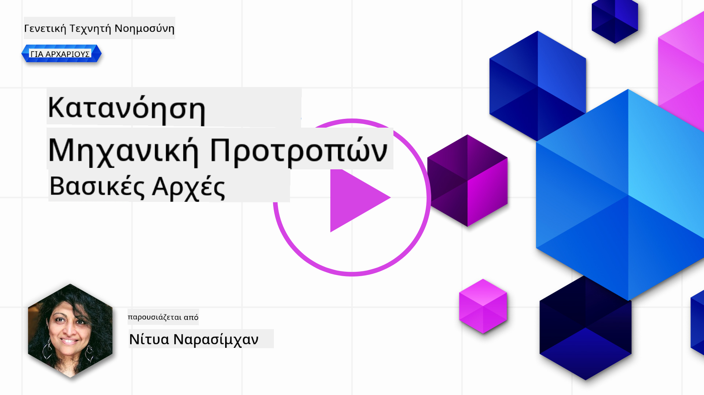
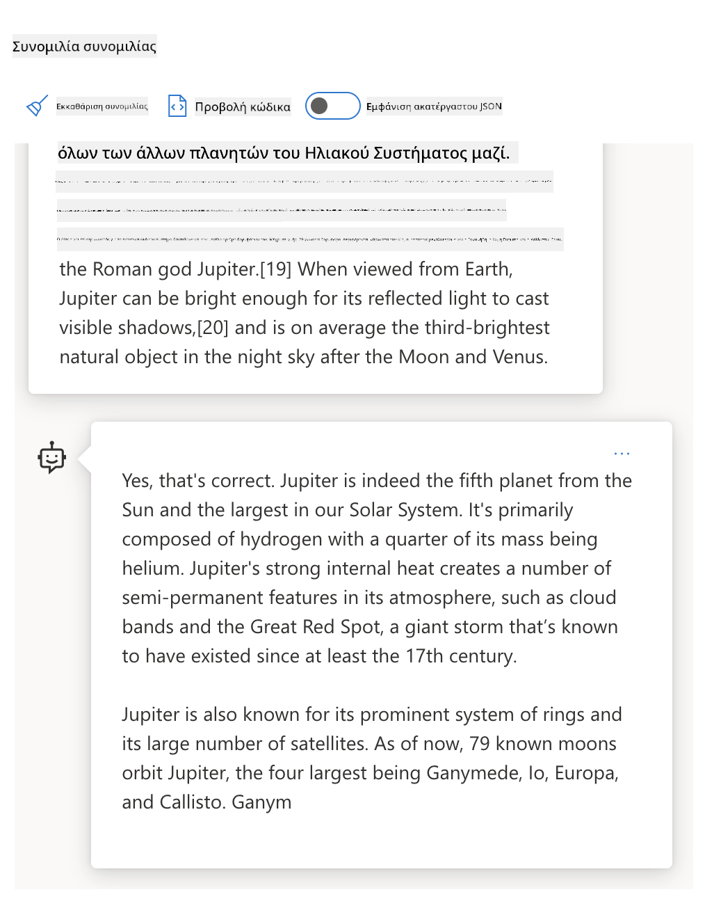
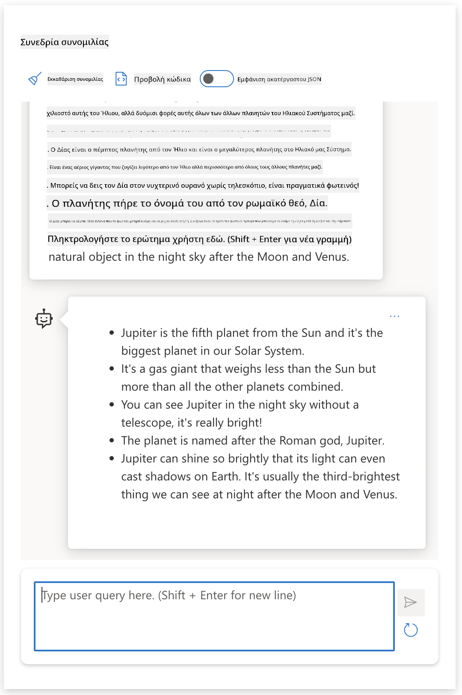
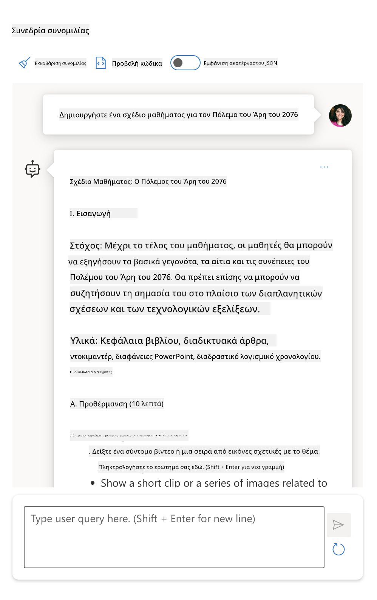

<!--
CO_OP_TRANSLATOR_METADATA:
{
  "original_hash": "a45c318dc6ebc2604f35b8b829f93af2",
  "translation_date": "2025-07-09T10:15:37+00:00",
  "source_file": "04-prompt-engineering-fundamentals/README.md",
  "language_code": "el"
}
-->
# Θεμελιώδεις Αρχές Μηχανικής Προτροπών

[](https://aka.ms/gen-ai-lesson4-gh?WT.mc_id=academic-105485-koreyst)

## Εισαγωγή
Αυτό το μάθημα καλύπτει βασικές έννοιες και τεχνικές για τη δημιουργία αποτελεσματικών προτροπών σε γενετικά μοντέλα AI. Ο τρόπος που γράφετε την προτροπή σας σε ένα LLM έχει επίσης σημασία. Μια προσεκτικά σχεδιασμένη προτροπή μπορεί να επιτύχει καλύτερη ποιότητα απάντησης. Αλλά τι ακριβώς σημαίνουν οι όροι _προτροπή_ και _μηχανική προτροπών_; Και πώς βελτιώνω την _είσοδο_ της προτροπής που στέλνω στο LLM; Αυτά είναι τα ερωτήματα που θα προσπαθήσουμε να απαντήσουμε σε αυτό και το επόμενο κεφάλαιο.

Η _Γενετική Τεχνητή Νοημοσύνη_ είναι ικανή να δημιουργεί νέο περιεχόμενο (π.χ. κείμενο, εικόνες, ήχο, κώδικα κ.ά.) ως απάντηση σε αιτήματα χρηστών. Το πετυχαίνει αυτό χρησιμοποιώντας _Μεγάλα Γλωσσικά Μοντέλα_ όπως η σειρά GPT της OpenAI ("Generative Pre-trained Transformer") που έχουν εκπαιδευτεί για χρήση φυσικής γλώσσας και κώδικα.

Οι χρήστες πλέον μπορούν να αλληλεπιδρούν με αυτά τα μοντέλα χρησιμοποιώντας οικείες μεθόδους όπως η συνομιλία, χωρίς να απαιτείται τεχνική γνώση ή εκπαίδευση. Τα μοντέλα είναι _βασισμένα σε προτροπές_ - οι χρήστες στέλνουν ένα κείμενο εισόδου (προτροπή) και λαμβάνουν την απάντηση της AI (ολοκλήρωση). Μπορούν στη συνέχεια να "συνομιλήσουν με την AI" επαναληπτικά, σε πολυ-γύρους συνομιλίες, βελτιώνοντας την προτροπή τους μέχρι η απάντηση να ανταποκρίνεται στις προσδοκίες τους.

Οι "Προτροπές" γίνονται πλέον η κύρια _διεπαφή προγραμματισμού_ για εφαρμογές γενετικής AI, λέγοντας στα μοντέλα τι να κάνουν και επηρεάζοντας την ποιότητα των απαντήσεων που επιστρέφονται. Η "Μηχανική Προτροπών" είναι ένας ταχέως αναπτυσσόμενος τομέας μελέτης που εστιάζει στο _σχεδιασμό και την βελτιστοποίηση_ των προτροπών για να παρέχει συνεπείς και ποιοτικές απαντήσεις σε μεγάλη κλίμακα.

## Στόχοι Μάθησης

Σε αυτό το μάθημα, μαθαίνουμε τι είναι η Μηχανική Προτροπών, γιατί έχει σημασία και πώς μπορούμε να δημιουργήσουμε πιο αποτελεσματικές προτροπές για ένα συγκεκριμένο μοντέλο και στόχο εφαρμογής. Θα κατανοήσουμε βασικές έννοιες και βέλτιστες πρακτικές για τη μηχανική προτροπών - και θα γνωρίσουμε ένα διαδραστικό περιβάλλον Jupyter Notebooks "sandbox" όπου μπορούμε να δούμε αυτές τις έννοιες να εφαρμόζονται σε πραγματικά παραδείγματα.

Στο τέλος αυτού του μαθήματος θα είμαστε σε θέση να:

1. Εξηγήσουμε τι είναι η μηχανική προτροπών και γιατί έχει σημασία.
2. Περιγράψουμε τα συστατικά μιας προτροπής και πώς χρησιμοποιούνται.
3. Μάθουμε βέλτιστες πρακτικές και τεχνικές για μηχανική προτροπών.
4. Εφαρμόσουμε τις τεχνικές που μάθαμε σε πραγματικά παραδείγματα, χρησιμοποιώντας ένα OpenAI endpoint.

## Βασικοί Όροι

Μηχανική Προτροπών: Η πρακτική του σχεδιασμού και της βελτίωσης εισόδων για να καθοδηγήσουν τα μοντέλα AI προς την παραγωγή επιθυμητών αποτελεσμάτων.  
Tokenization: Η διαδικασία μετατροπής κειμένου σε μικρότερες μονάδες, που ονομάζονται tokens, τις οποίες ένα μοντέλο μπορεί να κατανοήσει και να επεξεργαστεί.  
Instruction-Tuned LLMs: Μεγάλα Γλωσσικά Μοντέλα (LLMs) που έχουν βελτιωθεί με συγκεκριμένες οδηγίες για να αυξήσουν την ακρίβεια και τη σχετικότητα των απαντήσεών τους.

## Περιβάλλον Μάθησης Sandbox

Η μηχανική προτροπών είναι προς το παρόν περισσότερο τέχνη παρά επιστήμη. Ο καλύτερος τρόπος να βελτιώσουμε την αντίληψή μας γι’ αυτήν είναι να _ασκηθούμε περισσότερο_ και να υιοθετήσουμε μια προσέγγιση δοκιμής και λάθους που συνδυάζει την εμπειρία στον τομέα εφαρμογής με τις προτεινόμενες τεχνικές και βελτιστοποιήσεις ειδικές για το μοντέλο.

Το Jupyter Notebook που συνοδεύει αυτό το μάθημα παρέχει ένα περιβάλλον _sandbox_ όπου μπορείτε να δοκιμάσετε όσα μαθαίνετε - καθώς προχωράτε ή ως μέρος της πρόκλησης κώδικα στο τέλος. Για να εκτελέσετε τις ασκήσεις, θα χρειαστείτε:

1. **Ένα κλειδί API Azure OpenAI** - το endpoint υπηρεσίας για ένα αναπτυγμένο LLM.  
2. **Ένα περιβάλλον εκτέλεσης Python** - στο οποίο μπορεί να τρέξει το Notebook.  
3. **Τοπικές Μεταβλητές Περιβάλλοντος** - _ολοκληρώστε τώρα τα βήματα [SETUP](./../00-course-setup/SETUP.md?WT.mc_id=academic-105485-koreyst) για να είστε έτοιμοι_.

Το notebook περιλαμβάνει _αρχικές_ ασκήσεις - αλλά ενθαρρύνεστε να προσθέσετε δικές σας _Markdown_ (περιγραφή) και _Κώδικα_ (αιτήματα προτροπών) ενότητες για να δοκιμάσετε περισσότερα παραδείγματα ή ιδέες - και να χτίσετε την αντίληψή σας για το σχεδιασμό προτροπών.

## Εικονογραφημένος Οδηγός

Θέλετε να πάρετε μια συνολική εικόνα για το τι καλύπτει αυτό το μάθημα πριν ξεκινήσετε; Ρίξτε μια ματιά σε αυτόν τον εικονογραφημένο οδηγό, που σας δίνει μια αίσθηση των βασικών θεμάτων και των σημαντικών σημείων για να σκεφτείτε σε κάθε ένα. Ο οδικός χάρτης του μαθήματος σας οδηγεί από την κατανόηση των βασικών εννοιών και προκλήσεων μέχρι την αντιμετώπισή τους με σχετικές τεχνικές μηχανικής προτροπών και βέλτιστες πρακτικές. Σημειώστε ότι η ενότητα "Προχωρημένες Τεχνικές" σε αυτόν τον οδηγό αναφέρεται σε περιεχόμενο που καλύπτεται στο _επόμενο_ κεφάλαιο αυτού του προγράμματος.


## Η Startup μας

Τώρα, ας μιλήσουμε για το πώς _αυτό το θέμα_ σχετίζεται με την αποστολή της startup μας να [φέρουμε καινοτομία AI στην εκπαίδευση](https://educationblog.microsoft.com/2023/06/collaborating-to-bring-ai-innovation-to-education?WT.mc_id=academic-105485-koreyst). Θέλουμε να δημιουργήσουμε εφαρμογές με AI που υποστηρίζουν _προσωποποιημένη μάθηση_ - οπότε ας σκεφτούμε πώς διαφορετικοί χρήστες της εφαρμογής μας μπορεί να "σχεδιάζουν" προτροπές:

- **Διαχειριστές** μπορεί να ζητούν από την AI να _αναλύσει δεδομένα προγράμματος σπουδών για να εντοπίσει κενά στην κάλυψη_. Η AI μπορεί να συνοψίσει τα αποτελέσματα ή να τα οπτικοποιήσει με κώδικα.  
- **Εκπαιδευτικοί** μπορεί να ζητούν από την AI να _δημιουργήσει ένα σχέδιο μαθήματος για συγκεκριμένο κοινό και θέμα_. Η AI μπορεί να κατασκευάσει το εξατομικευμένο σχέδιο σε καθορισμένη μορφή.  
- **Μαθητές** μπορεί να ζητούν από την AI να _τους διδάξει σε ένα δύσκολο μάθημα_. Η AI μπορεί τώρα να καθοδηγήσει τους μαθητές με μαθήματα, υποδείξεις και παραδείγματα προσαρμοσμένα στο επίπεδό τους.

Αυτά είναι μόνο η κορυφή του παγόβουνου. Ρίξτε μια ματιά στο [Prompts For Education](https://github.com/microsoft/prompts-for-edu/tree/main?WT.mc_id=academic-105485-koreyst) - μια βιβλιοθήκη ανοιχτού κώδικα με προτροπές επιμελημένες από ειδικούς στην εκπαίδευση - για να πάρετε μια ευρύτερη εικόνα των δυνατοτήτων! _Δοκιμάστε να τρέξετε μερικές από αυτές τις προτροπές στο sandbox ή χρησιμοποιώντας το OpenAI Playground για να δείτε τι συμβαίνει!_

<!--
LESSON TEMPLATE:
Αυτή η ενότητα πρέπει να καλύπτει την βασική έννοια #1.
Ενισχύστε την έννοια με παραδείγματα και αναφορές.

ΕΝΝΟΙΑ #1:
Μηχανική Προτροπών.
Ορίστε την και εξηγήστε γιατί είναι απαραίτητη.
-->

## Τι είναι η Μηχανική Προτροπών;

Ξεκινήσαμε αυτό το μάθημα ορίζοντας τη **Μηχανική Προτροπών** ως τη διαδικασία _σχεδιασμού και βελτιστοποίησης_ κειμενικών εισόδων (προτροπών) για να παρέχουν συνεπείς και ποιοτικές απαντήσεις (ολοκληρώσεις) για έναν συγκεκριμένο στόχο εφαρμογής και μοντέλο. Μπορούμε να το σκεφτούμε ως μια διαδικασία δύο βημάτων:

- _σχεδιασμός_ της αρχικής προτροπής για ένα συγκεκριμένο μοντέλο και στόχο  
- _βελτίωση_ της προτροπής επαναληπτικά για να βελτιωθεί η ποιότητα της απάντησης

Αυτή είναι αναγκαστικά μια διαδικασία δοκιμής και λάθους που απαιτεί διαίσθηση και προσπάθεια από τον χρήστη για να επιτευχθούν βέλτιστα αποτελέσματα. Γιατί λοιπόν είναι σημαντική; Για να απαντήσουμε σε αυτό, πρέπει πρώτα να κατανοήσουμε τρεις έννοιες:

- _Tokenization_ = πώς το μοντέλο "βλέπει" την προτροπή  
- _Base LLMs_ = πώς το βασικό μοντέλο "επεξεργάζεται" μια προτροπή  
- _Instruction-Tuned LLMs_ = πώς το μοντέλο πλέον μπορεί να "κατανοεί εργασίες"

### Tokenization

Ένα LLM βλέπει τις προτροπές ως _ακολουθία tokens_ όπου διαφορετικά μοντέλα (ή εκδόσεις ενός μοντέλου) μπορούν να μετατρέψουν την ίδια προτροπή σε tokens με διαφορετικούς τρόπους. Επειδή τα LLM εκπαιδεύονται σε tokens (και όχι σε ακατέργαστο κείμενο), ο τρόπος που οι προτροπές μετατρέπονται σε tokens επηρεάζει άμεσα την ποιότητα της παραγόμενης απάντησης.

Για να αποκτήσετε μια αίσθηση του πώς λειτουργεί το tokenization, δοκιμάστε εργαλεία όπως ο [OpenAI Tokenizer](https://platform.openai.com/tokenizer?WT.mc_id=academic-105485-koreyst) που φαίνεται παρακάτω. Αντιγράψτε την προτροπή σας - και δείτε πώς μετατρέπεται σε tokens, προσέχοντας πώς χειρίζονται οι χαρακτήρες κενών και τα σημεία στίξης. Σημειώστε ότι το παράδειγμα δείχνει ένα παλαιότερο LLM (GPT-3) - οπότε η δοκιμή με νεότερο μοντέλο μπορεί να δώσει διαφορετικό αποτέλεσμα.


### Έννοια: Βασικά Μοντέλα

Μόλις μια προτροπή μετατραπεί σε tokens, η κύρια λειτουργία του ["Base LLM"](https://blog.gopenai.com/an-introduction-to-base-and-instruction-tuned-large-language-models-8de102c785a6?WT.mc_id=academic-105485-koreyst) (ή βασικού μοντέλου) είναι να προβλέψει το επόμενο token στην ακολουθία. Επειδή τα LLM εκπαιδεύονται σε τεράστια σύνολα κειμένων, έχουν καλή αίσθηση των στατιστικών σχέσεων μεταξύ των tokens και μπορούν να κάνουν αυτή την πρόβλεψη με κάποια βεβαιότητα. Σημειώστε ότι δεν κατανοούν το _νόημα_ των λέξεων στην προτροπή ή το token· απλώς βλέπουν ένα μοτίβο που μπορούν να "ολοκληρώσουν" με την επόμενη πρόβλεψή τους. Μπορούν να συνεχίσουν να προβλέπουν την ακολουθία μέχρι να διακοπεί από παρέμβαση χρήστη ή κάποιο προκαθορισμένο όρο.

Θέλετε να δείτε πώς λειτουργεί η ολοκλήρωση βασισμένη σε προτροπές; Εισάγετε την παραπάνω προτροπή στο Azure OpenAI Studio [_Chat Playground_](https://oai.azure.com/playground?WT.mc_id=academic-105485-koreyst) με τις προεπιλεγμένες ρυθμίσεις. Το σύστημα έχει ρυθμιστεί να αντιμετωπίζει τις προτροπές ως αιτήματα για πληροφορίες - οπότε θα δείτε μια ολοκλήρωση που ικανοποιεί αυτό το πλαίσιο.

Αλλά τι γίνεται αν ο χρήστης θέλει να δει κάτι συγκεκριμένο που πληροί κάποια κριτήρια ή στόχο εργασίας; Εδώ μπαίνουν τα _instruction-tuned_ LLMs.



### Έννοια: Instruction Tuned LLMs

Ένα [Instruction Tuned LLM](https://blog.gopenai.com/an-introduction-to-base-and-instruction-tuned-large-language-models-8de102c785a6?WT.mc_id=academic-105485-koreyst) ξεκινά από το βασικό μοντέλο και το βελτιώνει με παραδείγματα ή ζεύγη εισόδου/εξόδου (π.χ. πολυ-γύρους "μηνύματα") που περιέχουν σαφείς οδηγίες - και η απάντηση της AI προσπαθεί να ακολουθήσει αυτές τις οδηγίες.

Αυτό χρησιμοποιεί τεχνικές όπως η Ενισχυτική Μάθηση με Ανθρώπινη Ανατροφοδότηση (RLHF) που εκπαιδεύουν το μοντέλο να _ακολουθεί οδηγίες_ και να _μαθαίνει από την ανατροφοδότηση_, ώστε να παράγει απαντήσεις πιο κατάλληλες για πρακτικές εφαρμογές και πιο σχετικές με τους στόχους του χρήστη.

Ας το δοκιμάσουμε - επανεξετάστε την παραπάνω προτροπή, αλλά τώρα αλλάξτε το _μήνυμα συστήματος_ ώστε να παρέχει την ακόλουθη οδηγία ως πλαίσιο:

> _Συνοψίστε το περιεχόμενο που σας παρέχεται για έναν μαθητή δευτέρας τάξης. Κρατήστε το αποτέλεσμα σε μία παράγραφο με 3-5 σημεία._

Βλέπετε πώς το αποτέλεσμα πλέον προσαρμόζεται για να αντανακλά τον επιθυμητό στόχο και μορφή; Ένας εκπαιδευτικός μπορεί τώρα να χρησιμοποιήσει απευθείας αυτή την απάντηση στις διαφάνειές του για το μάθημα.



## Γιατί χρειαζόμαστε τη Μηχανική Προτροπών;

Τώρα που ξέρουμε πώς τα LLM επεξεργάζονται τις προτροπές, ας μιλήσουμε για το _γιατί_ χρειαζόμαστε τη μηχανική προτροπών. Η απάντηση βρίσκεται στο γεγονός ότι τα τρέχοντα LLM παρουσιάζουν μια σειρά προκλήσεων που καθιστούν πιο δύσκολη την επίτευξη _αξιόπιστων και συνεπών ολοκληρώσεων_ χωρίς προσπάθεια στον σχεδιασμό και τη βελτιστοποίηση των προτροπών. Για παράδειγμα:

1. **Οι απαντήσεις των μοντέλων είναι στοχαστικές.** Η _ίδια προτροπή_ πιθαν
# Σχέδιο Μαθήματος: Ο Πόλεμος των Αρειανών του 2076

## Εισαγωγή
Ο Πόλεμος των Αρειανών του 2076 αποτελεί ένα σημαντικό γεγονός στην ιστορία της ανθρωπότητας και της εξερεύνησης του διαστήματος. Σε αυτό το μάθημα, θα εξερευνήσουμε τα αίτια, τις κύριες μάχες, και τις συνέπειες αυτού του πολέμου.

## Στόχοι Μαθήματος
- Να κατανοήσουν οι μαθητές τα αίτια που οδήγησαν στον Πόλεμο των Αρειανών.
- Να αναγνωρίσουν τις βασικές μάχες και στρατηγικές που χρησιμοποιήθηκαν.
- Να αναλύσουν τις επιπτώσεις του πολέμου στην κοινωνία και την τεχνολογία.
- Να ενθαρρυνθεί η κριτική σκέψη σχετικά με τις συνέπειες του πολέμου.

## Υλικά
- Χάρτες του Άρη και της Γης
- Βίντεο με αναπαραστάσεις των μαχών
- Άρθρα και αποσπάσματα από μαρτυρίες
- Διαδραστικός πίνακας

## Δραστηριότητες

### 1. Εισαγωγική Συζήτηση (15 λεπτά)
- Συζήτηση για το τι γνωρίζουν οι μαθητές για τον Άρη και τις αποικίες εκεί.
- Εισαγωγή στο ιστορικό πλαίσιο του 2076.

### 2. Παρουσίαση: Αίτια του Πολέμου (20 λεπτά)
- Παρουσίαση των πολιτικών, οικονομικών και κοινωνικών παραγόντων που οδήγησαν στη σύγκρουση.

### 3. Ανάλυση Μάχης (30 λεπτά)
- Εξέταση των σημαντικότερων μαχών.
- Χρήση χαρτών και βίντεο για καλύτερη κατανόηση.

### 4. Ομαδική Εργασία: Επιπτώσεις του Πολέμου (25 λεπτά)
- Οι μαθητές χωρίζονται σε ομάδες και συζητούν τις συνέπειες του πολέμου σε διάφορους τομείς.
- Παρουσίαση των συμπερασμάτων στην τάξη.

### 5. Συμπεράσματα και Αναστοχασμός (10 λεπτά)
- Συζήτηση για το τι μπορούμε να μάθουμε από τον Πόλεμο των Αρειανών.
- Σύνδεση με σύγχρονα ζητήματα ειρήνης και διαστημικής εξερεύνησης.

## Αξιολόγηση
- Συμμετοχή στις συζητήσεις και τις δραστηριότητες.
- Παρουσίαση ομαδικής εργασίας.
- Μικρό τεστ γνώσεων στο τέλος του μαθήματος.

## Σημειώσεις για τον Εκπαιδευτικό
- Προσαρμόστε το επίπεδο δυσκολίας ανάλογα με την ηλικία των μαθητών.
- Ενθαρρύνετε την ενεργή συμμετοχή και την κριτική σκέψη.
- Χρησιμοποιήστε οπτικοακουστικό υλικό για να κάνετε το μάθημα πιο ενδιαφέρον.
Μια αναζήτηση στο διαδίκτυο μου έδειξε ότι υπήρχαν φανταστικές αφηγήσεις (π.χ., τηλεοπτικές σειρές ή βιβλία) για πολέμους στον Άρη - αλλά καμία το 2076. Η κοινή λογική επίσης μας λέει ότι το 2076 είναι _στο μέλλον_ και επομένως, δεν μπορεί να συνδεθεί με ένα πραγματικό γεγονός.

Τι συμβαίνει λοιπόν όταν τρέχουμε αυτό το prompt με διαφορετικούς παρόχους LLM;

> **Απάντηση 1**: OpenAI Playground (GPT-35)


> **Απάντηση 2**: Azure OpenAI Playground (GPT-35)



> **Απάντηση 3**: : Hugging Face Chat Playground (LLama-2)


Όπως αναμενόταν, κάθε μοντέλο (ή έκδοση μοντέλου) παράγει ελαφρώς διαφορετικές απαντήσεις χάρη στη στοχαστική συμπεριφορά και τις διαφορές στις δυνατότητες του μοντέλου. Για παράδειγμα, ένα μοντέλο απευθύνεται σε κοινό 8ης τάξης ενώ το άλλο υποθέτει μαθητή λυκείου. Όμως και τα τρία μοντέλα παρήγαγαν απαντήσεις που θα μπορούσαν να πείσουν έναν μη ενημερωμένο χρήστη ότι το γεγονός ήταν πραγματικό.

Τεχνικές prompt engineering όπως το _metaprompting_ και η _ρύθμιση θερμοκρασίας_ μπορεί να μειώσουν σε κάποιο βαθμό τις κατασκευές του μοντέλου. Νέες _αρχιτεκτονικές_ prompt engineering ενσωματώνουν επίσης νέα εργαλεία και τεχνικές ομαλά στη ροή του prompt, για να μετριάσουν ή να μειώσουν κάποιες από αυτές τις επιπτώσεις.

## Μελέτη Περίπτωσης: GitHub Copilot

Ας κλείσουμε αυτή την ενότητα παίρνοντας μια ιδέα για το πώς χρησιμοποιείται το prompt engineering σε πραγματικές λύσεις, εξετάζοντας μια Μελέτη Περίπτωσης: [GitHub Copilot](https://github.com/features/copilot?WT.mc_id=academic-105485-koreyst).

Το GitHub Copilot είναι ο "AI Συνεργάτης Προγραμματισμού" σου - μετατρέπει τα κείμενα σε ολοκληρώσεις κώδικα και είναι ενσωματωμένο στο περιβάλλον ανάπτυξής σου (π.χ., Visual Studio Code) για μια απρόσκοπτη εμπειρία χρήστη. Όπως τεκμηριώνεται στη σειρά των παρακάτω blogs, η αρχική έκδοση βασιζόταν στο μοντέλο OpenAI Codex - με τους μηχανικούς να συνειδητοποιούν γρήγορα την ανάγκη για fine-tuning του μοντέλου και ανάπτυξη καλύτερων τεχνικών prompt engineering, για βελτίωση της ποιότητας του κώδικα. Τον Ιούλιο, παρουσίασαν [ένα βελτιωμένο AI μοντέλο που ξεπερνά το Codex](https://github.blog/2023-07-28-smarter-more-efficient-coding-github-copilot-goes-beyond-codex-with-improved-ai-model/?WT.mc_id=academic-105485-koreyst) για ακόμα πιο γρήγορες προτάσεις.

Διάβασε τις αναρτήσεις με τη σειρά, για να ακολουθήσεις το ταξίδι μάθησής τους.

- **Μάιος 2023** | [Το GitHub Copilot βελτιώνεται στην κατανόηση του κώδικά σου](https://github.blog/2023-05-17-how-github-copilot-is-getting-better-at-understanding-your-code/?WT.mc_id=academic-105485-koreyst)
- **Μάιος 2023** | [Μέσα στο GitHub: Εργασία με τα LLMs πίσω από το GitHub Copilot](https://github.blog/2023-05-17-inside-github-working-with-the-llms-behind-github-copilot/?WT.mc_id=academic-105485-koreyst)
- **Ιούνιος 2023** | [Πώς να γράψεις καλύτερα prompts για το GitHub Copilot](https://github.blog/2023-06-20-how-to-write-better-prompts-for-github-copilot/?WT.mc_id=academic-105485-koreyst)
- **Ιούλιος 2023** | [.. Το GitHub Copilot ξεπερνά το Codex με βελτιωμένο AI μοντέλο](https://github.blog/2023-07-28-smarter-more-efficient-coding-github-copilot-goes-beyond-codex-with-improved-ai-model/?WT.mc_id=academic-105485-koreyst)
- **Ιούλιος 2023** | [Οδηγός Προγραμματιστή για το Prompt Engineering και τα LLMs](https://github.blog/2023-07-17-prompt-engineering-guide-generative-ai-llms/?WT.mc_id=academic-105485-koreyst)
- **Σεπτέμβριος 2023** | [Πώς να φτιάξεις μια επιχειρησιακή εφαρμογή LLM: Μαθήματα από το GitHub Copilot](https://github.blog/2023-09-06-how-to-build-an-enterprise-llm-application-lessons-from-github-copilot/?WT.mc_id=academic-105485-koreyst)

Μπορείς επίσης να περιηγηθείς στο [Engineering blog](https://github.blog/category/engineering/?WT.mc_id=academic-105485-koreyst) για περισσότερες αναρτήσεις όπως [αυτή](https://github.blog/2023-09-27-how-i-used-github-copilot-chat-to-build-a-reactjs-gallery-prototype/?WT.mc_id=academic-105485-koreyst) που δείχνει πώς αυτά τα μοντέλα και οι τεχνικές _εφαρμόζονται_ για την υλοποίηση πραγματικών εφαρμογών.

---

<!--
ΠΡΟΤΥΠΟ ΜΑΘΗΜΑΤΟΣ:
Αυτή η ενότητα πρέπει να καλύπτει τον βασικό όρο #2.
Ενισχύστε την έννοια με παραδείγματα και αναφορές.

ΒΑΣΙΚΗ ΕΝΝΟΙΑ #2:
Σχεδιασμός Prompt.
Εικονογραφημένο με παραδείγματα.
-->

## Κατασκευή Prompt

Έχουμε δει γιατί το prompt engineering είναι σημαντικό - τώρα ας κατανοήσουμε πώς _κατασκευάζονται_ τα prompts ώστε να αξιολογήσουμε διαφορετικές τεχνικές για πιο αποτελεσματικό σχεδιασμό prompt.

### Απλό Prompt

Ας ξεκινήσουμε με το απλό prompt: μια κειμενική είσοδος που στέλνεται στο μοντέλο χωρίς άλλο πλαίσιο. Να ένα παράδειγμα - όταν στέλνουμε τις πρώτες λέξεις του εθνικού ύμνου των ΗΠΑ στο OpenAI [Completion API](https://platform.openai.com/docs/api-reference/completions?WT.mc_id=academic-105485-koreyst), αυτό αμέσως _συμπληρώνει_ την απάντηση με τις επόμενες γραμμές, δείχνοντας τη βασική συμπεριφορά πρόβλεψης.

| Prompt (Είσοδος)     | Ολοκλήρωση (Έξοδος)                                                                                                                        |
| :----------------- | :----------------------------------------------------------------------------------------------------------------------------------------- |
| Oh say can you see | Ακούγεται σαν να ξεκινάς τους στίχους του "The Star-Spangled Banner," του εθνικού ύμνου των Ηνωμένων Πολιτειών. Οι πλήρεις στίχοι είναι ... |

### Σύνθετο Prompt

Τώρα ας προσθέσουμε πλαίσιο και οδηγίες σε αυτό το απλό prompt. Το [Chat Completion API](https://learn.microsoft.com/azure/ai-services/openai/how-to/chatgpt?WT.mc_id=academic-105485-koreyst) μας επιτρέπει να κατασκευάσουμε ένα σύνθετο prompt ως συλλογή _μηνυμάτων_ με:

- Ζεύγη εισόδου/εξόδου που αντικατοπτρίζουν την _είσοδο_ του χρήστη και την _απάντηση_ του βοηθού.
- Μήνυμα συστήματος που ορίζει το πλαίσιο για τη συμπεριφορά ή την προσωπικότητα του βοηθού.

Το αίτημα είναι τώρα στη μορφή παρακάτω, όπου η _τοκενικοποίηση_ αποτυπώνει αποτελεσματικά τις σχετικές πληροφορίες από το πλαίσιο και τη συνομιλία. Τώρα, η αλλαγή του πλαισίου συστήματος μπορεί να έχει τόσο σημαντική επίδραση στην ποιότητα των ολοκληρώσεων, όσο και οι παρεχόμενες είσοδοι χρήστη.

```python
response = openai.chat.completions.create(
    model="gpt-3.5-turbo",
    messages=[
        {"role": "system", "content": "You are a helpful assistant."},
        {"role": "user", "content": "Who won the world series in 2020?"},
        {"role": "assistant", "content": "The Los Angeles Dodgers won the World Series in 2020."},
        {"role": "user", "content": "Where was it played?"}
    ]
)
```

### Prompt με Οδηγίες

Στα παραπάνω παραδείγματα, το prompt του χρήστη ήταν ένα απλό κείμενο που μπορεί να ερμηνευτεί ως αίτημα για πληροφορίες. Με τα _instruction_ prompts, μπορούμε να χρησιμοποιήσουμε αυτό το κείμενο για να καθορίσουμε μια εργασία με περισσότερες λεπτομέρειες, παρέχοντας καλύτερη καθοδήγηση στην AI. Να ένα παράδειγμα:

| Prompt (Είσοδος)                                                                                                                                                                                                                         | Ολοκλήρωση (Έξοδος)                                                                                                        | Τύπος Οδηγίας      |
| :------------------------------------------------------------------------------------------------------------------------------------------------------------------------------------------------------------------------------------- | :------------------------------------------------------------------------------------------------------------------------- | :------------------ |
| Γράψε μια περιγραφή του Εμφυλίου Πολέμου                                                                                                                                                                                                   | _επιστράφηκε μια απλή παράγραφος_                                                                                              | Απλή               |
| Γράψε μια περιγραφή του Εμφυλίου Πολέμου. Παρέθεσε βασικές ημερομηνίες και γεγονότα και περιέγραψε τη σημασία τους                                                                                                                                     | _επιστράφηκε μια παράγραφος ακολουθούμενη από λίστα με βασικές ημερομηνίες γεγονότων και περιγραφές_                                             | Σύνθετη             |
| Γράψε μια περιγραφή του Εμφυλίου Πολέμου σε 1 παράγραφο. Παρέθεσε 3 σημεία με βασικές ημερομηνίες και τη σημασία τους. Παρέθεσε 3 ακόμα σημεία με βασικές ιστορικές προσωπικότητες και τις συνεισφορές τους. Επιστρέφει το αποτέλεσμα ως αρχείο JSON | _επιστρέφει πιο εκτενείς λεπτομέρειες σε πλαίσιο κειμένου, μορφοποιημένο ως JSON που μπορείς να αντιγράψεις και να επαληθεύσεις αν χρειαστεί_ | Σύνθετο. Μορφοποιημένο. |

## Κύριο Περιεχόμενο

Στα παραπάνω παραδείγματα, το prompt ήταν ακόμα αρκετά ανοιχτό, επιτρέποντας στο LLM να αποφασίσει ποιο μέρος του προεκπαιδευμένου συνόλου δεδομένων του είναι σχετικό. Με το μοτίβο σχεδιασμού _primary content_, το κείμενο εισόδου χωρίζεται σε δύο μέρη:

- μια οδηγία (ενέργεια)
- σχετικό περιεχόμενο (που επηρεάζει την ενέργεια)

Να ένα παράδειγμα όπου η οδηγία είναι "περίληψη σε 2 προτάσεις".

| Prompt (Είσοδος)                                                                                                                                                                                                                                                                                                                                                                                                                                                                                                                                                                                                                                                                                      | Ολοκλήρωση (Έξοδος)                                                                                                                                                                                                                                                                             |
| :-------------------------------------------------------------------------------------------------------------------------------------------------------------------------------------------------------------------------------------------------------------------------------------------------------------------------------------------------------------------------------------------------------------------------------------------------------------------------------------------------------------------------------------------------------------------------------------------------------------------------------------------------------------------------------------------------- | :---------------------------------------------------------------------------------------------------------------------------------------------------------------------------------------------------------------------------------------------------------------------------------------------- |
| Ο Δίας είναι ο πέμπτος πλανήτης από τον Ήλιο και ο μεγαλύτερος στο Ηλιακό Σύστημα. Είναι ένας γίγαντας αερίων με μάζα το ένα χιλιοστό της μάζας του Ήλιου, αλλά δυόμισι φορές τη μάζα όλων των άλλων πλανητών του Ηλιακού Συστήματος μαζί. Ο Δίας είναι ένα από τα πιο φωτεινά αντικείμενα που φαίνονται με γυμνό μάτι στον νυχτερινό ουρανό και ήταν γνωστός σε αρχαίους πολιτισμούς πριν από την καταγεγραμμένη ιστορία. Ονομάζεται από τον ρωμαϊκό θεό Δία.[19] Όταν τον παρατηρούμε από τη Γη, ο Δίας μπορεί να είναι αρκετά φωτεινός ώστε το ανακλώμενο φως του να ρίχνει ορατές σκιές,[20] και είναι κατά μέσο όρο το τρίτο πιο φωτεινό φυσικό αντικείμενο στον νυχτερινό ουρανό μετά τη Σελήνη και την Αφροδίτη. <br/> **Περίληψη σε 2 σύντομες προτάσεις** | Ο Δίας, ο πέμπτος πλανήτης από τον Ήλιο, είναι ο μεγαλύτερος στο Ηλιακό Σύστημα και είναι γνωστός ως ένα από τα πιο φωτεινά αντικείμενα στον νυχτερινό ουρανό. Ονομάστηκε από τον ρωμαϊκό θεό Δία, είναι ένας γίγαντας αερίων με μάζα δυόμισι φορές μεγαλύτερη από το σύνολο των άλλων πλανητών του Ηλιακού Συστήματος μαζί. |

Το τμήμα primary content μπορεί να χρησιμοποιηθεί με διάφορους τρόπους για να οδηγήσει πιο αποτελεσματικές οδηγίες:

- **Παραδείγματα** - αντί να πούμε στο μοντέλο τι να κάνει με μια ρητή οδηγία, δίνουμε παραδείγματα του τι να κάνει και το αφήνουμε να συμπεράνει το μοτίβο.
- **Υποδείξεις** - ακολουθούμε την οδηγία με μια "υπόδειξη" που προετοιμάζει την ολοκλήρωση, καθοδηγώντας το μοντέλο προς πιο σχετικές απαντήσεις.
- **Πρότυπα** - είναι επαναλαμβανόμενες 'συνταγές' για prompts με placeholders (μεταβλητές) που μπορούν να προσαρμοστούν με δεδομένα για συγκεκριμένες χρήσεις.

Ας τα εξερευνήσουμε στην πράξη.

### Χρήση Παραδειγμάτων

Αυτή είναι μια προσέγγιση όπου χρησιμοποιείς το primary content για να "ταΐσεις το μοντέλο" με παραδείγματα της επιθυμητής εξόδου για μια δεδομένη οδηγία, και το αφήνεις να συμπεράνει το μοτίβο της επιθυμητής εξόδου. Ανάλογα με τον αριθμό των παραδειγμάτων που παρέχονται, μπορούμε να έχουμε zero-shot prompting, one-shot prompting, few-shot prompting κ.ά.

Το prompt τώρα αποτελείται από τρία στοιχεία:

- Μια περιγραφή εργασίας
- Μερικά παραδείγματα της επιθυμητής εξόδου
- Την αρχή ενός νέου παραδείγματος (που γίνεται μια σιωπηρή περιγραφή εργασίας)

| Τύπος Μάθησης | Prompt (Είσοδος)                                                                                                                                        | Ολοκλήρωση (Έξοδος)         |
| :------------ | :---------------------------------------------------------------------------------------------------------------------------------------------------- | :-------------------------- |
| Zero-shot     | "The Sun is Shining". Μετάφραση στα Ισπανικά                                                                                                            | "El Sol está brillando".    |
| One-shot      | "The Sun is Shining" => ""El Sol está brillando". <br> "It's a Cold and Windy Day" =>                                                                 | "Es un día frío y ventoso". |
| Few-shot      | The player ran the bases => Baseball <br/> The player hit an ace => Tennis <br/> The player hit a six => Cricket <br/> The player made a slam-dunk => | Basketball                  |
|               |                                                                                                                                                       |                             |

Παρατήρησε πώς έπρεπε να δώσουμε ρητή οδηγία ("Μετάφραση στα Ισπανικά") στο zero-shot prompting, αλλά αυτή συμπεραίνεται στο one-shot παράδειγμα. Το few-shot παράδειγμα δείχνει πώς η προσθήκη περισσότερων παραδειγμάτων επιτρέπει στα μοντέλα να κάνουν πιο ακριβείς συμπεράσεις χωρίς επιπλέον οδηγίες.

### Υποδείξεις Prompt

Μια άλλη τεχνική για τη χρήση του primary content είναι να παρέχουμε _υποδείξεις_ αντί για παραδείγματα. Σε αυτή την περίπτωση, δίνουμε στο μοντέλο μια ώθηση προς τη σωστή κατεύθυνση _ξεκινώντας_ με ένα απόσπασμα που αντικατοπτρίζει τη μορφή της επιθυμητής απάντησης. Το μοντέλο τότε "παίρνει την υπόδειξη" και συνεχίζει σε αυτό το ύφος.

| Αριθμός Υποδείξεων | Prompt (Είσοδος)                                                                                                                                                                                                                                                                                                                                                                                                                                               | Ολοκλήρωση (Έξοδος)                                                                                                                                                                                                                                                                                       |
| :------------- | :----------------------------------------------------------------------------------------------------------------------------------------------------------------------------------------------------------------------------------------------------------------------------------------------------------------------------------------------------------------------------------------------------------------------------------------------------------- | :-------------------------------------------------------------------------------------------------------------------------------------------------------------------------------------------------------------------------------------------------------------------------------------------------------- |
| 0              | Ο Δίας είναι ο πέμπτος πλανήτης από τον Ήλιο και ο μεγαλύτερος στο Ηλιακό Σύστημα. Είναι ένας γίγαντας αερίων με μάζα το ένα χιλιοστό της μάζας του Ήλιου, αλλά δυόμισι φορές τη μάζα όλων των άλλων πλανητών του Ηλιακού Συστήματος μαζί. Ο Δίας είναι ένα από τα πιο φωτεινά αντικείμενα που φαίνονται με γυμνό μάτι στον νυχτερινό ουρανό, και ήταν γνωστός σε αρχαίους πολιτισμούς πριν από την καταγεγραμμένη ιστορία.

**Σύνοψη**                                       | Ο Δίας είναι ο μεγαλύτερος πλανήτης στο Ηλιακό μας Σύστημα και ο πέμπτος από τον Ήλιο. Είναι ένας γιγάντιος πλανήτης αερίων με μάζα 1/1000 αυτής του Ήλιου, αλλά βαρύτερος από όλους τους υπόλοιπους πλανήτες μαζί. Οι αρχαίοι πολιτισμοί γνώριζαν τον Δία εδώ και πολύ καιρό, και είναι εύκολα ορατός στον νυχτερινό ουρανό. |
| 1              | Ο Δίας είναι ο πέμπτος πλανήτης από τον Ήλιο και ο μεγαλύτερος στο Ηλιακό Σύστημα. Είναι ένας γιγάντιος πλανήτης αερίων με μάζα το ένα χιλιοστό αυτής του Ήλιου, αλλά δύο και μισές φορές μεγαλύτερη από το άθροισμα όλων των άλλων πλανητών στο Ηλιακό Σύστημα. Ο Δίας είναι ένα από τα πιο φωτεινά αντικείμενα που φαίνονται με γυμνό μάτι στον νυχτερινό ουρανό και ήταν γνωστός στους αρχαίους πολιτισμούς πριν από την καταγεγραμμένη ιστορία. <br/>**Σύνοψη** <br/> Αυτό που μάθαμε είναι ότι ο Δίας | είναι ο πέμπτος πλανήτης από τον Ήλιο και ο μεγαλύτερος στο Ηλιακό Σύστημα. Είναι ένας γιγάντιος πλανήτης αερίων με μάζα το ένα χιλιοστό αυτής του Ήλιου, αλλά δύο και μισές φορές μεγαλύτερη από το άθροισμα όλων των άλλων πλανητών. Είναι εύκολα ορατός με γυμνό μάτι και είναι γνωστός από την αρχαιότητα.                        |
| 2              | Ο Δίας είναι ο πέμπτος πλανήτης από τον Ήλιο και ο μεγαλύτερος στο Ηλιακό Σύστημα. Είναι ένας γιγάντιος πλανήτης αερίων με μάζα το ένα χιλιοστό αυτής του Ήλιου, αλλά δύο και μισές φορές μεγαλύτερη από το άθροισμα όλων των άλλων πλανητών στο Ηλιακό Σύστημα. Ο Δίας είναι ένα από τα πιο φωτεινά αντικείμενα που φαίνονται με γυμνό μάτι στον νυχτερινό ουρανό και ήταν γνωστός στους αρχαίους πολιτισμούς πριν από την καταγεγραμμένη ιστορία. <br/>**Σύνοψη** <br/> Τα 3 κορυφαία στοιχεία που μάθαμε:         | 1. Ο Δίας είναι ο πέμπτος πλανήτης από τον Ήλιο και ο μεγαλύτερος στο Ηλιακό Σύστημα. <br/> 2. Είναι ένας γιγάντιος πλανήτης αερίων με μάζα το ένα χιλιοστό αυτής του Ήλιου...<br/> 3. Ο Δίας είναι ορατός με γυμνό μάτι από την αρχαιότητα ...                                                                       |
|                |                                                                                                                                                                                                                                                                                                                                                                                                                                                              |                                                                                                                                                                                                                                                                                                           |

### Πρότυπα Προτροπών

Ένα πρότυπο προτροπής είναι μια _προκαθορισμένη συνταγή για μια προτροπή_ που μπορεί να αποθηκευτεί και να επαναχρησιμοποιηθεί όποτε χρειάζεται, για να προσφέρει πιο συνεπείς εμπειρίες χρήστη σε μεγάλη κλίμακα. Στην πιο απλή μορφή του, είναι απλώς μια συλλογή παραδειγμάτων προτροπών όπως [αυτό από το OpenAI](https://platform.openai.com/examples?WT.mc_id=academic-105485-koreyst) που παρέχει τόσο τα διαδραστικά στοιχεία της προτροπής (μηνύματα χρήστη και συστήματος) όσο και τη μορφή αιτήματος μέσω API - για να υποστηρίξει την επαναχρησιμοποίηση.

Σε πιο σύνθετη μορφή, όπως [αυτό το παράδειγμα από το LangChain](https://python.langchain.com/docs/concepts/prompt_templates/?WT.mc_id=academic-105485-koreyst), περιέχει _θέσεις κράτησης_ που μπορούν να αντικατασταθούν με δεδομένα από διάφορες πηγές (εισροή χρήστη, πλαίσιο συστήματος, εξωτερικές πηγές δεδομένων κ.ά.) για να δημιουργηθεί δυναμικά μια προτροπή. Αυτό μας επιτρέπει να δημιουργήσουμε μια βιβλιοθήκη επαναχρησιμοποιήσιμων προτροπών που μπορούν να χρησιμοποιηθούν για να προσφέρουν συνεπείς εμπειρίες χρήστη **προγραμματιστικά** σε μεγάλη κλίμακα.

Τέλος, η πραγματική αξία των προτύπων έγκειται στην ικανότητα δημιουργίας και δημοσίευσης _βιβλιοθηκών προτροπών_ για κάθετες εφαρμογές - όπου το πρότυπο προτροπής είναι πλέον _βελτιστοποιημένο_ ώστε να αντανακλά το πλαίσιο ή παραδείγματα ειδικά για την εφαρμογή, κάνοντας τις απαντήσεις πιο σχετικές και ακριβείς για το στοχευμένο κοινό. Το αποθετήριο [Prompts For Edu](https://github.com/microsoft/prompts-for-edu?WT.mc_id=academic-105485-koreyst) είναι ένα εξαιρετικό παράδειγμα αυτής της προσέγγισης, συγκεντρώνοντας μια βιβλιοθήκη προτροπών για τον τομέα της εκπαίδευσης με έμφαση σε βασικούς στόχους όπως ο σχεδιασμός μαθημάτων, το πρόγραμμα σπουδών, η διδασκαλία μαθητών κ.ά.

## Υποστηρικτικό Περιεχόμενο

Αν σκεφτούμε τη δημιουργία προτροπών ως μια εντολή (εργασία) και ένα στόχο (κύριο περιεχόμενο), τότε το _δευτερεύον περιεχόμενο_ είναι σαν επιπλέον πλαίσιο που παρέχουμε για να **επηρεάσουμε την έξοδο με κάποιο τρόπο**. Μπορεί να είναι παράμετροι ρύθμισης, οδηγίες μορφοποίησης, ταξινομίες θεμάτων κ.ά. που βοηθούν το μοντέλο να _προσαρμόσει_ την απάντησή του ώστε να ταιριάζει στους επιθυμητούς στόχους ή προσδοκίες του χρήστη.

Για παράδειγμα: Δεδομένου ενός καταλόγου μαθημάτων με εκτενή μεταδεδομένα (όνομα, περιγραφή, επίπεδο, ετικέτες μεταδεδομένων, διδάσκων κ.ά.) για όλα τα διαθέσιμα μαθήματα στο πρόγραμμα σπουδών:

- μπορούμε να ορίσουμε μια εντολή για "σύνοψη του καταλόγου μαθημάτων για το Φθινόπωρο 2023"
- μπορούμε να χρησιμοποιήσουμε το κύριο περιεχόμενο για να δώσουμε μερικά παραδείγματα της επιθυμητής εξόδου
- μπορούμε να χρησιμοποιήσουμε το δευτερεύον περιεχόμενο για να εντοπίσουμε τις 5 κορυφαίες "ετικέτες" ενδιαφέροντος.

Τώρα, το μοντέλο μπορεί να παρέχει μια σύνοψη στη μορφή που δείχνουν τα παραδείγματα - αλλά αν ένα αποτέλεσμα έχει πολλές ετικέτες, μπορεί να δώσει προτεραιότητα στις 5 ετικέτες που εντοπίστηκαν στο δευτερεύον περιεχόμενο.

---

<!--
ΠΡΟΤΥΠΟ ΜΑΘΗΜΑΤΟΣ:
Αυτή η ενότητα πρέπει να καλύπτει τον βασικό όρο #1.
Ενισχύστε την έννοια με παραδείγματα και αναφορές.

ΕΝΝΟΙΑ #3:
Τεχνικές Μηχανικής Προτροπών.
Ποιες είναι μερικές βασικές τεχνικές για τη μηχανική προτροπών;
Απεικονίστε το με μερικές ασκήσεις.
-->

## Καλές Πρακτικές στη Δημιουργία Προτροπών

Τώρα που ξέρουμε πώς μπορούν να _δημιουργηθούν_ οι προτροπές, μπορούμε να αρχίσουμε να σκεφτόμαστε πώς να τις _σχεδιάσουμε_ ώστε να αντανακλούν τις βέλτιστες πρακτικές. Μπορούμε να το σκεφτούμε σε δύο μέρη - έχοντας τη σωστή _νοοτροπία_ και εφαρμόζοντας τις σωστές _τεχνικές_.

### Νοοτροπία Μηχανικής Προτροπών

Η μηχανική προτροπών είναι μια διαδικασία δοκιμής και λάθους, οπότε κρατήστε τρεις βασικούς παράγοντες στο μυαλό:

1. **Η Κατανόηση του Τομέα Μετράει.** Η ακρίβεια και η σχετικότητα της απάντησης εξαρτώνται από τον _τομέα_ στον οποίο λειτουργεί η εφαρμογή ή ο χρήστης. Εφαρμόστε την διαίσθηση και την εμπειρογνωμοσύνη σας στον τομέα για να **προσαρμόσετε περαιτέρω τις τεχνικές**. Για παράδειγμα, ορίστε _προσωπικότητες ειδικές για τον τομέα_ στις προτροπές συστήματος, ή χρησιμοποιήστε _πρότυπα ειδικά για τον τομέα_ στις προτροπές χρήστη. Παρέχετε δευτερεύον περιεχόμενο που αντανακλά πλαίσια ειδικά για τον τομέα, ή χρησιμοποιήστε _ενδείξεις και παραδείγματα ειδικά για τον τομέα_ για να καθοδηγήσετε το μοντέλο προς οικείες χρήσεις.

2. **Η Κατανόηση του Μοντέλου Μετράει.** Γνωρίζουμε ότι τα μοντέλα είναι στοχαστικά από τη φύση τους. Αλλά οι υλοποιήσεις μοντέλων μπορεί επίσης να διαφέρουν όσον αφορά το σύνολο δεδομένων εκπαίδευσης που χρησιμοποιούν (προεκπαιδευμένη γνώση), τις δυνατότητες που παρέχουν (π.χ. μέσω API ή SDK) και τον τύπο περιεχομένου για τον οποίο είναι βελτιστοποιημένα (π.χ. κώδικας έναντι εικόνων έναντι κειμένου). Κατανοήστε τα πλεονεκτήματα και τους περιορισμούς του μοντέλου που χρησιμοποιείτε και χρησιμοποιήστε αυτή τη γνώση για να _ιεραρχήσετε εργασίες_ ή να δημιουργήσετε _προσαρμοσμένα πρότυπα_ που είναι βελτιστοποιημένα για τις δυνατότητες του μοντέλου.

3. **Η Επανάληψη & Επικύρωση Μετράει.** Τα μοντέλα εξελίσσονται γρήγορα, όπως και οι τεχνικές μηχανικής προτροπών. Ως ειδικός στον τομέα, μπορεί να έχετε άλλο πλαίσιο ή κριτήρια για _τη δική σας_ συγκεκριμένη εφαρμογή, που ίσως να μην ισχύουν για την ευρύτερη κοινότητα. Χρησιμοποιήστε εργαλεία και τεχνικές μηχανικής προτροπών για να "ξεκινήσετε" τη δημιουργία προτροπών, μετά επαναλάβετε και επικυρώστε τα αποτελέσματα χρησιμοποιώντας τη δική σας διαίσθηση και εμπειρογνωμοσύνη. Καταγράψτε τις γνώσεις σας και δημιουργήστε μια **βάση γνώσεων** (π.χ. βιβλιοθήκες προτροπών) που μπορούν να χρησιμοποιηθούν ως νέα βάση από άλλους, για ταχύτερες επαναλήψεις στο μέλλον.

## Καλές Πρακτικές

Ας δούμε τώρα κοινές βέλτιστες πρακτικές που προτείνουν οι [OpenAI](https://help.openai.com/en/articles/6654000-best-practices-for-prompt-engineering-with-openai-api?WT.mc_id=academic-105485-koreyst) και [Azure OpenAI](https://learn.microsoft.com/azure/ai-services/openai/concepts/prompt-engineering#best-practices?WT.mc_id=academic-105485-koreyst) ειδικοί.

| Τι                              | Γιατί                                                                                                                                                                                                                                               |
| :-------------------------------- | :------------------------------------------------------------------------------------------------------------------------------------------------------------------------------------------------------------------------------------------------ |
| Αξιολογήστε τα πιο πρόσφατα μοντέλα.       | Οι νέες γενιές μοντέλων πιθανόν να έχουν βελτιωμένα χαρακτηριστικά και ποιότητα - αλλά μπορεί να έχουν και υψηλότερο κόστος. Αξιολογήστε τα για τον αντίκτυπο και μετά αποφασίστε για τη μετάβαση.                                                                                |
| Διαχωρίστε τις οδηγίες & το πλαίσιο   | Ελέγξτε αν το μοντέλο/πάροχος ορίζει _διαχωριστικά_ για να ξεχωρίζουν καλύτερα οι οδηγίες, το κύριο και το δευτερεύον περιεχόμενο. Αυτό βοηθά τα μοντέλα να αποδίδουν πιο ακριβείς βαρύτητες στα tokens.                                                         |
| Να είστε συγκεκριμένοι και σαφείς             | Δώστε περισσότερες λεπτομέρειες για το επιθυμητό πλαίσιο, αποτέλεσμα, μήκος, μορφή, στυλ κ.ά. Αυτό βελτιώνει τόσο την ποιότητα όσο και τη συνέπεια των απαντήσεων. Καταγράψτε τις συνταγές σε επαναχρησιμοποιήσιμα πρότυπα.                                                          |
| Να είστε περιγραφικοί, χρησιμοποιήστε παραδείγματα      | Τα μοντέλα μπορεί να ανταποκριθούν καλύτερα σε μια προσέγγιση "δείξε και πες". Ξεκινήστε με μια `zero-shot` προσέγγιση όπου δίνετε μόνο μια οδηγία (χωρίς παραδείγματα) και μετά δοκιμάστε `few-shot` ως βελτίωση, παρέχοντας μερικά παραδείγματα της επιθυμητής εξόδου. Χρησιμοποιήστε αναλογίες. |
| Χρησιμοποιήστε ενδείξεις για να ξεκινήσετε τις απαντήσεις | Κατευθύνετέ το μοντέλο προς το επιθυμητό αποτέλεσμα δίνοντάς του κάποιες λέξεις ή φράσεις που μπορεί να χρησιμοποιήσει ως αφετηρία για την απάντηση.                                                                                                               |
| Επανάληψη                       | Μερικές φορές μπορεί να χρειαστεί να επαναλάβετε την οδηγία στο μοντέλο. Δώστε οδηγίες πριν και μετά το κύριο περιεχόμενο, χρησιμοποιήστε οδηγία και ένδειξη κ.ά. Επαναλάβετε και επικυρώστε για να δείτε τι λειτουργεί καλύτερα.                                                         |
| Η σειρά έχει σημασία                     | Η σειρά με την οποία παρουσιάζετε πληροφορίες στο μοντέλο μπορεί να επηρεάσει το αποτέλεσμα, ακόμα και στα παραδείγματα μάθησης, λόγω της προτίμησης στην πρόσφατη πληροφορία. Δοκιμάστε διαφορετικές επιλογές για να δείτε τι λειτουργεί καλύτερα.                                                               |
| Δώστε στο μοντέλο μια “έξοδο”           | Δώστε στο μοντέλο μια _εναλλακτική_ απάντηση που μπορεί να δώσει αν δεν μπορεί να ολοκληρώσει την εργασία για οποιονδήποτε λόγο. Αυτό μειώνει τις πιθανότητες να δημιουργήσει ψευδείς ή επινοημένες απαντήσεις.                                                         |
|                                   |                                                                                                                                                                                                                                                   |

Όπως με κάθε βέλτιστη πρακτική, θυμηθείτε ότι _η εμπειρία σας μπορεί να διαφέρει_ ανάλογα με το μοντέλο, την εργασία και τον τομέα. Χρησιμοποιήστε αυτές ως αφετηρία και επαναλάβετε για να βρείτε τι λειτουργεί καλύτερα για εσάς. Επανεκτιμάτε συνεχώς τη διαδικασία μηχανικής προτροπών καθώς γίνονται διαθέσιμα νέα μοντέλα και εργαλεία, με έμφαση στην κλιμάκωση της διαδικασίας και την ποιότητα της απάντησης.

<!--
ΠΡΟΤΥΠΟ ΜΑΘΗΜΑΤΟΣ:
Αυτή η ενότητα πρέπει να παρέχει μια πρόκληση κώδικα αν είναι εφαρμόσιμη

ΠΡΟΚΛΗΣΗ:
Σύνδεσμος σε Jupyter Notebook με μόνο τα σχόλια κώδικα στις οδηγίες (τα τμήματα κώδικα είναι κενά).

ΛΥΣΗ:
Σύνδεσμος σε αντίγραφο του Notebook με τις προτροπές συμπληρωμένες και εκτελεσμένες, δείχνοντας ένα παράδειγμα εξόδου.
-->

## Ανάθεση Εργασίας

Συγχαρητήρια! Φτάσατε στο τέλος του μαθήματος! Ήρθε η ώρα να δοκιμάσετε μερικές από αυτές τις έννοιες και τεχνικές με πραγματικά παραδείγματα!

Για την ανάθεσή μας, θα χρησιμοποιήσουμε ένα Jupyter Notebook με ασκήσεις που μπορείτε να ολοκληρώσετε διαδραστικά. Μπορείτε επίσης να επεκτείνετε το Notebook με δικά σας κελιά Markdown και Κώδικα για να εξερευνήσετε ιδέες και τεχνικές μόνοι σας.

### Για να ξεκινήσετε, κάντε fork το αποθετήριο, και μετά

- (Συνιστάται) Ξεκινήστε GitHub Codespaces
- (Εναλλακτικά) Κλωνοποιήστε το αποθετήριο στη συσκευή σας και χρησιμοποιήστε το με Docker Desktop
- (Εναλλακτικά) Ανοίξτε το Notebook με το προτιμώμενο περιβάλλον εκτέλεσης Notebook.

### Στη συνέχεια, ρυθμίστε τις μεταβλητές περιβάλλοντος

- Αντιγράψτε το αρχείο `.env.copy` από τη ρίζα του αποθετηρίου σε `.env` και συμπληρώστε τις τιμές `AZURE_OPENAI_API_KEY`, `AZURE_OPENAI_ENDPOINT` και `AZURE_OPENAI_DEPLOYMENT`. Ε

**Αποποίηση ευθυνών**:  
Αυτό το έγγραφο έχει μεταφραστεί χρησιμοποιώντας την υπηρεσία αυτόματης μετάφρασης AI [Co-op Translator](https://github.com/Azure/co-op-translator). Παρόλο που επιδιώκουμε την ακρίβεια, παρακαλούμε να έχετε υπόψη ότι οι αυτόματες μεταφράσεις ενδέχεται να περιέχουν λάθη ή ανακρίβειες. Το πρωτότυπο έγγραφο στη γλώσσα του θεωρείται η επίσημη πηγή. Για κρίσιμες πληροφορίες, συνιστάται επαγγελματική ανθρώπινη μετάφραση. Δεν φέρουμε ευθύνη για τυχόν παρεξηγήσεις ή λανθασμένες ερμηνείες που προκύπτουν από τη χρήση αυτής της μετάφρασης.