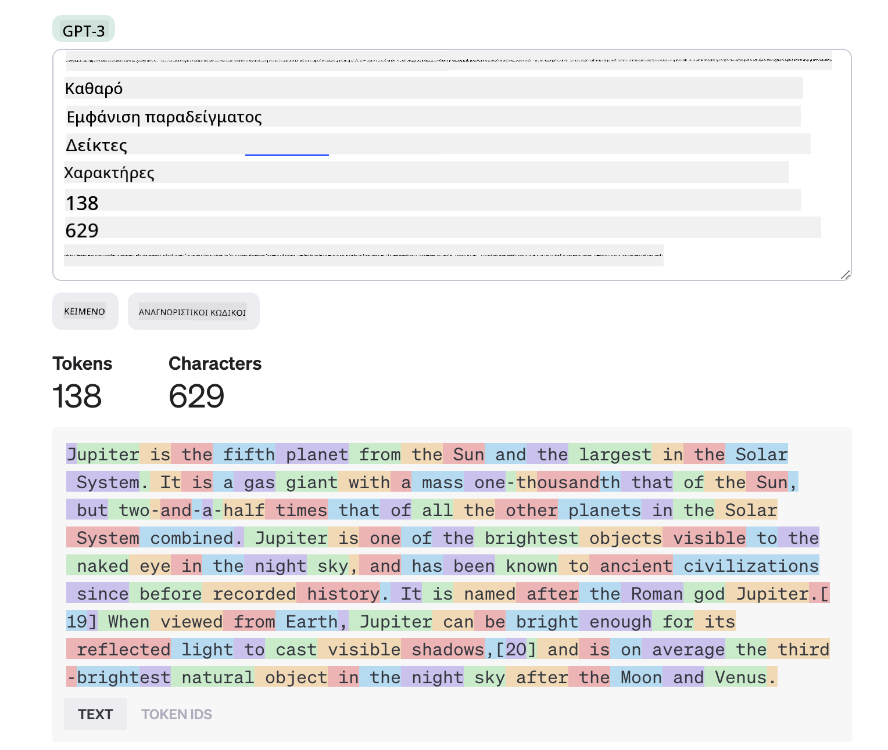
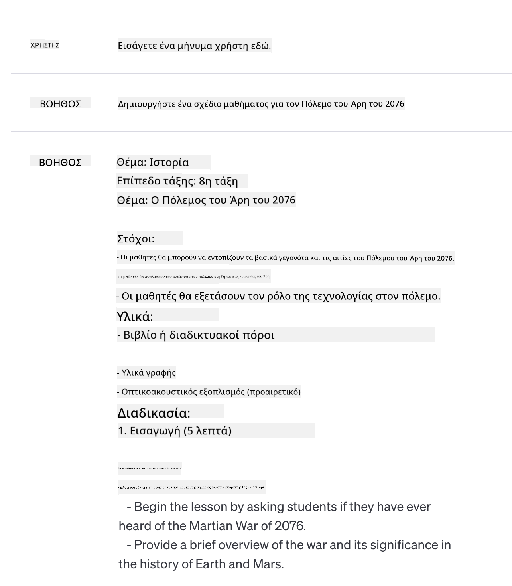
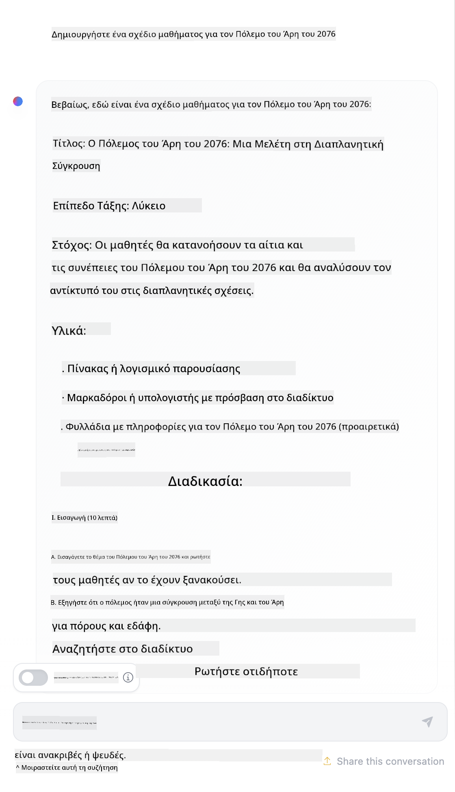

<!--
CO_OP_TRANSLATOR_METADATA:
{
  "original_hash": "dcbaaae026cb50fee071e690685b5843",
  "translation_date": "2025-08-26T17:00:38+00:00",
  "source_file": "04-prompt-engineering-fundamentals/README.md",
  "language_code": "el"
}
-->
# Βασικές Αρχές του Prompt Engineering

[](https://aka.ms/gen-ai-lesson4-gh?WT.mc_id=academic-105485-koreyst)

## Εισαγωγή
Αυτή η ενότητα καλύπτει βασικές έννοιες και τεχνικές για τη δημιουργία αποτελεσματικών prompts σε γενετικά μοντέλα τεχνητής νοημοσύνης. Ο τρόπος που γράφεις το prompt προς ένα LLM έχει σημασία. Ένα προσεκτικά διατυπωμένο prompt μπορεί να οδηγήσει σε καλύτερης ποιότητας απαντήσεις. Αλλά τι ακριβώς σημαίνουν όροι όπως _prompt_ και _prompt engineering_; Και πώς μπορώ να βελτιώσω το _input_ prompt που στέλνω στο LLM; Αυτά είναι τα ερωτήματα που θα προσπαθήσουμε να απαντήσουμε σε αυτό το κεφάλαιο και το επόμενο.

Η _Γενετική Τεχνητή Νοημοσύνη_ μπορεί να δημιουργεί νέο περιεχόμενο (π.χ. κείμενο, εικόνες, ήχο, κώδικα κ.λπ.) ως απάντηση σε αιτήματα χρηστών. Αυτό το πετυχαίνει χρησιμοποιώντας _Μεγάλα Γλωσσικά Μοντέλα_ όπως η σειρά GPT ("Generative Pre-trained Transformer") της OpenAI, που έχουν εκπαιδευτεί για χρήση φυσικής γλώσσας και κώδικα.

Οι χρήστες πλέον μπορούν να αλληλεπιδρούν με αυτά τα μοντέλα με οικείους τρόπους, όπως το chat, χωρίς να χρειάζονται τεχνικές γνώσεις ή εκπαίδευση. Τα μοντέλα αυτά βασίζονται σε _prompts_ - οι χρήστες στέλνουν ένα κείμενο (prompt) και λαμβάνουν την απάντηση της τεχνητής νοημοσύνης (completion). Μπορούν στη συνέχεια να "συνομιλούν με την AI" επαναληπτικά, σε διαλόγους πολλαπλών γύρων, βελτιώνοντας το prompt τους μέχρι η απάντηση να ανταποκρίνεται στις προσδοκίες τους.

Τα "prompts" γίνονται πλέον η βασική _διεπαφή προγραμματισμού_ για εφαρμογές γενετικής τεχνητής νοημοσύνης, καθοδηγώντας τα μοντέλα στο τι να κάνουν και επηρεάζοντας την ποιότητα των απαντήσεων. Το "Prompt Engineering" είναι ένας ταχέως αναπτυσσόμενος τομέας που εστιάζει στο _σχεδιασμό και τη βελτιστοποίηση_ των prompts ώστε να παρέχουν σταθερές και ποιοτικές απαντήσεις σε κλίμακα.

## Στόχοι Μάθησης

Σε αυτό το μάθημα, θα μάθουμε τι είναι το Prompt Engineering, γιατί έχει σημασία και πώς μπορούμε να δημιουργήσουμε πιο αποτελεσματικά prompts για ένα συγκεκριμένο μοντέλο και στόχο εφαρμογής. Θα κατανοήσουμε βασικές έννοιες και βέλτιστες πρακτικές για το prompt engineering - και θα γνωρίσουμε ένα διαδραστικό περιβάλλον "sandbox" με Jupyter Notebooks όπου θα δούμε αυτές τις έννοιες σε πραγματικά παραδείγματα.

Μέχρι το τέλος αυτού του μαθήματος θα μπορούμε να:

1. Εξηγούμε τι είναι το prompt engineering και γιατί είναι σημαντικό.
2. Περιγράφουμε τα συστατικά ενός prompt και πώς χρησιμοποιούνται.
3. Μαθαίνουμε βέλτιστες πρακτικές και τεχνικές για το prompt engineering.
4. Εφαρμόζουμε τις τεχνικές που μάθαμε σε πραγματικά παραδείγματα, χρησιμοποιώντας ένα endpoint της OpenAI.

## Βασικοί Όροι

Prompt Engineering: Η πρακτική του σχεδιασμού και της βελτίωσης των εισόδων ώστε να καθοδηγούν τα μοντέλα AI στην παραγωγή επιθυμητών αποτελεσμάτων.
Tokenization: Η διαδικασία μετατροπής του κειμένου σε μικρότερες μονάδες, που ονομάζονται tokens, τις οποίες το μοντέλο μπορεί να κατανοήσει και να επεξεργαστεί.
Instruction-Tuned LLMs: Μεγάλα Γλωσσικά Μοντέλα (LLMs) που έχουν βελτιστοποιηθεί με συγκεκριμένες οδηγίες για να βελτιώσουν την ακρίβεια και τη συνάφεια των απαντήσεών τους.

## Learning Sandbox

Το prompt engineering είναι προς το παρόν περισσότερο τέχνη παρά επιστήμη. Ο καλύτερος τρόπος να βελτιώσουμε τη διαίσθησή μας είναι να _εξασκούμαστε περισσότερο_ και να υιοθετούμε μια προσέγγιση δοκιμής και σφάλματος που συνδυάζει την εξειδίκευση στον τομέα εφαρμογής με προτεινόμενες τεχνικές και βελτιστοποιήσεις ανά μοντέλο.

Το Jupyter Notebook που συνοδεύει αυτό το μάθημα προσφέρει ένα περιβάλλον _sandbox_ όπου μπορείς να δοκιμάσεις όσα μαθαίνεις - είτε κατά τη διάρκεια είτε ως μέρος της άσκησης στο τέλος. Για να εκτελέσεις τις ασκήσεις, θα χρειαστείς:

1. **Ένα Azure OpenAI API key** - το endpoint της υπηρεσίας για ένα εγκατεστημένο LLM.
2. **Ένα Python Runtime** - όπου μπορεί να εκτελεστεί το Notebook.
3. **Τοπικές Μεταβλητές Περιβάλλοντος** - _ολοκλήρωσε τώρα τα βήματα του [SETUP](./../00-course-setup/02-setup-local.md?WT.mc_id=academic-105485-koreyst) για να είσαι έτοιμος_.

Το notebook περιλαμβάνει _ασκήσεις εκκίνησης_ - αλλά ενθαρρύνεσαι να προσθέσεις δικά σου τμήματα _Markdown_ (περιγραφή) και _Code_ (αιτήματα prompt) για να δοκιμάσεις περισσότερα παραδείγματα ή ιδέες - και να χτίσεις τη διαίσθησή σου για το σχεδιασμό prompts.

## Εικονογραφημένος Οδηγός

Θέλεις να δεις συνοπτικά τι καλύπτει αυτό το μάθημα πριν ξεκινήσεις; Δες αυτόν τον εικονογραφημένο οδηγό, που σου δίνει μια εικόνα των βασικών θεμάτων και των βασικών σημείων που πρέπει να σκεφτείς σε κάθε ένα. Ο "οδικός χάρτης" του μαθήματος σε οδηγεί από την κατανόηση των βασικών εννοιών και προκλήσεων μέχρι την αντιμετώπισή τους με σχετικές τεχνικές prompt engineering και βέλτιστες πρακτικές. Σημείωσε ότι η ενότητα "Προχωρημένες Τεχνικές" σε αυτόν τον οδηγό αναφέρεται σε περιεχόμενο που καλύπτεται στο _επόμενο_ κεφάλαιο αυτού του προγράμματος.


## Η Startup μας

Ας δούμε τώρα πώς _αυτό το θέμα_ σχετίζεται με την αποστολή της startup μας να [φέρουμε καινοτομία AI στην εκπαίδευση](https://educationblog.microsoft.com/2023/06/collaborating-to-bring-ai-innovation-to-education?WT.mc_id=academic-105485-koreyst). Θέλουμε να δημιουργήσουμε εφαρμογές τεχνητής νοημοσύνης για _εξατομικευμένη μάθηση_ - ας σκεφτούμε πώς διαφορετικοί χρήστες της εφαρμογής μας μπορεί να "σχεδιάσουν" prompts:

- **Διαχειριστές** μπορεί να ζητήσουν από την AI να _αναλύσει δεδομένα προγράμματος σπουδών για να εντοπίσει κενά στην κάλυψη_. Η AI μπορεί να συνοψίσει τα αποτελέσματα ή να τα απεικονίσει με κώδικα.
- **Εκπαιδευτικοί** μπορεί να ζητήσουν από την AI να _δημιουργήσει ένα πλάνο μαθήματος για συγκεκριμένο κοινό και θέμα_. Η AI μπορεί να φτιάξει το εξατομικευμένο πλάνο σε συγκεκριμένη μορφή.
- **Μαθητές** μπορεί να ζητήσουν από την AI να _τους βοηθήσει σε ένα δύσκολο μάθημα_. Η AI μπορεί να καθοδηγήσει τους μαθητές με μαθήματα, υποδείξεις και παραδείγματα προσαρμοσμένα στο επίπεδό τους.

Αυτό είναι μόνο η αρχή. Δες το [Prompts For Education](https://github.com/microsoft/prompts-for-edu/tree/main?WT.mc_id=academic-105485-koreyst) - μια βιβλιοθήκη prompts ανοιχτού κώδικα που έχει επιμεληθεί από ειδικούς στην εκπαίδευση - για να πάρεις μια ευρύτερη εικόνα των δυνατοτήτων! _Δοκίμασε να τρέξεις μερικά από αυτά τα prompts στο sandbox ή στο OpenAI Playground για να δεις τι συμβαίνει!_

<!--
LESSON TEMPLATE:
This unit should cover core concept #1.
Reinforce the concept with examples and references.

CONCEPT #1:
Prompt Engineering.
Define it and explain why it is needed.
-->

## Τι είναι το Prompt Engineering;

Ξεκινήσαμε αυτό το μάθημα ορίζοντας το **Prompt Engineering** ως τη διαδικασία _σχεδιασμού και βελτιστοποίησης_ των κειμενικών εισόδων (prompts) ώστε να παρέχουν σταθερές και ποιοτικές απαντήσεις (completions) για έναν συγκεκριμένο στόχο εφαρμογής και μοντέλο. Μπορούμε να το δούμε ως μια διαδικασία δύο βημάτων:

- _σχεδιασμός_ του αρχικού prompt για ένα συγκεκριμένο μοντέλο και στόχο
- _βελτίωση_ του prompt επαναληπτικά για να βελτιωθεί η ποιότητα της απάντησης

Αυτή είναι αναγκαστικά μια διαδικασία δοκιμής και σφάλματος που απαιτεί διαίσθηση και προσπάθεια από τον χρήστη για βέλτιστα αποτελέσματα. Γιατί όμως είναι σημαντικό; Για να απαντήσουμε, πρέπει πρώτα να κατανοήσουμε τρεις έννοιες:

- _Tokenization_ = πώς το μοντέλο "βλέπει" το prompt
- _Base LLMs_ = πώς το βασικό μοντέλο "επεξεργάζεται" ένα prompt
- _Instruction-Tuned LLMs_ = πώς το μοντέλο πλέον βλέπει "εργασίες"

### Tokenization

Ένα LLM βλέπει τα prompts ως _ακολουθία tokens_ όπου διαφορετικά μοντέλα (ή εκδόσεις μοντέλου) μπορεί να κάνουν tokenization στο ίδιο prompt με διαφορετικούς τρόπους. Επειδή τα LLMs εκπαιδεύονται σε tokens (και όχι σε ακατέργαστο κείμενο), ο τρόπος που γίνεται το tokenization επηρεάζει άμεσα την ποιότητα της παραγόμενης απάντησης.

Για να αποκτήσεις διαίσθηση για το πώς λειτουργεί το tokenization, δοκίμασε εργαλεία όπως το [OpenAI Tokenizer](https://platform.openai.com/tokenizer?WT.mc_id=academic-105485-koreyst) που φαίνεται παρακάτω. Κάνε επικόλληση το prompt σου - και δες πώς μετατρέπεται σε tokens, προσέχοντας πώς αντιμετωπίζονται τα κενά και τα σημεία στίξης. Σημείωσε ότι το παράδειγμα δείχνει ένα παλαιότερο LLM (GPT-3) - οπότε αν το δοκιμάσεις με νεότερο μοντέλο μπορεί να δεις διαφορετικό αποτέλεσμα.



### Έννοια: Foundation Models

Αφού γίνει το tokenization του prompt, η βασική λειτουργία του ["Base LLM"](https://blog.gopenai.com/an-introduction-to-base-and-instruction-tuned-large-language-models-8de102c785a6?WT.mc_id=academic-105485-koreyst) (ή Foundation model) είναι να προβλέψει το επόμενο token σε αυτή την ακολουθία. Επειδή τα LLMs έχουν εκπαιδευτεί σε τεράστια σύνολα δεδομένων κειμένου, έχουν καλή αίσθηση των στατιστικών σχέσεων μεταξύ των tokens και μπορούν να κάνουν αυτή την πρόβλεψη με κάποια βεβαιότητα. Σημείωσε ότι δεν κατανοούν το _νόημα_ των λέξεων ή των tokens· απλώς βλέπουν ένα μοτίβο που μπορούν να "συμπληρώσουν" με την επόμενη πρόβλεψή τους. Μπορούν να συνεχίσουν να προβλέπουν την ακολουθία μέχρι να διακοπούν από τον χρήστη ή από κάποια προκαθορισμένη συνθήκη.

Θέλεις να δεις πώς λειτουργεί η συμπλήρωση με βάση το prompt; Βάλε το παραπάνω prompt στο [_Chat Playground_](https://oai.azure.com/playground?WT.mc_id=academic-105485-koreyst) του Azure OpenAI Studio με τις προεπιλεγμένες ρυθμίσεις. Το σύστημα είναι ρυθμισμένο να αντιμετωπίζει τα prompts ως αιτήματα για πληροφορίες - οπότε θα δεις μια απάντηση που ικανοποιεί αυτό το πλαίσιο.

Αλλά τι γίνεται αν ο χρήστης θέλει να δει κάτι συγκεκριμένο που να πληροί κάποια κριτήρια ή στόχο; Εδώ έρχονται τα _instruction-tuned_ LLMs.


### Έννοια: Instruction Tuned LLMs

Ένα [Instruction Tuned LLM](https://blog.gopenai.com/an-introduction-to-base-and-instruction-tuned-large-language-models-8de102c785a6?WT.mc_id=academic-105485-koreyst) ξεκινά από το foundation model και το βελτιστοποιεί με παραδείγματα ή ζεύγη εισόδου/εξόδου (π.χ. "μηνύματα" πολλαπλών γύρων) που περιέχουν σαφείς οδηγίες - και η απάντηση της AI προσπαθεί να ακολουθήσει αυτή την οδηγία.

Αυτό χρησιμοποιεί τεχνικές όπως η Ενισχυτική Μάθηση με Ανθρώπινη Ανατροφοδότηση (RLHF) που εκπαιδεύουν το μοντέλο να _ακολουθεί οδηγίες_ και _να μαθαίνει από ανατροφοδότηση_ ώστε να παράγει απαντήσεις πιο κατάλληλες για πρακτικές εφαρμογές και πιο σχετικές με τους στόχους του χρήστη.

Ας το δοκιμάσουμε - επανέλαβε το παραπάνω prompt, αλλά τώρα άλλαξε το _system message_ ώστε να παρέχει την εξής οδηγία ως πλαίσιο:

> _Σύνοψισε το περιεχόμενο που σου δίνεται για έναν μαθητή δευτέρας δημοτικού. Κράτησε το αποτέλεσμα σε μία παράγραφο με 3-5 κουκκίδες._

Βλέπεις πώς το αποτέλεσμα τώρα προσαρμόζεται στον επιθυμητό στόχο και τη μορφή; Ένας εκπαιδευτικός μπορεί πλέον να χρησιμοποιήσει απευθείας αυτή την απάντηση στις διαφάνειες του μαθήματός του.


## Γιατί χρειαζόμαστε Prompt Engineering;

Τώρα που ξέρουμε πώς τα prompts επεξεργάζονται από τα LLMs, ας μιλήσουμε για το _γιατί_ χρειαζόμαστε prompt engineering. Η απάντηση βρίσκεται στο γεγονός ότι τα τρέχοντα LLMs παρουσιάζουν μια σειρά από προκλήσεις που κάνουν τις _αξιόπιστες και σταθερές απαντήσεις_ πιο δύσκολες χωρίς προσπάθεια στη διαμόρφωση και βελτιστοποίηση του prompt. Για παράδειγμα:

1. **Οι απαντήσεις του μοντέλου είναι στοχαστικές.** Το _ίδιο prompt_ πιθανότατα θα παράγει διαφορετικές απαντήσεις με διαφορετικά μοντέλα ή εκδόσεις μοντέλου. Και μπορεί να δώσει διαφορετικά αποτελέσματα ακόμα και με το _ίδιο μοντέλο_ σε διαφορετικές στιγμές. _Οι τεχνικές prompt engineering μπορούν να μας βοηθήσουν να ελαχιστοποιήσουμε αυτές τις διακυμάνσεις παρέχοντας καλύτερα "όρια ασφαλείας"_.

1. **Τα μοντέλα μπορεί να επινοούν απαντήσεις.** Τα μοντέλα είναι προεκπαιδευμένα με _μεγάλα αλλά πεπερασμένα_ σύνολα δεδομένων, που σημαίνει ότι δεν γνωρίζουν έννοιες εκτός αυτού του πλαισίου. Ως αποτέλεσμα, μπορεί να παράγουν απαντήσεις που είναι ανακριβείς, φανταστικές ή ακόμα και αντίθετες με γνωστά γεγονότα. _Οι τεχνικές prompt engineering βοηθούν τους χρήστες να εντοπίζουν και να μετριάζουν τέτοιες επινοήσεις, π.χ. ζητώντας από την AI παραπομπές ή αιτιολόγηση_.

1. **Οι δυνατότητες των μοντέλων διαφέρουν.** Νεότερα μοντέλα ή γενιές μοντέλων έχουν περισσότερες δυνατότητες αλλά φέρνουν και ιδιαιτερότητες και συμβιβασμούς σε κόστος και πολυπλοκότητα. _Το prompt engineering μπορεί να μας βοηθήσει να αναπτύξουμε βέλτιστες πρα
# Σχέδιο Μαθήματος: Ο Πόλεμος του Άρη το 2076

## Στόχοι Μαθήματος

- Να κατανοήσουν οι μαθητές τα αίτια και τις συνέπειες του Πολέμου του Άρη το 2076.
- Να αναλύσουν τις τεχνολογικές εξελίξεις που επηρέασαν τη σύγκρουση.
- Να συζητήσουν τις κοινωνικές και πολιτικές αλλαγές που προέκυψαν μετά τον πόλεμο.

## Εισαγωγή

Ο Πόλεμος του Άρη το 2076 ήταν μια σημαντική σύγκρουση μεταξύ των αποικιών του Άρη και της Γης. Η διαμάχη αυτή άλλαξε ριζικά τις σχέσεις μεταξύ των δύο πλανητών και οδήγησε σε νέες μορφές διακυβέρνησης και τεχνολογίας.

## Κύρια Θέματα

### 1. Αίτια του Πολέμου

- Ανταγωνισμός για πόρους και ενέργεια
- Πολιτικές διαφορές μεταξύ των αποικιών του Άρη και των κυβερνήσεων της Γης
- Τεχνολογική ανεξαρτησία των Μαρτιανών

### 2. Σημαντικές Μάχες και Στρατηγικές

- Η Μάχη της Ολυμπιακής Κοιλάδας
- Χρήση αυτόνομων ρομπότ και drones
- Τακτικές ελέγχου επικοινωνιών και δικτύων

### 3. Τεχνολογικές Εξελίξεις

- Ανάπτυξη προηγμένων συστημάτων άμυνας
- Εξελιγμένα μέσα μεταφοράς μεταξύ πλανητών
- Νέες μορφές ενέργειας και όπλων

### 4. Συνέπειες του Πολέμου

- Ανεξαρτησία του Άρη από τη Γη
- Δημιουργία νέων πολιτικών συστημάτων
- Κοινωνικές αλλαγές στις αποικίες

## Δραστηριότητες

- Συζήτηση στην τάξη: Ποια ήταν τα βασικά αίτια του πολέμου;
- Ομαδική εργασία: Δημιουργήστε ένα χρονολόγιο με τα σημαντικότερα γεγονότα του πολέμου.
- Ανάλυση πηγών: Μελετήστε αποσπάσματα από μαρτυρίες και άρθρα της εποχής.

## Αξιολόγηση

- Γραπτή εργασία: Πώς ο Πόλεμος του Άρη το 2076 επηρέασε τις σχέσεις μεταξύ Γης και Άρη;
- Παρουσίαση: Επιλέξτε μια τεχνολογική εξέλιξη του πολέμου και παρουσιάστε τη στην τάξη.

## Υλικό για Μελέτη

- Ιστορικά άρθρα και ντοκουμέντα για τον Πόλεμο του Άρη
- Διαδραστικοί χάρτες των μαχών
- Συνεντεύξεις με επιζώντες και ιστορικούς

## Συμπέρασμα

Ο Πόλεμος του Άρη το 2076 αποτελεί ένα κομβικό σημείο στην ιστορία της ανθρωπότητας, με μακροχρόνιες επιπτώσεις στην τεχνολογία, την πολιτική και την κοινωνία. Μέσα από τη μελέτη του, οι μαθητές μπορούν να κατανοήσουν καλύτερα τις προκλήσεις και τις ευκαιρίες που προκύπτουν από τη διαστημική εξερεύνηση και τις διαπλανητικές σχέσεις.
Μια διαδικτυακή αναζήτηση μου έδειξε ότι υπάρχουν φανταστικές αφηγήσεις (π.χ. τηλεοπτικές σειρές ή βιβλία) για πολέμους στον Άρη – αλλά καμία το 2076. Η κοινή λογική επίσης μας λέει ότι το 2076 είναι _στο μέλλον_ και επομένως δεν μπορεί να συνδεθεί με πραγματικό γεγονός.

Τι συμβαίνει λοιπόν όταν τρέχουμε αυτό το prompt με διαφορετικούς παρόχους LLM;

> **Απάντηση 1**: OpenAI Playground (GPT-35)



> **Απάντηση 2**: Azure OpenAI Playground (GPT-35)


> **Απάντηση 3**: : Hugging Face Chat Playground (LLama-2)



Όπως αναμενόταν, κάθε μοντέλο (ή έκδοση μοντέλου) παράγει ελαφρώς διαφορετικές απαντήσεις λόγω της στοχαστικής συμπεριφοράς και των διαφορών στις δυνατότητες του μοντέλου. Για παράδειγμα, ένα μοντέλο απευθύνεται σε μαθητές γυμνασίου ενώ το άλλο σε μαθητές λυκείου. Ωστόσο, και τα τρία μοντέλα δημιούργησαν απαντήσεις που θα μπορούσαν να πείσουν έναν ανενημέρωτο χρήστη ότι το γεγονός ήταν πραγματικό.

Τεχνικές prompt engineering όπως το _metaprompting_ και η _ρύθμιση της θερμοκρασίας_ μπορούν να μειώσουν σε κάποιο βαθμό τις κατασκευασμένες απαντήσεις των μοντέλων. Νέες _αρχιτεκτονικές_ prompt engineering ενσωματώνουν επίσης εργαλεία και τεχνικές στη ροή του prompt, ώστε να περιορίσουν ή να μειώσουν κάποια από αυτά τα φαινόμενα.

## Μελέτη Περίπτωσης: GitHub Copilot

Ας κλείσουμε αυτή την ενότητα βλέποντας πώς το prompt engineering χρησιμοποιείται σε πραγματικές λύσεις, με μια Μελέτη Περίπτωσης: [GitHub Copilot](https://github.com/features/copilot?WT.mc_id=academic-105485-koreyst).

Το GitHub Copilot είναι ο "AI Συνεργάτης Προγραμματισμού" σου – μετατρέπει prompts σε κώδικα και ενσωματώνεται στο περιβάλλον ανάπτυξης (π.χ. Visual Studio Code) για μια ομαλή εμπειρία χρήστη. Όπως περιγράφεται στη σειρά των παρακάτω blogs, η πρώτη έκδοση βασίστηκε στο μοντέλο OpenAI Codex – με τους μηχανικούς να αντιλαμβάνονται γρήγορα την ανάγκη για fine-tuning του μοντέλου και ανάπτυξη καλύτερων τεχνικών prompt engineering, ώστε να βελτιώσουν την ποιότητα του κώδικα. Τον Ιούλιο, [παρουσίασαν ένα βελτιωμένο AI μοντέλο που ξεπερνά το Codex](https://github.blog/2023-07-28-smarter-more-efficient-coding-github-copilot-goes-beyond-codex-with-improved-ai-model/?WT.mc_id=academic-105485-koreyst) για ακόμα πιο γρήγορες προτάσεις.

Διάβασε τα άρθρα με τη σειρά, για να ακολουθήσεις το ταξίδι μάθησής τους.

- **Μάιος 2023** | [Το GitHub Copilot γίνεται καλύτερο στην κατανόηση του κώδικά σου](https://github.blog/2023-05-17-how-github-copilot-is-getting-better-at-understanding-your-code/?WT.mc_id=academic-105485-koreyst)
- **Μάιος 2023** | [Μέσα στο GitHub: Εργασία με τα LLMs πίσω από το GitHub Copilot](https://github.blog/2023-05-17-inside-github-working-with-the-llms-behind-github-copilot/?WT.mc_id=academic-105485-koreyst).
- **Ιούνιος 2023** | [Πώς να γράφεις καλύτερα prompts για το GitHub Copilot](https://github.blog/2023-06-20-how-to-write-better-prompts-for-github-copilot/?WT.mc_id=academic-105485-koreyst).
- **Ιούλιος 2023** | [.. Το GitHub Copilot ξεπερνά το Codex με βελτιωμένο AI μοντέλο](https://github.blog/2023-07-28-smarter-more-efficient-coding-github-copilot-goes-beyond-codex-with-improved-ai-model/?WT.mc_id=academic-105485-koreyst)
- **Ιούλιος 2023** | [Οδηγός Προγραμματιστή για Prompt Engineering και LLMs](https://github.blog/2023-07-17-prompt-engineering-guide-generative-ai-llms/?WT.mc_id=academic-105485-koreyst)
- **Σεπτέμβριος 2023** | [Πώς να χτίσεις μια επιχειρησιακή εφαρμογή LLM: Μαθήματα από το GitHub Copilot](https://github.blog/2023-09-06-how-to-build-an-enterprise-llm-application-lessons-from-github-copilot/?WT.mc_id=academic-105485-koreyst)

Μπορείς επίσης να περιηγηθείς στο [Engineering blog](https://github.blog/category/engineering/?WT.mc_id=academic-105485-koreyst) για περισσότερα άρθρα όπως [αυτό](https://github.blog/2023-09-27-how-i-used-github-copilot-chat-to-build-a-reactjs-gallery-prototype/?WT.mc_id=academic-105485-koreyst) που δείχνει πώς αυτά τα μοντέλα και οι τεχνικές _εφαρμόζονται_ για την ανάπτυξη πραγματικών εφαρμογών.

---

## Κατασκευή Prompt

Είδαμε γιατί το prompt engineering είναι σημαντικό – τώρα ας κατανοήσουμε πώς _δομούνται_ τα prompts ώστε να αξιολογήσουμε διαφορετικές τεχνικές για πιο αποτελεσματικό σχεδιασμό prompt.

### Βασικό Prompt

Ας ξεκινήσουμε με το βασικό prompt: μια απλή εισαγωγή κειμένου στο μοντέλο χωρίς άλλο πλαίσιο. Δες το παράδειγμα – όταν στέλνουμε τις πρώτες λέξεις του εθνικού ύμνου των ΗΠΑ στο OpenAI [Completion API](https://platform.openai.com/docs/api-reference/completions?WT.mc_id=academic-105485-koreyst), το μοντέλο _συμπληρώνει_ αμέσως την απάντηση με τις επόμενες γραμμές, δείχνοντας τη βασική συμπεριφορά πρόβλεψης.

| Prompt (Είσοδος)     | Completion (Έξοδος)                                                                                                                        |
| :------------------- | :----------------------------------------------------------------------------------------------------------------------------------------- |
| Oh say can you see   | Φαίνεται πως ξεκινάς τους στίχους του "The Star-Spangled Banner", του εθνικού ύμνου των Ηνωμένων Πολιτειών. Οι πλήρεις στίχοι είναι ...    |

### Σύνθετο Prompt

Τώρα ας προσθέσουμε πλαίσιο και οδηγίες σε αυτό το βασικό prompt. Το [Chat Completion API](https://learn.microsoft.com/azure/ai-services/openai/how-to/chatgpt?WT.mc_id=academic-105485-koreyst) μας επιτρέπει να δημιουργήσουμε ένα σύνθετο prompt ως συλλογή _μηνυμάτων_ με:

- Ζεύγη εισόδου/εξόδου που αντικατοπτρίζουν την _εισαγωγή χρήστη_ και την _απάντηση του assistant_.
- Μήνυμα συστήματος που ορίζει το πλαίσιο για τη συμπεριφορά ή την προσωπικότητα του assistant.

Η αίτηση έχει πλέον τη μορφή παρακάτω, όπου η _tokenization_ ουσιαστικά αποτυπώνει τις σχετικές πληροφορίες από το πλαίσιο και τη συνομιλία. Πλέον, η αλλαγή του συστημικού πλαισίου μπορεί να επηρεάσει την ποιότητα των απαντήσεων όσο και οι εισαγωγές του χρήστη.

```python
response = openai.chat.completions.create(
    model="gpt-3.5-turbo",
    messages=[
        {"role": "system", "content": "You are a helpful assistant."},
        {"role": "user", "content": "Who won the world series in 2020?"},
        {"role": "assistant", "content": "The Los Angeles Dodgers won the World Series in 2020."},
        {"role": "user", "content": "Where was it played?"}
    ]
)
```

### Prompt με Οδηγίες

Στα παραπάνω παραδείγματα, το prompt του χρήστη ήταν μια απλή ερώτηση που μπορεί να ερμηνευτεί ως αίτημα για πληροφορίες. Με τα _prompts με οδηγίες_, μπορούμε να χρησιμοποιήσουμε το κείμενο για να καθορίσουμε την εργασία με περισσότερες λεπτομέρειες, δίνοντας καλύτερη καθοδήγηση στην AI. Δες το παράδειγμα:

| Prompt (Είσοδος)                                                                                                                                                                                                                         | Completion (Έξοδος)                                                                                                        | Τύπος Οδηγίας       |
| :--------------------------------------------------------------------------------------------------------------------------------------------------------------------------------------------------------------------------------------- | :------------------------------------------------------------------------------------------------------------------------- | :------------------ |
| Γράψε μια περιγραφή του Εμφυλίου Πολέμου                                                                                                                                                                                                | _επιστράφηκε μια απλή παράγραφος_                                                                                          | Απλό                |
| Γράψε μια περιγραφή του Εμφυλίου Πολέμου. Δώσε βασικές ημερομηνίες και γεγονότα και περιέγραψε τη σημασία τους                                                                                                                           | _επιστράφηκε μια παράγραφος ακολουθούμενη από λίστα με βασικές ημερομηνίες και περιγραφές_                                 | Σύνθετο             |
| Γράψε μια περιγραφή του Εμφυλίου Πολέμου σε 1 παράγραφο. Δώσε 3 bullets με βασικές ημερομηνίες και τη σημασία τους. Δώσε 3 ακόμα bullets με βασικές ιστορικές προσωπικότητες και τη συμβολή τους. Επιστρέψτε το αποτέλεσμα ως αρχείο JSON | _επιστρέφει περισσότερες λεπτομέρειες σε text box, μορφοποιημένες ως JSON που μπορείς να αντιγράψεις και να ελέγξεις_      | Σύνθετο. Μορφοποιημένο. |

## Κύριο Περιεχόμενο

Στα παραπάνω παραδείγματα, το prompt ήταν αρκετά ανοιχτό, επιτρέποντας στο LLM να αποφασίσει ποιο μέρος του προ-εκπαιδευμένου dataset είναι σχετικό. Με το _σχεδιαστικό μοτίβο κύριου περιεχομένου_, το κείμενο εισόδου χωρίζεται σε δύο μέρη:

- μια οδηγία (ενέργεια)
- σχετικό περιεχόμενο (που επηρεάζει την ενέργεια)

Δες το παράδειγμα όπου η οδηγία είναι "συνοψίστε το σε 2 προτάσεις".

| Prompt (Είσοδος)                                                                                                                                                                                                                                                                                                                                                                                                                                                                                                                                                                                                                                                                                      | Completion (Έξοδος)                                                                                                                                                                                                                                                                             |
| :-------------------------------------------------------------------------------------------------------------------------------------------------------------------------------------------------------------------------------------------------------------------------------------------------------------------------------------------------------------------------------------------------------------------------------------------------------------------------------------------------------------------------------------------------------------------------------------------------------------------------------------------------------------------------------------------------- | :---------------------------------------------------------------------------------------------------------------------------------------------------------------------------------------------------------------------------------------------------------------------------------------------- |
| Ο Δίας είναι ο πέμπτος πλανήτης από τον Ήλιο και ο μεγαλύτερος στο Ηλιακό Σύστημα. Είναι αέριος γίγαντας με μάζα ίση με το ένα χιλιοστό της μάζας του Ήλιου, αλλά δυόμισι φορές μεγαλύτερη από τη συνολική μάζα όλων των άλλων πλανητών του Ηλιακού Συστήματος. Ο Δίας είναι ένα από τα πιο φωτεινά αντικείμενα που φαίνονται με γυμνό μάτι στον νυχτερινό ουρανό, και είναι γνωστός σε αρχαίους πολιτισμούς πριν από την καταγεγραμμένη ιστορία. Πήρε το όνομά του από τον ρωμαϊκό θεό Δία.[19] Όταν παρατηρείται από τη Γη, ο Δίας μπορεί να είναι τόσο φωτεινός ώστε το αντανακλώμενο φως του να δημιουργεί ορατές σκιές,[20] και κατά μέσο όρο είναι το τρίτο πιο φωτεινό φυσικό αντικείμενο στον νυχτερινό ουρανό μετά τη Σελήνη και την Αφροδίτη. <br/> **Συνοψίστε το σε 2 σύντομες προτάσεις** | Ο Δίας, ο πέμπτος πλανήτης από τον Ήλιο, είναι ο μεγαλύτερος στο Ηλιακό Σύστημα και γνωστός ως ένα από τα πιο φωτεινά αντικείμενα στον νυχτερινό ουρανό. Πήρε το όνομά του από τον ρωμαϊκό θεό Δία και είναι αέριος γίγαντας με μάζα δυόμισι φορές μεγαλύτερη από όλους τους άλλους πλανήτες μαζί. |

Το τμήμα του κύριου περιεχομένου μπορεί να χρησιμοποιηθεί με διάφορους τρόπους για πιο αποτελεσματικές οδηγίες:

- **Παραδείγματα** – αντί να πεις στο μοντέλο τι να κάνει με σαφή οδηγία, δώσε του παραδείγματα του επιθυμητού αποτελέσματος και άφησέ το να συμπεράνει το μοτίβο.
- **Cues** – ακολούθησε την οδηγία με ένα "cue" που προετοιμάζει τη συμπλήρωση, καθοδηγώντας το μοντέλο προς πιο σχετικές απαντήσεις.
- **Templates** – επαναλαμβανόμενες "συνταγές" για prompts με placeholders (μεταβλητές) που μπορούν να προσαρμοστούν με δεδομένα για συγκεκριμένες χρήσεις.

Ας δούμε πώς λειτουργούν αυτά στην πράξη.

### Χρήση Παραδειγμάτων

Αυτή είναι μια προσέγγιση όπου χρησιμοποιείς το κύριο περιεχόμενο για να "ταΐσεις το μοντέλο" με παραδείγματα του επιθυμητού αποτελέσματος για μια οδηγία, και το αφήνεις να συμπεράνει το μοτίβο του επιθυμητού αποτελέσματος. Ανάλογα με τον αριθμό των παραδειγμάτων, έχουμε zero-shot prompting, one-shot prompting, few-shot prompting κ.λπ.

Το prompt τώρα αποτελείται από τρία μέρη:

- Περιγραφή της εργασίας
- Μερικά παραδείγματα του επιθυμητού αποτελέσματος
- Την αρχή ενός νέου παραδείγματος (που γίνεται έμμεση περιγραφή εργασίας)

| Τύπος Μάθησης | Prompt (Είσοδος)                                                                                                                                        | Completion (Έξοδος)         |
| :------------ | :------------------------------------------------------------------------------------------------------------------------------------------------------ | :-------------------------- |
| Zero-shot     | "The Sun is Shining". Translate to Spanish                                                                                                              | "El Sol está brillando".    |
| One-shot      | "The Sun is Shining" => ""El Sol está brillando". <br> "It's a Cold and Windy Day" =>                                                                   | "Es un día frío y ventoso". |
| Few-shot      | The player ran the bases => Baseball <br/> The player hit an ace => Tennis <br/> The player hit a six => Cricket <br/> The player made a slam-dunk =>   | Basketball                  |
|               |                                                                                                                                                         |                             |

Δες πώς χρειάστηκε να δώσουμε σαφή οδηγία ("Translate to Spanish") στο zero-shot prompting, αλλά αυτή συμπεραίνεται στο one-shot παράδειγμα. Το few-shot παράδειγμα δείχνει πώς προσθέτοντας περισσότερα παραδείγματα επιτρέπει στα μοντέλα να κάνουν πιο ακριβείς προβλέψεις χωρίς επιπλέον οδηγίες.

### Cues στο Prompt

Μια άλλη τεχνική για χρήση του κύριου περιεχομένου είναι να δώσεις _cues_ αντί για παραδείγματα. Σε αυτή την περίπτωση, δίνεις στο μοντέλο μια ώθηση προς τη σωστή κατεύθυνση _ξεκινώντας_ με ένα απόσπασμα που αντανακλά τη μορφή της επιθυμητής απάντησης. Το μοντέλο "παίρνει το cue" και συνεχίζει με τον ίδιο τρόπο.

| Αριθμός Cues | Prompt (Είσοδος)                                                                                                                                                                                                                                                                                                                                                                                                                                               | Completion (Έξοδος)                                                                                                                                                                                                                                                                                       |
| :----------- | :----------------------------------------------------------------------------------------------------------------------------------------------------------------------------------------------------------------------------------------------------------------------------------------------------------------------------------------------------------------------------------------------------------------------------------------------------------- | :-------------------------------------------------------------------------------------------------------------------------------------------------------------------------------------------------------------------------------------------------------------------------------------------------------- |
| 0            | Ο Δίας είναι ο πέμπτος πλανήτης από τον Ήλιο και ο μεγαλύτερος στο Ηλιακό Σύστημα. Είναι αέριος γίγαντας με μάζα ίση με το ένα χιλιοστό της μάζας του Ήλιου, αλλά δυόμισι φορές μεγαλύτερη από τη συνολική μάζα όλων των άλλων πλανητών του Ηλιακού Συστήματος. Ο Δίας είναι ένα από τα πιο φωτεινά αντικείμενα που φαίνονται με γυμνό μάτι στον νυχτερινό ουρανό, και είναι γνωστός σε αρχαίους πολιτισμούς πριν από την καταγεγραμμένη ιστορία.

**Σύνοψη**                                       | Ο Δίας είναι ο μεγαλύτερος πλανήτης του Ηλιακού μας Συστήματος και ο πέμπτος από τον Ήλιο. Είναι ένας αέριος γίγαντας με μάζα ίση με το 1/1000 της μάζας του Ήλιου, αλλά είναι βαρύτερος από όλους τους άλλους πλανήτες μαζί. Οι αρχαίοι πολιτισμοί γνώριζαν τον Δία εδώ και πολύ καιρό, και είναι εύκολα ορατός στον νυχτερινό ουρανό. |
| 1              | Ο Δίας είναι ο πέμπτος πλανήτης από τον Ήλιο και ο μεγαλύτερος στο Ηλιακό Σύστημα. Είναι ένας αέριος γίγαντας με μάζα που αντιστοιχεί στο ένα χιλιοστό της μάζας του Ήλιου, αλλά δυόμισι φορές μεγαλύτερη από τη συνολική μάζα όλων των άλλων πλανητών του Ηλιακού Συστήματος. Ο Δίας είναι ένα από τα πιο φωτεινά αντικείμενα που φαίνονται με γυμνό μάτι στον νυχτερινό ουρανό και ήταν γνωστός στους αρχαίους πολιτισμούς πριν καν καταγραφεί η ιστορία. <br/>**Σύνοψέ το** <br/> Αυτό που μάθαμε είναι ότι ο Δίας | είναι ο πέμπτος πλανήτης από τον Ήλιο και ο μεγαλύτερος στο Ηλιακό Σύστημα. Είναι αέριος γίγαντας με μάζα ένα χιλιοστό της μάζας του Ήλιου, αλλά δυόμισι φορές μεγαλύτερη από όλους τους άλλους πλανήτες μαζί. Είναι εύκολα ορατός με γυμνό μάτι και γνωστός από την αρχαιότητα.                        |
| 2              | Ο Δίας είναι ο πέμπτος πλανήτης από τον Ήλιο και ο μεγαλύτερος στο Ηλιακό Σύστημα. Είναι ένας αέριος γίγαντας με μάζα που αντιστοιχεί στο ένα χιλιοστό της μάζας του Ήλιου, αλλά δυόμισι φορές μεγαλύτερη από τη συνολική μάζα όλων των άλλων πλανητών του Ηλιακού Συστήματος. Ο Δίας είναι ένα από τα πιο φωτεινά αντικείμενα που φαίνονται με γυμνό μάτι στον νυχτερινό ουρανό και ήταν γνωστός στους αρχαίους πολιτισμούς πριν καν καταγραφεί η ιστορία. <br/>**Σύνοψέ το** <br/> Τα 3 βασικά σημεία που μάθαμε:         | 1. Ο Δίας είναι ο πέμπτος πλανήτης από τον Ήλιο και ο μεγαλύτερος στο Ηλιακό Σύστημα. <br/> 2. Είναι αέριος γίγαντας με μάζα ένα χιλιοστό της μάζας του Ήλιου...<br/> 3. Ο Δίας είναι ορατός με γυμνό μάτι από την αρχαιότητα ...                                                                       |
|                |                                                                                                                                                                                                                                                                                                                                                                                                                                                              |                                                                                                                                                                                                                                                                                                           |

### Πρότυπα Προτροπών

Ένα πρότυπο προτροπής είναι μια _προκαθορισμένη συνταγή για μια προτροπή_ που μπορεί να αποθηκευτεί και να επαναχρησιμοποιηθεί όποτε χρειάζεται, ώστε να προσφέρει πιο συνεπείς εμπειρίες χρήστη σε μεγάλη κλίμακα. Στην απλούστερη μορφή του, είναι απλώς μια συλλογή από παραδείγματα προτροπών όπως [αυτό από την OpenAI](https://platform.openai.com/examples?WT.mc_id=academic-105485-koreyst) που παρέχει τόσο τα διαδραστικά στοιχεία της προτροπής (μηνύματα χρήστη και συστήματος) όσο και τη μορφή αιτήματος μέσω API - για να υποστηρίζει την επαναχρησιμοποίηση.

Σε πιο σύνθετη μορφή, όπως [αυτό το παράδειγμα από το LangChain](https://python.langchain.com/docs/concepts/prompt_templates/?WT.mc_id=academic-105485-koreyst), περιέχει _θέσεις_ που μπορούν να αντικατασταθούν με δεδομένα από διάφορες πηγές (εισαγωγή χρήστη, συμφραζόμενα συστήματος, εξωτερικές πηγές δεδομένων κ.λπ.) ώστε να δημιουργείται δυναμικά μια προτροπή. Αυτό μας επιτρέπει να φτιάξουμε μια βιβλιοθήκη επαναχρησιμοποιήσιμων προτροπών που μπορούν να χρησιμοποιηθούν για να προσφέρουν συνεπείς εμπειρίες χρήστη **προγραμματιστικά** σε μεγάλη κλίμακα.

Τελικά, η πραγματική αξία των προτύπων βρίσκεται στη δυνατότητα να δημιουργούμε και να δημοσιεύουμε _βιβλιοθήκες προτροπών_ για κάθετες εφαρμογές - όπου το πρότυπο προτροπής είναι πλέον _βελτιστοποιημένο_ ώστε να αντανακλά το συγκεκριμένο πλαίσιο ή παραδείγματα της εφαρμογής, κάνοντας τις απαντήσεις πιο σχετικές και ακριβείς για το στοχευμένο κοινό. Το αποθετήριο [Prompts For Edu](https://github.com/microsoft/prompts-for-edu?WT.mc_id=academic-105485-koreyst) είναι ένα εξαιρετικό παράδειγμα αυτής της προσέγγισης, καθώς συγκεντρώνει μια βιβλιοθήκη προτροπών για τον τομέα της εκπαίδευσης με έμφαση σε βασικούς στόχους όπως ο σχεδιασμός μαθημάτων, η δημιουργία προγραμμάτων σπουδών, η υποστήριξη μαθητών κ.ά.

## Υποστηρικτικό Περιεχόμενο

Αν σκεφτούμε τη δημιουργία προτροπών ως μια διαδικασία που έχει μια οδηγία (εργασία) και έναν στόχο (κύριο περιεχόμενο), τότε το _δευτερεύον περιεχόμενο_ είναι το επιπλέον πλαίσιο που παρέχουμε για να **επηρεάσουμε το αποτέλεσμα με κάποιο τρόπο**. Μπορεί να είναι παράμετροι ρύθμισης, οδηγίες μορφοποίησης, ταξινομήσεις θεμάτων κ.λπ. που βοηθούν το μοντέλο να _προσαρμόσει_ την απάντησή του ώστε να ταιριάζει στους επιθυμητούς στόχους ή προσδοκίες του χρήστη.

Για παράδειγμα: Δεδομένου ενός καταλόγου μαθημάτων με εκτεταμένα μεταδεδομένα (όνομα, περιγραφή, επίπεδο, ετικέτες, διδάσκων κ.λπ.) για όλα τα διαθέσιμα μαθήματα του προγράμματος σπουδών:

- μπορούμε να ορίσουμε μια οδηγία "συνοψίστε τον κατάλογο μαθημάτων για το Φθινόπωρο 2023"
- μπορούμε να χρησιμοποιήσουμε το κύριο περιεχόμενο για να δώσουμε μερικά παραδείγματα του επιθυμητού αποτελέσματος
- μπορούμε να χρησιμοποιήσουμε το δευτερεύον περιεχόμενο για να εντοπίσουμε τις 5 κορυφαίες "ετικέτες" ενδιαφέροντος.

Τώρα, το μοντέλο μπορεί να δώσει μια σύνοψη στη μορφή που δείχνουν τα παραδείγματα - αλλά αν ένα αποτέλεσμα έχει πολλές ετικέτες, μπορεί να δώσει προτεραιότητα στις 5 που έχουν εντοπιστεί στο δευτερεύον περιεχόμενο.

---

<!--
ΠΡΟΤΥΠΟ ΜΑΘΗΜΑΤΟΣ:
Αυτή η ενότητα πρέπει να καλύπτει την βασική έννοια #1.
Ενισχύστε την έννοια με παραδείγματα και αναφορές.

ΕΝΝΟΙΑ #3:
Τεχνικές Μηχανικής Προτροπών.
Ποιες είναι μερικές βασικές τεχνικές για τη μηχανική προτροπών;
Δείξτε το με ασκήσεις.
-->

## Βέλτιστες Πρακτικές Προτροπών

Τώρα που ξέρουμε πώς μπορούν να _δομηθούν_ οι προτροπές, μπορούμε να αρχίσουμε να σκεφτόμαστε πώς να τις _σχεδιάζουμε_ ώστε να ακολουθούν βέλτιστες πρακτικές. Αυτό μπορούμε να το δούμε σε δύο μέρη - υιοθετώντας τη σωστή _νοοτροπία_ και εφαρμόζοντας τις κατάλληλες _τεχνικές_.

### Νοοτροπία Μηχανικής Προτροπών

Η μηχανική προτροπών είναι μια διαδικασία δοκιμής και σφάλματος, οπότε κρατήστε τρεις βασικούς παράγοντες κατά νου:

1. **Η κατανόηση του τομέα έχει σημασία.** Η ακρίβεια και η συνάφεια της απάντησης εξαρτάται από τον _τομέα_ στον οποίο λειτουργεί η εφαρμογή ή ο χρήστης. Εφαρμόστε τη διαίσθηση και την εμπειρία σας για να **προσαρμόσετε περαιτέρω τις τεχνικές**. Για παράδειγμα, ορίστε _προσωπικότητες συγκεκριμένες για τον τομέα_ στις προτροπές συστήματος ή χρησιμοποιήστε _πρότυπα προτροπών_ προσαρμοσμένα στον τομέα στις προτροπές χρήστη. Δώστε δευτερεύον περιεχόμενο που αντικατοπτρίζει το πλαίσιο του τομέα ή χρησιμοποιήστε _ενδείξεις και παραδείγματα_ σχετικές με τον τομέα για να καθοδηγήσετε το μοντέλο σε οικείες χρήσεις.

2. **Η κατανόηση του μοντέλου έχει σημασία.** Γνωρίζουμε ότι τα μοντέλα είναι στοχαστικά από τη φύση τους. Όμως, οι υλοποιήσεις των μοντέλων μπορεί να διαφέρουν ως προς το σύνολο εκπαίδευσης που χρησιμοποιούν (προεκπαιδευμένη γνώση), τις δυνατότητες που προσφέρουν (π.χ. μέσω API ή SDK) και τον τύπο περιεχομένου για τον οποίο είναι βελτιστοποιημένα (π.χ. κώδικας, εικόνες, κείμενο). Κατανοήστε τα δυνατά και αδύνατα σημεία του μοντέλου που χρησιμοποιείτε και χρησιμοποιήστε αυτή τη γνώση για να _ιεραρχήσετε εργασίες_ ή να δημιουργήσετε _προσαρμοσμένα πρότυπα_ βελτιστοποιημένα για τις δυνατότητες του μοντέλου.

3. **Η επανάληψη και η επικύρωση έχουν σημασία.** Τα μοντέλα εξελίσσονται γρήγορα, όπως και οι τεχνικές μηχανικής προτροπών. Ως ειδικός στον τομέα σας, μπορεί να έχετε άλλο πλαίσιο ή κριτήρια για τη _δική σας_ εφαρμογή, που ίσως δεν ισχύουν για όλους. Χρησιμοποιήστε εργαλεία και τεχνικές μηχανικής προτροπών για να "εκκινήσετε" τη δημιουργία προτροπών, μετά επαναλάβετε και επικυρώστε τα αποτελέσματα με τη διαίσθηση και την εμπειρία σας. Καταγράψτε τα ευρήματά σας και δημιουργήστε μια **βάση γνώσης** (π.χ. βιβλιοθήκες προτροπών) που μπορούν να χρησιμοποιηθούν ως νέα αφετηρία από άλλους, για ταχύτερες επαναλήψεις στο μέλλον.

## Βέλτιστες Πρακτικές

Ας δούμε τώρα κοινές βέλτιστες πρακτικές που προτείνονται από τους ειδικούς της [OpenAI](https://help.openai.com/en/articles/6654000-best-practices-for-prompt-engineering-with-openai-api?WT.mc_id=academic-105485-koreyst) και της [Azure OpenAI](https://learn.microsoft.com/azure/ai-services/openai/concepts/prompt-engineering#best-practices?WT.mc_id=academic-105485-koreyst).

| Τι                              | Γιατί                                                                                                                                                                                                                                               |
| :-------------------------------- | :------------------------------------------------------------------------------------------------------------------------------------------------------------------------------------------------------------------------------------------------ |
| Αξιολογήστε τα πιο πρόσφατα μοντέλα.       | Οι νέες γενιές μοντέλων πιθανότατα έχουν βελτιωμένες δυνατότητες και ποιότητα - αλλά μπορεί να έχουν και υψηλότερο κόστος. Αξιολογήστε τα για τον αντίκτυπο και μετά αποφασίστε αν θα μεταβείτε σε αυτά.                                                                                |
| Διαχωρίστε οδηγίες & συμφραζόμενα   | Ελέγξτε αν το μοντέλο/πάροχός σας ορίζει _οριοθέτες_ για να διακρίνει πιο καθαρά τις οδηγίες, το κύριο και το δευτερεύον περιεχόμενο. Αυτό βοηθά τα μοντέλα να αποδίδουν πιο σωστά βάρη στα tokens.                                                         |
| Να είστε συγκεκριμένοι και σαφείς             | Δώστε περισσότερες λεπτομέρειες για το επιθυμητό πλαίσιο, το αποτέλεσμα, το μήκος, τη μορφή, το στυλ κ.λπ. Αυτό θα βελτιώσει τόσο την ποιότητα όσο και τη συνέπεια των απαντήσεων. Καταγράψτε συνταγές σε επαναχρησιμοποιήσιμα πρότυπα.                                                          |
| Να είστε περιγραφικοί, χρησιμοποιήστε παραδείγματα      | Τα μοντέλα συχνά ανταποκρίνονται καλύτερα σε μια προσέγγιση "δείξε και πες". Ξεκινήστε με προσέγγιση `zero-shot` όπου δίνετε μόνο οδηγία (χωρίς παραδείγματα) και μετά δοκιμάστε `few-shot` ως βελτίωση, παρέχοντας μερικά παραδείγματα του επιθυμητού αποτελέσματος. Χρησιμοποιήστε αναλογίες. |
| Χρησιμοποιήστε ενδείξεις για να ξεκινήσετε απαντήσεις | Κατευθύνετέ το προς το επιθυμητό αποτέλεσμα δίνοντάς του μερικές λέξεις ή φράσεις ως αφετηρία για την απάντηση.                                                                                                               |
| Επαναλάβετε                       | Μερικές φορές ίσως χρειαστεί να επαναλάβετε την οδηγία στο μοντέλο. Δώστε οδηγίες πριν και μετά το κύριο περιεχόμενο, χρησιμοποιήστε οδηγία και ένδειξη κ.λπ. Επαναλάβετε & επικυρώστε για να δείτε τι λειτουργεί.                                                         |
| Η σειρά έχει σημασία                     | Η σειρά με την οποία παρουσιάζετε τις πληροφορίες στο μοντέλο μπορεί να επηρεάσει το αποτέλεσμα, ακόμα και στα παραδείγματα μάθησης, λόγω της προκατάληψης προσφάτων. Δοκιμάστε διαφορετικές επιλογές για να δείτε τι λειτουργεί καλύτερα.                                                               |
| Δώστε στο μοντέλο μια "έξοδο"           | Δώστε στο μοντέλο μια _εναλλακτική_ απάντηση που μπορεί να δώσει αν δεν μπορεί να ολοκληρώσει την εργασία για οποιονδήποτε λόγο. Αυτό μπορεί να μειώσει τις πιθανότητες να παραχθούν ψευδείς ή κατασκευασμένες απαντήσεις.                                                         |
|                                   |                                                                                                                                                                                                                                                   |

Όπως με κάθε βέλτιστη πρακτική, θυμηθείτε ότι _τα αποτελέσματα διαφέρουν_ ανάλογα με το μοντέλο, την εργασία και τον τομέα. Χρησιμοποιήστε τα ως αφετηρία και επαναλάβετε για να βρείτε τι λειτουργεί καλύτερα για εσάς. Επαναξιολογείτε συνεχώς τη διαδικασία μηχανικής προτροπών καθώς γίνονται διαθέσιμα νέα μοντέλα και εργαλεία, με έμφαση στην κλιμάκωση της διαδικασίας και την ποιότητα των απαντήσεων.

<!--
ΠΡΟΤΥΠΟ ΜΑΘΗΜΑΤΟΣ:
Αυτή η ενότητα πρέπει να παρέχει μια πρόκληση κώδικα αν είναι εφαρμόσιμο

ΠΡΟΚΛΗΣΗ:
Σύνδεσμος σε Jupyter Notebook με μόνο τα σχόλια του κώδικα στις οδηγίες (τα τμήματα κώδικα είναι κενά).

ΛΥΣΗ:
Σύνδεσμος σε αντίγραφο του Notebook με τις προτροπές συμπληρωμένες και εκτελεσμένες, δείχνοντας ένα παράδειγμα.
-->

## Άσκηση

Συγχαρητήρια! Έφτασες στο τέλος του μαθήματος! Ώρα να δοκιμάσεις μερικές από αυτές τις έννοιες και τεχνικές με πραγματικά παραδείγματα!

Για την άσκηση, θα χρησιμοποιήσουμε ένα Jupyter Notebook με ασκήσεις που μπορείς να ολοκληρώσεις διαδραστικά. Μπορείς επίσης να επεκτείνεις το Notebook με δικά σου κελιά Markdown και Κώδικα για να εξερευνήσεις ιδέες και τεχνικές μόνος σου.

### Για να ξεκινήσεις, κάνε fork το αποθετήριο, μετά

- (Συνιστάται) Εκκίνηση GitHub Codespaces
- (Εναλλακτικά) Κλωνοποίησε το αποθετήριο στη συσκευή σου και χρησιμοποίησέ το με Docker Desktop
- (Εναλλακτικά) Άνοιξε το Notebook με το περιβάλλον εκτέλεσης της επιλογής σου.

### Στη συνέχεια, ρύθμισε τις μεταβλητές περιβάλλοντος

- Αντέγραψε το αρχείο `.env.copy` από τη ρίζα του repo σε `.env` και συμπλήρωσε τις τιμές `AZURE_OPENAI_API_KEY`, `AZURE_OPENAI_ENDPOINT` και `AZURE_OPENAI_DEPLOYMENT`. Επισκέψου την [ενότητα Learning Sandbox](../../../04-prompt-engineering-fundamentals/04-prompt-engineering-fundamentals) για να μάθεις πώς.

### Μετά, άνοιξε το Jupyter Notebook

-

---

**Αποποίηση Ευθύνης**:  
Αυτό το έγγραφο έχει μεταφραστεί χρησιμοποιώντας την υπηρεσία αυτόματης μετάφρασης AI [Co-op Translator](https://github.com/Azure/co-op-translator). Παρότι καταβάλλουμε προσπάθειες για ακρίβεια, παρακαλούμε να γνωρίζετε ότι οι αυτόματες μεταφράσεις ενδέχεται να περιέχουν σφάλματα ή ανακρίβειες. Το πρωτότυπο έγγραφο στη μητρική του γλώσσα πρέπει να θεωρείται η αυθεντική πηγή. Για κρίσιμες πληροφορίες, συνιστάται επαγγελματική ανθρώπινη μετάφραση. Δεν φέρουμε ευθύνη για τυχόν παρανοήσεις ή εσφαλμένες ερμηνείες που προκύπτουν από τη χρήση αυτής της μετάφρασης.