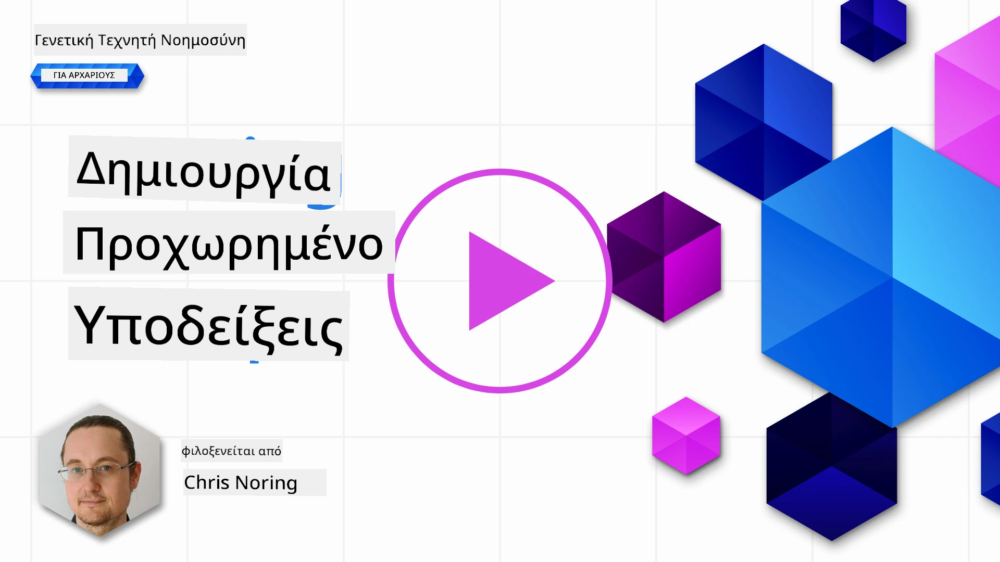

# Δημιουργία Προηγμένων Προτροπών

[](https://youtu.be/BAjzkaCdRok?si=NmUIyRf7-cDgbjtt)

Ας ανακεφαλαιώσουμε κάποια από τα μαθήματα του προηγούμενου κεφαλαίου:

> Η _μηχανική_ δημιουργίας προτροπών είναι η διαδικασία με την οποία **κατευθύνουμε το μοντέλο προς πιο σχετικές απαντήσεις** παρέχοντας πιο χρήσιμες οδηγίες ή πλαίσιο.

Υπάρχουν επίσης δύο βήματα για τη σύνταξη προτροπών: η κατασκευή της προτροπής, παρέχοντας σχετικό πλαίσιο, και η _βελτιστοποίηση_, το πώς να βελτιώνεται σταδιακά η προτροπή.

Σε αυτό το σημείο, έχουμε μια βασική κατανόηση του πώς να γράφουμε προτροπές, αλλά χρειάζεται να πάμε βαθύτερα. Σε αυτό το κεφάλαιο, θα περάσετε από το να δοκιμάζετε διάφορες προτροπές στο να κατανοείτε γιατί μια προτροπή είναι καλύτερη από μια άλλη. Θα μάθετε πώς να κατασκευάζετε προτροπές ακολουθώντας μερικές βασικές τεχνικές που μπορούν να εφαρμοστούν σε οποιοδήποτε LLM.

## Εισαγωγή

Σε αυτό το κεφάλαιο θα καλύψουμε τα εξής θέματα:

- Επέκταση των γνώσεών σας στη μηχανική προτροπών εφαρμόζοντας διαφορετικές τεχνικές στις προτροπές σας.
- Ρύθμιση των προτροπών σας ώστε να ποικίλλει η έξοδος.

## Στόχοι μάθησης

Μετά την ολοκλήρωση αυτού του μαθήματος, θα μπορείτε να:

- Εφαρμόζετε τεχνικές μηχανικής προτροπών που βελτιώνουν το αποτέλεσμα των προτροπών σας.
- Εκτελείτε προτροπές που είναι είτε ποικίλες είτε ντετερμινιστικές.

## Μηχανική προτροπών

Η μηχανική προτροπών είναι η διαδικασία δημιουργίας προτροπών που θα παράγουν το επιθυμητό αποτέλεσμα. Υπάρχει περισσότερα στη μηχανική προτροπών από το απλώς να γράφετε μια προτροπή κειμένου. Η μηχανική προτροπών δεν είναι μια μηχανική επιστήμη, είναι περισσότερο ένα σύνολο τεχνικών που μπορείτε να εφαρμόσετε για να πετύχετε το επιθυμητό αποτέλεσμα.

### Ένα παράδειγμα προτροπής

Ας πάρουμε μια βασική προτροπή όπως η εξής:

> Δημιουργήστε 10 ερωτήσεις για γεωγραφία.

Σε αυτή την προτροπή, στην πραγματικότητα εφαρμόζετε ένα σύνολο διαφορετικών τεχνικών προτροπών.

Ας το αναλύσουμε.

- **Πλαίσιο**, καθορίζετε ότι πρέπει να αφορά "γεωγραφία".
- **Περιορισμός της εξόδου**, θέλετε όχι περισσότερες από 10 ερωτήσεις.

### Περιορισμοί απλής προτροπής

Μπορεί να πάρετε ή όχι το επιθυμητό αποτέλεσμα. Θα δημιουργηθούν οι ερωτήσεις σας, αλλά η γεωγραφία είναι ένα μεγάλο θέμα και μπορεί να μην πάρετε αυτό που θέλετε εξαιτίας των παρακάτω λόγων:

- **Μεγάλο θέμα**, δεν ξέρετε αν θα αφορά χώρες, πρωτεύουσες, ποταμούς κτλ.
- **Μορφή**, τι γίνεται αν θέλατε οι ερωτήσεις να είναι μορφοποιημένες με κάποιο συγκεκριμένο τρόπο;

Όπως βλέπετε, υπάρχουν πολλά που πρέπει να λάβετε υπόψη όταν δημιουργείτε προτροπές.

Μέχρι τώρα, έχουμε δει ένα απλό παράδειγμα προτροπής, αλλά η γενετική AI μπορεί να κάνει πολύ περισσότερα για να βοηθήσει ανθρώπους σε ποικίλους ρόλους και βιομηχανίες. Ας εξερευνήσουμε κάποιες βασικές τεχνικές στη συνέχεια.

### Τεχνικές για προτροπές

Πρώτα πρέπει να κατανοήσουμε ότι η προτροπή είναι μια _αυτοματοποιημένη_ ιδιότητα ενός LLM που σημαίνει ότι αυτό δεν είναι μια λειτουργία ενσωματωμένη στο μοντέλο αλλά κάτι που ανακαλύπτουμε καθώς το χρησιμοποιούμε.

Υπάρχουν μερικές βασικές τεχνικές που μπορούμε να χρησιμοποιήσουμε για να προτρέπει ένα LLM. Ας τις εξερευνήσουμε.

- **Προτροπή χωρίς παραδείγματα (zero-shot)**, αυτή είναι η πιο βασική μορφή προτροπής. Είναι μια μοναδική προτροπή που ζητά μια απάντηση από το LLM βασιζόμενη αποκλειστικά στα εκπαιδευτικά δεδομένα του.
- **Προτροπή με λίγα παραδείγματα (few-shot)**, αυτός ο τύπος προτροπής καθοδηγεί το LLM παρέχοντας 1 ή περισσότερα παραδείγματα στα οποία μπορεί να βασιστεί για να δημιουργήσει την απάντησή του.
- **Αλυσιδωτή σκέψη (chain-of-thought)**, αυτός ο τύπος προτροπής λέει στο LLM πώς να αναλύσει ένα πρόβλημα σε βήματα.
- **Παραγόμενη γνώση (generated knowledge)**, για να βελτιώσετε την απάντηση μιας προτροπής, μπορείτε να παρέχετε παραγόμενα γεγονότα ή γνώση επιπλέον της προτροπής σας.
- **Από το ελάχιστο στο μέγιστο (least to most)**, όπως η αλυσιδωτή σκέψη, αυτή η τεχνική αφορά το να αναλύει ένα πρόβλημα σε μια σειρά βημάτων και μετά να ζητά να γίνουν αυτά τα βήματα κατά σειρά.
- **Αυτοβελτίωση (self-refine)**, αυτή η τεχνική αφορά την κριτική της εξόδου του LLM και στη συνέχεια το να του ζητάτε να βελτιωθεί.
- **Μαιευτική προτροπή (maieutic prompting)**. Αυτό που θέλετε εδώ είναι να διασφαλίσετε ότι η απάντηση του LLM είναι σωστή και του ζητάτε να εξηγήσει διάφορα μέρη της απάντησης. Είναι μια μορφή αυτοβελτίωσης.

### Προτροπή χωρίς παραδείγματα (Zero-shot prompting)

Αυτό το στυλ προτροπής είναι πολύ απλό, αποτελείται από μία μόνο προτροπή. Αυτή η τεχνική μάλλον είναι αυτή που χρησιμοποιείτε καθώς αρχίζετε να μαθαίνετε για τα LLM. Να ένα παράδειγμα:

- Προτροπή: "Τι είναι η Άλγεβρα;"
- Απάντηση: "Η Άλγεβρα είναι ένα κλάδος των μαθηματικών που μελετά μαθηματικά σύμβολα και τους κανόνες για τη διαχείριση αυτών των συμβόλων."

### Προτροπή με λίγα παραδείγματα (Few-shot prompting)

Αυτό το στυλ προτροπής βοηθά το μοντέλο παρέχοντας μερικά παραδείγματα μαζί με το αίτημα. Αποτελείται από μια ενιαία προτροπή με επιπλέον δεδομένα ειδικά για το έργο. Να ένα παράδειγμα:

- Προτροπή: "Γράψε ένα ποίημα στο στυλ του Σαίξπηρ. Να μερικά παραδείγματα Σαιξπηρικών σονέτων.:
  Σονέτο 18: 'Θα σε παρομοιάσω με μια θερινή μέρα; Πιο γλυκιά και ήπια είσαι...'
  Σονέτο 116: 'Μην επιτρέπω εμπόδια στον γάμο γνήσιων ψυχών. Η αγάπη δεν είναι αγάπη που αλλάζει όταν αλλάζει...'
  Σονέτο 132: 'Τ’ μάτια σου αγαπώ, και καθώς με λυπούνται, Γνωρίζουν την καρδιά σου που με ταπεινώνει με απέχθεια,...'
  Τώρα, γράψε ένα σονέτο για την ομορφιά του φεγγαριού."
- Απάντηση: "Στον ουρανό, το φεγγάρι μαλακά λάμπει, Σε ασημένιο φως που ρίχνει τη χάρη του,..."

Τα παραδείγματα παρέχουν στο LLM το πλαίσιο, τη μορφή ή το στυλ της επιθυμητής εξόδου. Βοηθούν το μοντέλο να κατανοήσει το συγκεκριμένο έργο και να δημιουργήσει πιο ακριβείς και σχετικές απαντήσεις.

### Αλυσιδωτή σκέψη (Chain-of-thought)

Η αλυσιδωτή σκέψη είναι μια πολύ ενδιαφέρουσα τεχνική αφού αφορά το να πάρετε το LLM μέσα από μια σειρά βημάτων. Η ιδέα είναι να δίνετε εντολές στο LLM έτσι ώστε να καταλαβαίνει πώς να κάνει κάτι. Σκεφτείτε το παρακάτω παράδειγμα, με και χωρίς αλυσιδωτή σκέψη:

    - Προτροπή: "Η Άλις έχει 5 μήλα, πετάει 3 μήλα, δίνει 2 στον Μπομπ και ο Μπομπ επιστρέφει ένα, πόσα μήλα έχει η Άλις;"
    - Απάντηση: 5

Το LLM απαντά 5, πράγμα που είναι λάθος. Η σωστή απάντηση είναι 1 μήλο, σύμφωνα με τον υπολογισμό (5 -3 -2 + 1 = 1).

Πώς μπορούμε λοιπόν να μάθουμε στο LLM να κάνει αυτό σωστά;

Ας δοκιμάσουμε αλυσιδωτή σκέψη. Εφαρμογή αλυσιδωτής σκέψης σημαίνει:

1. Δίνουμε στο LLM ένα παρόμοιο παράδειγμα.
1. Δείχνουμε τον υπολογισμό και πώς να τον υπολογίσει σωστά.
1. Παρέχουμε την αρχική προτροπή.

Να πώς:

- Προτροπή: "Η Λίζα έχει 7 μήλα, πετάει 1 μήλο, δίνει 4 μήλα στον Μπαρτ και ο Μπαρτ επιστρέφει ένα:
  7 -1 = 6
  6 -4 = 2
  2 +1 = 3  
  Η Άλις έχει 5 μήλα, πετάει 3 μήλα, δίνει 2 στον Μπομπ και ο Μπομπ επιστρέφει ένα, πόσα μήλα έχει η Άλις;"
  Απάντηση: 1

Παρατηρήστε πως γράφουμε πολύ πιο εκτενείς προτροπές με ένα άλλο παράδειγμα, τον υπολογισμό και μετά την αρχική προτροπή και φτάνουμε στη σωστή απάντηση 1.

Όπως βλέπετε, η αλυσιδωτή σκέψη είναι μια πολύ ισχυρή τεχνική.

### Παραγόμενη γνώση (Generated knowledge)

Πολλές φορές όταν θέλετε να κατασκευάσετε μια προτροπή, θέλετε να το κάνετε αυτό χρησιμοποιώντας δεδομένα της δικής σας εταιρείας. Θέλετε μέρος της προτροπής να προέρχεται από την εταιρεία και το άλλο μέρος να είναι η ίδια η προτροπή που σας ενδιαφέρει.

Για παράδειγμα, έτσι μπορεί να μοιάζει η προτροπή σας αν είστε στην ασφαλιστική επιχείρηση:

```text
{{company}}: {{company_name}}
{{products}}:
{{products_list}}
Please suggest an insurance given the following budget and requirements:
Budget: {{budget}}
Requirements: {{requirements}}
```

Παραπάνω, βλέπετε πώς η προτροπή κατασκευάζεται χρησιμοποιώντας ένα πρότυπο. Στο πρότυπο υπάρχουν μεταβλητές, σημειωμένες με `{{variable}}`, που θα αντικατασταθούν με πραγματικές τιμές από ένα API της εταιρείας.

Να ένα παράδειγμα πώς μπορεί να μοιάζει η προτροπή αφού οι μεταβλητές αντικατασταθούν με περιεχόμενο της εταιρείας σας:

```text
Insurance company: ACME Insurance
Insurance products (cost per month):
- Car, cheap, 500 USD
- Car, expensive, 1100 USD
- Home, cheap, 600 USD
- Home, expensive, 1200 USD
- Life, cheap, 100 USD

Please suggest an insurance given the following budget and requirements:
Budget: $1000
Requirements: Car, Home, and Life insurance
```

Εκτελώντας αυτή την προτροπή μέσα από ένα LLM θα παραχθεί μια απάντηση όπως αυτή:

```output
Given the budget and requirements, we suggest the following insurance package from ACME Insurance:
- Car, cheap, 500 USD
- Home, cheap, 600 USD
- Life, cheap, 100 USD
Total cost: $1,200 USD
```

Όπως βλέπετε, προτείνει επίσης τον Ασφαλιστικό Κλάδο Ζωής, κάτι που δεν έπρεπε. Αυτό το αποτέλεσμα δείχνει ότι πρέπει να βελτιστοποιήσουμε την προτροπή κάνοντάς την πιο σαφή σχετικά με το τι μπορεί να επιτρέπεται. Μετά από μερικές _δοκιμές και λάθη_, καταλήγουμε στην εξής προτροπή:

```text
Insurance company: ACME Insurance
Insurance products (cost per month):
- type: Car, cheap, cost: 500 USD
- type: Car, expensive, cost: 1100 USD
- type: Home, cheap, cost: 600 USD
- type: Home, expensive, cost: 1200 USD
- type: Life, cheap, cost: 100 USD

Please suggest an insurance given the following budget and requirements:
Budget: $1000 restrict choice to types: Car, Home
```

Παρατηρήστε πώς η προσθήκη _τύπου_ και _κόστους_ και επίσης η χρήση της λέξης _περιορισμός_ βοηθούν το LLM να καταλάβει τι θέλουμε.

Τώρα παίρνουμε την ακόλουθη απάντηση:

```output
Given the budget and requirements, we suggest the Car, Cheap insurance product which costs 500 USD per month.
```

Το νόημα αυτού του παραδείγματος ήταν να δείξουμε ότι παρόλο που χρησιμοποιούμε μια βασική τεχνική όπως η _παραγόμενη γνώση_, εξακολουθούμε να χρειάζεται να βελτιστοποιούμε την προτροπή στις περισσότερες περιπτώσεις για να πάρουμε το επιθυμητό αποτέλεσμα.

### Από το ελάχιστο στο μέγιστο (Least-to-most)

Η ιδέα με την προτροπή Από το ελάχιστο στο μέγιστο είναι να διασπάσουμε ένα μεγαλύτερο πρόβλημα σε υποπροβλήματα. Έτσι, βοηθάτε να κατευθύνετε το LLM στο πώς να "κατακτήσει" το μεγαλύτερο πρόβλημα. Ένα καλό παράδειγμα θα μπορούσε να είναι για την επιστήμη δεδομένων όπου μπορείτε να ζητήσετε από το LLM να διαιρέσει ένα πρόβλημα ως εξής:

> Προτροπή: Πώς να εκτελέσετε επιστήμη δεδομένων σε 5 βήματα;

Με τον AI βοηθό σας να απαντά:

1. Συλλογή δεδομένων  
1. Καθαρισμός δεδομένων  
1. Ανάλυση δεδομένων  
1. Οπτικοποίηση δεδομένων  
1. Παρουσίαση δεδομένων

### Αυτοβελτίωση, κριτική αποτελεσμάτων (Self-refine, critique the results)

Με τις γενετικές AI και τα LLM, δεν μπορείτε να εμπιστεύεστε απρόσωπα την έξοδο. Πρέπει να την επαληθεύετε. Μετά από όλα, το LLM παρουσιάζει απλώς το επόμενο πιο πιθανό που θα πει, όχι το σωστό. Επομένως, μια καλή ιδέα είναι να ζητάτε από το LLM να κριτικάρει τον εαυτό του, κάτι που οδηγεί στην τεχνική αυτοβελτίωσης.

Το πώς δουλεύει είναι ότι ακολουθείτε τα παρακάτω βήματα:

1. Αρχική προτροπή ζητώντας από το LLM να λύσει ένα πρόβλημα  
1. Το LLM απαντά  
1. Εσείς κριτικάρετε την απάντηση και ζητάτε από την AI να βελτιωθεί  
1. Το LLM απαντά ξανά, αυτή τη φορά λαμβάνοντας υπόψη την κριτική και προτείνοντας λύσεις που σκέφτηκε

Μπορείτε να επαναλάβετε αυτή τη διαδικασία όσες φορές θέλετε.

Να ένα παράδειγμα που χρησιμοποιεί αυτή την τεχνική:

> Προτροπή: "Δημιούργησε ένα Python Web API με διαδρομές products και customers"

Απάντηση AI:

```python
import flask
app = Flask(__name__)

@app.route('/products')
def products():
    return 'Products'

@app.route('/customers')
def customers():
    return 'Customers'
```

> Προτροπή: πρότεινε 3 βελτιώσεις στον παραπάνω κώδικα

Απάντηση AI:

```text
Sure, here are three suggestions to improve the code:

Import the correct module: The first line should import Flask instead of flask. The correct import statement should be from flask import Flask.

Add a main function: Add a if __name__ == '__main__': block to the end of the file to run the application when the file is executed.

Use f-strings: Use f-strings to format the return statements in the route functions. For example, return 'Products' can be changed to return f'This is the {request.path} page'.
```

```python
from flask import Flask, request

app = Flask(__name__)

@app.route('/products')
def products():
    return f'This is the {request.path} page'

@app.route('/customers')
def customers():
    return f'This is the {request.path} page'

if __name__ == '__main__':
    app.run()
```

Όπως βλέπετε, η παραπάνω απάντηση της AI βελτιώνει τον πρώτο προτεινόμενο κώδικα χάρη στην κριτική της πρώτης απάντησης.

### Μαιευτική προτροπή (Maieutic prompting)

Η μαιευτική προτροπή είναι μια τεχνική παρόμοια με την αυτοβελτίωση αλλά αφορά περισσότερο το να ζητάτε από το LLM να εξηγήσει τον εαυτό του. Ο στόχος είναι να μειωθούν οι ασυνέπειες στην έξοδο του LLM ώστε να διασφαλιστεί ότι καταλήγει στη σωστή απάντηση. Η ροή εργασίας που πρέπει να ακολουθήσετε είναι:

1. Ζητήστε από το LLM να απαντήσει μια ερώτηση  
1. Για κάθε μέρος της απάντησης, ζητήστε από το LLM να την εξηγήσει πιο αναλυτικά.  
1. Αν υπάρχουν ασυνέπειες, απορρίψτε τα μέρη που είναι ασυνεπή.

Επαναλάβετε 2 και 3 μέχρι να περπατήσετε όλα τα μέρη και να είστε ικανοποιημένοι με την απάντηση.

Να ένα παράδειγμα προτροπής:

> προτροπή: Πώς μπορώ να δημιουργήσω ένα σχέδιο κρίσης για την αντιμετώπιση μιας πανδημίας σε 5 βήματα;  
> Απάντηση LLM:

```text
1. Identify the risks
1. Identify the stakeholders
1. Identify the resources
1. Identify the actions
1. Identify the communication channels
```

Εντοπίστηκαν 5 βήματα, αλλά μπορούμε να προσδιορίσουμε αν αυτό είναι σωστό; Ας ζητήσουμε από το LLM να εξηγήσει κάθε βήμα:

> προτροπή: Εξήγησε το πρώτο βήμα πιο αναλυτικά, ποιοι είναι οι κίνδυνοι λεπτομερώς σε μια πανδημία;

```text
The risks are the following:

- Loss of life
- Loss of business
- Loss of reputation
- Loss of customers
- Loss of employees
```

Σε αυτό το σημείο, θέλουμε να βεβαιωθούμε ότι το LLM είναι σωστό, οπότε του ζητάμε να εξηγήσει τον πρώτο κίνδυνο πιο αναλυτικά και ελπίζουμε ότι είναι συνεπές με την παραπάνω απάντηση:

> προτροπή: Σε μια πανδημία, ποιος είναι ο μεγαλύτερος κίνδυνος και γιατί;

```text
The biggest risk is loss of life because it's the most important thing to protect.
```

> Ποιοι είναι οι δύο μεγαλύτεροι κίνδυνοι σε μια πανδημία;

```text
The two biggest risks are loss of life and loss of business.
```

Σε αυτό το σημείο, το LLM είναι συνεπές και αναφέρεται σε "ζωή" και "επιχειρήσεις" ως τους δύο μεγαλύτερους κινδύνους. Τώρα μπορούμε να προχωρήσουμε στο επόμενο βήμα και να αισθανόμαστε αρκετά σίγουροι. Ωστόσο, δεν πρέπει να εμπιστευόμαστε το LLM άκριτα, πρέπει πάντα να επαληθεύουμε την έξοδο.

## Ποικιλία στην έξοδο σας

Τα LLM είναι από τη φύση τους μη ντετερμινιστικά, πράγμα που σημαίνει ότι θα λαμβάνετε διαφορετικά αποτελέσματα κάθε φορά που εκτελείτε την ίδια προτροπή. Δοκιμάστε την ακόλουθη προτροπή για παράδειγμα:

> "Δημιουργήστε κώδικα για ένα Python Web API"

```python
# Εισαγωγή των απαραίτητων μονάδων
import flask
from flask import request, jsonify

# Δημιουργία μιας εφαρμογής Flask
app = flask.Flask(__name__)

# Δημιουργία ενός route για το API
@app.route('/api', methods=['GET'])
def api():
    # Λήψη των δεδομένων από το αίτημα
    data = request.args

    # Επεξεργασία των δεδομένων
    result = process_data(data)

    # Επιστροφή του αποτελέσματος σε μορφή JSON
    return jsonify(result)

# Συνάρτηση για την επεξεργασία των δεδομένων
def process_data(data):
    # Κάντε κάτι με τα δεδομένα
    result = data + 1

    # Επιστροφή του αποτελέσματος
    return result

# Εκτέλεση της εφαρμογής
if __name__ == '__main__':
    app.run()

```

Εκτελώντας την ίδια προτροπή ξανά παράγει μια ελαφρώς διαφορετική απάντηση:

```python
#εισαγωγή απαραίτητων πακέτων
import flask
from flask import request, jsonify

#δημιουργία της εφαρμογής Flask
app = flask.Flask(__name__)
app.config["DEBUG"] = True

#δημιουργία μιας λίστας βιβλίων
books = [
    {'id': 0,
     'title': 'A Fire Upon the Deep',
     'author': 'Vernor Vinge',
     'first_sentence': 'The coldsleep itself was dreamless.',
     'year_published': '1992'},
    {'id': 1,
     'title': 'The Ones Who Walk Away From Omelas',
     'author': 'Ursula K. Le Guin',
     'first_sentence': 'With a clamor of bells that set the swallows soaring, the Festival of Summer came to the city Omelas, bright-towered by the sea.',
     'published': '1973'},
    {'id': 2,
     'title': 'Dhalgren',
     'author': 'Samuel R. Delany',
     'first_sentence': 'to wound the autumnal city.',
     'published': '1975'}
]

#δημιουργία ενός endpoint για το API
@app.route('/', methods=['GET'])
def home():
    return '''<h1>Books API</h1>
<p>A prototype API for retrieving books.</p>'''

#δημιουργία ενός endpoint για να επιστρέφει όλα τα βιβλία
@app.route('/api/v1/resources/books/all', methods=['GET'])
def api_all():
    return jsonify(books)

#δημιουργία ενός endpoint για να επιστρέφει ένα μεμονωμένο βιβλίο
@app.route('/api/v1/resources/books', methods=['GET'])
def api_id():
    #έλεγχος αν δόθηκε ένα ID ως μέρος της URL
    #αν παρέχεται ID, εκχώρησέ το σε μια μεταβλητή
    #αν δεν παρέχεται ID, εμφάνισε ένα σφάλμα
    if 'id' in request.args:
        id = int(request.args['id'])
    else:
        return "Error: No id field provided. Please specify an id."

    #δημιουργία μιας κενής λίστας για τα αποτελέσματά μας
    results = []

    #βρόχος μέσα στα δεδομένα και αντιστοίχιση αποτελεσμάτων που ταιριάζουν με το ζητούμενο ID
    #τα ID είναι μοναδικά, αλλά άλλα πεδία μπορεί να επιστρέψουν πολλά αποτελέσματα
    for book in books:
        if book['id'] == id:
            results.append(book)

    #χρήση της συνάρτησης jsonify από το Flask για να μετατρέψουμε τη λίστα μας από
    #Python λεξικά στη μορφή JSON
    return jsonify(results)

app.run()
```

> Είναι λοιπόν η ποικιλία στην έξοδο πρόβλημα;

Εξαρτάται από το τι προσπαθείτε να κάνετε. Αν θέλετε μια συγκεκριμένη απάντηση, τότε είναι πρόβλημα. Αν είστε ικανοποιημένοι με μια ποικιλία όπως "Δημιουργήστε οποιεσδήποτε 3 ερωτήσεις για γεωγραφία", τότε δεν είναι πρόβλημα.

### Χρήση της θερμοκρασίας για ποικιλία στην έξοδό σας

Εντάξει, αποφασίσαμε ότι θέλουμε να περιορίσουμε την έξοδο ώστε να είναι πιο προβλέψιμη, δηλαδή πιο ντετερμινιστική. Πώς το κάνουμε αυτό;

Η θερμοκρασία είναι μια τιμή μεταξύ 0 και 1, όπου το 0 είναι το πιο ντετερμινιστικό και το 1 το πιο ποικίλο. Η προεπιλεγμένη τιμή είναι 0.7. Ας δούμε τι συμβαίνει με δύο τρέξιμο της ίδιας προτροπής με τη θερμοκρασία ορισμένη στο 0.1:

> "Δημιουργήστε κώδικα για ένα Python Web API"

```python
#εισαγωγή απαραίτητων βιβλιοθηκών
import flask
from flask import request, jsonify

#δημιουργία μιας παρουσίας της κλάσης Flask
app = flask.Flask(__name__)

#δημιουργία ενός τελικού σημείου για το API
@app.route('/api/v1/endpoint', methods=['GET'])
def api_endpoint():
    #λήψη των δεδομένων του αιτήματος
    data = request.get_json()

    #επεξεργασία των δεδομένων
    result = process_data(data)

    #επιστροφή του αποτελέσματος
    return jsonify(result)

#συνάρτηση για την επεξεργασία των δεδομένων
def process_data(data):
    #επεξεργασία των δεδομένων
    result = {'result': 'success'}

    #επιστροφή του αποτελέσματος
    return result

#εκτέλεση της εφαρμογής Flask
if __name__ == '__main__':
    app.run()

```

Εκτελώντας ξανά την προτροπή παίρνουμε αυτό το αποτέλεσμα:

```python
#εισαγωγή απαραίτητων βιβλιοθηκών
import flask
from flask import request, jsonify

#δημιουργία μιας εφαρμογής Flask
app = flask.Flask(__name__)

#δημιουργία μιας διαδρομής για το API
@app.route('/api', methods=['GET'])
def api_call():
    #λήψη των δεδομένων από το αίτημα
    data = request.get_json()

    #επεξεργασία των δεδομένων
    result = process_data(data)

    #επιστροφή του αποτελέσματος
    return jsonify(result)

#ορισμός της συνάρτησης process_data
def process_data(data):
    #εκτέλεση κάποιου χειρισμού με τα δεδομένα
    result = data + 1

    #επιστροφή του αποτελέσματος
    return result

#εκτέλεση της εφαρμογής
if __name__ == '__main__':
    app.run()

```

Υπάρχει μόνο μια μικρή διαφορά μεταξύ αυτών των δύο εξόδων. Ας κάνουμε το αντίθετο αυτή τη φορά, ας ορίσουμε τη θερμοκρασία στο 0.9:

```python
# Εισαγωγή των απαραίτητων βιβλιοθηκών
import flask
from flask import request, jsonify

# Δημιουργία μιας εφαρμογής Flask
app = flask.Flask(__name__)

# Δημιουργία ενός διαδρομής για το API
@app.route('/api', methods=['GET'])
def api_call():
    # Λήψη των δεδομένων από το αίτημα
    data = request.args

    # Επεξεργασία των δεδομένων
    result = process_data(data)

    # Επιστροφή του αποτελέσματος
    return jsonify(result)

# Συνάρτηση για την επεξεργασία των δεδομένων
def process_data(data):
    # Κάντε κάτι με τα δεδομένα
    result = data + 1

    # Επιστροφή του αποτελέσματος
    return result

# Εκτέλεση της εφαρμογής
if __name__ == '__main__':
    app.run()

```

και η δεύτερη προσπάθεια με τιμή θερμοκρασίας 0.9:

```python
import flask
from flask import request, jsonify

# δημιουργήστε την εφαρμογή Flask
app = flask.Flask(__name__)
app.config['DEBUG'] = True

# δημιουργήστε κάποια δοκιμαστικά δεδομένα
books = [
    {'id': 0, 'title': 'A Fire Upon The Deep', 'author': 'Vernor Vinge', 'first_sentence': 'The coldsleep itself was dreamless.', 'year_published': '1992'},
    {'id': 1, 'title': 'The Ones Who Walk Away From Omelas', 'author': 'Ursula K. Le Guin', 'first_sentence': 'With a clamor of bells that set the swallows soaring, the Festival of Summer came to the city Omelas, bright-towered by the sea.', 'published': '1973'},
    {'id': 2, 'title': 'Dhalgren', 'author': 'Samuel R. Delany', 'first_sentence': 'to wound the autumnal city.', 'published': '1975'}
]

# δημιουργήστε ένα τελικό σημείο
@app.route('/', methods=['GET'])
def home():
    return '''<h1>Welcome to our book API!</h1>'''

@app.route('/api/v1/resources/books

```

Όπως βλέπετε, τα αποτελέσματα δεν θα μπορούσαν να είναι πιο ποικίλα.
> Σημείωση, ότι υπάρχουν και άλλες παράμετροι που μπορείτε να αλλάξετε για να διαφοροποιήσετε την έξοδο, όπως top-k, top-p, ποινή επανάληψης, ποινή μήκους και ποινή ποικιλομορφίας, αλλά αυτές είναι εκτός του πεδίου αυτού του προγράμματος σπουδών.

## Καλές πρακτικές

Υπάρχουν πολλές πρακτικές που μπορείτε να εφαρμόσετε για να προσπαθήσετε να πάρετε αυτό που θέλετε. Θα βρείτε το δικό σας στυλ καθώς χρησιμοποιείτε περισσότερο και περισσότερο την τεχνική prompting.

Επιπλέον των τεχνικών που έχουμε καλύψει, υπάρχουν κάποιες καλές πρακτικές που πρέπει να λάβετε υπόψη όταν κάνετε prompting σε ένα LLM.

Εδώ είναι κάποιες καλές πρακτικές που πρέπει να λάβετε υπόψη:

- **Καθορίστε το πλαίσιο**. Το πλαίσιο έχει σημασία, όσο περισσότερο μπορείτε να προσδιορίσετε όπως το πεδίο, το θέμα, κλπ., τόσο το καλύτερο.
- Περιορίστε την έξοδο. Αν θέλετε έναν συγκεκριμένο αριθμό αντικειμένων ή συγκεκριμένο μήκος, προσδιορίστε το.
- **Καθορίστε και το τι και το πώς**. Θυμηθείτε να αναφέρετε και τι θέλετε και πώς το θέλετε, για παράδειγμα "Δημιουργήστε ένα Python Web API με διαδρομές products και customers, χωρισμένο σε 3 αρχεία".
- **Χρησιμοποιήστε πρότυπα**. Συχνά, θα θέλετε να εμπλουτίσετε τα prompts σας με δεδομένα από την εταιρεία σας. Χρησιμοποιήστε πρότυπα για να το κάνετε αυτό. Τα πρότυπα μπορούν να έχουν μεταβλητές που αντικαθιστάτε με πραγματικά δεδομένα.
- **Ορθογραφήστε σωστά**. Τα LLM μπορεί να σας δώσουν μια σωστή απάντηση, αλλά αν γράφετε ορθογραφικά σωστά, θα πάρετε καλύτερη απάντηση.

## Εργασία

Εδώ είναι κώδικας σε Python που δείχνει πώς να φτιάξετε ένα απλό API χρησιμοποιώντας Flask:

```python
from flask import Flask, request

app = Flask(__name__)

@app.route('/')
def hello():
    name = request.args.get('name', 'World')
    return f'Hello, {name}!'

if __name__ == '__main__':
    app.run()
```

Χρησιμοποιήστε έναν βοηθό AI όπως το GitHub Copilot ή το ChatGPT και εφαρμόστε την τεχνική "self-refine" για να βελτιώσετε τον κώδικα.

## Λύση

Παρακαλώ δοκιμάστε να λύσετε την εργασία προσθέτοντας κατάλληλα prompts στον κώδικα.

> [!TIP]
> Διατυπώστε ένα prompt για να ζητήσετε βελτίωση, είναι καλή ιδέα να περιορίσετε πόσες βελτιώσεις. Μπορείτε επίσης να ζητήσετε να βελτιωθεί με συγκεκριμένο τρόπο, για παράδειγμα αρχιτεκτονική, απόδοση, ασφάλεια, κλπ.

[Λύση](../../../05-advanced-prompts/python/aoai-solution.py)

## Έλεγχος γνώσεων

Γιατί θα χρησιμοποιούσα chain-of-thought prompting; Δείξε μου 1 σωστή απάντηση και 2 λανθασμένες απαντήσεις.

1. Για να διδάξω το LLM πώς να λύσει ένα πρόβλημα.
1. Β, Για να διδάξω το LLM να βρίσκει λάθη στον κώδικα.
1. Γ, Για να δώσω εντολή στο LLM να βρει διαφορετικές λύσεις.

Α: 1, γιατί το chain-of-thought αφορά στο να δείξουμε στο LLM πώς να λύσει ένα πρόβλημα παρέχοντάς του μια σειρά βημάτων, και παρόμοια προβλήματα και πώς αυτά λύθηκαν.

## 🚀 Πρόκληση

Μόλις χρησιμοποιήσατε την τεχνική self-refine στην εργασία. Πάρτε οποιοδήποτε πρόγραμμα έχετε δημιουργήσει και σκεφτείτε ποιες βελτιώσεις θα θέλατε να εφαρμόσετε σε αυτό. Τώρα χρησιμοποιήστε την τεχνική self-refine για να εφαρμόσετε τις προτεινόμενες αλλαγές. Τι νομίζετε πως ήταν το αποτέλεσμα, καλύτερο ή χειρότερο;

## Συγχαρητήρια! Συνεχίστε τη μάθησή σας

Μετά την ολοκλήρωση αυτού του μαθήματος, ρίξτε μια ματιά στη [συλλογή μας για Μάθηση Γεννητικής Τεχνητής Νοημοσύνης](https://aka.ms/genai-collection?WT.mc_id=academic-105485-koreyst) για να συνεχίσετε να ανεβαίνετε επίπεδο στις γνώσεις σας στην Γεννητική Τεχνητή Νοημοσύνη!

Μεταβείτε στο Μάθημα 6 όπου θα εφαρμόσουμε τις γνώσεις μας στην Μηχανική Προτροπών δημιουργώντας [εφαρμογές παραγωγής κειμένου](../06-text-generation-apps/README.md?WT.mc_id=academic-105485-koreyst)

---

<!-- CO-OP TRANSLATOR DISCLAIMER START -->
**Αποποίηση ευθυνών**:
Αυτό το έγγραφο έχει μεταφραστεί χρησιμοποιώντας την υπηρεσία μετάφρασης με τεχνητή νοημοσύνη [Co-op Translator](https://github.com/Azure/co-op-translator). Ενώ επιδιώκουμε την ακρίβεια, παρακαλούμε να έχετε υπόψη ότι οι αυτοματοποιημένες μεταφράσεις ενδέχεται να περιέχουν λάθη ή ανακρίβειες. Το πρωτότυπο έγγραφο στη μητρική του γλώσσα πρέπει να θεωρείται η αυθεντική πηγή. Για κρίσιμες πληροφορίες, συνιστάται επαγγελματική ανθρώπινη μετάφραση. Δεν φέρουμε ευθύνη για τυχόν παρεξηγήσεις ή λανθασμένες ερμηνείες που προκύπτουν από τη χρήση αυτής της μετάφρασης.
<!-- CO-OP TRANSLATOR DISCLAIMER END -->