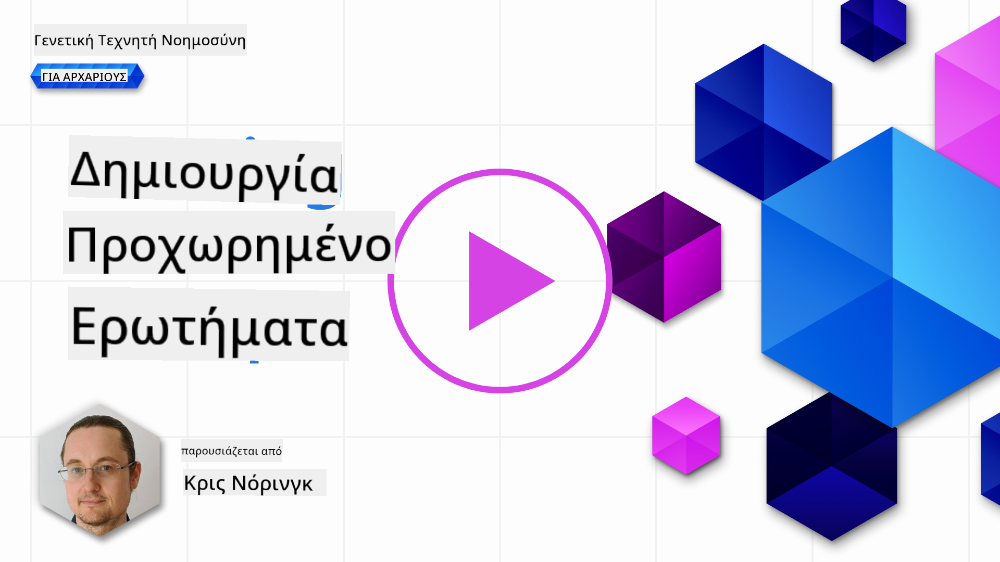

<!--
CO_OP_TRANSLATOR_METADATA:
{
  "original_hash": "b2651fb16bcfbc62b8e518751ed90fdb",
  "translation_date": "2025-10-17T18:14:59+00:00",
  "source_file": "05-advanced-prompts/README.md",
  "language_code": "el"
}
-->
# Δημιουργία Προχωρημένων Προτροπών

[](https://youtu.be/BAjzkaCdRok?si=NmUIyRf7-cDgbjtt)

Ας ανακεφαλαιώσουμε μερικά από τα μαθήματα του προηγούμενου κεφαλαίου:

> Η _μηχανική προτροπών_ είναι η διαδικασία με την οποία **κατευθύνουμε το μοντέλο προς πιο σχετικές απαντήσεις** παρέχοντας πιο χρήσιμες οδηγίες ή πλαίσιο.

Υπάρχουν επίσης δύο βήματα για τη συγγραφή προτροπών: η κατασκευή της προτροπής, παρέχοντας σχετικό πλαίσιο, και η _βελτιστοποίηση_, δηλαδή πώς να βελτιώνουμε σταδιακά την προτροπή.

Σε αυτό το σημείο, έχουμε μια βασική κατανόηση του πώς να γράφουμε προτροπές, αλλά χρειάζεται να εμβαθύνουμε. Σε αυτό το κεφάλαιο, θα περάσετε από τη δοκιμή διάφορων προτροπών στην κατανόηση του γιατί μια προτροπή είναι καλύτερη από μια άλλη. Θα μάθετε πώς να κατασκευάζετε προτροπές ακολουθώντας βασικές τεχνικές που μπορούν να εφαρμοστούν σε οποιοδήποτε LLM.

## Εισαγωγή

Σε αυτό το κεφάλαιο, θα καλύψουμε τα εξής θέματα:

- Επέκταση της γνώσης σας στη μηχανική προτροπών εφαρμόζοντας διαφορετικές τεχνικές στις προτροπές σας.
- Διαμόρφωση των προτροπών σας ώστε να ποικίλλει το αποτέλεσμα.

## Στόχοι μάθησης

Μετά την ολοκλήρωση αυτού του μαθήματος, θα μπορείτε να:

- Εφαρμόζετε τεχνικές μηχανικής προτροπών που βελτιώνουν το αποτέλεσμα των προτροπών σας.
- Εκτελείτε προτροπές που είναι είτε ποικίλες είτε ντετερμινιστικές.

## Μηχανική προτροπών

Η μηχανική προτροπών είναι η διαδικασία δημιουργίας προτροπών που θα παράγουν το επιθυμητό αποτέλεσμα. Η μηχανική προτροπών δεν αφορά μόνο τη συγγραφή μιας κειμενικής προτροπής. Δεν είναι μια επιστημονική πειθαρχία, αλλά περισσότερο ένα σύνολο τεχνικών που μπορείτε να εφαρμόσετε για να πετύχετε το επιθυμητό αποτέλεσμα.

### Ένα παράδειγμα προτροπής

Ας πάρουμε μια βασική προτροπή όπως αυτή:

> Δημιούργησε 10 ερωτήσεις για τη γεωγραφία.

Σε αυτή την προτροπή, εφαρμόζετε στην πραγματικότητα ένα σύνολο διαφορετικών τεχνικών προτροπών.

Ας το αναλύσουμε.

- **Πλαίσιο**, καθορίζετε ότι πρέπει να αφορά τη "γεωγραφία".
- **Περιορισμός του αποτελέσματος**, θέλετε όχι περισσότερες από 10 ερωτήσεις.

### Περιορισμοί απλών προτροπών

Ίσως να μην πετύχετε το επιθυμητό αποτέλεσμα. Θα δημιουργηθούν ερωτήσεις, αλλά η γεωγραφία είναι ένα μεγάλο θέμα και ίσως να μην πάρετε αυτό που θέλετε για τους εξής λόγους:

- **Μεγάλο θέμα**, δεν ξέρετε αν θα αφορά χώρες, πρωτεύουσες, ποτάμια κ.λπ.
- **Μορφή**, τι γίνεται αν θέλατε οι ερωτήσεις να έχουν συγκεκριμένη μορφή;

Όπως βλέπετε, υπάρχουν πολλά που πρέπει να ληφθούν υπόψη κατά τη δημιουργία προτροπών.

Μέχρι στιγμής, έχουμε δει ένα απλό παράδειγμα προτροπής, αλλά η γενετική τεχνητή νοημοσύνη είναι ικανή για πολύ περισσότερα ώστε να βοηθήσει ανθρώπους σε διάφορους ρόλους και βιομηχανίες. Ας εξερευνήσουμε μερικές βασικές τεχνικές στη συνέχεια.

### Τεχνικές για προτροπές

Πρώτα, πρέπει να κατανοήσουμε ότι η δημιουργία προτροπών είναι μια _αναδυόμενη_ ιδιότητα ενός LLM, που σημαίνει ότι δεν είναι μια δυνατότητα ενσωματωμένη στο μοντέλο αλλά κάτι που ανακαλύπτουμε καθώς χρησιμοποιούμε το μοντέλο.

Υπάρχουν μερικές βασικές τεχνικές που μπορούμε να χρησιμοποιήσουμε για να δημιουργήσουμε προτροπές σε ένα LLM. Ας τις εξερευνήσουμε.

- **Προτροπή μηδενικών παραδειγμάτων**, αυτή είναι η πιο βασική μορφή προτροπής. Είναι μια απλή προτροπή που ζητά απάντηση από το LLM βασισμένη αποκλειστικά στα δεδομένα εκπαίδευσής του.
- **Προτροπή λίγων παραδειγμάτων**, αυτός ο τύπος προτροπής καθοδηγεί το LLM παρέχοντας 1 ή περισσότερα παραδείγματα στα οποία μπορεί να βασιστεί για να δημιουργήσει την απάντησή του.
- **Αλυσίδα σκέψης**, αυτός ο τύπος προτροπής λέει στο LLM πώς να αναλύσει ένα πρόβλημα σε βήματα.
- **Παραγόμενη γνώση**, για να βελτιώσετε την απάντηση μιας προτροπής, μπορείτε να παρέχετε επιπλέον γεγονότα ή γνώση μαζί με την προτροπή σας.
- **Από το λιγότερο στο περισσότερο**, όπως η αλυσίδα σκέψης, αυτή η τεχνική αφορά την ανάλυση ενός προβλήματος σε μια σειρά βημάτων και στη συνέχεια την εκτέλεση αυτών των βημάτων με τη σειρά.
- **Αυτοβελτίωση**, αυτή η τεχνική αφορά την κριτική της απάντησης του LLM και στη συνέχεια την απαίτηση για βελτίωση.
- **Μαιευτική προτροπή**, εδώ θέλετε να διασφαλίσετε ότι η απάντηση του LLM είναι σωστή και του ζητάτε να εξηγήσει διάφορα μέρη της απάντησης. Αυτή είναι μια μορφή αυτοβελτίωσης.

### Προτροπή μηδενικών παραδειγμάτων

Αυτό το στυλ προτροπής είναι πολύ απλό, αποτελείται από μια μόνο προτροπή. Αυτή η τεχνική είναι πιθανώς αυτή που χρησιμοποιείτε καθώς αρχίζετε να μαθαίνετε για τα LLM. Να ένα παράδειγμα:

- Προτροπή: "Τι είναι η Άλγεβρα;"
- Απάντηση: "Η Άλγεβρα είναι ένας κλάδος των μαθηματικών που μελετά μαθηματικά σύμβολα και τους κανόνες για τη διαχείρισή τους."

### Προτροπή λίγων παραδειγμάτων

Αυτό το στυλ προτροπής βοηθά το μοντέλο παρέχοντας μερικά παραδείγματα μαζί με το αίτημα. Αποτελείται από μια μόνο προτροπή με επιπλέον δεδομένα συγκεκριμένα για την εργασία. Να ένα παράδειγμα:

- Προτροπή: "Γράψε ένα ποίημα στο στυλ του Σαίξπηρ. Εδώ είναι μερικά παραδείγματα από σονέτα του Σαίξπηρ:
  Σονέτο 18: 'Να σε συγκρίνω με μια καλοκαιρινή μέρα; Είσαι πιο όμορφος και πιο ήπιος...'
  Σονέτο 116: 'Ας μην υπάρξουν εμπόδια στον γάμο των αληθινών μυαλών. Η αγάπη δεν είναι αγάπη που αλλάζει όταν βρίσκει αλλαγή...'
  Σονέτο 132: 'Αγαπώ τα μάτια σου, και αυτά, σαν να με λυπούνται, γνωρίζοντας την καρδιά σου που με βασανίζει με περιφρόνηση,...'
  Τώρα, γράψε ένα σονέτο για την ομορφιά της σελήνης."
- Απάντηση: "Στον ουρανό, η σελήνη απαλά λάμπει, Σε ασημένιο φως που ρίχνει τη γλυκιά της χάρη,..."

Τα παραδείγματα παρέχουν στο LLM το πλαίσιο, τη μορφή ή το στυλ του επιθυμητού αποτελέσματος. Βοηθούν το μοντέλο να κατανοήσει τη συγκεκριμένη εργασία και να δημιουργήσει πιο ακριβείς και σχετικές απαντήσεις.

### Αλυσίδα σκέψης

Η αλυσίδα σκέψης είναι μια πολύ ενδιαφέρουσα τεχνική καθώς αφορά τη λήψη του LLM μέσω μιας σειράς βημάτων. Η ιδέα είναι να δώσετε οδηγίες στο LLM με τέτοιο τρόπο ώστε να κατανοήσει πώς να κάνει κάτι. Σκεφτείτε το εξής παράδειγμα, με και χωρίς αλυσίδα σκέψης:

    - Προτροπή: "Η Άλις έχει 5 μήλα, πετάει 3 μήλα, δίνει 2 στον Μπομπ και ο Μπομπ της επιστρέφει ένα, πόσα μήλα έχει η Άλις;"
    - Απάντηση: 5

Το LLM απαντά με 5, που είναι λάθος. Η σωστή απάντηση είναι 1 μήλο, δεδομένου του υπολογισμού (5 -3 -2 + 1 = 1).

Πώς μπορούμε να διδάξουμε στο LLM να το κάνει σωστά;

Ας δοκιμάσουμε την αλυσίδα σκέψης. Εφαρμόζοντας την αλυσίδα σκέψης σημαίνει:

1. Δώστε στο LLM ένα παρόμοιο παράδειγμα.
1. Δείξτε τον υπολογισμό και πώς να τον υπολογίσει σωστά.
1. Παρέχετε την αρχική προτροπή.

Να πώς:

- Προτροπή: "Η Λίζα έχει 7 μήλα, πετάει 1 μήλο, δίνει 4 μήλα στον Μπαρτ και ο Μπαρτ της επιστρέφει ένα:
  7 -1 = 6
  6 -4 = 2
  2 +1 = 3  
  Η Άλις έχει 5 μήλα, πετάει 3 μήλα, δίνει 2 στον Μπομπ και ο Μπομπ της επιστρέφει ένα, πόσα μήλα έχει η Άλις;"
  Απάντηση: 1

Παρατηρήστε πώς γράφουμε σημαντικά μεγαλύτερες προτροπές με ένα άλλο παράδειγμα, έναν υπολογισμό και στη συνέχεια την αρχική προτροπή και φτάνουμε στη σωστή απάντηση 1.

Όπως βλέπετε, η αλυσίδα σκέψης είναι μια πολύ ισχυρή τεχνική.

### Παραγόμενη γνώση

Πολλές φορές όταν θέλετε να κατασκευάσετε μια προτροπή, θέλετε να το κάνετε χρησιμοποιώντας δεδομένα της δικής σας εταιρείας. Θέλετε μέρος της προτροπής να προέρχεται από την εταιρεία και το άλλο μέρος να είναι η πραγματική προτροπή που σας ενδιαφέρει.

Ως παράδειγμα, αυτή είναι η μορφή που μπορεί να έχει η προτροπή σας αν εργάζεστε στον τομέα των ασφαλίσεων:

```text
{{company}}: {{company_name}}
{{products}}:
{{products_list}}
Please suggest an insurance given the following budget and requirements:
Budget: {{budget}}
Requirements: {{requirements}}
```

Πάνω, βλέπετε πώς η προτροπή κατασκευάζεται χρησιμοποιώντας ένα πρότυπο. Στο πρότυπο υπάρχουν αρκετές μεταβλητές, που σημειώνονται με `{{variable}}`, οι οποίες θα αντικατασταθούν με πραγματικές τιμές από ένα API της εταιρείας.

Να ένα παράδειγμα του πώς μπορεί να μοιάζει η προτροπή αφού οι μεταβλητές έχουν αντικατασταθεί με περιεχόμενο από την εταιρεία σας:

```text
Insurance company: ACME Insurance
Insurance products (cost per month):
- Car, cheap, 500 USD
- Car, expensive, 1100 USD
- Home, cheap, 600 USD
- Home, expensive, 1200 USD
- Life, cheap, 100 USD

Please suggest an insurance given the following budget and requirements:
Budget: $1000
Requirements: Car, Home, and Life insurance
```

Η εκτέλεση αυτής της προτροπής μέσω ενός LLM θα παράγει μια απάντηση όπως αυτή:

```output
Given the budget and requirements, we suggest the following insurance package from ACME Insurance:
- Car, cheap, 500 USD
- Home, cheap, 600 USD
- Life, cheap, 100 USD
Total cost: $1,200 USD
```

Όπως βλέπετε, προτείνει επίσης την Ασφάλεια Ζωής, κάτι που δεν θα έπρεπε. Αυτό το αποτέλεσμα είναι μια ένδειξη ότι πρέπει να βελτιστοποιήσουμε την προτροπή αλλάζοντάς την ώστε να είναι πιο σαφής σχετικά με το τι μπορεί να επιτρέψει. Μετά από κάποια _δοκιμή και σφάλμα_, φτάνουμε στην εξής προτροπή:

```text
Insurance company: ACME Insurance
Insurance products (cost per month):
- type: Car, cheap, cost: 500 USD
- type: Car, expensive, cost: 1100 USD
- type: Home, cheap, cost: 600 USD
- type: Home, expensive, cost: 1200 USD
- type: Life, cheap, cost: 100 USD

Please suggest an insurance given the following budget and requirements:
Budget: $1000 restrict choice to types: Car, Home
```

Παρατηρήστε πώς η προσθήκη _τύπου_ και _κόστους_ και επίσης η χρήση της λέξης-κλειδί _περιορισμός_ βοηθά το LLM να κατανοήσει τι θέλουμε.

Τώρα παίρνουμε την εξής απάντηση:

```output
Given the budget and requirements, we suggest the Car, Cheap insurance product which costs 500 USD per month.
```

Το νόημα αυτού του παραδείγματος ήταν να δείξει ότι, παρόλο που χρησιμοποιούμε μια βασική τεχνική όπως η _παραγόμενη γνώση_, στις περισσότερες περιπτώσεις πρέπει να βελτιστοποιήσουμε την προτροπή για να πετύχουμε το επιθυμητό αποτέλεσμα.

### Από το λιγότερο στο περισσότερο

Η ιδέα με την προτροπή από το λιγότερο στο περισσότερο είναι να αναλύσετε ένα μεγαλύτερο πρόβλημα σε υποπροβλήματα. Με αυτόν τον τρόπο, βοηθάτε να καθοδηγήσετε το LLM στο πώς να "κατακτήσει" το μεγαλύτερο πρόβλημα. Ένα καλό παράδειγμα θα μπορούσε να είναι για την επιστήμη δεδομένων όπου μπορείτε να ζητήσετε από το LLM να διαιρέσει ένα πρόβλημα ως εξής:

> Προτροπή: Πώς να εκτελέσετε επιστήμη δεδομένων σε 5 βήματα;

Με την απάντηση του AI βοηθού:

1. Συλλογή δεδομένων
1. Καθαρισμός δεδομένων
1. Ανάλυση δεδομένων
1. Οπτικοποίηση δεδομένων
1. Παρουσίαση δεδομένων

### Αυτοβελτίωση, κριτική των αποτελεσμάτων

Με τις γενετικές AI και τα LLM, δεν μπορείτε να εμπιστευτείτε το αποτέλεσμα. Πρέπει να το επαληθεύσετε. Εξάλλου, το LLM απλώς σας παρουσιάζει τι είναι πιο πιθανό να πει στη συνέχεια, όχι τι είναι σωστό. Επομένως, μια καλή ιδέα είναι να ζητήσετε από το LLM να κρίνει τον εαυτό του, κάτι που μας οδηγεί στην τεχνική της αυτοβελτίωσης.

Πώς λειτουργεί είναι ότι ακολουθείτε τα εξής βήματα:

1. Αρχική προτροπή ζητώντας από το LLM να λύσει ένα πρόβλημα
1. Το LLM απαντά
1. Κρίνετε την απάντηση και ζητάτε από το AI να τη βελτιώσει
1. Το LLM απαντά ξανά, αυτή τη φορά λαμβάνοντας υπόψη την κριτική και προτείνει λύσεις που σκέφτηκε

Μπορείτε να επαναλάβετε αυτή τη διαδικασία όσες φορές θέλετε.

Να ένα παράδειγμα χρησιμοποιώντας αυτή την τεχνική:

> Προτροπή: "Δημιούργησε ένα Python Web API με διαδρομές προϊόντων και πελατών"

Απάντηση AI:

```python
import flask
app = Flask(__name__)

@app.route('/products')
def products():
    return 'Products'

@app.route('/customers')
def customers():
    return 'Customers'
```

> Προτροπή: πρότεινε 3 βελτιώσεις για τον παραπάνω κώδικα

Απάντηση AI:

```text
Sure, here are three suggestions to improve the code:

Import the correct module: The first line should import Flask instead of flask. The correct import statement should be from flask import Flask.

Add a main function: Add a if __name__ == '__main__': block to the end of the file to run the application when the file is executed.

Use f-strings: Use f-strings to format the return statements in the route functions. For example, return 'Products' can be changed to return f'This is the {request.path} page'.
```

```python
from flask import Flask, request

app = Flask(__name__)

@app.route('/products')
def products():
    return f'This is the {request.path} page'

@app.route('/customers')
def customers():
    return f'This is the {request.path} page'

if __name__ == '__main__':
    app.run()
```

Όπως βλέπετε, η παραπάνω απάντηση του AI βελτιώνει τον πρώτο προτεινόμενο κώδικα χάρη στην κριτική της πρώτης απάντησης.

### Μαιευτική προτροπή

Η μαιευτική προτροπή είναι μια τεχνική που μοιάζει με την αυτοβελτίωση αλλά αφορά περισσότερο το να ζητάτε από το LLM να εξηγήσει τον εαυτό του. Ο στόχος είναι να μειώσετε τις ασυνέπειες στην απάντηση του LLM ώστε να διασφαλίσετε ότι φτάνει στη σωστή απάντηση. Η διαδικασία που πρέπει να ακολουθήσετε είναι:

1. Ζητήστε από το LLM να απαντήσει σε μια ερώτηση
1. Για κάθε μέρος της απάντησης, ζητήστε από το LLM να το εξηγήσει πιο αναλυτικά.
1. Αν υπάρχουν ασυνέπειες, απορρίψτε τα μέρη που είναι ασυνεπή.

Επαναλάβετε τα βήματα 2 και 3 μέχρι να έχετε εξετάσει όλα τα μέρη και να είστε ικανοποιημένοι με την απάντηση.

Να ένα παράδειγμα προτροπής:

> Προτροπή: Πώς μπορώ να δημιουργήσω ένα σχέδιο κρίσης για την αντιμετώπιση μιας πανδημίας σε 5 βήματα;
> Απάντηση LLM:

```text
1. Identify the risks
1. Identify the stakeholders
1. Identify the resources
1. Identify the actions
1. Identify the communication channels
```

Έχει εντοπίσει 5 βήματα, αλλά μπορούμε να καθορίσουμε αν αυτό είναι σωστό; Ας ζητήσουμε από το LLM να εξηγήσει κάθε βήμα:

> Προτροπή: Εξήγησε το πρώτο βήμα πιο αναλυτικά, ποιοι είναι οι κίνδυνοι μιας πανδημίας;

```text
The risks are the following:

- Loss of life
- Loss of business
- Loss of reputation
- Loss of customers
- Loss of employees
```

Σε αυτό το σημείο, θέλουμε να βεβαιωθούμε ότι το LLM είναι σωστό, οπότε του ζητάμε να εξηγήσει τον πρώτο κίνδυνο πιο αναλυτικά και ελπίζουμε ότι είναι συνεπές με την παραπάνω απάντηση:

> Προτροπή: Σε μια πανδημία, ποιος είναι ο μεγαλύτερος κίνδυνος και
Όπως μπορείτε να δείτε, τα αποτελέσματα δεν θα μπορούσαν να είναι πιο ποικίλα.

> Σημειώστε ότι υπάρχουν περισσότερες παράμετροι που μπορείτε να αλλάξετε για να διαφοροποιήσετε την έξοδο, όπως top-k, top-p, repetition penalty, length penalty και diversity penalty, αλλά αυτές είναι εκτός του πεδίου αυτής της διδακτικής ενότητας.

## Καλές πρακτικές

Υπάρχουν πολλές πρακτικές που μπορείτε να εφαρμόσετε για να πετύχετε το επιθυμητό αποτέλεσμα. Θα βρείτε το δικό σας στυλ καθώς χρησιμοποιείτε το prompting όλο και περισσότερο.

Εκτός από τις τεχνικές που έχουμε καλύψει, υπάρχουν κάποιες καλές πρακτικές που πρέπει να λάβετε υπόψη όταν κάνετε prompting σε ένα LLM.

Ακολουθούν κάποιες καλές πρακτικές που πρέπει να λάβετε υπόψη:

- **Καθορίστε το πλαίσιο**. Το πλαίσιο έχει σημασία, όσο περισσότερο μπορείτε να καθορίσετε, όπως το πεδίο, το θέμα κ.λπ., τόσο το καλύτερο.
- Περιορίστε την έξοδο. Αν θέλετε έναν συγκεκριμένο αριθμό στοιχείων ή ένα συγκεκριμένο μήκος, καθορίστε το.
- **Καθορίστε τι και πώς**. Θυμηθείτε να αναφέρετε τόσο τι θέλετε όσο και πώς το θέλετε, για παράδειγμα "Δημιουργήστε ένα Python Web API με routes για προϊόντα και πελάτες, χωρίστε το σε 3 αρχεία".
- **Χρησιμοποιήστε πρότυπα**. Συχνά, θα θέλετε να εμπλουτίσετε τα prompts σας με δεδομένα από την εταιρεία σας. Χρησιμοποιήστε πρότυπα για να το κάνετε αυτό. Τα πρότυπα μπορούν να έχουν μεταβλητές που αντικαθιστάτε με πραγματικά δεδομένα.
- **Γράψτε σωστά**. Τα LLMs μπορεί να σας παρέχουν μια σωστή απάντηση, αλλά αν γράψετε σωστά, θα λάβετε μια καλύτερη απάντηση.

## Εργασία

Ακολουθεί κώδικας σε Python που δείχνει πώς να δημιουργήσετε ένα απλό API χρησιμοποιώντας Flask:

```python
from flask import Flask, request

app = Flask(__name__)

@app.route('/')
def hello():
    name = request.args.get('name', 'World')
    return f'Hello, {name}!'

if __name__ == '__main__':
    app.run()
```

Χρησιμοποιήστε έναν AI βοηθό όπως το GitHub Copilot ή το ChatGPT και εφαρμόστε την τεχνική "self-refine" για να βελτιώσετε τον κώδικα.

## Λύση

Προσπαθήστε να λύσετε την εργασία προσθέτοντας κατάλληλα prompts στον κώδικα.

> [!TIP]
> Διατυπώστε ένα prompt για να ζητήσετε βελτίωση, είναι καλή ιδέα να περιορίσετε πόσες βελτιώσεις. Μπορείτε επίσης να ζητήσετε να βελτιωθεί με συγκεκριμένο τρόπο, για παράδειγμα αρχιτεκτονική, απόδοση, ασφάλεια κ.λπ.

[Λύση](../../../05-advanced-prompts/python/aoai-solution.py)

## Έλεγχος γνώσεων

Γιατί να χρησιμοποιήσω το chain-of-thought prompting; Δείξτε μου 1 σωστή απάντηση και 2 λανθασμένες απαντήσεις.

1. Για να διδάξω στο LLM πώς να λύσει ένα πρόβλημα.
1. B, Για να διδάξω στο LLM να βρει σφάλματα στον κώδικα.
1. C, Για να δώσω οδηγίες στο LLM να βρει διαφορετικές λύσεις.

Α: 1, επειδή το chain-of-thought αφορά το να δείξετε στο LLM πώς να λύσει ένα πρόβλημα παρέχοντάς του μια σειρά βημάτων, και παρόμοια προβλήματα και πώς λύθηκαν.

## 🚀 Πρόκληση

Μόλις χρησιμοποιήσατε την τεχνική self-refine στην εργασία. Πάρτε οποιοδήποτε πρόγραμμα έχετε δημιουργήσει και σκεφτείτε ποιες βελτιώσεις θα θέλατε να εφαρμόσετε σε αυτό. Τώρα χρησιμοποιήστε την τεχνική self-refine για να εφαρμόσετε τις προτεινόμενες αλλαγές. Τι πιστεύετε για το αποτέλεσμα, καλύτερο ή χειρότερο;

## Μπράβο! Συνεχίστε την εκμάθηση σας

Αφού ολοκληρώσετε αυτό το μάθημα, δείτε τη [Συλλογή Εκμάθησης Γενετικής Τεχνητής Νοημοσύνης](https://aka.ms/genai-collection?WT.mc_id=academic-105485-koreyst) για να συνεχίσετε να αναβαθμίζετε τις γνώσεις σας στη Γενετική Τεχνητή Νοημοσύνη!

Προχωρήστε στο Μάθημα 6 όπου θα εφαρμόσουμε τις γνώσεις μας για το Prompt Engineering [δημιουργώντας εφαρμογές παραγωγής κειμένου](../06-text-generation-apps/README.md?WT.mc_id=academic-105485-koreyst)

---

**Αποποίηση ευθύνης**:  
Αυτό το έγγραφο έχει μεταφραστεί χρησιμοποιώντας την υπηρεσία μετάφρασης AI [Co-op Translator](https://github.com/Azure/co-op-translator). Παρόλο που καταβάλλουμε προσπάθειες για ακρίβεια, παρακαλούμε να γνωρίζετε ότι οι αυτοματοποιημένες μεταφράσεις ενδέχεται να περιέχουν λάθη ή ανακρίβειες. Το πρωτότυπο έγγραφο στη μητρική του γλώσσα θα πρέπει να θεωρείται η αυθεντική πηγή. Για κρίσιμες πληροφορίες, συνιστάται επαγγελματική ανθρώπινη μετάφραση. Δεν φέρουμε ευθύνη για τυχόν παρεξηγήσεις ή εσφαλμένες ερμηνείες που προκύπτουν από τη χρήση αυτής της μετάφρασης.