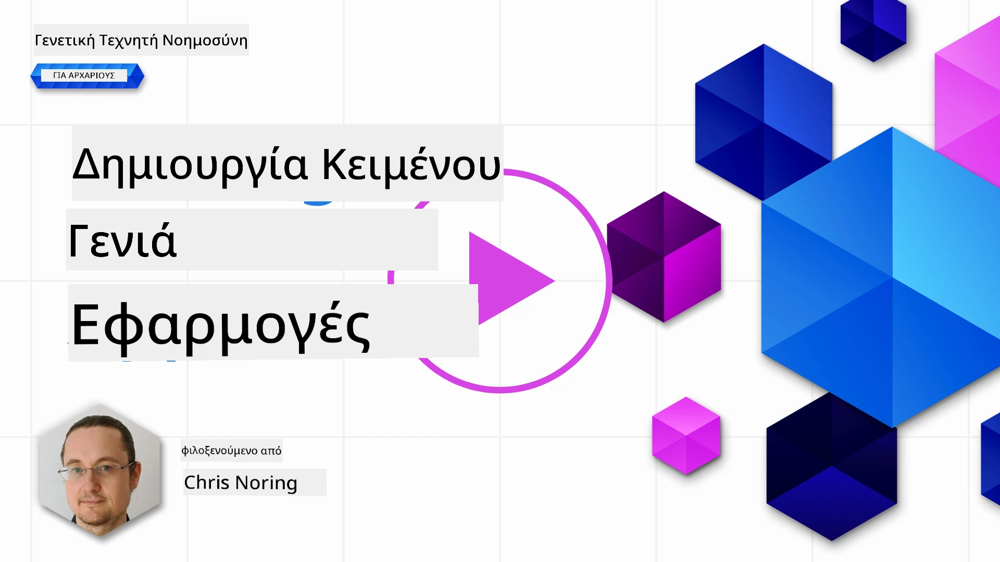

# Δημιουργία Εφαρμογών Γεννήτριας Κειμένου

[](https://youtu.be/0Y5Luf5sRQA?si=t_xVg0clnAI4oUFZ)

> _(Κάντε κλικ στην παραπάνω εικόνα για να δείτε το βίντεο αυτού του μαθήματος)_

Έχετε δει μέχρι τώρα μέσα από αυτό το πρόγραμμα σπουδών ότι υπάρχουν βασικές έννοιες όπως οι προτροπές (prompts) και ακόμη μια ολόκληρη επιστήμη που ονομάζεται "μηχανική προτροπών" (prompt engineering). Πολλά εργαλεία με τα οποία μπορείτε να αλληλεπιδράσετε, όπως το ChatGPT, το Office 365, το Microsoft Power Platform και άλλα, σας υποστηρίζουν με τη χρήση προτροπών για να επιτύχετε κάποιο αποτέλεσμα.

Για να προσθέσετε μια τέτοια εμπειρία σε μια εφαρμογή, πρέπει να κατανοήσετε έννοιες όπως οι προτροπές, οι ολοκληρώσεις (completions) και να επιλέξετε μια βιβλιοθήκη για να δουλέψετε. Αυτό είναι ακριβώς που θα μάθετε σε αυτό το κεφάλαιο.

## Εισαγωγή

Σε αυτό το κεφάλαιο, θα:

- Μάθετε για τη βιβλιοθήκη openai και τις βασικές της έννοιες.
- Δημιουργήσετε μια εφαρμογή γεννήτριας κειμένου χρησιμοποιώντας το openai.
- Κατανοήσετε πώς να χρησιμοποιείτε έννοιες όπως προτροπή, θερμοκρασία και tokens για να δημιουργήσετε μια εφαρμογή γεννήτριας κειμένου.

## Στόχοι μάθησης

Στο τέλος αυτού του μαθήματος, θα μπορείτε να:

- Εξηγήσετε τι είναι μια εφαρμογή γεννήτριας κειμένου.
- Δημιουργήσετε μια εφαρμογή γεννήτριας κειμένου χρησιμοποιώντας το openai.
- Διαμορφώσετε την εφαρμογή σας ώστε να χρησιμοποιεί περισσότερα ή λιγότερα tokens και επίσης να αλλάξετε τη θερμοκρασία, για διαφορετικό αποτέλεσμα.

## Τι είναι μια εφαρμογή γεννήτριας κειμένου;

Κανονικά, όταν δημιουργείτε μια εφαρμογή έχει κάποιο είδος διεπαφής όπως η παρακάτω:

- Βασισμένη σε εντολές. Οι εφαρμογές κονσόλας είναι τυπικές εφαρμογές όπου πληκτρολογείτε μια εντολή και αυτή εκτελεί μια εργασία. Για παράδειγμα, το `git` είναι μια εφαρμογή βασισμένη σε εντολές.
- Διεπαφή χρήστη (UI). Κάποιες εφαρμογές έχουν γραφικές διεπαφές χρήστη (GUIs) όπου πατάτε κουμπιά, εισάγετε κείμενο, επιλέγετε επιλογές και άλλα.

### Οι εφαρμογές Κονσόλας και UI έχουν περιορισμούς

Συγκρίνετέ το με μια εφαρμογή βασισμένη σε εντολές όπου πληκτρολογείτε μια εντολή:

- **Είναι περιορισμένη**. Δεν μπορείτε απλά να πληκτρολογήσετε οποιαδήποτε εντολή, μόνο αυτές που υποστηρίζει η εφαρμογή.
- **Ειδική γλώσσα**. Κάποιες εφαρμογές υποστηρίζουν πολλές γλώσσες, αλλά κατά προεπιλογή η εφαρμογή δημιουργείται για μια συγκεκριμένη γλώσσα, ακόμη κι αν μπορείτε να προσθέσετε περισσότερες γλωσσικές υποστηρίξεις.

### Οφέλη των εφαρμογών γεννήτριας κειμένου

Πώς διαφέρει λοιπόν μια εφαρμογή γεννήτριας κειμένου;

Σε μια εφαρμογή γεννήτριας κειμένου, έχετε μεγαλύτερη ευελιξία, δεν περιορίζεστε σε ένα σύνολο εντολών ή σε συγκεκριμένη γλώσσα εισόδου. Αντίθετα, μπορείτε να χρησιμοποιήσετε φυσική γλώσσα για να αλληλεπιδράσετε με την εφαρμογή. Ένα άλλο όφελος είναι ότι ήδη αλληλεπιδράτε με μια πηγή δεδομένων που έχει εκπαιδευτεί σε ένα τεράστιο σώμα πληροφοριών, ενώ μια παραδοσιακή εφαρμογή μπορεί να περιορίζεται σε αυτά που περιέχει μια βάση δεδομένων.

### Τι μπορώ να δημιουργήσω με μια εφαρμογή γεννήτριας κειμένου;

Υπάρχουν πολλά πράγματα που μπορείτε να δημιουργήσετε. Για παράδειγμα:

- **Ένας chatbot**. Ένας chatbot που απαντά σε ερωτήσεις σχετικά με θέματα, όπως η εταιρεία σας και τα προϊόντα της, θα μπορούσε να είναι μια καλή εφαρμογή.
- **Βοηθός**. Τα LLMs τα καταφέρνουν εξαιρετικά σε πράγματα όπως η συνοπτική παρουσίαση κειμένου, η λήψη πληροφοριών από κείμενο, η παραγωγή κειμένου όπως βιογραφικά και πολλά άλλα.
- **Βοηθός κώδικα**. Ανάλογα με το γλωσσικό μοντέλο που χρησιμοποιείτε, μπορείτε να δημιουργήσετε έναν βοηθό κώδικα που σας βοηθά να γράφετε κώδικα. Για παράδειγμα, μπορείτε να χρησιμοποιήσετε προϊόντα όπως το GitHub Copilot καθώς και το ChatGPT για να σας βοηθήσουν να γράψετε κώδικα.

## Πώς μπορώ να ξεκινήσω;

Λοιπόν, πρέπει να βρείτε έναν τρόπο να ενσωματωθείτε με ένα LLM που συνήθως συνεπάγεται τις εξής δύο προσεγγίσεις:

- Χρήση API. Εδώ κατασκευάζετε αιτήματα ιστού με την προτροπή σας και λαμβάνετε πίσω παραγόμενο κείμενο.
- Χρήση βιβλιοθήκης. Οι βιβλιοθήκες βοηθούν να περικλείσουν τις κλήσεις API και να τις κάνουν πιο εύχρηστες.

## Βιβλιοθήκες/SDKs

Υπάρχουν μερικές γνωστές βιβλιοθήκες για εργασία με LLMs όπως:

- **openai**, αυτή η βιβλιοθήκη κάνει εύκολη τη σύνδεση στο μοντέλο σας και την αποστολή προτροπών.

Υπάρχουν επίσης βιβλιοθήκες που λειτουργούν σε ανώτερο επίπεδο όπως:

- **Langchain**. Το Langchain είναι γνωστό και υποστηρίζει Python.
- **Semantic Kernel**. Το Semantic Kernel είναι μια βιβλιοθήκη της Microsoft που υποστηρίζει τις γλώσσες C#, Python και Java.

## Πρώτη εφαρμογή με χρήση openai

Ας δούμε πώς μπορούμε να δημιουργήσουμε την πρώτη μας εφαρμογή, ποιες βιβλιοθήκες χρειαζόμαστε, πόσο απαιτείται κ.λπ.

### Εγκατάσταση openai

Υπάρχουν πολλές βιβλιοθήκες εκεί έξω για αλληλεπίδραση με το OpenAI ή το Azure OpenAI. Είναι δυνατόν να χρησιμοποιηθούν πολλές γλώσσες προγραμματισμού όπως C#, Python, JavaScript, Java και άλλες. Επιλέξαμε να χρησιμοποιήσουμε τη βιβλιοθήκη Python `openai`, οπότε θα χρησιμοποιήσουμε το `pip` για να την εγκαταστήσουμε.

```bash
pip install openai
```

### Δημιουργία πόρου

Πρέπει να κάνετε τα εξής βήματα:

- Δημιουργήστε λογαριασμό στο Azure [https://azure.microsoft.com/free/](https://azure.microsoft.com/free/?WT.mc_id=academic-105485-koreyst).
- Αποκτήστε πρόσβαση στο Azure OpenAI. Μεταβείτε στο [https://learn.microsoft.com/azure/ai-services/openai/overview#how-do-i-get-access-to-azure-openai](https://learn.microsoft.com/azure/ai-services/openai/overview#how-do-i-get-access-to-azure-openai?WT.mc_id=academic-105485-koreyst) και ζητήστε πρόσβαση.

  > [!NOTE]
  > Την ώρα που γράφονται αυτές οι γραμμές, χρειάζεται να κάνετε αίτηση για πρόσβαση στο Azure OpenAI.

- Εγκαταστήστε το Python <https://www.python.org/>
- Έχετε δημιουργήσει έναν πόρο Azure OpenAI Service. Δείτε αυτόν τον οδηγό για το πώς να [δημιουργήσετε πόρο](https://learn.microsoft.com/azure/ai-services/openai/how-to/create-resource?pivots=web-portal?WT.mc_id=academic-105485-koreyst).

### Εντοπισμός κλειδιού API και endpoint

Σε αυτό το σημείο, πρέπει να ενημερώσετε τη βιβλιοθήκη `openai` ποιο κλειδί API να χρησιμοποιήσει. Για να βρείτε το κλειδί API σας, μεταβείτε στην ενότητα "Keys and Endpoint" του πόρου Azure OpenAI και αντιγράψτε την τιμή του "Key 1".


Τώρα που έχετε αυτές τις πληροφορίες αντιγραμμένες, ας δώσουμε οδηγίες στις βιβλιοθήκες να τις χρησιμοποιήσουν.

> [!NOTE]
> Αξίζει να διαχωρίσετε το κλειδί API από τον κώδικά σας. Μπορείτε να το κάνετε χρησιμοποιώντας μεταβλητές περιβάλλοντος.
>
> - Ορίστε τη μεταβλητή περιβάλλοντος `OPENAI_API_KEY` στο κλειδί API σας.
>   `export OPENAI_API_KEY='sk-...'`

### Ρύθμιση παραμέτρων Azure

Αν χρησιμοποιείτε το Azure OpenAI, δείτε πώς ρυθμίζετε την παραμετροποίηση:

```python
openai.api_type = 'azure'
openai.api_key = os.environ["OPENAI_API_KEY"]
openai.api_version = '2023-05-15'
openai.api_base = os.getenv("API_BASE")
```

Εδώ ορίζουμε τα εξής:

- `api_type` σε `azure`. Αυτό λέει στη βιβλιοθήκη να χρησιμοποιεί το Azure OpenAI και όχι το OpenAI.
- `api_key`, αυτό είναι το κλειδί API που βρήκατε στο Azure Portal.
- `api_version`, αυτή είναι η έκδοση του API που θέλετε να χρησιμοποιήσετε. Την ώρα που γράφονται αυτές οι γραμμές, η πιο πρόσφατη έκδοση είναι η `2023-05-15`.
- `api_base`, αυτό είναι το endpoint του API. Μπορείτε να το βρείτε στο Azure Portal δίπλα στο κλειδί API σας.

> [!NOTE] > Η συνάρτηση `os.getenv` διαβάζει μεταβλητές περιβάλλοντος. Μπορείτε να τη χρησιμοποιήσετε για την ανάγνωση μεταβλητών περιβάλλοντος όπως `OPENAI_API_KEY` και `API_BASE`. Ορίστε αυτές τις μεταβλητές περιβάλλοντος στο τερματικό ή χρησιμοποιώντας βιβλιοθήκη όπως το `dotenv`.

## Δημιουργία κειμένου

Ο τρόπος για να δημιουργήσετε κείμενο είναι να χρησιμοποιήσετε την κλάση `Completion`. Να ένα παράδειγμα:

```python
prompt = "Complete the following: Once upon a time there was a"

completion = openai.Completion.create(model="davinci-002", prompt=prompt)
print(completion.choices[0].text)
```

Στον παραπάνω κώδικα, δημιουργούμε ένα αντικείμενο completion και περνάμε το μοντέλο που θέλουμε να χρησιμοποιήσουμε και την προτροπή. Στη συνέχεια, τυπώνουμε το παραγόμενο κείμενο.

### Συμπληρώσεις συνομιλίας (Chat completions)

Μέχρι τώρα, έχετε δει πώς χρησιμοποιούμε το `Completion` για να δημιουργήσουμε κείμενο. Αλλά υπάρχει άλλη μια κλάση που ονομάζεται `ChatCompletion` που ταιριάζει καλύτερα σε chatbots. Δείτε ένα παράδειγμα χρήσης της:

```python
import openai

openai.api_key = "sk-..."

completion = openai.ChatCompletion.create(model="gpt-3.5-turbo", messages=[{"role": "user", "content": "Hello world"}])
print(completion.choices[0].message.content)
```

Περισσότερα για αυτή τη λειτουργικότητα σε επόμενο κεφάλαιο.

## Άσκηση - η πρώτη σας εφαρμογή γεννήτριας κειμένου

Τώρα που μάθαμε πώς να ρυθμίσουμε και να διαμορφώσουμε το openai, είναι ώρα να φτιάξετε την πρώτη σας εφαρμογή γεννήτριας κειμένου. Για να φτιάξετε την εφαρμογή σας, ακολουθήστε αυτά τα βήματα:

1. Δημιουργήστε ένα virtual environment και εγκαταστήστε το openai:

   ```bash
   python -m venv venv
   source venv/bin/activate
   pip install openai
   ```

   > [!NOTE]
   > Αν χρησιμοποιείτε Windows πληκτρολογήστε `venv\Scripts\activate` αντί για `source venv/bin/activate`.

   > [!NOTE]
   > Εντοπίστε το κλειδί Azure OpenAI μεταβαίνοντας στο [https://portal.azure.com/](https://portal.azure.com/?WT.mc_id=academic-105485-koreyst) και κάντε αναζήτηση για `Open AI`, επιλέξτε τον `Open AI resource` και μετά την `Keys and Endpoint` και αντιγράψτε την τιμή του `Key 1`.

1. Δημιουργήστε ένα αρχείο _app.py_ και βάλτε τον ακόλουθο κώδικα:

   ```python
   import openai

   openai.api_key = "<replace this value with your open ai key or Azure OpenAI key>"

   openai.api_type = 'azure'
   openai.api_version = '2023-05-15'
   openai.api_base = "<endpoint found in Azure Portal where your API key is>"
   deployment_name = "<deployment name>"

   # προσθέστε τον κώδικα ολοκλήρωσής σας
   prompt = "Complete the following: Once upon a time there was a"
   messages = [{"role": "user", "content": prompt}]

   # κάντε ολοκλήρωση
   completion = openai.chat.completions.create(model=deployment_name, messages=messages)

   # εκτυπώστε την απόκριση
   print(completion.choices[0].message.content)
   ```

   > [!NOTE]
   > Αν χρησιμοποιείτε Azure OpenAI, πρέπει να ορίσετε το `api_type` σε `azure` και το `api_key` στο κλειδί Azure OpenAI.

   Θα δείτε μια έξοδο όπως η παρακάτω:

   ```output
    very unhappy _____.

   Once upon a time there was a very unhappy mermaid.
   ```

## Διάφοροι τύποι προτροπών, για διαφορετικά πράγματα

Τώρα έχετε δει πώς να δημιουργήσετε κείμενο χρησιμοποιώντας μια προτροπή. Έχετε ακόμη και ένα πρόγραμμα σε λειτουργία που μπορείτε να τροποποιήσετε και να αλλάξετε για να δημιουργήσετε διάφορους τύπους κειμένου.

Οι προτροπές μπορούν να χρησιμοποιηθούν για κάθε είδους εργασίες. Για παράδειγμα:

- **Δημιουργία τύπου κειμένου**. Για παράδειγμα, μπορείτε να δημιουργήσετε ένα ποίημα, ερωτήσεις για κουίζ κ.ά.
- **Αναζήτηση πληροφορίας**. Μπορείτε να χρησιμοποιήσετε προτροπές για να αναζητήσετε πληροφορίες όπως παράδειγμα: 'Τι σημαίνει CORS στην ανάπτυξη ιστοσελίδων;'.
- **Δημιουργία κώδικα**. Μπορείτε να χρησιμοποιήσετε προτροπές για να δημιουργήσετε κώδικα, για παράδειγμα να αναπτύξετε κανονική έκφραση (regex) που χρησιμοποιείται για την επικύρωση e-mails ή γιατί όχι να δημιουργήσετε ολόκληρη εφαρμογή web;

## Ένα πιο πρακτικό παράδειγμα: γεννήτρια συνταγών

Φανταστείτε πως έχετε υλικά στο σπίτι και θέλετε να μαγειρέψετε κάτι. Για αυτό, χρειάζεστε μια συνταγή. Ένας τρόπος να βρείτε συνταγές είναι να χρησιμοποιήσετε μια μηχανή αναζήτησης ή να χρησιμοποιήσετε ένα LLM.

Μπορείτε να γράψετε μια προτροπή ως εξής:

> "Δείξε μου 5 συνταγές για ένα πιάτο με τα ακόλουθα υλικά: κοτόπουλο, πατάτες και καρότα. Ανά συνταγή, λίστα όλα τα υλικά που χρησιμοποιούνται"

Βάσει της παραπάνω προτροπής, μπορεί να λάβετε μια απάντηση παρόμοια με:

```output
1. Roasted Chicken and Vegetables:
Ingredients:
- 4 chicken thighs
- 2 potatoes, cut into cubes
- 2 carrots, cut into cubes
- 2 tablespoons olive oil
- 2 cloves garlic, minced
- 1 teaspoon dried thyme
- 1 teaspoon dried oregano
- Salt and pepper, to taste

2. Chicken and Potato Stew:
Ingredients:
- 2 tablespoons olive oil
- 1 onion, diced
- 2 cloves garlic, minced
- 2 chicken breasts, cut into cubes
- 2 potatoes, cut into cubes
- 2 carrots, cut into cubes
- 1 teaspoon dried oregano
- 1 teaspoon dried thyme
- 1 cup chicken broth
- Salt and pepper, to taste

3. Chicken and Potato Bake:
Ingredients:
- 2 tablespoons olive oil
- 2 chicken breasts, cut into cubes
- 2 potatoes, cut into cubes
- 2 carrots, cut into cubes
- 1 onion, diced
- 2 cloves garlic, minced
- 1 teaspoon dried oregano
- 1 teaspoon dried thyme
- 1 cup chicken broth
- Salt and pepper, to taste

4. Chicken and Potato Soup:
Ingredients:
- 2 tablespoons olive oil
- 1 onion, diced
- 2 cloves garlic, minced
- 2 chicken breasts, cut into cubes
- 2 potatoes, cut into cubes
- 2 carrots, cut into cubes
- 1 teaspoon dried oregano
- 1 teaspoon dried thyme
- 4 cups chicken broth
- Salt and pepper, to taste

5. Chicken and Potato Hash:
Ingredients:
- 2 tablespoons olive oil
- 2 chicken breasts, cut into cubes
- 2 potatoes, cut into cubes
- 2 carrots, cut into cubes
- 1 onion, diced
- 2 cloves garlic, minced
- 1 teaspoon dried oregano
```

Αυτή η απάντηση είναι εξαιρετική, ξέρω τι να μαγειρέψω. Σε αυτό το σημείο, τι θα μπορούσαν να είναι χρήσιμες βελτιώσεις είναι:

- Φιλτράρισμα υλικών που δεν μου αρέσουν ή είμαι αλλεργικός.
- Παραγωγή λίστας αγορών, σε περίπτωση που δεν έχω όλα τα υλικά στο σπίτι.

Για τις παραπάνω περιπτώσεις, ας προσθέσουμε μια επιπλέον προτροπή:

> "Παρακαλώ αφαίρεσε τις συνταγές με σκόρδο καθώς είμαι αλλεργικός και αντικατέστησέ το με κάτι άλλο. Επίσης, δημιούργησε μια λίστα αγορών για τις συνταγές, λαμβάνοντας υπόψη ότι έχω ήδη κοτόπουλο, πατάτες και καρότα στο σπίτι."

Τώρα έχετε ένα νέο αποτέλεσμα, συγκεκριμένα:

```output
1. Roasted Chicken and Vegetables:
Ingredients:
- 4 chicken thighs
- 2 potatoes, cut into cubes
- 2 carrots, cut into cubes
- 2 tablespoons olive oil
- 1 teaspoon dried thyme
- 1 teaspoon dried oregano
- Salt and pepper, to taste

2. Chicken and Potato Stew:
Ingredients:
- 2 tablespoons olive oil
- 1 onion, diced
- 2 chicken breasts, cut into cubes
- 2 potatoes, cut into cubes
- 2 carrots, cut into cubes
- 1 teaspoon dried oregano
- 1 teaspoon dried thyme
- 1 cup chicken broth
- Salt and pepper, to taste

3. Chicken and Potato Bake:
Ingredients:
- 2 tablespoons olive oil
- 2 chicken breasts, cut into cubes
- 2 potatoes, cut into cubes
- 2 carrots, cut into cubes
- 1 onion, diced
- 1 teaspoon dried oregano
- 1 teaspoon dried thyme
- 1 cup chicken broth
- Salt and pepper, to taste

4. Chicken and Potato Soup:
Ingredients:
- 2 tablespoons olive oil
- 1 onion, diced
- 2 chicken breasts, cut into cubes
- 2 potatoes, cut into cubes
- 2 carrots, cut into cubes
- 1 teaspoon dried oregano
- 1 teaspoon dried thyme
- 4 cups chicken broth
- Salt and pepper, to taste

5. Chicken and Potato Hash:
Ingredients:
- 2 tablespoons olive oil
- 2 chicken breasts, cut into cubes
- 2 potatoes, cut into cubes
- 2 carrots, cut into cubes
- 1 onion, diced
- 1 teaspoon dried oregano

Shopping List:
- Olive oil
- Onion
- Thyme
- Oregano
- Salt
- Pepper
```

Αυτές είναι οι πέντε συνταγές σας, χωρίς να αναφέρεται σκόρδο και έχετε επίσης λίστα αγορών λαμβάνοντας υπόψη τι ήδη έχετε στο σπίτι.

## Άσκηση - δημιουργήστε μια γεννήτρια συνταγών

Τώρα που έπαιξαμε ένα σενάριο, ας γράψουμε κώδικα για να ταιριάξει στο συγκεκριμένο σενάριο. Για να το κάνετε αυτό, ακολουθήστε τα εξής βήματα:

1. Χρησιμοποιήστε το υπάρχον αρχείο _app.py_ ως σημείο εκκίνησης
1. Εντοπίστε τη μεταβλητή `prompt` και αλλάξτε τον κώδικά της ως εξής:

   ```python
   prompt = "Show me 5 recipes for a dish with the following ingredients: chicken, potatoes, and carrots. Per recipe, list all the ingredients used"
   ```

   Αν εκτελέσετε τώρα τον κώδικα, θα πρέπει να δείτε μια έξοδο παρόμοια με:

   ```output
   -Chicken Stew with Potatoes and Carrots: 3 tablespoons oil, 1 onion, chopped, 2 cloves garlic, minced, 1 carrot, peeled and chopped, 1 potato, peeled and chopped, 1 bay leaf, 1 thyme sprig, 1/2 teaspoon salt, 1/4 teaspoon black pepper, 1 1/2 cups chicken broth, 1/2 cup dry white wine, 2 tablespoons chopped fresh parsley, 2 tablespoons unsalted butter, 1 1/2 pounds boneless, skinless chicken thighs, cut into 1-inch pieces
   -Oven-Roasted Chicken with Potatoes and Carrots: 3 tablespoons extra-virgin olive oil, 1 tablespoon Dijon mustard, 1 tablespoon chopped fresh rosemary, 1 tablespoon chopped fresh thyme, 4 cloves garlic, minced, 1 1/2 pounds small red potatoes, quartered, 1 1/2 pounds carrots, quartered lengthwise, 1/2 teaspoon salt, 1/4 teaspoon black pepper, 1 (4-pound) whole chicken
   -Chicken, Potato, and Carrot Casserole: cooking spray, 1 large onion, chopped, 2 cloves garlic, minced, 1 carrot, peeled and shredded, 1 potato, peeled and shredded, 1/2 teaspoon dried thyme leaves, 1/4 teaspoon salt, 1/4 teaspoon black pepper, 2 cups fat-free, low-sodium chicken broth, 1 cup frozen peas, 1/4 cup all-purpose flour, 1 cup 2% reduced-fat milk, 1/4 cup grated Parmesan cheese

   -One Pot Chicken and Potato Dinner: 2 tablespoons olive oil, 1 pound boneless, skinless chicken thighs, cut into 1-inch pieces, 1 large onion, chopped, 3 cloves garlic, minced, 1 carrot, peeled and chopped, 1 potato, peeled and chopped, 1 bay leaf, 1 thyme sprig, 1/2 teaspoon salt, 1/4 teaspoon black pepper, 2 cups chicken broth, 1/2 cup dry white wine

   -Chicken, Potato, and Carrot Curry: 1 tablespoon vegetable oil, 1 large onion, chopped, 2 cloves garlic, minced, 1 carrot, peeled and chopped, 1 potato, peeled and chopped, 1 teaspoon ground coriander, 1 teaspoon ground cumin, 1/2 teaspoon ground turmeric, 1/2 teaspoon ground ginger, 1/4 teaspoon cayenne pepper, 2 cups chicken broth, 1/2 cup dry white wine, 1 (15-ounce) can chickpeas, drained and rinsed, 1/2 cup raisins, 1/2 cup chopped fresh cilantro
   ```

   > ΣΗΜΕΙΩΣΗ, το LLM σας είναι μη ντετερμινιστικό, οπότε μπορεί να λάβετε διαφορετικά αποτελέσματα κάθε φορά που τρέχετε το πρόγραμμα.

   Τέλεια, ας δούμε πώς μπορούμε να βελτιώσουμε τα πράγματα. Για να βελτιώσουμε, θέλουμε να βεβαιωθούμε πως ο κώδικας είναι ευέλικτος, ώστε τα υλικά και ο αριθμός των συνταγών να μπορούν να βελτιωθούν και να αλλάξουν.

1. Ας αλλάξουμε τον κώδικα ως εξής:

   ```python
   no_recipes = input("No of recipes (for example, 5): ")

   ingredients = input("List of ingredients (for example, chicken, potatoes, and carrots): ")

   # παρεμβάλετε τον αριθμό των συνταγών στο prompt και στα συστατικά
   prompt = f"Show me {no_recipes} recipes for a dish with the following ingredients: {ingredients}. Per recipe, list all the ingredients used"
   ```

   Το να τρέξετε δοκιμαστικά τον κώδικα, θα μπορούσε να μοιάζει έτσι:

   ```output
   No of recipes (for example, 5): 3
   List of ingredients (for example, chicken, potatoes, and carrots): milk,strawberries

   -Strawberry milk shake: milk, strawberries, sugar, vanilla extract, ice cubes
   -Strawberry shortcake: milk, flour, baking powder, sugar, salt, unsalted butter, strawberries, whipped cream
   -Strawberry milk: milk, strawberries, sugar, vanilla extract
   ```

### Βελτίωση με προσθήκη φίλτρου και λίστας αγορών

Τώρα έχουμε μια λειτουργική εφαρμογή ικανή να παράγει συνταγές και είναι ευέλικτη καθώς βασίζεται σε εισόδους από το χρήστη, τόσο στον αριθμό των συνταγών όσο και στα υλικά που χρησιμοποιούνται.

Για να την βελτιώσουμε περισσότερο, θέλουμε να προσθέσουμε τα εξής:

- **Φιλτράρισμα υλικών**. Θέλουμε να μπορούμε να φιλτράρουμε υλικά που δεν μας αρέσουν ή είμαστε αλλεργικοί. Για να πετύχουμε αυτή την αλλαγή, μπορούμε να επεξεργαστούμε την υπάρχουσα προτροπή και να προσθέσουμε μια συνθήκη φίλτρου στο τέλος της ως εξής:

  ```python
  filter = input("Filter (for example, vegetarian, vegan, or gluten-free): ")

  prompt = f"Show me {no_recipes} recipes for a dish with the following ingredients: {ingredients}. Per recipe, list all the ingredients used, no {filter}"
  ```

  Πάνω, προσθέτουμε το `{filter}` στο τέλος της προτροπής και επίσης καταγράφουμε την τιμή του φίλτρου από το χρήστη.

  Ένα παράδειγμα εισόδου εκτέλεσης του προγράμματος τώρα μπορεί να μοιάζει έτσι:

  ```output
  No of recipes (for example, 5): 3
  List of ingredients (for example, chicken, potatoes, and carrots): onion,milk
  Filter (for example, vegetarian, vegan, or gluten-free): no milk

  1. French Onion Soup

  Ingredients:

  -1 large onion, sliced
  -3 cups beef broth
  -1 cup milk
  -6 slices french bread
  -1/4 cup shredded Parmesan cheese
  -1 tablespoon butter
  -1 teaspoon dried thyme
  -1/4 teaspoon salt
  -1/4 teaspoon black pepper

  Instructions:

  1. In a large pot, sauté onions in butter until golden brown.
  2. Add beef broth, milk, thyme, salt, and pepper. Bring to a boil.
  3. Reduce heat and simmer for 10 minutes.
  4. Place french bread slices on soup bowls.
  5. Ladle soup over bread.
  6. Sprinkle with Parmesan cheese.

  2. Onion and Potato Soup

  Ingredients:

  -1 large onion, chopped
  -2 cups potatoes, diced
  -3 cups vegetable broth
  -1 cup milk
  -1/4 teaspoon black pepper

  Instructions:

  1. In a large pot, sauté onions in butter until golden brown.
  2. Add potatoes, vegetable broth, milk, and pepper. Bring to a boil.
  3. Reduce heat and simmer for 10 minutes.
  4. Serve hot.

  3. Creamy Onion Soup

  Ingredients:

  -1 large onion, chopped
  -3 cups vegetable broth
  -1 cup milk
  -1/4 teaspoon black pepper
  -1/4 cup all-purpose flour
  -1/2 cup shredded Parmesan cheese

  Instructions:

  1. In a large pot, sauté onions in butter until golden brown.
  2. Add vegetable broth, milk, and pepper. Bring to a boil.
  3. Reduce heat and simmer for 10 minutes.
  4. In a small bowl, whisk together flour and Parmesan cheese until smooth.
  5. Add to soup and simmer for an additional 5 minutes, or until soup has thickened.
  ```

  Όπως βλέπετε, οποιεσδήποτε συνταγές με γάλα έχουν φιλτραριστεί. Αλλά, αν είστε δυσανεκτικός στη λακτόζη, ενδέχεται να θέλετε να φιλτράρετε συνταγές με τυρί επίσης, οπότε υπάρχει ανάγκη να το ξεκαθαρίσουμε.

- **Παραγωγή λίστας αγορών**. Θέλουμε να παράγουμε μια λίστα αγορών, λαμβάνοντας υπόψη τι έχουμε ήδη στο σπίτι.

  Για αυτή τη λειτουργία, θα μπορούσαμε να προσπαθήσουμε να λύσουμε τα πάντα με μία προτροπή ή να το χωρίσουμε σε δύο προτροπές. Ας δοκιμάσουμε τη δεύτερη προσέγγιση. Εδώ προτείνουμε να προσθέσετε μια επιπλέον προτροπή, αλλά για να λειτουργήσει αυτό, πρέπει να προσθέσουμε το αποτέλεσμα της πρώτης προτροπής ως πλαίσιο (context) στη δεύτερη.

  Εντοπίστε το σημείο στον κώδικα που εκτυπώνει το αποτέλεσμα από την πρώτη προτροπή και προσθέστε τον ακόλουθο κώδικα παρακάτω:

  ```python
  old_prompt_result = completion.choices[0].message.content
  prompt = "Produce a shopping list for the generated recipes and please don't include ingredients that I already have."

  new_prompt = f"{old_prompt_result} {prompt}"
  messages = [{"role": "user", "content": new_prompt}]
  completion = openai.Completion.create(engine=deployment_name, messages=messages, max_tokens=1200)

  # εκτύπωση απόκρισης
  print("Shopping list:")
  print(completion.choices[0].message.content)
  ```

  Σημειώστε τα εξής:
  1. Κατασκευάζουμε ένα νέο prompt προσθέτοντας το αποτέλεσμα από το πρώτο prompt στο νέο prompt:

     ```python
     new_prompt = f"{old_prompt_result} {prompt}"
     ```

  1. Κάνουμε ένα νέο αίτημα, λαμβάνοντας όμως υπόψη τον αριθμό των tokens που ζητήσαμε στο πρώτο prompt, οπότε αυτή τη φορά λέμε ότι το `max_tokens` είναι 1200.

     ```python
     completion = openai.Completion.create(engine=deployment_name, prompt=new_prompt, max_tokens=1200)
     ```

     Δοκιμάζοντας αυτόν τον κώδικα, φτάνουμε τώρα στην ακόλουθη έξοδο:

     ```output
     No of recipes (for example, 5): 2
     List of ingredients (for example, chicken, potatoes, and carrots): apple,flour
     Filter (for example, vegetarian, vegan, or gluten-free): sugar


     -Apple and flour pancakes: 1 cup flour, 1/2 tsp baking powder, 1/2 tsp baking soda, 1/4 tsp salt, 1 tbsp sugar, 1 egg, 1 cup buttermilk or sour milk, 1/4 cup melted butter, 1 Granny Smith apple, peeled and grated
     -Apple fritters: 1-1/2 cups flour, 1 tsp baking powder, 1/4 tsp salt, 1/4 tsp baking soda, 1/4 tsp nutmeg, 1/4 tsp cinnamon, 1/4 tsp allspice, 1/4 cup sugar, 1/4 cup vegetable shortening, 1/4 cup milk, 1 egg, 2 cups shredded, peeled apples
     Shopping list:
     -Flour, baking powder, baking soda, salt, sugar, egg, buttermilk, butter, apple, nutmeg, cinnamon, allspice
     ```

## Βελτιώστε τη ρύθμισή σας

Αυτό που έχουμε μέχρι στιγμής είναι κώδικας που λειτουργεί, αλλά υπάρχουν κάποιες ρυθμίσεις που θα πρέπει να κάνουμε για να βελτιώσουμε περαιτέρω τα πράγματα. Μερικά πράγματα που θα πρέπει να κάνουμε είναι:

- **Διαχωρίστε τα μυστικά από τον κώδικα**, όπως το κλειδί API. Τα μυστικά δεν ανήκουν στον κώδικα και θα πρέπει να αποθηκεύονται σε ένα ασφαλές μέρος. Για να διαχωρίσουμε τα μυστικά από τον κώδικα, μπορούμε να χρησιμοποιήσουμε μεταβλητές περιβάλλοντος και βιβλιοθήκες όπως το `python-dotenv` για να τα φορτώνουμε από ένα αρχείο. Δείτε πώς θα έμοιαζε αυτό στον κώδικα:

  1. Δημιουργήστε ένα αρχείο `.env` με το ακόλουθο περιεχόμενο:

     ```bash
     OPENAI_API_KEY=sk-...
     ```

     > Σημείωση, για το Azure, πρέπει να ορίσετε τις ακόλουθες μεταβλητές περιβάλλοντος:

     ```bash
     OPENAI_API_TYPE=azure
     OPENAI_API_VERSION=2023-05-15
     OPENAI_API_BASE=<replace>
     ```

     Στον κώδικα, θα φορτίζατε τις μεταβλητές περιβάλλοντος ως εξής:

     ```python
     from dotenv import load_dotenv

     load_dotenv()

     openai.api_key = os.environ["OPENAI_API_KEY"]
     ```

- **Μια λέξη για το μήκος των tokens**. Πρέπει να εξετάσουμε πόσα tokens χρειαζόμαστε για να παράγουμε το επιθυμητό κείμενο. Τα tokens κοστίζουν χρήματα, οπότε όπου είναι δυνατό, πρέπει να είμαστε οικονομικοί με τον αριθμό των tokens που χρησιμοποιούμε. Για παράδειγμα, μπορούμε να διατυπώσουμε το prompt ώστε να χρησιμοποιούμε λιγότερα tokens;

  Για να αλλάξετε τα tokens που χρησιμοποιούνται, μπορείτε να χρησιμοποιήσετε την παράμετρο `max_tokens`. Για παράδειγμα, αν θέλετε να χρησιμοποιήσετε 100 tokens, θα κάνετε:

  ```python
  completion = client.chat.completions.create(model=deployment, messages=messages, max_tokens=100)
  ```

- **Πειραματισμός με τη θερμοκρασία**. Η θερμοκρασία είναι κάτι που δεν έχουμε αναφέρει μέχρι τώρα, αλλά είναι ένα σημαντικό πλαίσιο για το πώς λειτουργεί το πρόγραμμα μας. Όσο μεγαλύτερη είναι η τιμή της θερμοκρασίας, τόσο πιο τυχαία θα είναι η έξοδος. Αντίθετα, όσο μικρότερη είναι η τιμή της θερμοκρασίας, τόσο πιο προβλέψιμη θα είναι η έξοδος. Σκεφτείτε αν θέλετε ποικιλία στην έξοδό σας ή όχι.

  Για να αλλάξετε τη θερμοκρασία, μπορείτε να χρησιμοποιήσετε την παράμετρο `temperature`. Για παράδειγμα, αν θέλετε να χρησιμοποιήσετε θερμοκρασία 0.5, θα κάνετε:

  ```python
  completion = client.chat.completions.create(model=deployment, messages=messages, temperature=0.5)
  ```

  > Σημείωση, όσο πιο κοντά στο 1.0, τόσο πιο πολυποίκιλη είναι η έξοδος.

## Εργασία

Για αυτή την εργασία, μπορείτε να επιλέξετε τι θα δημιουργήσετε.

Ακολουθούν μερικές προτάσεις:

- Βελτιώστε περαιτέρω την εφαρμογή δημιουργίας συνταγών. Πειραματιστείτε με τις τιμές της θερμοκρασίας και τα prompts για να δείτε τι μπορείτε να φτιάξετε.
- Δημιουργήστε έναν "φίλο μελέτης". Αυτή η εφαρμογή θα πρέπει να μπορεί να απαντά σε ερωτήσεις σχετικά με ένα θέμα, για παράδειγμα Python, θα μπορούσατε να έχετε prompts όπως "Τι είναι ένα συγκεκριμένο θέμα στην Python;", ή ένα prompt που λέει, δείξε μου κώδικα για ένα συγκεκριμένο θέμα κλπ.
- Bot ιστορίας, κάντε την ιστορία να ζωντανέψει, διδάξτε το bot να υποδύεται έναν συγκεκριμένο ιστορικό χαρακτήρα και κάντε του ερωτήσεις για τη ζωή και τις εποχές του.

## Λύση

### Φίλος μελέτης

Παρακάτω είναι ένα αρχικό prompt, δείτε πώς μπορείτε να το χρησιμοποιήσετε και να το τροποποιήσετε κατά βούληση.

```text
- "You're an expert on the Python language

    Suggest a beginner lesson for Python in the following format:

    Format:
    - concepts:
    - brief explanation of the lesson:
    - exercise in code with solutions"
```

### Bot ιστορίας

Εδώ είναι μερικά prompts που θα μπορούσατε να χρησιμοποιήσετε:

```text
- "You are Abe Lincoln, tell me about yourself in 3 sentences, and respond using grammar and words like Abe would have used"
- "You are Abe Lincoln, respond using grammar and words like Abe would have used:

   Tell me about your greatest accomplishments, in 300 words"
```

## Έλεγχος γνώσεων

Τι κάνει η παράμετρος θερμοκρασία;

1. Ελέγχει πόσο τυχαία είναι η έξοδος.
1. Ελέγχει πόσο μεγάλη είναι η απάντηση.
1. Ελέγχει πόσα tokens χρησιμοποιούνται.

## 🚀 Πρόκληση

Όταν εργάζεστε στην εργασία, προσπαθήστε να μεταβάλλετε τη θερμοκρασία, δοκιμάστε τις τιμές 0, 0.5 και 1. Θυμηθείτε ότι το 0 είναι το λιγότερο ποικίλο και το 1 το περισσότερο. Ποια τιμή λειτουργεί καλύτερα για την εφαρμογή σας;

## Εξαιρετική δουλειά! Συνεχίστε τη μάθηση σας

Μετά την ολοκλήρωση αυτού του μαθήματος, ρίξτε μια ματιά στη [Συλλογή Εκμάθησης Γεννητικής Τεχνητής Νοημοσύνης](https://aka.ms/genai-collection?WT.mc_id=academic-105485-koreyst) για να συνεχίσετε να αναβαθμίζετε τις γνώσεις σας στη Γεννητική Τεχνητή Νοημοσύνη!

Μεταβείτε στο Μάθημα 7 όπου θα εξετάσουμε πώς να [δημιουργούμε εφαρμογές συνομιλίας](../07-building-chat-applications/README.md?WT.mc_id=academic-105485-koreyst)!

---

<!-- CO-OP TRANSLATOR DISCLAIMER START -->
**Αποποίηση ευθυνών**:
Αυτό το έγγραφο έχει μεταφραστεί χρησιμοποιώντας την υπηρεσία μετάφρασης με τεχνητή νοημοσύνη [Co-op Translator](https://github.com/Azure/co-op-translator). Ενώ επιδιώκουμε την ακρίβεια, παρακαλούμε να έχετε υπόψη ότι οι αυτοματοποιημένες μεταφράσεις ενδέχεται να περιέχουν λάθη ή ανακρίβειες. Το πρωτότυπο έγγραφο στη μητρική του γλώσσα πρέπει να θεωρείται η αυθεντική πηγή. Για κρίσιμες πληροφορίες, συνιστάται επαγγελματική ανθρώπινη μετάφραση. Δεν φέρουμε ευθύνη για τυχόν παρεξηγήσεις ή λανθασμένες ερμηνείες που προκύπτουν από τη χρήση αυτής της μετάφρασης.
<!-- CO-OP TRANSLATOR DISCLAIMER END -->