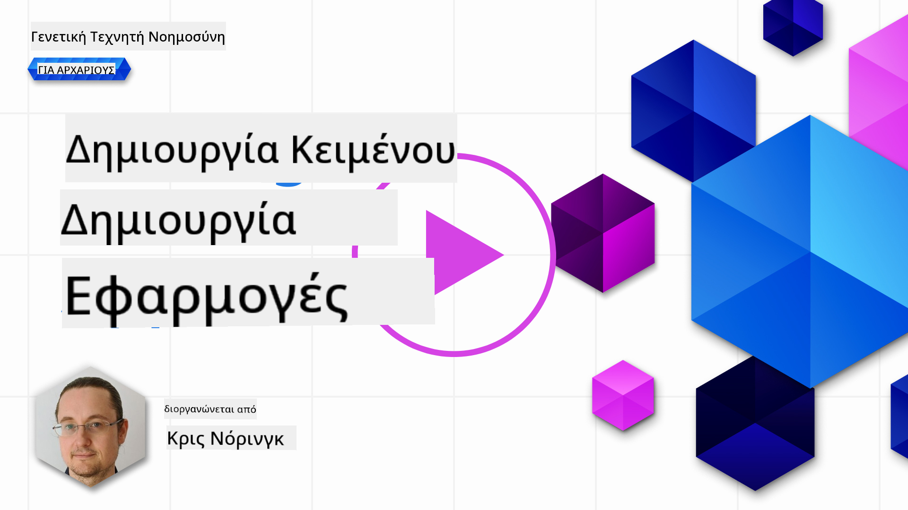

<!--
CO_OP_TRANSLATOR_METADATA:
{
  "original_hash": "5ec6c92b629564538ef397c550adb73e",
  "translation_date": "2025-06-25T14:26:04+00:00",
  "source_file": "06-text-generation-apps/README.md",
  "language_code": "el"
}
-->
# Δημιουργία Εφαρμογών Παραγωγής Κειμένου

[](https://aka.ms/gen-ai-lesson6-gh?WT.mc_id=academic-105485-koreyst)

> _(Κάντε κλικ στην παραπάνω εικόνα για να παρακολουθήσετε το βίντεο αυτού του μαθήματος)_

Μέχρι στιγμής έχετε δει σε αυτό το πρόγραμμα σπουδών ότι υπάρχουν βασικές έννοιες όπως οι προτροπές και ακόμη και ολόκληρη μια επιστήμη που ονομάζεται "μηχανική προτροπής". Πολλά εργαλεία με τα οποία μπορείτε να αλληλεπιδράσετε όπως το ChatGPT, το Office 365, το Microsoft Power Platform και άλλα, σας υποστηρίζουν στη χρήση προτροπών για να πετύχετε κάτι.

Για να προσθέσετε μια τέτοια εμπειρία σε μια εφαρμογή, πρέπει να κατανοήσετε έννοιες όπως οι προτροπές, οι ολοκληρώσεις και να επιλέξετε μια βιβλιοθήκη με την οποία να εργαστείτε. Αυτό ακριβώς θα μάθετε σε αυτό το κεφάλαιο.

## Εισαγωγή

Σε αυτό το κεφάλαιο, θα:

- Μάθετε για τη βιβλιοθήκη openai και τις βασικές της έννοιες.
- Δημιουργήσετε μια εφαρμογή παραγωγής κειμένου χρησιμοποιώντας το openai.
- Κατανοήσετε πώς να χρησιμοποιήσετε έννοιες όπως προτροπή, θερμοκρασία και tokens για να δημιουργήσετε μια εφαρμογή παραγωγής κειμένου.

## Στόχοι μάθησης

Στο τέλος αυτού του μαθήματος, θα μπορείτε να:

- Εξηγήσετε τι είναι μια εφαρμογή παραγωγής κειμένου.
- Δημιουργήσετε μια εφαρμογή παραγωγής κειμένου χρησιμοποιώντας το openai.
- Ρυθμίσετε την εφαρμογή σας να χρησιμοποιεί περισσότερα ή λιγότερα tokens και επίσης να αλλάξετε τη θερμοκρασία, για ποικιλία στο αποτέλεσμα.

## Τι είναι μια εφαρμογή παραγωγής κειμένου;

Συνήθως όταν δημιουργείτε μια εφαρμογή έχει κάποιο είδος διεπαφής όπως η ακόλουθη:

- Βασισμένη σε εντολές. Οι εφαρμογές κονσόλας είναι τυπικές εφαρμογές όπου πληκτρολογείτε μια εντολή και αυτή εκτελεί μια εργασία. Για παράδειγμα, το `git` είναι μια εφαρμογή βασισμένη σε εντολές.
- Διεπαφή χρήστη (UI). Ορισμένες εφαρμογές έχουν γραφικές διεπαφές χρήστη (GUIs) όπου κάνετε κλικ σε κουμπιά, εισάγετε κείμενο, επιλέγετε επιλογές και άλλα.

### Οι εφαρμογές κονσόλας και UI είναι περιορισμένες

Συγκρίνετε το με μια εφαρμογή βασισμένη σε εντολές όπου πληκτρολογείτε μια εντολή:

- **Είναι περιορισμένο**. Δεν μπορείτε να πληκτρολογήσετε οποιαδήποτε εντολή, μόνο αυτές που υποστηρίζει η εφαρμογή.
- **Ειδική γλώσσα**. Ορισμένες εφαρμογές υποστηρίζουν πολλές γλώσσες, αλλά από προεπιλογή η εφαρμογή είναι κατασκευασμένη για μια συγκεκριμένη γλώσσα, ακόμη και αν μπορείτε να προσθέσετε περισσότερη υποστήριξη γλώσσας.

### Οφέλη των εφαρμογών παραγωγής κειμένου

Πώς είναι λοιπόν διαφορετική μια εφαρμογή παραγωγής κειμένου;

Σε μια εφαρμογή παραγωγής κειμένου, έχετε περισσότερη ευελιξία, δεν είστε περιορισμένοι σε ένα σύνολο εντολών ή σε μια συγκεκριμένη γλώσσα εισόδου. Αντίθετα, μπορείτε να χρησιμοποιήσετε φυσική γλώσσα για να αλληλεπιδράσετε με την εφαρμογή. Ένα άλλο όφελος είναι ότι επειδή αλληλεπιδράτε ήδη με μια πηγή δεδομένων που έχει εκπαιδευτεί σε ένα ευρύ φάσμα πληροφοριών, ενώ μια παραδοσιακή εφαρμογή μπορεί να είναι περιορισμένη σε ό,τι υπάρχει σε μια βάση δεδομένων.

### Τι μπορώ να δημιουργήσω με μια εφαρμογή παραγωγής κειμένου;

Υπάρχουν πολλά πράγματα που μπορείτε να δημιουργήσετε. Για παράδειγμα:

- **Ένα chatbot**. Ένα chatbot που απαντά σε ερωτήσεις σχετικά με θέματα, όπως η εταιρεία σας και τα προϊόντα της, θα μπορούσε να είναι μια καλή επιλογή.
- **Βοηθός**. Τα LLMs είναι εξαιρετικά σε πράγματα όπως η περίληψη κειμένου, η άντληση πληροφοριών από κείμενο, η παραγωγή κειμένου όπως βιογραφικά και άλλα.
- **Βοηθός κώδικα**. Ανάλογα με το μοντέλο γλώσσας που χρησιμοποιείτε, μπορείτε να δημιουργήσετε έναν βοηθό κώδικα που σας βοηθά να γράφετε κώδικα. Για παράδειγμα, μπορείτε να χρησιμοποιήσετε ένα προϊόν όπως το GitHub Copilot καθώς και το ChatGPT για να σας βοηθήσει να γράψετε κώδικα.

## Πώς μπορώ να ξεκινήσω;

Λοιπόν, πρέπει να βρείτε έναν τρόπο να ενσωματωθείτε με ένα LLM που συνήθως περιλαμβάνει τις ακόλουθες δύο προσεγγίσεις:

- Χρησιμοποιήστε ένα API. Εδώ δημιουργείτε αιτήματα ιστού με την προτροπή σας και λαμβάνετε πίσω το παραγόμενο κείμενο.
- Χρησιμοποιήστε μια βιβλιοθήκη. Οι βιβλιοθήκες βοηθούν στην ενσωμάτωση των κλήσεων API και τις καθιστούν ευκολότερες στη χρήση.

## Βιβλιοθήκες/SDKs

Υπάρχουν μερικές γνωστές βιβλιοθήκες για εργασία με LLMs όπως:

- **openai**, αυτή η βιβλιοθήκη καθιστά εύκολη τη σύνδεση με το μοντέλο σας και την αποστολή προτροπών.

Στη συνέχεια υπάρχουν βιβλιοθήκες που λειτουργούν σε υψηλότερο επίπεδο όπως:

- **Langchain**. Το Langchain είναι γνωστό και υποστηρίζει την Python.
- **Semantic Kernel**. Το Semantic Kernel είναι μια βιβλιοθήκη της Microsoft που υποστηρίζει τις γλώσσες C#, Python και Java.

## Πρώτη εφαρμογή χρησιμοποιώντας openai

Ας δούμε πώς μπορούμε να δημιουργήσουμε την πρώτη μας εφαρμογή, ποιες βιβλιοθήκες χρειαζόμαστε, πόσο απαιτείται και ούτω καθεξής.

### Εγκατάσταση openai

Υπάρχουν πολλές βιβλιοθήκες εκεί έξω για αλληλεπίδραση με το OpenAI ή το Azure OpenAI. Είναι δυνατό να χρησιμοποιηθούν πολλές γλώσσες προγραμματισμού όπως C#, Python, JavaScript, Java και άλλα. Έχουμε επιλέξει να χρησιμοποιήσουμε τη βιβλιοθήκη `openai` Python, οπότε θα χρησιμοποιήσουμε `pip` για να την εγκαταστήσουμε.

```bash
pip install openai
```

### Δημιουργία πόρου

Πρέπει να εκτελέσετε τα ακόλουθα βήματα:

- Δημιουργήστε έναν λογαριασμό στο Azure [https://azure.microsoft.com/free/](https://azure.microsoft.com/free/?WT.mc_id=academic-105485-koreyst).
- Αποκτήστε πρόσβαση στο Azure OpenAI. Μεταβείτε στο [https://learn.microsoft.com/azure/ai-services/openai/overview#how-do-i-get-access-to-azure-openai](https://learn.microsoft.com/azure/ai-services/openai/overview#how-do-i-get-access-to-azure-openai?WT.mc_id=academic-105485-koreyst) και ζητήστε πρόσβαση.

  > [!NOTE]
  > Κατά τη στιγμή της γραφής, πρέπει να υποβάλετε αίτηση για πρόσβαση στο Azure OpenAI.

- Εγκαταστήστε την Python <https://www.python.org/>
- Δημιουργήστε έναν πόρο Azure OpenAI Service. Δείτε αυτόν τον οδηγό για το πώς να [δημιουργήσετε έναν πόρο](https://learn.microsoft.com/azure/ai-services/openai/how-to/create-resource?pivots=web-portal?WT.mc_id=academic-105485-koreyst).

### Εντοπισμός κλειδιού API και endpoint

Σε αυτό το σημείο, πρέπει να πείτε στη βιβλιοθήκη `openai` ποιο κλειδί API να χρησιμοποιήσει. Για να βρείτε το κλειδί API σας, μεταβείτε στην ενότητα "Κλειδιά και Endpoint" του πόρου σας Azure OpenAI και αντιγράψτε την τιμή "Key 1".


Τώρα που έχετε αντιγράψει αυτές τις πληροφορίες, ας δώσουμε οδηγίες στις βιβλιοθήκες να τις χρησιμοποιήσουν.

> [!NOTE]
> Αξίζει να διαχωρίσετε το κλειδί API σας από τον κώδικά σας. Μπορείτε να το κάνετε αυτό χρησιμοποιώντας μεταβλητές περιβάλλοντος.
>
> - Ορίστε τη μεταβλητή περιβάλλοντος `OPENAI_API_KEY` to your API key.
>   `export OPENAI_API_KEY='sk-...'`

### Ρύθμιση παραμέτρων Azure

Αν χρησιμοποιείτε το Azure OpenAI, δείτε πώς να ρυθμίσετε τις παραμέτρους:

```python
openai.api_type = 'azure'
openai.api_key = os.environ["OPENAI_API_KEY"]
openai.api_version = '2023-05-15'
openai.api_base = os.getenv("API_BASE")
```

Πάνω ρυθμίζουμε τα εξής:

- `api_type` to `azure`. This tells the library to use Azure OpenAI and not OpenAI.
- `api_key`, this is your API key found in the Azure Portal.
- `api_version`, this is the version of the API you want to use. At the time of writing, the latest version is `2023-05-15`.
- `api_base`, this is the endpoint of the API. You can find it in the Azure Portal next to your API key.

> [!NOTE] > `os.getenv` is a function that reads environment variables. You can use it to read environment variables like `OPENAI_API_KEY` and `API_BASE`. Set these environment variables in your terminal or by using a library like `dotenv`.

## Generate text

The way to generate text is to use the `Completion` class. Δείτε ένα παράδειγμα:

```python
prompt = "Complete the following: Once upon a time there was a"

completion = openai.Completion.create(model="davinci-002", prompt=prompt)
print(completion.choices[0].text)
```

Στον παραπάνω κώδικα, δημιουργούμε ένα αντικείμενο ολοκλήρωσης και περνάμε το μοντέλο που θέλουμε να χρησιμοποιήσουμε και την προτροπή. Στη συνέχεια, εκτυπώνουμε το παραγόμενο κείμενο.

### Ολοκληρώσεις συνομιλίας

Μέχρι στιγμής, έχετε δει πώς χρησιμοποιούμε το `Completion` to generate text. But there's another class called `ChatCompletion` που είναι πιο κατάλληλο για chatbots. Δείτε ένα παράδειγμα χρήσης του:

```python
import openai

openai.api_key = "sk-..."

completion = openai.ChatCompletion.create(model="gpt-3.5-turbo", messages=[{"role": "user", "content": "Hello world"}])
print(completion.choices[0].message.content)
```

Περισσότερα για αυτή τη λειτουργικότητα σε ένα επερχόμενο κεφάλαιο.

## Άσκηση - η πρώτη σας εφαρμογή παραγωγής κειμένου

Τώρα που μάθαμε πώς να ρυθμίσουμε και να παραμετροποιήσουμε το openai, ήρθε η ώρα να δημιουργήσετε την πρώτη σας εφαρμογή παραγωγής κειμένου. Για να δημιουργήσετε την εφαρμογή σας, ακολουθήστε αυτά τα βήματα:

1. Δημιουργήστε ένα εικονικό περιβάλλον και εγκαταστήστε το openai:

   ```bash
   python -m venv venv
   source venv/bin/activate
   pip install openai
   ```

   > [!NOTE]
   > Αν χρησιμοποιείτε Windows πληκτρολογήστε `venv\Scripts\activate` instead of `source venv/bin/activate`.

   > [!NOTE]
   > Locate your Azure OpenAI key by going to [https://portal.azure.com/](https://portal.azure.com/?WT.mc_id=academic-105485-koreyst) and search for `Open AI` and select the `Open AI resource` and then select `Keys and Endpoint` and copy the `Key 1` value.

1. Δημιουργήστε ένα αρχείο _app.py_ και δώστε του τον ακόλουθο κώδικα:

   ```python
   import openai

   openai.api_key = "<replace this value with your open ai key or Azure OpenAI key>"

   openai.api_type = 'azure'
   openai.api_version = '2023-05-15'
   openai.api_base = "<endpoint found in Azure Portal where your API key is>"
   deployment_name = "<deployment name>"

   # add your completion code
   prompt = "Complete the following: Once upon a time there was a"
   messages = [{"role": "user", "content": prompt}]

   # make completion
   completion = openai.chat.completions.create(model=deployment_name, messages=messages)

   # print response
   print(completion.choices[0].message.content)
   ```

   > [!NOTE]
   > Αν χρησιμοποιείτε Azure OpenAI, πρέπει να ορίσετε το `api_type` to `azure` and set the `api_key` στο κλειδί σας Azure OpenAI.

   Θα πρέπει να δείτε ένα αποτέλεσμα όπως το ακόλουθο:

   ```output
    very unhappy _____.

   Once upon a time there was a very unhappy mermaid.
   ```

## Διάφοροι τύποι προτροπών, για διάφορα πράγματα

Τώρα έχετε δει πώς να δημιουργείτε κείμενο χρησιμοποιώντας μια προτροπή. Έχετε ακόμη και ένα πρόγραμμα που λειτουργεί και μπορείτε να το τροποποιήσετε και να το αλλάξετε για να δημιουργήσετε διαφορετικούς τύπους κειμένου.

Οι προτροπές μπορούν να χρησιμοποιηθούν για κάθε είδους εργασίες. Για παράδειγμα:

- **Δημιουργία τύπου κειμένου**. Για παράδειγμα, μπορείτε να δημιουργήσετε ένα ποίημα, ερωτήσεις για ένα κουίζ κ.λπ.
- **Αναζήτηση πληροφοριών**. Μπορείτε να χρησιμοποιήσετε προτροπές για να αναζητήσετε πληροφορίες όπως το παρακάτω παράδειγμα 'Τι σημαίνει CORS στην ανάπτυξη ιστού;'.
- **Δημιουργία κώδικα**. Μπορείτε να χρησιμοποιήσετε προτροπές για να δημιουργήσετε κώδικα, για παράδειγμα να αναπτύξετε μια κανονική έκφραση που χρησιμοποιείται για την επαλήθευση email ή γιατί όχι να δημιουργήσετε ένα ολόκληρο πρόγραμμα, όπως μια εφαρμογή ιστού;

## Μια πιο πρακτική περίπτωση χρήσης: δημιουργός συνταγών

Φανταστείτε ότι έχετε υλικά στο σπίτι και θέλετε να μαγειρέψετε κάτι. Για αυτό, χρειάζεστε μια συνταγή. Ένας τρόπος για να βρείτε συνταγές είναι να χρησιμοποιήσετε μια μηχανή αναζήτησης ή θα μπορούσατε να χρησιμοποιήσετε ένα LLM για να το κάνετε.

Θα μπορούσατε να γράψετε μια προτροπή όπως η εξής:

> "Δείξε μου 5 συνταγές για ένα πιάτο με τα εξής υλικά: κοτόπουλο, πατάτες και καρότα. Για κάθε συνταγή, απαρίθμησε όλα τα υλικά που χρησιμοποιούνται"

Δεδομένης της παραπάνω προτροπής, μπορεί να λάβετε μια απάντηση όπως:

```output
1. Roasted Chicken and Vegetables:
Ingredients:
- 4 chicken thighs
- 2 potatoes, cut into cubes
- 2 carrots, cut into cubes
- 2 tablespoons olive oil
- 2 cloves garlic, minced
- 1 teaspoon dried thyme
- 1 teaspoon dried oregano
- Salt and pepper, to taste

2. Chicken and Potato Stew:
Ingredients:
- 2 tablespoons olive oil
- 1 onion, diced
- 2 cloves garlic, minced
- 2 chicken breasts, cut into cubes
- 2 potatoes, cut into cubes
- 2 carrots, cut into cubes
- 1 teaspoon dried oregano
- 1 teaspoon dried thyme
- 1 cup chicken broth
- Salt and pepper, to taste

3. Chicken and Potato Bake:
Ingredients:
- 2 tablespoons olive oil
- 2 chicken breasts, cut into cubes
- 2 potatoes, cut into cubes
- 2 carrots, cut into cubes
- 1 onion, diced
- 2 cloves garlic, minced
- 1 teaspoon dried oregano
- 1 teaspoon dried thyme
- 1 cup chicken broth
- Salt and pepper, to taste

4. Chicken and Potato Soup:
Ingredients:
- 2 tablespoons olive oil
- 1 onion, diced
- 2 cloves garlic, minced
- 2 chicken breasts, cut into cubes
- 2 potatoes, cut into cubes
- 2 carrots, cut into cubes
- 1 teaspoon dried oregano
- 1 teaspoon dried thyme
- 4 cups chicken broth
- Salt and pepper, to taste

5. Chicken and Potato Hash:
Ingredients:
- 2 tablespoons olive oil
- 2 chicken breasts, cut into cubes
- 2 potatoes, cut into cubes
- 2 carrots, cut into cubes
- 1 onion, diced
- 2 cloves garlic, minced
- 1 teaspoon dried oregano
```

Αυτό το αποτέλεσμα είναι εξαιρετικό, ξέρω τι να μαγειρέψω. Σε αυτό το σημείο, τι θα μπορούσε να είναι χρήσιμες βελτιώσεις είναι:

- Φιλτράρισμα υλικών που δεν μου αρέσουν ή στα οποία είμαι αλλεργικός.
- Δημιουργία λίστας αγορών, σε περίπτωση που δεν έχω όλα τα υλικά στο σπίτι.

Για τις παραπάνω περιπτώσεις, ας προσθέσουμε μια επιπλέον προτροπή:

> "Παρακαλώ αφαιρέστε τις συνταγές με σκόρδο καθώς είμαι αλλεργικός και αντικαταστήστε το με κάτι άλλο. Επίσης, παρακαλώ δημιουργήστε μια λίστα αγορών για τις συνταγές, λαμβάνοντας υπόψη ότι έχω ήδη κοτόπουλο, πατάτες και καρότα στο σπίτι."

Τώρα έχετε ένα νέο αποτέλεσμα, δηλαδή:

```output
1. Roasted Chicken and Vegetables:
Ingredients:
- 4 chicken thighs
- 2 potatoes, cut into cubes
- 2 carrots, cut into cubes
- 2 tablespoons olive oil
- 1 teaspoon dried thyme
- 1 teaspoon dried oregano
- Salt and pepper, to taste

2. Chicken and Potato Stew:
Ingredients:
- 2 tablespoons olive oil
- 1 onion, diced
- 2 chicken breasts, cut into cubes
- 2 potatoes, cut into cubes
- 2 carrots, cut into cubes
- 1 teaspoon dried oregano
- 1 teaspoon dried thyme
- 1 cup chicken broth
- Salt and pepper, to taste

3. Chicken and Potato Bake:
Ingredients:
- 2 tablespoons olive oil
- 2 chicken breasts, cut into cubes
- 2 potatoes, cut into cubes
- 2 carrots, cut into cubes
- 1 onion, diced
- 1 teaspoon dried oregano
- 1 teaspoon dried thyme
- 1 cup chicken broth
- Salt and pepper, to taste

4. Chicken and Potato Soup:
Ingredients:
- 2 tablespoons olive oil
- 1 onion, diced
- 2 chicken breasts, cut into cubes
- 2 potatoes, cut into cubes
- 2 carrots, cut into cubes
- 1 teaspoon dried oregano
- 1 teaspoon dried thyme
- 4 cups chicken broth
- Salt and pepper, to taste

5. Chicken and Potato Hash:
Ingredients:
- 2 tablespoons olive oil
- 2 chicken breasts, cut into cubes
- 2 potatoes, cut into cubes
- 2 carrots, cut into cubes
- 1 onion, diced
- 1 teaspoon dried oregano

Shopping List:
- Olive oil
- Onion
- Thyme
- Oregano
- Salt
- Pepper
```

Αυτές είναι οι πέντε συνταγές σας, χωρίς να αναφέρεται σκόρδο και έχετε επίσης μια λίστα αγορών λαμβάνοντας υπόψη τι έχετε ήδη στο σπίτι.

## Άσκηση - δημιουργήστε έναν δημιουργό συνταγών

Τώρα που έχουμε παίξει ένα σενάριο, ας γράψουμε κώδικα για να ταιριάζει με το παρουσιασμένο σενάριο. Για να το κάνετε αυτό, ακολουθήστε αυτά τα βήματα:

1. Χρησιμοποιήστε το υπάρχον αρχείο _app.py_ ως σημείο εκκίνησης
1. Εντοπίστε τη μεταβλητή `prompt` και αλλάξτε τον κώδικά της στο ακόλουθο:

   ```python
   prompt = "Show me 5 recipes for a dish with the following ingredients: chicken, potatoes, and carrots. Per recipe, list all the ingredients used"
   ```

   Αν τώρα εκτελέσετε τον κώδικα, θα πρέπει να δείτε ένα αποτέλεσμα παρόμοιο με:

   ```output
   -Chicken Stew with Potatoes and Carrots: 3 tablespoons oil, 1 onion, chopped, 2 cloves garlic, minced, 1 carrot, peeled and chopped, 1 potato, peeled and chopped, 1 bay leaf, 1 thyme sprig, 1/2 teaspoon salt, 1/4 teaspoon black pepper, 1 1/2 cups chicken broth, 1/2 cup dry white wine, 2 tablespoons chopped fresh parsley, 2 tablespoons unsalted butter, 1 1/2 pounds boneless, skinless chicken thighs, cut into 1-inch pieces
   -Oven-Roasted Chicken with Potatoes and Carrots: 3 tablespoons extra-virgin olive oil, 1 tablespoon Dijon mustard, 1 tablespoon chopped fresh rosemary, 1 tablespoon chopped fresh thyme, 4 cloves garlic, minced, 1 1/2 pounds small red potatoes, quartered, 1 1/2 pounds carrots, quartered lengthwise, 1/2 teaspoon salt, 1/4 teaspoon black pepper, 1 (4-pound) whole chicken
   -Chicken, Potato, and Carrot Casserole: cooking spray, 1 large onion, chopped, 2 cloves garlic, minced, 1 carrot, peeled and shredded, 1 potato, peeled and shredded, 1/2 teaspoon dried thyme leaves, 1/4 teaspoon salt, 1/4 teaspoon black pepper, 2 cups fat-free, low-sodium chicken broth, 1 cup frozen peas, 1/4 cup all-purpose flour, 1 cup 2% reduced-fat milk, 1/4 cup grated Parmesan cheese

   -One Pot Chicken and Potato Dinner: 2 tablespoons olive oil, 1 pound boneless, skinless chicken thighs, cut into 1-inch pieces, 1 large onion, chopped, 3 cloves garlic, minced, 1 carrot, peeled and chopped, 1 potato, peeled and chopped, 1 bay leaf, 1 thyme sprig, 1/2 teaspoon salt, 1/4 teaspoon black pepper, 2 cups chicken broth, 1/2 cup dry white wine

   -Chicken, Potato, and Carrot Curry: 1 tablespoon vegetable oil, 1 large onion, chopped, 2 cloves garlic, minced, 1 carrot, peeled and chopped, 1 potato, peeled and chopped, 1 teaspoon ground coriander, 1 teaspoon ground cumin, 1/2 teaspoon ground turmeric, 1/2 teaspoon ground ginger, 1/4 teaspoon cayenne pepper, 2 cups chicken broth, 1/2 cup dry white wine, 1 (15-ounce) can chickpeas, drained and rinsed, 1/2 cup raisins, 1/2 cup chopped fresh cilantro
   ```

   > ΣΗΜΕΙΩΣΗ, το LLM σας είναι μη-καθοριστικό, οπότε μπορεί να λάβετε διαφορετικά αποτελέσματα κάθε φορά που εκτελείτε το πρόγραμμα.

   Εξαιρετικά, ας δούμε πώς μπορούμε να βελτιώσουμε τα πράγματα. Για να βελτιώσουμε τα πράγματα, θέλουμε να διασφαλίσουμε ότι ο κώδικας είναι ευέλικτος, ώστε τα υλικά και ο αριθμός των συνταγών να μπορούν να βελτιωθούν και να αλλάξουν.

1. Ας αλλάξουμε τον κώδικα με τον ακόλουθο τρόπο:

   ```python
   no_recipes = input("No of recipes (for example, 5): ")

   ingredients = input("List of ingredients (for example, chicken, potatoes, and carrots): ")

   # interpolate the number of recipes into the prompt an ingredients
   prompt = f"Show me {no_recipes} recipes for a dish with the following ingredients: {ingredients}. Per recipe, list all the ingredients used"
   ```

   Λαμβάνοντας τον κώδικα για μια δοκιμαστική εκτέλεση, θα μπορούσε να μοιάζει με αυτό:

   ```output
   No of recipes (for example, 5): 3
   List of ingredients (for example, chicken, potatoes, and carrots): milk,strawberries

   -Strawberry milk shake: milk, strawberries, sugar, vanilla extract, ice cubes
   -Strawberry shortcake: milk, flour, baking powder, sugar, salt, unsalted butter, strawberries, whipped cream
   -Strawberry milk: milk, strawberries, sugar, vanilla extract
   ```

### Βελτίωση με την προσθήκη φίλτρου και λίστας αγορών

Τώρα έχουμε μια εφαρμογή που λειτουργεί ικανή να παράγει συνταγές και είναι ευέλικτη καθώς βασίζεται σε εισόδους από τον χρήστη, τόσο στον αριθμό των συνταγών όσο και στα υλικά που χρησιμοποιούνται.

Για να την βελτιώσουμε περαιτέρω, θέλουμε να προσθέσουμε τα εξής:

- **Φιλτράρισμα υλικών**. Θέλουμε να μπορούμε να φιλτράρουμε υλικά που δεν μας αρέσουν ή στα οποία είμαστε αλλεργικοί. Για να επιτύχουμε αυτή την αλλαγή, μπορούμε να επεξεργαστούμε την υπάρχουσα προτροπή μας και να προσθέσουμε μια συνθήκη φίλτρου στο τέλος

**Αποποίηση ευθυνών**:  
Αυτό το έγγραφο έχει μεταφραστεί χρησιμοποιώντας την υπηρεσία αυτόματης μετάφρασης [Co-op Translator](https://github.com/Azure/co-op-translator). Ενώ προσπαθούμε για την ακρίβεια, παρακαλούμε να γνωρίζετε ότι οι αυτοματοποιημένες μεταφράσεις μπορεί να περιέχουν λάθη ή ανακρίβειες. Το αρχικό έγγραφο στη μητρική του γλώσσα θα πρέπει να θεωρείται η αυθεντική πηγή. Για κρίσιμες πληροφορίες, συνιστάται επαγγελματική ανθρώπινη μετάφραση. Δεν είμαστε υπεύθυνοι για τυχόν παρανοήσεις ή παρερμηνείες που προκύπτουν από τη χρήση αυτής της μετάφρασης.