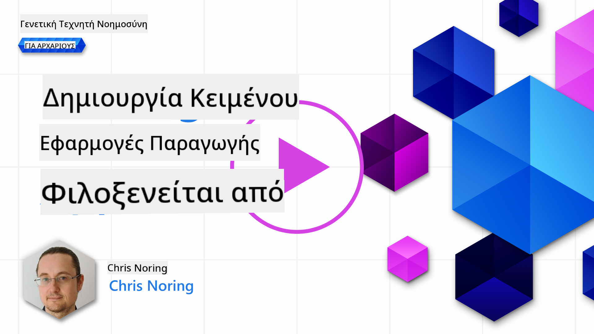

<!--
CO_OP_TRANSLATOR_METADATA:
{
  "original_hash": "ce8224073b86b728ed52b19bed7932fd",
  "translation_date": "2025-07-09T11:58:19+00:00",
  "source_file": "06-text-generation-apps/README.md",
  "language_code": "el"
}
-->
# Δημιουργία Εφαρμογών Γεννήτριας Κειμένου

[](https://aka.ms/gen-ai-lesson6-gh?WT.mc_id=academic-105485-koreyst)

> _(Κάντε κλικ στην εικόνα παραπάνω για να δείτε το βίντεο αυτής της ενότητας)_

Μέχρι τώρα μέσα από αυτό το πρόγραμμα σπουδών έχετε δει ότι υπάρχουν βασικές έννοιες όπως τα prompts και ακόμη και ολόκληρος κλάδος που ονομάζεται "μηχανική των prompts". Πολλά εργαλεία με τα οποία μπορείτε να αλληλεπιδράσετε, όπως το ChatGPT, το Office 365, το Microsoft Power Platform και άλλα, σας υποστηρίζουν χρησιμοποιώντας prompts για να πετύχετε κάτι.

Για να προσθέσετε μια τέτοια εμπειρία σε μια εφαρμογή, πρέπει να κατανοήσετε έννοιες όπως τα prompts, τις ολοκληρώσεις (completions) και να επιλέξετε μια βιβλιοθήκη για να δουλέψετε. Αυτό ακριβώς θα μάθετε σε αυτό το κεφάλαιο.

## Εισαγωγή

Σε αυτό το κεφάλαιο, θα:

- Μάθετε για τη βιβλιοθήκη openai και τις βασικές της έννοιες.
- Δημιουργήσετε μια εφαρμογή γεννήτριας κειμένου χρησιμοποιώντας το openai.
- Κατανοήσετε πώς να χρησιμοποιείτε έννοιες όπως prompt, temperature και tokens για να φτιάξετε μια εφαρμογή γεννήτριας κειμένου.

## Στόχοι μάθησης

Στο τέλος αυτής της ενότητας, θα μπορείτε να:

- Εξηγήσετε τι είναι μια εφαρμογή γεννήτριας κειμένου.
- Δημιουργήσετε μια εφαρμογή γεννήτριας κειμένου χρησιμοποιώντας το openai.
- Ρυθμίσετε την εφαρμογή σας ώστε να χρησιμοποιεί περισσότερα ή λιγότερα tokens και να αλλάζετε τη θερμοκρασία, για πιο ποικίλη έξοδο.

## Τι είναι μια εφαρμογή γεννήτριας κειμένου;

Κανονικά, όταν δημιουργείτε μια εφαρμογή, έχει κάποιο είδος διεπαφής όπως η εξής:

- Βασισμένη σε εντολές. Οι εφαρμογές κονσόλας είναι τυπικές εφαρμογές όπου πληκτρολογείτε μια εντολή και αυτή εκτελεί μια εργασία. Για παράδειγμα, το `git` είναι μια εφαρμογή βασισμένη σε εντολές.
- Διεπαφή χρήστη (UI). Κάποιες εφαρμογές έχουν γραφικές διεπαφές χρήστη (GUIs) όπου κάνετε κλικ σε κουμπιά, εισάγετε κείμενο, επιλέγετε επιλογές και άλλα.

### Οι εφαρμογές κονσόλας και UI έχουν περιορισμούς

Συγκρίνετε το με μια εφαρμογή βασισμένη σε εντολές όπου πληκτρολογείτε μια εντολή:

- **Είναι περιορισμένη**. Δεν μπορείτε απλά να πληκτρολογήσετε οποιαδήποτε εντολή, μόνο αυτές που υποστηρίζει η εφαρμογή.
- **Ειδική γλώσσα**. Κάποιες εφαρμογές υποστηρίζουν πολλές γλώσσες, αλλά από προεπιλογή η εφαρμογή είναι φτιαγμένη για μια συγκεκριμένη γλώσσα, ακόμα κι αν μπορείτε να προσθέσετε υποστήριξη για περισσότερες.

### Πλεονεκτήματα των εφαρμογών γεννήτριας κειμένου

Πώς διαφέρει λοιπόν μια εφαρμογή γεννήτριας κειμένου;

Σε μια εφαρμογή γεννήτριας κειμένου, έχετε μεγαλύτερη ευελιξία, δεν περιορίζεστε σε ένα σύνολο εντολών ή σε μια συγκεκριμένη γλώσσα εισόδου. Αντίθετα, μπορείτε να χρησιμοποιήσετε φυσική γλώσσα για να αλληλεπιδράσετε με την εφαρμογή. Ένα ακόμα πλεονέκτημα είναι ότι επειδή αλληλεπιδράτε ήδη με μια πηγή δεδομένων που έχει εκπαιδευτεί σε ένα τεράστιο σώμα πληροφοριών, ενώ μια παραδοσιακή εφαρμογή μπορεί να περιορίζεται σε ό,τι υπάρχει σε μια βάση δεδομένων.

### Τι μπορώ να φτιάξω με μια εφαρμογή γεννήτριας κειμένου;

Υπάρχουν πολλά πράγματα που μπορείτε να δημιουργήσετε. Για παράδειγμα:

- **Ένα chatbot**. Ένα chatbot που απαντά σε ερωτήσεις για θέματα, όπως η εταιρεία σας και τα προϊόντα της, θα μπορούσε να είναι μια καλή επιλογή.
- **Βοηθό**. Τα LLMs είναι εξαιρετικά σε πράγματα όπως η περίληψη κειμένου, η εξαγωγή πληροφοριών από κείμενο, η παραγωγή κειμένου όπως βιογραφικά και άλλα.
- **Βοηθό κώδικα**. Ανάλογα με το γλωσσικό μοντέλο που χρησιμοποιείτε, μπορείτε να φτιάξετε έναν βοηθό κώδικα που σας βοηθά να γράφετε κώδικα. Για παράδειγμα, μπορείτε να χρησιμοποιήσετε προϊόντα όπως το GitHub Copilot καθώς και το ChatGPT για να σας βοηθήσουν να γράψετε κώδικα.

## Πώς μπορώ να ξεκινήσω;

Πρέπει να βρείτε έναν τρόπο να ενσωματωθείτε με ένα LLM, που συνήθως περιλαμβάνει τις εξής δύο προσεγγίσεις:

- Χρήση API. Εδώ κατασκευάζετε αιτήματα web με το prompt σας και λαμβάνετε πίσω το παραγόμενο κείμενο.
- Χρήση βιβλιοθήκης. Οι βιβλιοθήκες βοηθούν να κρύψετε τις κλήσεις API και να τις κάνετε πιο εύκολες στη χρήση.

## Βιβλιοθήκες/SDKs

Υπάρχουν μερικές γνωστές βιβλιοθήκες για εργασία με LLMs όπως:

- **openai**, αυτή η βιβλιοθήκη κάνει εύκολη τη σύνδεση με το μοντέλο σας και την αποστολή prompts.

Έπειτα υπάρχουν βιβλιοθήκες που λειτουργούν σε υψηλότερο επίπεδο όπως:

- **Langchain**. Το Langchain είναι γνωστό και υποστηρίζει Python.
- **Semantic Kernel**. Το Semantic Kernel είναι μια βιβλιοθήκη της Microsoft που υποστηρίζει τις γλώσσες C#, Python και Java.

## Πρώτη εφαρμογή με χρήση openai

Ας δούμε πώς μπορούμε να φτιάξουμε την πρώτη μας εφαρμογή, ποιες βιβλιοθήκες χρειαζόμαστε, πόσο απαιτείται και λοιπά.

### Εγκατάσταση openai

Υπάρχουν πολλές βιβλιοθήκες για αλληλεπίδραση με το OpenAI ή το Azure OpenAI. Είναι δυνατή η χρήση πολλών γλωσσών προγραμματισμού όπως C#, Python, JavaScript, Java και άλλες. Επιλέξαμε να χρησιμοποιήσουμε τη βιβλιοθήκη `openai` για Python, οπότε θα χρησιμοποιήσουμε το `pip` για να την εγκαταστήσουμε.

```bash
pip install openai
```

### Δημιουργία πόρου

Πρέπει να ακολουθήσετε τα εξής βήματα:

- Δημιουργήστε λογαριασμό στο Azure [https://azure.microsoft.com/free/](https://azure.microsoft.com/free/?WT.mc_id=academic-105485-koreyst).
- Αποκτήστε πρόσβαση στο Azure OpenAI. Μεταβείτε στο [https://learn.microsoft.com/azure/ai-services/openai/overview#how-do-i-get-access-to-azure-openai](https://learn.microsoft.com/azure/ai-services/openai/overview#how-do-i-get-access-to-azure-openai?WT.mc_id=academic-105485-koreyst) και ζητήστε πρόσβαση.

  > [!NOTE]
  > Τη στιγμή που γράφεται αυτό, πρέπει να κάνετε αίτηση για πρόσβαση στο Azure OpenAI.

- Εγκαταστήστε Python <https://www.python.org/>
- Έχετε δημιουργήσει έναν πόρο Azure OpenAI Service. Δείτε αυτόν τον οδηγό για το πώς να [δημιουργήσετε πόρο](https://learn.microsoft.com/azure/ai-services/openai/how-to/create-resource?pivots=web-portal?WT.mc_id=academic-105485-koreyst).

### Εντοπισμός κλειδιού API και endpoint

Σε αυτό το σημείο, πρέπει να πείτε στη βιβλιοθήκη `openai` ποιο κλειδί API να χρησιμοποιήσει. Για να βρείτε το κλειδί API, μεταβείτε στην ενότητα "Keys and Endpoint" του πόρου Azure OpenAI και αντιγράψτε την τιμή "Key 1".


Τώρα που έχετε αντιγράψει αυτές τις πληροφορίες, ας δώσουμε οδηγίες στις βιβλιοθήκες να τις χρησιμοποιήσουν.

> [!NOTE]
> Αξίζει να διαχωρίσετε το κλειδί API από τον κώδικά σας. Μπορείτε να το κάνετε χρησιμοποιώντας μεταβλητές περιβάλλοντος.
>
> - Ορίστε τη μεταβλητή περιβάλλοντος `OPENAI_API_KEY` στο κλειδί API σας.
>   `export OPENAI_API_KEY='sk-...'`

### Ρύθμιση παραμέτρων Azure

Αν χρησιμοποιείτε Azure OpenAI, έτσι ρυθμίζετε την παραμετροποίηση:

```python
openai.api_type = 'azure'
openai.api_key = os.environ["OPENAI_API_KEY"]
openai.api_version = '2023-05-15'
openai.api_base = os.getenv("API_BASE")
```

Παραπάνω ορίζουμε τα εξής:

- `api_type` σε `azure`. Αυτό λέει στη βιβλιοθήκη να χρησιμοποιήσει το Azure OpenAI και όχι το OpenAI.
- `api_key`, αυτό είναι το κλειδί API που βρήκατε στο Azure Portal.
- `api_version`, αυτή είναι η έκδοση του API που θέλετε να χρησιμοποιήσετε. Τη στιγμή που γράφεται αυτό, η πιο πρόσφατη έκδοση είναι η `2023-05-15`.
- `api_base`, αυτό είναι το endpoint του API. Μπορείτε να το βρείτε στο Azure Portal δίπλα στο κλειδί API σας.

> [!NOTE] > Η `os.getenv` είναι μια συνάρτηση που διαβάζει μεταβλητές περιβάλλοντος. Μπορείτε να τη χρησιμοποιήσετε για να διαβάσετε μεταβλητές όπως `OPENAI_API_KEY` και `API_BASE`. Ορίστε αυτές τις μεταβλητές στο τερματικό σας ή χρησιμοποιώντας μια βιβλιοθήκη όπως το `dotenv`.

## Δημιουργία κειμένου

Ο τρόπος για να δημιουργήσετε κείμενο είναι να χρησιμοποιήσετε την κλάση `Completion`. Να ένα παράδειγμα:

```python
prompt = "Complete the following: Once upon a time there was a"

completion = openai.Completion.create(model="davinci-002", prompt=prompt)
print(completion.choices[0].text)
```

Στον παραπάνω κώδικα, δημιουργούμε ένα αντικείμενο completion και περνάμε το μοντέλο που θέλουμε να χρησιμοποιήσουμε και το prompt. Έπειτα τυπώνουμε το παραγόμενο κείμενο.

### Συνομιλίες (Chat completions)

Μέχρι τώρα, έχετε δει πώς χρησιμοποιούμε το `Completion` για να δημιουργήσουμε κείμενο. Αλλά υπάρχει μια άλλη κλάση που ονομάζεται `ChatCompletion` και είναι πιο κατάλληλη για chatbots. Να ένα παράδειγμα χρήσης της:

```python
import openai

openai.api_key = "sk-..."

completion = openai.ChatCompletion.create(model="gpt-3.5-turbo", messages=[{"role": "user", "content": "Hello world"}])
print(completion.choices[0].message.content)
```

Περισσότερα για αυτή τη λειτουργία σε επόμενο κεφάλαιο.

## Άσκηση - η πρώτη σας εφαρμογή γεννήτριας κειμένου

Τώρα που μάθαμε πώς να ρυθμίσουμε και να παραμετροποιήσουμε το openai, ήρθε η ώρα να φτιάξετε την πρώτη σας εφαρμογή γεννήτριας κειμένου. Για να φτιάξετε την εφαρμογή, ακολουθήστε τα βήματα:

1. Δημιουργήστε ένα εικονικό περιβάλλον και εγκαταστήστε το openai:

   ```bash
   python -m venv venv
   source venv/bin/activate
   pip install openai
   ```

   > [!NOTE]
   > Αν χρησιμοποιείτε Windows, πληκτρολογήστε `venv\Scripts\activate` αντί για `source venv/bin/activate`.

   > [!NOTE]
   > Εντοπίστε το κλειδί Azure OpenAI πηγαίνοντας στο [https://portal.azure.com/](https://portal.azure.com/?WT.mc_id=academic-105485-koreyst), αναζητήστε `Open AI`, επιλέξτε τον πόρο `Open AI resource` και μετά επιλέξτε `Keys and Endpoint` και αντιγράψτε την τιμή `Key 1`.

1. Δημιουργήστε ένα αρχείο _app.py_ και βάλτε τον παρακάτω κώδικα:

   ```python
   import openai

   openai.api_key = "<replace this value with your open ai key or Azure OpenAI key>"

   openai.api_type = 'azure'
   openai.api_version = '2023-05-15'
   openai.api_base = "<endpoint found in Azure Portal where your API key is>"
   deployment_name = "<deployment name>"

   # add your completion code
   prompt = "Complete the following: Once upon a time there was a"
   messages = [{"role": "user", "content": prompt}]

   # make completion
   completion = openai.chat.completions.create(model=deployment_name, messages=messages)

   # print response
   print(completion.choices[0].message.content)
   ```

   > [!NOTE]
   > Αν χρησιμοποιείτε Azure OpenAI, πρέπει να ορίσετε το `api_type` σε `azure` και το `api_key` στο κλειδί Azure OpenAI.

   Θα δείτε μια έξοδο όπως η παρακάτω:

   ```output
    very unhappy _____.

   Once upon a time there was a very unhappy mermaid.
   ```

## Διαφορετικοί τύποι prompts, για διαφορετικές χρήσεις

Τώρα έχετε δει πώς να δημιουργείτε κείμενο χρησιμοποιώντας ένα prompt. Έχετε ακόμη ένα πρόγραμμα σε λειτουργία που μπορείτε να τροποποιήσετε και να αλλάξετε για να παράγετε διαφορετικούς τύπους κειμένου.

Τα prompts μπορούν να χρησιμοποιηθούν για κάθε είδους εργασίες. Για παράδειγμα:

- **Δημιουργία τύπου κειμένου**. Για παράδειγμα, μπορείτε να δημιουργήσετε ένα ποίημα, ερωτήσεις για κουίζ κ.ά.
- **Αναζήτηση πληροφοριών**. Μπορείτε να χρησιμοποιήσετε prompts για να αναζητήσετε πληροφορίες όπως το παράδειγμα 'Τι σημαίνει CORS στην ανάπτυξη ιστοσελίδων;'.
- **Δημιουργία κώδικα**. Μπορείτε να χρησιμοποιήσετε prompts για να δημιουργήσετε κώδικα, για παράδειγμα να αναπτύξετε μια κανονική έκφραση για την επικύρωση email ή γιατί όχι να δημιουργήσετε ολόκληρο πρόγραμμα, όπως μια web εφαρμογή;

## Μια πιο πρακτική περίπτωση: γεννήτρια συνταγών

Φανταστείτε ότι έχετε υλικά στο σπίτι και θέλετε να μαγειρέψετε κάτι. Για αυτό χρειάζεστε μια συνταγή. Ένας τρόπος να βρείτε συνταγές είναι να χρησιμοποιήσετε μια μηχανή αναζήτησης ή να χρησιμοποιήσετε ένα LLM για αυτό.

Μπορείτε να γράψετε ένα prompt ως εξής:

> "Δείξε μου 5 συνταγές για πιάτο με τα εξής υλικά: κοτόπουλο, πατάτες και καρότα. Για κάθε συνταγή, να αναφέρονται όλα τα υλικά που χρησιμοποιούνται"

Με το παραπάνω prompt, μπορεί να λάβετε μια απάντηση παρόμοια με:

```output
1. Roasted Chicken and Vegetables:
Ingredients:
- 4 chicken thighs
- 2 potatoes, cut into cubes
- 2 carrots, cut into cubes
- 2 tablespoons olive oil
- 2 cloves garlic, minced
- 1 teaspoon dried thyme
- 1 teaspoon dried oregano
- Salt and pepper, to taste

2. Chicken and Potato Stew:
Ingredients:
- 2 tablespoons olive oil
- 1 onion, diced
- 2 cloves garlic, minced
- 2 chicken breasts, cut into cubes
- 2 potatoes, cut into cubes
- 2 carrots, cut into cubes
- 1 teaspoon dried oregano
- 1 teaspoon dried thyme
- 1 cup chicken broth
- Salt and pepper, to taste

3. Chicken and Potato Bake:
Ingredients:
- 2 tablespoons olive oil
- 2 chicken breasts, cut into cubes
- 2 potatoes, cut into cubes
- 2 carrots, cut into cubes
- 1 onion, diced
- 2 cloves garlic, minced
- 1 teaspoon dried oregano
- 1 teaspoon dried thyme
- 1 cup chicken broth
- Salt and pepper, to taste

4. Chicken and Potato Soup:
Ingredients:
- 2 tablespoons olive oil
- 1 onion, diced
- 2 cloves garlic, minced
- 2 chicken breasts, cut into cubes
- 2 potatoes, cut into cubes
- 2 carrots, cut into cubes
- 1 teaspoon dried oregano
- 1 teaspoon dried thyme
- 4 cups chicken broth
- Salt and pepper, to taste

5. Chicken and Potato Hash:
Ingredients:
- 2 tablespoons olive oil
- 2 chicken breasts, cut into cubes
- 2 potatoes, cut into cubes
- 2 carrots, cut into cubes
- 1 onion, diced
- 2 cloves garlic, minced
- 1 teaspoon dried oregano
```

Αυτό το αποτέλεσμα είναι υπέροχο, ξέρω τι να μαγειρέψω. Σε αυτό το σημείο, χρήσιμες βελτιώσεις θα μπορούσαν να είναι:

- Φιλτράρισμα υλικών που δεν μου αρέσουν ή είμαι αλλεργικός.
- Δημιουργία λίστας αγορών, σε περίπτωση που δεν έχω όλα τα υλικά στο σπίτι.

Για τις παραπάνω περιπτώσεις, ας προσθέσουμε ένα επιπλέον prompt:

> "Παρακαλώ αφαίρεσε τις συνταγές με σκόρδο γιατί είμαι αλλεργικός και αντικατέστησέ το με κάτι άλλο. Επίσης, δημιούργησε μια λίστα αγορών για τις συνταγές, λαμβάνοντας υπόψη ότι ήδη έχω κοτόπουλο, πατάτες και καρότα στο σπίτι."

Τώρα έχετε ένα νέο αποτέλεσμα, συγκεκριμένα:

```output
1. Roasted Chicken and Vegetables:
Ingredients:
- 4 chicken thighs
- 2 potatoes, cut into cubes
- 2 carrots, cut into cubes
- 2 tablespoons olive oil
- 1 teaspoon dried thyme
- 1 teaspoon dried oregano
- Salt and pepper, to taste

2. Chicken and Potato Stew:
Ingredients:
- 2 tablespoons olive oil
- 1 onion, diced
- 2 chicken breasts, cut into cubes
- 2 potatoes, cut into cubes
- 2 carrots, cut into cubes
- 1 teaspoon dried oregano
- 1 teaspoon dried thyme
- 1 cup chicken broth
- Salt and pepper, to taste

3. Chicken and Potato Bake:
Ingredients:
- 2 tablespoons olive oil
- 2 chicken breasts, cut into cubes
- 2 potatoes, cut into cubes
- 2 carrots, cut into cubes
- 1 onion, diced
- 1 teaspoon dried oregano
- 1 teaspoon dried thyme
- 1 cup chicken broth
- Salt and pepper, to taste

4. Chicken and Potato Soup:
Ingredients:
- 2 tablespoons olive oil
- 1 onion, diced
- 2 chicken breasts, cut into cubes
- 2 potatoes, cut into cubes
- 2 carrots, cut into cubes
- 1 teaspoon dried oregano
- 1 teaspoon dried thyme
- 4 cups chicken broth
- Salt and pepper, to taste

5. Chicken and Potato Hash:
Ingredients:
- 2 tablespoons olive oil
- 2 chicken breasts, cut into cubes
- 2 potatoes, cut into cubes
- 2 carrots, cut into cubes
- 1 onion, diced
- 1 teaspoon dried oregano

Shopping List:
- Olive oil
- Onion
- Thyme
- Oregano
- Salt
- Pepper
```

Αυτές είναι οι πέντε συνταγές σας, χωρίς να αναφέρεται σκόρδο και έχετε επίσης μια λίστα αγορών λαμβάνοντας υπόψη όσα ήδη έχετε στο σπίτι.

## Άσκηση - φτιάξτε μια γεννήτρια συνταγών

Τώρα που παίξαμε ένα σενάριο, ας γράψουμε κώδικα που να ταιριάζει με το παραδειγματικό σενάριο. Για να το κάνετε, ακολουθήστε τα βήματα:

1. Χρησιμοποιήστε το υπάρχον αρχείο _app.py_ ως αφετηρία
1. Εντοπίστε τη μεταβλητή `prompt` και αλλάξτε τον κώδικά της ως εξής:

   ```python
   prompt = "Show me 5 recipes for a dish with the following ingredients: chicken, potatoes, and carrots. Per recipe, list all the ingredients used"
   ```

   Αν τρέξετε τώρα τον κώδικα, θα δείτε μια έξοδο παρόμοια με:

   ```output
   -Chicken Stew with Potatoes and Carrots: 3 tablespoons oil, 1 onion, chopped, 2 cloves garlic, minced, 1 carrot, peeled and chopped, 1 potato, peeled and chopped, 1 bay leaf, 1 thyme sprig, 1/2 teaspoon salt, 1/4 teaspoon black pepper, 1 1/2 cups chicken broth, 1/2 cup dry white wine, 2 tablespoons chopped fresh parsley, 2 tablespoons unsalted butter, 1 1/2 pounds boneless, skinless chicken thighs, cut into 1-inch pieces
   -Oven-Roasted Chicken with Potatoes and Carrots: 3 tablespoons extra-virgin olive oil, 1 tablespoon Dijon mustard, 1 tablespoon chopped fresh rosemary, 1 tablespoon chopped fresh thyme, 4 cloves garlic, minced, 1 1/2 pounds small red potatoes, quartered, 1 1/2 pounds carrots, quartered lengthwise, 1/2 teaspoon salt, 1/4 teaspoon black pepper, 1 (4-pound) whole chicken
   -Chicken, Potato, and Carrot Casserole: cooking spray, 1 large onion, chopped, 2 cloves garlic, minced, 1 carrot, peeled and shredded, 1 potato, peeled and shredded, 1/2 teaspoon dried thyme leaves, 1/4 teaspoon salt, 1/4 teaspoon black pepper, 2 cups fat-free, low-sodium chicken broth, 1 cup frozen peas, 1/4 cup all-purpose flour, 1 cup 2% reduced-fat milk, 1/4 cup grated Parmesan cheese

   -One Pot Chicken and Potato Dinner: 2 tablespoons olive oil, 1 pound boneless, skinless chicken thighs, cut into 1-inch pieces, 1 large onion, chopped, 3 cloves garlic, minced, 1 carrot, peeled and chopped, 1 potato, peeled and chopped, 1 bay leaf, 1 thyme sprig, 1/2 teaspoon salt, 1/4 teaspoon black pepper, 2 cups chicken broth, 1/2 cup dry white wine

   -Chicken, Potato, and Carrot Curry: 1 tablespoon vegetable oil, 1 large onion, chopped, 2 cloves garlic, minced, 1 carrot, peeled and chopped, 1 potato, peeled and chopped, 1 teaspoon ground coriander, 1 teaspoon ground cumin, 1/2 teaspoon ground turmeric, 1/2 teaspoon ground ginger, 1/4 teaspoon cayenne pepper, 2 cups chicken broth, 1/2 cup dry white wine, 1 (15-ounce) can chickpeas, drained and rinsed, 1/2 cup raisins, 1/2 cup chopped fresh cilantro
   ```

   > NOTE, το LLM σας δεν είναι ντετερμινιστικό, οπότε μπορεί να έχετε διαφορετικά αποτελέσματα κάθε φορά που τρέχετε το πρόγραμμα.

   Τέλεια, ας δούμε πώς μπορούμε να βελτιώσουμε τα πράγματα. Για να τα βελτιώσουμε, θέλουμε να κάνουμε τον κώδικα ευέλικτο, ώστε τα υλικά και ο αριθμός των συνταγών να μπορούν να αλλάζουν και να βελτιώνονται.

1. Ας αλλάξουμε τον κώδικα ως εξής:

   ```python
   no_recipes = input("No of recipes (for example, 5): ")

   ingredients = input("List of ingredients (for example, chicken, potatoes, and carrots): ")

   # interpolate the number of recipes into the prompt an ingredients
   prompt = f"Show me {no_recipes} recipes for a dish with the following ingredients: {ingredients}. Per recipe, list all the ingredients used"
   ```

   Ένα παράδειγμα εκτέλεσης του κώδικα μπορεί να μοιάζει με:

   ```output
   No of recipes (for example, 5): 3
   List of ingredients (for example, chicken, potatoes, and carrots): milk,strawberries

   -Strawberry milk shake: milk, strawberries, sugar, vanilla extract, ice cubes
   -Strawberry shortcake: milk, flour, baking powder, sugar, salt, unsalted butter, strawberries, whipped cream
   -Strawberry milk: milk, strawberries, sugar, vanilla extract
   ```

### Βελτίωση με προσθήκη φίλτρου και λίστας αγορών

Τώρα έχουμε μια λειτουργική εφαρμογή που μπορεί να παράγει συνταγές και είναι ευέλικτη καθώς βασίζεται σε εισόδους από τον χρήστη, τόσο για τον αριθμό των συνταγών όσο και για τα υλικά που χρησιμοποιούνται.

Για περαιτέρω βελτίωση, θέλουμε
1. Κάνουμε ένα νέο αίτημα, αλλά λαμβάνοντας υπόψη και τον αριθμό των tokens που ζητήσαμε στο πρώτο prompt, οπότε αυτή τη φορά ορίζουμε το `max_tokens` σε 1200.

   ```python
     completion = openai.Completion.create(engine=deployment_name, prompt=new_prompt, max_tokens=1200)
     ```

   Δοκιμάζοντας αυτόν τον κώδικα, καταλήγουμε στην εξής έξοδο:

   ```output
     No of recipes (for example, 5): 2
     List of ingredients (for example, chicken, potatoes, and carrots): apple,flour
     Filter (for example, vegetarian, vegan, or gluten-free): sugar


     -Apple and flour pancakes: 1 cup flour, 1/2 tsp baking powder, 1/2 tsp baking soda, 1/4 tsp salt, 1 tbsp sugar, 1 egg, 1 cup buttermilk or sour milk, 1/4 cup melted butter, 1 Granny Smith apple, peeled and grated
     -Apple fritters: 1-1/2 cups flour, 1 tsp baking powder, 1/4 tsp salt, 1/4 tsp baking soda, 1/4 tsp nutmeg, 1/4 tsp cinnamon, 1/4 tsp allspice, 1/4 cup sugar, 1/4 cup vegetable shortening, 1/4 cup milk, 1 egg, 2 cups shredded, peeled apples
     Shopping list:
     -Flour, baking powder, baking soda, salt, sugar, egg, buttermilk, butter, apple, nutmeg, cinnamon, allspice
     ```

## Βελτιώστε τη ρύθμισή σας

Αυτό που έχουμε μέχρι τώρα είναι κώδικας που λειτουργεί, αλλά υπάρχουν κάποιες βελτιώσεις που θα πρέπει να κάνουμε για να το κάνουμε ακόμα καλύτερο. Κάποια πράγματα που πρέπει να κάνουμε είναι:

- **Διαχωρίστε τα μυστικά από τον κώδικα**, όπως το API key. Τα μυστικά δεν ανήκουν στον κώδικα και πρέπει να αποθηκεύονται σε ασφαλές μέρος. Για να διαχωρίσουμε τα μυστικά από τον κώδικα, μπορούμε να χρησιμοποιήσουμε μεταβλητές περιβάλλοντος και βιβλιοθήκες όπως το `python-dotenv` για να τα φορτώνουμε από ένα αρχείο. Δείτε πώς θα ήταν αυτό στον κώδικα:

  1. Δημιουργήστε ένα αρχείο `.env` με το παρακάτω περιεχόμενο:

     ```bash
     OPENAI_API_KEY=sk-...
     ```

     
> Σημείωση, για το Azure, πρέπει να ορίσετε τις παρακάτω μεταβλητές περιβάλλοντος:

     ```bash
     OPENAI_API_TYPE=azure
     OPENAI_API_VERSION=2023-05-15
     OPENAI_API_BASE=<replace>
     ```

     Στον κώδικα, θα φορτώνατε τις μεταβλητές περιβάλλοντος ως εξής:

     ```python
     from dotenv import load_dotenv

     load_dotenv()

     openai.api_key = os.environ["OPENAI_API_KEY"]
     ```

- **Λίγα λόγια για το μήκος των tokens**. Πρέπει να σκεφτούμε πόσα tokens χρειαζόμαστε για να δημιουργήσουμε το κείμενο που θέλουμε. Τα tokens κοστίζουν χρήματα, οπότε όπου είναι δυνατόν, καλό είναι να είμαστε οικονομικοί με τον αριθμό των tokens που χρησιμοποιούμε. Για παράδειγμα, μπορούμε να διατυπώσουμε το prompt έτσι ώστε να χρησιμοποιούμε λιγότερα tokens;

  Για να αλλάξετε τα tokens που χρησιμοποιούνται, μπορείτε να χρησιμοποιήσετε την παράμετρο `max_tokens`. Για παράδειγμα, αν θέλετε να χρησιμοποιήσετε 100 tokens, θα κάνατε:

  ```python
  completion = client.chat.completions.create(model=deployment, messages=messages, max_tokens=100)
  ```

- **Πειραματισμός με τη θερμοκρασία (temperature)**. Η θερμοκρασία είναι κάτι που δεν έχουμε αναφέρει μέχρι τώρα, αλλά είναι σημαντικό πλαίσιο για το πώς λειτουργεί το πρόγραμμα μας. Όσο μεγαλύτερη είναι η τιμή της θερμοκρασίας, τόσο πιο τυχαία θα είναι η έξοδος. Αντίθετα, όσο μικρότερη είναι η τιμή της θερμοκρασίας, τόσο πιο προβλέψιμη θα είναι η έξοδος. Σκεφτείτε αν θέλετε παραλλαγές στην έξοδό σας ή όχι.

  Για να αλλάξετε τη θερμοκρασία, μπορείτε να χρησιμοποιήσετε την παράμετρο `temperature`. Για παράδειγμα, αν θέλετε να χρησιμοποιήσετε θερμοκρασία 0.5, θα κάνατε:

  ```python
  completion = client.chat.completions.create(model=deployment, messages=messages, temperature=0.5)
  ```

  > Σημείωση, όσο πιο κοντά στο 1.0, τόσο πιο ποικίλη η έξοδος.

## Ανάθεση

Για αυτή την ανάθεση, μπορείτε να επιλέξετε τι θέλετε να φτιάξετε.

Ορίστε μερικές προτάσεις:

- Βελτιώστε την εφαρμογή δημιουργίας συνταγών για να την κάνετε ακόμα καλύτερη. Πειραματιστείτε με τις τιμές της θερμοκρασίας και τα prompts για να δείτε τι μπορείτε να πετύχετε.
- Δημιουργήστε έναν "σύντροφο μελέτης". Αυτή η εφαρμογή θα πρέπει να μπορεί να απαντά σε ερωτήσεις για ένα θέμα, για παράδειγμα Python, μπορείτε να έχετε prompts όπως "Τι είναι ένα συγκεκριμένο θέμα στην Python;", ή να έχετε ένα prompt που λέει, δείξε μου κώδικα για ένα συγκεκριμένο θέμα κτλ.
- Ιστορικό bot, κάντε την ιστορία να ζωντανέψει, δώστε εντολή στο bot να υποδυθεί έναν συγκεκριμένο ιστορικό χαρακτήρα και ρωτήστε το για τη ζωή και την εποχή του.

## Λύση

### Σύντροφος μελέτης

Παρακάτω είναι ένα αρχικό prompt, δείτε πώς μπορείτε να το χρησιμοποιήσετε και να το προσαρμόσετε στα μέτρα σας.

```text
- "You're an expert on the Python language

    Suggest a beginner lesson for Python in the following format:

    Format:
    - concepts:
    - brief explanation of the lesson:
    - exercise in code with solutions"
```

### Ιστορικό bot

Ορίστε μερικά prompts που θα μπορούσατε να χρησιμοποιήσετε:

```text
- "You are Abe Lincoln, tell me about yourself in 3 sentences, and respond using grammar and words like Abe would have used"
- "You are Abe Lincoln, respond using grammar and words like Abe would have used:

   Tell me about your greatest accomplishments, in 300 words"
```

## Έλεγχος γνώσεων

Τι κάνει η έννοια της θερμοκρασίας (temperature);

1. Ελέγχει πόσο τυχαία είναι η έξοδος.
1. Ελέγχει πόσο μεγάλη είναι η απάντηση.
1. Ελέγχει πόσα tokens χρησιμοποιούνται.

## 🚀 Πρόκληση

Κατά την εργασία στην ανάθεση, δοκιμάστε να μεταβάλλετε τη θερμοκρασία, δοκιμάστε να την ορίσετε σε 0, 0.5 και 1. Θυμηθείτε ότι το 0 είναι η λιγότερο ποικίλη και το 1 η πιο ποικίλη. Ποια τιμή λειτουργεί καλύτερα για την εφαρμογή σας;

## Μπράβο! Συνεχίστε τη μάθησή σας

Αφού ολοκληρώσετε αυτό το μάθημα, ρίξτε μια ματιά στη [Συλλογή Μάθησης για Generative AI](https://aka.ms/genai-collection?WT.mc_id=academic-105485-koreyst) για να συνεχίσετε να ανεβάζετε το επίπεδο των γνώσεών σας στο Generative AI!

Πηγαίνετε στο Μάθημα 7 όπου θα δούμε πώς να [δημιουργούμε εφαρμογές συνομιλίας](../07-building-chat-applications/README.md?WT.mc_id=academic-105485-koreyst)!

**Αποποίηση ευθυνών**:  
Αυτό το έγγραφο έχει μεταφραστεί χρησιμοποιώντας την υπηρεσία αυτόματης μετάφρασης AI [Co-op Translator](https://github.com/Azure/co-op-translator). Παρόλο που επιδιώκουμε την ακρίβεια, παρακαλούμε να γνωρίζετε ότι οι αυτόματες μεταφράσεις ενδέχεται να περιέχουν λάθη ή ανακρίβειες. Το πρωτότυπο έγγραφο στη μητρική του γλώσσα πρέπει να θεωρείται η αυθεντική πηγή. Για κρίσιμες πληροφορίες, συνιστάται επαγγελματική ανθρώπινη μετάφραση. Δεν φέρουμε ευθύνη για τυχόν παρεξηγήσεις ή λανθασμένες ερμηνείες που προκύπτουν από τη χρήση αυτής της μετάφρασης.