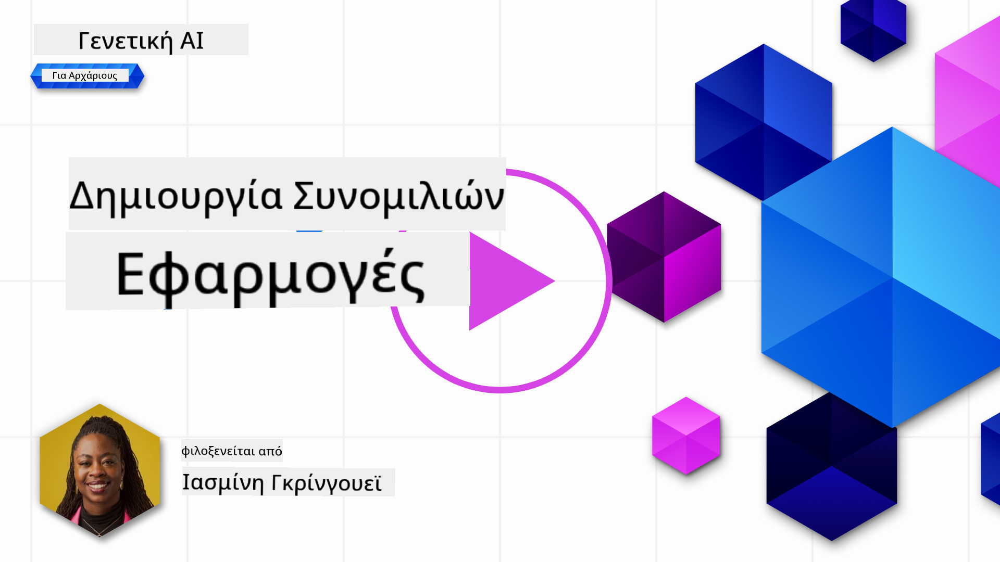
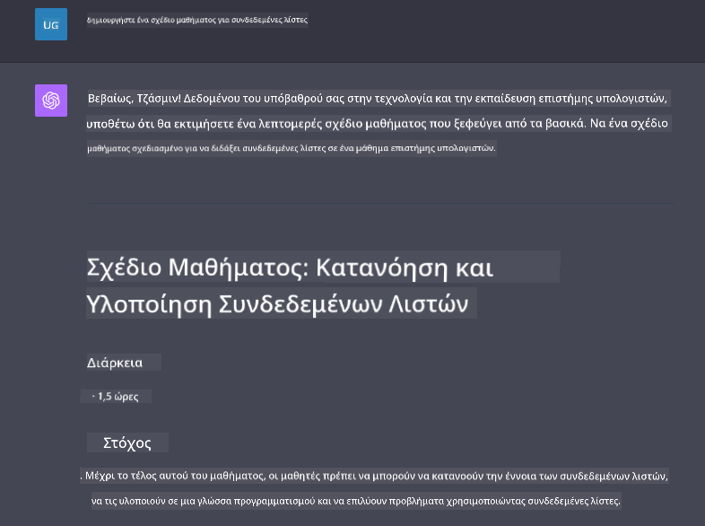

<!--
CO_OP_TRANSLATOR_METADATA:
{
  "original_hash": "ea4bbe640847aafbbba14dae4625e9af",
  "translation_date": "2025-05-19T17:50:36+00:00",
  "source_file": "07-building-chat-applications/README.md",
  "language_code": "el"
}
-->
# Δημιουργία Εφαρμογών Συνομιλίας με Τεχνητή Νοημοσύνη Γενετικής

[](https://aka.ms/gen-ai-lessons7-gh?WT.mc_id=academic-105485-koreyst)

> _(Κάντε κλικ στην εικόνα παραπάνω για να παρακολουθήσετε το βίντεο αυτού του μαθήματος)_

Τώρα που είδαμε πώς μπορούμε να δημιουργήσουμε εφαρμογές παραγωγής κειμένου, ας δούμε τις εφαρμογές συνομιλίας.

Οι εφαρμογές συνομιλίας έχουν ενσωματωθεί στην καθημερινή μας ζωή, προσφέροντας περισσότερα από έναν απλό τρόπο χαλαρής συνομιλίας. Αποτελούν αναπόσπαστα μέρη της εξυπηρέτησης πελατών, της τεχνικής υποστήριξης και ακόμη και σύνθετων συμβουλευτικών συστημάτων. Πιθανόν να έχετε λάβει κάποια βοήθεια από μια εφαρμογή συνομιλίας όχι πολύ καιρό πριν. Καθώς ενσωματώνουμε πιο προηγμένες τεχνολογίες όπως η γενετική τεχνητή νοημοσύνη σε αυτές τις πλατφόρμες, η πολυπλοκότητα αυξάνεται και έτσι αυξάνονται και οι προκλήσεις.

Μερικές ερωτήσεις που πρέπει να απαντηθούν είναι:

- **Δημιουργία της εφαρμογής**. Πώς μπορούμε να δημιουργήσουμε αποτελεσματικά και να ενσωματώσουμε απρόσκοπτα αυτές τις εφαρμογές με τεχνητή νοημοσύνη για συγκεκριμένες περιπτώσεις χρήσης;
- **Παρακολούθηση**. Μόλις αναπτυχθούν, πώς μπορούμε να παρακολουθούμε και να διασφαλίζουμε ότι οι εφαρμογές λειτουργούν στο υψηλότερο επίπεδο ποιότητας, τόσο από άποψη λειτουργικότητας όσο και με βάση τις [έξι αρχές υπεύθυνης τεχνητής νοημοσύνης](https://www.microsoft.com/ai/responsible-ai?WT.mc_id=academic-105485-koreyst);

Καθώς προχωράμε σε μια εποχή που ορίζεται από την αυτοματοποίηση και τις απρόσκοπτες αλληλεπιδράσεις ανθρώπου-μηχανής, η κατανόηση του πώς η γενετική τεχνητή νοημοσύνη μεταμορφώνει το εύρος, το βάθος και την προσαρμοστικότητα των εφαρμογών συνομιλίας γίνεται απαραίτητη. Αυτό το μάθημα θα διερευνήσει τις πτυχές της αρχιτεκτονικής που υποστηρίζουν αυτά τα περίπλοκα συστήματα, θα εξετάσει τις μεθοδολογίες για την προσαρμογή τους σε εργασίες συγκεκριμένου τομέα και θα αξιολογήσει τους δείκτες και τις παραμέτρους που σχετίζονται με την εξασφάλιση υπεύθυνης ανάπτυξης τεχνητής νοημοσύνης.

## Εισαγωγή

Αυτό το μάθημα καλύπτει:

- Τεχνικές για την αποδοτική δημιουργία και ενσωμάτωση εφαρμογών συνομιλίας.
- Πώς να εφαρμόσετε προσαρμογή και βελτιστοποίηση στις εφαρμογές.
- Στρατηγικές και παραμέτρους για την αποτελεσματική παρακολούθηση των εφαρμογών συνομιλίας.

## Στόχοι Μάθησης

Μέχρι το τέλος αυτού του μαθήματος, θα μπορείτε να:

- Περιγράψετε παραμέτρους για τη δημιουργία και ενσωμάτωση εφαρμογών συνομιλίας σε υπάρχοντα συστήματα.
- Προσαρμόσετε εφαρμογές συνομιλίας για συγκεκριμένες περιπτώσεις χρήσης.
- Αναγνωρίσετε βασικούς δείκτες και παραμέτρους για την αποτελεσματική παρακολούθηση και διατήρηση της ποιότητας των εφαρμογών συνομιλίας με τεχνητή νοημοσύνη.
- Διασφαλίσετε ότι οι εφαρμογές συνομιλίας αξιοποιούν την τεχνητή νοημοσύνη υπεύθυνα.

## Ενσωμάτωση Γενετικής Τεχνητής Νοημοσύνης σε Εφαρμογές Συνομιλίας

Η αναβάθμιση των εφαρμογών συνομιλίας μέσω της γενετικής τεχνητής νοημοσύνης δεν επικεντρώνεται μόνο στην αύξηση της ευφυΐας τους. Πρόκειται για τη βελτιστοποίηση της αρχιτεκτονικής, της απόδοσης και της διεπαφής χρήστη για την παροχή μιας ποιοτικής εμπειρίας χρήστη. Αυτό περιλαμβάνει τη διερεύνηση των αρχιτεκτονικών θεμελίων, των ενσωματώσεων API και των παραμέτρων της διεπαφής χρήστη. Αυτή η ενότητα στοχεύει να σας προσφέρει έναν ολοκληρωμένο οδικό χάρτη για την πλοήγηση σε αυτά τα πολύπλοκα τοπία, είτε τα ενσωματώνετε σε υπάρχοντα συστήματα είτε τα δημιουργείτε ως αυτόνομες πλατφόρμες.

Μέχρι το τέλος αυτής της ενότητας, θα έχετε την εξειδίκευση που χρειάζεται για την αποτελεσματική κατασκευή και ενσωμάτωση εφαρμογών συνομιλίας.

### Chatbot ή Εφαρμογή Συνομιλίας;

Πριν βουτήξουμε στη δημιουργία εφαρμογών συνομιλίας, ας συγκρίνουμε τα 'chatbots' με τις 'εφαρμογές συνομιλίας με τεχνητή νοημοσύνη', που εξυπηρετούν διαφορετικούς ρόλους και λειτουργικότητες. Ο κύριος σκοπός ενός chatbot είναι να αυτοματοποιεί συγκεκριμένες συνομιλιακές εργασίες, όπως να απαντά σε συχνές ερωτήσεις ή να παρακολουθεί ένα πακέτο. Συνήθως διέπεται από λογική βασισμένη σε κανόνες ή σύνθετους αλγορίθμους τεχνητής νοημοσύνης. Αντίθετα, μια εφαρμογή συνομιλίας με τεχνητή νοημοσύνη είναι ένα πολύ πιο εκτεταμένο περιβάλλον σχεδιασμένο να διευκολύνει διάφορες μορφές ψηφιακής επικοινωνίας, όπως κείμενο, φωνή και βίντεο μεταξύ ανθρώπινων χρηστών. Το καθοριστικό χαρακτηριστικό της είναι η ενσωμάτωση ενός μοντέλου γενετικής τεχνητής νοημοσύνης που προσομοιώνει λεπτομερείς, ανθρώπινες συνομιλίες, δημιουργώντας απαντήσεις με βάση μια μεγάλη ποικιλία εισόδων και συμφραζόμενων στοιχείων. Μια εφαρμογή συνομιλίας με τεχνητή νοημοσύνη μπορεί να συμμετέχει σε συζητήσεις ανοικτού τομέα, να προσαρμόζεται σε εξελισσόμενα συνομιλιακά συμφραζόμενα και ακόμη και να παράγει δημιουργικό ή σύνθετο διάλογο.

Ο παρακάτω πίνακας αναφέρει τις βασικές διαφορές και ομοιότητες για να μας βοηθήσει να κατανοήσουμε τους μοναδικούς ρόλους τους στην ψηφιακή επικοινωνία.

| Chatbot                               | Εφαρμογή Συνομιλίας με Γενετική Τεχνητή Νοημοσύνη |
| ------------------------------------- | ----------------------------------------------- |
| Εστιασμένο σε εργασίες και βασισμένο σε κανόνες | Αντιληπτικό των συμφραζομένων                    |
| Συχνά ενσωματωμένο σε μεγαλύτερα συστήματα  | Μπορεί να φιλοξενεί ένα ή περισσότερα chatbots   |
| Περιορίζεται σε προγραμματισμένες λειτουργίες | Ενσωματώνει μοντέλα γενετικής τεχνητής νοημοσύνης |
| Εξειδικευμένες και δομημένες αλληλεπιδράσεις | Ικανό για συζητήσεις ανοικτού τομέα              |

### Αξιοποίηση προκατασκευασμένων λειτουργιών με SDKs και APIs

Όταν δημιουργείτε μια εφαρμογή συνομιλίας, ένα εξαιρετικό πρώτο βήμα είναι να αξιολογήσετε τι υπάρχει ήδη. Η χρήση SDKs και APIs για την κατασκευή εφαρμογών συνομιλίας είναι μια επωφελής στρατηγική για διάφορους λόγους. Ενσωματώνοντας καλά τεκμηριωμένα SDKs και APIs, τοποθετείτε στρατηγικά την εφαρμογή σας για μακροπρόθεσμη επιτυχία, αντιμετωπίζοντας ανησυχίες για την κλιμάκωση και τη συντήρηση.

- **Επιταχύνει τη διαδικασία ανάπτυξης και μειώνει το κόστος**: Η εξάρτηση από προκατασκευασμένες λειτουργίες αντί της δαπανηρής διαδικασίας δημιουργίας τους από την αρχή σας επιτρέπει να εστιάσετε σε άλλες πτυχές της εφαρμογής σας που μπορεί να θεωρείτε πιο σημαντικές, όπως η επιχειρηματική λογική.
- **Καλύτερη απόδοση**: Όταν δημιουργείτε λειτουργικότητα από την αρχή, θα αναρωτηθείτε τελικά "Πώς κλιμακώνεται; Είναι αυτή η εφαρμογή ικανή να χειριστεί μια ξαφνική εισροή χρηστών;" Τα καλά συντηρημένα SDK και APIs συχνά έχουν ενσωματωμένες λύσεις για αυτές τις ανησυχίες.
- **Ευκολότερη συντήρηση**: Οι ενημερώσεις και οι βελτιώσεις είναι ευκολότερες στη διαχείριση καθώς τα περισσότερα APIs και SDKs απαιτούν απλώς μια ενημέρωση σε μια βιβλιοθήκη όταν κυκλοφορεί μια νεότερη έκδοση.
- **Πρόσβαση σε τεχνολογία αιχμής**: Η αξιοποίηση μοντέλων που έχουν βελτιστοποιηθεί και εκπαιδευτεί σε εκτεταμένα σύνολα δεδομένων παρέχει στην εφαρμογή σας δυνατότητες φυσικής γλώσσας.

Η πρόσβαση στη λειτουργικότητα ενός SDK ή API συνήθως περιλαμβάνει την απόκτηση άδειας για τη χρήση των παρεχόμενων υπηρεσιών, η οποία συχνά γίνεται μέσω της χρήσης ενός μοναδικού κλειδιού ή διακριτικού ελέγχου ταυτότητας. Θα χρησιμοποιήσουμε τη Βιβλιοθήκη Python της OpenAI για να εξερευνήσουμε πώς φαίνεται αυτό. Μπορείτε επίσης να το δοκιμάσετε μόνοι σας στο παρακάτω [notebook για την OpenAI](../../../07-building-chat-applications/python/oai-assignment.ipynb) ή στο [notebook για τις Υπηρεσίες Azure OpenAI](../../../07-building-chat-applications/python/aoai-assignment.ipynb) για αυτό το μάθημα.

```python
import os
from openai import OpenAI

API_KEY = os.getenv("OPENAI_API_KEY","")

client = OpenAI(
    api_key=API_KEY
    )

chat_completion = client.chat.completions.create(model="gpt-3.5-turbo", messages=[{"role": "user", "content": "Suggest two titles for an instructional lesson on chat applications for generative AI."}])
```

Το παραπάνω παράδειγμα χρησιμοποιεί το μοντέλο GPT-3.5 Turbo για να ολοκληρώσει την προτροπή, αλλά προσέξτε ότι το κλειδί API ορίζεται πριν το κάνετε. Θα λαμβάνατε ένα σφάλμα αν δεν ορίζατε το κλειδί.

## Εμπειρία Χρήστη (UX)

Οι γενικές αρχές UX ισχύουν για τις εφαρμογές συνομιλίας, αλλά εδώ είναι μερικές επιπλέον παραμέτρους που γίνονται ιδιαίτερα σημαντικές λόγω των στοιχείων μηχανικής μάθησης που εμπλέκονται.

- **Μηχανισμός για την αντιμετώπιση της ασάφειας**: Τα μοντέλα γενετικής τεχνητής νοημοσύνης περιστασιακά παράγουν ασαφείς απαντήσεις. Ένα χαρακτηριστικό που επιτρέπει στους χρήστες να ζητούν διευκρινίσεις μπορεί να είναι χρήσιμο αν αντιμετωπίσουν αυτό το πρόβλημα.
- **Διατήρηση συμφραζομένων**: Τα προηγμένα μοντέλα γενετικής τεχνητής νοημοσύνης έχουν την ικανότητα να θυμούνται το πλαίσιο μέσα σε μια συνομιλία, το οποίο μπορεί να είναι ένα απαραίτητο πλεονέκτημα για την εμπειρία χρήστη. Δίνοντας στους χρήστες τη δυνατότητα να ελέγχουν και να διαχειρίζονται το πλαίσιο βελτιώνει την εμπειρία χρήστη, αλλά εισάγει τον κίνδυνο διατήρησης ευαίσθητων πληροφοριών χρήστη. Οι παράμετροι για το πόσο καιρό αποθηκεύονται αυτές οι πληροφορίες, όπως η εισαγωγή μιας πολιτικής διατήρησης, μπορούν να ισορροπήσουν την ανάγκη για πλαίσιο με την ιδιωτικότητα.
- **Προσωποποίηση**: Με την ικανότητα να μαθαίνουν και να προσαρμόζονται, τα μοντέλα τεχνητής νοημοσύνης προσφέρουν μια εξατομικευμένη εμπειρία για έναν χρήστη. Η προσαρμογή της εμπειρίας χρήστη μέσω χαρακτηριστικών όπως τα προφίλ χρήστη όχι μόνο κάνει τον χρήστη να αισθάνεται ότι κατανοείται, αλλά επίσης βοηθά στην αναζήτηση συγκεκριμένων απαντήσεων, δημιουργώντας μια πιο αποτελεσματική και ικανοποιητική αλληλεπίδραση.

Ένα τέτοιο παράδειγμα προσωποποίησης είναι οι ρυθμίσεις "Προσαρμοσμένων οδηγιών" στο ChatGPT της OpenAI. Σας επιτρέπει να παρέχετε πληροφορίες για τον εαυτό σας που μπορεί να είναι σημαντικό πλαίσιο για τις προτροπές σας. Ακολουθεί ένα παράδειγμα προσαρμοσμένης οδηγίας.


Αυτό το "προφίλ" ζητά από το ChatGPT να δημιουργήσει ένα σχέδιο μαθήματος για συνδεδεμένες λίστες. Παρατηρήστε ότι το ChatGPT λαμβάνει υπόψη ότι ο χρήστης μπορεί να θέλει ένα πιο λεπτομερές σχέδιο μαθήματος με βάση την εμπειρία της.



### Το Πλαίσιο Μηνυμάτων Συστήματος της Microsoft για Μεγάλα Γλωσσικά Μοντέλα

[Η Microsoft έχει παρέχει καθοδήγηση](https://learn.microsoft.com/azure/ai-services/openai/concepts/system-message#define-the-models-output-format?WT.mc_id=academic-105485-koreyst) για τη σύνταξη αποτελεσματικών μηνυμάτων συστήματος κατά τη δημιουργία απαντήσεων από LLMs, χωρισμένα σε 4 περιοχές:

1. Ορισμός για ποιον είναι το μοντέλο, καθώς και οι δυνατότητες και οι περιορισμοί του.
2. Ορισμός της μορφής εξόδου του μοντέλου.
3. Παροχή συγκεκριμένων παραδειγμάτων που δείχνουν την επιθυμητή συμπεριφορά του μοντέλου.
4. Παροχή επιπλέον κανόνων συμπεριφοράς.

### Προσβασιμότητα

Είτε ένας χρήστης έχει οπτική, ακουστική, κινητική ή γνωστική αναπηρία, μια καλά σχεδιασμένη εφαρμογή συνομιλίας θα πρέπει να είναι χρησιμοποιήσιμη από όλους. Η παρακάτω λίστα αναλύει συγκεκριμένες λειτουργίες που στοχεύουν στην ενίσχυση της προσβασιμότητας για διάφορες αναπηρίες χρηστών.

- **Λειτουργίες για Οπτική Αναπηρία**: Θέματα υψηλής αντίθεσης και δυνατότητα αλλαγής μεγέθους κειμένου, συμβατότητα με αναγνώστες οθόνης.
- **Λειτουργίες για Ακουστική Αναπηρία**: Λειτουργίες κειμένου σε ομιλία και ομιλίας σε κείμενο, οπτικές ενδείξεις για ηχητικές ειδοποιήσεις.
- **Λειτουργίες για Κινητική Αναπηρία**: Υποστήριξη πλοήγησης με πληκτρολόγιο, φωνητικές εντολές.
- **Λειτουργίες για Γνωστική Αναπηρία**: Επιλογές απλοποιημένης γλώσσας.

## Προσαρμογή και Βελτιστοποίηση για Γλωσσικά Μοντέλα Συγκεκριμένου Τομέα

Φανταστείτε μια εφαρμογή συνομιλίας που κατανοεί την ορολογία της εταιρείας σας και προβλέπει τις συγκεκριμένες ερωτήσεις που συνήθως έχουν οι χρήστες της. Υπάρχουν μερικές προσεγγίσεις που αξίζει να αναφερθούν:

- **Αξιοποίηση μοντέλων DSL**. Το DSL σημαίνει γλώσσα συγκεκριμένου τομέα. Μπορείτε να αξιοποιήσετε ένα λεγόμενο μοντέλο DSL που έχει εκπαιδευτεί σε έναν συγκεκριμένο τομέα για να κατανοήσει τις έννοιες και τα σενάριά του.
- **Εφαρμογή βελτιστοποίησης**. Η βελτιστοποίηση είναι η διαδικασία περαιτέρω εκπαίδευσης του μοντέλου σας με συγκεκριμένα δεδομένα.

## Προσαρμογή: Χρήση ενός DSL

Η αξιοποίηση ενός μοντέλου γλώσσας συγκεκριμένου τομέα (DSL Models) μπορεί να ενισχύσει την εμπλοκή των χρηστών παρέχοντας εξειδικ

**Αποποίηση ευθύνης**:  
Αυτό το έγγραφο έχει μεταφραστεί χρησιμοποιώντας την υπηρεσία AI μετάφρασης [Co-op Translator](https://github.com/Azure/co-op-translator). Παρόλο που επιδιώκουμε την ακρίβεια, παρακαλώ σημειώστε ότι οι αυτοματοποιημένες μεταφράσεις μπορεί να περιέχουν λάθη ή ανακρίβειες. Το πρωτότυπο έγγραφο στη γλώσσα του θα πρέπει να θεωρείται η αυθεντική πηγή. Για κρίσιμες πληροφορίες, συνιστάται η επαγγελματική ανθρώπινη μετάφραση. Δεν φέρουμε ευθύνη για τυχόν παρεξηγήσεις ή εσφαλμένες ερμηνείες που προκύπτουν από τη χρήση αυτής της μετάφρασης.