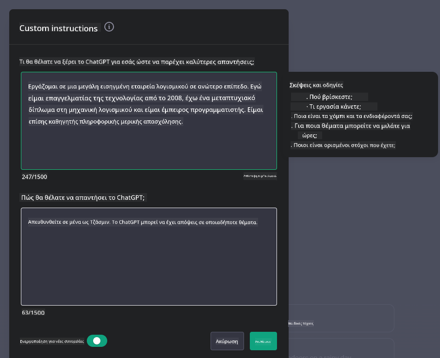
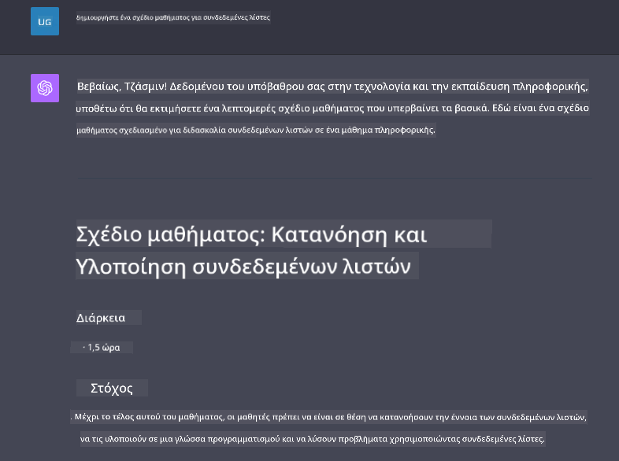

<!--
CO_OP_TRANSLATOR_METADATA:
{
  "original_hash": "ea4bbe640847aafbbba14dae4625e9af",
  "translation_date": "2025-06-25T15:33:36+00:00",
  "source_file": "07-building-chat-applications/README.md",
  "language_code": "el"
}
-->
# Δημιουργία Εφαρμογών Συνομιλίας με Γενετική Τεχνητή Νοημοσύνη

> _(Κάντε κλικ στην εικόνα παραπάνω για να δείτε το βίντεο αυτού του μαθήματος)_

Αφού είδαμε πώς μπορούμε να δημιουργήσουμε εφαρμογές δημιουργίας κειμένου, ας εξετάσουμε τις εφαρμογές συνομιλίας.

Οι εφαρμογές συνομιλίας έχουν γίνει μέρος της καθημερινής μας ζωής, προσφέροντας περισσότερα από απλή συνομιλία. Είναι βασικά στοιχεία της εξυπηρέτησης πελατών, της τεχνικής υποστήριξης και ακόμη και των πολύπλοκων συμβουλευτικών συστημάτων. Είναι πιθανό να έχετε λάβει βοήθεια από μια εφαρμογή συνομιλίας πρόσφατα. Καθώς ενσωματώνουμε πιο προηγμένες τεχνολογίες όπως η γενετική τεχνητή νοημοσύνη σε αυτές τις πλατφόρμες, η πολυπλοκότητα αυξάνεται και οι προκλήσεις επίσης.

Μερικές ερωτήσεις που πρέπει να απαντηθούν είναι:

- **Δημιουργία της εφαρμογής**. Πώς μπορούμε να δημιουργήσουμε και να ενσωματώσουμε αποτελεσματικά αυτές τις εφαρμογές που βασίζονται στην τεχνητή νοημοσύνη για συγκεκριμένες χρήσεις;
- **Παρακολούθηση**. Μόλις αναπτυχθούν, πώς μπορούμε να παρακολουθήσουμε και να διασφαλίσουμε ότι οι εφαρμογές λειτουργούν στο υψηλότερο επίπεδο ποιότητας, τόσο από άποψη λειτουργικότητας όσο και συμμόρφωσης με τις [έξι αρχές υπεύθυνης τεχνητής νοημοσύνης](https://www.microsoft.com/ai/responsible-ai?WT.mc_id=academic-105485-koreyst);

Καθώς προχωρούμε σε μια εποχή που ορίζεται από την αυτοματοποίηση και τις απρόσκοπτες αλληλεπιδράσεις ανθρώπου-μηχανής, η κατανόηση του πώς η γενετική τεχνητή νοημοσύνη μεταμορφώνει το εύρος, το βάθος και την προσαρμοστικότητα των εφαρμογών συνομιλίας γίνεται απαραίτητη. Αυτό το μάθημα θα εξετάσει τις πτυχές της αρχιτεκτονικής που υποστηρίζουν αυτά τα περίπλοκα συστήματα, θα εμβαθύνει στις μεθοδολογίες για την προσαρμογή τους σε εργασίες συγκεκριμένου τομέα και θα αξιολογήσει τις μετρήσεις και τις σκέψεις που είναι σημαντικές για την εξασφάλιση υπεύθυνης ανάπτυξης τεχνητής νοημοσύνης.

## Εισαγωγή

Αυτό το μάθημα καλύπτει:

- Τεχνικές για αποτελεσματική δημιουργία και ενσωμάτωση εφαρμογών συνομιλίας.
- Πώς να εφαρμόσετε προσαρμογή και λεπτομερή ρύθμιση στις εφαρμογές.
- Στρατηγικές και σκέψεις για αποτελεσματική παρακολούθηση των εφαρμογών συνομιλίας.

## Στόχοι Μάθησης

Μέχρι το τέλος αυτού του μαθήματος, θα μπορείτε να:

- Περιγράψετε τις σκέψεις για την κατασκευή και ενσωμάτωση εφαρμογών συνομιλίας σε υπάρχοντα συστήματα.
- Προσαρμόσετε εφαρμογές συνομιλίας για συγκεκριμένες χρήσεις.
- Αναγνωρίσετε βασικές μετρήσεις και σκέψεις για αποτελεσματική παρακολούθηση και διατήρηση της ποιότητας των εφαρμογών συνομιλίας που βασίζονται στην τεχνητή νοημοσύνη.
- Διασφαλίσετε ότι οι εφαρμογές συνομιλίας αξιοποιούν την τεχνητή νοημοσύνη υπεύθυνα.

## Ενσωμάτωση Γενετικής Τεχνητής Νοημοσύνης σε Εφαρμογές Συνομιλίας

Η αναβάθμιση των εφαρμογών συνομιλίας μέσω γενετικής τεχνητής νοημοσύνης δεν επικεντρώνεται μόνο στο να τις κάνει πιο έξυπνες. Είναι για τη βελτιστοποίηση της αρχιτεκτονικής, της απόδοσης και της διεπαφής χρήστη για την παροχή μιας ποιοτικής εμπειρίας χρήστη. Αυτό περιλαμβάνει την εξέταση των αρχιτεκτονικών θεμελίων, των ενσωματώσεων API και των σκέψεων για τη διεπαφή χρήστη. Αυτή η ενότητα στοχεύει να σας προσφέρει έναν ολοκληρωμένο οδικό χάρτη για την πλοήγηση σε αυτά τα περίπλοκα τοπία, είτε τα ενσωματώνετε σε υπάρχοντα συστήματα είτε τα δημιουργείτε ως ανεξάρτητες πλατφόρμες.

Μέχρι το τέλος αυτής της ενότητας, θα είστε εξοπλισμένοι με την τεχνογνωσία που χρειάζεται για την αποτελεσματική κατασκευή και ενσωμάτωση εφαρμογών συνομιλίας.

### Chatbot ή Εφαρμογή Συνομιλίας;

Πριν προχωρήσουμε στη δημιουργία εφαρμογών συνομιλίας, ας συγκρίνουμε τα 'chatbots' με τις 'εφαρμογές συνομιλίας που βασίζονται στην τεχνητή νοημοσύνη', οι οποίες εξυπηρετούν διαφορετικούς ρόλους και λειτουργίες. Ο κύριος σκοπός ενός chatbot είναι να αυτοματοποιεί συγκεκριμένες συνομιλιακές εργασίες, όπως να απαντά σε συχνές ερωτήσεις ή να παρακολουθεί ένα πακέτο. Συνήθως διέπεται από λογική βασισμένη σε κανόνες ή πολύπλοκους αλγόριθμους τεχνητής νοημοσύνης. Αντίθετα, μια εφαρμογή συνομιλίας που βασίζεται στην τεχνητή νοημοσύνη είναι ένα πολύ πιο εκτεταμένο περιβάλλον που έχει σχεδιαστεί για να διευκολύνει διάφορες μορφές ψηφιακής επικοινωνίας, όπως συνομιλίες κειμένου, φωνής και βίντεο μεταξύ ανθρώπινων χρηστών. Το χαρακτηριστικό της είναι η ενσωμάτωση ενός μοντέλου γενετικής τεχνητής νοημοσύνης που προσομοιώνει λεπτές, ανθρώπινες συνομιλίες, δημιουργώντας απαντήσεις με βάση μια μεγάλη ποικιλία εισόδων και συμφραζομένων. Μια εφαρμογή συνομιλίας που βασίζεται στη γενετική τεχνητή νοημοσύνη μπορεί να συμμετάσχει σε συζητήσεις ανοιχτού τομέα, να προσαρμοστεί σε εξελισσόμενα συμφραζόμενα συνομιλίας και ακόμη και να παράγει δημιουργικό ή πολύπλοκο διάλογο.

Ο παρακάτω πίνακας περιγράφει τις βασικές διαφορές και ομοιότητες για να μας βοηθήσει να κατανοήσουμε τους μοναδικούς ρόλους τους στην ψηφιακή επικοινωνία.

| Chatbot                               | Εφαρμογή Συνομιλίας με Γενετική Τεχνητή Νοημοσύνη |
| ------------------------------------- | ------------------------------------------------- |
| Εστιασμένο σε εργασίες και βασισμένο σε κανόνες | Αντιληπτικό του συμφραζομένου                        |
| Συχνά ενσωματωμένο σε μεγαλύτερα συστήματα  | Μπορεί να φιλοξενεί ένα ή περισσότερα chatbots      |
| Περιορισμένο σε προγραμματισμένες λειτουργίες | Ενσωματώνει μοντέλα γενετικής τεχνητής νοημοσύνης    |
| Εξειδικευμένες & δομημένες αλληλεπιδράσεις | Ικανό για συζητήσεις ανοιχτού τομέα                  |

### Αξιοποίηση προϋπάρχουσας λειτουργικότητας με SDKs και APIs

Όταν δημιουργείτε μια εφαρμογή συνομιλίας, ένα καλό πρώτο βήμα είναι να αξιολογήσετε τι υπάρχει ήδη. Η χρήση SDKs και APIs για την κατασκευή εφαρμογών συνομιλίας είναι μια επωφελής στρατηγική για διάφορους λόγους. Ενσωματώνοντας καλά τεκμηριωμένα SDKs και APIs, τοποθετείτε στρατηγικά την εφαρμογή σας για μακροπρόθεσμη επιτυχία, αντιμετωπίζοντας ανησυχίες σχετικά με την κλιμάκωση και τη συντήρηση.

- **Επιταχύνει τη διαδικασία ανάπτυξης και μειώνει το κόστος**: Η εξάρτηση από προϋπάρχουσες λειτουργικότητες αντί της δαπανηρής διαδικασίας δημιουργίας τους από την αρχή σας επιτρέπει να εστιάσετε σε άλλες πτυχές της εφαρμογής σας που μπορεί να θεωρείτε πιο σημαντικές, όπως η επιχειρηματική λογική.
- **Καλύτερη απόδοση**: Όταν δημιουργείτε λειτουργικότητα από την αρχή, θα αναρωτηθείτε τελικά "Πώς κλιμακώνεται; Είναι αυτή η εφαρμογή ικανή να χειριστεί ξαφνική εισροή χρηστών;" Τα καλά συντηρημένα SDK και APIs συχνά έχουν ενσωματωμένες λύσεις για αυτές τις ανησυχίες.
- **Ευκολότερη συντήρηση**: Οι ενημερώσεις και οι βελτιώσεις είναι ευκολότερες στη διαχείριση καθώς οι περισσότερες APIs και SDKs απαιτούν απλώς ενημέρωση μιας βιβλιοθήκης όταν κυκλοφορεί μια νεότερη έκδοση.
- **Πρόσβαση σε προηγμένη τεχνολογία**: Η αξιοποίηση μοντέλων που έχουν ρυθμιστεί και εκπαιδευτεί σε εκτεταμένα σύνολα δεδομένων παρέχει στην εφαρμογή σας δυνατότητες φυσικής γλώσσας.

Η πρόσβαση στη λειτουργικότητα ενός SDK ή API συνήθως περιλαμβάνει την απόκτηση άδειας χρήσης των παρεχόμενων υπηρεσιών, η οποία συχνά γίνεται μέσω της χρήσης ενός μοναδικού κλειδιού ή διακριτικού ταυτοποίησης. Θα χρησιμοποιήσουμε τη Βιβλιοθήκη Python της OpenAI για να εξερευνήσουμε πώς φαίνεται αυτό. Μπορείτε επίσης να το δοκιμάσετε μόνοι σας στο ακόλουθο [σημειωματάριο για OpenAI](../../../07-building-chat-applications/python/oai-assignment.ipynb) ή στο [σημειωματάριο για τις Υπηρεσίες Azure OpenAI](../../../07-building-chat-applications/python/aoai-assignment.ipynb) για αυτό το μάθημα.

```python
import os
from openai import OpenAI

API_KEY = os.getenv("OPENAI_API_KEY","")

client = OpenAI(
    api_key=API_KEY
    )

chat_completion = client.chat.completions.create(model="gpt-3.5-turbo", messages=[{"role": "user", "content": "Suggest two titles for an instructional lesson on chat applications for generative AI."}])
```

Το παραπάνω παράδειγμα χρησιμοποιεί το μοντέλο GPT-3.5 Turbo για να ολοκληρώσει το αίτημα, αλλά παρατηρήστε ότι το κλειδί API έχει οριστεί πριν από αυτό. Θα λάβατε ένα σφάλμα αν δεν ορίζατε το κλειδί.

## Εμπειρία Χρήστη (UX)

Γενικές αρχές UX ισχύουν για τις εφαρμογές συνομιλίας, αλλά εδώ είναι μερικές πρόσθετες σκέψεις που γίνονται ιδιαίτερα σημαντικές λόγω των στοιχείων μηχανικής μάθησης που εμπλέκονται.

- **Μηχανισμός αντιμετώπισης ασάφειας**: Τα μοντέλα γενετικής τεχνητής νοημοσύνης περιστασιακά δημιουργούν ασαφείς απαντήσεις. Μια λειτουργία που επιτρέπει στους χρήστες να ζητούν διευκρινίσεις μπορεί να είναι χρήσιμη αν συναντήσουν αυτό το πρόβλημα.
- **Διατήρηση συμφραζομένου**: Προηγμένα μοντέλα γενετικής τεχνητής νοημοσύνης έχουν την ικανότητα να θυμούνται το συμφραζόμενο μέσα σε μια συνομιλία, το οποίο μπορεί να είναι απαραίτητο για την εμπειρία χρήστη. Η δυνατότητα στους χρήστες να ελέγχουν και να διαχειρίζονται το συμφραζόμενο βελτιώνει την εμπειρία χρήστη, αλλά εισάγει τον κίνδυνο διατήρησης ευαίσθητων πληροφοριών χρήστη. Σκέψεις για το πόσο καιρό αυτές οι πληροφορίες αποθηκεύονται, όπως η εισαγωγή μιας πολιτικής διατήρησης, μπορούν να ισορροπήσουν την ανάγκη για συμφραζόμενο με την ιδιωτικότητα.
- **Προσωποποίηση**: Με την ικανότητα να μαθαίνουν και να προσαρμόζονται, τα μοντέλα τεχνητής νοημοσύνης προσφέρουν μια εξατομικευμένη εμπειρία για έναν χρήστη. Η προσαρμογή της εμπειρίας χρήστη μέσω λειτουργιών όπως τα προφίλ χρήστη όχι μόνο κάνει τον χρήστη να αισθάνεται κατανοητός, αλλά βοηθά επίσης στην αναζήτηση συγκεκριμένων απαντήσεων, δημιουργώντας μια πιο αποτελεσματική και ικανοποιητική αλληλεπίδραση.

Ένα τέτοιο παράδειγμα προσωποποίησης είναι οι "Προσαρμοσμένες οδηγίες" στις ρυθμίσεις του ChatGPT της OpenAI. Σας επιτρέπει να παρέχετε πληροφορίες για τον εαυτό σας που μπορεί να είναι σημαντικό συμφραζόμενο για τις προτροπές σας. Εδώ είναι ένα παράδειγμα μιας προσαρμοσμένης οδηγίας.



Αυτό το "προφίλ" παρακινεί το ChatGPT να δημιουργήσει ένα σχέδιο μαθήματος για συνδεδεμένες λίστες. Παρατηρήστε ότι το ChatGPT λαμβάνει υπόψη ότι ο χρήστης μπορεί να θέλει ένα πιο λεπτομερές σχέδιο μαθήματος με βάση την εμπειρία της.



### Πλαίσιο Μηνυμάτων Συστήματος της Microsoft για Μεγάλα Γλωσσικά Μοντέλα

[Η Microsoft έχει παρέχει καθοδήγηση](https://learn.microsoft.com/azure/ai-services/openai/concepts/system-message#define-the-models-output-format?WT.mc_id=academic-105485-koreyst) για τη συγγραφή αποτελεσματικών μηνυμάτων συστήματος κατά τη δημιουργία απαντήσεων από LLMs, χωρισμένα σε 4 περιοχές:

1. Ορισμός του ποιος είναι το μοντέλο, καθώς και οι δυνατότητες και οι περιορισμοί του.
2. Ορισμός της μορφής εξόδου του μοντέλου.
3. Παροχή συγκεκριμένων παραδειγμάτων που δείχνουν την επιθυμητή συμπεριφορά του μοντέλου.
4. Παροχή πρόσθετων οδηγών συμπεριφοράς.

### Προσβασιμότητα

Είτε ένας χρήστης έχει οπτικές, ακουστικές, κινητικές ή γνωστικές αναπηρίες, μια καλά σχεδιασμένη εφαρμογή συνομιλίας πρέπει να είναι χρησιμοποιήσιμη από όλους. Η παρακάτω λίστα αναλύει συγκεκριμένες λειτουργίες που στοχεύουν στην ενίσχυση της προσβασιμότητας για διάφορες αναπηρίες χρηστών.

- **Λειτουργίες για Οπτική Αναπηρία**: Θέματα υψηλής αντίθεσης και επανασχεδιαζόμενο κείμενο, συμβατότητα με αναγνώστες οθόνης.
- **Λειτουργίες για Ακουστική Αναπηρία**: Λειτουργίες κειμένου-σε-ομιλία και ομιλίας-σε-κείμενο, οπτικά στοιχεία για ηχητικές ειδοποιήσεις.
- **Λειτουργίες για Κινητική Αναπηρία**: Υποστήριξη πλοήγησης με πληκτρολόγιο, φωνητικές εντολές.
- **Λειτουργίες για Γνωστική Αναπηρία**: Απλοποιημένες επιλογές γλώσσας.

## Προσαρμογή και Λεπτομερής Ρύθμιση για Μοντέλα Γλώσσας Ειδικού Τομέα

Φανταστείτε μια εφαρμογή συνομιλίας που κατανοεί την ορολογία της εταιρείας σας και προβλέπει τις συγκεκριμένες ερωτήσεις που έχει η βάση χρηστών της. Υπάρχουν μερικές προσεγγίσεις που αξίζει να αναφερθούν:

- **Αξιοποίηση μοντέλων DSL**. Το DSL σημαίνει γλώσσα ειδικού τομέα. Μπορείτε να αξιοποιήσετε ένα λεγόμενο μοντέλο DSL που έχει εκπαιδευτεί σε έναν συγκεκριμένο τομέα για να κατανοήσει τις έννοιες και τα σενάρια του.
- **Εφαρμογή λεπτομερούς ρύθμισης**. Η λεπτομερής ρύθμιση είναι η διαδικασία περαιτέρω εκπαίδευσης του μοντέλου σας με συγκεκριμένα δεδομένα.

## Προσαρμογή: Χρήση ενός DSL

Η αξιοποίηση μοντέλων γλώσσας ειδικού τομέα (DSL Models) μπορεί να ενισχύσει την αλληλεπίδραση με τον χρήστη παρέχοντας εξειδικευμένες, συμφραζόμενες αλληλεπιδράσεις. Είναι ένα μοντέλο που έχει εκπαιδευτεί ή ρυθμιστεί για να κατανοεί και να δημιουργεί κείμενο που σχετίζεται με έναν συγκεκριμένο τομέα, βιομηχανία ή θέμα. Οι επιλογές για τη χρήση ενός μοντέλου DSL μπορεί να ποικίλουν από την εκ

**Αποποίηση ευθύνης**:  
Αυτό το έγγραφο έχει μεταφραστεί χρησιμοποιώντας την υπηρεσία αυτόματης μετάφρασης AI [Co-op Translator](https://github.com/Azure/co-op-translator). Ενώ επιδιώκουμε την ακρίβεια, παρακαλώ σημειώστε ότι οι αυτόματες μεταφράσεις ενδέχεται να περιέχουν λάθη ή ανακρίβειες. Το αρχικό έγγραφο στη μητρική του γλώσσα πρέπει να θεωρείται η αυθεντική πηγή. Για κρίσιμες πληροφορίες, συνιστάται επαγγελματική ανθρώπινη μετάφραση. Δεν φέρουμε ευθύνη για τυχόν παρανοήσεις ή παρερμηνείες που προκύπτουν από τη χρήση αυτής της μετάφρασης.