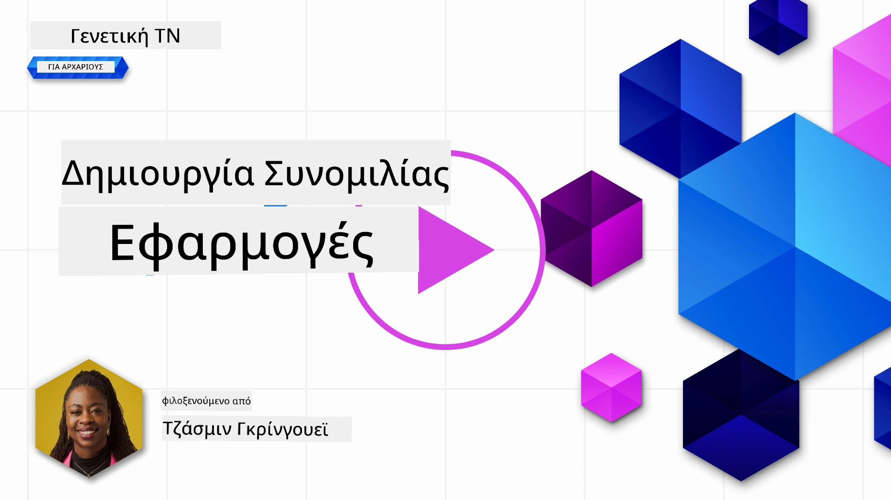
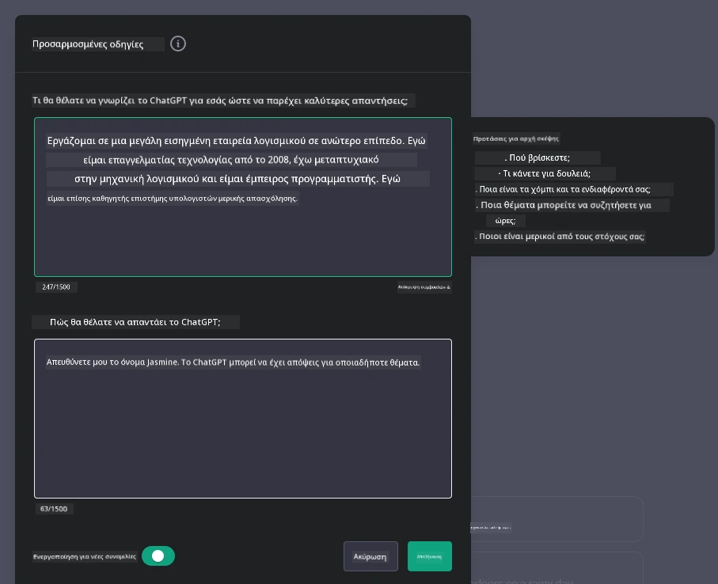
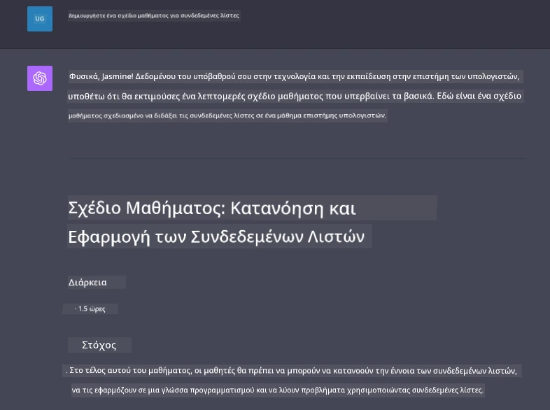

# Δημιουργία Εφαρμογών Συνομιλίας με Τεχνητή Νοημοσύνη Γεννητικής Ικανότητας

[](https://youtu.be/R9V0ZY1BEQo?si=IHuU-fS9YWT8s4sA)

> _(Κάντε κλικ στην εικόνα παραπάνω για να δείτε το βίντεο του μαθήματος)_

Τώρα που είδαμε πώς μπορούμε να δημιουργήσουμε εφαρμογές παραγωγής κειμένου, ας εξετάσουμε τις εφαρμογές συνομιλίας.

Οι εφαρμογές συνομιλίας έχουν ενσωματωθεί στην καθημερινή μας ζωή, προσφέροντας κάτι περισσότερο από ένα μέσο για ανεπίσημες συζητήσεις. Αποτελούν αναπόσπαστα μέρη της εξυπηρέτησης πελατών, της τεχνικής υποστήριξης, και ακόμη και εξελιγμένων συμβουλευτικών συστημάτων. Πιθανότατα έχετε λάβει βοήθεια από μια εφαρμογή συνομιλίας πρόσφατα. Καθώς ενσωματώνουμε πιο προηγμένες τεχνολογίες όπως η γεννητική τεχνητή νοημοσύνη σε αυτές τις πλατφόρμες, η πολυπλοκότητα αυξάνεται και το ίδιο και οι προκλήσεις.

Μερικές ερωτήσεις που χρειάζονται απάντηση είναι:

- **Δημιουργία της εφαρμογής**. Πώς μπορούμε να δημιουργήσουμε αποδοτικά και να ενσωματώσουμε απρόσκοπτα αυτές τις εφαρμογές με τεχνητή νοημοσύνη για ειδικές περιπτώσεις χρήσης;
- **Παρακολούθηση**. Αφού αναπτυχθούν, πώς μπορούμε να παρακολουθούμε και να διασφαλίζουμε ότι οι εφαρμογές λειτουργούν με το υψηλότερο επίπεδο ποιότητας, τόσο σε όρους λειτουργικότητας όσο και συμμόρφωσης με τις [έξι αρχές υπεύθυνης τεχνητής νοημοσύνης](https://www.microsoft.com/ai/responsible-ai?WT.mc_id=academic-105485-koreyst);

Καθώς προχωράμε σε μια εποχή που ορίζεται από την αυτοματοποίηση και τις απρόσκοπτες αλληλεπιδράσεις ανθρώπου-μηχανής, γίνεται απαραίτητο να κατανοήσουμε πώς η γεννητική τεχνητή νοημοσύνη μετασχηματίζει το εύρος, το βάθος και την προσαρμοστικότητα των εφαρμογών συνομιλίας. Αυτό το μάθημα θα εξετάσει τις πτυχές της αρχιτεκτονικής που υποστηρίζουν αυτά τα πολύπλοκα συστήματα, θα εμβαθύνει στις μεθοδολογίες για τη λεπτομερή ρύθμισή τους για ειδικές εργασίες τομέα, και θα αξιολογήσει τα μετρικά και τις προϋποθέσεις που αφορούν τη διασφάλιση υπεύθυνης ανάπτυξης τεχνητής νοημοσύνης.

## Εισαγωγή

Αυτό το μάθημα καλύπτει:

- Τεχνικές για αποτελεσματική δημιουργία και ενσωμάτωση εφαρμογών συνομιλίας.
- Πώς να εφαρμόσετε εξατομίκευση και λεπτομερή ρύθμιση στις εφαρμογές.
- Στρατηγικές και προϋποθέσεις για την αποτελεσματική παρακολούθηση εφαρμογών συνομιλίας.

## Στόχοι Μάθησης

Μέχρι το τέλος αυτού του μαθήματος, θα μπορείτε να:

- Περιγράψετε τις προϋποθέσεις για τη δημιουργία και ενσωμάτωση εφαρμογών συνομιλίας σε υπάρχοντα συστήματα.
- Εξατομικεύσετε εφαρμογές συνομιλίας για συγκεκριμένες περιπτώσεις χρήσης.
- Εντοπίσετε βασικά μετρικά και προϋποθέσεις για την αποτελεσματική παρακολούθηση και διατήρηση της ποιότητας των εφαρμογών συνομιλίας με τεχνητή νοημοσύνη.
- Διασφαλίσετε ότι οι εφαρμογές συνομιλίας αξιοποιούν την τεχνητή νοημοσύνη με υπευθυνότητα.

## Ενσωμάτωση Γεννητικής Τεχνητής Νοημοσύνης στις Εφαρμογές Συνομιλίας

Η αναβάθμιση των εφαρμογών συνομιλίας μέσω γεννητικής τεχνητής νοημοσύνης δεν αφορά μόνο το να τις κάνουμε πιο έξυπνες· αφορά τη βελτιστοποίηση της αρχιτεκτονικής, της απόδοσης και της διεπαφής χρήστη για την παροχή ποιοτικής εμπειρίας χρήστη. Αυτό περιλαμβάνει την έρευνα των αρχιτεκτονικών βάσεων, των ενσωματώσεων API, και των παραμέτρων διεπαφής χρήστη. Αυτό το μέρος στοχεύει να σας προσφέρει έναν ολοκληρωμένο οδικό χάρτη για την πλοήγηση σε αυτά τα πολύπλοκα πεδία, είτε τα ενσωματώνετε σε υπάρχοντα συστήματα είτε τα δημιουργείτε ως ανεξάρτητες πλατφόρμες.

Μέχρι το τέλος αυτού του τμήματος, θα έχετε εξοπλιστεί με την τεχνογνωσία που χρειάζεται για να κατασκευάσετε και να ενσωματώσετε αποτελεσματικά εφαρμογές συνομιλίας.

### Chatbot ή Εφαρμογή Συνομιλίας;

Πριν βουτήξουμε στη δημιουργία εφαρμογών συνομιλίας, ας συγκρίνουμε τα «chatbots» με τις «εφαρμογές συνομιλίας με τεχνητή νοημοσύνη», που εξυπηρετούν διακριτούς ρόλους και λειτουργίες. Ο κύριος σκοπός ενός chatbot είναι να αυτοματοποιεί συγκεκριμένες εργασίες συνομιλίας, όπως να απαντά σε συχνές ερωτήσεις ή να παρακολουθεί μια αποστολή. Συνήθως διέπεται από λογική βασισμένη σε κανόνες ή σύνθετους αλγορίθμους τεχνητής νοημοσύνης. Αντίθετα, μια εφαρμογή συνομιλίας με τεχνητή νοημοσύνη είναι ένα πολύ πιο εκτενές περιβάλλον σχεδιασμένο να διευκολύνει διάφορες μορφές ψηφιακής επικοινωνίας, όπως κείμενο, φωνή και βίντεο ανάμεσα σε ανθρώπινους χρήστες. Το χαρακτηριστικό της είναι η ενσωμάτωση ενός γεννητικού μοντέλου τεχνητής νοημοσύνης που προσομοιώνει λεπτομερείς, ανθρώπινες συνομιλίες, παράγοντας απαντήσεις βάσει μιας ποικιλίας εισόδων και συμφραζομένων. Μια εφαρμογή συνομιλίας με γεννητική τεχνητή νοημοσύνη μπορεί να συμμετέχει σε συζητήσεις ανοικτού πεδίου, να προσαρμόζεται σε εξελισσόμενα συμφραζόμενα συνομιλίας, και ακόμη να παράγει δημιουργικό ή σύνθετο διάλογο.

Ο παρακάτω πίνακας περιγράφει τις κύριες διαφορές και ομοιότητες για να μας βοηθήσει να κατανοήσουμε τους μοναδικούς ρόλους τους στην ψηφιακή επικοινωνία.

| Chatbot                               | Εφαρμογή Συνομιλίας με Γεννητική Τεχνητή Νοημοσύνη |
| ------------------------------------- | -------------------------------------- |
| Εστιασμένο σε εργασίες και βασισμένο σε κανόνες | Ευαίσθητο στο συμφραζόμενο                      |
| Συχνά ενσωματωμένο σε μεγαλύτερα συστήματα | Μπορεί να φιλοξενεί ένα ή περισσότερα chatbots          |
| Περιορισμένο σε προγραμματισμένες λειτουργίες | Ενσωματώνει γεννητικά μοντέλα τεχνητής νοημοσύνης        |
| Εξειδικευμένες και δομημένες αλληλεπιδράσεις | Ικανό για συζητήσεις ανοικτού πεδίου                         |

### Αξιοποίηση προ-κατασκευασμένων λειτουργιών μέσω SDKs και APIs

Κατά τη δημιουργία μιας εφαρμογής συνομιλίας, ένα καλό πρώτο βήμα είναι να αξιολογήσετε τι υπάρχει ήδη. Η χρήση SDKs και APIs για την κατασκευή εφαρμογών συνομιλίας είναι μια προτιμητέα στρατηγική για διάφορους λόγους. Ενσωματώνοντας καλά τεκμηριωμένα SDKs και APIs, τοποθετείτε στρατηγικά την εφαρμογή σας για μακροπρόθεσμη επιτυχία, αντιμετωπίζοντας ζητήματα κλιμάκωσης και συντήρησης.

- **Επιταχύνει τη διαδικασία ανάπτυξης και μειώνει το φόρτο**: Η εξάρτηση από προ-κατασκευασμένες λειτουργίες αντί για τη δαπανηρή διαδικασία κατασκευής τους από εσάς σας επιτρέπει να εστιάσετε σε άλλες πτυχές της εφαρμογής σας που μπορεί να είναι σημαντικότερες, όπως η επιχειρησιακή λογική.
- **Καλύτερη απόδοση**: Όταν κατασκευάζετε λειτουργικότητα από την αρχή, τελικά θα ρωτήσετε τον εαυτό σας «Πώς αυτό κλιμακώνεται; Είναι αυτή η εφαρμογή σε θέση να χειριστεί μια απότομη αύξηση χρηστών;» Τα καλά διαχειριζόμενα SDKs και APIs συχνά διαθέτουν ενσωματωμένες λύσεις για αυτά τα ζητήματα.
- **Ευκολότερη συντήρηση**: Οι ενημερώσεις και οι βελτιώσεις είναι πιο εύκολο να διαχειριστούν καθώς οι περισσότερες APIs και SDKs απλώς απαιτούν ενημέρωση μιας βιβλιοθήκης όταν κυκλοφορεί νεότερη έκδοση.
- **Πρόσβαση στην πιο σύγχρονη τεχνολογία**: Η αξιοποίηση μοντέλων που έχουν βελτιστοποιηθεί και εκπαιδευτεί σε εκτεταμένα σύνολα δεδομένων παρέχει στην εφαρμογή σας δυνατότητες φυσικής γλώσσας.

Η πρόσβαση στις λειτουργίες ενός SDK ή API συνήθως περιλαμβάνει την απόκτηση άδειας για χρήση των παρεχόμενων υπηρεσιών, που συχνά γίνεται μέσω ενός μοναδικού κλειδιού ή διακριτικού αυθεντικοποίησης. Θα χρησιμοποιήσουμε τη Βιβλιοθήκη Python της OpenAI για να εξερευνήσουμε πώς είναι αυτό. Μπορείτε επίσης να το δοκιμάσετε μόνοι σας στο επόμενο [notebook για OpenAI](./python/oai-assignment.ipynb?WT.mc_id=academic-105485-koreyst) ή [notebook για τις Υπηρεσίες Azure OpenAI](./python/aoai-assignment.ipynb?WT.mc_id=academic-105485-koreys) για αυτό το μάθημα.

```python
import os
from openai import OpenAI

API_KEY = os.getenv("OPENAI_API_KEY","")

client = OpenAI(
    api_key=API_KEY
    )

response = client.responses.create(model="gpt-4o-mini", input="Suggest two titles for an instructional lesson on chat applications for generative AI.", store=False)
print(response.output_text)
```

Το παραπάνω παράδειγμα χρησιμοποιεί το μοντέλο GPT-4o mini με το API Απαντήσεων για να ολοκληρώσει το προτροπή, αλλά προσέξτε ότι το κλειδί του API έχει οριστεί πριν από αυτό. Θα λάμβανες σφάλμα αν δεν έθετες το κλειδί.

## Εμπειρία Χρήστη (UX)

Οι γενικές αρχές UX ισχύουν για εφαρμογές συνομιλίας, αλλά εδώ υπάρχουν μερικές επιπλέον προϋποθέσεις που γίνονται ιδιαίτερα σημαντικές λόγω των συμπεριλαμβανομένων στοιχείων μηχανικής μάθησης.

- **Μηχανισμός αντιμετώπισης ασάφειας**: Τα γεννητικά μοντέλα τεχνητής νοημοσύνης περιστασιακά παράγουν ασαφείς απαντήσεις. Μια λειτουργία που επιτρέπει στους χρήστες να ζητούν διευκρινίσεις μπορεί να είναι βοηθητική σε περίπτωση που αντιμετωπίσουν αυτό το πρόβλημα.
- **Διατήρηση συμφραζομένων**: Τα προηγμένα γεννητικά μοντέλα τεχνητής νοημοσύνης έχουν την ικανότητα να θυμούνται το συμφραζόμενο μέσα σε μια συνομιλία, κάτι που μπορεί να αποτελεί αναγκαίο πλεονέκτημα για την εμπειρία χρήστη. Η παροχή δυνατότητας στους χρήστες να ελέγχουν και να διαχειρίζονται το συμφραζόμενο βελτιώνει την εμπειρία χρήστη, αλλά εισάγει τον κίνδυνο διατήρησης ευαίσθητων πληροφοριών. Σκέψεις για το πόσο καιρό αποθηκεύονται αυτές οι πληροφορίες, όπως η εισαγωγή πολιτικής διατήρησης, μπορούν να ισορροπήσουν την ανάγκη για συμφραζόμενο με την ιδιωτικότητα.
- **Εξατομίκευση**: Με την ικανότητα εκμάθησης και προσαρμογής, τα μοντέλα AI προσφέρουν μια εξατομικευμένη εμπειρία για τον χρήστη. Η προσαρμογή της εμπειρίας χρήστη μέσω λειτουργιών όπως τα προφίλ χρήστη όχι μόνο κάνει τον χρήστη να νιώθει κατανοητός, αλλά βοηθά και στην αναζήτηση συγκεκριμένων απαντήσεων, δημιουργώντας μια πιο αποδοτική και ικανοποιητική αλληλεπίδραση.

Ένα τέτοιο παράδειγμα εξατομίκευσης είναι η ρύθμιση "Προσαρμοσμένες Οδηγίες" στο ChatGPT της OpenAI. Σας επιτρέπει να παρέχετε πληροφορίες για εσάς που μπορεί να αποτελούν σημαντικό συμφραζόμενο για τις προτροπές σας. Εδώ είναι ένα παράδειγμα προσαρμοσμένης οδηγίας.



Αυτό το «προφίλ» ζητά από το ChatGPT να δημιουργήσει ένα σχέδιο μαθήματος για συνδεδεμένες λίστες. Παρατηρήστε ότι το ChatGPT λαμβάνει υπόψη ότι ο χρήστης μπορεί να θέλει ένα πιο λεπτομερές σχέδιο βάσει της εμπειρίας της.



### Πλαίσιο Μηνυμάτων Συστήματος της Microsoft για Μεγάλα Γλωσσικά Μοντέλα

[Η Microsoft έχει παράσχει καθοδήγηση](https://learn.microsoft.com/azure/ai-services/openai/concepts/system-message#define-the-models-output-format?WT.mc_id=academic-105485-koreyst) για τη συγγραφή αποτελεσματικών μηνυμάτων συστήματος κατά την παραγωγή απαντήσεων από LLM, χωρισμένη σε 4 τομείς:

1. Ορισμός για ποιον είναι το μοντέλο, καθώς και των δυνατοτήτων και περιορισμών του.
2. Ορισμός της μορφής εξόδου του μοντέλου.
3. Παροχή συγκεκριμένων παραδειγμάτων που δείχνουν την επιθυμητή συμπεριφορά του μοντέλου.
4. Παροχή επιπλέον οδηγών συμπεριφοράς.

### Προσβασιμότητα

Είτε ένας χρήστης έχει οπτικές, ακουστικές, κινητικές ή γνωστικές δυσλειτουργίες, μια καλοσχεδιασμένη εφαρμογή συνομιλίας πρέπει να είναι προσβάσιμη από όλους. Η ακόλουθη λίστα αναλύει συγκεκριμένες λειτουργίες που στοχεύουν στην ενίσχυση της προσβασιμότητας για διάφορες μορφές δυσλειτουργίας.

- **Λειτουργίες για οπτική δυσλειτουργία**: Θέματα υψηλής αντίθεσης και ρυθμιζόμενο μέγεθος κειμένου, συμβατότητα με αναγνώστες οθόνης.
- **Λειτουργίες για ακουστική δυσλειτουργία**: Λειτουργίες μετατροπής κειμένου σε ομιλία και ομιλίας σε κείμενο, οπτικά σήματα για ειδοποιήσεις ήχου.
- **Λειτουργίες για κινητική δυσλειτουργία**: Υποστήριξη πλοήγησης μέσω πληκτρολογίου, φωνητικές εντολές.
- **Λειτουργίες για γνωστική δυσλειτουργία**: Επιλογές απλοποιημένης γλώσσας.

## Εξατομίκευση και Λεπτομερής Ρύθμιση για Γλωσσικά Μοντέλα Ειδικών Τομέων

Φανταστείτε μια εφαρμογή συνομιλίας που κατανοεί τη ορολογία της εταιρείας σας και προβλέπει τις συγκεκριμένες ερωτήσεις που συχνά έχει η βάση χρηστών της. Υπάρχουν μερικές προσεγγίσεις που αξίζει να αναφέρουμε:

- **Αξιοποίηση μοντέλων DSL**. DSL σημαίνει domain specific language (γλώσσα ειδικού τομέα). Μπορείτε να αξιοποιήσετε ένα λεγόμενο μοντέλο DSL εκπαιδευμένο σε έναν συγκεκριμένο τομέα για να κατανοήσει τις έννοιες και τα σενάριά του.
- **Εφαρμογή λεπτομερούς ρύθμισης**. Η λεπτομερής ρύθμιση είναι η διαδικασία περαιτέρω εκπαίδευσης του μοντέλου σας με συγκεκριμένα δεδομένα.

## Εξατομίκευση: Χρήση DSL

Η αξιοποίηση μοντέλων γλώσσας ειδικών τομέων (DSL Models) μπορεί να ενισχύσει τη δέσμευση των χρηστών παρέχοντας εξειδικευμένες, συμφραζόμενα σχετικές αλληλεπιδράσεις. Πρόκειται για μοντέλο που είναι εκπαιδευμένο ή έχει υποστεί λεπτομερή ρύθμιση για να κατανοεί και να παράγει κείμενο σχετικό με έναν συγκεκριμένο κλάδο, βιομηχανία ή θέμα. Οι επιλογές για τη χρήση ενός μοντέλου DSL μπορούν να ποικίλουν από την εκπαίδευση από την αρχή, μέχρι τη χρήση προϋπαρχόντων μέσω SDKs και APIs. Μια άλλη επιλογή είναι η λεπτομερής ρύθμιση, που περιλαμβάνει τη λήψη ενός προεκπαιδευμένου μοντέλου και την προσαρμογή του για έναν συγκεκριμένο τομέα.

## Εξατομίκευση: Εφαρμογή λεπτομερούς ρύθμισης

Η λεπτομερής ρύθμιση συχνά εξετάζεται όταν ένα προεκπαιδευμένο μοντέλο δεν επαρκεί σε έναν εξειδικευμένο τομέα ή συγκεκριμένη εργασία.

Για παράδειγμα, οι ιατρικές ερωτήσεις είναι πολύπλοκες και απαιτούν μεγάλο εύρος συμφραζομένων. Όταν ένας ιατρικός επαγγελματίας διαγιγνώσκει έναν ασθενή, βασίζεται σε ποικίλους παράγοντες όπως ο τρόπος ζωής ή προϋπάρχουσες παθήσεις, και μπορεί ακόμη να βασιστεί σε πρόσφατα ιατρικά περιοδικά για να επικυρώσει τη διάγνωση του. Σε τέτοια λεπτομερή σενάρια, μια γενικής χρήσης εφαρμογή συνομιλίας με AI δεν μπορεί να είναι αξιόπιστη πηγή.

### Σενάριο: μία ιατρική εφαρμογή

Σκεφτείτε μια εφαρμογή συνομιλίας σχεδιασμένη να βοηθά ιατρούς παρέχοντας γρήγορες αναφορές σε κατευθυντήριες οδηγίες θεραπείας, αλληλεπιδράσεις φαρμάκων ή πρόσφατα ευρήματα ερευνών.

Ένα μοντέλο γενικής χρήσης μπορεί να είναι επαρκές για την απάντηση βασικών ιατρικών ερωτήσεων ή την παροχή γενικών συμβουλών, αλλά μπορεί να δυσκολευτεί με τα παρακάτω:

- **Πολύ συγκεκριμένες ή σύνθετες περιπτώσεις**. Για παράδειγμα, ένας νευρολόγος μπορεί να ρωτήσει την εφαρμογή, "Ποιες είναι οι τρέχουσες καλύτερες πρακτικές για τη διαχείριση της φαρμακοανθεκτικής επιληψίας σε παιδιατρικούς ασθενείς;"
- **Έλλειψη πρόσφατων εξελίξεων**. Ένα μοντέλο γενικής χρήσης μπορεί να δυσκολευτεί να παρέχει μια ενημερωμένη απάντηση που να ενσωματώνει τις πιο πρόσφατες εξελίξεις στη νευρολογία και τη φαρμακολογία.

Σε τέτοιες περιπτώσεις, η λεπτομερής ρύθμιση του μοντέλου με ένα εξειδικευμένο ιατρικό σύνολο δεδομένων μπορεί να βελτιώσει σημαντικά την ικανότητά του να χειρίζεται αυτές τις πολύπλοκες ιατρικές ερωτήσεις με μεγαλύτερη ακρίβεια και αξιοπιστία. Αυτό απαιτεί πρόσβαση σε ένα μεγάλο και σχετικό σύνολο δεδομένων που αντιπροσωπεύει τις προκλήσεις και τις ερωτήσεις ειδικού τομέα που χρειάζονται αντιμετώπιση.

## Προϋποθέσεις για Υψηλής Ποιότητας Εμπειρία Συνομιλίας με Βάση Τεχνητή Νοημοσύνη

Αυτό το τμήμα περιγράφει τα κριτήρια για «υψηλής ποιότητας» εφαρμογές συνομιλίας, που περιλαμβάνουν την καταγραφή μετρικών που μπορούν να δράσουν και τη συμμόρφωση με ένα πλαίσιο που αξιοποιεί υπεύθυνα την τεχνολογία AI.

### Βασικά Μετρικά

Για να διατηρηθεί η υψηλή απόδοση μιας εφαρμογής, είναι ουσιώδες να παρακολουθούνται βασικά μετρικά και προϋποθέσεις. Αυτά τα μέτρα όχι μόνο εξασφαλίζουν τη λειτουργικότητα της εφαρμογής, αλλά και αξιολογούν την ποιότητα του μοντέλου AI και την εμπειρία χρήστη. Παρακάτω ακολουθεί μια λίστα που καλύπτει βασικά, AI και μετρικά εμπειρίας χρήστη προς εξέταση.

| Μετρικό                      | Ορισμός                                                                                                                | Σκέψεις για τον Προγραμματιστή Εφαρμογής Συνομιλίας                                                    |
| ---------------------------- | --------------------------------------------------------------------------------------------------------------------- | ----------------------------------------------------------------------------------------------------- |
| **Διαθεσιμότητα (Uptime)**   | Μετρά το χρονικό διάστημα που η εφαρμογή είναι λειτουργική και προσβάσιμη από τους χρήστες.                            | Πώς θα ελαχιστοποιήσετε τον χρόνο διακοπής λειτουργίας;                                               |
| **Χρόνος Απόκρισης**          | Ο χρόνος που απαιτεί η εφαρμογή για να απαντήσει σε ένα ερώτημα χρήστη.                                                | Πώς μπορείτε να βελτιστοποιήσετε την επεξεργασία ερωτημάτων για να βελτιώσετε τον χρόνο απόκρισης;     |
| **Ακρίβεια**                 | Η αναλογία αληθινών θετικών προβλέψεων προς το συνολικό αριθμό θετικών προβλέψεων                                      | Πώς θα επικυρώσετε την ακρίβεια του μοντέλου σας;                                                     |
| **Εύρεση (Αντιστροφή)**      | Η αναλογία αληθινών θετικών προβλέψεων προς τον πραγματικό αριθμό θετικών                                              | Πώς θα μετρήσετε και θα βελτιώσετε την εύρεση;                                                        |
| **Βαθμός F1**                | Ο αρμονικός μέσος της ακρίβειας και της εύρεσης, που ισορροπεί το συμβιβασμό μεταξύ των δύο.                          | Ποιος είναι ο στόχος σας για το Βαθμό F1; Πώς θα ισορροπήσετε ακρίβεια και εύρεση;                     |
| **Πολυπλοκότητα (Perplexity)** | Μετρά πόσο καλά η κατανομή πιθανοτήτων που προβλέπεται από το μοντέλο ευθυγραμμίζεται με την πραγματική κατανομή των δεδομένων. | Πώς θα ελαχιστοποιήσετε την πολυπλοκότητα;                                                           |
| **Μετρικά Ικανοποίησης Χρηστών** | Μετρά την αντίληψη των χρηστών για την εφαρμογή. Συχνά καταγράφεται μέσω ερευνών.                                    | Πόσο συχνά θα συλλέγετε την ανατροφοδότηση χρηστών; Πώς θα προσαρμόζεστε με βάση αυτήν;                |
| **Ποσοστό Σφαλμάτων**        | Ο ρυθμός με τον οποίο το μοντέλο κάνει λάθη στην κατανόηση ή στην απόδοση.                                           | Ποιες στρατηγικές έχετε για τη μείωση των ποσοστών σφαλμάτων;                                        |
| **Κύκλοι Επανακατάρτισης**   | Η συχνότητα με την οποία το μοντέλο ενημερώνεται για να ενσωματώνει νέα δεδομένα και γνώσεις.                         | Πόσο συχνά θα επανακαταρτίζετε το μοντέλο; Τι πυροδοτεί έναν κύκλο επανακατάρτισης;                   |

| **Ανίχνευση Ανωμαλιών**         | Εργαλεία και τεχνικές για τον εντοπισμό ασυνήθιστων προτύπων που δεν συμμορφώνονται με την αναμενόμενη συμπεριφορά.                        | Πώς θα ανταποκριθείτε στις ανωμαλίες;                                        |

### Εφαρμογή Υπεύθυνων Πρακτικών Τεχνητής Νοημοσύνης σε Εφαρμογές Συνομιλίας

Η προσέγγιση της Microsoft για την Υπεύθυνη Τεχνητή Νοημοσύνη έχει εντοπίσει έξι αρχές που θα πρέπει να καθοδηγούν την ανάπτυξη και τη χρήση της τεχνητής νοημοσύνης. Παρακάτω βρίσκονται οι αρχές, ο ορισμός τους, και όσα πρέπει να λάβει υπόψη του ένας προγραμματιστής συνομιλίας και γιατί πρέπει να τους δώσει σοβαρή προσοχή.

| Αρχές                  | Ορισμός από Microsoft                               | Σκέψεις για τον Προγραμματιστή Συνομιλίας                               | Γιατί Είναι Σημαντικό                                                               |
| ---------------------- | ----------------------------------------------------- | ---------------------------------------------------------------------- | -------------------------------------------------------------------------------------- |
| Δικαιοσύνη             | Τα συστήματα τεχνητής νοημοσύνης πρέπει να μεταχειρίζονται όλους δίκαια.            | Εξασφαλίστε ότι η εφαρμογή συνομιλίας δεν κάνει διακρίσεις βάσει δεδομένων χρήστη.  | Για να δημιουργηθεί εμπιστοσύνη και συμπερίληψη μεταξύ των χρηστών· αποφεύγονται νομικά προβλήματα.                |
| Αξιοπιστία και Ασφάλεια | Τα συστήματα τεχνητής νοημοσύνης πρέπει να λειτουργούν αξιόπιστα και ασφαλώς.        | Εφαρμόστε δοκιμές και μηχανισμούς αποτυχίας για να ελαχιστοποιηθούν λάθη και κινδύνοι.         | Εξασφαλίζει ικανοποίηση χρηστών και αποτρέπει ενδεχόμενες βλάβες.                                 |
| Απόρρητο και Ασφάλεια   | Τα συστήματα τεχνητής νοημοσύνης πρέπει να είναι ασφαλή και να σέβονται το απόρρητο.      | Εφαρμόστε ισχυρή κρυπτογράφηση και μέτρα προστασίας δεδομένων.              | Για την προστασία ευαίσθητων δεδομένων των χρηστών και τη συμμόρφωση με τους νόμους περί απορρήτου.                         |
| Συμπερίληψη            | Τα συστήματα τεχνητής νοημοσύνης πρέπει να ενδυναμώνουν όλους και να εμπλέκουν τους ανθρώπους. | Σχεδιάστε UI/UX που να είναι προσβάσιμο και εύκολο στη χρήση για ποικίλα ακροατήρια. | Εξασφαλίζει ότι ευρύτερο φάσμα ανθρώπων μπορεί να χρησιμοποιήσει αποτελεσματικά την εφαρμογή.                   |
| Διαφάνεια              | Τα συστήματα τεχνητής νοημοσύνης πρέπει να είναι κατανοητά.                  | Παρέχετε σαφή τεκμηρίωση και αιτιολόγηση για τις απαντήσεις της τεχνητής νοημοσύνης.            | Οι χρήστες είναι πιο πιθανό να εμπιστευτούν ένα σύστημα αν μπορούν να κατανοήσουν πώς λαμβάνονται οι αποφάσεις. |
| Υπευθυνότητα           | Οι άνθρωποι πρέπει να είναι υπεύθυνοι για τα συστήματα τεχνητής νοημοσύνης.          | Καθιερώστε μια σαφή διαδικασία για τον έλεγχο και τη βελτίωση των αποφάσεων της τεχνητής νοημοσύνης.     | Διευκολύνει τη συνεχή βελτίωση και λήψη διορθωτικών μέτρων σε περίπτωση λαθών.               |

## Ανάθεση Εργασίας

Δείτε την [ανάθεση](../../../07-building-chat-applications/python). Θα σας καθοδηγήσει μέσα από μια σειρά ασκήσεων από την εκτέλεση των πρώτων εντολών συνομιλίας μέχρι την ταξινόμηση και περίληψη κειμένου και άλλα. Παρατηρήστε ότι οι ασκήσεις είναι διαθέσιμες σε διάφορες γλώσσες προγραμματισμού!

## Σπουδαία Δουλειά! Συνεχίστε το Ταξίδι

Μετά την ολοκλήρωση αυτού του μαθήματος, ρίξτε μια ματιά στη [συλλογή Εκμάθησης Γενετικής Τεχνητής Νοημοσύνης](https://aka.ms/genai-collection?WT.mc_id=academic-105485-koreyst) για να συνεχίσετε να εξελίσσετε τις γνώσεις σας στην Γενετική Τεχνητή Νοημοσύνη!

Μεταβείτε στο Μάθημα 8 για να δείτε πώς μπορείτε να ξεκινήσετε [να δημιουργείτε εφαρμογές αναζήτησης](../08-building-search-applications/README.md?WT.mc_id=academic-105485-koreyst)!

---

<!-- CO-OP TRANSLATOR DISCLAIMER START -->
**Αποποίηση ευθυνών**:
Αυτό το έγγραφο έχει μεταφραστεί χρησιμοποιώντας την υπηρεσία μετάφρασης με τεχνητή νοημοσύνη [Co-op Translator](https://github.com/Azure/co-op-translator). Ενώ επιδιώκουμε την ακρίβεια, παρακαλούμε να έχετε υπόψη ότι οι αυτοματοποιημένες μεταφράσεις ενδέχεται να περιέχουν λάθη ή ανακρίβειες. Το πρωτότυπο έγγραφο στη μητρική του γλώσσα πρέπει να θεωρείται η αυθεντική πηγή. Για κρίσιμες πληροφορίες, συνιστάται επαγγελματική ανθρώπινη μετάφραση. Δεν φέρουμε ευθύνη για τυχόν παρεξηγήσεις ή λανθασμένες ερμηνείες που προκύπτουν από τη χρήση αυτής της μετάφρασης.
<!-- CO-OP TRANSLATOR DISCLAIMER END -->