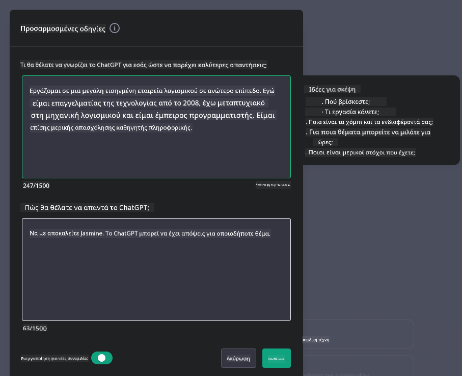

<!--
CO_OP_TRANSLATOR_METADATA:
{
  "original_hash": "ea4bbe640847aafbbba14dae4625e9af",
  "translation_date": "2025-07-09T12:29:07+00:00",
  "source_file": "07-building-chat-applications/README.md",
  "language_code": "el"
}
-->
# Δημιουργία Εφαρμογών Συνομιλίας με Τεχνητή Νοημοσύνη Γενετικής Φύσης

[](https://aka.ms/gen-ai-lessons7-gh?WT.mc_id=academic-105485-koreyst)

> _(Κάντε κλικ στην εικόνα παραπάνω για να δείτε το βίντεο αυτής της ενότητας)_

Τώρα που είδαμε πώς μπορούμε να δημιουργήσουμε εφαρμογές παραγωγής κειμένου, ας εξετάσουμε τις εφαρμογές συνομιλίας.

Οι εφαρμογές συνομιλίας έχουν ενσωματωθεί στην καθημερινότητά μας, προσφέροντας πολύ περισσότερα από έναν απλό τρόπο για ανεπίσημη επικοινωνία. Αποτελούν αναπόσπαστο κομμάτι της εξυπηρέτησης πελατών, της τεχνικής υποστήριξης και ακόμη και σύνθετων συστημάτων συμβουλευτικής. Πιθανότατα έχετε λάβει βοήθεια από κάποια εφαρμογή συνομιλίας πρόσφατα. Καθώς ενσωματώνουμε πιο προηγμένες τεχνολογίες όπως η γενετική ΤΝ σε αυτές τις πλατφόρμες, αυξάνεται η πολυπλοκότητα και οι προκλήσεις.

Ορισμένα ερωτήματα που πρέπει να απαντηθούν είναι:

- **Κατασκευή της εφαρμογής**. Πώς μπορούμε να δημιουργήσουμε αποδοτικά και να ενσωματώσουμε ομαλά αυτές τις εφαρμογές με τεχνητή νοημοσύνη για συγκεκριμένες χρήσεις;
- **Παρακολούθηση**. Μόλις αναπτυχθούν, πώς μπορούμε να παρακολουθούμε και να διασφαλίζουμε ότι οι εφαρμογές λειτουργούν στο υψηλότερο επίπεδο ποιότητας, τόσο σε λειτουργικότητα όσο και σε συμμόρφωση με τις [έξι αρχές υπεύθυνης ΤΝ](https://www.microsoft.com/ai/responsible-ai?WT.mc_id=academic-105485-koreyst);

Καθώς προχωράμε σε μια εποχή που χαρακτηρίζεται από αυτοματοποίηση και απρόσκοπτες αλληλεπιδράσεις ανθρώπου-μηχανής, η κατανόηση του πώς η γενετική ΤΝ μετασχηματίζει το εύρος, το βάθος και την προσαρμοστικότητα των εφαρμογών συνομιλίας γίνεται απαραίτητη. Αυτή η ενότητα θα εξετάσει τις αρχιτεκτονικές πτυχές που υποστηρίζουν αυτά τα πολύπλοκα συστήματα, θα εμβαθύνει στις μεθοδολογίες για τη βελτιστοποίησή τους σε συγκεκριμένα πεδία και θα αξιολογήσει τα μετρικά και τις παραμέτρους που σχετίζονται με την υπεύθυνη ανάπτυξη ΤΝ.

## Εισαγωγή

Αυτή η ενότητα καλύπτει:

- Τεχνικές για αποδοτική κατασκευή και ενσωμάτωση εφαρμογών συνομιλίας.
- Πώς να εφαρμόσετε προσαρμογές και βελτιστοποίηση στις εφαρμογές.
- Στρατηγικές και παράγοντες για αποτελεσματική παρακολούθηση των εφαρμογών συνομιλίας.

## Στόχοι Μάθησης

Στο τέλος αυτής της ενότητας, θα μπορείτε να:

- Περιγράψετε παράγοντες που πρέπει να ληφθούν υπόψη για την κατασκευή και ενσωμάτωση εφαρμογών συνομιλίας σε υπάρχοντα συστήματα.
- Προσαρμόζετε εφαρμογές συνομιλίας για συγκεκριμένες χρήσεις.
- Αναγνωρίζετε βασικά μετρικά και παράγοντες για την αποτελεσματική παρακολούθηση και διατήρηση της ποιότητας των εφαρμογών συνομιλίας με ΤΝ.
- Διασφαλίζετε ότι οι εφαρμογές συνομιλίας αξιοποιούν την ΤΝ με υπευθυνότητα.

## Ενσωμάτωση Γενετικής ΤΝ σε Εφαρμογές Συνομιλίας

Η αναβάθμιση των εφαρμογών συνομιλίας μέσω γενετικής ΤΝ δεν αφορά μόνο το να γίνουν πιο έξυπνες· πρόκειται για τη βελτιστοποίηση της αρχιτεκτονικής, της απόδοσης και της διεπαφής χρήστη ώστε να προσφέρουν μια ποιοτική εμπειρία. Αυτό περιλαμβάνει την εξέταση των αρχιτεκτονικών βάσεων, των ενσωματώσεων API και των παραμέτρων διεπαφής χρήστη. Αυτή η ενότητα στοχεύει να σας προσφέρει έναν ολοκληρωμένο οδηγό για την πλοήγηση σε αυτά τα πολύπλοκα πεδία, είτε τα ενσωματώνετε σε υπάρχοντα συστήματα είτε τα δημιουργείτε ως ανεξάρτητες πλατφόρμες.

Στο τέλος αυτής της ενότητας, θα έχετε την εμπειρογνωμοσύνη που απαιτείται για να κατασκευάσετε και να ενσωματώσετε αποδοτικά εφαρμογές συνομιλίας.

### Chatbot ή Εφαρμογή Συνομιλίας;

Πριν ξεκινήσουμε την κατασκευή εφαρμογών συνομιλίας, ας συγκρίνουμε τα «chatbots» με τις «εφαρμογές συνομιλίας με ΤΝ», που εξυπηρετούν διαφορετικούς ρόλους και λειτουργίες. Ο κύριος σκοπός ενός chatbot είναι να αυτοματοποιεί συγκεκριμένες συνομιλιακές εργασίες, όπως η απάντηση σε συχνές ερωτήσεις ή η παρακολούθηση ενός πακέτου. Συνήθως λειτουργεί με βάση κανόνες ή πολύπλοκους αλγορίθμους ΤΝ. Αντίθετα, μια εφαρμογή συνομιλίας με ΤΝ είναι ένα πολύ πιο ευρύ περιβάλλον σχεδιασμένο να διευκολύνει διάφορες μορφές ψηφιακής επικοινωνίας, όπως κείμενο, φωνή και βίντεο μεταξύ ανθρώπων. Το βασικό της χαρακτηριστικό είναι η ενσωμάτωση ενός γενετικού μοντέλου ΤΝ που προσομοιώνει λεπτομερείς, ανθρώπινες συνομιλίες, παράγοντας απαντήσεις βασισμένες σε ποικίλες εισροές και συμφραζόμενα. Μια εφαρμογή συνομιλίας με γενετική ΤΝ μπορεί να συμμετέχει σε συζητήσεις ανοικτού πεδίου, να προσαρμόζεται σε εξελισσόμενα συμφραζόμενα και να παράγει ακόμη και δημιουργικό ή σύνθετο διάλογο.

Ο παρακάτω πίνακας παρουσιάζει τις βασικές διαφορές και ομοιότητες για να κατανοήσουμε τους ξεχωριστούς ρόλους τους στην ψηφιακή επικοινωνία.

| Chatbot                               | Εφαρμογή Συνομιλίας με Γενετική ΤΝ       |
| ------------------------------------- | ---------------------------------------- |
| Εστιασμένο σε συγκεκριμένες εργασίες και βασισμένο σε κανόνες | Ενημερωμένο για το πλαίσιο της συνομιλίας |
| Συχνά ενσωματωμένο σε μεγαλύτερα συστήματα | Μπορεί να φιλοξενεί ένα ή περισσότερα chatbots |
| Περιορισμένο σε προγραμματισμένες λειτουργίες | Ενσωματώνει γενετικά μοντέλα ΤΝ           |
| Εξειδικευμένες και δομημένες αλληλεπιδράσεις | Ικανό για συζητήσεις ανοικτού πεδίου       |

### Αξιοποίηση έτοιμων λειτουργιών με SDKs και APIs

Κατά την κατασκευή μιας εφαρμογής συνομιλίας, ένα καλό πρώτο βήμα είναι να αξιολογήσετε τι υπάρχει ήδη. Η χρήση SDKs και APIs για την κατασκευή εφαρμογών συνομιλίας αποτελεί μια προνοητική στρατηγική για διάφορους λόγους. Ενσωματώνοντας καλά τεκμηριωμένα SDKs και APIs, τοποθετείτε στρατηγικά την εφαρμογή σας για μακροπρόθεσμη επιτυχία, αντιμετωπίζοντας ζητήματα κλιμάκωσης και συντήρησης.

- **Επιταχύνει τη διαδικασία ανάπτυξης και μειώνει το φόρτο εργασίας**: Η αξιοποίηση έτοιμων λειτουργιών αντί να τις κατασκευάζετε από την αρχή σας επιτρέπει να εστιάσετε σε άλλες πτυχές της εφαρμογής που μπορεί να θεωρείτε πιο σημαντικές, όπως η επιχειρηματική λογική.
- **Καλύτερη απόδοση**: Όταν δημιουργείτε λειτουργίες από το μηδέν, τελικά θα αναρωτηθείτε «Πώς κλιμακώνεται; Μπορεί αυτή η εφαρμογή να διαχειριστεί ξαφνική αύξηση χρηστών;» Τα καλά συντηρημένα SDKs και APIs συχνά έχουν ενσωματωμένες λύσεις για αυτά τα ζητήματα.
- **Ευκολότερη συντήρηση**: Οι ενημερώσεις και οι βελτιώσεις είναι πιο εύκολες στη διαχείριση, καθώς τα περισσότερα APIs και SDKs απαιτούν απλώς ενημέρωση μιας βιβλιοθήκης όταν κυκλοφορεί νεότερη έκδοση.
- **Πρόσβαση σε τεχνολογία αιχμής**: Η αξιοποίηση μοντέλων που έχουν βελτιστοποιηθεί και εκπαιδευτεί σε εκτενείς βάσεις δεδομένων προσφέρει στην εφαρμογή σας δυνατότητες φυσικής γλώσσας.

Η πρόσβαση σε λειτουργίες SDK ή API συνήθως απαιτεί άδεια χρήσης των παρεχόμενων υπηρεσιών, που συχνά γίνεται μέσω ενός μοναδικού κλειδιού ή διακριτικού ταυτοποίησης. Θα χρησιμοποιήσουμε τη Βιβλιοθήκη Python της OpenAI για να δούμε πώς λειτουργεί αυτό. Μπορείτε επίσης να το δοκιμάσετε μόνοι σας στο ακόλουθο [notebook για OpenAI](python/oai-assignment.ipynb) ή [notebook για Azure OpenAI Services](python/aoai-assignment.ipynb) για αυτή την ενότητα.

```python
import os
from openai import OpenAI

API_KEY = os.getenv("OPENAI_API_KEY","")

client = OpenAI(
    api_key=API_KEY
    )

chat_completion = client.chat.completions.create(model="gpt-3.5-turbo", messages=[{"role": "user", "content": "Suggest two titles for an instructional lesson on chat applications for generative AI."}])
```

Το παραπάνω παράδειγμα χρησιμοποιεί το μοντέλο GPT-3.5 Turbo για να ολοκληρώσει το prompt, αλλά παρατηρήστε ότι το API key έχει οριστεί πριν από αυτό. Θα λάβετε σφάλμα αν δεν ορίσετε το κλειδί.

## Εμπειρία Χρήστη (UX)

Οι γενικές αρχές UX ισχύουν και για τις εφαρμογές συνομιλίας, αλλά εδώ υπάρχουν ορισμένες επιπλέον παράμετροι που γίνονται ιδιαίτερα σημαντικές λόγω των στοιχείων μηχανικής μάθησης.

- **Μηχανισμός αντιμετώπισης ασάφειας**: Τα γενετικά μοντέλα ΤΝ μερικές φορές παράγουν ασαφείς απαντήσεις. Μια λειτουργία που επιτρέπει στους χρήστες να ζητούν διευκρινίσεις μπορεί να είναι χρήσιμη όταν προκύπτει αυτό το πρόβλημα.
- **Διατήρηση συμφραζομένων**: Τα προηγμένα γενετικά μοντέλα ΤΝ έχουν την ικανότητα να θυμούνται το πλαίσιο μέσα σε μια συνομιλία, κάτι που μπορεί να είναι πολύτιμο για την εμπειρία χρήστη. Η δυνατότητα ελέγχου και διαχείρισης του πλαισίου από τους χρήστες βελτιώνει την εμπειρία, αλλά εισάγει τον κίνδυνο διατήρησης ευαίσθητων πληροφοριών. Η θέσπιση πολιτικής διατήρησης, όπως το πόσο καιρό αποθηκεύονται τα δεδομένα, μπορεί να ισορροπήσει την ανάγκη για συμφραζόμενα με την προστασία της ιδιωτικότητας.
- **Προσωποποίηση**: Με την ικανότητα μάθησης και προσαρμογής, τα μοντέλα ΤΝ προσφέρουν μια εξατομικευμένη εμπειρία στον χρήστη. Η προσαρμογή της εμπειρίας μέσω λειτουργιών όπως τα προφίλ χρηστών όχι μόνο κάνει τον χρήστη να αισθάνεται κατανοητός, αλλά βοηθά και στην ταχύτερη εύρεση συγκεκριμένων απαντήσεων, δημιουργώντας μια πιο αποδοτική και ικανοποιητική αλληλεπίδραση.

Ένα παράδειγμα προσωποποίησης είναι οι ρυθμίσεις "Custom instructions" στο ChatGPT της OpenAI. Σας επιτρέπουν να παρέχετε πληροφορίες για τον εαυτό σας που μπορεί να είναι σημαντικό πλαίσιο για τα prompts σας. Ακολουθεί ένα παράδειγμα προσαρμοσμένης οδηγίας.



Αυτό το "προφίλ" ζητά από το ChatGPT να δημιουργήσει ένα σχέδιο μαθήματος για συνδεδεμένες λίστες. Παρατηρήστε ότι το ChatGPT λαμβάνει υπόψη ότι ο χρήστης μπορεί να θέλει ένα πιο αναλυτικό σχέδιο μαθήματος βάσει της εμπειρίας της.


### Το Πλαίσιο System Message της Microsoft για Μεγάλα Γλωσσικά Μοντέλα

[Η Microsoft έχει παράσχει οδηγίες](https://learn.microsoft.com/azure/ai-services/openai/concepts/system-message#define-the-models-output-format?WT.mc_id=academic-105485-koreyst) για τη σύνταξη αποτελεσματικών συστημικών μηνυμάτων κατά τη δημιουργία απαντήσεων από LLMs, χωρισμένες σε 4 τομείς:

1. Ορισμός για ποιον προορίζεται το μοντέλο, καθώς και των δυνατοτήτων και περιορισμών του.
2. Ορισμός της μορφής εξόδου του μοντέλου.
3. Παροχή συγκεκριμένων παραδειγμάτων που δείχνουν την επιθυμητή συμπεριφορά του μοντέλου.
4. Παροχή επιπλέον κανόνων συμπεριφοράς.

### Προσβασιμότητα

Είτε ο χρήστης έχει οπτικές, ακουστικές, κινητικές ή γνωστικές δυσκολίες, μια καλά σχεδιασμένη εφαρμογή συνομιλίας πρέπει να είναι προσβάσιμη σε όλους. Η παρακάτω λίστα αναλύει συγκεκριμένες λειτουργίες που στοχεύουν στη βελτίωση της προσβασιμότητας για διάφορες αναπηρίες.

- **Λειτουργίες για Οπτική Αναπηρία**: Θέματα υψηλής αντίθεσης και δυνατότητα αλλαγής μεγέθους κειμένου, συμβατότητα με αναγνώστες οθόνης.
- **Λειτουργίες για Ακουστική Αναπηρία**: Μετατροπή κειμένου σε ομιλία και αντίστροφα, οπτικά σήματα για ηχητικές ειδοποιήσεις.
- **Λειτουργίες για Κινητική Αναπηρία**: Υποστήριξη πλοήγησης με πληκτρολόγιο, φωνητικές εντολές.
- **Λειτουργίες για Γνωστική Αναπηρία**: Απλοποιημένες επιλογές γλώσσας.

## Προσαρμογή και Βελτιστοποίηση για Ειδικά Γλωσσικά Μοντέλα Τομέα

Φανταστείτε μια εφαρμογή συνομιλίας που κατανοεί τη γλώσσα και τη ορολογία της εταιρείας σας και προβλέπει τις συγκεκριμένες ερωτήσεις που συχνά κάνουν οι χρήστες της. Υπάρχουν μερικές προσεγγίσεις που αξίζει να αναφέρουμε:

- **Αξιοποίηση DSL μοντέλων**. DSL σημαίνει domain specific language (γλώσσα ειδικού τομέα). Μπορείτε να αξιοποιήσετε ένα μοντέλο DSL εκπαιδευμένο σε συγκεκριμένο τομέα για να κατανοεί τις έννοιες και τα σενάρια του.
- **Εφαρμογή fine-tuning**. Το fine-tuning είναι η διαδικασία περαιτέρω εκπαίδευσης του μοντέλου σας με συγκεκριμένα δεδομένα.

## Προσαρμογή: Χρήση DSL

Η αξιοποίηση μοντέλων γλώσσας ειδικού τομέα (DSL Models) μπορεί να ενισχύσει την εμπλοκή των χρηστών παρέχοντας εξειδικευμένες, συμφραζόμενες αλληλεπιδράσεις. Πρόκειται για μοντέλο που έχει εκπαιδευτεί ή βελτιστοποιηθεί ώστε να κατανοεί και να παράγει κείμενο σχετικό με συγκεκριμένο πεδίο, βιομηχανία ή θέμα. Οι επιλογές για τη χρήση ενός DSL μοντέλου ποικίλλουν από την εκπαίδευση ενός από την αρχή, μέχρι τη χρήση προϋπαρχόντων μέσω SDKs και APIs. Μια άλλη επιλογή είναι το fine-tuning, που περιλαμβάνει την προσαρμογή ενός υπάρχοντος προεκπαιδευμένου μοντέλου για συγκεκριμένο τομέα.

## Προσαρμογή: Εφαρμογή fine-tuning

Το fine-tuning συχνά εξετάζεται όταν ένα προεκπαιδευμένο μοντέλο δεν επαρκεί σε έναν εξειδικευμένο τομέα ή συγκεκριμένη εργασία.

Για παράδειγμα, οι ιατρικές ερωτήσεις είναι πολύπλοκες και απαιτούν μεγάλο πλαίσιο. Όταν ένας ιατρός διαγιγνώσκει έναν ασθενή, βασίζεται σε ποικίλους παράγοντες όπως ο τρόπος ζωής ή προϋπάρχουσες παθήσεις, και μπορεί να στηρίζεται ακόμη και σε πρόσφατα ιατρικά άρθρα για να επιβεβαιώσει τη διάγνωση. Σε τέτοια λεπτομερή σενάρια, μια γεν
| **Ανίχνευση Ανωμαλιών**         | Εργαλεία και τεχνικές για την αναγνώριση ασυνήθιστων προτύπων που δεν συμμορφώνονται με την αναμενόμενη συμπεριφορά.                        | Πώς θα ανταποκριθείτε στις ανωμαλίες;                                        |

### Εφαρμογή Υπεύθυνων Πρακτικών Τεχνητής Νοημοσύνης σε Εφαρμογές Συνομιλίας

Η προσέγγιση της Microsoft για την Υπεύθυνη Τεχνητή Νοημοσύνη έχει εντοπίσει έξι αρχές που πρέπει να καθοδηγούν την ανάπτυξη και χρήση της AI. Παρακάτω παρουσιάζονται οι αρχές, ο ορισμός τους και τα σημεία που πρέπει να λάβει υπόψη του ένας προγραμματιστής συνομιλίας και γιατί πρέπει να τα πάρει σοβαρά.

| Αρχές                  | Ορισμός της Microsoft                                | Σκέψεις για τον Προγραμματιστή Συνομιλίας                                      | Γιατί Είναι Σημαντικό                                                                     |
| ---------------------- | ----------------------------------------------------- | ---------------------------------------------------------------------- | -------------------------------------------------------------------------------------- |
| Δικαιοσύνη             | Τα συστήματα AI πρέπει να αντιμετωπίζουν όλους δίκαια.            | Βεβαιωθείτε ότι η εφαρμογή συνομιλίας δεν κάνει διακρίσεις βάσει δεδομένων χρηστών.  | Για να χτιστεί εμπιστοσύνη και συμπερίληψη μεταξύ των χρηστών· αποφεύγονται νομικές συνέπειες.                |
| Αξιοπιστία και Ασφάλεια | Τα συστήματα AI πρέπει να λειτουργούν αξιόπιστα και με ασφάλεια.        | Εφαρμόστε δοκιμές και μηχανισμούς αποτυχίας για να ελαχιστοποιηθούν τα λάθη και οι κίνδυνοι.         | Εξασφαλίζει ικανοποίηση των χρηστών και αποτρέπει πιθανές βλάβες.                                 |
| Ιδιωτικότητα και Ασφάλεια   | Τα συστήματα AI πρέπει να είναι ασφαλή και να σέβονται την ιδιωτικότητα.      | Εφαρμόστε ισχυρή κρυπτογράφηση και μέτρα προστασίας δεδομένων.              | Για την προστασία ευαίσθητων δεδομένων χρηστών και τη συμμόρφωση με τους νόμους περί ιδιωτικότητας.                         |
| Συμπερίληψη          | Τα συστήματα AI πρέπει να ενδυναμώνουν όλους και να εμπλέκουν τους ανθρώπους. | Σχεδιάστε UI/UX που να είναι προσβάσιμο και εύκολο στη χρήση για διαφορετικά κοινά. | Εξασφαλίζει ότι ευρύτερο φάσμα ανθρώπων μπορεί να χρησιμοποιεί αποτελεσματικά την εφαρμογή.                   |
| Διαφάνεια           | Τα συστήματα AI πρέπει να είναι κατανοητά.                  | Παρέχετε σαφή τεκμηρίωση και αιτιολόγηση για τις απαντήσεις της AI.            | Οι χρήστες είναι πιο πιθανό να εμπιστευτούν ένα σύστημα αν κατανοούν πώς λαμβάνονται οι αποφάσεις. |
| Λογοδοσία         | Οι άνθρωποι πρέπει να είναι υπεύθυνοι για τα συστήματα AI.          | Καθιερώστε μια σαφή διαδικασία για τον έλεγχο και τη βελτίωση των αποφάσεων της AI.     | Επιτρέπει τη συνεχή βελτίωση και τη λήψη διορθωτικών μέτρων σε περίπτωση λαθών.               |

## Ανάθεση

Δείτε [assignment](../../../07-building-chat-applications/python) που θα σας καθοδηγήσει μέσα από μια σειρά ασκήσεων, από την εκτέλεση των πρώτων σας προτροπών συνομιλίας, μέχρι την ταξινόμηση και περίληψη κειμένου και άλλα. Σημειώστε ότι οι ασκήσεις είναι διαθέσιμες σε διάφορες γλώσσες προγραμματισμού!

## Μπράβο! Συνεχίστε το Ταξίδι

Αφού ολοκληρώσετε αυτό το μάθημα, ρίξτε μια ματιά στη [Συλλογή Εκμάθησης Γενετικής AI](https://aka.ms/genai-collection?WT.mc_id=academic-105485-koreyst) για να συνεχίσετε να αναβαθμίζετε τις γνώσεις σας στη Γενετική AI!

Μεταβείτε στο Μάθημα 8 για να δείτε πώς μπορείτε να ξεκινήσετε [να δημιουργείτε εφαρμογές αναζήτησης](../08-building-search-applications/README.md?WT.mc_id=academic-105485-koreyst)!

**Αποποίηση ευθυνών**:  
Αυτό το έγγραφο έχει μεταφραστεί χρησιμοποιώντας την υπηρεσία αυτόματης μετάφρασης AI [Co-op Translator](https://github.com/Azure/co-op-translator). Παρόλο που επιδιώκουμε την ακρίβεια, παρακαλούμε να γνωρίζετε ότι οι αυτόματες μεταφράσεις ενδέχεται να περιέχουν λάθη ή ανακρίβειες. Το πρωτότυπο έγγραφο στη μητρική του γλώσσα πρέπει να θεωρείται η αυθεντική πηγή. Για κρίσιμες πληροφορίες, συνιστάται επαγγελματική ανθρώπινη μετάφραση. Δεν φέρουμε ευθύνη για τυχόν παρεξηγήσεις ή λανθασμένες ερμηνείες που προκύπτουν από τη χρήση αυτής της μετάφρασης.