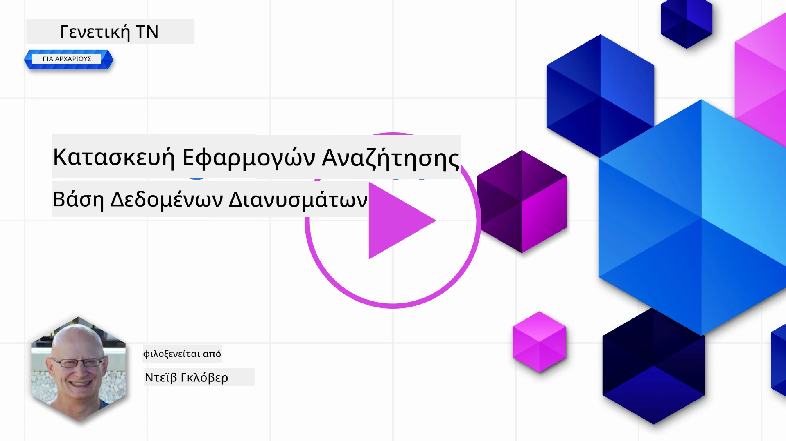
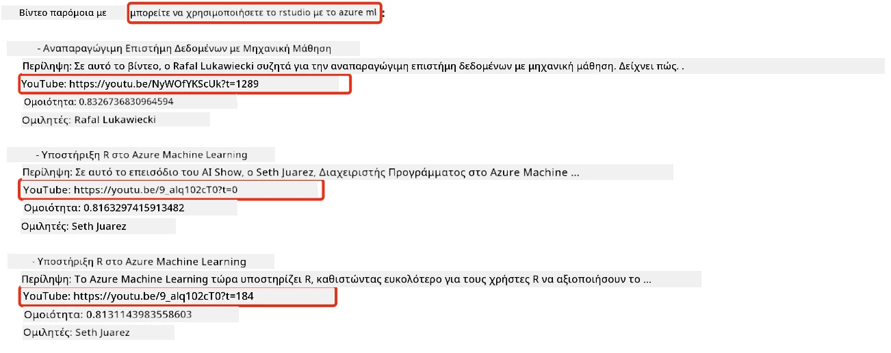
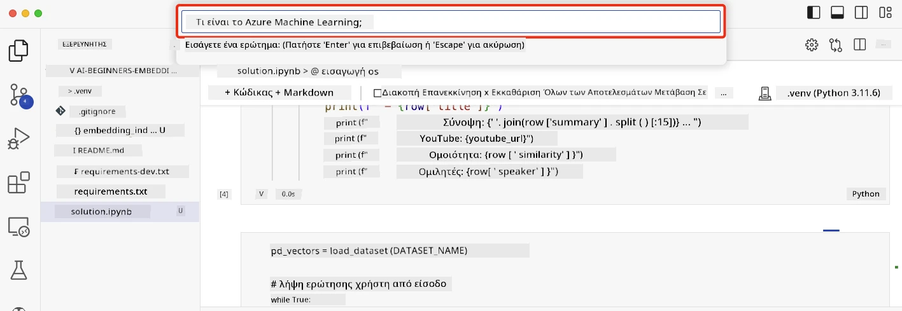

# Δημιουργία Εφαρμογών Αναζήτησης

[](https://youtu.be/W0-nzXjOjr0?si=GcsqiTTvd7RKbo7V)

> > _Κλικάρετε την εικόνα παραπάνω για να δείτε το βίντεο αυτού του μαθήματος_

Τα LLMs δεν είναι μόνο chatbots και δημιουργία κειμένου. Είναι επίσης δυνατό να δημιουργηθούν εφαρμογές αναζήτησης χρησιμοποιώντας Ενσωματώσεις (Embeddings). Οι Ενσωματώσεις είναι αριθμητικές αναπαραστάσεις δεδομένων, γνωστές και ως διανύσματα (vectors), και μπορούν να χρησιμοποιηθούν για σημασιολογική αναζήτηση δεδομένων.

Σε αυτό το μάθημα, θα δημιουργήσετε μια εφαρμογή αναζήτησης για το εκπαιδευτικό μας startup. Το startup μας είναι ένας μη κερδοσκοπικός οργανισμός που παρέχει δωρεάν εκπαίδευση σε μαθητές σε αναπτυσσόμενες χώρες. Το startup μας διαθέτει μεγάλο αριθμό βίντεο στο YouTube που οι μαθητές μπορούν να χρησιμοποιήσουν για να μάθουν για την Τεχνητή Νοημοσύνη. Το startup μας θέλει να δημιουργήσει μια εφαρμογή αναζήτησης που επιτρέπει στους μαθητές να αναζητούν βίντεο στο YouTube πληκτρολογώντας μια ερώτηση.

Για παράδειγμα, ένας μαθητής μπορεί να πληκτρολογήσει "Τι είναι τα Jupyter Notebooks;" ή "Τι είναι το Azure ML" και η εφαρμογή αναζήτησης θα επιστρέψει μια λίστα με βίντεο στο YouTube που σχετίζονται με την ερώτηση, και ακόμα καλύτερα, η εφαρμογή αναζήτησης θα επιστρέψει ένα σύνδεσμο στο σημείο του βίντεο όπου βρίσκεται η απάντηση στην ερώτηση.

## Εισαγωγή

Σε αυτό το μάθημα, θα καλύψουμε:

- Σημασιολογική αναζήτηση έναντι αναζήτησης με λέξεις-κλειδιά.
- Τι είναι οι Ενσωματώσεις Κειμένου.
- Δημιουργία ευρετηρίου Ενσωματώσεων Κειμένου.
- Αναζήτηση σε ευρετήριο Ενσωματώσεων Κειμένου.

## Στόχοι Μάθησης

Μετά την ολοκλήρωση αυτού του μαθήματος, θα μπορείτε να:

- Διακρίνετε τη διαφορά ανάμεσα σε σημασιολογική και αναζήτηση με λέξεις-κλειδιά.
- Εξηγήσετε τι είναι οι Ενσωματώσεις Κειμένου.
- Δημιουργήσετε μια εφαρμογή χρησιμοποιώντας Ενσωματώσεις για αναζήτηση δεδομένων.

## Γιατί να δημιουργήσετε μια εφαρμογή αναζήτησης;

Η δημιουργία μιας εφαρμογής αναζήτησης θα σας βοηθήσει να κατανοήσετε πώς να χρησιμοποιείτε τις Ενσωματώσεις για αναζήτηση δεδομένων. Επίσης, θα μάθετε πώς να δημιουργήσετε μια εφαρμογή αναζήτησης που μπορούν να χρησιμοποιούν οι μαθητές για να βρουν πληροφορίες γρήγορα.

Το μάθημα περιλαμβάνει ένα ευρετήριο Ενσωματώσεων από τα κείμενα των βίντεο του καναλιού YouTube Microsoft [AI Show](https://www.youtube.com/playlist?list=PLlrxD0HtieHi0mwteKBOfEeOYf0LJU4O1). Το AI Show είναι ένα κανάλι YouTube που διδάσκει για την Τεχνητή Νοημοσύνη και τη μηχανική μάθηση. Το ευρετήριο Ενσωματώσεων περιέχει τις Ενσωματώσεις για κάθε ένα από τα κείμενα των βίντεο έως τον Οκτώβριο του 2023. Θα χρησιμοποιήσετε το ευρετήριο Ενσωματώσεων για να δημιουργήσετε μια εφαρμογή αναζήτησης για το startup μας. Η εφαρμογή αναζήτησης επιστρέφει έναν σύνδεσμο στο σημείο του βίντεο όπου βρίσκεται η απάντηση στην ερώτηση. Αυτός είναι ένας καλός τρόπος για τους μαθητές να βρουν γρήγορα τις πληροφορίες που χρειάζονται.

Το ακόλουθο είναι ένα παράδειγμα σημασιολογικής ερώτησης για την ερώτηση 'μπορείς να χρησιμοποιήσεις το rstudio με το azure ml;'. Δείτε το URL του YouTube, θα δείτε ότι το URL περιέχει χρονική σήμανση που σας πηγαίνει στο σημείο του βίντεο όπου βρίσκεται η απάντηση στην ερώτηση.



## Τι είναι η σημασιολογική αναζήτηση;

Ίσως αναρωτιέστε, τι είναι η σημασιολογική αναζήτηση; Η σημασιολογική αναζήτηση είναι μια τεχνική αναζήτησης που χρησιμοποιεί τη σημασία, ή το νοήμα, των λέξεων σε μια ερώτηση για να επιστρέψει σχετικά αποτελέσματα.

Να ένα παράδειγμα σημασιολογικής αναζήτησης. Ας πούμε ότι θέλετε να αγοράσετε αυτοκίνητο, μπορεί να αναζητήσετε 'το αυτοκίνητο των ονείρων μου', η σημασιολογική αναζήτηση καταλαβαίνει ότι δεν `ονειρεύεστε` ένα αυτοκίνητο, αλλά ψάχνετε να αγοράσετε το `ιδανικό` σας αυτοκίνητο. Η σημασιολογική αναζήτηση κατανοεί την πρόθεσή σας και επιστρέφει σχετικά αποτελέσματα. Η εναλλακτική είναι η `αναζήτηση με λέξεις-κλειδιά` που κυριολεκτικά θα αναζητήσει όνειρα για αυτοκίνητα και συχνά επιστρέφει άσχετα αποτελέσματα.

## Τι είναι οι Ενσωματώσεις Κειμένου;

[Οι ενσωματώσεις κειμένου](https://en.wikipedia.org/wiki/Word_embedding?WT.mc_id=academic-105485-koreyst) είναι μια τεχνική αναπαράστασης κειμένου που χρησιμοποιείται στην [επεξεργασία φυσικής γλώσσας](https://en.wikipedia.org/wiki/Natural_language_processing?WT.mc_id=academic-105485-koreyst). Οι ενσωματώσεις κειμένου είναι σημασιολογικές αριθμητικές αναπαραστάσεις κειμένου. Οι ενσωματώσεις χρησιμοποιούνται για να αναπαραστήσουν δεδομένα με τρόπο που να είναι εύκολος για μια μηχανή να καταλάβει. Υπάρχουν πολλά μοντέλα για τη δημιουργία ενσωματώσεων κειμένου, σε αυτό το μάθημα θα εστιάσουμε στη δημιουργία ενσωματώσεων χρησιμοποιώντας το Μοντέλο Ενσωμάτωσης OpenAI.

Να ένα παράδειγμα, φανταστείτε ότι το παρακάτω κείμενο βρίσκεται σε μια απομαγνητοφώνηση από ένα από τα επεισόδια στο κανάλι AI Show YouTube:

```text
Today we are going to learn about Azure Machine Learning.
```

Θα περνούσαμε το κείμενο στο OpenAI Embedding API και θα επέστρεφε την ακόλουθη ενσωμάτωση που αποτελείται από 1536 αριθμούς, δηλαδή ένα διάνυσμα. Κάθε αριθμός στο διάνυσμα αντιπροσωπεύει μια διαφορετική πτυχή του κειμένου. Για συντομία, εδώ είναι οι πρώτοι 10 αριθμοί στο διάνυσμα.

```python
[-0.006655829958617687, 0.0026128944009542465, 0.008792596869170666, -0.02446001023054123, -0.008540431968867779, 0.022071078419685364, -0.010703742504119873, 0.003311325330287218, -0.011632772162556648, -0.02187200076878071, ...]
```

## Πώς δημιουργείται το ευρετήριο Ενσωματώσεων;

Το ευρετήριο Ενσωματώσεων για αυτό το μάθημα δημιουργήθηκε με μια σειρά από σκριπτ Python. Θα βρείτε τα σκριπτ μαζί με οδηγίες στο [README](./scripts/README.md?WT.mc_id=academic-105485-koreyst) στον φάκελο 'scripts' για αυτό το μάθημα. Δεν χρειάζεται να εκτελέσετε αυτά τα σκριπτ για να ολοκληρώσετε το μάθημα καθώς το ευρετήριο Ενσωματώσεων παρέχεται για εσάς.

Τα σκριπτ εκτελούν τις ακόλουθες λειτουργίες:

1. Τα απομαγνητοφωνημένα κείμενα για κάθε βίντεο YouTube στη λίστα αναπαραγωγής [AI Show](https://www.youtube.com/playlist?list=PLlrxD0HtieHi0mwteKBOfEeOYf0LJU4O1) κατεβαίνουν.
2. Χρησιμοποιώντας τις [Λειτουργίες OpenAI](https://learn.microsoft.com/azure/ai-foundry/openai/how-to/function-calling?WT.mc_id=academic-105485-koreyst), επιχειρεί να εξαχθεί το όνομα του ομιλητή από τα πρώτα 3 λεπτά της απομαγνητοφώνησης YouTube. Το όνομα του ομιλητή για κάθε βίντεο αποθηκεύεται στο ευρετήριο Ενσωματώσεων με την ονομασία `embedding_index_3m.json`.
3. Το κείμενο της απομαγνητοφώνησης χωρίζεται σε **3λεπτα κείμενα τμήματα**. Το τμήμα περιλαμβάνει περίπου 20 λέξεις επικαλυπτόμενες από το επόμενο τμήμα για να εξασφαλιστεί ότι η Ενσωμάτωση του τμήματος δεν κόβεται και για να παρέχει καλύτερο πλαίσιο αναζήτησης.
4. Κάθε τμήμα κειμένου περνάει μετά στο OpenAI Chat API για να συνοψιστεί σε 60 λέξεις. Η σύνοψη αποθηκεύεται επίσης στο ευρετήριο Ενσωματώσεων `embedding_index_3m.json`.
5. Τέλος, το κείμενο του τμήματος περνάει στο OpenAI Embedding API. Το Embedding API επιστρέφει ένα διάνυσμα 1536 αριθμών που αντιπροσωπεύουν το σημασιολογικό νόημα του τμήματος. Το τμήμα μαζί με το διάνυσμα OpenAI Embedding αποθηκεύεται σε ένα ευρετήριο Ενσωματώσεων `embedding_index_3m.json`.

### Βάσεις δεδομένων διανυσμάτων

Για απλότητα του μαθήματος, το ευρετήριο Ενσωματώσεων αποθηκεύεται σε αρχείο JSON με όνομα `embedding_index_3m.json` και φορτώνεται σε ένα Pandas DataFrame. Ωστόσο, στην παραγωγή, το ευρετήριο Ενσωματώσεων θα αποθηκευόταν σε βάση δεδομένων διανυσμάτων όπως το [Azure Cognitive Search](https://learn.microsoft.com/training/modules/improve-search-results-vector-search?WT.mc_id=academic-105485-koreyst), [Redis](https://cookbook.openai.com/examples/vector_databases/redis/readme?WT.mc_id=academic-105485-koreyst), [Pinecone](https://cookbook.openai.com/examples/vector_databases/pinecone/readme?WT.mc_id=academic-105485-koreyst), [Weaviate](https://cookbook.openai.com/examples/vector_databases/weaviate/readme?WT.mc_id=academic-105485-koreyst), για να αναφέρουμε μόνο μερικές.

## Κατανόηση της ομοιότητας με το συνημίτονο (cosine similarity)

Έχουμε μάθει για τις ενσωματώσεις κειμένου, το επόμενο βήμα είναι να μάθουμε πώς να χρησιμοποιούμε τις ενσωματώσεις κειμένου για να αναζητούμε δεδομένα και συγκεκριμένα να βρίσκουμε τις πιο παρόμοιες ενσωματώσεις με μια δεδομένη ερώτηση χρησιμοποιώντας την ομοιότητα συνημιτόνου.

### Τι είναι η ομοιότητα συνημιτόνου;

Η ομοιότητα συνημιτόνου είναι ένα μέτρο ομοιότητας μεταξύ δύο διανυσμάτων, θα ακούσετε επίσης ότι αναφέρεται ως `αναζήτηση πλησιέστερου γείτονα`. Για να κάνετε αναζήτηση με ομοιότητα συνημιτόνου πρέπει να _μετατρέψετε σε διάνυσμα_ το _κείμενο της ερώτησης_ χρησιμοποιώντας το OpenAI Embedding API. Στη συνέχεια υπολογίζετε την _ομοιότητα συνημιτόνου_ μεταξύ του διανύσματος της ερώτησης και κάθε διανύσματος στο ευρετήριο Ενσωματώσεων. Θυμηθείτε, το ευρετήριο Ενσωματώσεων έχει ένα διάνυσμα για κάθε τμήμα κειμένου απομαγνητοφώνησης YouTube. Τέλος, ταξινομείτε τα αποτελέσματα κατά ομοιότητα συνημιτόνου και τα τμήματα κειμένου με την υψηλότερη ομοιότητα συνημιτόνου είναι τα πιο παρόμοια με την ερώτηση.

Από μαθηματική σκοπιά, η ομοιότητα συνημιτόνου μετρά το συνημίτονο της γωνίας ανάμεσα σε δύο διανύσματα που προβάλλονται σε έναν πολυδιάστατο χώρο. Αυτή η μέτρηση είναι ωφέλιμη, γιατί αν δύο έγγραφα είναι απομακρυσμένα στον ευκλείδειο χώρο λόγω μεγέθους, μπορούν παρ' όλα αυτά να έχουν μικρότερη γωνία μεταξύ τους και επομένως υψηλότερη ομοιότητα συνημιτόνου. Για περισσότερες πληροφορίες σχετικά με τις εξισώσεις ομοιότητας συνημιτόνου, δείτε [Ομοιότητα συνημιτόνου](https://en.wikipedia.org/wiki/Cosine_similarity?WT.mc_id=academic-105485-koreyst).

## Δημιουργία της πρώτης σας εφαρμογής αναζήτησης

Στη συνέχεια, θα μάθουμε πώς να δημιουργήσουμε μια εφαρμογή αναζήτησης χρησιμοποιώντας τις Ενσωματώσεις. Η εφαρμογή αναζήτησης θα επιτρέπει στους μαθητές να αναζητούν ένα βίντεο πληκτρολογώντας μια ερώτηση. Η εφαρμογή αναζήτησης θα επιστρέφει μια λίστα με βίντεο που είναι σχετικά με την ερώτηση. Επιπλέον, η εφαρμογή αναζήτησης θα επιστρέφει έναν σύνδεσμο στο σημείο του βίντεο όπου βρίσκεται η απάντηση στην ερώτηση.

Αυτή η λύση δημιουργήθηκε και δοκιμάστηκε σε Windows 11, macOS και Ubuntu 22.04 χρησιμοποιώντας Python 3.10 ή νεότερη έκδοση. Μπορείτε να κατεβάσετε την Python από το [python.org](https://www.python.org/downloads/?WT.mc_id=academic-105485-koreyst).

## Άσκηση - δημιουργία εφαρμογής αναζήτησης για να βοηθήσουμε τους μαθητές

Παρουσιάσαμε το startup μας στην αρχή αυτού του μαθήματος. Τώρα είναι καιρός να δώσουμε στους μαθητές τη δυνατότητα να δημιουργήσουν μια εφαρμογή αναζήτησης για τις αξιολογήσεις τους.

Σε αυτήν την άσκηση, θα δημιουργήσετε τις Υπηρεσίες Azure OpenAI που θα χρησιμοποιηθούν για να κατασκευάσετε την εφαρμογή αναζήτησης. Θα δημιουργήσετε τις ακόλουθες Υπηρεσίες Azure OpenAI. Θα χρειαστείτε μια συνδρομή Azure για να ολοκληρώσετε αυτήν την άσκηση.

### Ξεκινήστε το Azure Cloud Shell

1. Συνδεθείτε στο [Azure portal](https://portal.azure.com/?WT.mc_id=academic-105485-koreyst).
2. Επιλέξτε το εικονίδιο Cloud Shell πάνω δεξιά στο Azure portal.
3. Επιλέξτε **Bash** για τον τύπο περιβάλλοντος.

#### Δημιουργία ομάδας πόρων

> Για αυτές τις οδηγίες, χρησιμοποιούμε την ομάδα πόρων με όνομα "semantic-video-search" στην περιοχή East US.
> Μπορείτε να αλλάξετε το όνομα της ομάδας πόρων, αλλά όταν αλλάζετε την τοποθεσία των πόρων,
> ελέγξτε τον [πίνακα διαθεσιμότητας μοντέλων](https://aka.ms/oai/models?WT.mc_id=academic-105485-koreyst).

```shell
az group create --name semantic-video-search --location eastus
```

#### Δημιουργία πόρου Azure OpenAI Service

Από το Azure Cloud Shell, εκτελέστε την ακόλουθη εντολή για να δημιουργήσετε έναν πόρο Azure OpenAI Service.

```shell
az cognitiveservices account create --name semantic-video-openai --resource-group semantic-video-search \
    --location eastus --kind OpenAI --sku s0
```

#### Λήψη του endpoint και των κλειδιών για χρήση σε αυτήν την εφαρμογή

Από το Azure Cloud Shell, εκτελέστε τις ακόλουθες εντολές για να λάβετε το endpoint και τα κλειδιά για τον πόρο Azure OpenAI Service.

```shell
az cognitiveservices account show --name semantic-video-openai \
   --resource-group  semantic-video-search | jq -r .properties.endpoint
az cognitiveservices account keys list --name semantic-video-openai \
   --resource-group semantic-video-search | jq -r .key1
```

#### Ανάπτυξη του μοντέλου OpenAI Embedding

Από το Azure Cloud Shell, εκτελέστε την ακόλουθη εντολή για να αναπτύξετε το μοντέλο OpenAI Embedding.

```shell
az cognitiveservices account deployment create \
    --name semantic-video-openai \
    --resource-group  semantic-video-search \
    --deployment-name text-embedding-ada-002 \
    --model-name text-embedding-ada-002 \
    --model-version "2"  \
    --model-format OpenAI \
    --sku-capacity 100 --sku-name "Standard"
```

## Λύση

Ανοίξτε το [solution notebook](./python/aoai-solution.ipynb?WT.mc_id=academic-105485-koreyst) στο GitHub Codespaces και ακολουθήστε τις οδηγίες στο Jupyter Notebook.

Όταν εκτελέσετε το notebook, θα σας ζητηθεί να εισάγετε μια ερώτηση. Το πλαίσιο εισαγωγής θα μοιάζει ως εξής:



## Υπέροχη δουλειά! Συνεχίστε τη μάθησή σας

Μετά την ολοκλήρωση αυτού του μαθήματος, ρίξτε μια ματιά στη [συλλογή μάθησης για την Γενετική Τεχνητή Νοημοσύνη](https://aka.ms/genai-collection?WT.mc_id=academic-105485-koreyst) για να συνεχίσετε να βελτιώνετε τις γνώσεις σας στην Τεχνητή Νοημοσύνη!

Μεταβείτε στο Μάθημα 9 όπου θα δούμε πώς να [δημιουργήσουμε εφαρμογές δημιουργίας εικόνων](../09-building-image-applications/README.md?WT.mc_id=academic-105485-koreyst)!

---

<!-- CO-OP TRANSLATOR DISCLAIMER START -->
**Αποποίηση ευθυνών**:
Αυτό το έγγραφο έχει μεταφραστεί χρησιμοποιώντας την υπηρεσία μετάφρασης με τεχνητή νοημοσύνη [Co-op Translator](https://github.com/Azure/co-op-translator). Ενώ επιδιώκουμε την ακρίβεια, παρακαλούμε να έχετε υπόψη ότι οι αυτοματοποιημένες μεταφράσεις ενδέχεται να περιέχουν λάθη ή ανακρίβειες. Το πρωτότυπο έγγραφο στη μητρική του γλώσσα πρέπει να θεωρείται η αυθεντική πηγή. Για κρίσιμες πληροφορίες, συνιστάται επαγγελματική ανθρώπινη μετάφραση. Δεν φέρουμε ευθύνη για τυχόν παρεξηγήσεις ή λανθασμένες ερμηνείες που προκύπτουν από τη χρήση αυτής της μετάφρασης.
<!-- CO-OP TRANSLATOR DISCLAIMER END -->