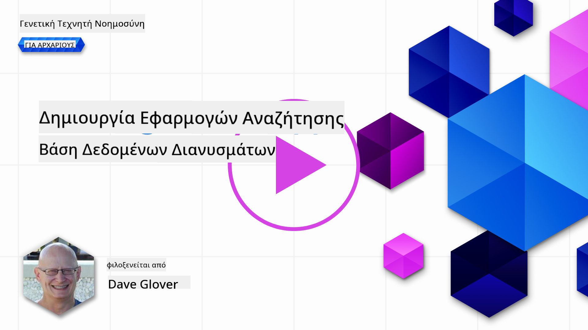
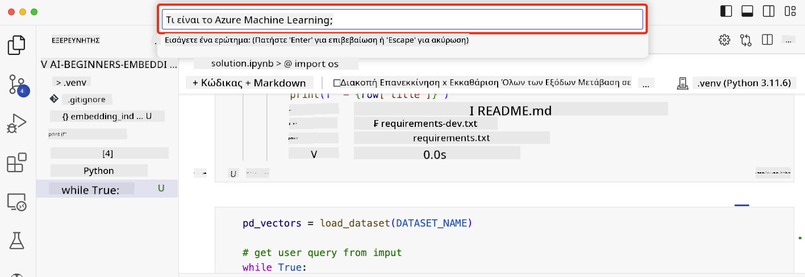

<!--
CO_OP_TRANSLATOR_METADATA:
{
  "original_hash": "d46aad0917a1a342d613e2c13d457da5",
  "translation_date": "2025-07-09T12:55:10+00:00",
  "source_file": "08-building-search-applications/README.md",
  "language_code": "el"
}
-->
# Δημιουργία Εφαρμογών Αναζήτησης

[](https://aka.ms/gen-ai-lesson8-gh?WT.mc_id=academic-105485-koreyst)

> > _Κάντε κλικ στην εικόνα παραπάνω για να δείτε το βίντεο αυτού του μαθήματος_

Τα LLM δεν περιορίζονται μόνο σε chatbots και δημιουργία κειμένου. Είναι επίσης εφικτό να δημιουργήσετε εφαρμογές αναζήτησης χρησιμοποιώντας Embeddings. Τα Embeddings είναι αριθμητικές αναπαραστάσεις δεδομένων, γνωστές και ως διανύσματα, και μπορούν να χρησιμοποιηθούν για σημασιολογική αναζήτηση δεδομένων.

Σε αυτό το μάθημα, θα δημιουργήσετε μια εφαρμογή αναζήτησης για το εκπαιδευτικό μας startup. Το startup μας είναι ένας μη κερδοσκοπικός οργανισμός που παρέχει δωρεάν εκπαίδευση σε φοιτητές σε αναπτυσσόμενες χώρες. Το startup μας διαθέτει μεγάλο αριθμό βίντεο στο YouTube που οι φοιτητές μπορούν να χρησιμοποιήσουν για να μάθουν για την Τεχνητή Νοημοσύνη. Θέλουμε να δημιουργήσουμε μια εφαρμογή αναζήτησης που θα επιτρέπει στους φοιτητές να αναζητούν βίντεο στο YouTube πληκτρολογώντας μια ερώτηση.

Για παράδειγμα, ένας φοιτητής μπορεί να πληκτρολογήσει «Τι είναι τα Jupyter Notebooks;» ή «Τι είναι το Azure ML» και η εφαρμογή αναζήτησης θα επιστρέψει μια λίστα με βίντεο στο YouTube που σχετίζονται με την ερώτηση, και ακόμα καλύτερα, η εφαρμογή θα επιστρέψει έναν σύνδεσμο στο σημείο του βίντεο όπου βρίσκεται η απάντηση στην ερώτηση.

## Εισαγωγή

Σε αυτό το μάθημα, θα καλύψουμε:

- Σημασιολογική έναντι αναζήτησης με λέξεις-κλειδιά.
- Τι είναι τα Text Embeddings.
- Δημιουργία ευρετηρίου Text Embeddings.
- Αναζήτηση σε ευρετήριο Text Embeddings.

## Στόχοι Μάθησης

Μετά την ολοκλήρωση αυτού του μαθήματος, θα μπορείτε να:

- Διακρίνετε τη διαφορά μεταξύ σημασιολογικής και αναζήτησης με λέξεις-κλειδιά.
- Εξηγήσετε τι είναι τα Text Embeddings.
- Δημιουργήσετε μια εφαρμογή που χρησιμοποιεί Embeddings για αναζήτηση δεδομένων.

## Γιατί να δημιουργήσετε μια εφαρμογή αναζήτησης;

Η δημιουργία μιας εφαρμογής αναζήτησης θα σας βοηθήσει να κατανοήσετε πώς να χρησιμοποιείτε τα Embeddings για αναζήτηση δεδομένων. Επίσης, θα μάθετε πώς να δημιουργήσετε μια εφαρμογή αναζήτησης που μπορούν να χρησιμοποιούν οι φοιτητές για να βρίσκουν πληροφορίες γρήγορα.

Το μάθημα περιλαμβάνει ένα Ευρετήριο Embeddings των απομαγνητοφωνήσεων βίντεο του καναλιού Microsoft [AI Show](https://www.youtube.com/playlist?list=PLlrxD0HtieHi0mwteKBOfEeOYf0LJU4O1) στο YouTube. Το AI Show είναι ένα κανάλι στο YouTube που διδάσκει για την Τεχνητή Νοημοσύνη και τη μηχανική μάθηση. Το Ευρετήριο Embeddings περιέχει τα Embeddings για κάθε απομαγνητοφώνηση βίντεο μέχρι τον Οκτώβριο του 2023. Θα χρησιμοποιήσετε το Ευρετήριο Embeddings για να δημιουργήσετε μια εφαρμογή αναζήτησης για το startup μας. Η εφαρμογή αναζήτησης επιστρέφει έναν σύνδεσμο στο σημείο του βίντεο όπου βρίσκεται η απάντηση στην ερώτηση. Αυτός είναι ένας εξαιρετικός τρόπος για τους φοιτητές να βρίσκουν γρήγορα τις πληροφορίες που χρειάζονται.

Παρακάτω είναι ένα παράδειγμα σημασιολογικής αναζήτησης για την ερώτηση «μπορείς να χρησιμοποιήσεις rstudio με το azure ml;». Δείτε το URL του YouTube, θα παρατηρήσετε ότι περιέχει χρονική σήμανση που σας οδηγεί στο σημείο του βίντεο όπου βρίσκεται η απάντηση στην ερώτηση.


## Τι είναι η σημασιολογική αναζήτηση;

Ίσως αναρωτιέστε, τι είναι η σημασιολογική αναζήτηση; Η σημασιολογική αναζήτηση είναι μια τεχνική αναζήτησης που χρησιμοποιεί τη σημασία ή το νόημα των λέξεων σε μια ερώτηση για να επιστρέψει σχετικά αποτελέσματα.

Ας δούμε ένα παράδειγμα σημασιολογικής αναζήτησης. Ας υποθέσουμε ότι θέλετε να αγοράσετε ένα αυτοκίνητο, μπορεί να αναζητήσετε «το αυτοκίνητο των ονείρων μου». Η σημασιολογική αναζήτηση καταλαβαίνει ότι δεν «ονειρεύεστε» ένα αυτοκίνητο, αλλά ψάχνετε να αγοράσετε το «ιδανικό» σας αυτοκίνητο. Η σημασιολογική αναζήτηση κατανοεί την πρόθεσή σας και επιστρέφει σχετικά αποτελέσματα. Η εναλλακτική είναι η «αναζήτηση με λέξεις-κλειδιά» που θα αναζητούσε κυριολεκτικά όνειρα για αυτοκίνητα και συχνά επιστρέφει άσχετα αποτελέσματα.

## Τι είναι τα Text Embeddings;

[Τα Text embeddings](https://en.wikipedia.org/wiki/Word_embedding?WT.mc_id=academic-105485-koreyst) είναι μια τεχνική αναπαράστασης κειμένου που χρησιμοποιείται στην [επεξεργασία φυσικής γλώσσας](https://en.wikipedia.org/wiki/Natural_language_processing?WT.mc_id=academic-105485-koreyst). Τα Text embeddings είναι σημασιολογικές αριθμητικές αναπαραστάσεις κειμένου. Τα Embeddings χρησιμοποιούνται για να αναπαραστήσουν δεδομένα με τρόπο που είναι εύκολος για μια μηχανή να κατανοήσει. Υπάρχουν πολλά μοντέλα για τη δημιουργία text embeddings, σε αυτό το μάθημα θα εστιάσουμε στη δημιουργία embeddings χρησιμοποιώντας το OpenAI Embedding Model.

Ας δούμε ένα παράδειγμα, φανταστείτε ότι το παρακάτω κείμενο είναι απόσπασμα από μια απομαγνητοφώνηση ενός επεισοδίου του καναλιού AI Show στο YouTube:

```text
Today we are going to learn about Azure Machine Learning.
```

Θα περάσουμε το κείμενο στο OpenAI Embedding API και θα επιστρέψει το ακόλουθο embedding που αποτελείται από 1536 αριθμούς, δηλαδή ένα διάνυσμα. Κάθε αριθμός στο διάνυσμα αντιπροσωπεύει μια διαφορετική πτυχή του κειμένου. Για συντομία, εδώ είναι οι πρώτοι 10 αριθμοί του διανύσματος.

```python
[-0.006655829958617687, 0.0026128944009542465, 0.008792596869170666, -0.02446001023054123, -0.008540431968867779, 0.022071078419685364, -0.010703742504119873, 0.003311325330287218, -0.011632772162556648, -0.02187200076878071, ...]
```

## Πώς δημιουργείται το ευρετήριο Embedding;

Το ευρετήριο Embedding για αυτό το μάθημα δημιουργήθηκε με μια σειρά από σενάρια Python. Θα βρείτε τα σενάρια μαζί με οδηγίες στο [README](./scripts/README.md?WT.mc_id=academic-105485-koreyst) στον φάκελο 'scripts' αυτού του μαθήματος. Δεν χρειάζεται να εκτελέσετε αυτά τα σενάρια για να ολοκληρώσετε το μάθημα, καθώς το Ευρετήριο Embedding παρέχεται ήδη.

Τα σενάρια εκτελούν τις εξής ενέργειες:

1. Κατεβάζεται η απομαγνητοφώνηση για κάθε βίντεο στο playlist [AI Show](https://www.youtube.com/playlist?list=PLlrxD0HtieHi0mwteKBOfEeOYf0LJU4O1).
2. Χρησιμοποιώντας τις [OpenAI Functions](https://learn.microsoft.com/azure/ai-services/openai/how-to/function-calling?WT.mc_id=academic-105485-koreyst), επιχειρείται η εξαγωγή του ονόματος του ομιλητή από τα πρώτα 3 λεπτά της απομαγνητοφώνησης. Το όνομα του ομιλητή για κάθε βίντεο αποθηκεύεται στο Ευρετήριο Embedding με όνομα `embedding_index_3m.json`.
3. Το κείμενο της απομαγνητοφώνησης χωρίζεται σε **τμήματα κειμένου διάρκειας 3 λεπτών**. Το τμήμα περιλαμβάνει περίπου 20 λέξεις που επικαλύπτονται με το επόμενο τμήμα για να διασφαλιστεί ότι το Embedding του τμήματος δεν κόβεται και να παρέχεται καλύτερο πλαίσιο αναζήτησης.
4. Κάθε τμήμα κειμένου περνάει στο OpenAI Chat API για να συνοψιστεί σε 60 λέξεις. Η σύνοψη αποθηκεύεται επίσης στο Ευρετήριο Embedding `embedding_index_3m.json`.
5. Τέλος, το κείμενο του τμήματος περνάει στο OpenAI Embedding API. Το Embedding API επιστρέφει ένα διάνυσμα 1536 αριθμών που αναπαριστούν το σημασιολογικό νόημα του τμήματος. Το τμήμα μαζί με το διάνυσμα OpenAI Embedding αποθηκεύονται στο Ευρετήριο Embedding `embedding_index_3m.json`.

### Βάσεις Δεδομένων Διανυσμάτων

Για απλότητα του μαθήματος, το Ευρετήριο Embedding αποθηκεύεται σε αρχείο JSON με όνομα `embedding_index_3m.json` και φορτώνεται σε Pandas DataFrame. Ωστόσο, σε παραγωγικό περιβάλλον, το Ευρετήριο Embedding θα αποθηκευόταν σε βάση δεδομένων διανυσμάτων όπως το [Azure Cognitive Search](https://learn.microsoft.com/training/modules/improve-search-results-vector-search?WT.mc_id=academic-105485-koreyst), [Redis](https://cookbook.openai.com/examples/vector_databases/redis/readme?WT.mc_id=academic-105485-koreyst), [Pinecone](https://cookbook.openai.com/examples/vector_databases/pinecone/readme?WT.mc_id=academic-105485-koreyst), [Weaviate](https://cookbook.openai.com/examples/vector_databases/weaviate/readme?WT.mc_id=academic-105485-koreyst), για να αναφέρουμε μερικές.

## Κατανόηση της ομοιότητας συνημιτόνου (cosine similarity)

Έχουμε μάθει για τα text embeddings, το επόμενο βήμα είναι να μάθουμε πώς να χρησιμοποιούμε τα text embeddings για αναζήτηση δεδομένων και συγκεκριμένα πώς να βρίσκουμε τα πιο παρόμοια embeddings με μια δεδομένη ερώτηση χρησιμοποιώντας την ομοιότητα συνημιτόνου.

### Τι είναι η ομοιότητα συνημιτόνου;

Η ομοιότητα συνημιτόνου είναι ένα μέτρο ομοιότητας μεταξύ δύο διανυσμάτων, το οποίο συχνά αναφέρεται και ως `nearest neighbor search` (αναζήτηση πλησιέστερου γείτονα). Για να εκτελέσετε αναζήτηση με ομοιότητα συνημιτόνου, πρέπει να _μετατρέψετε σε διάνυσμα_ το κείμενο της _ερώτησης_ χρησιμοποιώντας το OpenAI Embedding API. Στη συνέχεια, υπολογίζετε την _ομοιότητα συνημιτόνου_ μεταξύ του διανύσματος της ερώτησης και κάθε διανύσματος στο Ευρετήριο Embedding. Θυμηθείτε, το Ευρετήριο Embedding έχει ένα διάνυσμα για κάθε τμήμα κειμένου απομαγνητοφώνησης βίντεο YouTube. Τέλος, ταξινομείτε τα αποτελέσματα με βάση την ομοιότητα συνημιτόνου και τα τμήματα κειμένου με την υψηλότερη ομοιότητα είναι τα πιο σχετικά με την ερώτηση.

Από μαθηματική σκοπιά, η ομοιότητα συνημιτόνου μετρά το συνημίτονο της γωνίας μεταξύ δύο διανυσμάτων που προβάλλονται σε έναν πολυδιάστατο χώρο. Αυτή η μέτρηση είναι χρήσιμη, γιατί αν δύο έγγραφα απέχουν πολύ μεταξύ τους με βάση την Ευκλείδεια απόσταση λόγω μεγέθους, μπορεί να έχουν μικρότερη γωνία μεταξύ τους και συνεπώς μεγαλύτερη ομοιότητα συνημιτόνου. Για περισσότερες πληροφορίες σχετικά με τις εξισώσεις ομοιότητας συνημιτόνου, δείτε [Cosine similarity](https://en.wikipedia.org/wiki/Cosine_similarity?WT.mc_id=academic-105485-koreyst).

## Δημιουργία της πρώτης σας εφαρμογής αναζήτησης

Στη συνέχεια, θα μάθουμε πώς να δημιουργήσουμε μια εφαρμογή αναζήτησης χρησιμοποιώντας Embeddings. Η εφαρμογή αναζήτησης θα επιτρέπει στους φοιτητές να αναζητούν ένα βίντεο πληκτρολογώντας μια ερώτηση. Η εφαρμογή θα επιστρέφει μια λίστα βίντεο που σχετίζονται με την ερώτηση. Επίσης, θα επιστρέφει έναν σύνδεσμο στο σημείο του βίντεο όπου βρίσκεται η απάντηση στην ερώτηση.

Αυτή η λύση δημιουργήθηκε και δοκιμάστηκε σε Windows 11, macOS και Ubuntu 22.04 χρησιμοποιώντας Python 3.10 ή νεότερη έκδοση. Μπορείτε να κατεβάσετε την Python από το [python.org](https://www.python.org/downloads/?WT.mc_id=academic-105485-koreyst).

## Άσκηση - δημιουργία εφαρμογής αναζήτησης για να βοηθήσετε τους φοιτητές

Παρουσιάσαμε το startup μας στην αρχή αυτού του μαθήματος. Τώρα ήρθε η ώρα να δώσουμε τη δυνατότητα στους φοιτητές να δημιουργήσουν μια εφαρμογή αναζήτησης για τις αξιολογήσεις τους.

Σε αυτή την άσκηση, θα δημιουργήσετε τις Azure OpenAI Υπηρεσίες που θα χρησιμοποιηθούν για την κατασκευή της εφαρμογής αναζήτησης. Θα δημιουργήσετε τις ακόλουθες Azure OpenAI Υπηρεσίες. Θα χρειαστείτε μια συνδρομή Azure για να ολοκληρώσετε αυτή την άσκηση.

### Ξεκινήστε το Azure Cloud Shell

1. Συνδεθείτε στο [Azure portal](https://portal.azure.com/?WT.mc_id=academic-105485-koreyst).
2. Επιλέξτε το εικονίδιο Cloud Shell στην πάνω δεξιά γωνία του Azure portal.
3. Επιλέξτε **Bash** ως τύπο περιβάλλοντος.

#### Δημιουργία ομάδας πόρων

> Για αυτές τις οδηγίες, χρησιμοποιούμε την ομάδα πόρων με όνομα "semantic-video-search" στην περιοχή East US.
> Μπορείτε να αλλάξετε το όνομα της ομάδας πόρων, αλλά όταν αλλάζετε την τοποθεσία των πόρων,
> ελέγξτε τον [πίνακα διαθεσιμότητας μοντέλων](https://aka.ms/oai/models?WT.mc_id=academic-105485-koreyst).

```shell
az group create --name semantic-video-search --location eastus
```

#### Δημιουργία πόρου Azure OpenAI Service

Από το Azure Cloud Shell, εκτελέστε την παρακάτω εντολή για να δημιουργήσετε έναν πόρο Azure OpenAI Service.

```shell
az cognitiveservices account create --name semantic-video-openai --resource-group semantic-video-search \
    --location eastus --kind OpenAI --sku s0
```

#### Λήψη του endpoint και των κλειδιών για χρήση σε αυτή την εφαρμογή

Από το Azure Cloud Shell, εκτελέστε τις παρακάτω εντολές για να λάβετε το endpoint και τα κλειδιά για τον πόρο Azure OpenAI Service.

```shell
az cognitiveservices account show --name semantic-video-openai \
   --resource-group  semantic-video-search | jq -r .properties.endpoint
az cognitiveservices account keys list --name semantic-video-openai \
   --resource-group semantic-video-search | jq -r .key1
```

#### Ανάπτυξη του μοντέλου OpenAI Embedding

Από το Azure Cloud Shell, εκτελέστε την παρακάτω εντολή για να αναπτύξετε το μοντέλο OpenAI Embedding.

```shell
az cognitiveservices account deployment create \
    --name semantic-video-openai \
    --resource-group  semantic-video-search \
    --deployment-name text-embedding-ada-002 \
    --model-name text-embedding-ada-002 \
    --model-version "2"  \
    --model-format OpenAI \
    --sku-capacity 100 --sku-name "Standard"
```

## Λύση

Ανοίξτε το [solution notebook](python/aoai-solution.ipynb) στο GitHub Codespaces και ακολουθήστε τις οδηγίες στο Jupyter Notebook.

Όταν εκτελέσετε το notebook, θα σας ζητηθεί να εισάγετε μια ερώτηση. Το πλαίσιο εισαγωγής θα μοιάζει με το παρακάτω:



## Μπράβο! Συνεχίστε τη Μάθησή σας

Μετά την ολοκλήρωση αυτού του μαθήματος, ρίξτε μια ματιά στη [συλλογή μάθησης για Γενετική Τεχνητή Νοημοσύνη](https://aka.ms/genai-collection?WT.mc_id=academic-105485-koreyst) για να συνεχίσετε να εξελίσσετε τις γνώσεις σας στην Γενετική Τεχνητή Νοημοσύνη!

Πηγαίνετε στο Μάθημα 9 όπου θα δούμε πώς να [δημιουργούμε εφαρμογές δημιουργίας εικόνων](../09-building-image-applications/README.md?WT.mc_id=academic-105485-koreyst)!

**Αποποίηση ευθυνών**:  
Αυτό το έγγραφο έχει μεταφραστεί χρησιμοποιώντας την υπηρεσία αυτόματης μετάφρασης AI [Co-op Translator](https://github.com/Azure/co-op-translator). Παρόλο που επιδιώκουμε την ακρίβεια, παρακαλούμε να γνωρίζετε ότι οι αυτόματες μεταφράσεις ενδέχεται να περιέχουν λάθη ή ανακρίβειες. Το πρωτότυπο έγγραφο στη μητρική του γλώσσα πρέπει να θεωρείται η αυθεντική πηγή. Για κρίσιμες πληροφορίες, συνιστάται επαγγελματική ανθρώπινη μετάφραση. Δεν φέρουμε ευθύνη για τυχόν παρεξηγήσεις ή λανθασμένες ερμηνείες που προκύπτουν από τη χρήση αυτής της μετάφρασης.