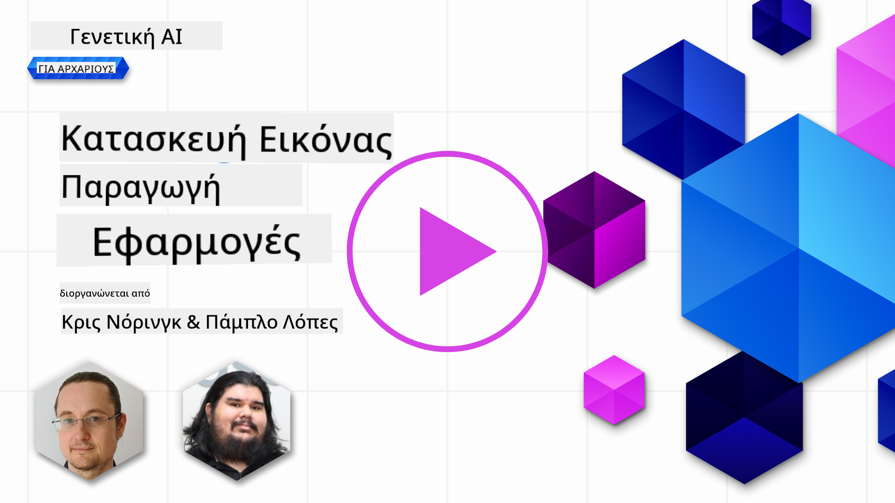

<!--
CO_OP_TRANSLATOR_METADATA:
{
  "original_hash": "ef74ad58fc01f7ad80788f79505f9816",
  "translation_date": "2025-08-26T17:04:58+00:00",
  "source_file": "09-building-image-applications/README.md",
  "language_code": "el"
}
-->
# Δημιουργία Εφαρμογών Παραγωγής Εικόνων

[](https://aka.ms/gen-ai-lesson9-gh?WT.mc_id=academic-105485-koreyst)

Τα LLMs δεν περιορίζονται μόνο στη δημιουργία κειμένου. Είναι επίσης δυνατό να δημιουργήσουμε εικόνες από περιγραφές κειμένου. Η ύπαρξη εικόνων ως μέσο μπορεί να είναι ιδιαίτερα χρήσιμη σε πολλούς τομείς, όπως η ιατρική τεχνολογία, η αρχιτεκτονική, ο τουρισμός, η ανάπτυξη παιχνιδιών και άλλα. Σε αυτό το κεφάλαιο, θα εξετάσουμε τα δύο πιο δημοφιλή μοντέλα παραγωγής εικόνων, DALL-E και Midjourney.

## Εισαγωγή

Σε αυτό το μάθημα, θα καλύψουμε:

- Τι είναι η παραγωγή εικόνων και γιατί είναι χρήσιμη.
- DALL-E και Midjourney, τι είναι και πώς λειτουργούν.
- Πώς να δημιουργήσετε μια εφαρμογή παραγωγής εικόνων.

## Στόχοι Μάθησης

Αφού ολοκληρώσετε αυτό το μάθημα, θα μπορείτε να:

- Δημιουργήσετε μια εφαρμογή παραγωγής εικόνων.
- Ορίσετε όρια για την εφαρμογή σας με μετα-προτροπές.
- Εργαστείτε με DALL-E και Midjourney.

## Γιατί να δημιουργήσετε μια εφαρμογή παραγωγής εικόνων;

Οι εφαρμογές παραγωγής εικόνων είναι ένας εξαιρετικός τρόπος να εξερευνήσετε τις δυνατότητες της Γενετικής Τεχνητής Νοημοσύνης. Μπορούν να χρησιμοποιηθούν, για παράδειγμα:

- **Επεξεργασία και σύνθεση εικόνων**. Μπορείτε να δημιουργήσετε εικόνες για διάφορες χρήσεις, όπως επεξεργασία και σύνθεση εικόνων.

- **Εφαρμογή σε διάφορους κλάδους**. Μπορούν επίσης να χρησιμοποιηθούν για τη δημιουργία εικόνων σε διάφορους κλάδους όπως η ιατρική τεχνολογία, ο τουρισμός, η ανάπτυξη παιχνιδιών και άλλα.

## Σενάριο: Edu4All

Στο πλαίσιο αυτού του μαθήματος, θα συνεχίσουμε να δουλεύουμε με τη startup μας, Edu4All. Οι μαθητές θα δημιουργήσουν εικόνες για τις εργασίες τους, το τι ακριβώς θα απεικονίζουν οι εικόνες εξαρτάται από τους ίδιους, αλλά θα μπορούσαν να είναι εικονογραφήσεις για το δικό τους παραμύθι, να δημιουργήσουν έναν νέο χαρακτήρα για την ιστορία τους ή να τους βοηθήσουν να οπτικοποιήσουν τις ιδέες και τις έννοιές τους.

Για παράδειγμα, αν οι μαθητές της Edu4All δουλεύουν στην τάξη πάνω σε μνημεία, θα μπορούσαν να δημιουργήσουν κάτι σαν:


χρησιμοποιώντας μια προτροπή όπως

> "Σκύλος δίπλα στον Πύργο του Άιφελ με πρωινό ηλιακό φως"

## Τι είναι το DALL-E και το Midjourney;

[DALL-E](https://openai.com/dall-e-2?WT.mc_id=academic-105485-koreyst) και [Midjourney](https://www.midjourney.com/?WT.mc_id=academic-105485-koreyst) είναι δύο από τα πιο δημοφιλή μοντέλα παραγωγής εικόνων, που σας επιτρέπουν να χρησιμοποιείτε προτροπές για να δημιουργείτε εικόνες.

### DALL-E

Ας ξεκινήσουμε με το DALL-E, το οποίο είναι ένα μοντέλο Γενετικής Τεχνητής Νοημοσύνης που δημιουργεί εικόνες από περιγραφές κειμένου.

> [Το DALL-E είναι ένας συνδυασμός δύο μοντέλων, CLIP και diffused attention](https://towardsdatascience.com/openais-dall-e-and-clip-101-a-brief-introduction-3a4367280d4e?WT.mc_id=academic-105485-koreyst).

- **CLIP**, είναι ένα μοντέλο που δημιουργεί embeddings, δηλαδή αριθμητικές αναπαραστάσεις δεδομένων, από εικόνες και κείμενο.

- **Diffused attention**, είναι ένα μοντέλο που δημιουργεί εικόνες από embeddings. Το DALL-E εκπαιδεύεται σε ένα σύνολο δεδομένων με εικόνες και κείμενο και μπορεί να χρησιμοποιηθεί για να δημιουργήσει εικόνες από περιγραφές κειμένου. Για παράδειγμα, το DALL-E μπορεί να χρησιμοποιηθεί για να δημιουργήσει εικόνες με μια γάτα που φοράει καπέλο ή έναν σκύλο με μοϊκάνα.

### Midjourney

Το Midjourney λειτουργεί παρόμοια με το DALL-E, δημιουργεί εικόνες από προτροπές κειμένου. Το Midjourney μπορεί επίσης να χρησιμοποιηθεί για να δημιουργήσει εικόνες με προτροπές όπως “γάτα με καπέλο” ή “σκύλος με μοϊκάνα”.


_Πηγή Wikipedia, εικόνα που δημιουργήθηκε από το Midjourney_

## Πώς λειτουργούν τα DALL-E και Midjourney

Αρχικά, [DALL-E](https://arxiv.org/pdf/2102.12092.pdf?WT.mc_id=academic-105485-koreyst). Το DALL-E είναι ένα μοντέλο Γενετικής Τεχνητής Νοημοσύνης βασισμένο στην αρχιτεκτονική transformer με έναν _autoregressive transformer_.

Ένας _autoregressive transformer_ καθορίζει πώς το μοντέλο δημιουργεί εικόνες από περιγραφές κειμένου, παράγοντας ένα pixel κάθε φορά και χρησιμοποιώντας τα παραγόμενα pixels για να δημιουργήσει το επόμενο. Περνάει από πολλαπλά επίπεδα ενός νευρωνικού δικτύου, μέχρι να ολοκληρωθεί η εικόνα.

Με αυτή τη διαδικασία, το DALL-E ελέγχει χαρακτηριστικά, αντικείμενα, ιδιότητες και άλλα στην εικόνα που δημιουργεί. Ωστόσο, τα DALL-E 2 και 3 προσφέρουν μεγαλύτερο έλεγχο στην παραγόμενη εικόνα.

## Δημιουργία της πρώτης εφαρμογής παραγωγής εικόνων

Τι χρειάζεται λοιπόν για να φτιάξετε μια εφαρμογή παραγωγής εικόνων; Χρειάζεστε τις παρακάτω βιβλιοθήκες:

- **python-dotenv**, συνιστάται ιδιαίτερα να χρησιμοποιήσετε αυτή τη βιβλιοθήκη για να κρατήσετε τα μυστικά σας σε ένα αρχείο _.env_ μακριά από τον κώδικα.
- **openai**, αυτή η βιβλιοθήκη χρησιμοποιείται για να αλληλεπιδράσετε με το OpenAI API.
- **pillow**, για να δουλέψετε με εικόνες στην Python.
- **requests**, για να κάνετε HTTP αιτήματα.

## Δημιουργία και ανάπτυξη μοντέλου Azure OpenAI

Αν δεν το έχετε κάνει ήδη, ακολουθήστε τις οδηγίες στη σελίδα [Microsoft Learn](https://learn.microsoft.com/azure/ai-foundry/openai/how-to/create-resource?pivots=web-portal)
για να δημιουργήσετε ένα Azure OpenAI resource και μοντέλο. Επιλέξτε το DALL-E 3 ως μοντέλο.  

## Δημιουργία της εφαρμογής

1. Δημιουργήστε ένα αρχείο _.env_ με το παρακάτω περιεχόμενο:

   ```text
   AZURE_OPENAI_ENDPOINT=<your endpoint>
   AZURE_OPENAI_API_KEY=<your key>
   AZURE_OPENAI_DEPLOYMENT="dall-e-3"
   ```

   Βρείτε αυτές τις πληροφορίες στο Azure OpenAI Foundry Portal για το resource σας στην ενότητα "Deployments".

1. Συγκεντρώστε τις παραπάνω βιβλιοθήκες σε ένα αρχείο _requirements.txt_ ως εξής:

   ```text
   python-dotenv
   openai
   pillow
   requests
   ```

1. Στη συνέχεια, δημιουργήστε ένα εικονικό περιβάλλον και εγκαταστήστε τις βιβλιοθήκες:

   ```bash
   python3 -m venv venv
   source venv/bin/activate
   pip install -r requirements.txt
   ```

   Για Windows, χρησιμοποιήστε τις παρακάτω εντολές για να δημιουργήσετε και να ενεργοποιήσετε το εικονικό σας περιβάλλον:

   ```bash
   python3 -m venv venv
   venv\Scripts\activate.bat
   ```

1. Προσθέστε τον παρακάτω κώδικα σε ένα αρχείο με όνομα _app.py_:

    ```python
    import openai
    import os
    import requests
    from PIL import Image
    import dotenv
    from openai import OpenAI, AzureOpenAI
    
    # import dotenv
    dotenv.load_dotenv()
    
    # configure Azure OpenAI service client 
    client = AzureOpenAI(
      azure_endpoint = os.environ["AZURE_OPENAI_ENDPOINT"],
      api_key=os.environ['AZURE_OPENAI_API_KEY'],
      api_version = "2024-02-01"
      )
    try:
        # Create an image by using the image generation API
        generation_response = client.images.generate(
                                prompt='Bunny on horse, holding a lollipop, on a foggy meadow where it grows daffodils',
                                size='1024x1024', n=1,
                                model=os.environ['AZURE_OPENAI_DEPLOYMENT']
                              )

        # Set the directory for the stored image
        image_dir = os.path.join(os.curdir, 'images')

        # If the directory doesn't exist, create it
        if not os.path.isdir(image_dir):
            os.mkdir(image_dir)

        # Initialize the image path (note the filetype should be png)
        image_path = os.path.join(image_dir, 'generated-image.png')

        # Retrieve the generated image
        image_url = generation_response.data[0].url  # extract image URL from response
        generated_image = requests.get(image_url).content  # download the image
        with open(image_path, "wb") as image_file:
            image_file.write(generated_image)

        # Display the image in the default image viewer
        image = Image.open(image_path)
        image.show()

    # catch exceptions
    except openai.InvalidRequestError as err:
        print(err)
   ```

Ας εξηγήσουμε αυτόν τον κώδικα:

- Πρώτα, εισάγουμε τις βιβλιοθήκες που χρειαζόμαστε, συμπεριλαμβανομένης της OpenAI, της dotenv, της requests και της Pillow.

  ```python
  import openai
  import os
  import requests
  from PIL import Image
  import dotenv
  ```

- Στη συνέχεια, φορτώνουμε τις μεταβλητές περιβάλλοντος από το αρχείο _.env_.

  ```python
  # import dotenv
  dotenv.load_dotenv()
  ```

- Έπειτα, ρυθμίζουμε τον client της υπηρεσίας Azure OpenAI 

  ```python
  # Get endpoint and key from environment variables
  client = AzureOpenAI(
      azure_endpoint = os.environ["AZURE_OPENAI_ENDPOINT"],
      api_key=os.environ['AZURE_OPENAI_API_KEY'],
      api_version = "2024-02-01"
      )
  ```

- Μετά, δημιουργούμε την εικόνα:

  ```python
  # Create an image by using the image generation API
  generation_response = client.images.generate(
                        prompt='Bunny on horse, holding a lollipop, on a foggy meadow where it grows daffodils',
                        size='1024x1024', n=1,
                        model=os.environ['AZURE_OPENAI_DEPLOYMENT']
                      )
  ```

  Ο παραπάνω κώδικας επιστρέφει ένα JSON αντικείμενο που περιέχει το URL της παραγόμενης εικόνας. Μπορούμε να χρησιμοποιήσουμε το URL για να κατεβάσουμε την εικόνα και να την αποθηκεύσουμε σε αρχείο.

- Τέλος, ανοίγουμε την εικόνα και χρησιμοποιούμε τον προεπιλεγμένο viewer για να τη δούμε:

  ```python
  image = Image.open(image_path)
  image.show()
  ```

### Περισσότερες λεπτομέρειες για τη δημιουργία της εικόνας

Ας δούμε τον κώδικα που δημιουργεί την εικόνα με περισσότερες λεπτομέρειες:

    ```python
      generation_response = client.images.generate(
                                prompt='Bunny on horse, holding a lollipop, on a foggy meadow where it grows daffodils',
                                size='1024x1024', n=1,
                                model=os.environ['AZURE_OPENAI_DEPLOYMENT']
                            )
    ```

- **prompt**, είναι η προτροπή κειμένου που χρησιμοποιείται για τη δημιουργία της εικόνας. Σε αυτή την περίπτωση, χρησιμοποιούμε την προτροπή "Λαγουδάκι πάνω σε άλογο, κρατάει γλειφιτζούρι, σε ομιχλώμενο λιβάδι όπου φυτρώνουν νάρκισσοι".
- **size**, είναι το μέγεθος της παραγόμενης εικόνας. Εδώ δημιουργούμε εικόνα 1024x1024 pixels.
- **n**, είναι ο αριθμός των εικόνων που δημιουργούνται. Εδώ δημιουργούμε δύο εικόνες.
- **temperature**, είναι μια παράμετρος που ελέγχει το πόσο τυχαία θα είναι η έξοδος του μοντέλου. Η τιμή είναι μεταξύ 0 και 1, όπου το 0 σημαίνει ότι η έξοδος είναι καθορισμένη και το 1 ότι είναι τυχαία. Η προεπιλεγμένη τιμή είναι 0.7.

Υπάρχουν περισσότερα που μπορείτε να κάνετε με τις εικόνες, τα οποία θα δούμε στην επόμενη ενότητα.

## Πρόσθετες δυνατότητες παραγωγής εικόνων

Έχετε δει μέχρι τώρα πώς μπορέσαμε να δημιουργήσουμε μια εικόνα με λίγες γραμμές Python. Ωστόσο, υπάρχουν περισσότερα που μπορείτε να κάνετε με τις εικόνες.

Μπορείτε επίσης να κάνετε τα εξής:

- **Επεξεργασία εικόνων**. Παρέχοντας μια υπάρχουσα εικόνα, μια μάσκα και μια προτροπή, μπορείτε να αλλάξετε μια εικόνα. Για παράδειγμα, μπορείτε να προσθέσετε κάτι σε ένα μέρος της εικόνας. Φανταστείτε την εικόνα με το λαγουδάκι, μπορείτε να του προσθέσετε ένα καπέλο. Αυτό γίνεται παρέχοντας την εικόνα, μια μάσκα (που προσδιορίζει το σημείο της αλλαγής) και μια προτροπή κειμένου για το τι πρέπει να γίνει. 
> Note: αυτό δεν υποστηρίζεται στο DALL-E 3. 
 
Παράδειγμα με GPT Image:

    ```python
    response = client.images.edit(
        model="gpt-image-1",
        image=open("sunlit_lounge.png", "rb"),
        mask=open("mask.png", "rb"),
        prompt="A sunlit indoor lounge area with a pool containing a flamingo"
    )
    image_url = response.data[0].url
    ```

  Η αρχική εικόνα θα περιέχει μόνο το σαλόνι με την πισίνα, αλλά η τελική εικόνα θα έχει και ένα φλαμίνγκο:

<div style="display: flex; justify-content: space-between; align-items: center; margin: 20px 0;">
  
  
  
</div>


- **Δημιουργία παραλλαγών**. Η ιδέα είναι να πάρετε μια υπάρχουσα εικόνα και να ζητήσετε να δημιουργηθούν παραλλαγές. Για να δημιουργήσετε μια παραλλαγή, παρέχετε μια εικόνα και μια προτροπή κειμένου και κώδικα όπως παρακάτω:

  ```python
  response = openai.Image.create_variation(
    image=open("bunny-lollipop.png", "rb"),
    n=1,
    size="1024x1024"
  )
  image_url = response['data'][0]['url']
  ```

  > Note, αυτό υποστηρίζεται μόνο στο OpenAI

## Temperature

Το temperature είναι μια παράμετρος που ελέγχει το πόσο τυχαία θα είναι η έξοδος του μοντέλου. Η τιμή είναι μεταξύ 0 και 1, όπου το 0 σημαίνει ότι η έξοδος είναι καθορισμένη και το 1 ότι είναι τυχαία. Η προεπιλεγμένη τιμή είναι 0.7.

Ας δούμε ένα παράδειγμα για το πώς λειτουργεί το temperature, τρέχοντας αυτή την προτροπή δύο φορές:

> Προτροπή : "Λαγουδάκι πάνω σε άλογο, κρατάει γλειφιτζούρι, σε ομιχλώμενο λιβάδι όπου φυτρώνουν νάρκισσοι"


Τώρα ας τρέξουμε την ίδια προτροπή για να δούμε ότι δεν θα πάρουμε την ίδια εικόνα δύο φορές:


Όπως βλέπετε, οι εικόνες είναι παρόμοιες, αλλά όχι ίδιες. Ας δοκιμάσουμε να αλλάξουμε την τιμή του temperature σε 0.1 και να δούμε τι θα συμβεί:

```python
 generation_response = client.images.create(
        prompt='Bunny on horse, holding a lollipop, on a foggy meadow where it grows daffodils',    # Enter your prompt text here
        size='1024x1024',
        n=2
    )
```

### Αλλαγή του temperature

Ας προσπαθήσουμε να κάνουμε την απόκριση πιο καθορισμένη. Παρατηρούμε από τις δύο εικόνες που δημιουργήσαμε ότι στην πρώτη υπάρχει λαγουδάκι και στη δεύτερη άλογο, οπότε οι εικόνες διαφέρουν αρκετά.

Ας αλλάξουμε λοιπόν τον κώδικά μας και ας ορίσουμε το temperature στο 0, όπως παρακάτω:

```python
generation_response = client.images.create(
        prompt='Bunny on horse, holding a lollipop, on a foggy meadow where it grows daffodils',    # Enter your prompt text here
        size='1024x1024',
        n=2,
        temperature=0
    )
```

Τώρα όταν τρέξετε αυτόν τον κώδικα, θα πάρετε αυτές τις δύο εικόνες:

- 
- 

Εδώ μπορείτε να δείτε ξεκάθαρα ότι οι εικόνες μοιάζουν περισσότερο μεταξύ τους.

## Πώς να ορίσετε όρια για την εφαρμογή σας με μετα-προτροπές

Με το demo μας, μπορούμε ήδη να δημιουργούμε εικόνες για τους πελάτες μας. Ωστόσο, πρέπει να θέσουμε κάποια όρια για την εφαρμογή μας.

Για παράδειγμα, δεν θέλουμε να δημιουργούμε εικόνες που δεν είναι κατάλληλες για το χώρο εργασίας ή για παιδιά.

Αυτό μπορούμε να το πετύχουμε με _μετα-προτροπές_. Οι μετα-προτροπές είναι προτροπές κειμένου που χρησιμοποιούνται για να ελέγχουν την έξοδο του μοντέλου. Για παράδειγμα, μπορούμε να χρησιμοποιήσουμε μετα-προτροπές για να ελέγξουμε την έξοδο και να διασφαλίσουμε ότι οι παραγόμενες εικόνες είναι κατάλληλες για το χώρο εργασίας ή για παιδιά.

### Πώς λειτουργεί;

Πώς λειτουργούν λοιπόν οι μετα-προτροπές;

Οι μετα-προτροπές είναι προτροπές κειμένου που χρησιμοποιούνται για να ελέγχουν την έξοδο του μοντέλου, τοποθετούνται πριν από την προτροπή κειμένου και ενσωματώνονται στις εφαρμογές για να ελέγχουν την έξοδο του μοντέλου. Ενσωματώνουν την είσοδο της προτροπής και της μετα-προτροπής σε μία προτροπή κειμένου.

Ένα παράδειγμα μετα-προτροπής θα ήταν το εξής:

```text
You are an assistant designer that creates images for children.

The image needs to be safe for work and appropriate for children.

The image needs to be in color.

The image needs to be in landscape orientation.

The image needs to be in a 16:9 aspect ratio.

Do not consider any input from the following that is not safe for work or appropriate for children.

(Input)

```

Τώρα, ας δούμε πώς μπορούμε να χρησιμοποιήσουμε μετα-προτροπές στο demo μας.

```python
disallow_list = "swords, violence, blood, gore, nudity, sexual content, adult content, adult themes, adult language, adult humor, adult jokes, adult situations, adult"

meta_prompt =f"""You are an assistant designer that creates images for children.

The image needs to be safe for work and appropriate for children.

The image needs to be in color.

The image needs to be in landscape orientation.

The image needs to be in a 16:9 aspect ratio.

Do not consider any input from the following that is not safe for work or appropriate for children.
{disallow_list}
"""

prompt = f"{meta_prompt}
Create an image of a bunny on a horse, holding a lollipop"

# TODO add request to generate image
```

Από την παραπάνω προτροπή, μπορείτε να δείτε πώς όλες οι εικόνες που δημιουργούνται λαμβάνουν υπόψη τη μετα-προτροπή.

## Εργασία - ας δώσουμε δυνατότητες στους μαθητές

Παρουσιάσαμε το Edu4All στην αρχή του μαθήματος. Τώρα ήρθε η ώρα να δώσουμε στους μαθητές τη δυνατότητα να δημιουργήσουν εικόνες για τις εργασίες τους.

Οι μαθητές θα δημιουργήσουν εικόνες για τις εργασίες τους με θέμα τα μνημεία, το ποια μνημεία θα επιλέξουν είναι δική τους απόφαση
Αφού ολοκληρώσετε αυτό το μάθημα, ρίξτε μια ματιά στη [Συλλογή Εκμάθησης Γενετικής Τεχνητής Νοημοσύνης](https://aka.ms/genai-collection?WT.mc_id=academic-105485-koreyst) για να συνεχίσετε να αναβαθμίζετε τις γνώσεις σας στη Γενετική Τεχνητή Νοημοσύνη!

Περάστε στο Μάθημα 10 όπου θα δούμε πώς να [δημιουργείτε εφαρμογές τεχνητής νοημοσύνης με low-code](../10-building-low-code-ai-applications/README.md?WT.mc_id=academic-105485-koreyst)

---

**Αποποίηση Ευθύνης**:  
Αυτό το έγγραφο έχει μεταφραστεί χρησιμοποιώντας την υπηρεσία αυτόματης μετάφρασης AI [Co-op Translator](https://github.com/Azure/co-op-translator). Παρόλο που καταβάλλουμε προσπάθειες για ακρίβεια, παρακαλούμε να γνωρίζετε ότι οι αυτόματες μεταφράσεις ενδέχεται να περιέχουν σφάλματα ή ανακρίβειες. Το πρωτότυπο έγγραφο στη μητρική του γλώσσα πρέπει να θεωρείται η αυθεντική πηγή. Για κρίσιμες πληροφορίες, συνιστάται επαγγελματική ανθρώπινη μετάφραση. Δεν φέρουμε ευθύνη για τυχόν παρανοήσεις ή εσφαλμένες ερμηνείες που προκύπτουν από τη χρήση αυτής της μετάφρασης.