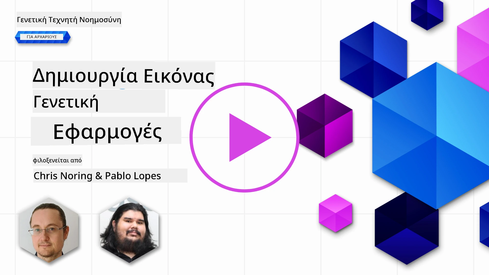

# Δημιουργία Εφαρμογών Παραγωγής Εικόνων

[](https://youtu.be/B5VP0_J7cs8?si=5P3L5o7F_uS_QcG9)

Υπάρχει περισσότερα στα LLMs από την παραγωγή κειμένου. Είναι επίσης δυνατό να δημιουργηθούν εικόνες από περιγραφές κειμένου. Η ύπαρξη εικόνων ως τρόπος έκφρασης μπορεί να είναι εξαιρετικά χρήσιμη σε πολλούς τομείς, από την Ιατρική Τεχνολογία, την αρχιτεκτονική, τον τουρισμό, την ανάπτυξη παιχνιδιών και άλλα. Σε αυτό το κεφάλαιο, θα εξετάσουμε τα δύο πιο δημοφιλή μοντέλα παραγωγής εικόνων, DALL-E και Midjourney.

## Εισαγωγή

Σε αυτό το μάθημα, θα καλύψουμε:

- Παραγωγή εικόνων και γιατί είναι χρήσιμη.
- Τι είναι τα DALL-E και Midjourney και πώς λειτουργούν.
- Πώς θα δημιουργούσατε μια εφαρμογή παραγωγής εικόνων.

## Στόχοι μάθησης

Μετά την ολοκλήρωση αυτού του μαθήματος, θα μπορείτε να:

- Δημιουργήσετε μια εφαρμογή παραγωγής εικόνων.
- Ορίσετε τα όρια της εφαρμογής σας με μεταπροτροπές.
- Δουλέψετε με τα DALL-E και Midjourney.

## Γιατί να δημιουργήσετε μια εφαρμογή παραγωγής εικόνων;

Οι εφαρμογές παραγωγής εικόνων είναι ένας εξαιρετικός τρόπος να εξερευνήσετε τις δυνατότητες της Δημιουργικής Τεχνητής Νοημοσύνης. Μπορούν να χρησιμοποιηθούν για, για παράδειγμα:

- **Επεξεργασία και σύνθεση εικόνων**. Μπορείτε να δημιουργήσετε εικόνες για ποικίλες χρήσεις, όπως η επεξεργασία και σύνθεση εικόνων.

- **Εφαρμογές σε διάφορους κλάδους**. Μπορούν επίσης να χρησιμοποιηθούν για να δημιουργήσουν εικόνες για ποικίλες βιομηχανίες όπως η Ιατρική Τεχνολογία, ο Τουρισμός, η ανάπτυξη παιχνιδιών και άλλα.

## Σενάριο: Edu4All

Στο πλαίσιο αυτού του μαθήματος, θα συνεχίσουμε να συνεργαζόμαστε με το startup μας, Edu4All, σε αυτό το μάθημα. Οι μαθητές θα δημιουργήσουν εικόνες για τις αξιολογήσεις τους, το ακριβές είδος των εικόνων αφήνεται στους μαθητές, αλλά θα μπορούσαν να είναι εικονογραφίες για το δικό τους παραμύθι ή να δημιουργήσουν έναν νέο χαρακτήρα για την ιστορία τους ή να τους βοηθήσουν να οπτικοποιήσουν τις ιδέες και τις έννοιές τους.

Να τι θα μπορούσαν να δημιουργήσουν οι μαθητές του Edu4All, για παράδειγμα αν εργάζονται στο μάθημα για μνημεία:


χρησιμοποιώντας μια προτροπή όπως

> "Σκύλος δίπλα στον Πύργο του Άιφελ στο φως του πρωινού ήλιου"

## Τι είναι τα DALL-E και Midjourney;

Τα [DALL-E](https://openai.com/dall-e-2?WT.mc_id=academic-105485-koreyst) και [Midjourney](https://www.midjourney.com/?WT.mc_id=academic-105485-koreyst) είναι δύο από τα πιο δημοφιλή μοντέλα παραγωγής εικόνων, που σας επιτρέπουν να χρησιμοποιείτε προτροπές για να δημιουργείτε εικόνες.

### DALL-E

Ας ξεκινήσουμε με το DALL-E, που είναι ένα μοντέλο Δημιουργικής Τεχνητής Νοημοσύνης που δημιουργεί εικόνες από περιγραφές κειμένου.

> [Το DALL-E είναι ένας συνδυασμός δύο μοντέλων, του CLIP και της διαχυτής προσοχής](https://towardsdatascience.com/openais-dall-e-and-clip-101-a-brief-introduction-3a4367280d4e?WT.mc_id=academic-105485-koreyst).

- Το **CLIP** είναι ένα μοντέλο που δημιουργεί ενσωματώσεις, οι οποίες είναι αριθμητικές αναπαραστάσεις δεδομένων, από εικόνες και κείμενο.

- Η **διαχυτή προσοχή** είναι ένα μοντέλο που δημιουργεί εικόνες από ενσωματώσεις. Το DALL-E έχει εκπαιδευτεί σε ένα σύνολο δεδομένων εικόνων και κειμένου και μπορεί να χρησιμοποιηθεί για να δημιουργήσει εικόνες από περιγραφές κειμένου. Για παράδειγμα, το DALL-E μπορεί να χρησιμοποιηθεί για να δημιουργήσει εικόνες μιας γάτας με καπέλο ή ενός σκύλου με μοϊκάνα.

### Midjourney

Το Midjourney λειτουργεί με παρόμοιο τρόπο με το DALL-E, δημιουργεί εικόνες από προτροπές κειμένου. Το Midjourney μπορεί επίσης να χρησιμοποιηθεί για να δημιουργήσει εικόνες χρησιμοποιώντας προτροπές όπως "μια γάτα με καπέλο" ή "ένας σκύλος με μοϊκάνα".


_Πιστωτικό εικόνας Wikipedia, εικόνα δημιουργημένη από το Midjourney_

## Πώς λειτουργούν τα DALL-E και Midjourney

Πρώτα, [DALL-E](https://arxiv.org/pdf/2102.12092.pdf?WT.mc_id=academic-105485-koreyst). Το DALL-E είναι ένα μοντέλο Δημιουργικής AI βασισμένο στην αρχιτεκτονική transformer με έναν _autoregressive transformer_.

Ένας _autoregressive transformer_ ορίζει πώς ένα μοντέλο δημιουργεί εικόνες από περιγραφές κειμένου, δημιουργεί ένα pixel κάθε φορά και μετά χρησιμοποιεί τα δημιουργημένα pixels για να δημιουργήσει το επόμενο pixel. Διαπερνά πολλές στρώσεις σε ένα νευρωνικό δίκτυο έως ότου η εικόνα ολοκληρωθεί.

Με αυτή τη διαδικασία, το DALL-E ελέγχει χαρακτηριστικά, αντικείμενα, ιδιότητες και άλλα στην εικόνα που δημιουργεί. Ωστόσο, τα DALL-E 2 και 3 έχουν περισσότερο έλεγχο στην παραγόμενη εικόνα.

## Δημιουργία της πρώτης σας εφαρμογής παραγωγής εικόνων

Τι χρειάζεται για να δημιουργήσετε μια εφαρμογή παραγωγής εικόνων; Χρειάζεστε τις εξής βιβλιοθήκες:

- **python-dotenv**, συνιστάται έντονα να χρησιμοποιήσετε αυτή τη βιβλιοθήκη για να κρατήσετε τα μυστικά σας σε αρχείο _.env_ μακριά από τον κώδικα.
- **openai**, αυτή η βιβλιοθήκη είναι που θα χρησιμοποιήσετε για να αλληλεπιδράσετε με το API του OpenAI.
- **pillow**, για να δουλέψετε με εικόνες στην Python.
- **requests**, για να βοηθήσει με τις HTTP αιτήσεις.

## Δημιουργία και ανάπτυξη ενός μοντέλου Azure OpenAI

Αν δεν το έχετε κάνει ήδη, ακολουθήστε τις οδηγίες στη σελίδα [Microsoft Learn](https://learn.microsoft.com/azure/ai-foundry/openai/how-to/create-resource?pivots=web-portal&WT.mc_id=academic-105485-koreyst)
για να δημιουργήσετε έναν πόρο και μοντέλο Azure OpenAI. Επιλέξτε **gpt-image-1** ως μοντέλο (το τρέχον μοντέλο παραγωγής εικόνων Azure OpenAI· το DALL-E 3 είναι παλιό και δεν είναι διαθέσιμο για νέες αναπτύξεις).

## Δημιουργία της εφαρμογής

1. Δημιουργήστε ένα αρχείο _.env_ με το ακόλουθο περιεχόμενο:

   ```text
   AZURE_OPENAI_ENDPOINT=<your endpoint>
   AZURE_OPENAI_API_KEY=<your key>
   AZURE_OPENAI_DEPLOYMENT="gpt-image-1"
   ```

   Βρείτε αυτές τις πληροφορίες στο Azure OpenAI Foundry Portal για τον πόρο σας στην ενότητα "Deployments".

1. Συγκεντρώστε τις παραπάνω βιβλιοθήκες σε ένα αρχείο που ονομάζεται _requirements.txt_ ως εξής:

   ```text
   python-dotenv
   openai
   pillow
   requests
   ```

1. Στη συνέχεια, δημιουργήστε ένα εικονικό περιβάλλον και εγκαταστήστε τις βιβλιοθήκες:

   ```bash
   python3 -m venv venv
   source venv/bin/activate
   pip install -r requirements.txt
   ```

   Για Windows, χρησιμοποιήστε τις παρακάτω εντολές για να δημιουργήσετε και να ενεργοποιήσετε το εικονικό περιβάλλον σας:

   ```bash
   python3 -m venv venv
   venv\Scripts\activate.bat
   ```

1. Προσθέστε τον παρακάτω κώδικα σε αρχείο που ονομάζεται _app.py_:

    ```python
    import openai
    import os
    import requests
    from PIL import Image
    import dotenv
    from openai import OpenAI, AzureOpenAI
    
    # εισαγωγή dotenv
    dotenv.load_dotenv()
    
    # ρυθμίστε τον πελάτη υπηρεσίας Azure OpenAI
    client = AzureOpenAI(
      azure_endpoint = os.environ["AZURE_OPENAI_ENDPOINT"],
      api_key=os.environ['AZURE_OPENAI_API_KEY'],
      api_version = "2024-10-21"
      )
    try:
        # Δημιουργήστε μια εικόνα χρησιμοποιώντας το API παραγωγής εικόνων
        generation_response = client.images.generate(
                                prompt='Bunny on horse, holding a lollipop, on a foggy meadow where it grows daffodils',
                                size='1024x1024', n=1,
                                model=os.environ['AZURE_OPENAI_DEPLOYMENT']
                              )

        # Ορίστε τον φάκελο για την αποθηκευμένη εικόνα
        image_dir = os.path.join(os.curdir, 'images')

        # Εάν ο φάκελος δεν υπάρχει, δημιουργήστε τον
        if not os.path.isdir(image_dir):
            os.mkdir(image_dir)

        # Αρχικοποιήστε τη διαδρομή της εικόνας (σημειώστε ότι ο τύπος αρχείου θα πρέπει να είναι png)
        image_path = os.path.join(image_dir, 'generated-image.png')

        # Ανάκτηση της παραγόμενης εικόνας
        image_url = generation_response.data[0].url  # εξαγάγετε το URL της εικόνας από την απάντηση
        generated_image = requests.get(image_url).content  # κατεβάστε την εικόνα
        with open(image_path, "wb") as image_file:
            image_file.write(generated_image)

        # Εμφανίστε την εικόνα στον προεπιλεγμένο προβολέα εικόνων
        image = Image.open(image_path)
        image.show()

    # χειριστείτε εξαιρέσεις
    except openai.BadRequestError as err:
        print(err)
   ```

Ας εξηγήσουμε αυτόν τον κώδικα:

- Πρώτα, εισάγουμε τις βιβλιοθήκες που χρειαζόμαστε, συμπεριλαμβανομένης της βιβλιοθήκης OpenAI, της dotenv, της requests και της Pillow.

  ```python
  import openai
  import os
  import requests
  from PIL import Image
  import dotenv
  ```

- Στη συνέχεια, φορτώνουμε τις μεταβλητές περιβάλλοντος από το αρχείο _.env_.

  ```python
  # εισαγωγή dotenv
  dotenv.load_dotenv()
  ```

- Μετά από αυτό, διαμορφώνουμε τον πελάτη υπηρεσίας Azure OpenAI

  ```python
  # Λάβετε το endpoint και το κλειδί από τις μεταβλητές περιβάλλοντος
  client = AzureOpenAI(
      azure_endpoint = os.environ["AZURE_OPENAI_ENDPOINT"],
      api_key=os.environ['AZURE_OPENAI_API_KEY'],
      api_version = "2024-10-21"
      )
  ```

- Στη συνέχεια, δημιουργούμε την εικόνα:

  ```python
  # Δημιουργήστε μια εικόνα χρησιμοποιώντας το API δημιουργίας εικόνων
  generation_response = client.images.generate(
                        prompt='Bunny on horse, holding a lollipop, on a foggy meadow where it grows daffodils',
                        size='1024x1024', n=1,
                        model=os.environ['AZURE_OPENAI_DEPLOYMENT']
                      )
  ```

  Ο παραπάνω κώδικας απαντά με ένα αντικείμενο JSON που περιέχει το URL της δημιουργημένης εικόνας. Μπορούμε να χρησιμοποιήσουμε το URL για να κατεβάσουμε την εικόνα και να την αποθηκεύσουμε σε αρχείο.

- Τέλος, ανοίγουμε την εικόνα και χρησιμοποιούμε τον προεπιλεγμένο προβολέα εικόνων για να την δείξουμε:

  ```python
  image = Image.open(image_path)
  image.show()
  ```

### Περισσότερες λεπτομέρειες σχετικά με τη δημιουργία της εικόνας

Ας δούμε τον κώδικα που δημιουργεί την εικόνα με περισσότερες λεπτομέρειες:

   ```python
     generation_response = client.images.generate(
                               prompt='Bunny on horse, holding a lollipop, on a foggy meadow where it grows daffodils',
                               size='1024x1024', n=1,
                               model=os.environ['AZURE_OPENAI_DEPLOYMENT']
                           )
   ```

- Η **prompt** είναι η κειμενική προτροπή που χρησιμοποιείται για τη δημιουργία της εικόνας. Σε αυτή την περίπτωση, χρησιμοποιούμε την προτροπή "Κουνέλι πάνω σε άλογο, κρατώντας μια γλειφιτζούρα, σε ομιχλώδη λιβάδι όπου φυτρώνουν νάρκισσοι".
- Το **size** είναι το μέγεθος της εικόνας που δημιουργείται. Σε αυτή την περίπτωση, δημιουργούμε μια εικόνα διαστάσεων 1024x1024 pixels.
- Το **n** είναι ο αριθμός των εικόνων που παράγονται. Σε αυτή την περίπτωση, παράγουμε δύο εικόνες.
- Η **temperature** είναι μια παράμετρος που ελέγχει την τυχαιότητα του αποτελέσματος ενός μοντέλου Δημιουργικής AI. Η θερμοκρασία είναι μια τιμή μεταξύ 0 και 1, όπου 0 σημαίνει ότι το αποτέλεσμα είναι ντετερμινιστικό και 1 ότι το αποτέλεσμα είναι τυχαίο. Η προεπιλεγμένη τιμή είναι 0.7.

Υπάρχουν περισσότερα που μπορείτε να κάνετε με εικόνες και θα τα καλύψουμε στην επόμενη ενότητα.

## Επιπλέον δυνατότητες της παραγωγής εικόνων

Έχετε δει μέχρι τώρα πώς μπορέσαμε να δημιουργήσουμε μια εικόνα χρησιμοποιώντας λίγες γραμμές στην Python. Ωστόσο, υπάρχουν περισσότερα που μπορείτε να κάνετε με εικόνες.

Μπορείτε επίσης να κάνετε τα ακόλουθα:

- **Επεξεργασία εικόνων**. Παρέχοντας μια υπάρχουσα εικόνα, μια μάσκα και μια προτροπή, μπορείτε να αλλάξετε μια εικόνα. Για παράδειγμα, μπορείτε να προσθέσετε κάτι σε ένα μέρος της εικόνας. Φανταστείτε την εικόνα με το κουνέλι, μπορείτε να προσθέσετε ένα καπέλο στο κουνέλι. Πώς το κάνετε αυτό; Παρέχοντας την εικόνα, μια μάσκα (που δείχνει το μέρος της περιοχής για την αλλαγή) και μια κειμενική προτροπή που λέει τι πρέπει να γίνει.
> Σημείωση: αυτό δεν υποστηρίζεται στο DALL-E 3.
 
Να ένα παράδειγμα που χρησιμοποιεί το GPT Image:

   ```python
   response = client.images.edit(
       model="gpt-image-1",
       image=open("sunlit_lounge.png", "rb"),
       mask=open("mask.png", "rb"),
       prompt="A sunlit indoor lounge area with a pool containing a flamingo"
   )
   image_url = response.data[0].url
   ```

  Η βασική εικόνα θα περιέχει μόνο τη βεράντα με την πισίνα αλλά η τελική εικόνα θα έχει ένα φλαμίγκο:

<div style="display: flex; justify-content: space-between; align-items: center; margin: 20px 0;">
  
  
  
</div>


- **Δημιουργία παραλλαγών**. Η ιδέα είναι να πάρετε μια υπάρχουσα εικόνα και να ζητήσετε να δημιουργηθούν παραλλαγές. Για να δημιουργήσετε μια παραλλαγή, παρέχετε μια εικόνα και μια κειμενική προτροπή και κώδικα όπως ο παρακάτω:

  ```python
  response = client.images.create_variation(
    image=open("bunny-lollipop.png", "rb"),
    n=1,
    size="1024x1024"
  )
  image_url = response.data[0].url
  ```

  > Σημείωση, αυτό υποστηρίζεται μόνο στο μοντέλο DALL-E 2 της OpenAI, όχι στο gpt-image-1

## Θερμοκρασία

Η θερμοκρασία είναι μια παράμετρος που ελέγχει την τυχαιότητα του αποτελέσματος ενός μοντέλου Δημιουργικής AI. Η θερμοκρασία είναι μια τιμή μεταξύ 0 και 1, όπου 0 σημαίνει ότι το αποτέλεσμα είναι ντετερμινιστικό και 1 ότι το αποτέλεσμα είναι τυχαίο. Η προεπιλεγμένη τιμή είναι 0.7.

Ας δούμε ένα παράδειγμα για το πώς λειτουργεί η θερμοκρασία, εκτελώντας αυτή την προτροπή δύο φορές:

> Προτροπή : "Κουνέλι πάνω σε άλογο, κρατώντας μια γλειφιτζούρα, σε ομιχλώδη λιβάδι όπου φυτρώνουν νάρκισσοι"


Τώρα ας τρέξουμε την ίδια προτροπή για να δούμε ότι δεν θα πάρουμε την ίδια εικόνα δύο φορές:


Όπως βλέπετε, οι εικόνες είναι παρόμοιες, αλλά όχι ίδιες. Ας δοκιμάσουμε να αλλάξουμε την τιμή θερμοκρασίας σε 0.1 και να δούμε τι συμβαίνει:

```python
 generation_response = client.images.generate(
        prompt='Bunny on horse, holding a lollipop, on a foggy meadow where it grows daffodils',    # Εισάγετε το κείμενο του αιτήματός σας εδώ
        size='1024x1024',
        n=2
    )
```

### Αλλαγή της θερμοκρασίας

Ας προσπαθήσουμε να κάνουμε την απόκριση πιο ντετερμινιστική. Μπορούμε να παρατηρήσουμε από τις δύο εικόνες που δημιουργήσαμε ότι στην πρώτη υπάρχει ένα κουνέλι και στη δεύτερη ένα άλογο, επομένως οι εικόνες διαφέρουν σημαντικά.

Ας αλλάξουμε λοιπόν τον κώδικά μας και ορίσουμε τη θερμοκρασία στο 0, ως εξής:

```python
generation_response = client.images.generate(
        prompt='Bunny on horse, holding a lollipop, on a foggy meadow where it grows daffodils',    # Εισάγετε το κείμενο προτροπής σας εδώ
        size='1024x1024',
        n=2,
        temperature=0
    )
```

Τώρα, όταν τρέχετε αυτόν τον κώδικα, παίρνετε αυτές τις δύο εικόνες:

- 
- 

Εδώ μπορείτε να δείτε καθαρά πόσο περισσότερο μοιάζουν οι εικόνες μεταξύ τους.

## Πώς να ορίσετε όρια για την εφαρμογή σας με μεταπροτροπές

Με το demo μας, μπορούμε ήδη να δημιουργήσουμε εικόνες για τους πελάτες μας. Ωστόσο, πρέπει να ορίσουμε κάποια όρια για την εφαρμογή μας.

Για παράδειγμα, δεν θέλουμε να δημιουργούμε εικόνες που δεν είναι κατάλληλες για το χώρο εργασίας ή που δεν είναι κατάλληλες για παιδιά.

Αυτό μπορούμε να το κάνουμε με _μεταπροτροπές_. Οι μεταπροτροπές είναι κειμενικές προτροπές που χρησιμοποιούνται για να ελέγξουν το αποτέλεσμα ενός μοντέλου Δημιουργικής AI. Για παράδειγμα, μπορούμε να χρησιμοποιήσουμε μεταπροτροπές για να ελέγξουμε το αποτέλεσμα και να διασφαλίσουμε ότι οι παραγόμενες εικόνες είναι ασφαλείς για το χώρο εργασίας ή κατάλληλες για παιδιά.

### Πώς λειτουργεί;

Τώρα, πώς λειτουργούν οι μεταπροτροπές;

Οι μεταπροτροπές είναι κειμενικές προτροπές που χρησιμοποιούνται για να ελέγξουν το αποτέλεσμα ενός μοντέλου Δημιουργικής AI, τοποθετούνται πριν από την προτροπή κειμένου και χρησιμοποιούνται για να ελέγξουν το αποτέλεσμα του μοντέλου και ενσωματώνονται σε εφαρμογές για τον έλεγχο του αποτελέσματος. Εγκλείουν την είσοδο προτροπής και την είσοδο μεταπροτροπής σε μια ενιαία προτροπή κειμένου.

Ένα παράδειγμα μεταπροτροπής θα ήταν το εξής:

```text
You are an assistant designer that creates images for children.

The image needs to be safe for work and appropriate for children.

The image needs to be in color.

The image needs to be in landscape orientation.

The image needs to be in a 16:9 aspect ratio.

Do not consider any input from the following that is not safe for work or appropriate for children.

(Input)

```

Τώρα, ας δούμε πώς μπορούμε να χρησιμοποιήσουμε τις μεταπροτροπές στο demo μας.

```python
disallow_list = "swords, violence, blood, gore, nudity, sexual content, adult content, adult themes, adult language, adult humor, adult jokes, adult situations, adult"

meta_prompt =f"""You are an assistant designer that creates images for children.

The image needs to be safe for work and appropriate for children.

The image needs to be in color.

The image needs to be in landscape orientation.

The image needs to be in a 16:9 aspect ratio.

Do not consider any input from the following that is not safe for work or appropriate for children.
{disallow_list}
"""

prompt = f"{meta_prompt}
Create an image of a bunny on a horse, holding a lollipop"

# TODO προσθήκη αιτήματος για δημιουργία εικόνας
```

Από την παραπάνω προτροπή, μπορείτε να δείτε πώς όλες οι δημιουργούμενες εικόνες λαμβάνουν υπόψη τη μεταπροτροπή.

## Ανάθεση - ας δώσουμε εξουσιοδότηση στους μαθητές

Παρουσιάσαμε το Edu4All στην αρχή αυτού του μαθήματος. Τώρα ήρθε η ώρα να δώσουμε τη δυνατότητα στους μαθητές να δημιουργούν εικόνες για τις αξιολογήσεις τους.


Οι μαθητές θα δημιουργήσουν εικόνες για τις αξιολογήσεις τους που θα περιέχουν μνημεία, ακριβώς ποια μνημεία εξαρτάται από τους μαθητές. Οι μαθητές καλούνται να χρησιμοποιήσουν τη δημιουργικότητά τους σε αυτήν την εργασία για να τοποθετήσουν αυτά τα μνημεία σε διαφορετικά πλαίσια.

## Λύση

Ακολουθεί μια πιθανή λύση:

```python
import openai
import os
import requests
from PIL import Image
import dotenv
from openai import AzureOpenAI
# εισαγωγή dotenv
dotenv.load_dotenv()

# Λάβετε τον τελικό σημείο και το κλειδί από τις μεταβλητές περιβάλλοντος
client = AzureOpenAI(
  azure_endpoint = os.environ["AZURE_OPENAI_ENDPOINT"],
  api_key=os.environ['AZURE_OPENAI_API_KEY'],
  api_version = "2024-10-21"
  )


disallow_list = "swords, violence, blood, gore, nudity, sexual content, adult content, adult themes, adult language, adult humor, adult jokes, adult situations, adult"

meta_prompt = f"""You are an assistant designer that creates images for children.

The image needs to be safe for work and appropriate for children.

The image needs to be in color.

The image needs to be in landscape orientation.

The image needs to be in a 16:9 aspect ratio.

Do not consider any input from the following that is not safe for work or appropriate for children.
{disallow_list}
"""

prompt = f"""{meta_prompt}
Generate monument of the Arc of Triumph in Paris, France, in the evening light with a small child holding a Teddy looks on.
"""

try:
    # Δημιουργήστε μια εικόνα χρησιμοποιώντας το API δημιουργίας εικόνας
    generation_response = client.images.generate(
        prompt=prompt,    # Εισάγετε το κείμενο προτροπής σας εδώ
        size='1024x1024',
        n=1,
    )
    # Ορίστε τον κατάλογο για την αποθηκευμένη εικόνα
    image_dir = os.path.join(os.curdir, 'images')

    # Εάν ο κατάλογος δεν υπάρχει, δημιουργήστε τον
    if not os.path.isdir(image_dir):
        os.mkdir(image_dir)

    # Αρχικοποιήστε τη διαδρομή της εικόνας (σημειώστε ότι ο τύπος αρχείου πρέπει να είναι png)
    image_path = os.path.join(image_dir, 'generated-image.png')

    # Ανάκτηση της δημιουργημένης εικόνας
    image_url = generation_response.data[0].url  # εξαγωγή URL της εικόνας από την απόκριση
    generated_image = requests.get(image_url).content  # λήψη της εικόνας
    with open(image_path, "wb") as image_file:
        image_file.write(generated_image)

    # Εμφάνιση της εικόνας στον προεπιλεγμένο προβολέα εικόνων
    image = Image.open(image_path)
    image.show()

# χειρισμός εξαιρέσεων
except openai.BadRequestError as err:
    print(err)
```

## Εξαιρετική δουλειά! Συνεχίστε την μάθησή σας

Αφού ολοκληρώσετε αυτό το μάθημα, ρίξτε μια ματιά στη [Συλλογή Μάθησης για Generative AI](https://aka.ms/genai-collection?WT.mc_id=academic-105485-koreyst) για να συνεχίσετε να βελτιώνετε τις γνώσεις σας στο Generative AI!

Μεταβείτε στο Μάθημα 10 όπου θα δούμε πώς να [δημιουργούμε εφαρμογές Τεχνητής Νοημοσύνης με χαμηλό κώδικα](../10-building-low-code-ai-applications/README.md?WT.mc_id=academic-105485-koreyst)

---

<!-- CO-OP TRANSLATOR DISCLAIMER START -->
**Αποποίηση ευθυνών**:
Αυτό το έγγραφο έχει μεταφραστεί χρησιμοποιώντας την υπηρεσία μετάφρασης με τεχνητή νοημοσύνη [Co-op Translator](https://github.com/Azure/co-op-translator). Ενώ επιδιώκουμε την ακρίβεια, παρακαλούμε να έχετε υπόψη ότι οι αυτοματοποιημένες μεταφράσεις ενδέχεται να περιέχουν λάθη ή ανακρίβειες. Το πρωτότυπο έγγραφο στη μητρική του γλώσσα πρέπει να θεωρείται η αυθεντική πηγή. Για κρίσιμες πληροφορίες, συνιστάται επαγγελματική ανθρώπινη μετάφραση. Δεν φέρουμε ευθύνη για τυχόν παρεξηγήσεις ή λανθασμένες ερμηνείες που προκύπτουν από τη χρήση αυτής της μετάφρασης.
<!-- CO-OP TRANSLATOR DISCLAIMER END -->