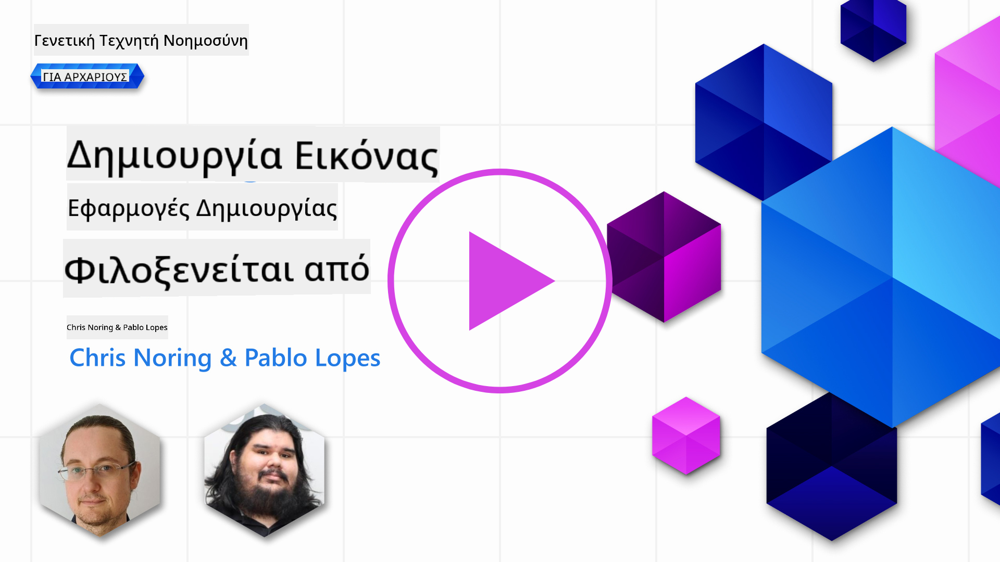

<!--
CO_OP_TRANSLATOR_METADATA:
{
  "original_hash": "1a7fd0f95f9eb673b79da47c0814f4d4",
  "translation_date": "2025-07-09T13:25:41+00:00",
  "source_file": "09-building-image-applications/README.md",
  "language_code": "el"
}
-->
# Δημιουργία Εφαρμογών Γεννήτριας Εικόνων

[](https://aka.ms/gen-ai-lesson9-gh?WT.mc_id=academic-105485-koreyst)

Τα LLM δεν περιορίζονται μόνο στη δημιουργία κειμένου. Είναι επίσης εφικτό να δημιουργούνται εικόνες από περιγραφές κειμένου. Η χρήση εικόνων ως μέσο μπορεί να είναι ιδιαίτερα χρήσιμη σε πολλούς τομείς, όπως η Ιατρική Τεχνολογία, η αρχιτεκτονική, ο τουρισμός, η ανάπτυξη παιχνιδιών και άλλοι. Σε αυτό το κεφάλαιο, θα εξετάσουμε τα δύο πιο δημοφιλή μοντέλα δημιουργίας εικόνων, το DALL-E και το Midjourney.

## Εισαγωγή

Σε αυτό το μάθημα, θα καλύψουμε:

- Τη δημιουργία εικόνων και γιατί είναι χρήσιμη.
- Τι είναι το DALL-E και το Midjourney, και πώς λειτουργούν.
- Πώς να δημιουργήσετε μια εφαρμογή δημιουργίας εικόνων.

## Στόχοι Μάθησης

Μετά την ολοκλήρωση αυτού του μαθήματος, θα μπορείτε να:

- Δημιουργήσετε μια εφαρμογή δημιουργίας εικόνων.
- Ορίσετε όρια για την εφαρμογή σας με meta prompts.
- Εργαστείτε με το DALL-E και το Midjourney.

## Γιατί να δημιουργήσετε μια εφαρμογή δημιουργίας εικόνων;

Οι εφαρμογές δημιουργίας εικόνων είναι ένας εξαιρετικός τρόπος να εξερευνήσετε τις δυνατότητες της Γεννητικής Τεχνητής Νοημοσύνης. Μπορούν να χρησιμοποιηθούν, για παράδειγμα:

- **Επεξεργασία και σύνθεση εικόνων**. Μπορείτε να δημιουργήσετε εικόνες για διάφορες χρήσεις, όπως επεξεργασία και σύνθεση εικόνων.

- **Εφαρμογή σε διάφορους κλάδους**. Μπορούν επίσης να χρησιμοποιηθούν για τη δημιουργία εικόνων σε διάφορους κλάδους όπως η Ιατρική Τεχνολογία, ο Τουρισμός, η Ανάπτυξη Παιχνιδιών και άλλοι.

## Σενάριο: Edu4All

Στο πλαίσιο αυτού του μαθήματος, θα συνεχίσουμε να συνεργαζόμαστε με το startup μας, Edu4All. Οι μαθητές θα δημιουργήσουν εικόνες για τις εργασίες τους, το τι είδους εικόνες είναι στην ευχέρεια των μαθητών, αλλά θα μπορούσαν να είναι εικονογραφήσεις για το δικό τους παραμύθι, να δημιουργήσουν έναν νέο χαρακτήρα για την ιστορία τους ή να τους βοηθήσουν να οπτικοποιήσουν τις ιδέες και τις έννοιές τους.

Ακολουθεί ένα παράδειγμα εικόνας που θα μπορούσαν να δημιουργήσουν οι μαθητές του Edu4All αν δουλεύουν στην τάξη πάνω σε μνημεία:


χρησιμοποιώντας ένα prompt όπως

> "Σκύλος δίπλα στον Πύργο του Άιφελ στο φως του πρωινού ήλιου"

## Τι είναι το DALL-E και το Midjourney;

Το [DALL-E](https://openai.com/dall-e-2?WT.mc_id=academic-105485-koreyst) και το [Midjourney](https://www.midjourney.com/?WT.mc_id=academic-105485-koreyst) είναι δύο από τα πιο δημοφιλή μοντέλα δημιουργίας εικόνων, που σας επιτρέπουν να χρησιμοποιείτε prompts για να δημιουργήσετε εικόνες.

### DALL-E

Ας ξεκινήσουμε με το DALL-E, ένα μοντέλο Γεννητικής Τεχνητής Νοημοσύνης που δημιουργεί εικόνες από περιγραφές κειμένου.

> [Το DALL-E είναι ένας συνδυασμός δύο μοντέλων, του CLIP και της διαχυμένης προσοχής](https://towardsdatascience.com/openais-dall-e-and-clip-101-a-brief-introduction-3a4367280d4e?WT.mc_id=academic-105485-koreyst).

- **CLIP**, είναι ένα μοντέλο που δημιουργεί embeddings, δηλαδή αριθμητικές αναπαραστάσεις δεδομένων, από εικόνες και κείμενο.

- **Διαχυμένη προσοχή (Diffused attention)**, είναι ένα μοντέλο που δημιουργεί εικόνες από embeddings. Το DALL-E έχει εκπαιδευτεί σε ένα σύνολο δεδομένων εικόνων και κειμένου και μπορεί να χρησιμοποιηθεί για να δημιουργήσει εικόνες από περιγραφές κειμένου. Για παράδειγμα, το DALL-E μπορεί να δημιουργήσει εικόνες μιας γάτας με καπέλο ή ενός σκύλου με μοϊκάνα.

### Midjourney

Το Midjourney λειτουργεί με παρόμοιο τρόπο με το DALL-E, δημιουργεί εικόνες από κείμενα. Το Midjourney μπορεί επίσης να χρησιμοποιηθεί για να δημιουργήσει εικόνες με prompts όπως «μια γάτα με καπέλο» ή «ένας σκύλος με μοϊκάνα».

  
_Πηγή εικόνας Wikipedia, εικόνα δημιουργημένη από το Midjourney_

## Πώς λειτουργούν το DALL-E και το Midjourney

Αρχικά, το [DALL-E](https://arxiv.org/pdf/2102.12092.pdf?WT.mc_id=academic-105485-koreyst). Το DALL-E είναι ένα μοντέλο Γεννητικής Τεχνητής Νοημοσύνης βασισμένο στην αρχιτεκτονική transformer με έναν _autoregressive transformer_.

Ένας _autoregressive transformer_ ορίζει πώς ένα μοντέλο δημιουργεί εικόνες από περιγραφές κειμένου, παράγοντας ένα pixel τη φορά και χρησιμοποιώντας τα ήδη παραγόμενα pixels για να δημιουργήσει το επόμενο. Διαπερνά πολλαπλά στρώματα σε ένα νευρωνικό δίκτυο, μέχρι να ολοκληρωθεί η εικόνα.

Με αυτή τη διαδικασία, το DALL-E ελέγχει χαρακτηριστικά, αντικείμενα, ιδιότητες και άλλα στην εικόνα που δημιουργεί. Ωστόσο, τα DALL-E 2 και 3 έχουν μεγαλύτερο έλεγχο στην παραγόμενη εικόνα.

## Δημιουργία της πρώτης σας εφαρμογής δημιουργίας εικόνων

Τι χρειάζεται για να δημιουργήσετε μια εφαρμογή δημιουργίας εικόνων; Χρειάζεστε τις παρακάτω βιβλιοθήκες:

- **python-dotenv**, συνιστάται έντονα να χρησιμοποιήσετε αυτή τη βιβλιοθήκη για να κρατάτε τα μυστικά σας σε ένα αρχείο _.env_ μακριά από τον κώδικα.
- **openai**, αυτή η βιβλιοθήκη είναι που θα χρησιμοποιήσετε για να αλληλεπιδράσετε με το OpenAI API.
- **pillow**, για να δουλέψετε με εικόνες σε Python.
- **requests**, για να κάνετε αιτήματα HTTP.

1. Δημιουργήστε ένα αρχείο _.env_ με το παρακάτω περιεχόμενο:

   ```text
   AZURE_OPENAI_ENDPOINT=<your endpoint>
   AZURE_OPENAI_API_KEY=<your key>
   ```

   Βρείτε αυτές τις πληροφορίες στο Azure Portal για τον πόρο σας στην ενότητα "Keys and Endpoint".

1. Συγκεντρώστε τις παραπάνω βιβλιοθήκες σε ένα αρχείο _requirements.txt_ ως εξής:

   ```text
   python-dotenv
   openai
   pillow
   requests
   ```

1. Στη συνέχεια, δημιουργήστε ένα virtual environment και εγκαταστήστε τις βιβλιοθήκες:

   ```bash
   python3 -m venv venv
   source venv/bin/activate
   pip install -r requirements.txt
   ```

   Για Windows, χρησιμοποιήστε τις παρακάτω εντολές για να δημιουργήσετε και να ενεργοποιήσετε το virtual environment:

   ```bash
   python3 -m venv venv
   venv\Scripts\activate.bat
   ```

1. Προσθέστε τον παρακάτω κώδικα σε ένα αρχείο με όνομα _app.py_:

   ```python
   import openai
   import os
   import requests
   from PIL import Image
   import dotenv

   # import dotenv
   dotenv.load_dotenv()

   # Get endpoint and key from environment variables
   openai.api_base = os.environ['AZURE_OPENAI_ENDPOINT']
   openai.api_key = os.environ['AZURE_OPENAI_API_KEY']

   # Assign the API version (DALL-E is currently supported for the 2023-06-01-preview API version only)
   openai.api_version = '2023-06-01-preview'
   openai.api_type = 'azure'


   try:
       # Create an image by using the image generation API
       generation_response = openai.Image.create(
           prompt='Bunny on horse, holding a lollipop, on a foggy meadow where it grows daffodils',    # Enter your prompt text here
           size='1024x1024',
           n=2,
           temperature=0,
       )
       # Set the directory for the stored image
       image_dir = os.path.join(os.curdir, 'images')

       # If the directory doesn't exist, create it
       if not os.path.isdir(image_dir):
           os.mkdir(image_dir)

       # Initialize the image path (note the filetype should be png)
       image_path = os.path.join(image_dir, 'generated-image.png')

       # Retrieve the generated image
       image_url = generation_response["data"][0]["url"]  # extract image URL from response
       generated_image = requests.get(image_url).content  # download the image
       with open(image_path, "wb") as image_file:
           image_file.write(generated_image)

       # Display the image in the default image viewer
       image = Image.open(image_path)
       image.show()

   # catch exceptions
   except openai.InvalidRequestError as err:
       print(err)

   ```

Ας εξηγήσουμε αυτόν τον κώδικα:

- Πρώτα, εισάγουμε τις βιβλιοθήκες που χρειαζόμαστε, συμπεριλαμβανομένων των openai, dotenv, requests και Pillow.

  ```python
  import openai
  import os
  import requests
  from PIL import Image
  import dotenv
  ```

- Στη συνέχεια, φορτώνουμε τις μεταβλητές περιβάλλοντος από το αρχείο _.env_.

  ```python
  # import dotenv
  dotenv.load_dotenv()
  ```

- Μετά, ορίζουμε το endpoint, το κλειδί για το OpenAI API, την έκδοση και τον τύπο.

  ```python
  # Get endpoint and key from environment variables
  openai.api_base = os.environ['AZURE_OPENAI_ENDPOINT']
  openai.api_key = os.environ['AZURE_OPENAI_API_KEY']

  # add version and type, Azure specific
  openai.api_version = '2023-06-01-preview'
  openai.api_type = 'azure'
  ```

- Έπειτα, δημιουργούμε την εικόνα:

  ```python
  # Create an image by using the image generation API
  generation_response = openai.Image.create(
      prompt='Bunny on horse, holding a lollipop, on a foggy meadow where it grows daffodils',    # Enter your prompt text here
      size='1024x1024',
      n=2,
      temperature=0,
  )
  ```

  Ο παραπάνω κώδικας επιστρέφει ένα αντικείμενο JSON που περιέχει το URL της παραγόμενης εικόνας. Μπορούμε να χρησιμοποιήσουμε το URL για να κατεβάσουμε την εικόνα και να την αποθηκεύσουμε σε αρχείο.

- Τέλος, ανοίγουμε την εικόνα και χρησιμοποιούμε τον τυπικό προβολέα εικόνων για να την εμφανίσουμε:

  ```python
  image = Image.open(image_path)
  image.show()
  ```

### Περισσότερες λεπτομέρειες για τη δημιουργία της εικόνας

Ας δούμε πιο αναλυτικά τον κώδικα που δημιουργεί την εικόνα:

```python
generation_response = openai.Image.create(
        prompt='Bunny on horse, holding a lollipop, on a foggy meadow where it grows daffodils',    # Enter your prompt text here
        size='1024x1024',
        n=2,
        temperature=0,
    )
```

- **prompt**, είναι το κείμενο που χρησιμοποιείται για να δημιουργηθεί η εικόνα. Σε αυτή την περίπτωση, χρησιμοποιούμε το prompt "Λαγός πάνω σε άλογο, κρατώντας ένα γλειφιτζούρι, σε μια ομιχλώδη λιβάδι όπου φυτρώνουν νάρκισσοι".
- **size**, είναι το μέγεθος της παραγόμενης εικόνας. Σε αυτή την περίπτωση, δημιουργούμε μια εικόνα 1024x1024 pixels.
- **n**, είναι ο αριθμός των εικόνων που δημιουργούνται. Σε αυτή την περίπτωση, δημιουργούμε δύο εικόνες.
- **temperature**, είναι μια παράμετρος που ελέγχει την τυχαιότητα της εξόδου ενός μοντέλου Γεννητικής Τεχνητής Νοημοσύνης. Η θερμοκρασία είναι μια τιμή μεταξύ 0 και 1, όπου το 0 σημαίνει ότι η έξοδος είναι ντετερμινιστική και το 1 ότι είναι τυχαία. Η προεπιλεγμένη τιμή είναι 0.7.

Υπάρχουν και άλλες δυνατότητες που μπορείτε να κάνετε με τις εικόνες, τις οποίες θα καλύψουμε στην επόμενη ενότητα.

## Επιπλέον δυνατότητες δημιουργίας εικόνων

Έχετε δει μέχρι τώρα πώς μπορέσαμε να δημιουργήσουμε μια εικόνα με λίγες γραμμές κώδικα σε Python. Ωστόσο, υπάρχουν περισσότερα που μπορείτε να κάνετε με τις εικόνες.

Μπορείτε επίσης να κάνετε τα εξής:

- **Επεξεργασία εικόνων**. Παρέχοντας μια υπάρχουσα εικόνα, μια μάσκα και ένα prompt, μπορείτε να τροποποιήσετε μια εικόνα. Για παράδειγμα, μπορείτε να προσθέσετε κάτι σε ένα τμήμα της εικόνας. Φανταστείτε την εικόνα με τον λαγό, μπορείτε να προσθέσετε ένα καπέλο στον λαγό. Αυτό γίνεται παρέχοντας την εικόνα, μια μάσκα (που προσδιορίζει το τμήμα της περιοχής για την αλλαγή) και ένα κείμενο που λέει τι πρέπει να γίνει.

  ```python
  response = openai.Image.create_edit(
    image=open("base_image.png", "rb"),
    mask=open("mask.png", "rb"),
    prompt="An image of a rabbit with a hat on its head.",
    n=1,
    size="1024x1024"
  )
  image_url = response['data'][0]['url']
  ```

  Η βασική εικόνα θα περιέχει μόνο τον λαγό, αλλά η τελική εικόνα θα έχει το καπέλο στον λαγό.

- **Δημιουργία παραλλαγών**. Η ιδέα είναι να πάρετε μια υπάρχουσα εικόνα και να ζητήσετε να δημιουργηθούν παραλλαγές. Για να δημιουργήσετε μια παραλλαγή, παρέχετε μια εικόνα και ένα κείμενο prompt και κώδικα όπως παρακάτω:

  ```python
  response = openai.Image.create_variation(
    image=open("bunny-lollipop.png", "rb"),
    n=1,
    size="1024x1024"
  )
  image_url = response['data'][0]['url']
  ```

  > Σημείωση, αυτό υποστηρίζεται μόνο από το OpenAI

## Θερμοκρασία (Temperature)

Η θερμοκρασία είναι μια παράμετρος που ελέγχει την τυχαιότητα της εξόδου ενός μοντέλου Γεννητικής Τεχνητής Νοημοσύνης. Η θερμοκρασία είναι μια τιμή μεταξύ 0 και 1, όπου το 0 σημαίνει ότι η έξοδος είναι ντετερμινιστική και το 1 ότι είναι τυχαία. Η προεπιλεγμένη τιμή είναι 0.7.

Ας δούμε ένα παράδειγμα για το πώς λειτουργεί η θερμοκρασία, εκτελώντας αυτό το prompt δύο φορές:

> Prompt : "Λαγός πάνω σε άλογο, κρατώντας ένα γλειφιτζούρι, σε μια ομιχλώδη λιβάδι όπου φυτρώνουν νάρκισσοι"


Τώρα ας τρέξουμε το ίδιο prompt ξανά για να δούμε ότι δεν θα πάρουμε την ίδια εικόνα δύο φορές:


Όπως βλέπετε, οι εικόνες είναι παρόμοιες, αλλά όχι ίδιες. Ας δοκιμάσουμε να αλλάξουμε την τιμή της θερμοκρασίας σε 0.1 και να δούμε τι συμβαίνει:

```python
 generation_response = openai.Image.create(
        prompt='Bunny on horse, holding a lollipop, on a foggy meadow where it grows daffodils',    # Enter your prompt text here
        size='1024x1024',
        n=2
    )
```

### Αλλαγή της θερμοκρασίας

Ας προσπαθήσουμε να κάνουμε την απόκριση πιο ντετερμινιστική. Μπορούμε να παρατηρήσουμε από τις δύο εικόνες που δημιουργήσαμε ότι στην πρώτη εικόνα υπάρχει λαγός και στη δεύτερη άλογο, οπότε οι εικόνες διαφέρουν σημαντικά.

Ας αλλάξουμε λοιπόν τον κώδικά μας και να ορίσουμε τη θερμοκρασία στο 0, ως εξής:

```python
generation_response = openai.Image.create(
        prompt='Bunny on horse, holding a lollipop, on a foggy meadow where it grows daffodils',    # Enter your prompt text here
        size='1024x1024',
        n=2,
        temperature=0
    )
```

Τώρα, όταν τρέξετε αυτόν τον κώδικα, θα πάρετε αυτές τις δύο εικόνες:

- 
- 

Εδώ μπορείτε να δείτε καθαρά πόσο περισσότερο μοιάζουν οι εικόνες μεταξύ τους.

## Πώς να ορίσετε όρια για την εφαρμογή σας με metaprompts

Με το demo μας, μπορούμε ήδη να δημιουργούμε εικόνες για τους πελάτες μας. Ωστόσο, πρέπει να θέσουμε κάποια όρια για την εφαρμογή μας.

Για παράδειγμα, δεν θέλουμε να δημιουργούμε εικόνες που δεν είναι κατάλληλες για το χώρο εργασίας ή που δεν είναι κατάλληλες για παιδιά.

Αυτό μπορούμε να το κάνουμε με _metaprompts_. Τα metaprompts είναι κείμενα που χρησιμοποιούνται για να ελέγχουν την έξοδο ενός μοντέλου Γεννητικής Τεχνητής Νοημοσύνης. Για παράδειγμα, μπορούμε να χρησιμοποιήσουμε metaprompts για να ελέγξουμε την έξοδο και να διασφαλίσουμε ότι οι παραγόμενες εικόνες είναι κατάλληλες για το χώρο εργασίας ή για παιδιά.

### Πώς λειτουργεί;

Πώς λειτουργούν τα metaprompts;

Τα metaprompts είναι κείμενα που τοποθετούνται πριν από το κύριο prompt και χρησιμοποιούνται για να ελέγχουν την έξοδο του μοντέλου. Ενσωματώνονται στις εφαρμογές για να ελέγχουν την έξοδο του μοντέλου, περιλαμβάνοντας τόσο το κύριο prompt όσο και το metaprompt σε ένα ενιαίο κείμενο.

Ένα παράδειγμα metaprompt είναι το εξής:

```text
You are an assistant designer that creates images for children.

The image needs to be safe for work and appropriate for children.

The image needs to be in color.

The image needs to be in landscape orientation.

The image needs to be in a 16:9 aspect ratio.

Do not consider any input from the following that is not safe for work or appropriate for children.

(Input)

```

Τώρα, ας δούμε πώς μπορούμε να χρησιμοποιήσουμε τα metaprompts στο demo μας.

```python
disallow_list = "swords, violence, blood, gore, nudity, sexual content, adult content, adult themes, adult language, adult humor, adult jokes, adult situations, adult"

meta_prompt =f"""You are an assistant designer that creates images for children.

The image needs to be safe for work and appropriate for children.

The image needs to be in color.

The image needs to be in landscape orientation.

The image needs to be in a 16:9 aspect ratio.

Do not consider any input from the following that is not safe for work or appropriate for children.
{disallow_list}
"""

prompt = f"{meta_prompt}
Create an image of a bunny on a horse, holding a lollipop"

# TODO add request to generate image
```

Από το παραπάνω prompt, μπορείτε να δείτε πώς όλες οι δημιουργούμενες εικόνες λαμβάνουν υπόψη το metaprompt.

## Άσκηση - ας δώσουμε τη δυνατότητα στους μαθητές

Παρουσιάσαμε το Edu4All στην αρχή αυτού του μαθήματος. Τώρα είναι ώρα να δώσουμε τη δυνατότητα στους μαθητές να δημιουργήσουν εικόνες για τις εργασίες τους.

Οι μαθητές θα δημιουργήσουν εικόνες για τις εργασίες τους που περιλαμβάνουν μνημεία, το ποια μνημεία ακριβώς είναι στην ευχέρεια των μαθητών. Ζητείται από τους μαθητές να χρησιμοποιήσουν τη φαντασία τους για να τοποθετήσουν αυτά τα μνημεία σε διαφορετικά πλαίσια.

## Λύση

Ακολουθεί μια πιθανή λύση:

```python
import openai
import os
import requests
from PIL import Image
import dotenv

# import dotenv
dotenv.load_dotenv()

# Get endpoint and key from environment variables
openai.api_base = "<replace with endpoint>"
openai.api_key = "<replace with api key>"

# Assign the API version (DALL-E is currently supported for the 2023-06-01-preview API version only)
openai.api_version = '2023-06-01-preview'
openai.api_type = 'azure'

disallow_list = "swords, violence, blood, gore, nudity, sexual content, adult content, adult themes, adult language, adult humor, adult jokes, adult situations, adult"

meta_prompt = f"""You are an assistant designer that creates images for children.

The image needs to be safe for work and appropriate for children.

The image needs to be in color.

The image needs to be in landscape orientation.

The image needs to be in a 16:9 aspect ratio.

Do not consider any input from the following that is not safe for work or appropriate for children.
{disallow_list}"""

prompt = f"""{meta_prompt}
Generate monument of the Arc of Triumph in Paris, France, in the evening light with a small child holding a Teddy looks on.
""""

try:
    # Create an image by using the image generation API
    generation_response = openai.Image.create(
        prompt=prompt,    # Enter your prompt text here
        size='1024x1024',
        n=2,
        temperature=0,
    )
    # Set the directory for the stored image
    image_dir = os.path.join(os.curdir, 'images')

    # If the directory doesn't exist, create it
    if not os.path.isdir(image_dir):
        os.mkdir(image_dir)

    # Initialize the image path (note the filetype should be png)
    image_path = os.path.join(image_dir, 'generated-image.png')

    # Retrieve the generated image
    image_url = generation_response["data"][0]["url"]  # extract image URL from response
    generated_image = requests.get(image_url).content  # download the image
    with open(image_path, "wb") as image_file:
        image_file.write(generated_image)

    # Display the image in the default image viewer
    image = Image.open(image_path)
    image.show()

# catch exceptions
except openai.InvalidRequestError as err:
    print(err)
```

## Μπράβο! Συνεχίστε τη Μάθησή σας

Μετά την ολοκλήρωση αυτού του μαθήματος, ρίξτε μια ματιά στη [Συλλογή Μάθησης για Γεννητική Τεχνητή Νοημοσύνη](https://aka.ms/genai-collection?WT.mc_id=academic-105485-koreyst) για να συνεχίσετε να εξελίσσετε τις γν

**Αποποίηση ευθυνών**:  
Αυτό το έγγραφο έχει μεταφραστεί χρησιμοποιώντας την υπηρεσία αυτόματης μετάφρασης AI [Co-op Translator](https://github.com/Azure/co-op-translator). Παρόλο που επιδιώκουμε την ακρίβεια, παρακαλούμε να γνωρίζετε ότι οι αυτόματες μεταφράσεις ενδέχεται να περιέχουν λάθη ή ανακρίβειες. Το πρωτότυπο έγγραφο στη γλώσσα του θεωρείται η αυθεντική πηγή. Για κρίσιμες πληροφορίες, συνιστάται επαγγελματική ανθρώπινη μετάφραση. Δεν φέρουμε ευθύνη για τυχόν παρεξηγήσεις ή λανθασμένες ερμηνείες που προκύπτουν από τη χρήση αυτής της μετάφρασης.