# Δημιουργία Εφαρμογών Τεχνητής Νοημοσύνης με Χαμηλό Κώδικα

[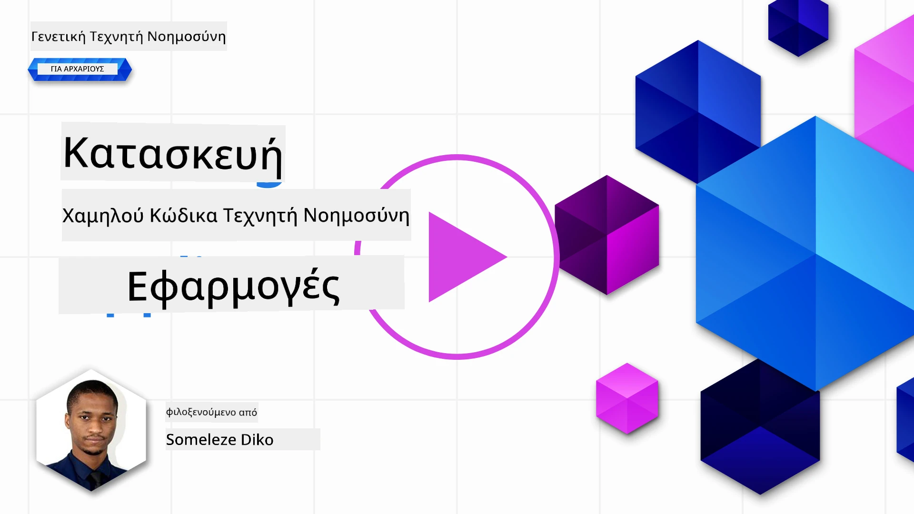](https://youtu.be/1vzq3Nd8GBA?si=h6LHWJXdmqf6mhDg)

> _(Κάντε κλικ στην εικόνα παραπάνω για να δείτε το βίντεο αυτού του μαθήματος)_

## Εισαγωγή

Τώρα που μάθαμε πώς να δημιουργούμε εφαρμογές παραγωγής εικόνας, ας μιλήσουμε για τον χαμηλό κώδικα. Η Γενετική Τεχνητή Νοημοσύνη μπορεί να χρησιμοποιηθεί σε διάφορους τομείς, συμπεριλαμβανομένου του χαμηλού κώδικα, αλλά τι είναι ο χαμηλός κώδικας και πώς μπορούμε να προσθέσουμε ΤΝ σε αυτόν;

Η δημιουργία εφαρμογών και λύσεων έχει γίνει πιο εύκολη για παραδοσιακούς προγραμματιστές και μη προγραμματιστές μέσω της χρήσης Πλατφορμών Ανάπτυξης Χαμηλού Κώδικα. Οι Πλατφόρμες Ανάπτυξης Χαμηλού Κώδικα σας επιτρέπουν να δημιουργείτε εφαρμογές και λύσεις με λίγο ή καθόλου κώδικα. Αυτό επιτυγχάνεται προσφέροντας ένα οπτικό περιβάλλον ανάπτυξης που σας επιτρέπει να σύρετε και να αποθέτετε τα στοιχεία για να δημιουργήσετε εφαρμογές και λύσεις. Αυτό σας επιτρέπει να δημιουργείτε εφαρμογές και λύσεις πιο γρήγορα και με λιγότερους πόρους. Σε αυτό το μάθημα, εξετάζουμε σε βάθος πώς να χρησιμοποιήσουμε τον χαμηλό κώδικα και πώς να ενισχύσουμε την ανάπτυξη χαμηλού κώδικα με Τεχνητή Νοημοσύνη χρησιμοποιώντας το Power Platform.

Το Power Platform προσφέρει σε οργανισμούς την ευκαιρία να ενδυναμώσουν τις ομάδες τους να δημιουργήσουν τις δικές τους λύσεις μέσω ενός διαισθητικού περιβάλλοντος χαμηλού ή καθόλου κώδικα. Αυτό το περιβάλλον απλοποιεί τη διαδικασία δημιουργίας λύσεων. Με το Power Platform, οι λύσεις μπορούν να δημιουργηθούν σε ημέρες ή εβδομάδες αντί για μήνες ή χρόνια. Το Power Platform αποτελείται από πέντε βασικά προϊόντα: Power Apps, Power Automate, Power BI, Power Pages και Copilot Studio.

Αυτό το μάθημα καλύπτει:

- Εισαγωγή στη Γενετική Τεχνητή Νοημοσύνη στο Power Platform
- Εισαγωγή στον Copilot και πώς να τον χρησιμοποιήσετε
- Χρήση Γενετικής Τεχνητής Νοημοσύνης για τη δημιουργία εφαρμογών και ροών στο Power Platform
- Κατανόηση των Μοντέλων ΤΝ στο Power Platform με το AI Builder
- Δημιουργία έξυπνων πρακτόρων με το Microsoft Copilot Studio

## Στόχοι Μάθησης

Μέχρι το τέλος αυτού του μαθήματος, θα μπορείτε να:

- Κατανοήσετε πώς λειτουργεί ο Copilot στο Power Platform.

- Δημιουργήσετε μια Εφαρμογή Παρακολούθησης Εργασιών Φοιτητών για τη νεοφυή επιχείρησή μας.

- Δημιουργήσετε μια Ροή Επεξεργασίας Τιμολογίων που χρησιμοποιεί ΤΝ για την εξαγωγή πληροφοριών από τα τιμολόγια.

- Εφαρμόσετε βέλτιστες πρακτικές κατά τη χρήση του μοντέλου ΤΝ Δημιουργίας Κειμένου με GPT.

- Κατανοήσετε τι είναι το Microsoft Copilot Studio και πώς να δημιουργήσετε έξυπνους πράκτορες με αυτό.

Τα εργαλεία και οι τεχνολογίες που θα χρησιμοποιήσετε σε αυτό το μάθημα είναι:

- **Power Apps**, για την εφαρμογή Παρακολούθησης Εργασιών Φοιτητών, που παρέχει περιβάλλον ανάπτυξης χαμηλού κώδικα για τη δημιουργία εφαρμογών για την παρακολούθηση, διαχείριση και αλληλεπίδραση με δεδομένα.

- **Dataverse**, για την αποθήκευση των δεδομένων της εφαρμογής Παρακολούθησης Εργασιών Φοιτητών, όπου το Dataverse θα παρέχει μια πλατφόρμα δεδομένων χαμηλού κώδικα για την αποθήκευση των δεδομένων της εφαρμογής.

- **Power Automate**, για τη ροή Επεξεργασίας Τιμολογίων, όπου θα έχετε περιβάλλον ανάπτυξης χαμηλού κώδικα για τη δημιουργία ροών εργασίας για την αυτοματοποίηση της διαδικασίας επεξεργασίας τιμολογίων.

- **AI Builder**, για το μοντέλο ΤΝ Επεξεργασίας Τιμολογίων, όπου θα χρησιμοποιήσετε προ-κατασκευασμένα μοντέλα ΤΝ για την επεξεργασία των τιμολογίων για τη νεοφυή επιχείρησή μας.

## Γενετική Τεχνητή Νοημοσύνη στο Power Platform

Η ενίσχυση της ανάπτυξης χαμηλού κώδικα και της εφαρμογής με γενετική Τεχνητή Νοημοσύνη είναι μια βασική περιοχή εστίασης για το Power Platform. Στόχος είναι να επιτραπεί σε όλους να δημιουργούν εφαρμογές με ΤΝ, ιστοσελίδες, πίνακες εργαλείων και να αυτοματοποιούν διαδικασίες με ΤΝ, _χωρίς να απαιτείται καμία γνώση επιστήμης δεδομένων_. Αυτός ο στόχος επιτυγχάνεται ενσωματώνοντας τη γενετική ΤΝ στην εμπειρία ανάπτυξης χαμηλού κώδικα στο Power Platform με τη μορφή του Copilot και του AI Builder.

### Πώς λειτουργεί αυτό;

Ο Copilot είναι ένας βοηθός ΤΝ που σας επιτρέπει να δημιουργείτε λύσεις Power Platform περιγράφοντας τις απαιτήσεις σας μέσα από μια σειρά διαλογικών βημάτων χρησιμοποιώντας φυσική γλώσσα. Για παράδειγμα, μπορείτε να δώσετε οδηγίες στον βοηθό ΤΝ να δηλώσει ποια πεδία θα χρησιμοποιήσει η εφαρμογή σας και αυτός θα δημιουργήσει τόσο την εφαρμογή όσο και το υποκείμενο μοντέλο δεδομένων ή μπορεί να ορίσετε πώς να ρυθμίσετε μια ροή στο Power Automate.

Μπορείτε να χρησιμοποιήσετε λειτουργίες που βασίζονται στον Copilot ως χαρακτηριστικό στις οθόνες της εφαρμογής σας για να επιτρέψετε στους χρήστες να ανακαλύπτουν πληροφορίες μέσω διαλογικής αλληλεπίδρασης.

Το AI Builder είναι μια δυνατότητα ΤΝ χαμηλού κώδικα διαθέσιμη στο Power Platform που σας επιτρέπει να χρησιμοποιείτε μοντέλα ΤΝ για να βοηθήσετε στην αυτοματοποίηση διαδικασιών και στην πρόβλεψη αποτελεσμάτων. Με το AI Builder μπορείτε να φέρετε την ΤΝ στις εφαρμογές και στις ροές σας που συνδέονται με τα δεδομένα σας στο Dataverse ή σε διάφορες πηγές δεδομένων στο cloud, όπως το SharePoint, OneDrive ή Azure.

Ο Copilot είναι διαθέσιμος σε όλα τα προϊόντα του Power Platform: Power Apps, Power Automate, Power BI, Power Pages και Copilot Studio (πρώην Power Virtual Agents). Το AI Builder είναι διαθέσιμο στο Power Apps και το Power Automate. Σε αυτό το μάθημα, θα εστιάσουμε στο πώς να χρησιμοποιήσετε τον Copilot και το AI Builder στο Power Apps και Power Automate για να δημιουργήσετε μια λύση για τη νεοφυή επιχείρηση εκπαίδευσής μας.

### Copilot στο Power Apps

Ως μέρος του Power Platform, το Power Apps παρέχει ένα περιβάλλον ανάπτυξης χαμηλού κώδικα για τη δημιουργία εφαρμογών που παρακολουθούν, διαχειρίζονται και αλληλεπιδρούν με δεδομένα. Πρόκειται για μια σουίτα υπηρεσιών ανάπτυξης εφαρμογών με επεκτάσιμη πλατφόρμα δεδομένων και δυνατότητα σύνδεσης με υπηρεσίες cloud και δεδομένα εντός επιχείρησης. Το Power Apps σας επιτρέπει να δημιουργείτε εφαρμογές που λειτουργούν σε προγράμματα περιήγησης, tablet και κινητά τηλέφωνα, και μπορούν να μοιραστούν με συναδέλφους. Το Power Apps διευκολύνει τους χρήστες στην ανάπτυξη εφαρμογών με μια απλή διεπαφή, ώστε κάθε επιχειρηματικός χρήστης ή επαγγελματίας προγραμματιστής να μπορεί να δημιουργεί προσαρμοσμένες εφαρμογές. Η εμπειρία ανάπτυξης εφαρμογών ενισχύεται επίσης με Γενετική ΤΝ μέσω του Copilot.

Η δυνατότητα βοηθού ΤΝ Copilot στο Power Apps σας επιτρέπει να περιγράψετε τι είδους εφαρμογή χρειάζεστε και ποια πληροφορία θέλετε να παρακολουθεί, συλλέγει ή εμφανίζει η εφαρμογή σας. Ο Copilot δημιουργεί τότε μια ανταποκρινόμενη Εφαρμογή Καμβά βασισμένη στην περιγραφή σας. Μπορείτε στη συνέχεια να προσαρμόσετε την εφαρμογή για να καλύψει τις ανάγκες σας. Ο βοηθός ΤΝ Copilot επίσης δημιουργεί και προτείνει έναν Πίνακα Dataverse με τα πεδία που χρειάζεστε για να αποθηκεύσετε τα δεδομένα που θέλετε να παρακολουθείτε και με ορισμένα δείγματα δεδομένων. Θα δούμε τι είναι το Dataverse και πώς μπορείτε να το χρησιμοποιήσετε στο Power Apps σε αυτό το μάθημα αργότερα. Μπορείτε στη συνέχεια να προσαρμόσετε τον πίνακα ώστε να ανταποκρίνεται στις ανάγκες σας χρησιμοποιώντας τη δυνατότητα βοηθού ΤΝ Copilot μέσω διαλογικών βημάτων. Αυτή η δυνατότητα είναι άμεσα διαθέσιμη από την αρχική οθόνη του Power Apps.

### Copilot στο Power Automate

Ως μέρος του Power Platform, το Power Automate επιτρέπει στους χρήστες να δημιουργούν αυτοματοποιημένες ροές εργασίας μεταξύ εφαρμογών και υπηρεσιών. Βοηθά στην αυτοματοποίηση επαναλαμβανόμενων επιχειρηματικών διαδικασιών, όπως επικοινωνία, συλλογή δεδομένων και έγκριση αποφάσεων. Η απλή διεπαφή του επιτρέπει σε χρήστες με κάθε τεχνική δεξιότητα (από αρχάριους έως έμπειρους προγραμματιστές) να αυτοματοποιήσουν εργασίες. Η εμπειρία ανάπτυξης ροών εργασίας ενισχύεται επίσης με Γενετική ΤΝ μέσω του Copilot.

Η δυνατότητα βοηθού ΤΝ Copilot στο Power Automate σας επιτρέπει να περιγράψετε τι είδους ροή χρειάζεστε και ποιες ενέργειες θέλετε να εκτελεί η ροή σας. Ο Copilot δημιουργεί τότε μια ροή βασισμένη στην περιγραφή σας. Μπορείτε στη συνέχεια να προσαρμόσετε τη ροή για να καλύψει τις ανάγκες σας. Ο βοηθός ΤΝ Copilot επίσης δημιουργεί και προτείνει τις ενέργειες που χρειάζεστε για να εκτελέσετε την εργασία που θέλετε να αυτοματοποιήσετε. Θα δούμε τι είναι οι ροές και πώς να τις χρησιμοποιήσετε στο Power Automate σε αυτό το μάθημα αργότερα. Μπορείτε στη συνέχεια να προσαρμόσετε τις ενέργειες ώστε να ανταποκρίνονται στις ανάγκες σας χρησιμοποιώντας τη δυνατότητα βοηθού ΤΝ Copilot μέσω διαλογικών βημάτων. Αυτή η δυνατότητα είναι άμεσα διαθέσιμη από την αρχική οθόνη του Power Automate.

## Δημιουργία Έξυπνων Πρακτόρων με το Microsoft Copilot Studio

[Microsoft Copilot Studio](https://learn.microsoft.com/microsoft-copilot-studio/fundamentals-what-is-copilot-studio?WT.mc_id=academic-105485-koreyst) (πρώην Power Virtual Agents) είναι το μέλος του Power Platform χαμηλού κώδικα για τη δημιουργία **πρακτόρων ΤΝ** — διαλογικών copilots που μπορούν να απαντούν σε ερωτήσεις, να λαμβάνουν ενέργειες και να αυτοματοποιούν εργασίες εκ μέρους των χρηστών σας. Όπως και τα υπόλοιπα του Power Platform, δημιουργείτε αυτούς τους πράκτορες σε ένα οπτικό, με προτεραιότητα στη φυσική γλώσσα περιβάλλον: περιγράφετε τι θέλετε να κάνει ο πράκτορας και το Copilot Studio βοηθά να διαρθρώσει τις οδηγίες, τη γνώση και τις ενέργειες του.

Για τη νεοφυή μας επιχείρηση εκπαίδευσης, θα μπορούσατε να δημιουργήσετε έναν πράκτορα που απαντά σε ερωτήσεις φοιτητών σχετικά με μαθήματα, ελέγχει προθεσμίες εργασιών και ακόμη και στέλνει email σε διδάσκοντες — όλα χωρίς να γράφετε κώδικα.

Ορίστε μερικές από τις πιο πρόσφατες δυνατότητες που κάνουν το Copilot Studio ισχυρό:

- **Γενετικές απαντήσεις από τη γνώση σας**. Αντί να δημιουργείτε κάθε συνομιλία χειροκίνητα, μπορείτε να συνδέσετε **πηγές γνώσης** — δημόσιες ιστοσελίδες, SharePoint, OneDrive, Dataverse, αρχεία που ανεβάζετε ή εταιρικά δεδομένα μέσω συνδέσμων — και ο πράκτορας παράγει τεκμηριωμένες απαντήσεις από αυτές.

- **Γενετική ορχήστρωση**. Αντί να βασίζεται σε αυστηρές φράσεις ενεργοποίησης, ο πράκτορας χρησιμοποιεί ΤΝ για να κατανοήσει ένα αίτημα και να αποφασίσει δυναμικά ποια γνώση, θέματα και ενέργειες να συνδυάσει για να το εκπληρώσει, συμπεριλαμβανομένων πολλαπλών βημάτων αλληλοδιαδοχικά.

- **Ενέργειες και συνδέσεις**. Οι πράκτορες μπορούν να *κάνουν* πράγματα, όχι μόνο να συνομιλούν. Μπορείτε να δώσετε σε έναν πράκτορα ενέργειες που υποστηρίζονται από περισσότερους από 1.500 προ-κατασκευασμένους συνδέσμους του Power Platform, ροές εργασίας Power Automate, προσαρμοσμένα REST APIs, προτροπές ή **Model Context Protocol (MCP)** servers.

- **Αυτόνομοι πράκτορες**. Οι πράκτορες δεν περιορίζονται στο να απαντούν σε παράθυρο συνομιλίας. Μπορείτε να δημιουργήσετε **αυτόνομους πράκτορες** που ενεργοποιούνται από γεγονότα — όπως ένα νέο email, μια νέα εγγραφή στο Dataverse, ή το ανέβασμα ενός αρχείου — και λειτουργούν στο παρασκήνιο για να ολοκληρώσουν μια εργασία.

- **Πολυπράκτορη ορχήστρωση**. Οι πράκτορες μπορούν να καλούν άλλους πράκτορες. Ένας πράκτορας Copilot Studio μπορεί να παραπέμπει ή να επεκτείνεται από άλλους πράκτορες, συμπεριλαμβανομένων πράκτορων δημοσιευμένων στο Microsoft 365 Copilot και πρακτόρων κατασκευασμένων στο Microsoft Foundry.

- **Επιλογή μοντέλου**. Εκτός από τα ενσωματωμένα μοντέλα, μπορείτε να φέρετε μοντέλα από τον κατάλογο μοντέλων του Microsoft Foundry για να προσαρμόσετε τον τρόπο με τον οποίο ο πράκτοράς σας συλλογίζεται και απαντά.

- **Δημοσίευση οπουδήποτε**. Μόλις δημιουργηθεί, ένας πράκτορας μπορεί να δημοσιευτεί σε πολλαπλά κανάλια — Microsoft Teams, Microsoft 365 Copilot, σε ιστοσελίδα ή προσαρμοσμένη εφαρμογή, και άλλα — με διαχείριση ασφάλειας, αυθεντικοποίησης και ανάλυσης μέσω της εμπειρίας διαχείρισης του Power Platform.

Μπορείτε να ξεκινήσετε να δημιουργείτε τον πρώτο σας πράκτορα στο [copilotstudio.microsoft.com](https://copilotstudio.microsoft.com?WT.mc_id=academic-105485-koreyst) και να μάθετε περισσότερα στην [τεκμηρίωση του Microsoft Copilot Studio](https://learn.microsoft.com/microsoft-copilot-studio/?WT.mc_id=academic-105485-koreyst).

## Ανάθεση: Διαχείριση εργασιών φοιτητών και τιμολογίων για τη νεοφυή επιχείρησή μας, χρησιμοποιώντας τον Copilot

Η νεοφυής μας επιχείρηση παρέχει διαδικτυακά μαθήματα σε φοιτητές. Η επιχείρηση αναπτύχθηκε γρήγορα και τώρα δυσκολεύεται να ανταποκριθεί στη ζήτηση για τα μαθήματά της. Η επιχείρηση σας προσέλαβε ως προγραμματιστή Power Platform για να τους βοηθήσετε να δημιουργήσουν μια λύση χαμηλού κώδικα για να διαχειρίζονται τις εργασίες φοιτητών και τα τιμολόγια τους. Η λύση τους θα πρέπει να μπορεί να παρακολουθεί και να διαχειρίζεται εργασίες φοιτητών μέσω μιας εφαρμογής και να αυτοματοποιεί τη διαδικασία επεξεργασίας τιμολογίων μέσω μιας ροής εργασίας. Σας ζητήθηκε να χρησιμοποιήσετε Γενετική Τεχνητή Νοημοσύνη για να αναπτύξετε τη λύση.

Όταν ξεκινάτε να χρησιμοποιείτε τον Copilot, μπορείτε να χρησιμοποιήσετε τη [Βιβλιοθήκη Προτροπών Power Platform Copilot](https://github.com/pnp/powerplatform-prompts?WT.mc_id=academic-109639-somelezediko) για να ξεκινήσετε με τις προτροπές. Αυτή η βιβλιοθήκη περιέχει μια λίστα προτροπών που μπορείτε να χρησιμοποιήσετε για να δημιουργήσετε εφαρμογές και ροές με τον Copilot. Μπορείτε επίσης να χρησιμοποιήσετε τις προτροπές της βιβλιοθήκης για να πάρετε μια ιδέα για το πώς να περιγράψετε τις απαιτήσεις σας στον Copilot.

### Δημιουργία Εφαρμογής Παρακολούθησης Εργασιών Φοιτητών για τη Νεοφυή Επιχείρησή μας

Οι εκπαιδευτικοί στη νεοφυή μας επιχείρηση δυσκολεύονταν να παρακολουθούν τις εργασίες των φοιτητών. Χρησιμοποιούσαν ένα υπολογιστικό φύλλο για την παρακολούθηση των εργασιών, αλλά αυτό έγινε δύσκολο να διαχειριστεί καθώς αυξήθηκε ο αριθμός των φοιτητών. Σας ζήτησαν να δημιουργήσετε μια εφαρμογή που θα τους βοηθά να παρακολουθούν και να διαχειρίζονται τις εργασίες των φοιτητών. Η εφαρμογή θα πρέπει να τους επιτρέπει να προσθέτουν νέες εργασίες, να βλέπουν εργασίες, να ενημερώνουν εργασίες και να διαγράφουν εργασίες. Η εφαρμογή θα πρέπει επίσης να επιτρέπει σε εκπαιδευτικούς και φοιτητές να βλέπουν τις εργασίες που έχουν βαθμολογηθεί και αυτές που δεν έχουν βαθμολογηθεί.

Θα δημιουργήσετε την εφαρμογή χρησιμοποιώντας τον Copilot στο Power Apps ακολουθώντας τα παρακάτω βήματα:

1. Μεταβείτε στην αρχική οθόνη του [Power Apps](https://make.powerapps.com?WT.mc_id=academic-105485-koreyst).

1. Χρησιμοποιήστε την περιοχή κειμένου στην αρχική οθόνη για να περιγράψετε την εφαρμογή που θέλετε να δημιουργήσετε. Για παράδειγμα, **_Θέλω να δημιουργήσω μια εφαρμογή για την παρακολούθηση και διαχείριση εργασιών φοιτητών_**. Κάντε κλικ στο κουμπί **Αποστολή** για να στείλετε την προτροπή στον βοηθό ΤΝ Copilot.

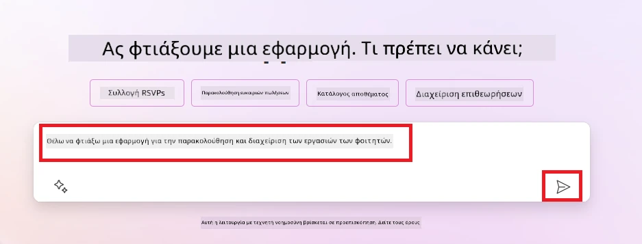

1. Ο βοηθός ΤΝ Copilot θα προτείνει έναν Πίνακα Dataverse με τα πεδία που χρειάζεστε για να αποθηκεύσετε τα δεδομένα που θέλετε να παρακολουθείτε και με ορισμένα δείγματα δεδομένων. Μπορείτε στη συνέχεια να προσαρμόσετε τον πίνακα ώστε να ανταποκρίνεται στις ανάγκες σας χρησιμοποιώντας τη δυνατότητα βοηθού ΤΝ Copilot μέσω διαλογικών βημάτων.

   > **Σημαντικό**: Το Dataverse είναι η υποκείμενη πλατφόρμα δεδομένων για το Power Platform. Είναι μια πλατφόρμα δεδομένων χαμηλού κώδικα για την αποθήκευση των δεδομένων της εφαρμογής. Είναι μια πλήρως διαχειριζόμενη υπηρεσία που αποθηκεύει με ασφάλεια τα δεδομένα στο Microsoft Cloud και παρέχεται μέσα στο περιβάλλον σας στο Power Platform. Διαθέτει ενσωματωμένες δυνατότητες διακυβέρνησης δεδομένων, όπως ταξινόμηση δεδομένων, προέλευση δεδομένων, λεπτομερής έλεγχος πρόσβασης και άλλα. Μπορείτε να μάθετε περισσότερα για το Dataverse [εδώ](https://docs.microsoft.com/powerapps/maker/data-platform/data-platform-intro?WT.mc_id=academic-109639-somelezediko).

   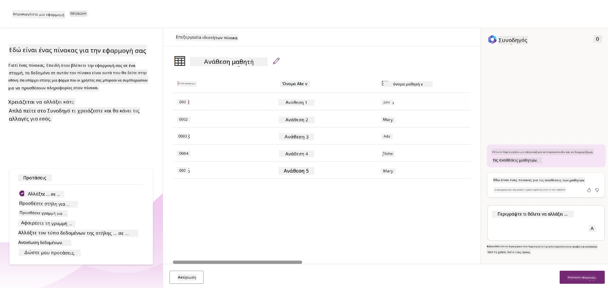

1. Οι εκπαιδευτικοί θέλουν να στέλνουν email στους φοιτητές που έχουν υποβάλει τις εργασίες τους για να τους ενημερώνουν για την πρόοδο των εργασιών τους. Μπορείτε να χρησιμοποιήσετε τον Copilot για να προσθέσετε ένα νέο πεδίο στον πίνακα για να αποθηκεύετε το email του φοιτητή. Για παράδειγμα, μπορείτε να χρησιμοποιήσετε την ακόλουθη προτροπή για να προσθέσετε ένα νέο πεδίο στον πίνακα: **_Θέλω να προσθέσω μια στήλη για την αποθήκευση του email φοιτητή_**. Κάντε κλικ στο κουμπί **Αποστολή** για να στείλετε την προτροπή στον βοηθό ΤΝ Copilot.

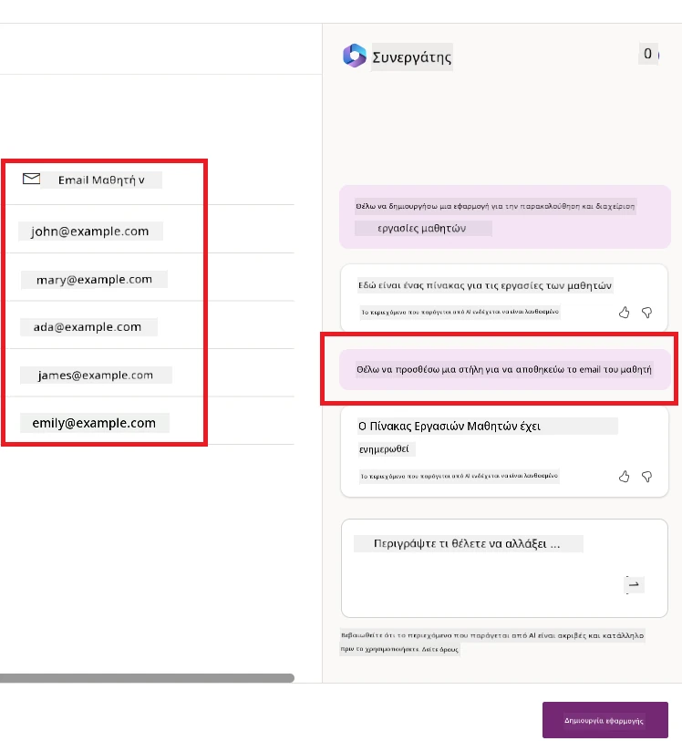

1. Ο βοηθός ΤΝ Copilot θα δημιουργήσει ένα νέο πεδίο και μπορείτε στη συνέχεια να προσαρμόσετε το πεδίο ώστε να ανταποκρίνεται στις ανάγκες σας.

1. Μόλις τελειώσετε με τον πίνακα, κάντε κλικ στο κουμπί **Create app** για να δημιουργήσετε την εφαρμογή.

1. Ο AI Copilot θα δημιουργήσει μια ανταποκρινόμενη εφαρμογή Canvas βασισμένη στην περιγραφή σας. Στη συνέχεια, μπορείτε να προσαρμόσετε την εφαρμογή για να καλύψετε τις ανάγκες σας.

1. Για εκπαιδευτικούς που θέλουν να στέλνουν email σε μαθητές, μπορείτε να χρησιμοποιήσετε το Copilot για να προσθέσετε μια νέα οθόνη στην εφαρμογή. Για παράδειγμα, μπορείτε να χρησιμοποιήσετε την ακόλουθη εντολή για να προσθέσετε μια νέα οθόνη στην εφαρμογή: **_I want to add a screen to send emails to students_**. Κάντε κλικ στο κουμπί **Send** για να στείλετε την εντολή στον AI Copilot.

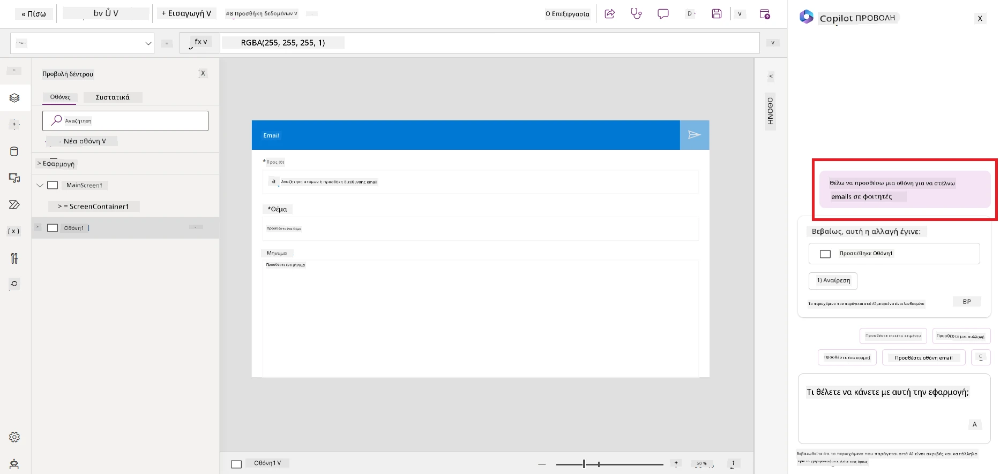

1. Ο AI Copilot θα δημιουργήσει μια νέα οθόνη και στη συνέχεια μπορείτε να προσαρμόσετε την οθόνη για να καλύψετε τις ανάγκες σας.

1. Μόλις τελειώσετε με την εφαρμογή, κάντε κλικ στο κουμπί **Save** για να αποθηκεύσετε την εφαρμογή.

1. Για να μοιραστείτε την εφαρμογή με τους εκπαιδευτικούς, κάντε κλικ στο κουμπί **Share** και στη συνέχεια πατήστε ξανά στο κουμπί **Share**. Μπορείτε στη συνέχεια να μοιραστείτε την εφαρμογή με τους εκπαιδευτικούς πληκτρολογώντας τις διευθύνσεις email τους.

> **Η εργασία σας**: Η εφαρμογή που μόλις δημιουργήσατε είναι μια καλή αρχή αλλά μπορεί να βελτιωθεί. Με τη λειτουργία email, οι εκπαιδευτικοί μπορούν να στέλνουν email στους μαθητές μόνο χειροκίνητα πληκτρολογώντας τις διευθύνσεις τους. Μπορείτε να χρησιμοποιήσετε το Copilot για να φτιάξετε ένα αυτοματισμό που θα επιτρέπει στους εκπαιδευτικούς να στέλνουν αυτόματα email στους μαθητές όταν υποβάλλουν τις εργασίες τους; Η υπόδειξή σας είναι ότι με τη σωστή εντολή μπορείτε να χρησιμοποιήσετε το Copilot στο Power Automate για να το φτιάξετε.

### Δημιουργία Πίνακα Πληροφοριών Τιμολογίων για τη Startup μας

Η ομάδα οικονομικών της startup μας δυσκολεύεται να παρακολουθεί τα τιμολόγια. Έχουν χρησιμοποιήσει ένα υπολογιστικό φύλλο για την παρακολούθηση των τιμολογίων, αλλά αυτό έχει γίνει δύσκολο να διαχειριστεί καθώς αυξάνεται ο αριθμός των τιμολογίων. Σας ζήτησαν να δημιουργήσετε έναν πίνακα που θα τους βοηθά να αποθηκεύουν, παρακολουθούν και διαχειρίζονται τις πληροφορίες των τιμολογίων που λαμβάνουν. Ο πίνακας θα πρέπει να χρησιμοποιηθεί για να δημιουργηθεί ένας αυτοματισμός που θα εξάγει όλες τις πληροφορίες των τιμολογίων και θα τις αποθηκεύει στον πίνακα. Ο πίνακας θα πρέπει επίσης να επιτρέπει στην ομάδα οικονομικών να βλέπει τα τιμολόγια που έχουν πληρωθεί και αυτά που δεν έχουν πληρωθεί.

Η πλατφόρμα Power Platform διαθέτει μια υποκείμενη δεδομενο-πλατφόρμα που ονομάζεται Dataverse και σας επιτρέπει να αποθηκεύετε τα δεδομένα για τις εφαρμογές και τις λύσεις σας. Το Dataverse παρέχει μια λύση χαμηλού κώδικα για την αποθήκευση των δεδομένων της εφαρμογής. Είναι μια πλήρως διαχειριζόμενη υπηρεσία που αποθηκεύει με ασφάλεια τα δεδομένα στο Microsoft Cloud και διατίθεται μέσα στο περιβάλλον σας στο Power Platform. Διαθέτει ενσωματωμένες δυνατότητες διακυβέρνησης δεδομένων, όπως ταξινόμηση δεδομένων, ιχνηλασιμότητα δεδομένων, λεπτομερή έλεγχο πρόσβασης και άλλα. Μπορείτε να μάθετε περισσότερα [για το Dataverse εδώ](https://docs.microsoft.com/powerapps/maker/data-platform/data-platform-intro?WT.mc_id=academic-109639-somelezediko).

Γιατί πρέπει να χρησιμοποιήσουμε το Dataverse για τη startup μας; Οι τυπικοί και προσαρμοσμένοι πίνακες μέσα στο Dataverse παρέχουν μια ασφαλή και βασισμένη στο cloud επιλογή αποθήκευσης για τα δεδομένα σας. Οι πίνακες σας επιτρέπουν να αποθηκεύετε διαφορετικούς τύπους δεδομένων, παρόμοια με το πώς θα χρησιμοποιούσατε πολλαπλά φύλλα εργασίας σε ένα φύλλο Excel. Μπορείτε να χρησιμοποιήσετε τους πίνακες για να αποθηκεύσετε δεδομένα που είναι συγκεκριμένα για την οργάνωση ή τις επιχειρηματικές σας ανάγκες. Μερικά από τα οφέλη που θα έχει η startup μας από τη χρήση του Dataverse περιλαμβάνουν, αλλά δεν περιορίζονται σε:

- **Εύκολη διαχείριση**: Τόσο τα μεταδεδομένα όσο και τα δεδομένα αποθηκεύονται στο cloud, οπότε δεν χρειάζεται να ανησυχείτε για τις λεπτομέρειες του πώς αποθηκεύονται ή διαχειρίζονται. Μπορείτε να εστιάσετε στη δημιουργία των εφαρμογών και των λύσεών σας.

- **Ασφαλές**: Το Dataverse παρέχει μια ασφαλή και βασισμένη στο cloud επιλογή αποθήκευσης για τα δεδομένα σας. Μπορείτε να ελέγξετε ποιος έχει πρόσβαση στα δεδομένα στους πίνακές σας και πώς μπορεί να έχει πρόσβαση σε αυτά χρησιμοποιώντας ασφάλεια βάσει ρόλων.

- **Πλούσια μεταδεδομένα**: Οι τύποι δεδομένων και οι σχέσεις χρησιμοποιούνται απευθείας μέσα στις Power Apps

- **Λογική και έλεγχος εγκυρότητας**: Μπορείτε να χρησιμοποιήσετε επιχειρηματικούς κανόνες, υπολογιζόμενα πεδία και κανόνες ελέγχου εγκυρότητας για να εφαρμόσετε επιχειρηματική λογική και να διατηρήσετε την ακρίβεια των δεδομένων.

Τώρα που ξέρετε τι είναι το Dataverse και γιατί πρέπει να το χρησιμοποιήσετε, ας δούμε πώς μπορείτε να χρησιμοποιήσετε το Copilot για να δημιουργήσετε έναν πίνακα στο Dataverse που να καλύπτει τις απαιτήσεις της ομάδας οικονομικών μας.

> **Σημείωση**: Θα χρησιμοποιήσετε αυτόν τον πίνακα στην επόμενη ενότητα για να φτιάξετε ένα αυτοματισμό που θα εξάγει όλες τις πληροφορίες των τιμολογίων και θα τις αποθηκεύει στον πίνακα.

Για να δημιουργήσετε έναν πίνακα στο Dataverse χρησιμοποιώντας το Copilot, ακολουθήστε τα παρακάτω βήματα:

1. Μεταβείτε στην αρχική οθόνη του [Power Apps](https://make.powerapps.com?WT.mc_id=academic-105485-koreyst).

2. Στην αριστερή μπάρα πλοήγησης, επιλέξτε **Tables** και μετά κάντε κλικ στο **Describe the new Table**.

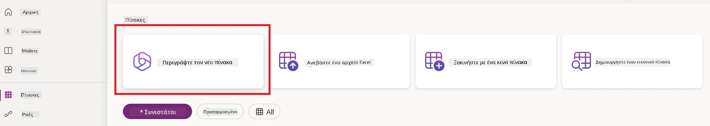

1. Στην οθόνη **Describe the new Table**, χρησιμοποιήστε το πεδίο κειμένου για να περιγράψετε τον πίνακα που θέλετε να δημιουργήσετε. Για παράδειγμα, **_I want to create a table to store invoice information_**. Κάντε κλικ στο κουμπί **Send** για να στείλετε την εντολή στον AI Copilot.

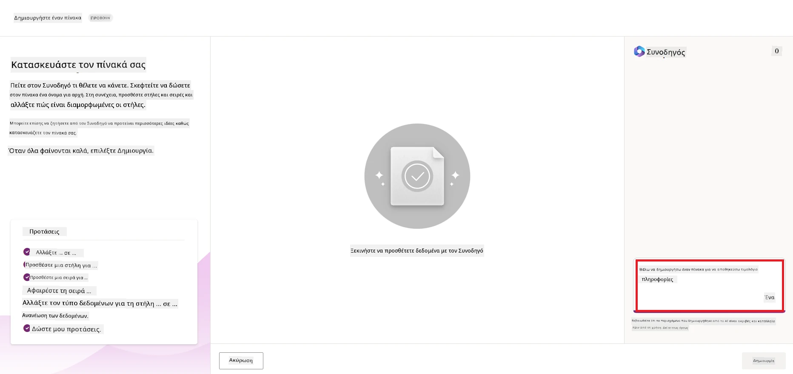

1. Ο AI Copilot θα προτείνει έναν πίνακα Dataverse με τα πεδία που χρειάζεστε για να αποθηκεύσετε τα δεδομένα που θέλετε να παρακολουθείτε και με κάποια δείγματα δεδομένων. Στη συνέχεια, μπορείτε να προσαρμόσετε τον πίνακα ώστε να καλύπτει τις ανάγκες σας χρησιμοποιώντας τη λειτουργία βοηθού AI Copilot μέσα από διαλογικά βήματα.

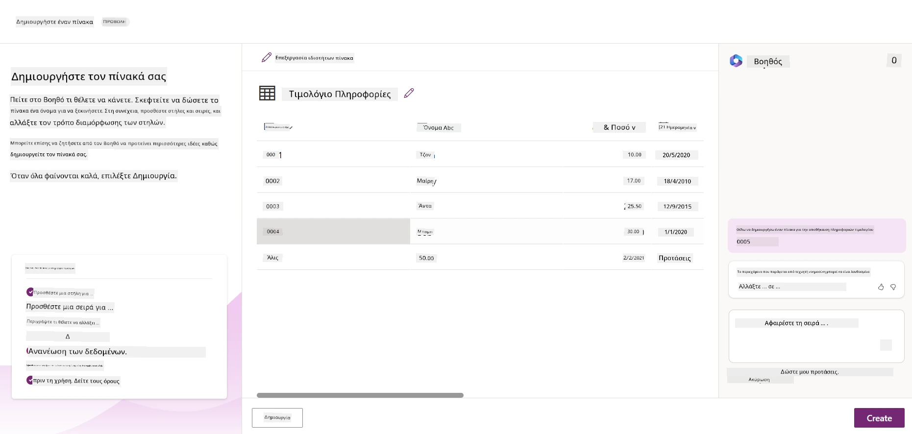

1. Η ομάδα οικονομικών θέλει να στείλει email στον προμηθευτή για να τον ενημερώσει για την τρέχουσα κατάσταση του τιμολογίου τους. Μπορείτε να χρησιμοποιήσετε το Copilot για να προσθέσετε ένα νέο πεδίο στον πίνακα για να αποθηκεύσετε το email του προμηθευτή. Για παράδειγμα, μπορείτε να χρησιμοποιήσετε την εξής εντολή για να προσθέσετε νέο πεδίο στον πίνακα: **_I want to add a column to store supplier email_**. Κάντε κλικ στο κουμπί **Send** για να στείλετε την εντολή στον AI Copilot.

1. Ο AI Copilot θα δημιουργήσει ένα νέο πεδίο και στη συνέχεια μπορείτε να προσαρμόσετε το πεδίο για να καλύπτει τις ανάγκες σας.

1. Μόλις τελειώσετε με τον πίνακα, κάντε κλικ στο κουμπί **Create** για να δημιουργήσετε τον πίνακα.

## Μοντέλα AI στην Power Platform με το AI Builder

Το AI Builder είναι μια δυνατότητα χαμηλού κώδικα στο Power Platform που σας επιτρέπει να χρησιμοποιήσετε Μοντέλα AI για να αυτοματοποιήσετε διεργασίες και να προβλέψετε αποτελέσματα. Με το AI Builder μπορείτε να ενσωματώσετε AI στις εφαρμογές και τα flows σας που συνδέονται με τα δεδομένα σας στο Dataverse ή σε διάφορες πηγές cloud, όπως SharePoint, OneDrive ή Azure.

## Προ-κατασκευασμένα Μοντέλα AI έναντι Προσαρμοσμένων Μοντέλων AI

Το AI Builder παρέχει δύο τύπους Μοντέλων AI: Προ-κατασκευασμένα Μοντέλα AI και Προσαρμοσμένα Μοντέλα AI. Τα Προ-κατασκευασμένα Μοντέλα AI είναι έτοιμα για χρήση μοντέλα που έχουν εκπαιδευτεί από τη Microsoft και είναι διαθέσιμα στο Power Platform. Αυτά σας βοηθούν να προσθέσετε νοημοσύνη στις εφαρμογές και τα flows σας χωρίς να χρειάζεται να συλλέξετε δεδομένα και να δημιουργήσετε, εκπαιδεύσετε και δημοσιεύσετε τα δικά σας μοντέλα. Μπορείτε να χρησιμοποιήσετε αυτά τα μοντέλα για να αυτοματοποιήσετε διεργασίες και να προβλέψετε αποτελέσματα.

Μερικά από τα Προ-κατασκευασμένα Μοντέλα AI που είναι διαθέσιμα στο Power Platform περιλαμβάνουν:

- **Εξαγωγή Κύριων Φράσεων**: Αυτό το μοντέλο εξάγει κύριες φράσεις από κείμενο.
- **Ανίχνευση Γλώσσας**: Αυτό το μοντέλο ανιχνεύει τη γλώσσα ενός κειμένου.
- **Ανάλυση Συναισθήματος**: Αυτό το μοντέλο ανιχνεύει θετικά, αρνητικά, ουδέτερα ή μικτά συναισθήματα σε κείμενο.
- **Ανάγνωση Επαγγελματικής Κάρτας**: Αυτό το μοντέλο εξάγει πληροφορίες από επαγγελματικές κάρτες.
- **Αναγνώριση Κειμένου**: Αυτό το μοντέλο εξάγει κείμενο από εικόνες.
- **Ανίχνευση Αντικειμένων**: Αυτό το μοντέλο ανιχνεύει και εξάγει αντικείμενα από εικόνες.
- **Επεξεργασία Εγγράφων**: Αυτό το μοντέλο εξάγει πληροφορίες από φόρμες.
- **Επεξεργασία Τιμολογίων**: Αυτό το μοντέλο εξάγει πληροφορίες από τιμολόγια.

Με τα Προσαρμοσμένα Μοντέλα AI μπορείτε να φέρετε το δικό σας μοντέλο στο AI Builder ώστε να λειτουργεί όπως κάθε προσαρμοσμένο μοντέλο AI Builder, επιτρέποντάς σας να εκπαιδεύσετε το μοντέλο χρησιμοποιώντας τα δικά σας δεδομένα. Μπορείτε να χρησιμοποιήσετε αυτά τα μοντέλα για να αυτοματοποιήσετε διαδικασίες και να προβλέψετε αποτελέσματα τόσο σε Power Apps όσο και σε Power Automate. Όταν χρησιμοποιείτε το δικό σας μοντέλο ισχύουν κάποιοι περιορισμοί. Διαβάστε περισσότερα για αυτούς τους [περιορισμούς](https://learn.microsoft.com/ai-builder/byo-model#limitations?WT.mc_id=academic-105485-koreyst).

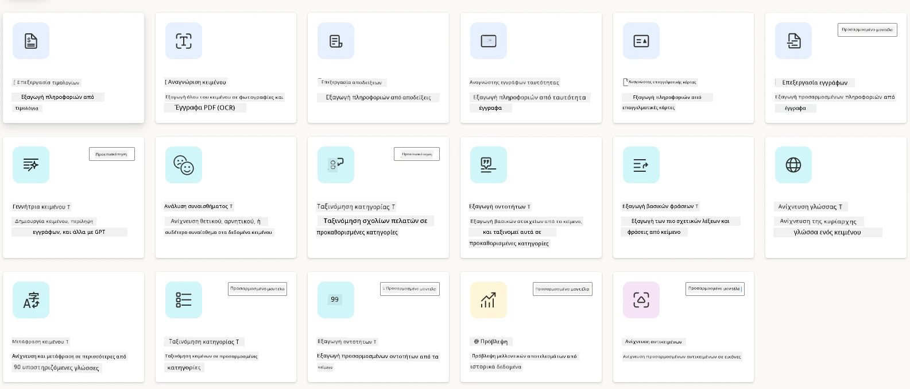

## Εργασία #2 - Δημιουργία Ροής Επεξεργασίας Τιμολογίων για τη Startup μας

Η ομάδα οικονομικών δυσκολεύεται να επεξεργαστεί τιμολόγια. Έχουν χρησιμοποιήσει ένα υπολογιστικό φύλλο για την παρακολούθηση των τιμολογίων, αλλά αυτό έχει γίνει δύσκολο να διαχειριστεί καθώς αυξάνεται ο αριθμός των τιμολογίων. Σας ζήτησαν να δημιουργήσετε μια ροή εργασίας που θα τους βοηθά να επεξεργάζονται τιμολόγια χρησιμοποιώντας AI. Η ροή εργασίας θα πρέπει να τους επιτρέπει να εξάγουν πληροφορίες από τα τιμολόγια και να αποθηκεύουν τις πληροφορίες σε έναν πίνακα Dataverse. Η ροή εργασίας θα πρέπει επίσης να τους επιτρέπει να στέλνουν email στην ομάδα οικονομικών με τις εξαγόμενες πληροφορίες.

Τώρα που ξέρετε τι είναι το AI Builder και γιατί πρέπει να το χρησιμοποιήσετε, ας δούμε πώς μπορείτε να χρησιμοποιήσετε το Μοντέλο AI Επεξεργασίας Τιμολογίων στο AI Builder, που καλύψαμε νωρίτερα, για να δημιουργήσετε μια ροή εργασίας που θα βοηθά την ομάδα οικονομικών να επεξεργάζεται τιμολόγια.

Για να δημιουργήσετε μια ροή εργασίας που θα βοηθά την ομάδα οικονομικών να επεξεργάζεται τιμολόγια χρησιμοποιώντας το Μοντέλο AI Επεξεργασίας Τιμολογίων στο AI Builder, ακολουθήστε τα παρακάτω βήματα:

1. Μεταβείτε στην αρχική οθόνη του [Power Automate](https://make.powerautomate.com?WT.mc_id=academic-105485-koreyst).

2. Χρησιμοποιήστε το πεδίο κειμένου στην αρχική οθόνη για να περιγράψετε τη ροή εργασίας που θέλετε να δημιουργήσετε. Για παράδειγμα, **_Process an invoice when it arrives in my mailbox_**. Κάντε κλικ στο κουμπί **Send** για να στείλετε την εντολή στον AI Copilot.

   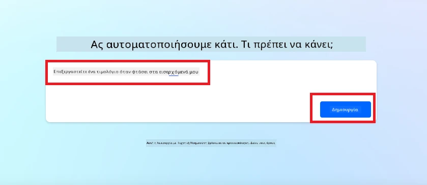

3. Ο AI Copilot θα προτείνει τις ενέργειες που χρειάζεστε για να εκτελέσετε τη δουλειά που θέλετε να αυτοματοποιήσετε. Μπορείτε να κάνετε κλικ στο κουμπί **Next** για να προχωρήσετε στα επόμενα βήματα.

4. Στο επόμενο βήμα, το Power Automate θα σας ζητήσει να ρυθμίσετε τις συνδέσεις που απαιτούνται για τη ροή. Μόλις τελειώσετε, κάντε κλικ στο κουμπί **Create flow** για να δημιουργήσετε τη ροή.

5. Ο AI Copilot θα δημιουργήσει μια ροή και στη συνέχεια μπορείτε να προσαρμόσετε τη ροή για να καλύπτει τις ανάγκες σας.

6. Ενημερώστε το εκκινητή της ροής και ορίστε τον **Φάκελο** στον φάκελο όπου θα αποθηκεύονται τα τιμολόγια. Για παράδειγμα, μπορείτε να ορίσετε τον φάκελο σε **Inbox**. Κάντε κλικ στο **Show advanced options** και ορίστε το **Only with Attachments** σε **Yes**. Αυτό θα διασφαλίσει ότι η ροή θα εκτελείται μόνο όταν λαμβάνεται ένα email με συνημμένο στον φάκελο.

7. Αφαιρέστε τις εξής ενέργειες από τη ροή: **HTML to text**, **Compose**, **Compose 2**, **Compose 3** και **Compose 4** επειδή δεν θα τις χρησιμοποιήσετε.

8. Αφαιρέστε την ενέργεια **Condition** από τη ροή γιατί δεν θα τη χρησιμοποιήσετε. Θα πρέπει να μοιάζει με το παρακάτω στιγμιότυπο:

   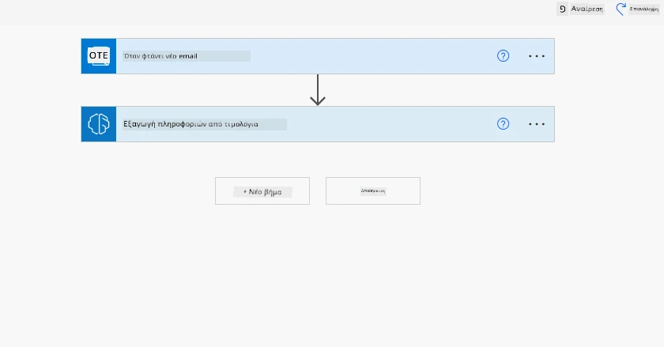

9. Κάντε κλικ στο κουμπί **Add an action** και αναζητήστε **Dataverse**. Επιλέξτε την ενέργεια **Add a new row**.

10. Στην ενέργεια **Extract Information from invoices**, ενημερώστε το **Invoice File** ώστε να δείχνει στο **Attachment Content** από το email. Αυτό θα διασφαλίσει ότι η ροή θα εξάγει πληροφορίες από το συνημμένο τιμολογίου.

11. Επιλέξτε τον **Πίνακα** που δημιουργήσατε νωρίτερα. Για παράδειγμα, μπορείτε να επιλέξετε τον πίνακα **Invoice Information**. Επιλέξτε το δυναμικό περιεχόμενο από την προηγούμενη ενέργεια για να συμπληρώσετε τα ακόλουθα πεδία:

    - ID
    - Amount
    - Date
    - Name
    - Status - Ορίστε το **Status** σε **Pending**.
    - Supplier Email - Χρησιμοποιήστε το δυναμικό περιεχόμενο **From** από τον εκκινητή **When a new email arrives**.

    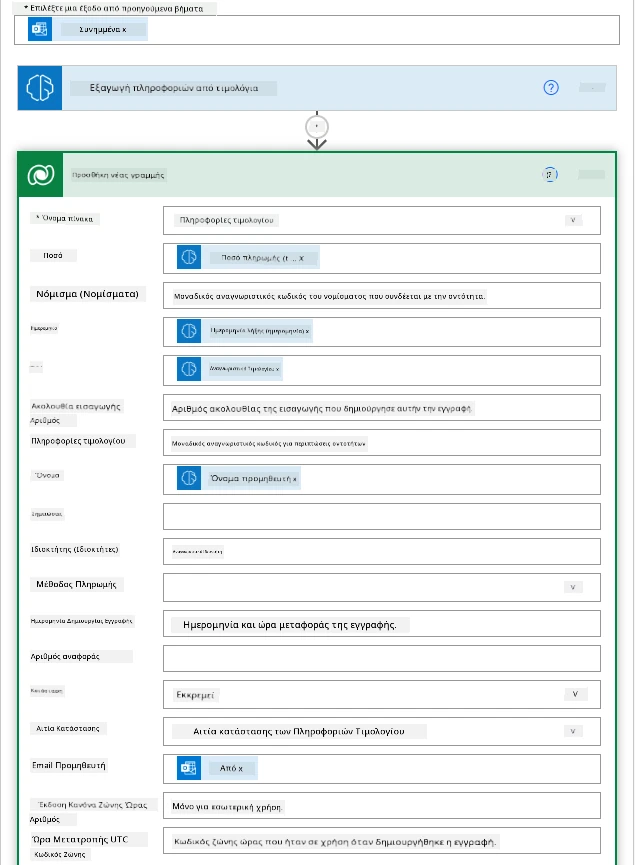

12. Μόλις τελειώσετε με τη ροή, κάντε κλικ στο κουμπί **Save** για να αποθηκεύσετε τη ροή. Μπορείτε στη συνέχεια να δοκιμάσετε τη ροή στέλνοντας ένα email με τιμολόγιο στον φάκελο που ορίσατε στον εκκινητή.

> **Η εργασία σας**: Η ροή που μόλις δημιουργήσατε είναι μια καλή αρχή, τώρα πρέπει να σκεφτείτε πώς θα δημιουργήσετε έναν αυτοματισμό που θα επιτρέπει στην ομάδα οικονομικών μας να στέλνει email στον προμηθευτή για να τον ενημερώνει για την τρέχουσα κατάσταση του τιμολογίου τους. Η υπόδειξή σας: η ροή πρέπει να εκτελείται όταν αλλάζει η κατάσταση του τιμολογίου.

## Χρήση Μοντέλου AI για Δημιουργία Κειμένου στο Power Automate

Το Μοντέλο AI Create Text with GPT στο AI Builder σας επιτρέπει να δημιουργείτε κείμενο βασισμένο σε μια εντολή και βασίζεται στην υπηρεσία Microsoft Azure OpenAI. Με αυτή τη δυνατότητα, μπορείτε να ενσωματώσετε την τεχνολογία GPT (Generative Pre-Trained Transformer) στις εφαρμογές και τις ροές σας για να δημιουργήσετε διάφορες αυτοματοποιημένες ροές και εφαρμογές με διορατικότητα.

Τα μοντέλα GPT υποβάλλονται σε εκτενή εκπαίδευση σε τεράστιες ποσότητες δεδομένων, επιτρέποντάς τους να παράγουν κείμενο που μοιάζει πολύ με ανθρώπινη γλώσσα όταν τους δοθεί μια εντολή. Όταν ενσωματώνονται σε αυτοματισμούς ροής εργασίας, τα μοντέλα AI όπως το GPT μπορούν να αξιοποιηθούν για να απλοποιήσουν και να αυτοματοποιήσουν μια μεγάλη ποικιλία εργασιών.

Για παράδειγμα, μπορείτε να δημιουργήσετε ροές που παράγουν αυτόματα κείμενο για διάφορες χρήσεις, όπως προσχέδια email, περιγραφές προϊόντων και άλλα. Μπορείτε επίσης να χρησιμοποιήσετε το μοντέλο για να δημιουργήσετε κείμενο για πολλές εφαρμογές, όπως chatbots και εφαρμογές εξυπηρέτησης πελατών που επιτρέπουν στους πράκτορες εξυπηρέτησης να απαντούν αποτελεσματικά και αποδοτικά σε ερωτήσεις πελατών.

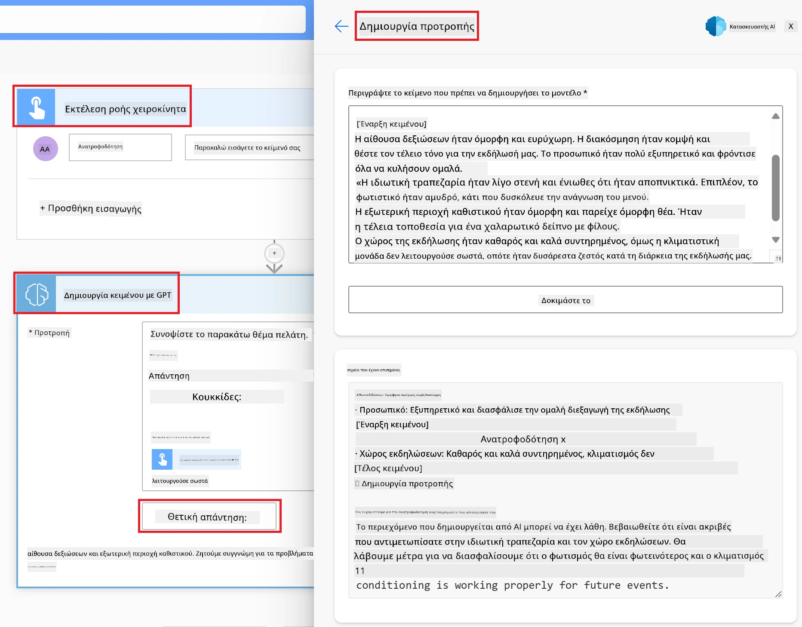

Για να μάθετε πώς να χρησιμοποιείτε αυτό το Μοντέλο AI στο Power Automate, περάστε από το μάθημα [Προσθήκη νοημοσύνης με AI Builder και GPT](https://learn.microsoft.com/training/modules/ai-builder-text-generation/?WT.mc_id=academic-109639-somelezediko).

## Υπέροχη δουλειά! Συνεχίστε τη μάθησή σας

Αφού ολοκληρώσετε αυτό το μάθημα, ρίξτε μια ματιά στη [Συλλογή Μάθησης Γενετικής Τεχνητής Νοημοσύνης](https://aka.ms/genai-collection?WT.mc_id=academic-105485-koreyst) για να συνεχίσετε να αναβαθμίζετε τις γνώσεις σας στη Γενετική Τεχνητή Νοημοσύνη!

Θέλετε να προσαρμόσετε και να αξιοποιήσετε περισσότερο το Copilot; Εξερευνήστε το [Awesome Copilot](https://github.com/github/awesome-copilot?WT.mc_id=academic-105485-koreyst) — μια συλλογή με συνεισφορές από την κοινότητα που περιλαμβάνει οδηγίες, πράκτορες, δεξιότητες και ρυθμίσεις για να σας βοηθήσει να αξιοποιήσετε στο έπακρο το GitHub Copilot.

Μεταβείτε στο Μάθημα 11 όπου θα δούμε πώς να [ενσωματώσουμε τη Γενετική Τεχνητή Νοημοσύνη με Κλήσεις Συνάρτησης](../11-integrating-with-function-calling/README.md?WT.mc_id=academic-105485-koreyst)!

---

<!-- CO-OP TRANSLATOR DISCLAIMER START -->
**Αποποίηση ευθυνών**:
Αυτό το έγγραφο έχει μεταφραστεί χρησιμοποιώντας την υπηρεσία μετάφρασης με τεχνητή νοημοσύνη [Co-op Translator](https://github.com/Azure/co-op-translator). Ενώ επιδιώκουμε την ακρίβεια, παρακαλούμε να έχετε υπόψη ότι οι αυτοματοποιημένες μεταφράσεις ενδέχεται να περιέχουν λάθη ή ανακρίβειες. Το πρωτότυπο έγγραφο στη μητρική του γλώσσα πρέπει να θεωρείται η αυθεντική πηγή. Για κρίσιμες πληροφορίες, συνιστάται επαγγελματική ανθρώπινη μετάφραση. Δεν φέρουμε ευθύνη για τυχόν παρεξηγήσεις ή λανθασμένες ερμηνείες που προκύπτουν από τη χρήση αυτής της μετάφρασης.
<!-- CO-OP TRANSLATOR DISCLAIMER END -->