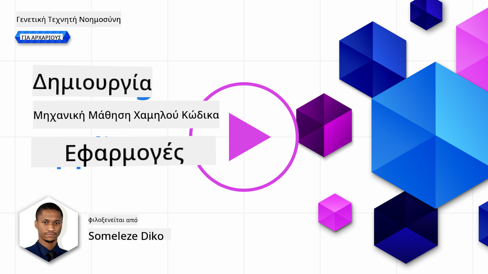
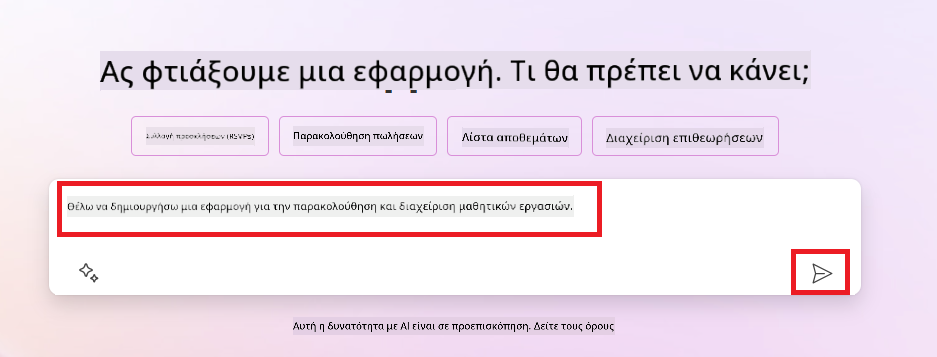
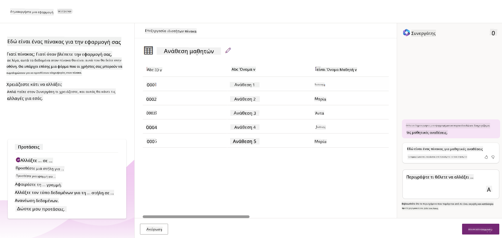
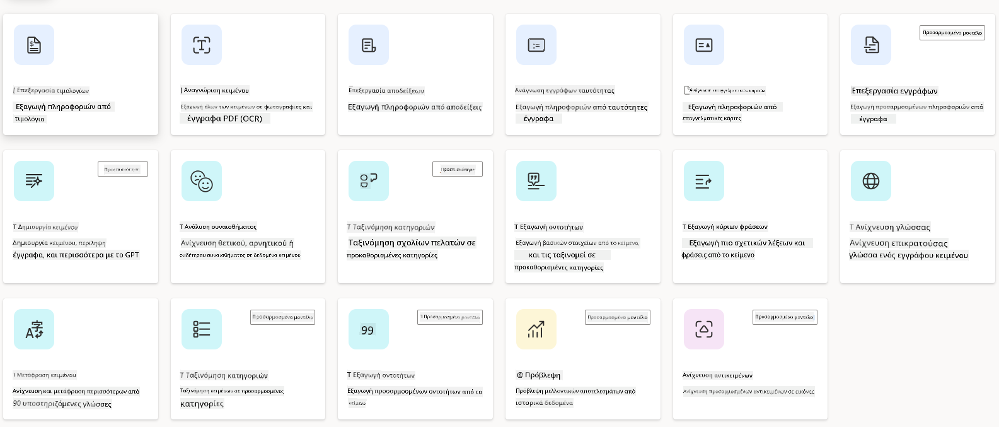
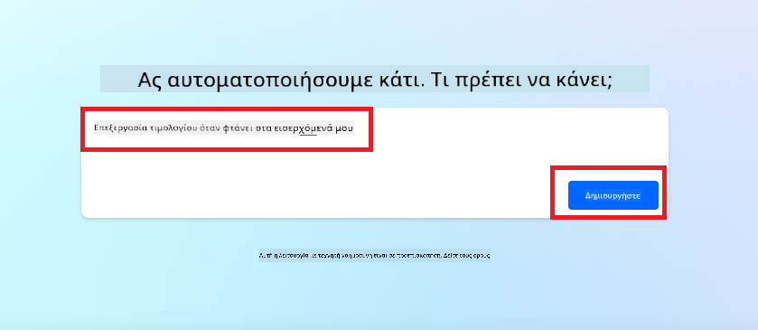
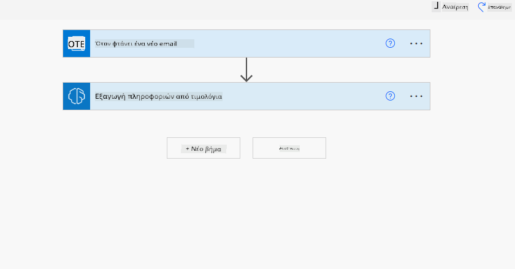
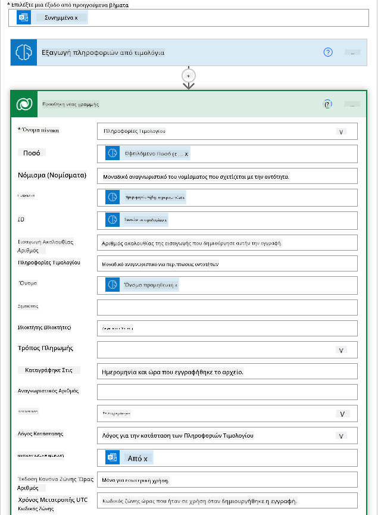
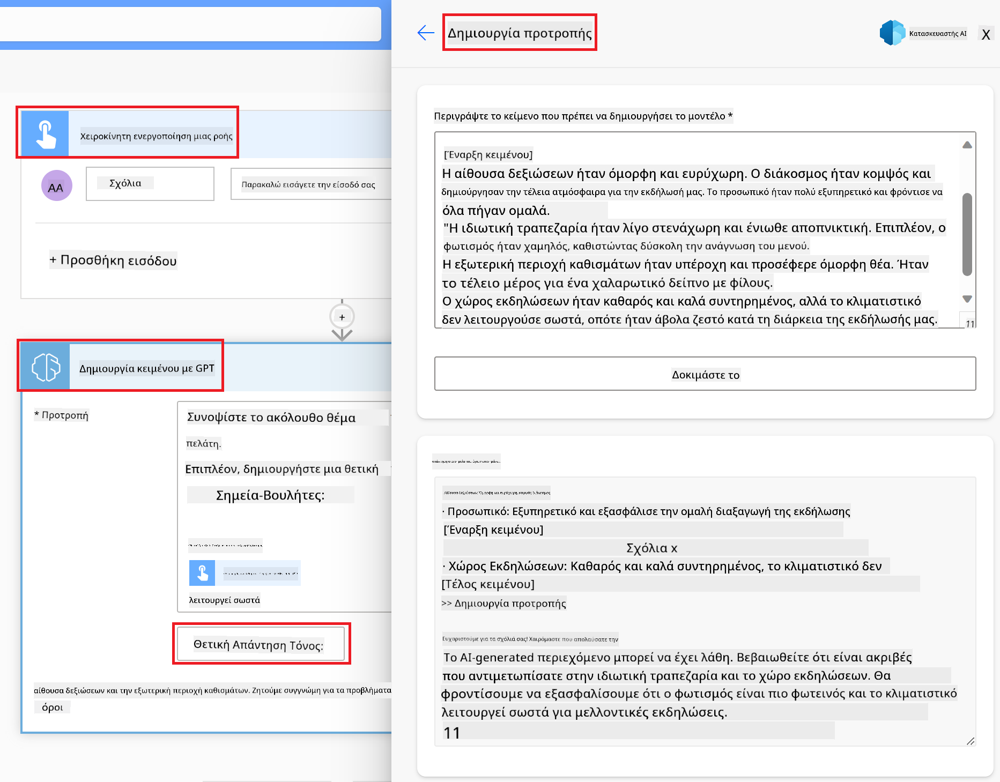

<!--
CO_OP_TRANSLATOR_METADATA:
{
  "original_hash": "f5ff3b6204a695a117d6f452403c95f7",
  "translation_date": "2025-06-25T18:43:39+00:00",
  "source_file": "10-building-low-code-ai-applications/README.md",
  "language_code": "el"
}
-->
# Δημιουργία Εφαρμογών AI με Χαμηλό Κώδικα

> _(Κάντε κλικ στην εικόνα παραπάνω για να δείτε το βίντεο αυτού του μαθήματος)_

## Εισαγωγή

Τώρα που μάθαμε πώς να δημιουργούμε εφαρμογές που παράγουν εικόνες, ας μιλήσουμε για το χαμηλό κώδικα. Η Γενετική AI μπορεί να χρησιμοποιηθεί σε διάφορους τομείς, συμπεριλαμβανομένου του χαμηλού κώδικα, αλλά τι είναι ο χαμηλός κώδικας και πώς μπορούμε να προσθέσουμε AI σε αυτόν;

Η δημιουργία εφαρμογών και λύσεων έχει γίνει πιο εύκολη για τους παραδοσιακούς προγραμματιστές και τους μη προγραμματιστές μέσω της χρήσης Πλατφορμών Ανάπτυξης Χαμηλού Κώδικα. Οι Πλατφόρμες Ανάπτυξης Χαμηλού Κώδικα σας επιτρέπουν να δημιουργείτε εφαρμογές και λύσεις με λίγο ή καθόλου κώδικα. Αυτό επιτυγχάνεται παρέχοντας ένα περιβάλλον οπτικής ανάπτυξης που σας επιτρέπει να σύρετε και να αποθέτετε στοιχεία για να δημιουργήσετε εφαρμογές και λύσεις. Αυτό σας επιτρέπει να δημιουργείτε εφαρμογές και λύσεις πιο γρήγορα και με λιγότερους πόρους. Σε αυτό το μάθημα, εμβαθύνουμε στο πώς να χρησιμοποιήσουμε το Χαμηλό Κώδικα και πώς να ενισχύσουμε την ανάπτυξη χαμηλού κώδικα με AI χρησιμοποιώντας το Power Platform.

Το Power Platform παρέχει στις οργανώσεις τη δυνατότητα να ενδυναμώσουν τις ομάδες τους να δημιουργούν τις δικές τους λύσεις μέσω ενός διαισθητικού περιβάλλοντος χαμηλού ή μη κώδικα. Αυτό το περιβάλλον βοηθά στην απλοποίηση της διαδικασίας δημιουργίας λύσεων. Με το Power Platform, οι λύσεις μπορούν να δημιουργηθούν σε ημέρες ή εβδομάδες αντί για μήνες ή χρόνια. Το Power Platform αποτελείται από πέντε βασικά προϊόντα: Power Apps, Power Automate, Power BI, Power Pages και Copilot Studio.

Αυτό το μάθημα καλύπτει:

- Εισαγωγή στη Γενετική AI στο Power Platform
- Εισαγωγή στο Copilot και πώς να το χρησιμοποιήσετε
- Χρήση της Γενετικής AI για δημιουργία εφαρμογών και ροών στο Power Platform
- Κατανόηση των Μοντέλων AI στο Power Platform με το AI Builder

## Στόχοι Μάθησης

Μέχρι το τέλος αυτού του μαθήματος, θα μπορείτε να:

- Κατανοήσετε πώς λειτουργεί το Copilot στο Power Platform.

- Δημιουργήσετε μια Εφαρμογή Παρακολούθησης Εργασιών Μαθητών για την εκπαιδευτική μας νεοφυή επιχείρηση.

- Δημιουργήσετε μια Ροή Επεξεργασίας Τιμολογίων που χρησιμοποιεί AI για να εξάγει πληροφορίες από τιμολόγια.

- Εφαρμόσετε βέλτιστες πρακτικές κατά τη χρήση του Μοντέλου AI Δημιουργίας Κειμένου με GPT.

Τα εργαλεία και οι τεχνολογίες που θα χρησιμοποιήσετε σε αυτό το μάθημα είναι:

- **Power Apps**, για την εφαρμογή Παρακολούθησης Εργασιών Μαθητών, που παρέχει ένα περιβάλλον ανάπτυξης χαμηλού κώδικα για τη δημιουργία εφαρμογών που παρακολουθούν, διαχειρίζονται και αλληλεπιδρούν με δεδομένα.

- **Dataverse**, για την αποθήκευση των δεδομένων για την εφαρμογή Παρακολούθησης Εργασιών Μαθητών όπου το Dataverse θα παρέχει μια πλατφόρμα δεδομένων χαμηλού κώδικα για την αποθήκευση των δεδομένων της εφαρμογής.

- **Power Automate**, για τη Ροή Επεξεργασίας Τιμολογίων όπου θα έχετε ένα περιβάλλον ανάπτυξης χαμηλού κώδικα για τη δημιουργία ροών εργασίας για την αυτοματοποίηση της διαδικασίας Επεξεργασίας Τιμολογίων.

- **AI Builder**, για το Μοντέλο AI Επεξεργασίας Τιμολογίων όπου θα χρησιμοποιήσετε προεγκατεστημένα Μοντέλα AI για να επεξεργαστείτε τα τιμολόγια για την νεοφυή μας επιχείρηση.

## Γενετική AI στο Power Platform

Η ενίσχυση της ανάπτυξης και της εφαρμογής χαμηλού κώδικα με γενετική AI είναι ένας βασικός τομέας εστίασης για το Power Platform. Ο στόχος είναι να επιτρέψει σε όλους να δημιουργούν εφαρμογές, ιστοτόπους, πίνακες ελέγχου και να αυτοματοποιούν διαδικασίες με AI, _χωρίς να απαιτείται καμία εξειδίκευση στη δεδομένων επιστήμη_. Αυτός ο στόχος επιτυγχάνεται με την ενσωμάτωση της γενετικής AI στην εμπειρία ανάπτυξης χαμηλού κώδικα στο Power Platform υπό τη μορφή του Copilot και του AI Builder.

### Πώς λειτουργεί αυτό;

Το Copilot είναι ένας βοηθός AI που σας επιτρέπει να δημιουργείτε λύσεις στο Power Platform περιγράφοντας τις απαιτήσεις σας σε μια σειρά συνομιλιών χρησιμοποιώντας φυσική γλώσσα. Μπορείτε, για παράδειγμα, να δώσετε εντολή στον βοηθό AI να αναφέρει ποια πεδία θα χρησιμοποιήσει η εφαρμογή σας και θα δημιουργήσει τόσο την εφαρμογή όσο και το υποκείμενο μοντέλο δεδομένων ή θα μπορούσατε να καθορίσετε πώς να ρυθμίσετε μια ροή στο Power Automate.

Μπορείτε να χρησιμοποιήσετε λειτουργίες που καθοδηγούνται από το Copilot ως χαρακτηριστικό στις οθόνες της εφαρμογής σας για να επιτρέψετε στους χρήστες να αποκαλύπτουν πληροφορίες μέσω συνομιλιών.

Το AI Builder είναι μια δυνατότητα AI χαμηλού κώδικα διαθέσιμη στο Power Platform που σας επιτρέπει να χρησιμοποιείτε Μοντέλα AI για να σας βοηθήσουν να αυτοματοποιήσετε διαδικασίες και να προβλέψετε αποτελέσματα. Με το AI Builder μπορείτε να φέρετε AI στις εφαρμογές και τις ροές σας που συνδέονται με τα δεδομένα σας στο Dataverse ή σε διάφορες πηγές δεδομένων στο cloud, όπως το SharePoint, το OneDrive ή το Azure.

Το Copilot είναι διαθέσιμο σε όλα τα προϊόντα του Power Platform: Power Apps, Power Automate, Power BI, Power Pages και Power Virtual Agents. Το AI Builder είναι διαθέσιμο στο Power Apps και το Power Automate. Σε αυτό το μάθημα, θα επικεντρωθούμε στο πώς να χρησιμοποιήσουμε το Copilot και το AI Builder στο Power Apps και το Power Automate για να δημιουργήσουμε μια λύση για την εκπαιδευτική μας νεοφυή επιχείρηση.

### Copilot στο Power Apps

Ως μέρος του Power Platform, το Power Apps παρέχει ένα περιβάλλον ανάπτυξης χαμηλού κώδικα για τη δημιουργία εφαρμογών που παρακολουθούν, διαχειρίζονται και αλληλεπιδρούν με δεδομένα. Είναι ένα σύνολο υπηρεσιών ανάπτυξης εφαρμογών με μια κλιμακούμενη πλατφόρμα δεδομένων και τη δυνατότητα σύνδεσης με υπηρεσίες cloud και δεδομένα on-premises. Το Power Apps σας επιτρέπει να δημιουργείτε εφαρμογές που εκτελούνται σε προγράμματα περιήγησης, tablet και τηλέφωνα και μπορούν να κοινοποιηθούν με συναδέλφους. Το Power Apps διευκολύνει τους χρήστες να εισέλθουν στην ανάπτυξη εφαρμογών με μια απλή διεπαφή, ώστε κάθε επιχειρηματικός χρήστης ή επαγγελματίας προγραμματιστής να μπορεί να δημιουργεί προσαρμοσμένες εφαρμογές. Η εμπειρία ανάπτυξης εφαρμογών ενισχύεται επίσης με Γενετική AI μέσω του Copilot.

Η δυνατότητα βοηθού AI copilot στο Power Apps σας επιτρέπει να περιγράψετε τι είδους εφαρμογή χρειάζεστε και ποιες πληροφορίες θέλετε να παρακολουθεί, να συλλέγει ή να δείχνει η εφαρμογή σας. Στη συνέχεια, το Copilot δημιουργεί μια ευέλικτη εφαρμογή Canvas βασισμένη στην περιγραφή σας. Μπορείτε στη συνέχεια να προσαρμόσετε την εφαρμογή για να καλύψετε τις ανάγκες σας. Ο AI Copilot δημιουργεί και προτείνει επίσης έναν Πίνακα Dataverse με τα πεδία που χρειάζεστε για να αποθηκεύσετε τα δεδομένα που θέλετε να παρακολουθήσετε και κάποια δείγματα δεδομένων. Θα δούμε τι είναι το Dataverse και πώς μπορείτε να το χρησιμοποιήσετε στο Power Apps σε αυτό το μάθημα αργότερα. Μπορείτε στη συνέχεια να προσαρμόσετε τον πίνακα για να καλύψετε τις ανάγκες σας χρησιμοποιώντας τη δυνατότητα βοηθού AI Copilot μέσω συνομιλιών. Αυτή η δυνατότητα είναι άμεσα διαθέσιμη από την αρχική οθόνη του Power Apps.

### Copilot στο Power Automate

Ως μέρος του Power Platform, το Power Automate επιτρέπει στους χρήστες να δημιουργούν αυτοματοποιημένες ροές εργασίας μεταξύ εφαρμογών και υπηρεσιών. Βοηθά στην αυτοματοποίηση επαναλαμβανόμενων επιχειρηματικών διαδικασιών, όπως η επικοινωνία, η συλλογή δεδομένων και οι εγκρίσεις αποφάσεων. Η απλή διεπαφή του επιτρέπει στους χρήστες με κάθε τεχνική ικανότητα (από αρχάριους έως έμπειρους προγραμματιστές) να αυτοματοποιούν εργασίες. Η εμπειρία ανάπτυξης ροών εργασίας ενισχύεται επίσης με Γενετική AI μέσω του Copilot.

Η δυνατότητα βοηθού AI copilot στο Power Automate σας επιτρέπει να περιγράψετε τι είδους ροή χρειάζεστε και ποιες ενέργειες θέλετε να εκτελέσει η ροή σας. Στη συνέχεια, το Copilot δημιουργεί μια ροή βασισμένη στην περιγραφή σας. Μπορείτε στη συνέχεια να προσαρμόσετε τη ροή για να καλύψετε τις ανάγκες σας. Ο AI Copilot δημιουργεί και προτείνει επίσης τις ενέργειες που χρειάζεστε για να εκτελέσετε το καθήκον που θέλετε να αυτοματοποιήσετε. Θα δούμε τι είναι οι ροές και πώς μπορείτε να τις χρησιμοποιήσετε στο Power Automate σε αυτό το μάθημα αργότερα. Μπορείτε στη συνέχεια να προσαρμόσετε τις ενέργειες για να καλύψετε τις ανάγκες σας χρησιμοποιώντας τη δυνατότητα βοηθού AI Copilot μέσω συνομιλιών. Αυτή η δυνατότητα είναι άμεσα διαθέσιμη από την αρχική οθόνη του Power Automate.

## Ανάθεση: Διαχείριση εργασιών μαθητών και τιμολογίων για τη νεοφυή μας επιχείρηση, χρησιμοποιώντας το Copilot

Η νεοφυής μας επιχείρηση παρέχει διαδικτυακά μαθήματα σε μαθητές. Η επιχείρηση έχει αναπτυχθεί γρήγορα και τώρα δυσκολεύεται να ανταποκριθεί στη ζήτηση για τα μαθήματά της. Η επιχείρηση σας έχει προσλάβει ως προγραμματιστή Power Platform για να τους βοηθήσετε να δημιουργήσουν μια λύση χαμηλού κώδικα για να τους βοηθήσει να διαχειρίζονται τις εργασίες μαθητών και τα τιμολόγια. Η λύση τους θα πρέπει να μπορεί να τους βοηθήσει να παρακολουθούν και να διαχειρίζονται τις εργασίες μαθητών μέσω μιας εφαρμογής και να αυτοματοποιούν τη διαδικασία επεξεργασίας τιμολογίων μέσω μιας ροής εργασίας. Σας ζητήθηκε να χρησιμοποιήσετε Γενετική AI για να αναπτύξετε τη λύση.

Όταν ξεκινάτε να χρησιμοποιείτε το Copilot, μπορείτε να χρησιμοποιήσετε τη [Βιβλιοθήκη Προτροπών Copilot του Power Platform](https://github.com/pnp/powerplatform-prompts?WT.mc_id=academic-109639-somelezediko) για να ξεκινήσετε με τις προτροπές. Αυτή η βιβλιοθήκη περιέχει μια λίστα προτροπών που μπορείτε να χρησιμοποιήσετε για να δημιουργήσετε εφαρμογές και ροές με το Copilot. Μπορείτε επίσης να χρησιμοποιήσετε τις προτροπές στη βιβλιοθήκη για να πάρετε μια ιδέα για το πώς να περιγράψετε τις απαιτήσεις σας στο Copilot.

### Δημιουργία Εφαρμογής Παρακολούθησης Εργασιών Μαθητών για τη Νεοφυή μας Επιχείρηση

Οι εκπαιδευτικοί στη νεοφυή μας επιχείρηση δυσκολεύονται να παρακολουθούν τις εργασίες των μαθητών. Έχουν χρησιμοποιήσει ένα φύλλο εργασίας για να παρακολουθούν τις εργασίες, αλλά αυτό έχει γίνει δύσκολο να διαχειριστεί καθώς αυξάνεται ο αριθμός των μαθητών. Σας ζήτησαν να δημιουργήσετε μια εφαρμογή που θα τους βοηθήσει να παρακολουθούν και να διαχειρίζονται τις εργασίες των μαθητών. Η εφαρμογή θα πρέπει να τους επιτρέπει να προσθέτουν νέες εργασίες, να βλέπουν εργασίες, να ενημερώνουν εργασίες και να διαγράφουν εργασίες. Η εφαρμογή θα πρέπει επίσης να επιτρέπει στους εκπαιδευτικούς και τους μαθητές να βλέπουν τις εργασίες που έχουν βαθμολογηθεί και αυτές που δεν έχουν βαθμολογηθεί.

Θα δημιουργήσετε την εφαρμογή χρησιμοποιώντας το Copilot στο Power Apps ακολουθώντας τα παρακάτω βήματα:

1. Μεταβείτε στην [αρχική οθόνη του Power Apps](https://make.powerapps.com?WT.mc_id=academic-105485-koreyst).

1. Χρησιμοποιήστε την περιοχή κειμένου στην αρχική οθόνη για να περιγράψετε την εφαρμογή που θέλετε να δημιουργήσετε. Για παράδειγμα, **_Θέλω να δημιουργήσω μια εφαρμογή για να παρακολουθώ και να διαχειρίζομαι τις εργασίες μαθητών_**. Κάντε κλικ στο κουμπί **Αποστολή** για να στείλετε την προτροπή στον AI Copilot.

1. Ο AI Copilot θα προτείνει έναν Πίνακα Dataverse με τα πεδία που χρειάζεστε για να αποθηκεύσετε τα δεδομένα που θέλετε να παρακολουθήσετε και κάποια δείγματα δεδομένων. Μπορείτε στη συνέχεια να προσαρμόσετε τον πίνακα για να καλύψετε τις ανάγκες σας χρησιμοποιώντας τη δυνατότητα βοηθού AI Copilot μέσω συνομιλιών.

   > **Σημαντικό**: Το Dataverse είναι η υποκείμενη πλατφόρμα δεδομένων για το Power Platform. Είναι μια πλατφόρμα δεδομένων χαμηλού κώδικα για την αποθήκευση των δεδομένων της εφαρμογής. Είναι μια πλήρως διαχειριζόμενη υπηρεσία που αποθηκεύει με ασφάλεια δεδομένα στο Microsoft Cloud και είναι διαθέσιμη στο περιβάλλον σας στο Power Platform. Έρχεται με ενσωματωμένες δυνατότητες διακυβέρνησης δεδομένων, όπως ταξινόμηση δεδομένων, γραμμή δεδομένων, λεπτομερής έλεγχος πρόσβασης και άλλα. Μπορείτε να μάθετε περισσότερα για το Dataverse [εδώ](https://docs.microsoft.com/powerapps/maker/data-platform/data-platform-intro?WT.mc_id=academic-109639-somelezediko).

   

1. Οι εκπαιδευτικοί θέλουν να στέλνουν emails στους μαθητές που έχουν υποβάλει τις εργασίες τους για να τους ενημερώνουν για την πρόοδο των εργασιών τους. Μπορείτε να χρησιμοποιήσετε το Copilot για να προσθέσετε ένα νέο πεδίο στον πίνακα για να αποθηκεύσετε το email του μαθητή. Για παράδειγμα, μπορείτε να χρησιμοποιήσετε την ακόλουθη προτροπή για να προσθέσετε ένα νέο πεδίο στον πίνακα: **_Θέλω να προσθέσω μια στήλη για να αποθηκεύσω το email του μαθητή_**. Κάντε κλικ στο κουμπί **Αποστολή** για να στείλετε την προτροπή στον AI Copilot.

1. Ο AI Copilot θα δημιουργήσει ένα νέο πεδίο και μπορείτε στη συνέχεια να προσαρμόσετε το πεδίο για να καλύψετε τις ανάγκες σας.

1. Μόλις τελειώσετε με τον πίνακα, κάντε κλικ στο κουμπί **Δημιουργία εφαρμογής** για να δημιουργήσετε την εφαρμογή.

1. Ο AI Copilot θα δημιουργήσει μια ευέλικτη εφαρμογή Canvas βασισμένη στην περιγραφή σας. Μπορείτε στη συνέχεια να προσαρμόσετε την εφαρμο
ένα κείμενο. - **Ανάλυση Συναισθημάτων**: Αυτό το μοντέλο ανιχνεύει θετικά, αρνητικά, ουδέτερα ή μικτά συναισθήματα σε κείμενο. - **Ανάγνωση Επαγγελματικών Καρτών**: Αυτό το μοντέλο εξάγει πληροφορίες από επαγγελματικές κάρτες. - **Αναγνώριση Κειμένου**: Αυτό το μοντέλο εξάγει κείμενο από εικόνες. - **Ανίχνευση Αντικειμένων**: Αυτό το μοντέλο ανιχνεύει και εξάγει αντικείμενα από εικόνες. - **Επεξεργασία Εγγράφων**: Αυτό το μοντέλο εξάγει πληροφορίες από φόρμες. - **Επεξεργασία Τιμολογίων**: Αυτό το μοντέλο εξάγει πληροφορίες από τιμολόγια. Με τα Προσαρμοσμένα Μοντέλα AI μπορείτε να φέρετε το δικό σας μοντέλο στο AI Builder ώστε να λειτουργεί όπως οποιοδήποτε προσαρμοσμένο μοντέλο AI Builder, επιτρέποντάς σας να εκπαιδεύσετε το μοντέλο χρησιμοποιώντας τα δικά σας δεδομένα. Μπορείτε να χρησιμοποιήσετε αυτά τα μοντέλα για να αυτοματοποιήσετε διαδικασίες και να προβλέψετε αποτελέσματα τόσο στο Power Apps όσο και στο Power Automate. Όταν χρησιμοποιείτε το δικό σας μοντέλο υπάρχουν περιορισμοί που ισχύουν. Διαβάστε περισσότερα για αυτούς τους [περιορισμούς](https://learn.microsoft.com/ai-builder/byo-model#limitations?WT.mc_id=academic-105485-koreyst). 

## Ανάθεση #2 - Δημιουργία Ροής Επεξεργασίας Τιμολογίων για την Startup μας

Η ομάδα χρηματοοικονομικών δυσκολεύεται να επεξεργαστεί τα τιμολόγια. Χρησιμοποιούσαν ένα υπολογιστικό φύλλο για να παρακολουθούν τα τιμολόγια, αλλά αυτό έχει γίνει δύσκολο να διαχειριστεί καθώς ο αριθμός των τιμολογίων έχει αυξηθεί. Σας έχουν ζητήσει να δημιουργήσετε μια ροή εργασίας που θα τους βοηθήσει να επεξεργαστούν τα τιμολόγια χρησιμοποιώντας AI. Η ροή εργασίας θα πρέπει να τους επιτρέπει να εξάγουν πληροφορίες από τιμολόγια και να αποθηκεύουν τις πληροφορίες σε έναν πίνακα Dataverse. Η ροή εργασίας θα πρέπει επίσης να τους επιτρέπει να στέλνουν ένα email στην ομάδα χρηματοοικονομικών με τις εξαγόμενες πληροφορίες. Τώρα που γνωρίζετε τι είναι το AI Builder και γιατί πρέπει να το χρησιμοποιήσετε, ας δούμε πώς μπορείτε να χρησιμοποιήσετε το Μοντέλο Επεξεργασίας Τιμολογίων στο AI Builder, το οποίο καλύψαμε νωρίτερα, για να δημιουργήσετε μια ροή εργασίας που θα βοηθήσει την ομάδα χρηματοοικονομικών να επεξεργαστεί τα τιμολόγια. Για να δημιουργήσετε μια ροή εργασίας που θα βοηθήσει την ομάδα χρηματοοικονομικών να επεξεργαστεί τα τιμολόγια χρησιμοποιώντας το Μοντέλο Επεξεργασίας Τιμολογίων στο AI Builder, ακολουθήστε τα παρακάτω βήματα:

1. Πλοηγηθείτε στην αρχική οθόνη του [Power Automate](https://make.powerautomate.com?WT.mc_id=academic-105485-koreyst).
2. Χρησιμοποιήστε την περιοχή κειμένου στην αρχική οθόνη για να περιγράψετε τη ροή εργασίας που θέλετε να δημιουργήσετε. Για παράδειγμα, **_Επεξεργασία ενός τιμολογίου όταν φτάσει στο γραμματοκιβώτιό μου_**. Κάντε κλικ στο κουμπί **Αποστολή** για να στείλετε την προτροπή στον AI Copilot. 
3. Ο AI Copilot θα προτείνει τις ενέργειες που πρέπει να εκτελέσετε για να αυτοματοποιήσετε το έργο που θέλετε. Μπορείτε να κάνετε κλικ στο κουμπί **Επόμενο** για να προχωρήσετε στα επόμενα βήματα.
4. Στο επόμενο βήμα, το Power Automate θα σας ζητήσει να ρυθμίσετε τις συνδέσεις που απαιτούνται για τη ροή. Μόλις τελειώσετε, κάντε κλικ στο κουμπί **Δημιουργία ροής** για να δημιουργήσετε τη ροή.
5. Ο AI Copilot θα δημιουργήσει μια ροή και μπορείτε στη συνέχεια να την προσαρμόσετε για να ανταποκριθεί στις ανάγκες σας.
6. Ενημερώστε την ενεργοποίηση της ροής και ρυθμίστε τον **Φάκελο** στον φάκελο όπου θα αποθηκεύονται τα τιμολόγια. Για παράδειγμα, μπορείτε να ρυθμίσετε τον φάκελο σε **Εισερχόμενα**. Κάντε κλικ στο **Εμφάνιση προηγμένων επιλογών** και ρυθμίστε το **Μόνο με Συνημμένα** σε **Ναι**. Αυτό θα διασφαλίσει ότι η ροή θα εκτελείται μόνο όταν λαμβάνεται ένα email με συνημμένο στον φάκελο.
7. Αφαιρέστε τις παρακάτω ενέργειες από τη ροή: **HTML σε κείμενο**, **Σύνθεση**, **Σύνθεση 2**, **Σύνθεση 3** και **Σύνθεση 4** γιατί δεν θα τις χρησιμοποιήσετε.
8. Αφαιρέστε την ενέργεια **Συνθήκη** από τη ροή γιατί δεν θα τη χρησιμοποιήσετε. Θα πρέπει να μοιάζει με το παρακάτω στιγμιότυπο οθόνης: 
9. Κάντε κλικ στο κουμπί **Προσθήκη ενέργειας** και αναζητήστε το **Dataverse**. Επιλέξτε την ενέργεια **Προσθήκη νέας γραμμής**.
10. Στην ενέργεια **Εξαγωγή Πληροφοριών από τιμολόγια**, ενημερώστε το **Αρχείο Τιμολογίου** ώστε να δείχνει στο **Περιεχόμενο Συνημμένου** από το email. Αυτό θα διασφαλίσει ότι η ροή θα εξάγει πληροφορίες από το συνημμένο του τιμολογίου.
11. Επιλέξτε τον **Πίνακα** που δημιουργήσατε νωρίτερα. Για παράδειγμα, μπορείτε να επιλέξετε τον πίνακα **Πληροφορίες Τιμολογίου**. Επιλέξτε το δυναμικό περιεχόμενο από την προηγούμενη ενέργεια για να συμπληρώσετε τα παρακάτω πεδία:
   - ID
   - Ποσό
   - Ημερομηνία
   - Όνομα
   - Κατάσταση
   - Ρυθμίστε την **Κατάσταση** σε **Εκκρεμεί**.
   - Email Προμηθευτή
   - Χρησιμοποιήστε το **Από** δυναμικό περιεχόμενο από την ενεργοποίηση **Όταν φτάνει νέο email**. 
12. Μόλις τελειώσετε με τη ροή, κάντε κλικ στο κουμπί **Αποθήκευση** για να αποθηκεύσετε τη ροή. Μπορείτε στη συνέχεια να δοκιμάσετε τη ροή στέλνοντας ένα email με ένα τιμολόγιο στον φάκελο που καθορίσατε στην ενεργοποίηση.

> **Η εργασία σας**: Η ροή που μόλις δημιουργήσατε είναι ένα καλό ξεκίνημα, τώρα πρέπει να σκεφτείτε πώς μπορείτε να δημιουργήσετε μια αυτοματοποίηση που θα επιτρέπει στην ομάδα χρηματοοικονομικών μας να στέλνει ένα email στον προμηθευτή για να τους ενημερώσει με την τρέχουσα κατάσταση του τιμολογίου τους. Η ένδειξή σας: η ροή πρέπει να εκτελείται όταν αλλάζει η κατάσταση του τιμολογίου.

## Χρήση ενός Μοντέλου AI Δημιουργίας Κειμένου στο Power Automate

Το Μοντέλο Δημιουργίας Κειμένου με GPT στο AI Builder σας επιτρέπει να δημιουργείτε κείμενο με βάση μια προτροπή και υποστηρίζεται από την Microsoft Azure OpenAI Service. Με αυτή τη δυνατότητα, μπορείτε να ενσωματώσετε την τεχνολογία GPT (Generative Pre-Trained Transformer) στις εφαρμογές και τις ροές σας για να δημιουργήσετε μια ποικιλία αυτοματοποιημένων ροών και εφαρμογών με πληροφορίες.

Τα μοντέλα GPT υποβάλλονται σε εκτεταμένη εκπαίδευση σε τεράστιες ποσότητες δεδομένων, επιτρέποντάς τους να παράγουν κείμενο που μοιάζει πολύ με την ανθρώπινη γλώσσα όταν τους παρέχεται μια προτροπή. Όταν ενσωματώνονται με την αυτοματοποίηση ροών εργασίας, τα μοντέλα AI όπως το GPT μπορούν να αξιοποιηθούν για να απλοποιήσουν και να αυτοματοποιήσουν ένα ευρύ φάσμα εργασιών.

Για παράδειγμα, μπορείτε να δημιουργήσετε ροές για να δημιουργείτε αυτόματα κείμενο για μια ποικιλία περιπτώσεων χρήσης, όπως: προσχέδια email, περιγραφές προϊόντων και άλλα. Μπορείτε επίσης να χρησιμοποιήσετε το μοντέλο για να δημιουργήσετε κείμενο για μια ποικιλία εφαρμογών, όπως chatbots και εφαρμογές εξυπηρέτησης πελατών που επιτρέπουν στους εκπροσώπους εξυπηρέτησης πελατών να ανταποκρίνονται αποτελεσματικά και αποδοτικά σε ερωτήσεις πελατών.

Για να μάθετε πώς να χρησιμοποιήσετε αυτό το Μοντέλο AI στο Power Automate, περάστε από το [Προσθέστε ευφυΐα με το AI Builder και το GPT](https://learn.microsoft.com/training/modules/ai-builder-text-generation/?WT.mc_id=academic-109639-somelezediko) μοντέλο.

## Καλή δουλειά! Συνεχίστε τη μάθησή σας

Αφού ολοκληρώσετε αυτό το μάθημα, δείτε τη [Συλλογή Μάθησης Γενετικής AI](https://aka.ms/genai-collection?WT.mc_id=academic-105485-koreyst) για να συνεχίσετε να αναβαθμίζετε τις γνώσεις σας στη Γενετική AI!

Πηγαίνετε στο Μάθημα 11 όπου θα δούμε πώς να [ενσωματώσετε τη Γενετική AI με την Κλήση Λειτουργιών](../11-integrating-with-function-calling/README.md?WT.mc_id=academic-105485-koreyst)!

**Αποποίηση ευθυνών**:  
Αυτό το έγγραφο έχει μεταφραστεί χρησιμοποιώντας την υπηρεσία μετάφρασης AI [Co-op Translator](https://github.com/Azure/co-op-translator). Παρόλο που επιδιώκουμε την ακρίβεια, παρακαλούμε να γνωρίζετε ότι οι αυτοματοποιημένες μεταφράσεις ενδέχεται να περιέχουν σφάλματα ή ανακρίβειες. Το πρωτότυπο έγγραφο στη μητρική του γλώσσα πρέπει να θεωρείται η αυθεντική πηγή. Για κρίσιμες πληροφορίες, συνιστάται επαγγελματική ανθρώπινη μετάφραση. Δεν φέρουμε ευθύνη για τυχόν παρανοήσεις ή παρερμηνείες που προκύπτουν από τη χρήση αυτής της μετάφρασης.