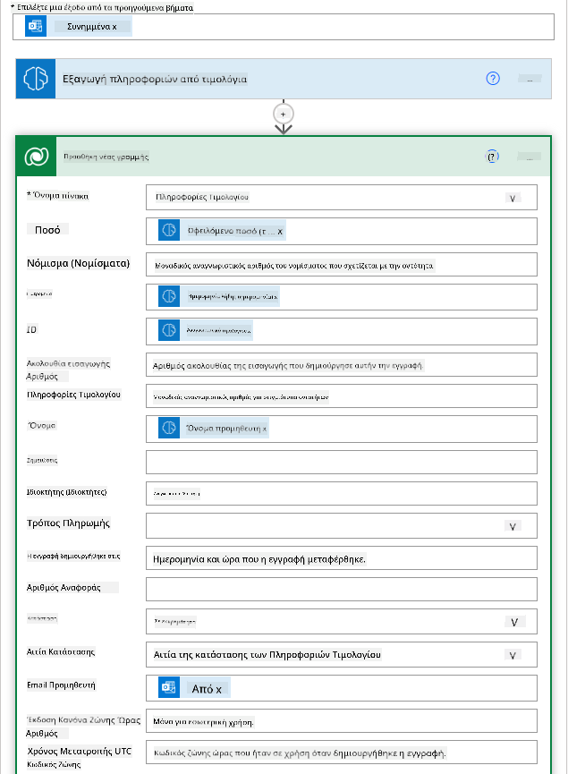
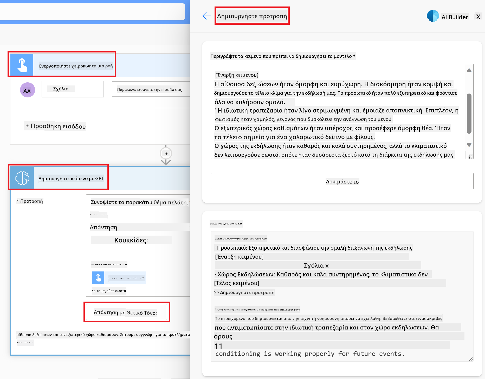

<!--
CO_OP_TRANSLATOR_METADATA:
{
  "original_hash": "f5ff3b6204a695a117d6f452403c95f7",
  "translation_date": "2025-07-09T13:59:27+00:00",
  "source_file": "10-building-low-code-ai-applications/README.md",
  "language_code": "el"
}
-->
# Δημιουργία Εφαρμογών Τεχνητής Νοημοσύνης με Χαμηλό Κώδικα

> _(Κάντε κλικ στην εικόνα παραπάνω για να δείτε το βίντεο αυτής της ενότητας)_

## Εισαγωγή

Τώρα που μάθαμε πώς να δημιουργούμε εφαρμογές που παράγουν εικόνες, ας μιλήσουμε για το low code. Η Γενετική Τεχνητή Νοημοσύνη μπορεί να χρησιμοποιηθεί σε διάφορους τομείς, συμπεριλαμβανομένου του low code, αλλά τι είναι το low code και πώς μπορούμε να προσθέσουμε AI σε αυτό;

Η δημιουργία εφαρμογών και λύσεων έχει γίνει πιο εύκολη για παραδοσιακούς προγραμματιστές αλλά και μη προγραμματιστές μέσω των Πλατφορμών Ανάπτυξης Χαμηλού Κώδικα. Οι Πλατφόρμες Χαμηλού Κώδικα επιτρέπουν τη δημιουργία εφαρμογών και λύσεων με ελάχιστο ή καθόλου κώδικα. Αυτό επιτυγχάνεται παρέχοντας ένα οπτικό περιβάλλον ανάπτυξης που σας επιτρέπει να σύρετε και να αφήνετε στοιχεία για να δημιουργήσετε εφαρμογές και λύσεις. Έτσι, μπορείτε να δημιουργείτε εφαρμογές και λύσεις πιο γρήγορα και με λιγότερους πόρους. Σε αυτή την ενότητα, εμβαθύνουμε στο πώς να χρησιμοποιήσουμε το Low Code και πώς να ενισχύσουμε την ανάπτυξη χαμηλού κώδικα με AI χρησιμοποιώντας το Power Platform.

Το Power Platform δίνει στις οργανώσεις την ευκαιρία να ενδυναμώσουν τις ομάδες τους να δημιουργήσουν τις δικές τους λύσεις μέσα από ένα διαισθητικό περιβάλλον χαμηλού ή καθόλου κώδικα. Αυτό το περιβάλλον απλοποιεί τη διαδικασία δημιουργίας λύσεων. Με το Power Platform, οι λύσεις μπορούν να δημιουργηθούν σε μέρες ή εβδομάδες αντί για μήνες ή χρόνια. Το Power Platform αποτελείται από πέντε βασικά προϊόντα: Power Apps, Power Automate, Power BI, Power Pages και Copilot Studio.

Αυτή η ενότητα καλύπτει:

- Εισαγωγή στη Γενετική Τεχνητή Νοημοσύνη στο Power Platform  
- Εισαγωγή στο Copilot και πώς να το χρησιμοποιήσετε  
- Χρήση της Γενετικής Τεχνητής Νοημοσύνης για τη δημιουργία εφαρμογών και ροών εργασίας στο Power Platform  
- Κατανόηση των Μοντέλων AI στο Power Platform με το AI Builder  

## Στόχοι Μάθησης

Στο τέλος αυτής της ενότητας, θα μπορείτε να:

- Κατανοήσετε πώς λειτουργεί το Copilot στο Power Platform.

- Δημιουργήσετε μια εφαρμογή Παρακολούθησης Εργασιών Φοιτητών για το εκπαιδευτικό μας startup.

- Δημιουργήσετε μια ροή επεξεργασίας τιμολογίων που χρησιμοποιεί AI για την εξαγωγή πληροφοριών από τιμολόγια.

- Εφαρμόσετε βέλτιστες πρακτικές κατά τη χρήση του μοντέλου Create Text με GPT AI.

Τα εργαλεία και οι τεχνολογίες που θα χρησιμοποιήσετε σε αυτή την ενότητα είναι:

- **Power Apps**, για την εφαρμογή Παρακολούθησης Εργασιών Φοιτητών, που παρέχει ένα περιβάλλον ανάπτυξης χαμηλού κώδικα για τη δημιουργία εφαρμογών που παρακολουθούν, διαχειρίζονται και αλληλεπιδρούν με δεδομένα.

- **Dataverse**, για την αποθήκευση των δεδομένων της εφαρμογής Παρακολούθησης Εργασιών Φοιτητών, όπου το Dataverse παρέχει μια πλατφόρμα δεδομένων χαμηλού κώδικα για την αποθήκευση των δεδομένων της εφαρμογής.

- **Power Automate**, για τη ροή επεξεργασίας τιμολογίων, όπου θα έχετε περιβάλλον ανάπτυξης χαμηλού κώδικα για τη δημιουργία ροών εργασίας που αυτοματοποιούν τη διαδικασία επεξεργασίας τιμολογίων.

- **AI Builder**, για το μοντέλο AI επεξεργασίας τιμολογίων, όπου θα χρησιμοποιήσετε προ-κατασκευασμένα μοντέλα AI για την επεξεργασία των τιμολογίων του startup μας.

## Γενετική Τεχνητή Νοημοσύνη στο Power Platform

Η ενίσχυση της ανάπτυξης και εφαρμογής χαμηλού κώδικα με γενετική AI αποτελεί βασικό τομέα εστίασης για το Power Platform. Ο στόχος είναι να δώσουμε τη δυνατότητα σε όλους να δημιουργούν εφαρμογές, ιστότοπους, πίνακες εργαλείων και να αυτοματοποιούν διαδικασίες με AI, _χωρίς να απαιτείται εξειδίκευση στην επιστήμη δεδομένων_. Αυτό επιτυγχάνεται με την ενσωμάτωση της γενετικής AI στην εμπειρία ανάπτυξης χαμηλού κώδικα στο Power Platform, μέσω του Copilot και του AI Builder.

### Πώς λειτουργεί αυτό;

Το Copilot είναι ένας βοηθός AI που σας επιτρέπει να δημιουργείτε λύσεις στο Power Platform περιγράφοντας τις απαιτήσεις σας μέσα από μια σειρά συνομιλητικών βημάτων χρησιμοποιώντας φυσική γλώσσα. Για παράδειγμα, μπορείτε να ζητήσετε από τον βοηθό AI να ορίσει ποια πεδία θα χρησιμοποιεί η εφαρμογή σας και αυτός θα δημιουργήσει τόσο την εφαρμογή όσο και το υποκείμενο μοντέλο δεδομένων ή να ορίσετε πώς να ρυθμίσετε μια ροή στο Power Automate.

Μπορείτε να χρησιμοποιήσετε λειτουργίες που βασίζονται στο Copilot ως χαρακτηριστικό στις οθόνες της εφαρμογής σας, ώστε οι χρήστες να ανακαλύπτουν πληροφορίες μέσω συνομιλητικών αλληλεπιδράσεων.

Το AI Builder είναι μια δυνατότητα AI χαμηλού κώδικα διαθέσιμη στο Power Platform που σας επιτρέπει να χρησιμοποιείτε μοντέλα AI για να αυτοματοποιείτε διαδικασίες και να προβλέπετε αποτελέσματα. Με το AI Builder μπορείτε να φέρετε την AI στις εφαρμογές και τις ροές σας που συνδέονται με τα δεδομένα σας στο Dataverse ή σε διάφορες πηγές δεδομένων στο cloud, όπως SharePoint, OneDrive ή Azure.

Το Copilot είναι διαθέσιμο σε όλα τα προϊόντα του Power Platform: Power Apps, Power Automate, Power BI, Power Pages και Power Virtual Agents. Το AI Builder είναι διαθέσιμο στο Power Apps και το Power Automate. Σε αυτή την ενότητα, θα εστιάσουμε στο πώς να χρησιμοποιήσουμε το Copilot και το AI Builder στο Power Apps και το Power Automate για να δημιουργήσουμε μια λύση για το εκπαιδευτικό μας startup.

### Copilot στο Power Apps

Ως μέρος του Power Platform, το Power Apps παρέχει ένα περιβάλλον ανάπτυξης χαμηλού κώδικα για τη δημιουργία εφαρμογών που παρακολουθούν, διαχειρίζονται και αλληλεπιδρούν με δεδομένα. Είναι μια σουίτα υπηρεσιών ανάπτυξης εφαρμογών με μια κλιμακούμενη πλατφόρμα δεδομένων και τη δυνατότητα σύνδεσης με υπηρεσίες cloud και τοπικά δεδομένα. Το Power Apps σας επιτρέπει να δημιουργείτε εφαρμογές που τρέχουν σε προγράμματα περιήγησης, tablets και τηλέφωνα, και μπορούν να κοινοποιηθούν σε συναδέλφους. Το Power Apps διευκολύνει τους χρήστες στην ανάπτυξη εφαρμογών με μια απλή διεπαφή, ώστε κάθε επαγγελματίας χρήστης ή προγραμματιστής να μπορεί να δημιουργήσει προσαρμοσμένες εφαρμογές. Η εμπειρία ανάπτυξης εφαρμογών ενισχύεται επίσης με τη Γενετική AI μέσω του Copilot.

Η λειτουργία βοηθού AI Copilot στο Power Apps σας επιτρέπει να περιγράψετε τι είδους εφαρμογή χρειάζεστε και ποια πληροφορία θέλετε να παρακολουθεί, συλλέγει ή εμφανίζει η εφαρμογή σας. Το Copilot στη συνέχεια δημιουργεί μια ανταποκρινόμενη εφαρμογή Canvas βασισμένη στην περιγραφή σας. Μπορείτε μετά να προσαρμόσετε την εφαρμογή ώστε να καλύπτει τις ανάγκες σας. Ο βοηθός AI Copilot δημιουργεί και προτείνει επίσης έναν Πίνακα Dataverse με τα πεδία που χρειάζεστε για να αποθηκεύσετε τα δεδομένα που θέλετε να παρακολουθείτε, μαζί με κάποια δείγματα δεδομένων. Θα δούμε τι είναι το Dataverse και πώς μπορείτε να το χρησιμοποιήσετε στο Power Apps αργότερα σε αυτή την ενότητα. Μπορείτε να προσαρμόσετε τον πίνακα ώστε να καλύπτει τις ανάγκες σας χρησιμοποιώντας τη λειτουργία βοηθού AI Copilot μέσα από συνομιλητικά βήματα. Αυτή η λειτουργία είναι άμεσα διαθέσιμη από την αρχική οθόνη του Power Apps.

### Copilot στο Power Automate

Ως μέρος του Power Platform, το Power Automate επιτρέπει στους χρήστες να δημιουργούν αυτοματοποιημένες ροές εργασίας μεταξύ εφαρμογών και υπηρεσιών. Βοηθά στην αυτοματοποίηση επαναλαμβανόμενων επιχειρηματικών διαδικασιών όπως επικοινωνία, συλλογή δεδομένων και έγκριση αποφάσεων. Η απλή διεπαφή του επιτρέπει σε χρήστες με κάθε επίπεδο τεχνικής γνώσης (από αρχάριους έως έμπειρους προγραμματιστές) να αυτοματοποιούν εργασίες. Η εμπειρία ανάπτυξης ροών εργασίας ενισχύεται επίσης με τη Γενετική AI μέσω του Copilot.

Η λειτουργία βοηθού AI Copilot στο Power Automate σας επιτρέπει να περιγράψετε τι είδους ροή χρειάζεστε και ποιες ενέργειες θέλετε να εκτελεί η ροή σας. Το Copilot στη συνέχεια δημιουργεί μια ροή βασισμένη στην περιγραφή σας. Μπορείτε μετά να προσαρμόσετε τη ροή ώστε να καλύπτει τις ανάγκες σας. Ο βοηθός AI Copilot δημιουργεί και προτείνει επίσης τις ενέργειες που χρειάζεστε για να εκτελέσετε την εργασία που θέλετε να αυτοματοποιήσετε. Θα δούμε τι είναι οι ροές και πώς μπορείτε να τις χρησιμοποιήσετε στο Power Automate αργότερα σε αυτή την ενότητα. Μπορείτε να προσαρμόσετε τις ενέργειες ώστε να καλύπτουν τις ανάγκες σας χρησιμοποιώντας τη λειτουργία βοηθού AI Copilot μέσα από συνομιλητικά βήματα. Αυτή η λειτουργία είναι άμεσα διαθέσιμη από την αρχική οθόνη του Power Automate.

## Άσκηση: Διαχείριση εργασιών φοιτητών και τιμολογίων για το startup μας, χρησιμοποιώντας το Copilot

Το startup μας παρέχει διαδικτυακά μαθήματα σε φοιτητές. Το startup έχει αναπτυχθεί γρήγορα και πλέον δυσκολεύεται να ανταποκριθεί στη ζήτηση για τα μαθήματά του. Το startup σας έχει προσλάβει ως προγραμματιστή Power Platform για να τους βοηθήσετε να δημιουργήσουν μια λύση χαμηλού κώδικα που θα τους βοηθήσει να διαχειρίζονται τις εργασίες των φοιτητών και τα τιμολόγια. Η λύση τους θα πρέπει να μπορεί να παρακολουθεί και να διαχειρίζεται τις εργασίες των φοιτητών μέσω μιας εφαρμογής και να αυτοματοποιεί τη διαδικασία επεξεργασίας τιμολογίων μέσω μιας ροής εργασίας. Σας ζητήθηκε να χρησιμοποιήσετε Γενετική AI για να αναπτύξετε τη λύση.

Όταν ξεκινάτε να χρησιμοποιείτε το Copilot, μπορείτε να χρησιμοποιήσετε τη [Βιβλιοθήκη Προτροπών Copilot του Power Platform](https://github.com/pnp/powerplatform-prompts?WT.mc_id=academic-109639-somelezediko) για να ξεκινήσετε με τις προτροπές. Αυτή η βιβλιοθήκη περιέχει μια λίστα προτροπών που μπορείτε να χρησιμοποιήσετε για να δημιουργήσετε εφαρμογές και ροές με το Copilot. Μπορείτε επίσης να χρησιμοποιήσετε τις προτροπές της βιβλιοθήκης για να πάρετε μια ιδέα για το πώς να περιγράψετε τις απαιτήσεις σας στο Copilot.

### Δημιουργία εφαρμογής Παρακολούθησης Εργασιών Φοιτητών για το Startup μας

Οι εκπαιδευτικοί στο startup μας δυσκολεύονται να παρακολουθούν τις εργασίες των φοιτητών. Χρησιμοποιούσαν ένα υπολογιστικό φύλλο για να παρακολουθούν τις εργασίες, αλλά αυτό έχει γίνει δύσκολο στη διαχείριση καθώς αυξήθηκε ο αριθμός των φοιτητών. Σας ζήτησαν να δημιουργήσετε μια εφαρμογή που θα τους βοηθά να παρακολουθούν και να διαχειρίζονται τις εργασίες των φοιτητών. Η εφαρμογή θα πρέπει να τους επιτρέπει να προσθέτουν νέες εργασίες, να βλέπουν εργασίες, να ενημερώνουν εργασίες και να διαγράφουν εργασίες. Η εφαρμογή θα πρέπει επίσης να επιτρέπει σε εκπαιδευτικούς και φοιτητές να βλέπουν ποιες εργασίες έχουν βαθμολογηθεί και ποιες όχι.

Θα δημιουργήσετε την εφαρμογή χρησιμοποιώντας το Copilot στο Power Apps ακολουθώντας τα παρακάτω βήματα:

1. Μεταβείτε στην [αρχική οθόνη του Power Apps](https://make.powerapps.com?WT.mc_id=academic-105485-koreyst).

1. Χρησιμοποιήστε την περιοχή κειμένου στην αρχική οθόνη για να περιγράψετε την εφαρμογή που θέλετε να δημιουργήσετε. Για παράδειγμα, **_Θέλω να δημιουργήσω μια εφαρμογή για να παρακολουθώ και να διαχειρίζομαι τις εργασίες των φοιτητών_**. Κάντε κλικ στο κουμπί **Αποστολή** για να στείλετε την προτροπή στο AI Copilot.

1. Το AI Copilot θα προτείνει έναν Πίνακα Dataverse με τα πεδία που χρειάζεστε για να αποθηκεύσετε τα δεδομένα που θέλετε να παρακολουθείτε, μαζί με κάποια δείγματα δεδομένων. Μπορείτε στη συνέχεια να προσαρμόσετε τον πίνακα ώστε να καλύπτει τις ανάγκες σας χρησιμοποιώντας τη λειτουργία βοηθού AI Copilot μέσα από συνομιλητικά βήματα.

   > **Σημαντικό**: Το Dataverse είναι η υποκείμενη πλατφόρμα δεδομένων για το Power Platform. Είναι μια πλατφόρμα δεδομένων χαμηλού κώδικα για την αποθήκευση των δεδομένων της εφαρμογής. Πρόκειται για μια πλήρως διαχειριζόμενη υπηρεσία που αποθηκεύει με ασφάλεια τα δεδομένα στο Microsoft Cloud και παρέχεται μέσα στο περιβάλλον του Power Platform σας. Διαθέτει ενσωματωμένες δυνατότητες διακυβέρνησης δεδομένων, όπως ταξινόμηση δεδομένων, ιχνηλασιμότητα δεδομένων, λεπτομερή έλεγχο πρόσβασης και άλλα. Μπορείτε να μάθετε περισσότερα για το Dataverse [εδώ](https://docs.microsoft.com/powerapps/maker/data-platform/data-platform-intro?WT.mc_id=academic-109639-somelezediko).

   

1. Οι εκπαιδευτικοί θέλουν να στέλνουν email στους φοιτητές που έχουν υποβάλει τις εργασίες τους για να τους ενημερώνουν για την πρόοδο των εργασιών τους. Μπορείτε να χρησιμοποιήσετε το Copilot για να προσθέσετε ένα νέο πεδίο στον πίνακα για να αποθηκεύσετε το email του φοιτητή. Για παράδειγμα, μπορείτε να χρησιμοποιήσετε την εξής προτροπή για να προσθέσετε ένα νέο πεδίο στον πίνακα: **_Θέλω να προσθέσω μια στήλη για να αποθηκεύω το email του φοιτητή_**. Κάντε κλικ στο κουμπί **Αποστολή** για να στείλετε την προτροπή στο AI Copilot.

1. Το AI Copilot θα δημιουργήσει το νέο πεδίο και μπορείτε στη συνέχεια να το προσαρμόσετε ώστε να καλύπτει τις ανάγκες σας.

1. Μόλις ολοκληρώσετε με τον πίνακα, κάντε κλικ στο κουμπί **Δημιουργία εφαρμογής** για να δημιουργήσετε την εφαρμογή.

1. Το AI Copilot θα δημιουργήσει μια ανταποκρινόμενη εφαρμογή Canvas βασισμένη στην περιγραφή σας. Μπορείτε στη συνέχεια να προσαρμόσετε την εφαρμογή ώστε να καλύπτει τις ανάγκες σας.

1. Για να στέλνουν οι εκπαιδευτικοί email στους φοιτητές, μπορείτε να χρησιμοποιήσετε το Copilot για να προσθέσετε μια νέα οθόνη στην εφαρμογή. Για παράδειγμα, μπορείτε να χρησιμοποιήσετε
- **Εύκολο στη διαχείριση**: Τόσο τα μεταδεδομένα όσο και τα δεδομένα αποθηκεύονται στο cloud, οπότε δεν χρειάζεται να ανησυχείτε για τις λεπτομέρειες του πώς αποθηκεύονται ή διαχειρίζονται. Μπορείτε να εστιάσετε στην ανάπτυξη των εφαρμογών και των λύσεών σας.

- **Ασφαλές**: Το Dataverse παρέχει μια ασφαλή και βασισμένη στο cloud επιλογή αποθήκευσης για τα δεδομένα σας. Μπορείτε να ελέγχετε ποιος έχει πρόσβαση στα δεδομένα στους πίνακές σας και πώς μπορεί να τα προσεγγίσει, χρησιμοποιώντας ασφάλεια βάσει ρόλων.

- **Πλούσια μεταδεδομένα**: Οι τύποι δεδομένων και οι σχέσεις χρησιμοποιούνται απευθείας μέσα στο Power Apps.

- **Λογική και επικύρωση**: Μπορείτε να χρησιμοποιήσετε επιχειρηματικούς κανόνες, υπολογιζόμενα πεδία και κανόνες επικύρωσης για να εφαρμόσετε επιχειρηματική λογική και να διατηρήσετε την ακρίβεια των δεδομένων.

Τώρα που ξέρετε τι είναι το Dataverse και γιατί πρέπει να το χρησιμοποιήσετε, ας δούμε πώς μπορείτε να χρησιμοποιήσετε το Copilot για να δημιουργήσετε έναν πίνακα στο Dataverse που να καλύπτει τις ανάγκες της ομάδας οικονομικών μας.

> **Note** : Θα χρησιμοποιήσετε αυτόν τον πίνακα στην επόμενη ενότητα για να δημιουργήσετε μια αυτοματοποίηση που θα εξάγει όλες τις πληροφορίες των τιμολογίων και θα τις αποθηκεύει στον πίνακα.

Για να δημιουργήσετε έναν πίνακα στο Dataverse χρησιμοποιώντας το Copilot, ακολουθήστε τα παρακάτω βήματα:

1. Μεταβείτε στην αρχική οθόνη του [Power Apps](https://make.powerapps.com?WT.mc_id=academic-105485-koreyst).

2. Στη γραμμή πλοήγησης αριστερά, επιλέξτε **Tables** και στη συνέχεια κάντε κλικ στο **Describe the new Table**.

3. Στην οθόνη **Describe the new Table**, χρησιμοποιήστε το πεδίο κειμένου για να περιγράψετε τον πίνακα που θέλετε να δημιουργήσετε. Για παράδειγμα, **_Θέλω να δημιουργήσω έναν πίνακα για να αποθηκεύω πληροφορίες τιμολογίων_**. Κάντε κλικ στο κουμπί **Send** για να στείλετε το αίτημα στο AI Copilot.

4. Το AI Copilot θα προτείνει έναν πίνακα Dataverse με τα πεδία που χρειάζεστε για να αποθηκεύσετε τα δεδομένα που θέλετε να παρακολουθείτε, καθώς και κάποια δείγματα δεδομένων. Μπορείτε στη συνέχεια να προσαρμόσετε τον πίνακα ώστε να καλύπτει τις ανάγκες σας, χρησιμοποιώντας τη λειτουργία βοηθού AI Copilot μέσα από διαλογικά βήματα.

5. Η ομάδα οικονομικών θέλει να στείλει ένα email στον προμηθευτή για να τον ενημερώσει για την τρέχουσα κατάσταση του τιμολογίου του. Μπορείτε να χρησιμοποιήσετε το Copilot για να προσθέσετε ένα νέο πεδίο στον πίνακα για να αποθηκεύσετε το email του προμηθευτή. Για παράδειγμα, μπορείτε να χρησιμοποιήσετε το παρακάτω αίτημα για να προσθέσετε ένα νέο πεδίο στον πίνακα: **_Θέλω να προσθέσω μια στήλη για να αποθηκεύω το email του προμηθευτή_**. Κάντε κλικ στο κουμπί **Send** για να στείλετε το αίτημα στο AI Copilot.

6. Το AI Copilot θα δημιουργήσει το νέο πεδίο και στη συνέχεια μπορείτε να το προσαρμόσετε ώστε να καλύπτει τις ανάγκες σας.

7. Μόλις ολοκληρώσετε με τον πίνακα, κάντε κλικ στο κουμπί **Create** για να δημιουργήσετε τον πίνακα.

## AI Models στο Power Platform με το AI Builder

Το AI Builder είναι μια δυνατότητα χαμηλού κώδικα για AI που είναι διαθέσιμη στο Power Platform και σας επιτρέπει να χρησιμοποιήσετε AI Models για να αυτοματοποιήσετε διαδικασίες και να προβλέψετε αποτελέσματα. Με το AI Builder μπορείτε να ενσωματώσετε AI στις εφαρμογές και τις ροές σας που συνδέονται με τα δεδομένα σας στο Dataverse ή σε διάφορες πηγές δεδομένων στο cloud, όπως το SharePoint, το OneDrive ή το Azure.

## Προκατασκευασμένα AI Models έναντι Προσαρμοσμένων AI Models

Το AI Builder παρέχει δύο τύπους AI Models: Προκατασκευασμένα AI Models και Προσαρμοσμένα AI Models. Τα Προκατασκευασμένα AI Models είναι έτοιμα προς χρήση μοντέλα που έχουν εκπαιδευτεί από τη Microsoft και είναι διαθέσιμα στο Power Platform. Αυτά σας βοηθούν να προσθέσετε νοημοσύνη στις εφαρμογές και τις ροές σας χωρίς να χρειάζεται να συλλέξετε δεδομένα και να δημιουργήσετε, εκπαιδεύσετε και δημοσιεύσετε τα δικά σας μοντέλα. Μπορείτε να χρησιμοποιήσετε αυτά τα μοντέλα για να αυτοματοποιήσετε διαδικασίες και να προβλέψετε αποτελέσματα.

Μερικά από τα Προκατασκευασμένα AI Models που είναι διαθέσιμα στο Power Platform περιλαμβάνουν:

- **Key Phrase Extraction**: Αυτό το μοντέλο εξάγει βασικές φράσεις από κείμενο.
- **Language Detection**: Αυτό το μοντέλο ανιχνεύει τη γλώσσα ενός κειμένου.
- **Sentiment Analysis**: Αυτό το μοντέλο ανιχνεύει θετικά, αρνητικά, ουδέτερα ή μικτά συναισθήματα σε κείμενο.
- **Business Card Reader**: Αυτό το μοντέλο εξάγει πληροφορίες από επαγγελματικές κάρτες.
- **Text Recognition**: Αυτό το μοντέλο εξάγει κείμενο από εικόνες.
- **Object Detection**: Αυτό το μοντέλο ανιχνεύει και εξάγει αντικείμενα από εικόνες.
- **Document processing**: Αυτό το μοντέλο εξάγει πληροφορίες από φόρμες.
- **Invoice Processing**: Αυτό το μοντέλο εξάγει πληροφορίες από τιμολόγια.

Με τα Προσαρμοσμένα AI Models μπορείτε να φέρετε το δικό σας μοντέλο στο AI Builder ώστε να λειτουργεί όπως οποιοδήποτε προσαρμοσμένο μοντέλο AI Builder, επιτρέποντάς σας να εκπαιδεύσετε το μοντέλο χρησιμοποιώντας τα δικά σας δεδομένα. Μπορείτε να χρησιμοποιήσετε αυτά τα μοντέλα για να αυτοματοποιήσετε διαδικασίες και να προβλέψετε αποτελέσματα τόσο στο Power Apps όσο και στο Power Automate. Όταν χρησιμοποιείτε το δικό σας μοντέλο, ισχύουν περιορισμοί. Διαβάστε περισσότερα για αυτούς τους [περιορισμούς](https://learn.microsoft.com/ai-builder/byo-model#limitations?WT.mc_id=academic-105485-koreyst).

## Άσκηση #2 - Δημιουργία Ροής Επεξεργασίας Τιμολογίων για τη Startup μας

Η ομάδα οικονομικών δυσκολεύεται να επεξεργαστεί τα τιμολόγια. Χρησιμοποιούσαν ένα υπολογιστικό φύλλο για να παρακολουθούν τα τιμολόγια, αλλά αυτό έχει γίνει δύσκολο στη διαχείριση καθώς αυξήθηκε ο αριθμός των τιμολογίων. Σας ζήτησαν να δημιουργήσετε μια ροή εργασίας που θα τους βοηθήσει να επεξεργάζονται τα τιμολόγια χρησιμοποιώντας AI. Η ροή εργασίας θα πρέπει να τους επιτρέπει να εξάγουν πληροφορίες από τα τιμολόγια και να αποθηκεύουν αυτές τις πληροφορίες σε έναν πίνακα Dataverse. Επίσης, η ροή θα πρέπει να τους επιτρέπει να στέλνουν email στην ομάδα οικονομικών με τις εξαγόμενες πληροφορίες.

Τώρα που ξέρετε τι είναι το AI Builder και γιατί πρέπει να το χρησιμοποιήσετε, ας δούμε πώς μπορείτε να χρησιμοποιήσετε το Invoice Processing AI Model στο AI Builder, που καλύψαμε νωρίτερα, για να δημιουργήσετε μια ροή εργασίας που θα βοηθήσει την ομάδα οικονομικών να επεξεργάζεται τιμολόγια.

Για να δημιουργήσετε μια ροή εργασίας που θα βοηθήσει την ομάδα οικονομικών να επεξεργάζεται τιμολόγια χρησιμοποιώντας το Invoice Processing AI Model στο AI Builder, ακολουθήστε τα παρακάτω βήματα:

1. Μεταβείτε στην αρχική οθόνη του [Power Automate](https://make.powerautomate.com?WT.mc_id=academic-105485-koreyst).

2. Χρησιμοποιήστε το πεδίο κειμένου στην αρχική οθόνη για να περιγράψετε τη ροή εργασίας που θέλετε να δημιουργήσετε. Για παράδειγμα, **_Επεξεργασία τιμολογίου όταν φτάνει στο γραμματοκιβώτιό μου_**. Κάντε κλικ στο κουμπί **Send** για να στείλετε το αίτημα στο AI Copilot.

   

3. Το AI Copilot θα προτείνει τις ενέργειες που χρειάζεστε για να εκτελέσετε την εργασία που θέλετε να αυτοματοποιήσετε. Μπορείτε να κάνετε κλικ στο κουμπί **Next** για να προχωρήσετε στα επόμενα βήματα.

4. Στο επόμενο βήμα, το Power Automate θα σας ζητήσει να ρυθμίσετε τις συνδέσεις που απαιτούνται για τη ροή. Μόλις ολοκληρώσετε, κάντε κλικ στο κουμπί **Create flow** για να δημιουργήσετε τη ροή.

5. Το AI Copilot θα δημιουργήσει μια ροή και στη συνέχεια μπορείτε να την προσαρμόσετε ώστε να καλύπτει τις ανάγκες σας.

6. Ενημερώστε τον trigger της ροής και ορίστε το **Folder** στον φάκελο όπου θα αποθηκεύονται τα τιμολόγια. Για παράδειγμα, μπορείτε να ορίσετε το φάκελο σε **Inbox**. Κάντε κλικ στο **Show advanced options** και ορίστε το **Only with Attachments** σε **Yes**. Αυτό θα διασφαλίσει ότι η ροή θα εκτελείται μόνο όταν λαμβάνεται ένα email με συνημμένο στον φάκελο.

7. Αφαιρέστε τις παρακάτω ενέργειες από τη ροή: **HTML to text**, **Compose**, **Compose 2**, **Compose 3** και **Compose 4**, γιατί δεν θα τις χρησιμοποιήσετε.

8. Αφαιρέστε την ενέργεια **Condition** από τη ροή γιατί δεν θα τη χρησιμοποιήσετε. Θα πρέπει να μοιάζει με το παρακάτω στιγμιότυπο οθόνης:

   

9. Κάντε κλικ στο κουμπί **Add an action** και αναζητήστε **Dataverse**. Επιλέξτε την ενέργεια **Add a new row**.

10. Στην ενέργεια **Extract Information from invoices**, ενημερώστε το **Invoice File** ώστε να δείχνει στο **Attachment Content** από το email. Αυτό θα διασφαλίσει ότι η ροή θα εξάγει πληροφορίες από το συνημμένο τιμολογίου.

11. Επιλέξτε τον **Table** που δημιουργήσατε νωρίτερα. Για παράδειγμα, μπορείτε να επιλέξετε τον πίνακα **Invoice Information**. Επιλέξτε το δυναμικό περιεχόμενο από την προηγούμενη ενέργεια για να συμπληρώσετε τα παρακάτω πεδία:

    - ID
    - Amount
    - Date
    - Name
    - Status - Ορίστε το **Status** σε **Pending**.
    - Supplier Email - Χρησιμοποιήστε το δυναμικό περιεχόμενο **From** από τον trigger **When a new email arrives**.

    

12. Μόλις ολοκληρώσετε με τη ροή, κάντε κλικ στο κουμπί **Save** για να αποθηκεύσετε τη ροή. Μπορείτε στη συνέχεια να δοκιμάσετε τη ροή στέλνοντας ένα email με τιμολόγιο στον φάκελο που ορίσατε στον trigger.

> **Η εργασία σας**: Η ροή που μόλις δημιουργήσατε είναι μια καλή αρχή, τώρα πρέπει να σκεφτείτε πώς μπορείτε να δημιουργήσετε μια αυτοματοποίηση που θα επιτρέπει στην ομάδα οικονομικών να στέλνει email στον προμηθευτή για να τον ενημερώνει για την τρέχουσα κατάσταση του τιμολογίου του. Η υπόδειξή σας: η ροή πρέπει να εκτελείται όταν αλλάζει η κατάσταση του τιμολογίου.

## Χρήση Μοντέλου Δημιουργίας Κειμένου AI στο Power Automate

Το Create Text with GPT AI Model στο AI Builder σας επιτρέπει να δημιουργείτε κείμενο βασισμένο σε ένα αίτημα και τροφοδοτείται από την υπηρεσία Microsoft Azure OpenAI. Με αυτή τη δυνατότητα, μπορείτε να ενσωματώσετε την τεχνολογία GPT (Generative Pre-Trained Transformer) στις εφαρμογές και τις ροές σας για να δημιουργήσετε μια ποικιλία αυτοματοποιημένων ροών και εφαρμογών με χρήσιμες λειτουργίες.

Τα μοντέλα GPT υποβάλλονται σε εκτενή εκπαίδευση με τεράστιες ποσότητες δεδομένων, επιτρέποντάς τους να παράγουν κείμενο που μοιάζει πολύ με ανθρώπινη γλώσσα όταν τους δοθεί ένα αίτημα. Όταν ενσωματώνονται σε αυτοματισμούς ροών εργασίας, μοντέλα AI όπως το GPT μπορούν να αξιοποιηθούν για να απλοποιήσουν και να αυτοματοποιήσουν ένα ευρύ φάσμα εργασιών.

Για παράδειγμα, μπορείτε να δημιουργήσετε ροές που παράγουν αυτόματα κείμενο για διάφορες χρήσεις, όπως προσχέδια email, περιγραφές προϊόντων και άλλα. Μπορείτε επίσης να χρησιμοποιήσετε το μοντέλο για να δημιουργήσετε κείμενο για διάφορες εφαρμογές, όπως chatbots και εφαρμογές εξυπηρέτησης πελατών που επιτρέπουν στους εκπροσώπους να απαντούν αποτελεσματικά και γρήγορα σε ερωτήματα πελατών.

Για να μάθετε πώς να χρησιμοποιείτε αυτό το AI Model στο Power Automate, ακολουθήστε το μάθημα [Add intelligence with AI Builder and GPT](https://learn.microsoft.com/training/modules/ai-builder-text-generation/?WT.mc_id=academic-109639-somelezediko).

## Μπράβο! Συνεχίστε τη Μάθησή σας

Αφού ολοκληρώσετε αυτό το μάθημα, ρίξτε μια ματιά στη συλλογή μας [Generative AI Learning collection](https://aka.ms/genai-collection?WT.mc_id=academic-105485-koreyst) για να συνεχίσετε να αναβαθμίζετε τις γνώσεις σας στην Γενετική Τεχνητή Νοημοσύνη!

Μεταβείτε στο Μάθημα 11 όπου θα δούμε πώς να [ενσωματώσετε τη Γενετική Τεχνητή Νοημοσύνη με Function Calling](../11-integrating-with-function-calling/README.md?WT.mc_id=academic-105485-koreyst)!

**Αποποίηση ευθυνών**:  
Αυτό το έγγραφο έχει μεταφραστεί χρησιμοποιώντας την υπηρεσία αυτόματης μετάφρασης AI [Co-op Translator](https://github.com/Azure/co-op-translator). Παρόλο που επιδιώκουμε την ακρίβεια, παρακαλούμε να γνωρίζετε ότι οι αυτόματες μεταφράσεις ενδέχεται να περιέχουν λάθη ή ανακρίβειες. Το πρωτότυπο έγγραφο στη γλώσσα του θεωρείται η αυθεντική πηγή. Για κρίσιμες πληροφορίες, συνιστάται επαγγελματική ανθρώπινη μετάφραση. Δεν φέρουμε ευθύνη για τυχόν παρεξηγήσεις ή λανθασμένες ερμηνείες που προκύπτουν από τη χρήση αυτής της μετάφρασης.