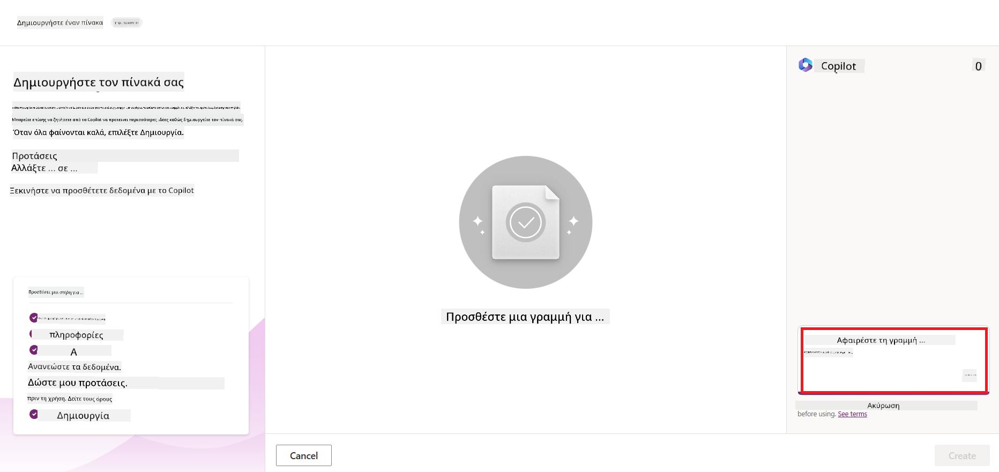
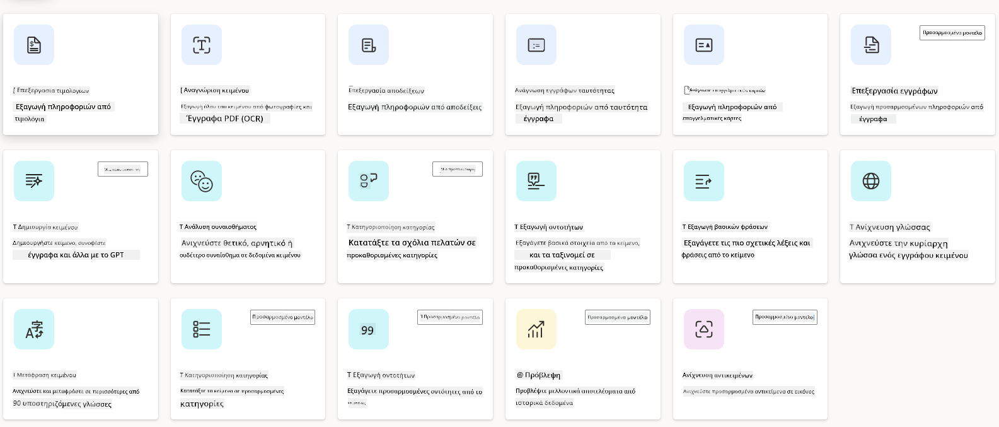

<!--
CO_OP_TRANSLATOR_METADATA:
{
  "original_hash": "846ac8e3b7dcfb697d3309fec05f0fea",
  "translation_date": "2025-10-17T18:22:40+00:00",
  "source_file": "10-building-low-code-ai-applications/README.md",
  "language_code": "el"
}
-->
# Δημιουργία Εφαρμογών AI με Χαμηλό Κώδικα

> _(Κάντε κλικ στην εικόνα παραπάνω για να δείτε το βίντεο αυτού του μαθήματος)_

## Εισαγωγή

Αφού μάθαμε πώς να δημιουργούμε εφαρμογές που παράγουν εικόνες, ας μιλήσουμε για τον χαμηλό κώδικα. Η γενετική AI μπορεί να χρησιμοποιηθεί σε διάφορους τομείς, συμπεριλαμβανομένου του χαμηλού κώδικα, αλλά τι είναι ο χαμηλός κώδικας και πώς μπορούμε να προσθέσουμε AI σε αυτόν;

Η δημιουργία εφαρμογών και λύσεων έχει γίνει πιο εύκολη για παραδοσιακούς προγραμματιστές και μη προγραμματιστές μέσω των Πλατφορμών Ανάπτυξης Χαμηλού Κώδικα. Οι Πλατφόρμες Ανάπτυξης Χαμηλού Κώδικα σας επιτρέπουν να δημιουργείτε εφαρμογές και λύσεις με ελάχιστο ή καθόλου κώδικα. Αυτό επιτυγχάνεται παρέχοντας ένα οπτικό περιβάλλον ανάπτυξης που σας επιτρέπει να σύρετε και να αποθέτετε στοιχεία για να δημιουργήσετε εφαρμογές και λύσεις. Αυτό σας επιτρέπει να δημιουργείτε εφαρμογές και λύσεις πιο γρήγορα και με λιγότερους πόρους. Σε αυτό το μάθημα, εξετάζουμε σε βάθος πώς να χρησιμοποιήσετε τον χαμηλό κώδικα και πώς να ενισχύσετε την ανάπτυξη χαμηλού κώδικα με AI χρησιμοποιώντας το Power Platform.

Το Power Platform παρέχει στις οργανώσεις τη δυνατότητα να ενδυναμώσουν τις ομάδες τους να δημιουργούν τις δικές τους λύσεις μέσω ενός διαισθητικού περιβάλλοντος χαμηλού ή καθόλου κώδικα. Αυτό το περιβάλλον βοηθά στην απλοποίηση της διαδικασίας δημιουργίας λύσεων. Με το Power Platform, οι λύσεις μπορούν να δημιουργηθούν σε ημέρες ή εβδομάδες αντί για μήνες ή χρόνια. Το Power Platform αποτελείται από πέντε βασικά προϊόντα: Power Apps, Power Automate, Power BI, Power Pages και Copilot Studio.

Αυτό το μάθημα καλύπτει:

- Εισαγωγή στη Γενετική AI στο Power Platform
- Εισαγωγή στο Copilot και πώς να το χρησιμοποιήσετε
- Χρήση της Γενετικής AI για τη δημιουργία εφαρμογών και ροών στο Power Platform
- Κατανόηση των Μοντέλων AI στο Power Platform με το AI Builder

## Στόχοι Μάθησης

Μέχρι το τέλος αυτού του μαθήματος, θα μπορείτε να:

- Κατανοήσετε πώς λειτουργεί το Copilot στο Power Platform.

- Δημιουργήσετε μια Εφαρμογή Παρακολούθησης Εργασιών Μαθητών για την εκπαιδευτική μας startup.

- Δημιουργήσετε μια Ροή Επεξεργασίας Τιμολογίων που χρησιμοποιεί AI για την εξαγωγή πληροφοριών από τιμολόγια.

- Εφαρμόσετε βέλτιστες πρακτικές κατά τη χρήση του Μοντέλου AI Δημιουργίας Κειμένου με GPT.

Τα εργαλεία και οι τεχνολογίες που θα χρησιμοποιήσετε σε αυτό το μάθημα είναι:

- **Power Apps**, για την Εφαρμογή Παρακολούθησης Εργασιών Μαθητών, που παρέχει ένα περιβάλλον ανάπτυξης χαμηλού κώδικα για τη δημιουργία εφαρμογών για την παρακολούθηση, διαχείριση και αλληλεπίδραση με δεδομένα.

- **Dataverse**, για την αποθήκευση των δεδομένων της Εφαρμογής Παρακολούθησης Εργασιών Μαθητών, όπου το Dataverse θα παρέχει μια πλατφόρμα δεδομένων χαμηλού κώδικα για την αποθήκευση των δεδομένων της εφαρμογής.

- **Power Automate**, για τη Ροή Επεξεργασίας Τιμολογίων, όπου θα έχετε ένα περιβάλλον ανάπτυξης χαμηλού κώδικα για τη δημιουργία ροών εργασίας για την αυτοματοποίηση της διαδικασίας Επεξεργασίας Τιμολογίων.

- **AI Builder**, για το Μοντέλο AI Επεξεργασίας Τιμολογίων, όπου θα χρησιμοποιήσετε προεγκατεστημένα Μοντέλα AI για την επεξεργασία των τιμολογίων της startup μας.

## Γενετική AI στο Power Platform

Η ενίσχυση της ανάπτυξης και εφαρμογής χαμηλού κώδικα με γενετική AI είναι ένας βασικός τομέας εστίασης για το Power Platform. Ο στόχος είναι να επιτρέψουμε σε όλους να δημιουργούν εφαρμογές, ιστότοπους, πίνακες ελέγχου και να αυτοματοποιούν διαδικασίες με AI, _χωρίς να απαιτείται εξειδίκευση στην επιστήμη δεδομένων_. Αυτός ο στόχος επιτυγχάνεται με την ενσωμάτωση της γενετικής AI στην εμπειρία ανάπτυξης χαμηλού κώδικα στο Power Platform με τη μορφή του Copilot και του AI Builder.

### Πώς λειτουργεί αυτό;

Το Copilot είναι ένας βοηθός AI που σας επιτρέπει να δημιουργείτε λύσεις Power Platform περιγράφοντας τις απαιτήσεις σας σε μια σειρά συνομιλιακών βημάτων χρησιμοποιώντας φυσική γλώσσα. Για παράδειγμα, μπορείτε να δώσετε οδηγίες στον βοηθό AI να δηλώσει ποια πεδία θα χρησιμοποιεί η εφαρμογή σας και αυτός θα δημιουργήσει τόσο την εφαρμογή όσο και το υποκείμενο μοντέλο δεδομένων ή μπορείτε να καθορίσετε πώς να ρυθμίσετε μια ροή στο Power Automate.

Μπορείτε να χρησιμοποιήσετε λειτουργίες που βασίζονται στο Copilot ως χαρακτηριστικό στις οθόνες της εφαρμογής σας για να επιτρέψετε στους χρήστες να ανακαλύψουν πληροφορίες μέσω συνομιλιακών αλληλεπιδράσεων.

Το AI Builder είναι μια δυνατότητα AI χαμηλού κώδικα διαθέσιμη στο Power Platform που σας επιτρέπει να χρησιμοποιείτε Μοντέλα AI για να σας βοηθήσουν να αυτοματοποιήσετε διαδικασίες και να προβλέψετε αποτελέσματα. Με το AI Builder μπορείτε να φέρετε AI στις εφαρμογές και τις ροές σας που συνδέονται με τα δεδομένα σας στο Dataverse ή σε διάφορες πηγές δεδομένων στο cloud, όπως το SharePoint, το OneDrive ή το Azure.

Το Copilot είναι διαθέσιμο σε όλα τα προϊόντα του Power Platform: Power Apps, Power Automate, Power BI, Power Pages και Power Virtual Agents. Το AI Builder είναι διαθέσιμο στο Power Apps και το Power Automate. Σε αυτό το μάθημα, θα επικεντρωθούμε στο πώς να χρησιμοποιήσετε το Copilot και το AI Builder στο Power Apps και το Power Automate για να δημιουργήσετε μια λύση για την εκπαιδευτική μας startup.

### Copilot στο Power Apps

Ως μέρος του Power Platform, το Power Apps παρέχει ένα περιβάλλον ανάπτυξης χαμηλού κώδικα για τη δημιουργία εφαρμογών για την παρακολούθηση, διαχείριση και αλληλεπίδραση με δεδομένα. Είναι μια σουίτα υπηρεσιών ανάπτυξης εφαρμογών με μια επεκτάσιμη πλατφόρμα δεδομένων και τη δυνατότητα σύνδεσης με υπηρεσίες cloud και δεδομένα εντός εγκαταστάσεων. Το Power Apps σας επιτρέπει να δημιουργείτε εφαρμογές που λειτουργούν σε προγράμματα περιήγησης, tablet και τηλέφωνα και μπορούν να μοιραστούν με συνεργάτες. Το Power Apps διευκολύνει τους χρήστες στην ανάπτυξη εφαρμογών με μια απλή διεπαφή, ώστε κάθε επιχειρηματικός χρήστης ή επαγγελματίας προγραμματιστής να μπορεί να δημιουργεί προσαρμοσμένες εφαρμογές. Η εμπειρία ανάπτυξης εφαρμογών ενισχύεται επίσης με τη Γενετική AI μέσω του Copilot.

Η λειτουργία βοηθού AI Copilot στο Power Apps σας επιτρέπει να περιγράψετε τι είδους εφαρμογή χρειάζεστε και ποιες πληροφορίες θέλετε να παρακολουθεί, να συλλέγει ή να εμφανίζει η εφαρμογή σας. Το Copilot στη συνέχεια δημιουργεί μια ευέλικτη εφαρμογή Canvas βάσει της περιγραφής σας. Μπορείτε στη συνέχεια να προσαρμόσετε την εφαρμογή ώστε να ανταποκρίνεται στις ανάγκες σας. Ο AI Copilot δημιουργεί επίσης και προτείνει έναν Πίνακα Dataverse με τα πεδία που χρειάζεστε για να αποθηκεύσετε τα δεδομένα που θέλετε να παρακολουθείτε και κάποια δείγματα δεδομένων. Θα δούμε τι είναι το Dataverse και πώς μπορείτε να το χρησιμοποιήσετε στο Power Apps σε αυτό το μάθημα αργότερα. Μπορείτε στη συνέχεια να προσαρμόσετε τον πίνακα ώστε να ανταποκρίνεται στις ανάγκες σας χρησιμοποιώντας τη λειτουργία βοηθού AI Copilot μέσω συνομιλιακών βημάτων. Αυτή η λειτουργία είναι διαθέσιμη από την αρχική οθόνη του Power Apps.

### Copilot στο Power Automate

Ως μέρος του Power Platform, το Power Automate επιτρέπει στους χρήστες να δημιουργούν αυτοματοποιημένες ροές εργασίας μεταξύ εφαρμογών και υπηρεσιών. Βοηθά στην αυτοματοποίηση επαναλαμβανόμενων επιχειρηματικών διαδικασιών, όπως η επικοινωνία, η συλλογή δεδομένων και οι εγκρίσεις αποφάσεων. Η απλή διεπαφή του επιτρέπει στους χρήστες με κάθε τεχνική ικανότητα (από αρχάριους έως έμπειρους προγραμματιστές) να αυτοματοποιούν εργασίες. Η εμπειρία ανάπτυξης ροών εργασίας ενισχύεται επίσης με τη Γενετική AI μέσω του Copilot.

Η λειτουργία βοηθού AI Copilot στο Power Automate σας επιτρέπει να περιγράψετε τι είδους ροή χρειάζεστε και ποιες ενέργειες θέλετε να εκτελεί η ροή σας. Το Copilot στη συνέχεια δημιουργεί μια ροή βάσει της περιγραφής σας. Μπορείτε στη συνέχεια να προσαρμόσετε τη ροή ώστε να ανταποκρίνεται στις ανάγκες σας. Ο AI Copilot δημιουργεί επίσης και προτείνει τις ενέργειες που χρειάζεστε για να εκτελέσετε την εργασία που θέλετε να αυτοματοποιήσετε. Θα δούμε τι είναι οι ροές και πώς μπορείτε να τις χρησιμοποιήσετε στο Power Automate σε αυτό το μάθημα αργότερα. Μπορείτε στη συνέχεια να προσαρμόσετε τις ενέργειες ώστε να ανταποκρίνονται στις ανάγκες σας χρησιμοποιώντας τη λειτουργία βοηθού AI Copilot μέσω συνομιλιακών βημάτων. Αυτή η λειτουργία είναι διαθέσιμη από την αρχική οθόνη του Power Automate.

## Εργασία: Διαχείριση εργασιών μαθητών και τιμολογίων για την startup μας, χρησιμοποιώντας το Copilot

Η startup μας παρέχει διαδικτυακά μαθήματα σε μαθητές. Η startup έχει αναπτυχθεί γρήγορα και τώρα δυσκολεύεται να ανταποκριθεί στη ζήτηση για τα μαθήματά της. Η startup σας έχει προσλάβει ως προγραμματιστή Power Platform για να τους βοηθήσετε να δημιουργήσουν μια λύση χαμηλού κώδικα για να τους βοηθήσετε να διαχειριστούν τις εργασίες μαθητών και τα τιμολόγια. Η λύση τους θα πρέπει να τους βοηθήσει να παρακολουθούν και να διαχειρίζονται τις εργασίες μαθητών μέσω μιας εφαρμογής και να αυτοματοποιούν τη διαδικασία επεξεργασίας τιμολογίων μέσω μιας ροής εργασίας. Σας έχει ζητηθεί να χρησιμοποιήσετε Γενετική AI για την ανάπτυξη της λύσης.

Όταν ξεκινάτε να χρησιμοποιείτε το Copilot, μπορείτε να χρησιμοποιήσετε τη [Βιβλιοθήκη Εντολών Copilot του Power Platform](https://github.com/pnp/powerplatform-prompts?WT.mc_id=academic-109639-somelezediko) για να ξεκινήσετε με τις εντολές. Αυτή η βιβλιοθήκη περιέχει μια λίστα εντολών που μπορείτε να χρησιμοποιήσετε για να δημιουργήσετε εφαρμογές και ροές με το Copilot. Μπορείτε επίσης να χρησιμοποιήσετε τις εντολές στη βιβλιοθήκη για να πάρετε μια ιδέα για το πώς να περιγράψετε τις απαιτήσεις σας στο Copilot.

### Δημιουργία Εφαρμογής Παρακολούθησης Εργασιών Μαθητών για την Startup μας

Οι εκπαιδευτικοί της startup μας δυσκολεύονται να παρακολουθούν τις εργασίες των μαθητών. Χρησιμοποιούσαν ένα υπολογιστικό φύλλο για να παρακολουθούν τις εργασίες, αλλά αυτό έχει γίνει δύσκολο να διαχειριστεί καθώς ο αριθμός των μαθητών έχει αυξηθεί. Σας έχουν ζητήσει να δημιουργήσετε μια εφαρμογή που θα τους βοηθήσει να παρακολουθούν και να διαχειρίζονται τις εργασίες των μαθητών. Η εφαρμογή θα πρέπει να τους επιτρέπει να προσθέτουν νέες εργασίες, να βλέπουν εργασίες, να ενημερώνουν εργασίες και να διαγράφουν εργασίες. Η εφαρμογή θα πρέπει επίσης να επιτρέπει στους εκπαιδευτικούς και τους μαθητές να βλέπουν τις εργασίες που έχουν βαθμολογηθεί και εκείνες που δεν έχουν βαθμολογηθεί.

Θα δημιουργήσετε την εφαρμογή χρησιμοποιώντας το Copilot στο Power Apps ακολουθώντας τα παρακάτω βήματα:

1. Μεταβείτε στην [αρχική οθόνη του Power Apps](https://make.powerapps.com?WT.mc_id=academic-105485-koreyst).

1. Χρησιμοποιήστε την περιοχή κειμένου στην αρχική οθόνη για να περιγράψετε την εφαρμογή που θέλετε να δημιουργήσετε. Για παράδειγμα, **_Θέλω να δημιουργήσω μια εφαρμογή για την παρακολούθηση και διαχείριση εργασιών μαθητών_**. Κάντε κλικ στο κουμπί **Αποστολή** για να στείλετε την εντολή στο AI Copilot.

1. Ο AI Copilot θα προτείνει έναν Πίνακα Dataverse με τα πεδία που χρειάζεστε για να αποθηκεύσετε τα δεδομένα που θέλετε να παρακολουθείτε και κάποια δείγματα δεδομένων. Μπορείτε στη συνέχεια να προσαρμόσετε τον πίνακα ώστε να ανταποκρίνεται στις ανάγκες σας χρησιμοποιώντας τη λειτουργία βοηθού AI Copilot μέσω συνομιλιακών βημάτων.

   > **Σημαντικό**: Το Dataverse είναι η υποκείμενη πλατφόρμα δεδομένων για το Power Platform. Είναι μια πλατφόρμα δεδομένων χαμηλού κώδικα για την αποθήκευση των δεδομένων της εφαρμογής. Είναι μια πλήρως διαχειριζόμενη υπηρεσία που αποθηκεύει με ασφάλεια δεδομένα στο Microsoft Cloud και παρέχεται μέσα στο περιβάλλον του Power Platform σας. Διαθέτει ενσωματωμένες δυνατότητες διακυβέρνησης δεδομένων, όπως ταξινόμηση δεδομένων, προέλευση δεδομένων, λεπτομερή έλεγχο πρόσβασης και άλλα. Μπορείτε να μάθετε περισσότερα για το Dataverse [εδώ](https://docs.microsoft.com/powerapps/maker/data-platform/data-platform-intro?WT.mc_id=academic-109639-somelezediko).

   

1. Οι εκπαιδευτικοί θέλουν να στέλνουν email στους μαθητές που έχουν υποβάλει τις εργασίες τους για να τους ενημερώνουν για την πρόοδο των εργασιών τους. Μπορείτε να χρησιμοποιήσετε το Copilot για να προσθέσετε ένα νέο πεδίο στον πίνακα για να αποθηκεύσετε το email του μαθητή. Για παράδειγμα, μπορείτε να χρησιμοποιήσετε την ακόλουθη εντολή για να προσθέσετε ένα νέο πεδίο στον πίνακα: **_Θέλω να προσθέσω μια στήλη για να αποθηκεύσω το email του μαθητή_**. Κάντε κλικ στο κουμπί **Αποστολή** για να στείλετε την εντολή στο AI Copilot.

1. Ο AI Copilot θα δημιουργήσει ένα νέο πεδίο και μπορείτε στη συνέχεια να προσαρμόσετε το πεδίο ώστε να ανταποκρίνεται στις ανάγκες σας.

1. Μόλις ολοκληρώσετε τον πίνακα, κάντε κλικ στο κουμπί **Δημιουργία εφαρμογής** για να δημιουργήσετε την εφαρμογή.

1. Ο AI Copilot θα δημιουργήσει μια ευέλικτη εφαρμογή Canvas βάσει της περιγραφής σας. Μπορείτε στη συνέχεια να προσαρμόσετε την εφαρμογή ώστε να ανταποκρίνεται στις ανάγκες σας.

1. Για να στέλνουν οι εκπαιδευτικοί email στους μαθητές, μπορείτε να χρησιμοποιήσετε το Copilot για να
Γιατί να χρησιμοποιήσουμε το Dataverse για την startup μας; Οι τυπικοί και προσαρμοσμένοι πίνακες στο Dataverse παρέχουν μια ασφαλή και βασισμένη στο cloud επιλογή αποθήκευσης για τα δεδομένα σας. Οι πίνακες σας επιτρέπουν να αποθηκεύετε διαφορετικούς τύπους δεδομένων, όπως ακριβώς θα χρησιμοποιούσατε πολλαπλά φύλλα εργασίας σε ένα Excel workbook. Μπορείτε να χρησιμοποιήσετε πίνακες για να αποθηκεύσετε δεδομένα που είναι συγκεκριμένα για τις ανάγκες της επιχείρησής σας. Μερικά από τα οφέλη που θα αποκομίσει η startup μας από τη χρήση του Dataverse περιλαμβάνουν, αλλά δεν περιορίζονται σε:

- **Εύκολη διαχείριση**: Τόσο τα μεταδεδομένα όσο και τα δεδομένα αποθηκεύονται στο cloud, οπότε δεν χρειάζεται να ανησυχείτε για τις λεπτομέρειες του πώς αποθηκεύονται ή διαχειρίζονται. Μπορείτε να επικεντρωθείτε στη δημιουργία των εφαρμογών και των λύσεών σας.

- **Ασφάλεια**: Το Dataverse παρέχει μια ασφαλή και βασισμένη στο cloud επιλογή αποθήκευσης για τα δεδομένα σας. Μπορείτε να ελέγξετε ποιος έχει πρόσβαση στα δεδομένα στους πίνακές σας και πώς μπορεί να τα προσπελάσει χρησιμοποιώντας ασφάλεια βάσει ρόλων.

- **Πλούσια μεταδεδομένα**: Οι τύποι δεδομένων και οι σχέσεις χρησιμοποιούνται απευθείας μέσα στο Power Apps.

- **Λογική και επαλήθευση**: Μπορείτε να χρησιμοποιήσετε επιχειρηματικούς κανόνες, υπολογισμένα πεδία και κανόνες επαλήθευσης για να εφαρμόσετε επιχειρηματική λογική και να διατηρήσετε την ακρίβεια των δεδομένων.

Τώρα που γνωρίζετε τι είναι το Dataverse και γιατί πρέπει να το χρησιμοποιήσετε, ας δούμε πώς μπορείτε να χρησιμοποιήσετε το Copilot για να δημιουργήσετε έναν πίνακα στο Dataverse που να καλύπτει τις απαιτήσεις της οικονομικής μας ομάδας.

> **Note** : Θα χρησιμοποιήσετε αυτόν τον πίνακα στην επόμενη ενότητα για να δημιουργήσετε μια αυτοματοποίηση που θα εξάγει όλες τις πληροφορίες τιμολογίων και θα τις αποθηκεύει στον πίνακα.

Για να δημιουργήσετε έναν πίνακα στο Dataverse χρησιμοποιώντας το Copilot, ακολουθήστε τα παρακάτω βήματα:

1. Μεταβείτε στην αρχική οθόνη του [Power Apps](https://make.powerapps.com?WT.mc_id=academic-105485-koreyst).

2. Στη γραμμή πλοήγησης στα αριστερά, επιλέξτε **Tables** και στη συνέχεια κάντε κλικ στο **Describe the new Table**.

3. Στην οθόνη **Describe the new Table**, χρησιμοποιήστε το πεδίο κειμένου για να περιγράψετε τον πίνακα που θέλετε να δημιουργήσετε. Για παράδειγμα, **_Θέλω να δημιουργήσω έναν πίνακα για την αποθήκευση πληροφοριών τιμολογίων_**. Κάντε κλικ στο κουμπί **Send** για να στείλετε την εντολή στο AI Copilot.

4. Το AI Copilot θα προτείνει έναν πίνακα Dataverse με τα πεδία που χρειάζεστε για να αποθηκεύσετε τα δεδομένα που θέλετε να παρακολουθήσετε και μερικά δείγματα δεδομένων. Στη συνέχεια, μπορείτε να προσαρμόσετε τον πίνακα ώστε να καλύπτει τις ανάγκες σας χρησιμοποιώντας τη λειτουργία βοηθού του AI Copilot μέσω συνομιλιακών βημάτων.

5. Η οικονομική ομάδα θέλει να στείλει ένα email στον προμηθευτή για να τον ενημερώσει για την τρέχουσα κατάσταση του τιμολογίου του. Μπορείτε να χρησιμοποιήσετε το Copilot για να προσθέσετε ένα νέο πεδίο στον πίνακα για την αποθήκευση του email του προμηθευτή. Για παράδειγμα, μπορείτε να χρησιμοποιήσετε την εξής εντολή: **_Θέλω να προσθέσω μια στήλη για την αποθήκευση του email του προμηθευτή_**. Κάντε κλικ στο κουμπί **Send** για να στείλετε την εντολή στο AI Copilot.

6. Το AI Copilot θα δημιουργήσει ένα νέο πεδίο και στη συνέχεια μπορείτε να προσαρμόσετε το πεδίο ώστε να καλύπτει τις ανάγκες σας.

7. Όταν ολοκληρώσετε τον πίνακα, κάντε κλικ στο κουμπί **Create** για να δημιουργήσετε τον πίνακα.

## Μοντέλα AI στο Power Platform με το AI Builder

Το AI Builder είναι μια δυνατότητα AI χαμηλού κώδικα διαθέσιμη στο Power Platform που σας επιτρέπει να χρησιμοποιείτε μοντέλα AI για να αυτοματοποιείτε διαδικασίες και να προβλέπετε αποτελέσματα. Με το AI Builder μπορείτε να ενσωματώσετε AI στις εφαρμογές και τις ροές σας που συνδέονται με τα δεδομένα σας στο Dataverse ή σε διάφορες πηγές δεδομένων στο cloud, όπως το SharePoint, το OneDrive ή το Azure.

## Προκατασκευασμένα Μοντέλα AI vs Προσαρμοσμένα Μοντέλα AI

Το AI Builder παρέχει δύο τύπους μοντέλων AI: Προκατασκευασμένα Μοντέλα AI και Προσαρμοσμένα Μοντέλα AI. Τα Προκατασκευασμένα Μοντέλα AI είναι έτοιμα προς χρήση μοντέλα AI που έχουν εκπαιδευτεί από τη Microsoft και είναι διαθέσιμα στο Power Platform. Αυτά σας βοηθούν να προσθέσετε ευφυΐα στις εφαρμογές και τις ροές σας χωρίς να χρειάζεται να συλλέξετε δεδομένα και στη συνέχεια να δημιουργήσετε, να εκπαιδεύσετε και να δημοσιεύσετε τα δικά σας μοντέλα. Μπορείτε να χρησιμοποιήσετε αυτά τα μοντέλα για να αυτοματοποιήσετε διαδικασίες και να προβλέψετε αποτελέσματα.

Μερικά από τα Προκατασκευασμένα Μοντέλα AI που είναι διαθέσιμα στο Power Platform περιλαμβάνουν:

- **Εξαγωγή βασικών φράσεων**: Αυτό το μοντέλο εξάγει βασικές φράσεις από κείμενο.
- **Ανίχνευση γλώσσας**: Αυτό το μοντέλο ανιχνεύει τη γλώσσα ενός κειμένου.
- **Ανάλυση συναισθημάτων**: Αυτό το μοντέλο ανιχνεύει θετικά, αρνητικά, ουδέτερα ή μικτά συναισθήματα σε κείμενο.
- **Αναγνώστης επαγγελματικών καρτών**: Αυτό το μοντέλο εξάγει πληροφορίες από επαγγελματικές κάρτες.
- **Αναγνώριση κειμένου**: Αυτό το μοντέλο εξάγει κείμενο από εικόνες.
- **Ανίχνευση αντικειμένων**: Αυτό το μοντέλο ανιχνεύει και εξάγει αντικείμενα από εικόνες.
- **Επεξεργασία εγγράφων**: Αυτό το μοντέλο εξάγει πληροφορίες από φόρμες.
- **Επεξεργασία τιμολογίων**: Αυτό το μοντέλο εξάγει πληροφορίες από τιμολόγια.

Με τα Προσαρμοσμένα Μοντέλα AI μπορείτε να φέρετε το δικό σας μοντέλο στο AI Builder ώστε να λειτουργεί όπως οποιοδήποτε προσαρμοσμένο μοντέλο του AI Builder, επιτρέποντάς σας να εκπαιδεύσετε το μοντέλο χρησιμοποιώντας τα δικά σας δεδομένα. Μπορείτε να χρησιμοποιήσετε αυτά τα μοντέλα για να αυτοματοποιήσετε διαδικασίες και να προβλέψετε αποτελέσματα τόσο στο Power Apps όσο και στο Power Automate. Όταν χρησιμοποιείτε το δικό σας μοντέλο, υπάρχουν περιορισμοί που ισχύουν. Διαβάστε περισσότερα για αυτούς τους [περιορισμούς](https://learn.microsoft.com/ai-builder/byo-model#limitations?WT.mc_id=academic-105485-koreyst).

## Εργασία #2 - Δημιουργία Ροής Επεξεργασίας Τιμολογίων για την Startup μας

Η οικονομική ομάδα δυσκολεύεται να επεξεργαστεί τα τιμολόγια. Χρησιμοποιούν ένα υπολογιστικό φύλλο για να παρακολουθούν τα τιμολόγια, αλλά αυτό έχει γίνει δύσκολο να διαχειριστεί καθώς ο αριθμός των τιμολογίων έχει αυξηθεί. Ζήτησαν να δημιουργήσετε μια ροή εργασίας που θα τους βοηθήσει να επεξεργαστούν τα τιμολόγια χρησιμοποιώντας AI. Η ροή εργασίας θα πρέπει να τους επιτρέπει να εξάγουν πληροφορίες από τα τιμολόγια και να αποθηκεύουν τις πληροφορίες σε έναν πίνακα Dataverse. Η ροή εργασίας θα πρέπει επίσης να τους επιτρέπει να στέλνουν ένα email στην οικονομική ομάδα με τις εξαγόμενες πληροφορίες.

Τώρα που γνωρίζετε τι είναι το AI Builder και γιατί πρέπει να το χρησιμοποιήσετε, ας δούμε πώς μπορείτε να χρησιμοποιήσετε το Μοντέλο Επεξεργασίας Τιμολογίων στο AI Builder, το οποίο καλύψαμε νωρίτερα, για να δημιουργήσετε μια ροή εργασίας που θα βοηθήσει την οικονομική ομάδα να επεξεργαστεί τα τιμολόγια.

Για να δημιουργήσετε μια ροή εργασίας που θα βοηθήσει την οικονομική ομάδα να επεξεργαστεί τα τιμολόγια χρησιμοποιώντας το Μοντέλο Επεξεργασίας Τιμολογίων στο AI Builder, ακολουθήστε τα παρακάτω βήματα:

1. Μεταβείτε στην αρχική οθόνη του [Power Automate](https://make.powerautomate.com?WT.mc_id=academic-105485-koreyst).

2. Χρησιμοποιήστε το πεδίο κειμένου στην αρχική οθόνη για να περιγράψετε τη ροή εργασίας που θέλετε να δημιουργήσετε. Για παράδειγμα, **_Επεξεργασία ενός τιμολογίου όταν φτάνει στο mailbox μου_**. Κάντε κλικ στο κουμπί **Send** για να στείλετε την εντολή στο AI Copilot.

   

3. Το AI Copilot θα προτείνει τις ενέργειες που χρειάζεστε για να εκτελέσετε την εργασία που θέλετε να αυτοματοποιήσετε. Μπορείτε να κάνετε κλικ στο κουμπί **Next** για να προχωρήσετε στα επόμενα βήματα.

4. Στο επόμενο βήμα, το Power Automate θα σας ζητήσει να ρυθμίσετε τις συνδέσεις που απαιτούνται για τη ροή. Όταν τελειώσετε, κάντε κλικ στο κουμπί **Create flow** για να δημιουργήσετε τη ροή.

5. Το AI Copilot θα δημιουργήσει μια ροή και στη συνέχεια μπορείτε να προσαρμόσετε τη ροή ώστε να καλύπτει τις ανάγκες σας.

6. Ενημερώστε την ενεργοποίηση της ροής και ορίστε τον **Φάκελο** στον φάκελο όπου θα αποθηκεύονται τα τιμολόγια. Για παράδειγμα, μπορείτε να ορίσετε τον φάκελο ως **Inbox**. Κάντε κλικ στο **Show advanced options** και ορίστε το **Only with Attachments** σε **Yes**. Αυτό θα διασφαλίσει ότι η ροή εκτελείται μόνο όταν λαμβάνεται ένα email με συνημμένο στον φάκελο.

7. Αφαιρέστε τις παρακάτω ενέργειες από τη ροή: **HTML to text**, **Compose**, **Compose 2**, **Compose 3** και **Compose 4** επειδή δεν θα τις χρησιμοποιήσετε.

8. Αφαιρέστε την ενέργεια **Condition** από τη ροή επειδή δεν θα τη χρησιμοποιήσετε. Θα πρέπει να μοιάζει με το παρακάτω στιγμιότυπο οθόνης:

   

9. Κάντε κλικ στο κουμπί **Add an action** και αναζητήστε **Dataverse**. Επιλέξτε την ενέργεια **Add a new row**.

10. Στην ενέργεια **Extract Information from invoices**, ενημερώστε το **Invoice File** ώστε να δείχνει στο **Attachment Content** από το email. Αυτό θα διασφαλίσει ότι η ροή εξάγει πληροφορίες από το συνημμένο τιμολόγιο.

11. Επιλέξτε τον **Πίνακα** που δημιουργήσατε νωρίτερα. Για παράδειγμα, μπορείτε να επιλέξετε τον πίνακα **Invoice Information**. Επιλέξτε το δυναμικό περιεχόμενο από την προηγούμενη ενέργεια για να συμπληρώσετε τα παρακάτω πεδία:

    - ID
    - Amount
    - Date
    - Name
    - Status - Ορίστε το **Status** σε **Pending**.
    - Supplier Email - Χρησιμοποιήστε το **From** δυναμικό περιεχόμενο από την ενεργοποίηση **When a new email arrives**.

    

12. Όταν ολοκληρώσετε τη ροή, κάντε κλικ στο κουμπί **Save** για να αποθηκεύσετε τη ροή. Στη συνέχεια, μπορείτε να δοκιμάσετε τη ροή στέλνοντας ένα email με ένα τιμολόγιο στον φάκελο που καθορίσατε στην ενεργοποίηση.

> **Η εργασία σας**: Η ροή που μόλις δημιουργήσατε είναι μια καλή αρχή, τώρα πρέπει να σκεφτείτε πώς μπορείτε να δημιουργήσετε μια αυτοματοποίηση που θα επιτρέπει στην οικονομική μας ομάδα να στέλνει ένα email στον προμηθευτή για να τον ενημερώσει για την τρέχουσα κατάσταση του τιμολογίου του. Υπόδειξη: η ροή πρέπει να εκτελείται όταν αλλάζει η κατάσταση του τιμολογίου.

## Χρήση Μοντέλου AI Δημιουργίας Κειμένου στο Power Automate

Το Μοντέλο Δημιουργίας Κειμένου με GPT στο AI Builder σας επιτρέπει να δημιουργείτε κείμενο βάσει μιας εντολής και υποστηρίζεται από την υπηρεσία Microsoft Azure OpenAI. Με αυτή τη δυνατότητα, μπορείτε να ενσωματώσετε την τεχνολογία GPT (Generative Pre-Trained Transformer) στις εφαρμογές και τις ροές σας για να δημιουργήσετε μια ποικιλία αυτοματοποιημένων ροών και εφαρμογών με χρήσιμες πληροφορίες.

Τα μοντέλα GPT υποβάλλονται σε εκτεταμένη εκπαίδευση σε τεράστιες ποσότητες δεδομένων, επιτρέποντάς τους να παράγουν κείμενο που μοιάζει πολύ με την ανθρώπινη γλώσσα όταν τους παρέχεται μια εντολή. Όταν ενσωματώνονται στην αυτοματοποίηση ροής εργασίας, τα μοντέλα AI όπως το GPT μπορούν να αξιοποιηθούν για να απλοποιήσουν και να αυτοματοποιήσουν ένα ευρύ φάσμα εργασιών.

Για παράδειγμα, μπορείτε να δημιουργήσετε ροές για να δημιουργείτε αυτόματα κείμενο για διάφορες χρήσεις, όπως: προσχέδια email, περιγραφές προϊόντων και άλλα. Μπορείτε επίσης να χρησιμοποιήσετε το μοντέλο για να δημιουργείτε κείμενο για διάφορες εφαρμογές, όπως chatbots και εφαρμογές εξυπηρέτησης πελατών που επιτρέπουν στους εκπροσώπους εξυπηρέτησης πελατών να απαντούν αποτελεσματικά και αποδοτικά σε ερωτήματα πελατών.

Για να μάθετε πώς να χρησιμοποιείτε αυτό το Μοντέλο AI στο Power Automate, εξετάστε το [Add intelligence with AI Builder and GPT](https://learn.microsoft.com/training/modules/ai-builder-text-generation/?WT.mc_id=academic-109639-somelezediko) module.

## Εξαιρετική Δουλειά! Συνεχίστε τη Μάθηση

Αφού ολοκληρώσετε αυτό το μάθημα, δείτε τη [Συλλογή Μάθησης για Γενετική AI](https://aka.ms/genai-collection?WT.mc_id=academic-105485-koreyst) για να συνεχίσετε να αναβαθμίζετε τις γνώσεις σας στη Γενετική AI!

Προχωρήστε στο Μάθημα 11 όπου θα εξετάσουμε πώς να [ενσωματώσετε τη Γενετική AI με Κλήση Λειτουργιών](../11-integrating-with-function-calling/README.md?WT.mc_id=academic-105

---

**Αποποίηση ευθύνης**:  
Αυτό το έγγραφο έχει μεταφραστεί χρησιμοποιώντας την υπηρεσία μετάφρασης AI [Co-op Translator](https://github.com/Azure/co-op-translator). Παρόλο που καταβάλλουμε προσπάθειες για ακρίβεια, παρακαλούμε να έχετε υπόψη ότι οι αυτοματοποιημένες μεταφράσεις ενδέχεται να περιέχουν λάθη ή ανακρίβειες. Το πρωτότυπο έγγραφο στη μητρική του γλώσσα πρέπει να θεωρείται η αυθεντική πηγή. Για κρίσιμες πληροφορίες, συνιστάται επαγγελματική ανθρώπινη μετάφραση. Δεν φέρουμε ευθύνη για τυχόν παρεξηγήσεις ή εσφαλμένες ερμηνείες που προκύπτουν από τη χρήση αυτής της μετάφρασης.