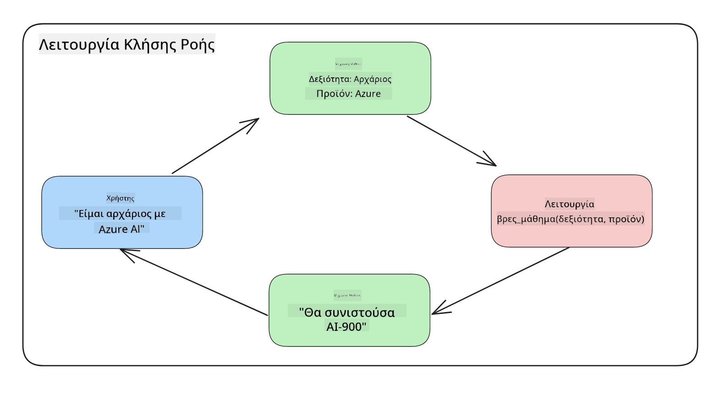
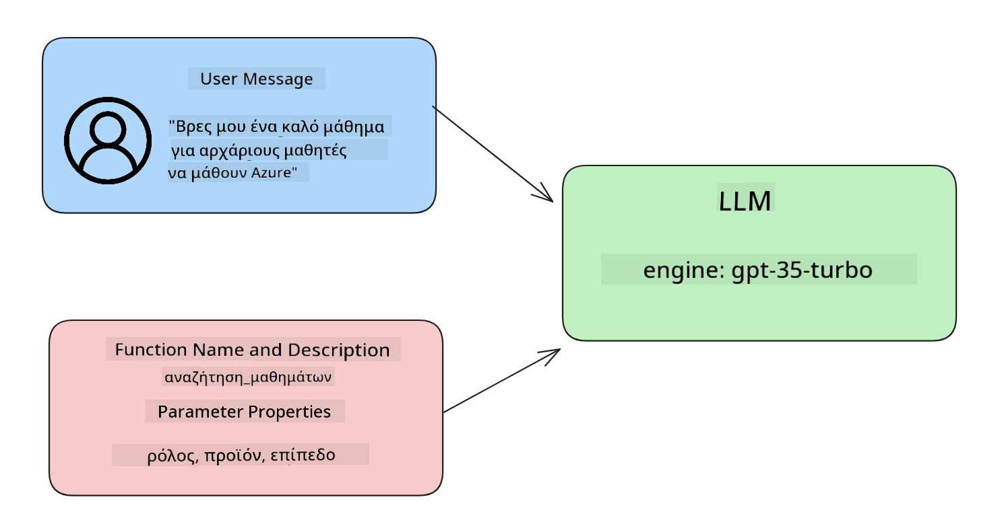

<!--
CO_OP_TRANSLATOR_METADATA:
{
  "original_hash": "77a48a201447be19aa7560706d6f93a0",
  "translation_date": "2025-05-19T21:29:15+00:00",
  "source_file": "11-integrating-with-function-calling/README.md",
  "language_code": "el"
}
-->
# Ενσωμάτωση με κλήση λειτουργιών

Έχετε μάθει αρκετά μέχρι τώρα στα προηγούμενα μαθήματα. Ωστόσο, μπορούμε να βελτιωθούμε περαιτέρω. Μερικά πράγματα που μπορούμε να αντιμετωπίσουμε είναι πώς μπορούμε να έχουμε μια πιο συνεπή μορφή απάντησης για να είναι πιο εύκολη η εργασία με την απάντηση σε επόμενα στάδια. Επίσης, μπορεί να θέλουμε να προσθέσουμε δεδομένα από άλλες πηγές για να εμπλουτίσουμε περαιτέρω την εφαρμογή μας.

Τα παραπάνω προβλήματα είναι αυτά που επιδιώκει να αντιμετωπίσει αυτό το κεφάλαιο.

## Εισαγωγή

Αυτό το μάθημα θα καλύψει:

- Εξήγηση του τι είναι η κλήση λειτουργιών και οι περιπτώσεις χρήσης της.
- Δημιουργία κλήσης λειτουργίας χρησιμοποιώντας το Azure OpenAI.
- Πώς να ενσωματώσετε μια κλήση λειτουργίας σε μια εφαρμογή.

## Στόχοι Μάθησης

Μέχρι το τέλος αυτού του μαθήματος, θα είστε σε θέση να:

- Εξηγήσετε το σκοπό της χρήσης της κλήσης λειτουργιών.
- Ρυθμίσετε την Κλήση Λειτουργίας χρησιμοποιώντας την Υπηρεσία Azure OpenAI.
- Σχεδιάσετε αποτελεσματικές κλήσεις λειτουργιών για την περίπτωση χρήσης της εφαρμογής σας.

## Σενάριο: Βελτίωση του chatbot μας με λειτουργίες

Για αυτό το μάθημα, θέλουμε να δημιουργήσουμε μια λειτουργία για την εκπαιδευτική μας startup που επιτρέπει στους χρήστες να χρησιμοποιούν ένα chatbot για να βρουν τεχνικά μαθήματα. Θα προτείνουμε μαθήματα που ταιριάζουν στο επίπεδο δεξιοτήτων τους, τον τρέχοντα ρόλο και την τεχνολογία ενδιαφέροντος.

Για να ολοκληρώσουμε αυτό το σενάριο, θα χρησιμοποιήσουμε έναν συνδυασμό από:

- `Azure OpenAI` για να δημιουργήσουμε μια εμπειρία συνομιλίας για τον χρήστη.
- `Microsoft Learn Catalog API` για να βοηθήσουμε τους χρήστες να βρουν μαθήματα με βάση το αίτημα του χρήστη.
- `Function Calling` για να πάρουμε την ερώτηση του χρήστη και να την στείλουμε σε μια λειτουργία για να κάνουμε την αίτηση API.

Για να ξεκινήσουμε, ας δούμε γιατί θα θέλαμε να χρησιμοποιήσουμε την κλήση λειτουργιών εξαρχής:

## Γιατί Κλήση Λειτουργιών

Πριν από την κλήση λειτουργιών, οι απαντήσεις από ένα LLM ήταν μη δομημένες και ασυνεπείς. Οι προγραμματιστές έπρεπε να γράψουν σύνθετο κώδικα επικύρωσης για να βεβαιωθούν ότι μπορούσαν να χειριστούν κάθε παραλλαγή μιας απάντησης. Οι χρήστες δεν μπορούσαν να λάβουν απαντήσεις όπως "Ποιος είναι ο τρέχων καιρός στη Στοκχόλμη;". Αυτό οφείλεται στο ότι τα μοντέλα περιορίζονταν στον χρόνο που τα δεδομένα είχαν εκπαιδευτεί.

Η Κλήση Λειτουργιών είναι μια δυνατότητα της Υπηρεσίας Azure OpenAI για την αντιμετώπιση των ακόλουθων περιορισμών:

- **Συνεπής μορφή απάντησης**. Αν μπορούμε να ελέγξουμε καλύτερα τη μορφή της απάντησης, μπορούμε πιο εύκολα να ενσωματώσουμε την απάντηση σε επόμενα στάδια σε άλλα συστήματα.
- **Εξωτερικά δεδομένα**. Δυνατότητα χρήσης δεδομένων από άλλες πηγές μιας εφαρμογής σε ένα περιβάλλον συνομιλίας.

## Εικονογράφηση του προβλήματος μέσω ενός σεναρίου

> Σας προτείνουμε να χρησιμοποιήσετε το [συμπεριλαμβανόμενο σημειωματάριο](../../../11-integrating-with-function-calling/python/aoai-assignment.ipynb) αν θέλετε να εκτελέσετε το παρακάτω σενάριο. Μπορείτε επίσης απλά να διαβάσετε καθώς προσπαθούμε να εικονογραφήσουμε ένα πρόβλημα όπου οι λειτουργίες μπορούν να βοηθήσουν στην αντιμετώπιση του προβλήματος.

Ας δούμε το παράδειγμα που εικονογραφεί το πρόβλημα της μορφής απάντησης:

Ας πούμε ότι θέλουμε να δημιουργήσουμε μια βάση δεδομένων με δεδομένα μαθητών ώστε να μπορούμε να προτείνουμε το σωστό μάθημα σε αυτούς. Παρακάτω έχουμε δύο περιγραφές μαθητών που είναι πολύ παρόμοιες στα δεδομένα που περιέχουν.

1. Δημιουργήστε μια σύνδεση με τον πόρο μας Azure OpenAI:

   ```python
   import os
   import json
   from openai import AzureOpenAI
   from dotenv import load_dotenv
   load_dotenv()

   client = AzureOpenAI(
   api_key=os.environ['AZURE_OPENAI_API_KEY'],  # this is also the default, it can be omitted
   api_version = "2023-07-01-preview"
   )

   deployment=os.environ['AZURE_OPENAI_DEPLOYMENT']
   ```

   Παρακάτω είναι κάποιοι κώδικες Python για τη διαμόρφωση της σύνδεσής μας με το Azure OpenAI όπου ορίζουμε `api_type`, `api_base`, `api_version` and `api_key`.

1. Creating two student descriptions using variables `student_1_description` and `student_2_description`.

   ```python
   student_1_description="Emily Johnson is a sophomore majoring in computer science at Duke University. She has a 3.7 GPA. Emily is an active member of the university's Chess Club and Debate Team. She hopes to pursue a career in software engineering after graduating."

   student_2_description = "Michael Lee is a sophomore majoring in computer science at Stanford University. He has a 3.8 GPA. Michael is known for his programming skills and is an active member of the university's Robotics Club. He hopes to pursue a career in artificial intelligence after finishing his studies."
   ```

   Θέλουμε να στείλουμε τις παραπάνω περιγραφές μαθητών σε ένα LLM για να αναλύσουμε τα δεδομένα. Αυτά τα δεδομένα μπορούν αργότερα να χρησιμοποιηθούν στην εφαρμογή μας και να σταλούν σε ένα API ή να αποθηκευτούν σε μια βάση δεδομένων.

1. Ας δημιουργήσουμε δύο πανομοιότυπα prompts στα οποία δίνουμε οδηγίες στο LLM για τις πληροφορίες που μας ενδιαφέρουν:

   ```python
   prompt1 = f'''
   Please extract the following information from the given text and return it as a JSON object:

   name
   major
   school
   grades
   club

   This is the body of text to extract the information from:
   {student_1_description}
   '''

   prompt2 = f'''
   Please extract the following information from the given text and return it as a JSON object:

   name
   major
   school
   grades
   club

   This is the body of text to extract the information from:
   {student_2_description}
   '''
   ```

   Τα παραπάνω prompts δίνουν οδηγίες στο LLM να εξάγει πληροφορίες και να επιστρέψει την απάντηση σε μορφή JSON.

1. Αφού ρυθμίσουμε τα prompts και τη σύνδεση με το Azure OpenAI, θα στείλουμε τώρα τα prompts στο LLM χρησιμοποιώντας `openai.ChatCompletion`. We store the prompt in the `messages` variable and assign the role to `user`. Αυτό γίνεται για να μιμηθούμε ένα μήνυμα από έναν χρήστη που γράφεται σε ένα chatbot.

   ```python
   # response from prompt one
   openai_response1 = client.chat.completions.create(
   model=deployment,
   messages = [{'role': 'user', 'content': prompt1}]
   )
   openai_response1.choices[0].message.content

   # response from prompt two
   openai_response2 = client.chat.completions.create(
   model=deployment,
   messages = [{'role': 'user', 'content': prompt2}]
   )
   openai_response2.choices[0].message.content
   ```

Τώρα μπορούμε να στείλουμε και τις δύο αιτήσεις στο LLM και να εξετάσουμε την απάντηση που λαμβάνουμε βρίσκοντάς την έτσι `openai_response1['choices'][0]['message']['content']`.

1. Lastly, we can convert the response to JSON format by calling `json.loads`:

   ```python
   # Loading the response as a JSON object
   json_response1 = json.loads(openai_response1.choices[0].message.content)
   json_response1
   ```

   Απάντηση 1:

   ```json
   {
     "name": "Emily Johnson",
     "major": "computer science",
     "school": "Duke University",
     "grades": "3.7",
     "club": "Chess Club"
   }
   ```

   Απάντηση 2:

   ```json
   {
     "name": "Michael Lee",
     "major": "computer science",
     "school": "Stanford University",
     "grades": "3.8 GPA",
     "club": "Robotics Club"
   }
   ```

   Παρόλο που τα prompts είναι τα ίδια και οι περιγραφές είναι παρόμοιες, βλέπουμε τιμές των `Grades` property formatted differently, as we can sometimes get the format `3.7` or `3.7 GPA` for example.

   This result is because the LLM takes unstructured data in the form of the written prompt and returns also unstructured data. We need to have a structured format so that we know what to expect when storing or using this data

So how do we solve the formatting problem then? By using functional calling, we can make sure that we receive structured data back. When using function calling, the LLM does not actually call or run any functions. Instead, we create a structure for the LLM to follow for its responses. We then use those structured responses to know what function to run in our applications.



We can then take what is returned from the function and send this back to the LLM. The LLM will then respond using natural language to answer the user's query.

## Use Cases for using function calls

There are many different use cases where function calls can improve your app like:

- **Calling External Tools**. Chatbots are great at providing answers to questions from users. By using function calling, the chatbots can use messages from users to complete certain tasks. For example, a student can ask the chatbot to "Send an email to my instructor saying I need more assistance with this subject". This can make a function call to `send_email(to: string, body: string)`

- **Create API or Database Queries**. Users can find information using natural language that gets converted into a formatted query or API request. An example of this could be a teacher who requests "Who are the students that completed the last assignment" which could call a function named `get_completed(student_name: string, assignment: int, current_status: string)`

- **Creating Structured Data**. Users can take a block of text or CSV and use the LLM to extract important information from it. For example, a student can convert a Wikipedia article about peace agreements to create AI flashcards. This can be done by using a function called `get_important_facts(agreement_name: string, date_signed: string, parties_involved: list)`

## Creating Your First Function Call

The process of creating a function call includes 3 main steps:

1. **Calling** the Chat Completions API with a list of your functions and a user message.
2. **Reading** the model's response to perform an action i.e. execute a function or API Call.
3. **Making** another call to Chat Completions API with the response from your function to use that information to create a response to the user.



### Step 1 - creating messages

The first step is to create a user message. This can be dynamically assigned by taking the value of a text input or you can assign a value here. If this is your first time working with the Chat Completions API, we need to define the `role` and the `content` of the message.

The `role` can be either `system` (creating rules), `assistant` (the model) or `user` (the end-user). For function calling, we will assign this as `user` και ένα παράδειγμα ερώτησης.

```python
messages= [ {"role": "user", "content": "Find me a good course for a beginner student to learn Azure."} ]
```

Αναθέτοντας διαφορετικούς ρόλους, γίνεται σαφές στο LLM αν είναι το σύστημα που λέει κάτι ή ο χρήστης, το οποίο βοηθά στη δημιουργία ενός ιστορικού συνομιλίας που το LLM μπορεί να βασιστεί.

### Βήμα 2 - δημιουργία λειτουργιών

Στη συνέχεια, θα ορίσουμε μια λειτουργία και τις παραμέτρους αυτής της λειτουργίας. Θα χρησιμοποιήσουμε μόνο μία λειτουργία εδώ που ονομάζεται `search_courses` but you can create multiple functions.

> **Important** : Functions are included in the system message to the LLM and will be included in the amount of available tokens you have available.

Below, we create the functions as an array of items. Each item is a function and has properties `name`, `description` and `parameters`:

```python
functions = [
   {
      "name":"search_courses",
      "description":"Retrieves courses from the search index based on the parameters provided",
      "parameters":{
         "type":"object",
         "properties":{
            "role":{
               "type":"string",
               "description":"The role of the learner (i.e. developer, data scientist, student, etc.)"
            },
            "product":{
               "type":"string",
               "description":"The product that the lesson is covering (i.e. Azure, Power BI, etc.)"
            },
            "level":{
               "type":"string",
               "description":"The level of experience the learner has prior to taking the course (i.e. beginner, intermediate, advanced)"
            }
         },
         "required":[
            "role"
         ]
      }
   }
]
```

Ας περιγράψουμε κάθε περίπτωση λειτουργίας πιο λεπτομερώς παρακάτω:

- `name` - The name of the function that we want to have called.
- `description` - This is the description of how the function works. Here it's important to be specific and clear.
- `parameters` - A list of values and format that you want the model to produce in its response. The parameters array consists of items where the items have the following properties:
  1.  `type` - The data type of the properties will be stored in.
  1.  `properties` - List of the specific values that the model will use for its response
      1. `name` - The key is the name of the property that the model will use in its formatted response, for example, `product`.
      1. `type` - The data type of this property, for example, `string`.
      1. `description` - Description of the specific property.

There's also an optional property `required` - required property for the function call to be completed.

### Step 3 - Making the function call

After defining a function, we now need to include it in the call to the Chat Completion API. We do this by adding `functions` to the request. In this case `functions=functions`.

There is also an option to set `function_call` to `auto`. This means we will let the LLM decide which function should be called based on the user message rather than assigning it ourselves.

Here's some code below where we call `ChatCompletion.create`, note how we set `functions=functions` and `function_call="auto"` και δίνοντας έτσι στο LLM την επιλογή πότε να καλέσει τις λειτουργίες που του παρέχουμε:

```python
response = client.chat.completions.create(model=deployment,
                                        messages=messages,
                                        functions=functions,
                                        function_call="auto")

print(response.choices[0].message)
```

Η απάντηση που επιστρέφει τώρα φαίνεται έτσι:

```json
{
  "role": "assistant",
  "function_call": {
    "name": "search_courses",
    "arguments": "{\n  \"role\": \"student\",\n  \"product\": \"Azure\",\n  \"level\": \"beginner\"\n}"
  }
}
```

Εδώ μπορούμε να δούμε πώς η λειτουργία `search_courses` was called and with what arguments, as listed in the `arguments` property in the JSON response.

The conclusion the LLM was able to find the data to fit the arguments of the function as it was extracting it from the value provided to the `messages` parameter in the chat completion call. Below is a reminder of the `messages` αξία:

```python
messages= [ {"role": "user", "content": "Find me a good course for a beginner student to learn Azure."} ]
```

Όπως μπορείτε να δείτε, `student`, `Azure` and `beginner` was extracted from `messages` and set as input to the function. Using functions this way is a great way to extract information from a prompt but also to provide structure to the LLM and have reusable functionality.

Next, we need to see how we can use this in our app.

## Integrating Function Calls into an Application

After we have tested the formatted response from the LLM, we can now integrate this into an application.

### Managing the flow

To integrate this into our application, let's take the following steps:

1. First, let's make the call to the OpenAI services and store the message in a variable called `response_message`.

   ```python
   response_message = response.choices[0].message
   ```

1. Τώρα θα ορίσουμε τη λειτουργία που θα καλέσει το API Microsoft Learn για να πάρει μια λίστα μαθημάτων:

   ```python
   import requests

   def search_courses(role, product, level):
     url = "https://learn.microsoft.com/api/catalog/"
     params = {
        "role": role,
        "product": product,
        "level": level
     }
     response = requests.get(url, params=params)
     modules = response.json()["modules"]
     results = []
     for module in modules[:5]:
        title = module["title"]
        url = module["url"]
        results.append({"title": title, "url": url})
     return str(results)
   ```

   Παρατηρήστε πώς τώρα δημιουργούμε μια πραγματική λειτουργία Python που αντιστοιχεί στα ονόματα λειτουργιών που εισάγονται στο `functions` variable. We're also making real external API calls to fetch the data we need. In this case, we go against the Microsoft Learn API to search for training modules.

Ok, so we created `functions` variables and a corresponding Python function, how do we tell the LLM how to map these two together so our Python function is called?

1. To see if we need to call a Python function, we need to look into the LLM response and see if `function_call` είναι μέρος της και καλεί την υποδεικνυόμενη λειτουργία. Εδώ είναι πώς μπορείτε να κάνετε τον αναφερόμενο έλεγχο παρακάτω:

   ```python
   # Check if the model wants to call a function
   if response_message.function_call.name:
    print("Recommended Function call:")
    print(response_message.function_call.name)
    print()

    # Call the function.
    function_name = response_message.function_call.name

    available_functions = {
            "search_courses": search_courses,
    }
    function_to_call = available_functions[function_name]

    function_args = json.loads(response_message.function_call.arguments)
    function_response = function_to_call(**function_args)

    print("Output of function call:")
    print(function_response)
    print(type(function_response))


    # Add the assistant response and function response to the messages
    messages.append( # adding assistant response to messages
        {
            "role": response_message.role,
            "function_call": {
                "name": function_name,
                "arguments": response_message.function_call.arguments,
            },
            "content": None
        }
    )
    messages.append( # adding function response to messages
        {
            "role": "function",
            "name": function_name,
            "content":function_response,
        }
    )
   ```

   Αυτές οι τρεις γραμμές, εξασφαλίζουν ότι εξάγουμε το όνομα της λειτουργίας, τα επιχειρήματα και κάνουμε την κλήση:

   ```python
   function_to_call = available_functions[function_name]

   function_args = json.loads(response_message.function_call.arguments)
   function_response = function_to_call(**function_args)
   ```

   Παρακάτω είναι η έξοδος από την εκτέλεση του κώδικα μας:

   **Έξοδος**

   ```Recommended Function call:
   {
     "name": "search_courses",
     "arguments": "{\n  \"role\": \"student\",\n  \"product\": \"Azure\",\n  \"level\": \"beginner\"\n}"
   }

   Output of function call:
   [{'title': 'Describe concepts of cryptography', 'url': 'https://learn.microsoft.com/training/modules/describe-concepts-of-cryptography/?
   WT.mc_id=api_CatalogApi'}, {'title': 'Introduction to audio classification with TensorFlow', 'url': 'https://learn.microsoft.com/en-
   us/training/modules/intro-audio-classification-tensorflow/?WT.mc_id=api_CatalogApi'}, {'title': 'Design a Performant Data Model in Azure SQL
   Database with Azure Data Studio', 'url': 'https://learn.microsoft.com/training/modules/design-a-data-model-with-ads/?
   WT.mc_id=api_CatalogApi'}, {'title': 'Getting started with the Microsoft Cloud Adoption Framework for Azure', 'url':
   'https://learn.microsoft.com/training/modules/cloud-adoption-framework-getting-started/?WT.mc_id=api_CatalogApi'}, {'title': 'Set up the
   Rust development environment', 'url': 'https://learn.microsoft.com/training/modules/rust-set-up-environment/?WT.mc_id=api_CatalogApi'}]
   <class 'str'>
   ```

1. Τώρα θα στείλουμε το ενημερωμένο μήνυμα, `messages` στο LLM ώστε να μπορούμε να λάβουμε μια απάντηση σε φυσική γλώσσα αντί για μια απάντηση σε μορφή JSON API.

   ```python
   print("Messages in next request:")
   print(messages)
   print()

   second_response = client.chat.completions.create(
      messages=messages,
      model=deployment,
      function_call="auto",
      functions=functions,
      temperature=0
         )  # get a new response from GPT where it can see the function response


   print(second_response.choices[0].message)
   ```

   **Έξοδος**

   ```python
   {
     "role": "assistant",
     "content": "I found some good courses for beginner students to learn Azure:\n\n1. [Describe concepts of cryptography] (https://learn.microsoft.com/training/modules/describe-concepts-of-cryptography/?WT.mc_id=api_CatalogApi)\n2. [Introduction to audio classification with TensorFlow](https://learn.microsoft.com/training/modules/intro-audio-classification-tensorflow/?WT.mc_id=api_CatalogApi)\n3. [Design a Performant Data Model in Azure SQL Database with Azure Data Studio](https://learn.microsoft.com/training/modules/design-a-data-model-with-ads/?WT.mc_id=api_CatalogApi)\n4. [Getting started with the Microsoft Cloud Adoption Framework for Azure](https://learn.microsoft.com/training/modules/cloud-adoption-framework-getting-started/?WT.mc_id=api_CatalogApi)\n5. [Set up the Rust development environment](https://learn.microsoft.com/training/modules/rust-set-up-environment/?WT.mc_id=api_CatalogApi)\n\nYou can click on the links to access the courses."
   }

   ```

## Ανάθεση

Για να συνεχίσετε τη μάθηση σας για την Κλήση Λειτουργιών Azure OpenAI μπορείτε να δημιουργήσετε:

- Περισσότερες παραμέτρους της λειτουργίας που μπορεί να βοηθήσουν τους μαθητές να βρουν περισσότερα μαθήματα.
- Δημιουργήστε μια άλλη κλήση λειτουργίας που λαμβάνει περισσότερες πληροφορίες από τον μαθητή όπως τη μητρική τους γλώσσα.
- Δημιουργήστε χειρισμό σφαλμάτων όταν η κλήση λειτουργίας και/ή η κλήση API δεν επιστρέφει κατάλληλα μαθήματα.

Υπόδειξη: Ακολουθήστε τη σελίδα [Learn API reference documentation](https://learn.microsoft.com/training/support/catalog-api-developer-reference?WT.mc_id=academic-105485-koreyst) για να δείτε πώς και πού είναι διαθέσιμα αυτά τα δεδομένα.

## Μπράβο! Συνεχίστε το Ταξίδι

Αφού ολοκληρώσετε αυτό το μάθημα, δείτε τη [Συλλογή Μάθησης Γενετικής AI](https://aka.ms/genai-collection?WT.mc_id=academic-105485-koreyst) για να συνεχίσετε να βελτιώνετε τις γνώσεις σας στη Γενετική AI!

Πηγαίνετε στο Μάθημα 12, όπου θα δούμε πώς να [σχεδιάσουμε UX για εφαρμογές AI](../12-designing-ux-for-ai-applications/README.md?WT.mc_id=academic-105485-koreyst)!

**Αποποίηση ευθύνης**:  
Αυτό το έγγραφο έχει μεταφραστεί χρησιμοποιώντας την υπηρεσία μετάφρασης AI [Co-op Translator](https://github.com/Azure/co-op-translator). Ενώ προσπαθούμε για ακρίβεια, παρακαλώ να γνωρίζετε ότι οι αυτοματοποιημένες μεταφράσεις μπορεί να περιέχουν λάθη ή ανακρίβειες. Το αρχικό έγγραφο στη μητρική του γλώσσα θα πρέπει να θεωρείται η αυθεντική πηγή. Για κρίσιμες πληροφορίες, συνιστάται επαγγελματική ανθρώπινη μετάφραση. Δεν φέρουμε ευθύνη για τυχόν παρεξηγήσεις ή εσφαλμένες ερμηνείες που προκύπτουν από τη χρήση αυτής της μετάφρασης.