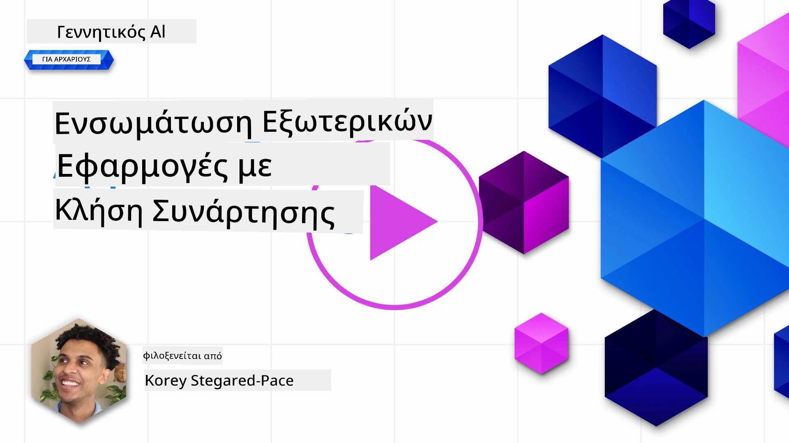
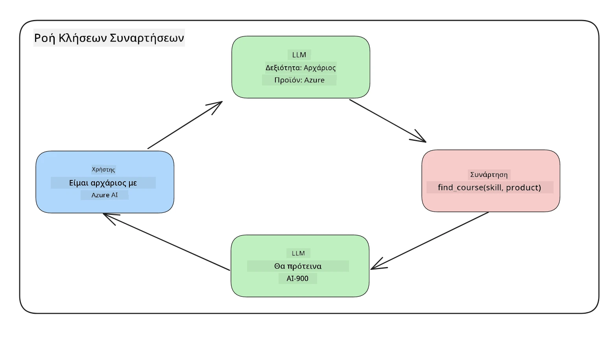
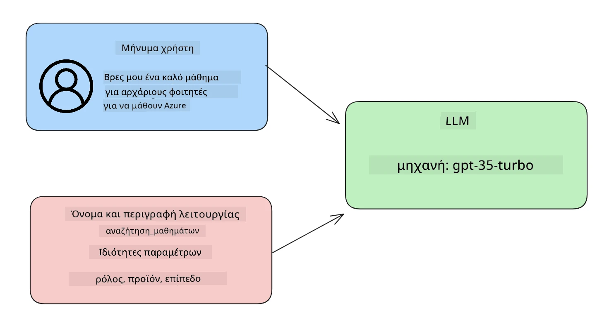

# Ενσωμάτωση με κλήση συναρτήσεων

[](https://youtu.be/DgUdCLX8qYQ?si=f1ouQU5HQx6F8Gl2)

Έχετε μάθει αρκετά μέχρι τώρα στα προηγούμενα μαθήματα. Ωστόσο, μπορούμε να βελτιωθούμε περαιτέρω. Μερικά από τα θέματα που μπορούμε να αντιμετωπίσουμε είναι πώς μπορούμε να έχουμε μια πιο συνεπή μορφή απάντησης, ώστε να είναι πιο εύκολο να δουλέψουμε με την απόκριση στη συνέχεια. Επίσης, ίσως θέλουμε να προσθέσουμε δεδομένα από άλλες πηγές για να εμπλουτίσουμε περαιτέρω την εφαρμογή μας.

Τα παραπάνω προβλήματα είναι αυτά που αυτή η ενότητα επιδιώκει να αντιμετωπίσει.

## Εισαγωγή

Αυτό το μάθημα θα καλύψει:

- Εξήγηση τι είναι η κλήση συναρτήσεων και τις περιπτώσεις χρήσης της.
- Δημιουργία κλήσης συνάρτησης χρησιμοποιώντας το Azure OpenAI.
- Πώς να ενσωματώσετε μια κλήση συνάρτησης σε μια εφαρμογή.

## Στόχοι μάθησης

Με το τέλος αυτού του μαθήματος, θα είστε σε θέση να:

- Εξηγείτε τον σκοπό της χρήσης κλήσης συναρτήσεων.
- Ρυθμίζετε λειτουργία Κλήσης Συνάρτησης χρησιμοποιώντας την Υπηρεσία Azure OpenAI.
- Σχεδιάζετε αποτελεσματικές κλήσεις συναρτήσεων για την περίπτωση χρήσης της εφαρμογής σας.

## Σενάριο: Βελτίωση του chatbot μας με συναρτήσεις

Για αυτό το μάθημα, θέλουμε να δημιουργήσουμε μια λειτουργία για το εκπαιδευτικό μας startup που επιτρέπει στους χρήστες να χρησιμοποιούν ένα chatbot για να βρουν τεχνικά μαθήματα. Θα προτείνουμε μαθήματα που ταιριάζουν στο επίπεδο δεξιοτήτων, τον τρέχοντα ρόλο και την τεχνολογία ενδιαφέροντός τους.

Για να ολοκληρώσουμε αυτό το σενάριο, θα χρησιμοποιήσουμε έναν συνδυασμό:

- `Azure OpenAI` για να δημιουργήσουμε μια εμπειρία συνομιλίας για τον χρήστη.
- `Microsoft Learn Catalog API` για να βοηθήσουμε τους χρήστες να βρουν μαθήματα βάσει του αιτήματός τους.
- `Function Calling` για να πάρουμε το ερώτημα του χρήστη και να το στείλουμε σε μια συνάρτηση για να κάνουμε το αίτημα API.

Για να ξεκινήσουμε, ας δούμε γιατί θα θέλαμε να χρησιμοποιήσουμε κλήση συναρτήσεων αρχικά:

## Γιατί Κλήση Συνάρτησης

Πριν από την κλήση συναρτήσεων, οι απαντήσεις από ένα LLM ήταν ασυμπλήρωτες και ασυνεπείς. Οι προγραμματιστές ήταν υποχρεωμένοι να γράψουν σύνθετο κώδικα επικύρωσης για να διασφαλίσουν ότι μπορούν να χειριστούν κάθε παραλλαγή μιας απάντησης. Οι χρήστες δεν μπορούσαν να πάρουν απαντήσεις όπως "Ποιος είναι ο τρέχων καιρός στη Στοκχόλμη;". Αυτό συμβαίνει επειδή τα μοντέλα ήταν περιορισμένα στην περίοδο για την οποία εκπαιδεύτηκαν τα δεδομένα.

Η Κλήση Συνάρτησης είναι μια λειτουργία της Υπηρεσίας Azure OpenAI για να ξεπεράσει τους ακόλουθους περιορισμούς:

- **Συνεπής μορφή απάντησης**. Αν μπορούμε να έχουμε καλύτερο έλεγχο της μορφής της απάντησης, μπορούμε πιο εύκολα να ενσωματώσουμε την απόκριση σε άλλα συστήματα στη συνέχεια.
- **Εξωτερικά δεδομένα**. Δυνατότητα χρήσης δεδομένων από άλλες πηγές μιας εφαρμογής σε ένα πλαίσιο συνομιλίας.

## Εικονογράφηση του προβλήματος μέσω ενός σεναρίου

> Σας προτείνουμε να χρησιμοποιήσετε το [συμπεριληφθέν notebook](./python/aoai-assignment.ipynb?WT.mc_id=academic-105485-koreyst) εάν θέλετε να εκτελέσετε το παρακάτω σενάριο. Μπορείτε επίσης απλά να διαβάσετε καθώς προσπαθούμε να εικονογραφήσουμε ένα πρόβλημα όπου οι συναρτήσεις μπορούν να βοηθήσουν στην επίλυση.

Ας δούμε το παράδειγμα που απεικονίζει το πρόβλημα μορφοποίησης της απόκρισης:

Ας υποθέσουμε ότι θέλουμε να δημιουργήσουμε μια βάση δεδομένων με στοιχεία φοιτητών ώστε να προτείνουμε το κατάλληλο μάθημα σε αυτούς. Παρακάτω έχουμε δύο περιγραφές φοιτητών που είναι πολύ παρόμοιες ως προς τα δεδομένα που περιέχουν.

1. Δημιουργία σύνδεσης με τον πόρο Azure OpenAI:

   ```python
   import os
   import json
   from openai import AzureOpenAI
   from dotenv import load_dotenv
   load_dotenv()

   client = AzureOpenAI(
   api_key=os.environ['AZURE_OPENAI_API_KEY'],  # αυτό είναι επίσης το προεπιλεγμένο, μπορεί να παραληφθεί
   api_version = "2023-07-01-preview"
   )

   deployment=os.environ['AZURE_OPENAI_DEPLOYMENT']
   ```

   Παρακάτω είναι κώδικας Python για τη ρύθμιση της σύνδεσης μας στο Azure OpenAI όπου ορίζουμε τα `api_type`, `api_base`, `api_version` και `api_key`.

1. Δημιουργία δύο περιγραφών φοιτητών χρησιμοποιώντας τις μεταβλητές `student_1_description` και `student_2_description`.

   ```python
   student_1_description="Emily Johnson is a sophomore majoring in computer science at Duke University. She has a 3.7 GPA. Emily is an active member of the university's Chess Club and Debate Team. She hopes to pursue a career in software engineering after graduating."

   student_2_description = "Michael Lee is a sophomore majoring in computer science at Stanford University. He has a 3.8 GPA. Michael is known for his programming skills and is an active member of the university's Robotics Club. He hopes to pursue a career in artificial intelligence after finishing his studies."
   ```

   Θέλουμε να στείλουμε τις παραπάνω περιγραφές φοιτητών σε ένα LLM για να αναλύσουμε τα δεδομένα. Αυτά τα δεδομένα μπορούν αργότερα να χρησιμοποιηθούν στην εφαρμογή μας και να σταλούν σε API ή να αποθηκευτούν σε βάση δεδομένων.

1. Ας δημιουργήσουμε δύο ίδιες προτροπές στις οποίες υποδεικνύουμε στο LLM ποια πληροφορία μας ενδιαφέρει:

   ```python
   prompt1 = f'''
   Please extract the following information from the given text and return it as a JSON object:

   name
   major
   school
   grades
   club

   This is the body of text to extract the information from:
   {student_1_description}
   '''

   prompt2 = f'''
   Please extract the following information from the given text and return it as a JSON object:

   name
   major
   school
   grades
   club

   This is the body of text to extract the information from:
   {student_2_description}
   '''
   ```

   Οι παραπάνω προτροπές ζητούν από το LLM να εξάγει πληροφορίες και να επιστρέψει την απάντηση σε μορφή JSON.

1. Μετά τη ρύθμιση των προτροπών και της σύνδεσης με το Azure OpenAI, θα στείλουμε τώρα τις προτροπές στο LLM χρησιμοποιώντας το `openai.ChatCompletion`. Αποθηκεύουμε την προτροπή στη μεταβλητή `messages` και θέτουμε το ρόλο σε `user`. Αυτό είναι για να μιμηθούμε ένα μήνυμα από χρήστη που γράφεται σε ένα chatbot.

   ```python
   # απάντηση από το ερώτημα ένα
   openai_response1 = client.chat.completions.create(
   model=deployment,
   messages = [{'role': 'user', 'content': prompt1}]
   )
   openai_response1.choices[0].message.content

   # απάντηση από το ερώτημα δύο
   openai_response2 = client.chat.completions.create(
   model=deployment,
   messages = [{'role': 'user', 'content': prompt2}]
   )
   openai_response2.choices[0].message.content
   ```

Τώρα μπορούμε να στείλουμε και τα δύο αιτήματα στο LLM και να εξετάσουμε την απάντηση που λαμβάνουμε βρίσκοντάς την έτσι `openai_response1['choices'][0]['message']['content']`.

1. Τέλος, μπορούμε να μετατρέψουμε την απάντηση σε μορφή JSON καλώντας το `json.loads`:

   ```python
   # Φόρτωση της απόκρισης ως αντικείμενο JSON
   json_response1 = json.loads(openai_response1.choices[0].message.content)
   json_response1
   ```

   Απάντηση 1:

   ```json
   {
     "name": "Emily Johnson",
     "major": "computer science",
     "school": "Duke University",
     "grades": "3.7",
     "club": "Chess Club"
   }
   ```

   Απάντηση 2:

   ```json
   {
     "name": "Michael Lee",
     "major": "computer science",
     "school": "Stanford University",
     "grades": "3.8 GPA",
     "club": "Robotics Club"
   }
   ```

   Παρόλο που οι προτροπές είναι οι ίδιες και οι περιγραφές παρόμοιες, βλέπουμε ότι οι τιμές της ιδιότητας `Grades` μορφοποιούνται διαφορετικά, καθώς κάποιες φορές λαμβάνουμε τη μορφή `3.7` ή `3.7 GPA` για παράδειγμα.

   Αυτό το αποτέλεσμα οφείλεται στο γεγονός ότι το LLM λαμβάνει μη δομημένα δεδομένα με τη μορφή της γραπτής προτροπής και επιστρέφει επίσης μη δομημένα δεδομένα. Χρειαζόμαστε μια δομημένη μορφή ώστε να ξέρουμε τι να περιμένουμε όταν αποθηκεύουμε ή χρησιμοποιούμε αυτά τα δεδομένα.

Πώς λοιπόν λύσουμε το πρόβλημα της μορφοποίησης; Με τη χρήση της κλήσης συναρτήσεων, μπορούμε να διασφαλίσουμε ότι λαμβάνουμε δομημένα δεδομένα πίσω. Όταν χρησιμοποιούμε κλήση συναρτήσεων, το LLM δεν καλεί ή εκτελεί πραγματικά καμία συνάρτηση. Αντίθετα, δημιουργούμε μια δομή για το LLM να ακολουθήσει στις απαντήσεις του. Στη συνέχεια, χρησιμοποιούμε αυτές τις δομημένες απαντήσεις για να ξέρουμε ποια συνάρτηση να εκτελέσουμε στις εφαρμογές μας.



Μπορούμε στη συνέχεια να πάρουμε αυτό που επιστρέφεται από τη συνάρτηση και να το στείλουμε πίσω στο LLM. Το LLM τότε θα ανταποκριθεί χρησιμοποιώντας φυσική γλώσσα για να απαντήσει στο ερώτημα του χρήστη.

## Περίπτωσεις χρήσης της κλήσης συναρτήσεων

Υπάρχουν πολλές διαφορετικές χρήσεις όπου η κλήση συναρτήσεων μπορεί να βελτιώσει την εφαρμογή σας, όπως:

- **Κλήση εξωτερικών εργαλείων**. Τα chatbots είναι εξαιρετικά στο να παρέχουν απαντήσεις σε ερωτήσεις χρηστών. Χρησιμοποιώντας κλήση συναρτήσεων, τα chatbots μπορούν να χρησιμοποιούν μηνύματα από χρήστες για να ολοκληρώσουν συγκεκριμένες εργασίες. Για παράδειγμα, ένας φοιτητής μπορεί να ζητήσει από το chatbot να "Στείλει ένα email στον εκπαιδευτή μου λέγοντας ότι χρειάζομαι περισσότερη βοήθεια με αυτό το θέμα". Αυτό μπορεί να προκαλέσει μια κλήση συνάρτησης `send_email(to: string, body: string)`.

- **Δημιουργία ερωτημάτων API ή βάσης δεδομένων**. Οι χρήστες μπορούν να βρουν πληροφορίες χρησιμοποιώντας φυσική γλώσσα που μετατρέπεται σε μια μορφοποιημένη ερώτηση ή αίτημα API. Ένα παράδειγμα θα ήταν ένας δάσκαλος που ζητάει "Ποιοι είναι οι φοιτητές που ολοκλήρωσαν την τελευταία εργασία;" που μπορεί να καλέσει μια συνάρτηση με όνομα `get_completed(student_name: string, assignment: int, current_status: string)`.

- **Δημιουργία δομημένων δεδομένων**. Οι χρήστες μπορούν να πάρουν ένα κομμάτι κειμένου ή CSV και να χρησιμοποιήσουν το LLM για να εξάγουν σημαντικές πληροφορίες από αυτό. Για παράδειγμα, ένας φοιτητής μπορεί να μετατρέψει ένα άρθρο της Wikipedia για συμφωνίες ειρήνης σε κάρτες μάθησης με τεχνητή νοημοσύνη. Αυτό μπορεί να γίνει χρησιμοποιώντας μια συνάρτηση που ονομάζεται `get_important_facts(agreement_name: string, date_signed: string, parties_involved: list)`.

## Δημιουργία της πρώτης σας κλήσης συνάρτησης

Η διαδικασία δημιουργίας μιας κλήσης συνάρτησης περιλαμβάνει 3 βασικά βήματα:

1. **Κλήση** του API Chat Completions με μια λίστα συναρτήσεων και ένα μήνυμα χρήστη.
2. **Ανάγνωση** της απάντησης του μοντέλου για εκτέλεση μιας ενέργειας, π.χ. εκτέλεση μιας συνάρτησης ή κλήση API.
3. **Κλήση** ξανά του API Chat Completions με την απόκριση από τη συνάρτηση, για να χρησιμοποιηθεί αυτή η πληροφορία στην απάντηση προς τον χρήστη.



### Βήμα 1 - δημιουργία μηνυμάτων

Το πρώτο βήμα είναι να δημιουργήσουμε ένα μήνυμα από χρήστη. Αυτό μπορεί να ανατεθεί δυναμικά λαμβάνοντας την τιμή από μια είσοδο κειμένου ή μπορείτε να ορίσετε εδώ μια τιμή. Αν είναι η πρώτη φορά που εργάζεστε με το API Chat Completions, πρέπει να ορίσουμε το `role` και το `content` του μηνύματος.

Το `role` μπορεί να είναι είτε `system` (δημιουργία κανόνων), `assistant` (το μοντέλο) ή `user` (ο τελικός χρήστης). Για την κλήση συναρτήσεων, θα το ορίσουμε ως `user` μαζί με ένα παράδειγμα ερώτησης.

```python
messages= [ {"role": "user", "content": "Find me a good course for a beginner student to learn Azure."} ]
```

Αναθέτοντας διαφορετικούς ρόλους, γίνεται σαφές στο LLM αν είναι το σύστημα που λέει κάτι ή ο χρήστης, κάτι που βοηθά να χτιστεί το ιστορικό της συνομιλίας που το LLM μπορεί να αξιοποιήσει.

### Βήμα 2 - δημιουργία συναρτήσεων

Στη συνέχεια, θα ορίσουμε μια συνάρτηση και τις παραμέτρους της. Θα χρησιμοποιήσουμε μόνο μία συνάρτηση εδώ που ονομάζεται `search_courses`, αλλά μπορείτε να δημιουργήσετε πολλές συναρτήσεις.

> **Σημαντικό** : Οι συναρτήσεις συμπεριλαμβάνονται στο μήνυμα συστήματος προς το LLM και θα συμπεριλαμβάνονται στο διαθέσιμο αριθμό tokens που έχετε.

Παρακάτω, δημιουργούμε τις συναρτήσεις ως πίνακα αντικειμένων. Κάθε στοιχείο είναι μια συνάρτηση και έχει τις ιδιότητες `name`, `description` και `parameters`:

```python
functions = [
   {
      "name":"search_courses",
      "description":"Retrieves courses from the search index based on the parameters provided",
      "parameters":{
         "type":"object",
         "properties":{
            "role":{
               "type":"string",
               "description":"The role of the learner (i.e. developer, data scientist, student, etc.)"
            },
            "product":{
               "type":"string",
               "description":"The product that the lesson is covering (i.e. Azure, Power BI, etc.)"
            },
            "level":{
               "type":"string",
               "description":"The level of experience the learner has prior to taking the course (i.e. beginner, intermediate, advanced)"
            }
         },
         "required":[
            "role"
         ]
      }
   }
]
```

Ας περιγράψουμε κάθε παράδειγμα συνάρτησης πιο αναλυτικά παρακάτω:

- `name` - Το όνομα της συνάρτησης που θέλουμε να κληθεί.
- `description` - Η περιγραφή του πώς λειτουργεί η συνάρτηση. Εδώ είναι σημαντικό να είμαστε συγκεκριμένοι και σαφείς.
- `parameters` - Μια λίστα τιμών και μορφής που θέλετε το μοντέλο να παράγει στην απόκρισή του. Ο πίνακας `parameters` αποτελείται από στοιχεία όπου κάθε στοιχείο έχει τις ακόλουθες ιδιότητες:
  1.  `type` - Ο τύπος δεδομένων που θα αποθηκευτούν οι ιδιότητες.
  1.  `properties` - Λίστα των συγκεκριμένων τιμών που το μοντέλο θα χρησιμοποιήσει στην απόκρισή του.
      1. `name` - Το κλειδί είναι το όνομα της ιδιότητας που το μοντέλο θα χρησιμοποιήσει στην μορφοποιημένη απάντησή του, π.χ. `product`.
      1. `type` - Ο τύπος δεδομένων αυτής της ιδιότητας, π.χ. `string`.
      1. `description` - Περιγραφή της συγκεκριμένης ιδιότητας.

Υπάρχει επίσης μια προαιρετική ιδιότητα `required` - απαιτούμενη ιδιότητα για να ολοκληρωθεί η κλήση συνάρτησης.

### Βήμα 3 - Εκτέλεση της κλήσης συνάρτησης

Αφού ορίσουμε μια συνάρτηση, τώρα πρέπει να την συμπεριλάβουμε στην κλήση προς το API Chat Completion. Το κάνουμε προσθέτοντας το `functions` στο αίτημα. Σε αυτή την περίπτωση, `functions=functions`.

Υπάρχει επίσης η επιλογή να ορίσουμε το `function_call` σε `auto`. Αυτό σημαίνει ότι αφήνουμε το LLM να αποφασίσει ποια συνάρτηση πρέπει να κληθεί με βάση το μήνυμα του χρήστη, αντί να την ορίσουμε εμείς.

Ακολουθεί κώδικας όπου καλούμε το `ChatCompletion.create`, σημειώστε πώς ορίζουμε `functions=functions` και `function_call="auto"` δίνοντας έτσι τη δυνατότητα στο LLM να επιλέξει πότε να καλέσει τις συναρτήσεις που παρέχουμε:

```python
response = client.chat.completions.create(model=deployment,
                                        messages=messages,
                                        functions=functions,
                                        function_call="auto")

print(response.choices[0].message)
```

Η απάντηση που επιστρέφει τώρα μοιάζει ως εξής:

```json
{
  "role": "assistant",
  "function_call": {
    "name": "search_courses",
    "arguments": "{\n  \"role\": \"student\",\n  \"product\": \"Azure\",\n  \"level\": \"beginner\"\n}"
  }
}
```

Εδώ βλέπουμε πώς η συνάρτηση `search_courses` κλήθηκε και με ποια επιχειρήματα, όπως φαίνεται στην ιδιότητα `arguments` στην απόκριση JSON.

Το συμπέρασμα είναι ότι το LLM μπόρεσε να βρει τα δεδομένα που ταιριάζουν στα επιχειρήματα της συνάρτησης καθώς τα εξήγαγε από την τιμή που δόθηκε στη μεταβλητή `messages` στην κλήση της συνομιλίας. Παρακάτω υπάρχει μια υπενθύμιση της τιμής των `messages`:

```python
messages= [ {"role": "user", "content": "Find me a good course for a beginner student to learn Azure."} ]
```

Όπως βλέπετε, `student`, `Azure` και `beginner` εξήχθησαν από τα `messages` και χρησιμοποιήθηκαν ως είσοδος στη συνάρτηση. Η χρήση συναρτήσεων με αυτόν τον τρόπο είναι ένας εξαιρετικός τρόπος για να εξαγάγετε πληροφορίες από μια προτροπή αλλά και να παρέχετε δομή στο LLM και να έχετε επαναχρησιμοποιήσιμη λειτουργικότητα.

Στη συνέχεια, πρέπει να δούμε πώς μπορούμε να το χρησιμοποιήσουμε στην εφαρμογή μας.

## Ενσωμάτωση Κλήσεων Συνάρτησης σε μια Εφαρμογή

Αφού δοκιμάσουμε τη μορφοποιημένη απόκριση από το LLM, μπορούμε τώρα να το ενσωματώσουμε σε μια εφαρμογή.

### Διαχείριση ροής

Για να το ενσωματώσουμε στην εφαρμογή μας, ας ακολουθήσουμε τα παρακάτω βήματα:

1. Πρώτα, ας κάνουμε την κλήση στις υπηρεσίες OpenAI και να αποθηκεύσουμε το μήνυμα σε μια μεταβλητή που ονομάζεται `response_message`.

   ```python
   response_message = response.choices[0].message
   ```

1. Τώρα, θα ορίσουμε τη συνάρτηση που θα καλέσει το Microsoft Learn API για να πάρει μια λίστα με μαθήματα:

   ```python
   import requests

   def search_courses(role, product, level):
     url = "https://learn.microsoft.com/api/catalog/"
     params = {
        "role": role,
        "product": product,
        "level": level
     }
     response = requests.get(url, params=params)
     modules = response.json()["modules"]
     results = []
     for module in modules[:5]:
        title = module["title"]
        url = module["url"]
        results.append({"title": title, "url": url})
     return str(results)
   ```

   Σημειώστε πώς τώρα δημιουργούμε μια πραγματική λειτουργική συνάρτηση Python που αντιστοιχεί στα ονόματα συναρτήσεων που εισάγουμε στη μεταβλητή `functions`. Κάνουμε επίσης πραγματικές εξωτερικές κλήσεις API για να πάρουμε τα δεδομένα που χρειαζόμαστε. Σε αυτή την περίπτωση, πηγαίνουμε εναντίον του Microsoft Learn API για αναζήτηση εκπαιδευτικών μονάδων.

Εντάξει, δημιουργήσαμε τη μεταβλητή `functions` και μια αντίστοιχη συνάρτηση Python, πώς λέμε στο LLM πώς να τις αντιστοιχίσει ώστε να καλέσει τη δική μας Python συνάρτηση;

1. Για να δούμε αν πρέπει να καλέσουμε μια Python συνάρτηση, πρέπει να κοιτάξουμε στην απόκριση του LLM αν η `function_call` είναι μέρος αυτής και να καλέσουμε τη συγκεκριμένη συνάρτηση. Εδώ είναι πώς μπορείτε να κάνετε τον παραπάνω έλεγχο:

   ```python
   # Ελέγξτε αν το μοντέλο θέλει να καλέσει μια λειτουργία
   if response_message.function_call.name:
    print("Recommended Function call:")
    print(response_message.function_call.name)
    print()

    # Καλέστε τη λειτουργία.
    function_name = response_message.function_call.name

    available_functions = {
            "search_courses": search_courses,
    }
    function_to_call = available_functions[function_name]

    function_args = json.loads(response_message.function_call.arguments)
    function_response = function_to_call(**function_args)

    print("Output of function call:")
    print(function_response)
    print(type(function_response))


    # Προσθέστε την απάντηση του βοηθού και την απάντηση της λειτουργίας στα μηνύματα
    messages.append( # προσθέτοντας την απάντηση του βοηθού στα μηνύματα
        {
            "role": response_message.role,
            "function_call": {
                "name": function_name,
                "arguments": response_message.function_call.arguments,
            },
            "content": None
        }
    )
    messages.append( # προσθέτοντας την απάντηση της λειτουργίας στα μηνύματα
        {
            "role": "function",
            "name": function_name,
            "content":function_response,
        }
    )
   ```

   Αυτές οι τρεις γραμμές διασφαλίζουν ότι εξάγουμε το όνομα της συνάρτησης, τα επιχειρήματα και κάνουμε την κλήση:

   ```python
   function_to_call = available_functions[function_name]

   function_args = json.loads(response_message.function_call.arguments)
   function_response = function_to_call(**function_args)
   ```

   Παρακάτω είναι το αποτέλεσμα από την εκτέλεση του κώδικά μας:

   **Έξοδος**

   ```Recommended Function call:
   {
     "name": "search_courses",
     "arguments": "{\n  \"role\": \"student\",\n  \"product\": \"Azure\",\n  \"level\": \"beginner\"\n}"
   }

   Output of function call:
   [{'title': 'Describe concepts of cryptography', 'url': 'https://learn.microsoft.com/training/modules/describe-concepts-of-cryptography/?
   WT.mc_id=api_CatalogApi'}, {'title': 'Introduction to audio classification with TensorFlow', 'url': 'https://learn.microsoft.com/en-
   us/training/modules/intro-audio-classification-tensorflow/?WT.mc_id=api_CatalogApi'}, {'title': 'Design a Performant Data Model in Azure SQL
   Database with Azure Data Studio', 'url': 'https://learn.microsoft.com/training/modules/design-a-data-model-with-ads/?
   WT.mc_id=api_CatalogApi'}, {'title': 'Getting started with the Microsoft Cloud Adoption Framework for Azure', 'url':
   'https://learn.microsoft.com/training/modules/cloud-adoption-framework-getting-started/?WT.mc_id=api_CatalogApi'}, {'title': 'Set up the
   Rust development environment', 'url': 'https://learn.microsoft.com/training/modules/rust-set-up-environment/?WT.mc_id=api_CatalogApi'}]
   <class 'str'>
   ```

1. Τώρα θα στείλουμε το ενημερωμένο μήνυμα, `messages`, στο LLM ώστε να λάβουμε μια απάντηση σε φυσική γλώσσα αντί για μια μορφοποιημένη απόκριση JSON API.

   ```python
   print("Messages in next request:")
   print(messages)
   print()

   second_response = client.chat.completions.create(
      messages=messages,
      model=deployment,
      function_call="auto",
      functions=functions,
      temperature=0
         )  # πάρε μια νέα απάντηση από το GPT όπου μπορεί να δει την απόκριση της λειτουργίας


   print(second_response.choices[0].message)
   ```

   **Έξοδος**

   ```python
   {
     "role": "assistant",
     "content": "I found some good courses for beginner students to learn Azure:\n\n1. [Describe concepts of cryptography] (https://learn.microsoft.com/training/modules/describe-concepts-of-cryptography/?WT.mc_id=api_CatalogApi)\n2. [Introduction to audio classification with TensorFlow](https://learn.microsoft.com/training/modules/intro-audio-classification-tensorflow/?WT.mc_id=api_CatalogApi)\n3. [Design a Performant Data Model in Azure SQL Database with Azure Data Studio](https://learn.microsoft.com/training/modules/design-a-data-model-with-ads/?WT.mc_id=api_CatalogApi)\n4. [Getting started with the Microsoft Cloud Adoption Framework for Azure](https://learn.microsoft.com/training/modules/cloud-adoption-framework-getting-started/?WT.mc_id=api_CatalogApi)\n5. [Set up the Rust development environment](https://learn.microsoft.com/training/modules/rust-set-up-environment/?WT.mc_id=api_CatalogApi)\n\nYou can click on the links to access the courses."
   }

   ```

## Ασκήσεις

Για να συνεχίσετε την εκμάθηση της κλήσης συναρτήσεων Azure OpenAI μπορείτε να κατασκευάσετε:

- Περισσότερες παραμέτρους της συνάρτησης που μπορεί να βοηθήσουν τους μαθητές να βρουν περισσότερα μαθήματα.
- Δημιουργήστε μια άλλη κλήση συνάρτησης που λαμβάνει περισσότερες πληροφορίες από τον μαθητή, όπως η μητρική του γλώσσα.
- Δημιουργήστε χειρισμό σφαλμάτων όταν η κλήση συνάρτησης και/ή η κλήση API δεν επιστρέφουν κατάλληλα μαθήματα.
Υπόδειξη: Ακολουθήστε τη σελίδα [Learn API reference documentation](https://learn.microsoft.com/training/support/catalog-api-developer-reference?WT.mc_id=academic-105485-koreyst) για να δείτε πώς και πού είναι διαθέσιμα αυτά τα δεδομένα.

## Υπέροχη δουλειά! Συνεχίστε το ταξίδι

Μετά την ολοκλήρωση αυτού του μαθήματος, ελέγξτε τη [συλλογή Μάθησης Γενετικής AI](https://aka.ms/genai-collection?WT.mc_id=academic-105485-koreyst) για να συνεχίσετε να βελτιώνετε τις γνώσεις σας στη Γενετική AI!

Κατευθυνθείτε στο Μάθημα 12, όπου θα δούμε πώς να [σχεδιάζουμε UX για εφαρμογές AI](../12-designing-ux-for-ai-applications/README.md?WT.mc_id=academic-105485-koreyst)!

---

<!-- CO-OP TRANSLATOR DISCLAIMER START -->
**Αποποίηση ευθυνών**:
Αυτό το έγγραφο έχει μεταφραστεί χρησιμοποιώντας την υπηρεσία μετάφρασης με τεχνητή νοημοσύνη [Co-op Translator](https://github.com/Azure/co-op-translator). Ενώ επιδιώκουμε την ακρίβεια, παρακαλούμε να έχετε υπόψη ότι οι αυτοματοποιημένες μεταφράσεις ενδέχεται να περιέχουν λάθη ή ανακρίβειες. Το πρωτότυπο έγγραφο στη μητρική του γλώσσα πρέπει να θεωρείται η αυθεντική πηγή. Για κρίσιμες πληροφορίες, συνιστάται επαγγελματική ανθρώπινη μετάφραση. Δεν φέρουμε ευθύνη για τυχόν παρεξηγήσεις ή λανθασμένες ερμηνείες που προκύπτουν από τη χρήση αυτής της μετάφρασης.
<!-- CO-OP TRANSLATOR DISCLAIMER END -->