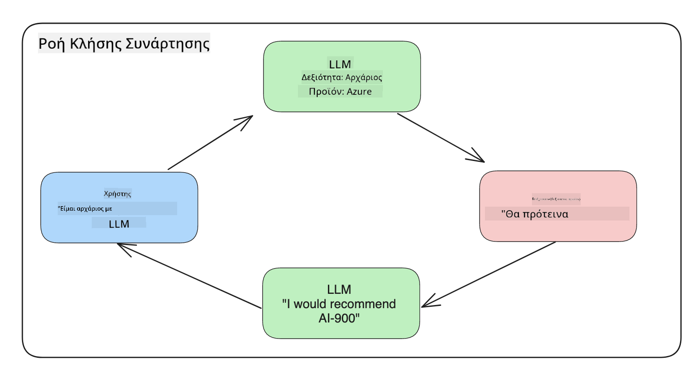

<!--
CO_OP_TRANSLATOR_METADATA:
{
  "original_hash": "f6f84f9ef2d066cd25850cab93580a50",
  "translation_date": "2025-10-17T18:18:29+00:00",
  "source_file": "11-integrating-with-function-calling/README.md",
  "language_code": "el"
}
-->
# Ενσωμάτωση με κλήση λειτουργιών

[](https://youtu.be/DgUdCLX8qYQ?si=f1ouQU5HQx6F8Gl2)

Έχετε μάθει αρκετά μέχρι τώρα στα προηγούμενα μαθήματα. Ωστόσο, μπορούμε να βελτιωθούμε περαιτέρω. Κάποια θέματα που μπορούμε να αντιμετωπίσουμε είναι πώς να έχουμε μια πιο συνεπή μορφή απάντησης για να διευκολύνουμε τη χρήση της απάντησης σε επόμενα στάδια. Επίσης, ίσως θέλουμε να προσθέσουμε δεδομένα από άλλες πηγές για να εμπλουτίσουμε περαιτέρω την εφαρμογή μας.

Τα παραπάνω προβλήματα είναι αυτά που αυτό το κεφάλαιο επιδιώκει να αντιμετωπίσει.

## Εισαγωγή

Αυτό το μάθημα θα καλύψει:

- Εξήγηση του τι είναι η κλήση λειτουργιών και οι περιπτώσεις χρήσης της.
- Δημιουργία κλήσης λειτουργίας χρησιμοποιώντας το Azure OpenAI.
- Πώς να ενσωματώσετε μια κλήση λειτουργίας σε μια εφαρμογή.

## Στόχοι Μάθησης

Μέχρι το τέλος αυτού του μαθήματος, θα μπορείτε να:

- Εξηγήσετε τον σκοπό της χρήσης της κλήσης λειτουργιών.
- Ρυθμίσετε την Κλήση Λειτουργίας χρησιμοποιώντας την υπηρεσία Azure OpenAI.
- Σχεδιάσετε αποτελεσματικές κλήσεις λειτουργιών για την περίπτωση χρήσης της εφαρμογής σας.

## Σενάριο: Βελτίωση του chatbot μας με λειτουργίες

Για αυτό το μάθημα, θέλουμε να δημιουργήσουμε μια δυνατότητα για την εκπαιδευτική μας startup που επιτρέπει στους χρήστες να χρησιμοποιούν ένα chatbot για να βρουν τεχνικά μαθήματα. Θα προτείνουμε μαθήματα που ταιριάζουν στο επίπεδο δεξιοτήτων τους, τον τρέχοντα ρόλο τους και την τεχνολογία που τους ενδιαφέρει.

Για να ολοκληρώσουμε αυτό το σενάριο, θα χρησιμοποιήσουμε έναν συνδυασμό από:

- `Azure OpenAI` για να δημιουργήσουμε μια εμπειρία συνομιλίας για τον χρήστη.
- `Microsoft Learn Catalog API` για να βοηθήσουμε τους χρήστες να βρουν μαθήματα βάσει του αιτήματός τους.
- `Κλήση Λειτουργιών` για να πάρουμε το ερώτημα του χρήστη και να το στείλουμε σε μια λειτουργία για να γίνει το αίτημα API.

Για να ξεκινήσουμε, ας δούμε γιατί θα θέλαμε να χρησιμοποιήσουμε την κλήση λειτουργιών εξαρχής:

## Γιατί Κλήση Λειτουργιών

Πριν από την κλήση λειτουργιών, οι απαντήσεις από ένα LLM ήταν μη δομημένες και ασυνεπείς. Οι προγραμματιστές έπρεπε να γράψουν πολύπλοκο κώδικα επαλήθευσης για να βεβαιωθούν ότι μπορούσαν να χειριστούν κάθε παραλλαγή μιας απάντησης. Οι χρήστες δεν μπορούσαν να λάβουν απαντήσεις όπως "Ποιος είναι ο τρέχων καιρός στη Στοκχόλμη;". Αυτό συμβαίνει επειδή τα μοντέλα περιορίζονταν στον χρόνο που είχαν εκπαιδευτεί τα δεδομένα.

Η Κλήση Λειτουργιών είναι μια δυνατότητα της υπηρεσίας Azure OpenAI για να ξεπεράσει τους εξής περιορισμούς:

- **Συνεπής μορφή απάντησης**. Αν μπορούμε να ελέγξουμε καλύτερα τη μορφή της απάντησης, μπορούμε πιο εύκολα να την ενσωματώσουμε σε άλλα συστήματα.
- **Εξωτερικά δεδομένα**. Δυνατότητα χρήσης δεδομένων από άλλες πηγές μιας εφαρμογής σε ένα πλαίσιο συνομιλίας.

## Εικονογράφηση του προβλήματος μέσω ενός σεναρίου

> Σας προτείνουμε να χρησιμοποιήσετε το [συμπεριλαμβανόμενο notebook](./python/aoai-assignment.ipynb?WT.mc_id=academic-105485-koreyst) αν θέλετε να εκτελέσετε το παρακάτω σενάριο. Μπορείτε επίσης απλά να διαβάσετε καθώς προσπαθούμε να εικονογραφήσουμε ένα πρόβλημα όπου οι λειτουργίες μπορούν να βοηθήσουν στην επίλυσή του.

Ας δούμε το παράδειγμα που εικονογραφεί το πρόβλημα της μορφής απάντησης:

Ας πούμε ότι θέλουμε να δημιουργήσουμε μια βάση δεδομένων με δεδομένα μαθητών ώστε να μπορούμε να τους προτείνουμε το κατάλληλο μάθημα. Παρακάτω έχουμε δύο περιγραφές μαθητών που είναι πολύ παρόμοιες στα δεδομένα που περιέχουν.

1. Δημιουργήστε μια σύνδεση με τον πόρο Azure OpenAI μας:

   ```python
   import os
   import json
   from openai import AzureOpenAI
   from dotenv import load_dotenv
   load_dotenv()

   client = AzureOpenAI(
   api_key=os.environ['AZURE_OPENAI_API_KEY'],  # this is also the default, it can be omitted
   api_version = "2023-07-01-preview"
   )

   deployment=os.environ['AZURE_OPENAI_DEPLOYMENT']
   ```

   Παρακάτω είναι κάποιος κώδικας Python για τη διαμόρφωση της σύνδεσής μας με το Azure OpenAI όπου ορίζουμε `api_type`, `api_base`, `api_version` και `api_key`.

1. Δημιουργία δύο περιγραφών μαθητών χρησιμοποιώντας μεταβλητές `student_1_description` και `student_2_description`.

   ```python
   student_1_description="Emily Johnson is a sophomore majoring in computer science at Duke University. She has a 3.7 GPA. Emily is an active member of the university's Chess Club and Debate Team. She hopes to pursue a career in software engineering after graduating."

   student_2_description = "Michael Lee is a sophomore majoring in computer science at Stanford University. He has a 3.8 GPA. Michael is known for his programming skills and is an active member of the university's Robotics Club. He hopes to pursue a career in artificial intelligence after finishing his studies."
   ```

   Θέλουμε να στείλουμε τις παραπάνω περιγραφές μαθητών σε ένα LLM για να αναλύσουμε τα δεδομένα. Αυτά τα δεδομένα μπορούν αργότερα να χρησιμοποιηθούν στην εφαρμογή μας και να σταλούν σε ένα API ή να αποθηκευτούν σε μια βάση δεδομένων.

1. Ας δημιουργήσουμε δύο πανομοιότυπα prompts στα οποία δίνουμε οδηγίες στο LLM για τις πληροφορίες που μας ενδιαφέρουν:

   ```python
   prompt1 = f'''
   Please extract the following information from the given text and return it as a JSON object:

   name
   major
   school
   grades
   club

   This is the body of text to extract the information from:
   {student_1_description}
   '''

   prompt2 = f'''
   Please extract the following information from the given text and return it as a JSON object:

   name
   major
   school
   grades
   club

   This is the body of text to extract the information from:
   {student_2_description}
   '''
   ```

   Τα παραπάνω prompts δίνουν οδηγίες στο LLM να εξάγει πληροφορίες και να επιστρέψει την απάντηση σε μορφή JSON.

1. Αφού ρυθμίσουμε τα prompts και τη σύνδεση με το Azure OpenAI, τώρα θα στείλουμε τα prompts στο LLM χρησιμοποιώντας `openai.ChatCompletion`. Αποθηκεύουμε το prompt στη μεταβλητή `messages` και αναθέτουμε τον ρόλο `user`. Αυτό γίνεται για να μιμηθούμε ένα μήνυμα από έναν χρήστη που γράφεται σε ένα chatbot.

   ```python
   # response from prompt one
   openai_response1 = client.chat.completions.create(
   model=deployment,
   messages = [{'role': 'user', 'content': prompt1}]
   )
   openai_response1.choices[0].message.content

   # response from prompt two
   openai_response2 = client.chat.completions.create(
   model=deployment,
   messages = [{'role': 'user', 'content': prompt2}]
   )
   openai_response2.choices[0].message.content
   ```

Τώρα μπορούμε να στείλουμε και τα δύο αιτήματα στο LLM και να εξετάσουμε την απάντηση που λαμβάνουμε βρίσκοντάς την όπως `openai_response1['choices'][0]['message']['content']`.

1. Τέλος, μπορούμε να μετατρέψουμε την απάντηση σε μορφή JSON καλώντας `json.loads`:

   ```python
   # Loading the response as a JSON object
   json_response1 = json.loads(openai_response1.choices[0].message.content)
   json_response1
   ```

   Απάντηση 1:

   ```json
   {
     "name": "Emily Johnson",
     "major": "computer science",
     "school": "Duke University",
     "grades": "3.7",
     "club": "Chess Club"
   }
   ```

   Απάντηση 2:

   ```json
   {
     "name": "Michael Lee",
     "major": "computer science",
     "school": "Stanford University",
     "grades": "3.8 GPA",
     "club": "Robotics Club"
   }
   ```

   Παρόλο που τα prompts είναι ίδια και οι περιγραφές είναι παρόμοιες, βλέπουμε τιμές της ιδιότητας `Grades` να μορφοποιούνται διαφορετικά, καθώς μπορούμε να έχουμε τη μορφή `3.7` ή `3.7 GPA` για παράδειγμα.

   Αυτό το αποτέλεσμα οφείλεται στο γεγονός ότι το LLM λαμβάνει μη δομημένα δεδομένα με τη μορφή του γραπτού prompt και επιστρέφει επίσης μη δομημένα δεδομένα. Χρειαζόμαστε μια δομημένη μορφή ώστε να ξέρουμε τι να περιμένουμε όταν αποθηκεύουμε ή χρησιμοποιούμε αυτά τα δεδομένα.

Πώς λοιπόν λύνουμε το πρόβλημα της μορφοποίησης; Χρησιμοποιώντας την κλήση λειτουργιών, μπορούμε να βεβαιωθούμε ότι λαμβάνουμε δομημένα δεδομένα πίσω. Όταν χρησιμοποιούμε την κλήση λειτουργιών, το LLM δεν καλεί ή εκτελεί πραγματικά καμία λειτουργία. Αντίθετα, δημιουργούμε μια δομή για το LLM να ακολουθήσει για τις απαντήσεις του. Στη συνέχεια, χρησιμοποιούμε αυτές τις δομημένες απαντήσεις για να ξέρουμε ποια λειτουργία να εκτελέσουμε στις εφαρμογές μας.



Μπορούμε στη συνέχεια να πάρουμε αυτό που επιστρέφεται από τη λειτουργία και να το στείλουμε πίσω στο LLM. Το LLM θα απαντήσει στη συνέχεια χρησιμοποιώντας φυσική γλώσσα για να απαντήσει στο ερώτημα του χρήστη.

## Περιπτώσεις Χρήσης για τη χρήση κλήσεων λειτουργιών

Υπάρχουν πολλές διαφορετικές περιπτώσεις χρήσης όπου οι κλήσεις λειτουργιών μπορούν να βελτιώσουν την εφαρμογή σας όπως:

- **Κλήση Εξωτερικών Εργαλείων**. Τα chatbots είναι εξαιρετικά στο να παρέχουν απαντήσεις σε ερωτήσεις από χρήστες. Χρησιμοποιώντας την κλήση λειτουργιών, τα chatbots μπορούν να χρησιμοποιούν μηνύματα από χρήστες για να ολοκληρώνουν συγκεκριμένες εργασίες. Για παράδειγμα, ένας μαθητής μπορεί να ζητήσει από το chatbot να "Στείλει ένα email στον καθηγητή μου λέγοντας ότι χρειάζομαι περισσότερη βοήθεια με αυτό το θέμα". Αυτό μπορεί να κάνει μια κλήση λειτουργίας στο `send_email(to: string, body: string)`.

- **Δημιουργία Ερωτημάτων API ή Βάσης Δεδομένων**. Οι χρήστες μπορούν να βρουν πληροφορίες χρησιμοποιώντας φυσική γλώσσα που μετατρέπεται σε μορφοποιημένο ερώτημα ή αίτημα API. Ένα παράδειγμα αυτού θα μπορούσε να είναι ένας καθηγητής που ζητά "Ποιοι είναι οι μαθητές που ολοκλήρωσαν την τελευταία εργασία" που θα μπορούσε να καλέσει μια λειτουργία με όνομα `get_completed(student_name: string, assignment: int, current_status: string)`.

- **Δημιουργία Δομημένων Δεδομένων**. Οι χρήστες μπορούν να πάρουν ένα μπλοκ κειμένου ή CSV και να χρησιμοποιήσουν το LLM για να εξάγουν σημαντικές πληροφορίες από αυτό. Για παράδειγμα, ένας μαθητής μπορεί να μετατρέψει ένα άρθρο της Wikipedia για συμφωνίες ειρήνης για να δημιουργήσει AI flashcards. Αυτό μπορεί να γίνει χρησιμοποιώντας μια λειτουργία που ονομάζεται `get_important_facts(agreement_name: string, date_signed: string, parties_involved: list)`.

## Δημιουργία της Πρώτης Κλήσης Λειτουργίας σας

Η διαδικασία δημιουργίας μιας κλήσης λειτουργίας περιλαμβάνει 3 βασικά βήματα:

1. **Κλήση** του API Συμπληρώσεων Συνομιλίας με μια λίστα των λειτουργιών σας και ένα μήνυμα χρήστη.
2. **Ανάγνωση** της απάντησης του μοντέλου για να εκτελέσετε μια ενέργεια, π.χ. εκτέλεση μιας λειτουργίας ή κλήση API.
3. **Δημιουργία** μιας άλλης κλήσης στο API Συμπληρώσεων Συνομιλίας με την απάντηση από τη λειτουργία σας για να χρησιμοποιήσετε αυτές τις πληροφορίες για να δημιουργήσετε μια απάντηση στον χρήστη.


### Βήμα 1 - δημιουργία μηνυμάτων

Το πρώτο βήμα είναι να δημιουργήσετε ένα μήνυμα χρήστη. Αυτό μπορεί να ανατεθεί δυναμικά λαμβάνοντας την τιμή μιας εισόδου κειμένου ή μπορείτε να αναθέσετε μια τιμή εδώ. Αν είναι η πρώτη σας φορά που εργάζεστε με το API Συμπληρώσεων Συνομιλίας, πρέπει να ορίσουμε τον `ρόλο` και το `περιεχόμενο` του μηνύματος.

Ο `ρόλος` μπορεί να είναι είτε `system` (δημιουργία κανόνων), `assistant` (το μοντέλο) ή `user` (ο τελικός χρήστης). Για την κλήση λειτουργιών, θα το αναθέσουμε ως `user` και ένα παράδειγμα ερώτησης.

```python
messages= [ {"role": "user", "content": "Find me a good course for a beginner student to learn Azure."} ]
```

Αναθέτοντας διαφορετικούς ρόλους, γίνεται σαφές στο LLM αν είναι το σύστημα που λέει κάτι ή ο χρήστης, κάτι που βοηθά στη δημιουργία ιστορικού συνομιλίας που το LLM μπορεί να βασιστεί.

### Βήμα 2 - δημιουργία λειτουργιών

Στη συνέχεια, θα ορίσουμε μια λειτουργία και τις παραμέτρους αυτής της λειτουργίας. Θα χρησιμοποιήσουμε μόνο μία λειτουργία εδώ που ονομάζεται `search_courses`, αλλά μπορείτε να δημιουργήσετε πολλαπλές λειτουργίες.

> **Σημαντικό**: Οι λειτουργίες περιλαμβάνονται στο μήνυμα συστήματος προς το LLM και θα περιλαμβάνονται στον αριθμό διαθέσιμων tokens που έχετε.

Παρακάτω, δημιουργούμε τις λειτουργίες ως έναν πίνακα αντικειμένων. Κάθε αντικείμενο είναι μια λειτουργία και έχει ιδιότητες `name`, `description` και `parameters`:

```python
functions = [
   {
      "name":"search_courses",
      "description":"Retrieves courses from the search index based on the parameters provided",
      "parameters":{
         "type":"object",
         "properties":{
            "role":{
               "type":"string",
               "description":"The role of the learner (i.e. developer, data scientist, student, etc.)"
            },
            "product":{
               "type":"string",
               "description":"The product that the lesson is covering (i.e. Azure, Power BI, etc.)"
            },
            "level":{
               "type":"string",
               "description":"The level of experience the learner has prior to taking the course (i.e. beginner, intermediate, advanced)"
            }
         },
         "required":[
            "role"
         ]
      }
   }
]
```

Ας περιγράψουμε κάθε περίπτωση λειτουργίας πιο αναλυτικά παρακάτω:

- `name` - Το όνομα της λειτουργίας που θέλουμε να καλέσουμε.
- `description` - Αυτή είναι η περιγραφή του πώς λειτουργεί η λειτουργία. Εδώ είναι σημαντικό να είστε συγκεκριμένοι και σαφείς.
- `parameters` - Μια λίστα τιμών και μορφής που θέλετε το μοντέλο να παράγει στην απάντησή του. Ο πίνακας παραμέτρων αποτελείται από αντικείμενα όπου τα αντικείμενα έχουν τις εξής ιδιότητες:
  1.  `type` - Ο τύπος δεδομένων που θα αποθηκευτούν οι ιδιότητες.
  1.  `properties` - Λίστα των συγκεκριμένων τιμών που το μοντέλο θα χρησιμοποιήσει για την απάντησή του.
      1. `name` - Το κλειδί είναι το όνομα της ιδιότητας που το μοντέλο θα χρησιμοποιήσει στη μορφοποιημένη απάντησή του, για παράδειγμα, `product`.
      1. `type` - Ο τύπος δεδομένων αυτής της ιδιότητας, για παράδειγμα, `string`.
      1. `description` - Περιγραφή της συγκεκριμένης ιδιότητας.

Υπάρχει επίσης μια προαιρετική ιδιότητα `required` - απαραίτητη ιδιότητα για να ολοκληρωθεί η κλήση λειτουργίας.

### Βήμα 3 - Δημιουργία της κλήσης λειτουργίας

Αφού ορίσουμε μια λειτουργία, τώρα πρέπει να την συμπεριλάβουμε στην κλήση προς το API Συμπληρώσεων Συνομιλίας. Το κάνουμε αυτό προσθέτοντας `functions` στο αίτημα. Σε αυτή την περίπτωση `functions=functions`.

Υπάρχει επίσης μια επιλογή να ορίσουμε το `function_call` σε `auto`. Αυτό σημαίνει ότι θα αφήσουμε το LLM να αποφασίσει ποια λειτουργία πρέπει να καλεστεί βάσει του μηνύματος χρήστη αντί να την αναθέσουμε εμείς.

Ακολουθεί κάποιος κώδικας παρακάτω όπου καλούμε το `ChatCompletion.create`, σημειώστε πώς ορίζουμε `functions=functions` και `function_call="auto"` και έτσι δίνουμε στο LLM την επιλογή πότε να καλέσει τις λειτουργίες που του παρέχουμε:

```python
response = client.chat.completions.create(model=deployment,
                                        messages=messages,
                                        functions=functions,
                                        function_call="auto")

print(response.choices[0].message)
```

Η απάντηση που επιστρέφεται τώρα μοιάζει με την εξής:

```json
{
  "role": "assistant",
  "function_call": {
    "name": "search_courses",
    "arguments": "{\n  \"role\": \"student\",\n  \"product\": \"Azure\",\n  \"level\": \"beginner\"\n}"
  }
}
```

Εδώ μπορούμε να δούμε πώς η λειτουργία `search_courses` καλέστηκε και με ποια επιχειρήματα, όπως αναφέρονται στην ιδιότητα `arguments` στην απάντηση JSON.

Το συμπέρασμα είναι ότι το LLM ήταν σε θέση να βρει τα δεδομένα για να ταιριάξει τα επιχειρήματα της λειτουργίας καθώς τα εξήγαγε από την τιμή που παρέχεται στην παράμετρο `messages` στην κλήση συμπλήρωσης συνομιλίας. Παρακάτω είναι μια υπενθύμιση της τιμής `messages`:

```python
messages= [ {"role": "user", "content": "Find me a good course for a beginner student to learn Azure."} ]
```

Όπως μπορείτε να δείτε, το `student`, το `Azure` και το `beginner` εξήχθησαν από το `messages` και ορίστηκαν ως είσοδος στη λειτουργία. Χρησιμοποιώντας λειτουργίες με αυτόν τον τρόπο είναι ένας εξαιρετικός τρόπος για να εξάγετε πληροφορίες από ένα prompt αλλά και να παρέχετε δομή στο LLM και να έχετε επαναχρησιμοποιήσιμη λειτουργικότητα.

Στη συνέχεια, πρέπει να δούμε πώς μπορούμε να χρησιμοποιήσουμε αυτό στην εφαρμογή μας.

## Ενσωμάτωση Κλήσεων Λειτουργιών σε μια Εφαρμογή

Αφού δοκιμάσουμε τη μορφοποιημένη απάντηση από το LLM, μπορούμε τώρα να την ενσωματώσουμε σε μια εφαρμογή.

### Διαχείριση της ροής

Για να ενσωματώσουμε αυτό στην εφαρμογή μας, ας ακολουθήσουμε τα εξής βήματα:

1. Πρώτα, ας κάνουμε την κλήση στις υπηρεσίες OpenAI και να αποθηκεύσουμε το μήνυμα σε μια μεταβλητή που ονομάζεται `response_message`.

   ```python
   response_message = response.choices[0].message
   ```

1. Τώρα θα ορίσουμε τη λειτουργία που θα καλέσει το Microsoft Learn API για να πάρει μια λίστα μαθημάτων:

   ```python
   import requests

   def search_courses(role, product, level):
     url = "https://learn.microsoft.com/api/catalog/"
     params = {
        "role": role,
        "product": product,
        "level": level
     }
     response = requests.get(url, params=params)
     modules = response.json()["modules"]
     results = []
     for module in modules[:5]:
        title = module["title"]
        url = module["url"]
        results.append({"title": title, "url": url})
     return str(results)
   ```

   Σημειώστε πώς τώρα δημιουργούμε μια πραγματική λειτουργία Python που αντιστοιχεί στα ονόματα λειτουργιών που εισήχθησαν στη μεταβλητή
- Δημιουργήστε χειρισμό σφαλμάτων όταν η κλήση της συνάρτησης και/ή η κλήση του API δεν επιστρέφει κατάλληλα μαθήματα

Υπόδειξη: Ακολουθήστε τη σελίδα [Learn API reference documentation](https://learn.microsoft.com/training/support/catalog-api-developer-reference?WT.mc_id=academic-105485-koreyst) για να δείτε πώς και πού είναι διαθέσιμα αυτά τα δεδομένα.

## Εξαιρετική Δουλειά! Συνεχίστε το Ταξίδι

Αφού ολοκληρώσετε αυτό το μάθημα, δείτε τη συλλογή μας [Generative AI Learning collection](https://aka.ms/genai-collection?WT.mc_id=academic-105485-koreyst) για να συνεχίσετε να αναβαθμίζετε τις γνώσεις σας στη Γενετική Τεχνητή Νοημοσύνη!

Προχωρήστε στο Μάθημα 12, όπου θα εξετάσουμε πώς να [σχεδιάσετε UX για εφαρμογές AI](../12-designing-ux-for-ai-applications/README.md?WT.mc_id=academic-105485-koreyst)!

---

**Αποποίηση ευθύνης**:  
Αυτό το έγγραφο έχει μεταφραστεί χρησιμοποιώντας την υπηρεσία μετάφρασης AI [Co-op Translator](https://github.com/Azure/co-op-translator). Παρόλο που καταβάλλουμε προσπάθειες για ακρίβεια, παρακαλούμε να γνωρίζετε ότι οι αυτοματοποιημένες μεταφράσεις ενδέχεται να περιέχουν λάθη ή ανακρίβειες. Το πρωτότυπο έγγραφο στη μητρική του γλώσσα θα πρέπει να θεωρείται η αυθεντική πηγή. Για κρίσιμες πληροφορίες, συνιστάται επαγγελματική ανθρώπινη μετάφραση. Δεν φέρουμε ευθύνη για τυχόν παρεξηγήσεις ή εσφαλμένες ερμηνείες που προκύπτουν από τη χρήση αυτής της μετάφρασης.