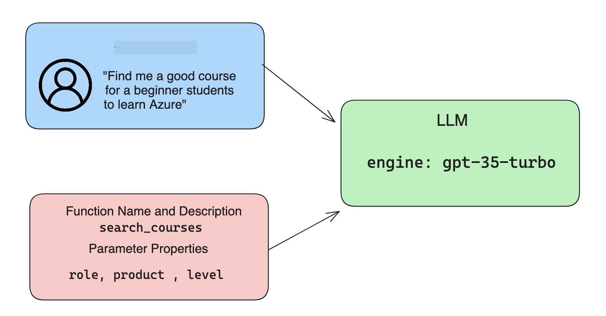

<!--
CO_OP_TRANSLATOR_METADATA:
{
  "original_hash": "77a48a201447be19aa7560706d6f93a0",
  "translation_date": "2025-07-09T14:34:16+00:00",
  "source_file": "11-integrating-with-function-calling/README.md",
  "language_code": "el"
}
-->
# Ενσωμάτωση με function calling

[](https://aka.ms/gen-ai-lesson11-gh?WT.mc_id=academic-105485-koreyst)

Έχετε μάθει αρκετά μέχρι τώρα από τα προηγούμενα μαθήματα. Ωστόσο, μπορούμε να βελτιωθούμε περαιτέρω. Κάποια θέματα που μπορούμε να αντιμετωπίσουμε είναι πώς να έχουμε μια πιο συνεπή μορφή απάντησης ώστε να είναι πιο εύκολο να δουλέψουμε με την απάντηση σε επόμενα στάδια. Επίσης, ίσως θέλουμε να προσθέσουμε δεδομένα από άλλες πηγές για να εμπλουτίσουμε περαιτέρω την εφαρμογή μας.

Τα παραπάνω προβλήματα είναι αυτά που επιδιώκει να αντιμετωπίσει αυτό το κεφάλαιο.

## Εισαγωγή

Αυτό το μάθημα θα καλύψει:

- Εξήγηση του τι είναι το function calling και τις περιπτώσεις χρήσης του.
- Δημιουργία κλήσης συνάρτησης χρησιμοποιώντας το Azure OpenAI.
- Πώς να ενσωματώσετε μια κλήση συνάρτησης σε μια εφαρμογή.

## Στόχοι Μάθησης

Στο τέλος αυτού του μαθήματος, θα μπορείτε να:

- Εξηγήσετε τον σκοπό χρήσης του function calling.
- Ρυθμίσετε το Function Call χρησιμοποιώντας την υπηρεσία Azure OpenAI.
- Σχεδιάσετε αποτελεσματικές κλήσεις συναρτήσεων για την περίπτωση χρήσης της εφαρμογής σας.

## Σενάριο: Βελτίωση του chatbot μας με συναρτήσεις

Για αυτό το μάθημα, θέλουμε να δημιουργήσουμε μια λειτουργία για το εκπαιδευτικό μας startup που επιτρέπει στους χρήστες να χρησιμοποιούν ένα chatbot για να βρουν τεχνικά μαθήματα. Θα προτείνουμε μαθήματα που ταιριάζουν στο επίπεδο δεξιοτήτων τους, στον τρέχοντα ρόλο τους και στην τεχνολογία που τους ενδιαφέρει.

Για να ολοκληρώσουμε αυτό το σενάριο, θα χρησιμοποιήσουμε έναν συνδυασμό:

- `Azure OpenAI` για να δημιουργήσουμε μια εμπειρία συνομιλίας για τον χρήστη.
- `Microsoft Learn Catalog API` για να βοηθήσουμε τους χρήστες να βρουν μαθήματα βάσει του αιτήματός τους.
- `Function Calling` για να πάρουμε το ερώτημα του χρήστη και να το στείλουμε σε μια συνάρτηση που θα κάνει το αίτημα API.

Για να ξεκινήσουμε, ας δούμε γιατί θα θέλαμε να χρησιμοποιήσουμε το function calling αρχικά:

## Γιατί Function Calling

Πριν το function calling, οι απαντήσεις από ένα LLM ήταν μη δομημένες και ασυνεπείς. Οι προγραμματιστές έπρεπε να γράφουν πολύπλοκο κώδικα επικύρωσης για να διαχειριστούν κάθε παραλλαγή μιας απάντησης. Οι χρήστες δεν μπορούσαν να πάρουν απαντήσεις όπως "Ποιος είναι ο τρέχων καιρός στη Στοκχόλμη;". Αυτό συμβαίνει επειδή τα μοντέλα ήταν περιορισμένα στα δεδομένα με τα οποία είχαν εκπαιδευτεί.

Το Function Calling είναι μια λειτουργία της υπηρεσίας Azure OpenAI που ξεπερνά τους παρακάτω περιορισμούς:

- **Συνεπής μορφή απάντησης**. Αν μπορούμε να ελέγξουμε καλύτερα τη μορφή της απάντησης, μπορούμε πιο εύκολα να ενσωματώσουμε την απάντηση σε άλλα συστήματα.
- **Εξωτερικά δεδομένα**. Δυνατότητα χρήσης δεδομένων από άλλες πηγές μιας εφαρμογής σε ένα πλαίσιο συνομιλίας.

## Εικονογράφηση του προβλήματος μέσω ενός σεναρίου

> Σας προτείνουμε να χρησιμοποιήσετε το [συμπεριλαμβανόμενο notebook](../../../11-integrating-with-function-calling/python/aoai-assignment.ipynb) αν θέλετε να εκτελέσετε το παρακάτω σενάριο. Μπορείτε επίσης απλά να διαβάσετε καθώς προσπαθούμε να δείξουμε ένα πρόβλημα όπου οι συναρτήσεις μπορούν να βοηθήσουν στην επίλυσή του.

Ας δούμε το παράδειγμα που δείχνει το πρόβλημα της μορφοποίησης της απάντησης:

Ας υποθέσουμε ότι θέλουμε να δημιουργήσουμε μια βάση δεδομένων με στοιχεία φοιτητών ώστε να προτείνουμε το κατάλληλο μάθημα σε αυτούς. Παρακάτω έχουμε δύο περιγραφές φοιτητών που είναι πολύ παρόμοιες στα δεδομένα που περιέχουν.

1. Δημιουργούμε μια σύνδεση με τον πόρο Azure OpenAI:

   ```python
   import os
   import json
   from openai import AzureOpenAI
   from dotenv import load_dotenv
   load_dotenv()

   client = AzureOpenAI(
   api_key=os.environ['AZURE_OPENAI_API_KEY'],  # this is also the default, it can be omitted
   api_version = "2023-07-01-preview"
   )

   deployment=os.environ['AZURE_OPENAI_DEPLOYMENT']
   ```

   Παρακάτω είναι κώδικας Python για τη ρύθμιση της σύνδεσής μας με το Azure OpenAI όπου ορίζουμε `api_type`, `api_base`, `api_version` και `api_key`.

1. Δημιουργία δύο περιγραφών φοιτητών χρησιμοποιώντας τις μεταβλητές `student_1_description` και `student_2_description`.

   ```python
   student_1_description="Emily Johnson is a sophomore majoring in computer science at Duke University. She has a 3.7 GPA. Emily is an active member of the university's Chess Club and Debate Team. She hopes to pursue a career in software engineering after graduating."

   student_2_description = "Michael Lee is a sophomore majoring in computer science at Stanford University. He has a 3.8 GPA. Michael is known for his programming skills and is an active member of the university's Robotics Club. He hopes to pursue a career in artificial intelligence after finishing his studies."
   ```

   Θέλουμε να στείλουμε τις παραπάνω περιγραφές φοιτητών σε ένα LLM για να αναλύσει τα δεδομένα. Αυτά τα δεδομένα μπορούν αργότερα να χρησιμοποιηθούν στην εφαρμογή μας και να σταλούν σε ένα API ή να αποθηκευτούν σε βάση δεδομένων.

1. Ας δημιουργήσουμε δύο πανομοιότυπα prompts στα οποία δίνουμε οδηγίες στο LLM για τις πληροφορίες που μας ενδιαφέρουν:

   ```python
   prompt1 = f'''
   Please extract the following information from the given text and return it as a JSON object:

   name
   major
   school
   grades
   club

   This is the body of text to extract the information from:
   {student_1_description}
   '''

   prompt2 = f'''
   Please extract the following information from the given text and return it as a JSON object:

   name
   major
   school
   grades
   club

   This is the body of text to extract the information from:
   {student_2_description}
   '''
   ```

   Τα παραπάνω prompts δίνουν οδηγίες στο LLM να εξάγει πληροφορίες και να επιστρέψει την απάντηση σε μορφή JSON.

1. Αφού ρυθμίσουμε τα prompts και τη σύνδεση με το Azure OpenAI, τώρα θα στείλουμε τα prompts στο LLM χρησιμοποιώντας το `openai.ChatCompletion`. Αποθηκεύουμε το prompt στη μεταβλητή `messages` και ορίζουμε το ρόλο ως `user`. Αυτό μιμείται ένα μήνυμα από χρήστη που γράφεται σε ένα chatbot.

   ```python
   # response from prompt one
   openai_response1 = client.chat.completions.create(
   model=deployment,
   messages = [{'role': 'user', 'content': prompt1}]
   )
   openai_response1.choices[0].message.content

   # response from prompt two
   openai_response2 = client.chat.completions.create(
   model=deployment,
   messages = [{'role': 'user', 'content': prompt2}]
   )
   openai_response2.choices[0].message.content
   ```

Τώρα μπορούμε να στείλουμε και τα δύο αιτήματα στο LLM και να εξετάσουμε την απάντηση που λαμβάνουμε βρίσκοντάς την ως `openai_response1['choices'][0]['message']['content']`.

1. Τέλος, μπορούμε να μετατρέψουμε την απάντηση σε μορφή JSON καλώντας το `json.loads`:

   ```python
   # Loading the response as a JSON object
   json_response1 = json.loads(openai_response1.choices[0].message.content)
   json_response1
   ```

   Απάντηση 1:

   ```json
   {
     "name": "Emily Johnson",
     "major": "computer science",
     "school": "Duke University",
     "grades": "3.7",
     "club": "Chess Club"
   }
   ```

   Απάντηση 2:

   ```json
   {
     "name": "Michael Lee",
     "major": "computer science",
     "school": "Stanford University",
     "grades": "3.8 GPA",
     "club": "Robotics Club"
   }
   ```

   Παρόλο που τα prompts είναι ίδια και οι περιγραφές παρόμοιες, βλέπουμε ότι οι τιμές της ιδιότητας `Grades` μορφοποιούνται διαφορετικά, καθώς μερικές φορές παίρνουμε τη μορφή `3.7` ή `3.7 GPA` για παράδειγμα.

   Αυτό το αποτέλεσμα οφείλεται στο ότι το LLM παίρνει μη δομημένα δεδομένα με τη μορφή του γραπτού prompt και επιστρέφει επίσης μη δομημένα δεδομένα. Χρειαζόμαστε μια δομημένη μορφή ώστε να ξέρουμε τι να περιμένουμε όταν αποθηκεύουμε ή χρησιμοποιούμε αυτά τα δεδομένα.

Πώς λύνουμε λοιπόν το πρόβλημα της μορφοποίησης; Με τη χρήση του function calling, μπορούμε να βεβαιωθούμε ότι λαμβάνουμε δομημένα δεδομένα πίσω. Όταν χρησιμοποιούμε function calling, το LLM δεν καλεί ή εκτελεί πραγματικά καμία συνάρτηση. Αντίθετα, δημιουργούμε μια δομή που το LLM ακολουθεί για τις απαντήσεις του. Στη συνέχεια, χρησιμοποιούμε αυτές τις δομημένες απαντήσεις για να ξέρουμε ποια συνάρτηση να εκτελέσουμε στις εφαρμογές μας.


Μπορούμε μετά να πάρουμε αυτό που επιστρέφει η συνάρτηση και να το στείλουμε πίσω στο LLM. Το LLM θα απαντήσει στη συνέχεια χρησιμοποιώντας φυσική γλώσσα για να απαντήσει στο ερώτημα του χρήστη.

## Περιπτώσεις χρήσης για function calls

Υπάρχουν πολλές διαφορετικές περιπτώσεις όπου οι κλήσεις συναρτήσεων μπορούν να βελτιώσουν την εφαρμογή σας, όπως:

- **Κλήση Εξωτερικών Εργαλείων**. Τα chatbots είναι εξαιρετικά στο να παρέχουν απαντήσεις σε ερωτήσεις χρηστών. Με τη χρήση function calling, τα chatbots μπορούν να χρησιμοποιούν τα μηνύματα των χρηστών για να ολοκληρώσουν συγκεκριμένες εργασίες. Για παράδειγμα, ένας φοιτητής μπορεί να ζητήσει από το chatbot να "Στείλει ένα email στον καθηγητή μου λέγοντας ότι χρειάζομαι περισσότερη βοήθεια με αυτό το θέμα". Αυτό μπορεί να κάνει μια κλήση στη συνάρτηση `send_email(to: string, body: string)`

- **Δημιουργία Ερωτημάτων API ή Βάσης Δεδομένων**. Οι χρήστες μπορούν να βρουν πληροφορίες χρησιμοποιώντας φυσική γλώσσα που μετατρέπεται σε μορφοποιημένο ερώτημα ή αίτημα API. Ένα παράδειγμα είναι ένας δάσκαλος που ζητά "Ποιοι είναι οι φοιτητές που ολοκλήρωσαν την τελευταία εργασία" και αυτό μπορεί να καλέσει μια συνάρτηση με όνομα `get_completed(student_name: string, assignment: int, current_status: string)`

- **Δημιουργία Δομημένων Δεδομένων**. Οι χρήστες μπορούν να πάρουν ένα κείμενο ή CSV και να χρησιμοποιήσουν το LLM για να εξάγουν σημαντικές πληροφορίες. Για παράδειγμα, ένας φοιτητής μπορεί να μετατρέψει ένα άρθρο της Wikipedia για ειρηνευτικές συμφωνίες σε κάρτες μάθησης AI. Αυτό μπορεί να γίνει με μια συνάρτηση που ονομάζεται `get_important_facts(agreement_name: string, date_signed: string, parties_involved: list)`

## Δημιουργία της Πρώτης σας Κλήσης Συνάρτησης

Η διαδικασία δημιουργίας μιας κλήσης συνάρτησης περιλαμβάνει 3 βασικά βήματα:

1. **Κλήση** του Chat Completions API με μια λίστα των συναρτήσεών σας και ένα μήνυμα χρήστη.
2. **Ανάγνωση** της απάντησης του μοντέλου για να εκτελέσετε μια ενέργεια, π.χ. να εκτελέσετε μια συνάρτηση ή κλήση API.
3. **Κλήση** ξανά του Chat Completions API με την απάντηση από τη συνάρτησή σας για να χρησιμοποιήσετε αυτές τις πληροφορίες και να δημιουργήσετε μια απάντηση προς τον χρήστη.



### Βήμα 1 - δημιουργία μηνυμάτων

Το πρώτο βήμα είναι να δημιουργήσουμε ένα μήνυμα χρήστη. Αυτό μπορεί να ανατεθεί δυναμικά παίρνοντας την τιμή από μια είσοδο κειμένου ή μπορείτε να ορίσετε μια τιμή εδώ. Αν είναι η πρώτη φορά που δουλεύετε με το Chat Completions API, πρέπει να ορίσουμε το `role` και το `content` του μηνύματος.

Το `role` μπορεί να είναι είτε `system` (δημιουργία κανόνων), `assistant` (το μοντέλο) ή `user` (ο τελικός χρήστης). Για το function calling, θα το ορίσουμε ως `user` και ένα παράδειγμα ερώτησης.

```python
messages= [ {"role": "user", "content": "Find me a good course for a beginner student to learn Azure."} ]
```

Με την ανάθεση διαφορετικών ρόλων, γίνεται σαφές στο LLM αν το μήνυμα προέρχεται από το σύστημα ή από τον χρήστη, κάτι που βοηθά στη δημιουργία ιστορικού συνομιλίας πάνω στο οποίο το LLM μπορεί να βασιστεί.

### Βήμα 2 - δημιουργία συναρτήσεων

Στη συνέχεια, θα ορίσουμε μια συνάρτηση και τις παραμέτρους της. Θα χρησιμοποιήσουμε μόνο μια συνάρτηση εδώ που ονομάζεται `search_courses`, αλλά μπορείτε να δημιουργήσετε πολλές συναρτήσεις.

> **Important** : Οι συναρτήσεις περιλαμβάνονται στο μήνυμα συστήματος προς το LLM και μετράνε στο όριο των διαθέσιμων tokens που έχετε.

Παρακάτω, δημιουργούμε τις συναρτήσεις ως έναν πίνακα αντικειμένων. Κάθε αντικείμενο είναι μια συνάρτηση και έχει τις ιδιότητες `name`, `description` και `parameters`:

```python
functions = [
   {
      "name":"search_courses",
      "description":"Retrieves courses from the search index based on the parameters provided",
      "parameters":{
         "type":"object",
         "properties":{
            "role":{
               "type":"string",
               "description":"The role of the learner (i.e. developer, data scientist, student, etc.)"
            },
            "product":{
               "type":"string",
               "description":"The product that the lesson is covering (i.e. Azure, Power BI, etc.)"
            },
            "level":{
               "type":"string",
               "description":"The level of experience the learner has prior to taking the course (i.e. beginner, intermediate, advanced)"
            }
         },
         "required":[
            "role"
         ]
      }
   }
]
```

Ας περιγράψουμε κάθε παράδειγμα συνάρτησης πιο αναλυτικά παρακάτω:

- `name` - Το όνομα της συνάρτησης που θέλουμε να κληθεί.
- `description` - Η περιγραφή του πώς λειτουργεί η συνάρτηση. Εδώ είναι σημαντικό να είμαστε συγκεκριμένοι και σαφείς.
- `parameters` - Μια λίστα με τιμές και μορφή που θέλουμε το μοντέλο να παράγει στην απάντησή του. Ο πίνακας παραμέτρων αποτελείται από αντικείμενα που έχουν τις εξής ιδιότητες:
  1.  `type` - Ο τύπος δεδομένων που θα αποθηκευτούν οι ιδιότητες.
  1.  `properties` - Λίστα με τις συγκεκριμένες τιμές που το μοντέλο θα χρησιμοποιήσει στην απάντησή του
      1. `name` - Το κλειδί είναι το όνομα της ιδιότητας που το μοντέλο θα χρησιμοποιήσει στην μορφοποιημένη απάντησή του, π.χ. `product`.
      1. `type` - Ο τύπος δεδομένων αυτής της ιδιότητας, π.χ. `string`.
      1. `description` - Περιγραφή της συγκεκριμένης ιδιότητας.

Υπάρχει επίσης μια προαιρετική ιδιότητα `required` - υποχρεωτική ιδιότητα για να ολοκληρωθεί η κλήση της συνάρτησης.

### Βήμα 3 - Εκτέλεση της κλήσης συνάρτησης

Αφού ορίσουμε μια συνάρτηση, τώρα πρέπει να την συμπεριλάβουμε στην κλήση προς το Chat Completion API. Το κάνουμε αυτό προσθέτοντας το `functions` στο αίτημα. Σε αυτή την περίπτωση `functions=functions`.

Υπάρχει επίσης η επιλογή να ορίσουμε το `function_call` σε `auto`. Αυτό σημαίνει ότι αφήνουμε το LLM να αποφασίσει ποια συνάρτηση πρέπει να κληθεί βάσει του μηνύματος του χρήστη αντί να το ορίσουμε εμείς.

Ακολουθεί κώδικας όπου καλούμε το `ChatCompletion.create`, σημειώστε πώς ορίζουμε `functions=functions` και `function_call="auto"` δίνοντας έτσι στο LLM την επιλογή πότε να καλέσει τις συναρτήσεις που του παρέχουμε:

```python
response = client.chat.completions.create(model=deployment,
                                        messages=messages,
                                        functions=functions,
                                        function_call="auto")

print(response.choices[0].message)
```

Η απάντηση που λαμβάνουμε τώρα μοιάζει ως εξής:

```json
{
  "role": "assistant",
  "function_call": {
    "name": "search_courses",
    "arguments": "{\n  \"role\": \"student\",\n  \"product\": \"Azure\",\n  \"level\": \"beginner\"\n}"
  }
}
```

Εδώ βλέπουμε πώς η συνάρτηση `search_courses` κλήθηκε και με ποια επιχειρήματα, όπως αναγράφονται στην ιδιότητα `arguments` στην απάντηση JSON.

Το συμπέρασμα είναι ότι το LLM κατάφερε να βρει τα δεδομένα που ταιριάζουν στα επιχειρήματα της συνάρτησης καθώς τα εξήγαγε από την τιμή που δόθηκε στην παράμετρο `messages` στην κλήση chat completion. Παρακάτω είναι μια υπενθύμιση της τιμής `messages`:

```python
messages= [ {"role": "user", "content": "Find me a good course for a beginner student to learn Azure."} ]
```

Όπως βλέπετε, το `student`, `Azure` και `beginner` εξήχθησαν από τα `messages` και ορίστηκαν ως είσοδος στη συνάρτηση. Η χρήση συναρτήσεων με αυτόν τον τρόπο είναι ένας εξαιρετικός τρόπος να εξάγουμε πληροφορίες από ένα prompt αλλά και να παρέχουμε δομή στο LLM και να έχουμε επαναχρησιμοποιήσιμη λειτουργικότητα.

Στη συνέχεια, πρέπει να δούμε πώς μπορούμε να το χρησιμοποιήσουμε στην εφαρμογή μας.

## Ενσωμάτωση Κλήσεων Συναρτήσεων σε Εφαρμογή

Αφού δοκιμάσουμε την μορφοποιημένη απάντηση από το LLM, τώρα μπορούμε να την ενσωματώσουμε σε μια εφαρμογή.

### Διαχείριση της ροής

Για να το ενσωματώσουμε στην εφαρμογή μας, ας ακολουθήσουμε τα παρακάτω βήματα:

1. Πρώτα, κάνουμε την κλήση στις υπηρεσίες OpenAI και αποθηκεύουμε το μήνυμα σε μια μεταβλητή που ονομάζεται `response_message`.

   ```python
   response_message = response.choices[0].message
   ```

1. Τώρα θα ορίσουμε τη συνάρτηση που θα καλεί το Microsoft Learn API για να πάρει μια λίστα μαθημάτων:

   ```python
   import requests

   def search_courses(role, product, level):
     url = "https://learn.microsoft.com/api/catalog/"
     params = {
        "role": role,
        "product": product,
        "level": level
     }
     response = requests.get(url, params=params)
     modules = response.json()["modules"]
     results = []
     for module in modules[:5]:
        title = module["title"]
        url = module["url"]
        results.append({"title": title, "url": url})
     return str(results)
   ```

   Σημειώστε πώς τώρα δημιουργούμε μια πραγματική συνάρτηση Python που αντιστοιχεί στα ονόματα συναρτήσεων που ορίστηκαν στη μεταβλητή `functions`. Κάνουμε επίσης πραγματικές εξωτερικές κλήσεις API για να φέρουμε τα δεδομένα που χρειαζόμαστε. Σε αυτή την περίπτωση, απευθυνόμαστε στο Microsoft Learn API για να αναζητήσουμε εκπαιδευτικά modules.

Εντάξει, δημιουργήσαμε τη μεταβλητή `functions` και μια αντίστοιχη συνάρτηση Python, πώς λέμε στο LLM
## Υπέροχη δουλειά! Συνέχισε το ταξίδι

Αφού ολοκληρώσεις αυτό το μάθημα, ρίξε μια ματιά στη [συλλογή Μάθησης για Generative AI](https://aka.ms/genai-collection?WT.mc_id=academic-105485-koreyst) για να συνεχίσεις να εξελίσσεις τις γνώσεις σου στο Generative AI!

Πήγαινε στο Μάθημα 12, όπου θα δούμε πώς να [σχεδιάζουμε UX για εφαρμογές AI](../12-designing-ux-for-ai-applications/README.md?WT.mc_id=academic-105485-koreyst)!

**Αποποίηση ευθυνών**:  
Αυτό το έγγραφο έχει μεταφραστεί χρησιμοποιώντας την υπηρεσία αυτόματης μετάφρασης AI [Co-op Translator](https://github.com/Azure/co-op-translator). Παρόλο που επιδιώκουμε την ακρίβεια, παρακαλούμε να έχετε υπόψη ότι οι αυτόματες μεταφράσεις ενδέχεται να περιέχουν λάθη ή ανακρίβειες. Το πρωτότυπο έγγραφο στη γλώσσα του θεωρείται η αυθεντική πηγή. Για κρίσιμες πληροφορίες, συνιστάται επαγγελματική ανθρώπινη μετάφραση. Δεν φέρουμε ευθύνη για τυχόν παρεξηγήσεις ή λανθασμένες ερμηνείες που προκύπτουν από τη χρήση αυτής της μετάφρασης.