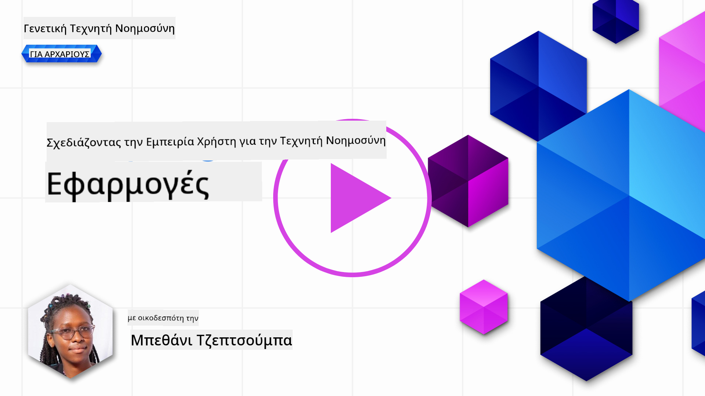
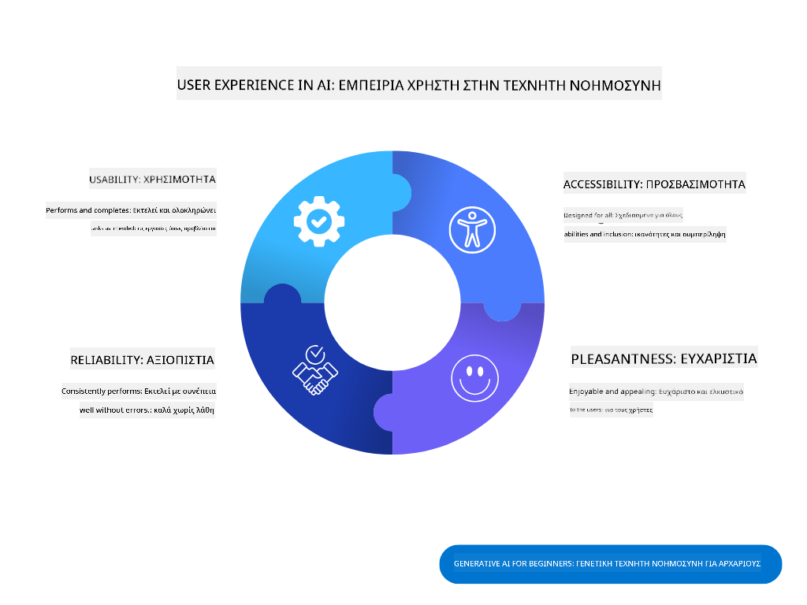
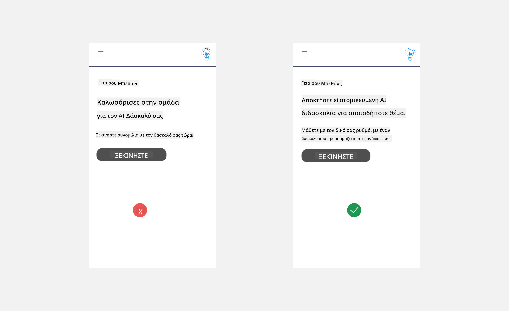
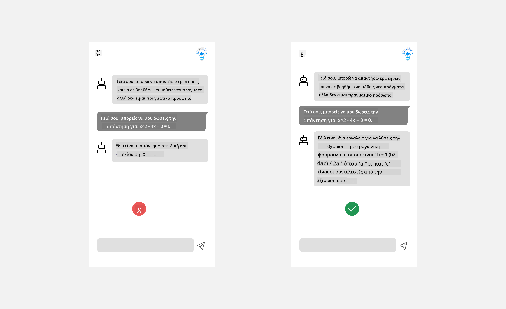
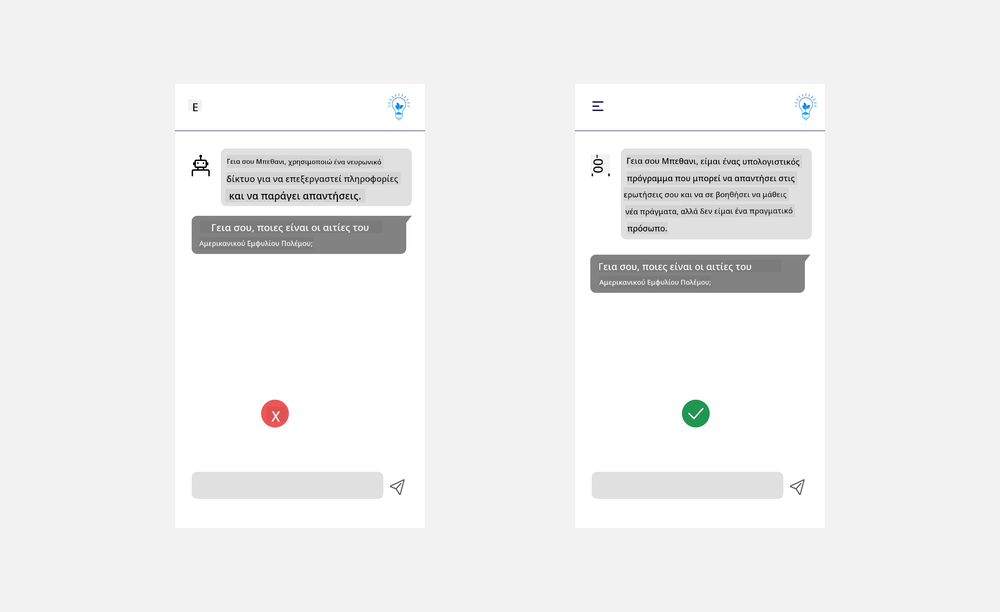
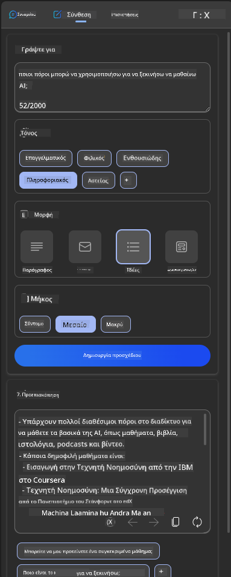
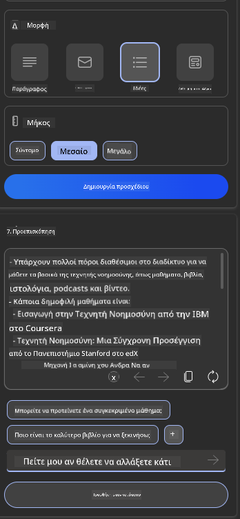
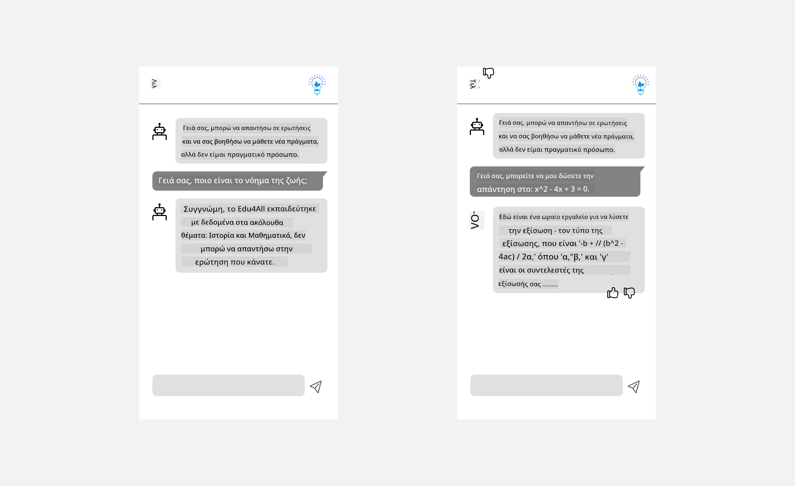

<!--
CO_OP_TRANSLATOR_METADATA:
{
  "original_hash": "747668e4c53d067369f06e9ec2e6313e",
  "translation_date": "2025-08-26T17:05:53+00:00",
  "source_file": "12-designing-ux-for-ai-applications/README.md",
  "language_code": "el"
}
-->
# Σχεδιασμός UX για Εφαρμογές Τεχνητής Νοημοσύνης

> _(Κάντε κλικ στην εικόνα παραπάνω για να δείτε το βίντεο αυτού του μαθήματος)_

Η εμπειρία χρήστη είναι πολύ σημαντική όταν δημιουργούμε εφαρμογές. Οι χρήστες πρέπει να μπορούν να χρησιμοποιούν την εφαρμογή σας αποτελεσματικά για να ολοκληρώνουν εργασίες. Η αποτελεσματικότητα είναι σημαντική, αλλά εξίσου σημαντικό είναι να σχεδιάζετε εφαρμογές που μπορούν να χρησιμοποιηθούν από όλους, ώστε να είναι _προσβάσιμες_. Αυτό το κεφάλαιο εστιάζει σε αυτό το θέμα, ώστε να καταλήξετε να σχεδιάσετε μια εφαρμογή που οι άνθρωποι μπορούν και θέλουν να χρησιμοποιήσουν.

## Εισαγωγή

Η εμπειρία χρήστη αφορά τον τρόπο με τον οποίο ο χρήστης αλληλεπιδρά και χρησιμοποιεί ένα συγκεκριμένο προϊόν ή υπηρεσία, είτε πρόκειται για σύστημα, εργαλείο ή σχεδιασμό. Όταν αναπτύσσουμε εφαρμογές Τεχνητής Νοημοσύνης, οι προγραμματιστές δεν εστιάζουν μόνο στην αποτελεσματικότητα της εμπειρίας χρήστη, αλλά και στην ηθική της. Σε αυτό το μάθημα, θα δούμε πώς να δημιουργούμε εφαρμογές Τεχνητής Νοημοσύνης (AI) που καλύπτουν τις ανάγκες των χρηστών.

Το μάθημα καλύπτει τα εξής:

- Εισαγωγή στην Εμπειρία Χρήστη και Κατανόηση των Αναγκών των Χρηστών
- Σχεδιασμός Εφαρμογών AI για Εμπιστοσύνη και Διαφάνεια
- Σχεδιασμός Εφαρμογών AI για Συνεργασία και Ανατροφοδότηση

## Στόχοι μάθησης

Μετά από αυτό το μάθημα, θα μπορείτε να:

- Κατανοείτε πώς να δημιουργείτε εφαρμογές AI που καλύπτουν τις ανάγκες των χρηστών.
- Σχεδιάζετε εφαρμογές AI που ενισχύουν την εμπιστοσύνη και τη συνεργασία.

### Προαπαιτούμενα

Αφιερώστε λίγο χρόνο και διαβάστε περισσότερα για [την εμπειρία χρήστη και το design thinking.](https://learn.microsoft.com/training/modules/ux-design?WT.mc_id=academic-105485-koreyst)

## Εισαγωγή στην Εμπειρία Χρήστη και Κατανόηση των Αναγκών των Χρηστών

Στην φανταστική μας startup στον χώρο της εκπαίδευσης, έχουμε δύο βασικούς χρήστες: εκπαιδευτικούς και μαθητές. Κάθε ομάδα έχει διαφορετικές ανάγκες. Ο σχεδιασμός με επίκεντρο τον χρήστη δίνει προτεραιότητα στον χρήστη, διασφαλίζοντας ότι τα προϊόντα είναι σχετικά και ωφέλιμα για αυτούς που προορίζονται.

Η εφαρμογή πρέπει να είναι **χρήσιμη, αξιόπιστη, προσβάσιμη και ευχάριστη** για να προσφέρει καλή εμπειρία χρήστη.

### Χρηστικότητα

Χρήσιμη σημαίνει ότι η εφαρμογή έχει λειτουργίες που ταιριάζουν στον σκοπό της, όπως η αυτοματοποίηση της βαθμολόγησης ή η δημιουργία καρτών επανάληψης. Μια εφαρμογή που αυτοματοποιεί τη βαθμολόγηση πρέπει να μπορεί να αποδίδει βαθμούς με ακρίβεια και αποτελεσματικότητα, σύμφωνα με προκαθορισμένα κριτήρια. Αντίστοιχα, μια εφαρμογή που δημιουργεί κάρτες επανάληψης πρέπει να μπορεί να φτιάχνει σχετικές και ποικίλες ερωτήσεις με βάση τα δεδομένα της.

### Αξιοπιστία

Αξιόπιστη σημαίνει ότι η εφαρμογή εκτελεί τις εργασίες της σταθερά και χωρίς σφάλματα. Ωστόσο, η AI όπως και οι άνθρωποι δεν είναι τέλεια και μπορεί να κάνει λάθη. Οι εφαρμογές μπορεί να συναντήσουν σφάλματα ή απρόβλεπτες καταστάσεις που απαιτούν ανθρώπινη παρέμβαση ή διόρθωση. Πώς αντιμετωπίζετε τα σφάλματα; Στην τελευταία ενότητα του μαθήματος, θα δούμε πώς σχεδιάζονται τα συστήματα AI για συνεργασία και ανατροφοδότηση.

### Προσβασιμότητα

Προσβάσιμη σημαίνει ότι η εμπειρία χρήστη επεκτείνεται σε χρήστες με διάφορες ικανότητες, συμπεριλαμβανομένων ατόμων με αναπηρίες, ώστε κανείς να μην μένει εκτός. Ακολουθώντας τις οδηγίες και τις αρχές προσβασιμότητας, οι λύσεις AI γίνονται πιο συμπεριληπτικές, χρηστικές και ωφέλιμες για όλους.

### Ευχάριστη

Ευχάριστη σημαίνει ότι η εφαρμογή είναι ευχάριστη στη χρήση. Μια ελκυστική εμπειρία χρήστη μπορεί να έχει θετικό αντίκτυπο στον χρήστη, ενθαρρύνοντάς τον να επιστρέψει στην εφαρμογή και να αυξήσει τα έσοδα της επιχείρησης.

Δεν λύνονται όλα τα προβλήματα με AI. Η AI έρχεται να ενισχύσει την εμπειρία χρήστη, είτε αυτοματοποιώντας χειροκίνητες εργασίες, είτε εξατομικεύοντας την εμπειρία.

## Σχεδιασμός Εφαρμογών AI για Εμπιστοσύνη και Διαφάνεια

Η οικοδόμηση εμπιστοσύνης είναι κρίσιμη όταν σχεδιάζουμε εφαρμογές AI. Η εμπιστοσύνη διασφαλίζει ότι ο χρήστης νιώθει σίγουρος πως η εφαρμογή θα κάνει τη δουλειά, θα δίνει σταθερά αποτελέσματα και τα αποτελέσματα θα είναι αυτά που χρειάζεται. Ο κίνδυνος εδώ είναι η έλλειψη εμπιστοσύνης ή η υπερβολική εμπιστοσύνη. Έλλειψη εμπιστοσύνης υπάρχει όταν ο χρήστης δεν εμπιστεύεται το σύστημα AI, οδηγώντας στην απόρριψη της εφαρμογής. Υπερβολική εμπιστοσύνη υπάρχει όταν ο χρήστης υπερεκτιμά τις δυνατότητες του συστήματος AI, εμπιστευόμενος υπερβολικά το AI. Για παράδειγμα, ένα αυτόματο σύστημα βαθμολόγησης, αν ο εκπαιδευτικός το εμπιστευτεί υπερβολικά, μπορεί να μην ελέγξει κάποια γραπτά, με αποτέλεσμα άδικους ή λανθασμένους βαθμούς ή χαμένες ευκαιρίες για ανατροφοδότηση και βελτίωση.

Δύο τρόποι για να τοποθετήσετε την εμπιστοσύνη στο επίκεντρο του σχεδιασμού είναι η εξηγήσιμότητα και ο έλεγχος.

### Εξηγήσιμότητα

Όταν η AI βοηθά στη λήψη αποφάσεων, όπως στη μετάδοση γνώσης στις επόμενες γενιές, είναι σημαντικό οι εκπαιδευτικοί και οι γονείς να κατανοούν πώς λαμβάνονται οι αποφάσεις της AI. Αυτό είναι η εξηγήσιμότητα - η κατανόηση του πώς οι εφαρμογές AI παίρνουν αποφάσεις. Ο σχεδιασμός για εξηγήσιμότητα περιλαμβάνει την προσθήκη λεπτομερειών που δείχνουν πώς η AI έφτασε στο αποτέλεσμα. Το κοινό πρέπει να γνωρίζει ότι το αποτέλεσμα δημιουργήθηκε από AI και όχι από άνθρωπο. Για παράδειγμα, αντί να λέτε "Ξεκινήστε συνομιλία με τον καθηγητή σας τώρα", πείτε "Χρησιμοποιήστε τον AI καθηγητή που προσαρμόζεται στις ανάγκες σας και σας βοηθά να μάθετε με τον δικό σας ρυθμό."

Ένα ακόμα παράδειγμα είναι το πώς η AI χρησιμοποιεί τα προσωπικά δεδομένα του χρήστη. Για παράδειγμα, ένας μαθητής μπορεί να έχει περιορισμούς λόγω του ρόλου του. Η AI μπορεί να μην αποκαλύπτει απαντήσεις, αλλά να καθοδηγεί τον χρήστη να σκεφτεί πώς να λύσει το πρόβλημα.

Ένα τελευταίο σημαντικό σημείο της εξηγήσιμότητας είναι η απλοποίηση των εξηγήσεων. Οι μαθητές και οι εκπαιδευτικοί δεν είναι απαραίτητα ειδικοί στην AI, οπότε οι εξηγήσεις για το τι μπορεί ή δεν μπορεί να κάνει η εφαρμογή πρέπει να είναι απλές και κατανοητές.

### Έλεγχος

Η γενετική AI δημιουργεί συνεργασία μεταξύ AI και χρήστη, όπου ο χρήστης μπορεί να τροποποιεί τα prompts για διαφορετικά αποτελέσματα. Επίσης, όταν παράγεται ένα αποτέλεσμα, ο χρήστης πρέπει να μπορεί να το τροποποιεί, αποκτώντας αίσθηση ελέγχου. Για παράδειγμα, στη χρήση του Bing, μπορείτε να προσαρμόσετε το prompt ως προς τη μορφή, τον τόνο και το μήκος. Επιπλέον, μπορείτε να κάνετε αλλαγές στο αποτέλεσμα όπως φαίνεται παρακάτω:

Μια άλλη δυνατότητα στο Bing που δίνει έλεγχο στον χρήστη είναι η επιλογή συμμετοχής ή μη στη χρήση των δεδομένων από την AI. Σε μια σχολική εφαρμογή, ένας μαθητής μπορεί να θέλει να χρησιμοποιήσει τις σημειώσεις του και τα υλικά του εκπαιδευτικού ως υλικό επανάληψης.

> Όταν σχεδιάζετε εφαρμογές AI, η πρόθεση είναι σημαντική για να μην υπερ-εμπιστευτούν οι χρήστες και να μην έχουν μη ρεαλιστικές προσδοκίες για τις δυνατότητες της. Ένας τρόπος να το πετύχετε είναι να δημιουργήσετε "τριβή" μεταξύ των prompts και των αποτελεσμάτων. Υπενθυμίζοντας στον χρήστη ότι πρόκειται για AI και όχι για άνθρωπο.

## Σχεδιασμός Εφαρμογών AI για Συνεργασία και Ανατροφοδότηση

Όπως αναφέρθηκε νωρίτερα, η γενετική AI δημιουργεί συνεργασία μεταξύ χρήστη και AI. Συνήθως, ο χρήστης εισάγει ένα prompt και η AI παράγει ένα αποτέλεσμα. Τι γίνεται αν το αποτέλεσμα είναι λάθος; Πώς χειρίζεται η εφαρμογή τα σφάλματα; Η AI κατηγορεί τον χρήστη ή εξηγεί το σφάλμα;

Οι εφαρμογές AI πρέπει να είναι σχεδιασμένες ώστε να δέχονται και να παρέχουν ανατροφοδότηση. Αυτό βοηθά όχι μόνο στη βελτίωση του συστήματος AI, αλλά και στην ενίσχυση της εμπιστοσύνης των χρηστών. Ένας κύκλος ανατροφοδότησης πρέπει να ενσωματώνεται στο σχεδιασμό, π.χ. με ένα απλό thumbs up ή down στο αποτέλεσμα.

Ένας άλλος τρόπος είναι να επικοινωνούνται ξεκάθαρα οι δυνατότητες και οι περιορισμοί του συστήματος. Όταν ο χρήστης κάνει λάθος ζητώντας κάτι πέρα από τις δυνατότητες της AI, πρέπει να υπάρχει τρόπος να το διαχειριστεί η εφαρμογή, όπως φαίνεται παρακάτω.

Τα σφάλματα συστήματος είναι συχνά σε εφαρμογές όπου ο χρήστης μπορεί να χρειάζεται πληροφορίες εκτός του πεδίου της AI ή η εφαρμογή μπορεί να έχει όριο στον αριθμό ερωτήσεων/θεμάτων για τα οποία μπορεί να δημιουργήσει περιλήψεις. Για παράδειγμα, μια εφαρμογή AI που έχει εκπαιδευτεί μόνο σε Ιστορία και Μαθηματικά, δεν μπορεί να απαντήσει σε ερωτήσεις για τη Γεωγραφία. Για να το αντιμετωπίσει, το σύστημα AI μπορεί να απαντήσει: "Συγγνώμη, το προϊόν μας έχει εκπαιδευτεί με δεδομένα στα εξής θέματα....., δεν μπορώ να απαντήσω στην ερώτηση που κάνατε."

Οι εφαρμογές AI δεν είναι τέλειες, επομένως είναι αναμενόμενο να κάνουν λάθη. Όταν σχεδιάζετε τις εφαρμογές σας, φροντίστε να υπάρχει χώρος για ανατροφοδότηση από τους χρήστες και διαχείριση σφαλμάτων με τρόπο απλό και κατανοητό.

## Εργασία

Πάρτε οποιαδήποτε εφαρμογή AI έχετε δημιουργήσει μέχρι τώρα και σκεφτείτε να εφαρμόσετε τα παρακάτω βήματα:

- **Ευχάριστη:** Σκεφτείτε πώς μπορείτε να κάνετε την εφαρμογή σας πιο ευχάριστη. Προσθέτετε εξηγήσεις παντού; Ενθαρρύνετε τον χρήστη να εξερευνήσει; Πώς διατυπώνετε τα μηνύματα σφάλματος;

- **Χρηστικότητα:** Αν φτιάχνετε web app, βεβαιωθείτε ότι η εφαρμογή σας είναι πλοηγήσιμη τόσο με ποντίκι όσο και με πληκτρολόγιο.

- **Εμπιστοσύνη και διαφάνεια:** Μην εμπιστεύεστε απόλυτα την AI και τα αποτελέσματά της, σκεφτείτε πώς θα προσθέτατε έναν άνθρωπο στη διαδικασία για να επαληθεύσει το αποτέλεσμα. Επίσης, σκεφτείτε και εφαρμόστε άλλους τρόπους για να πετύχετε εμπιστοσύνη και διαφάνεια.

- **Έλεγχος:** Δώστε στον χρήστη τον έλεγχο των δεδομένων που παρέχει στην εφαρμογή. Εφαρμόστε τρόπο ώστε ο χρήστης να μπορεί να επιλέξει αν θα συμμετέχει ή όχι στη συλλογή δεδομένων στην εφαρμογή AI.

## Συνεχίστε τη Μάθησή σας!

Αφού ολοκληρώσετε αυτό το μάθημα, δείτε τη [συλλογή μάθησης για Generative AI](https://aka.ms/genai-collection?WT.mc_id=academic-105485-koreyst) για να συνεχίσετε να αναβαθμίζετε τις γνώσεις σας στην Generative AI!

Προχωρήστε στο Μάθημα 13, όπου θα δούμε πώς [να ασφαλίζετε εφαρμογές AI](../13-securing-ai-applications/README.md?WT.mc_id=academic-105485-koreyst)!

---

**Αποποίηση Ευθύνης**:  
Αυτό το έγγραφο έχει μεταφραστεί χρησιμοποιώντας την υπηρεσία αυτόματης μετάφρασης AI [Co-op Translator](https://github.com/Azure/co-op-translator). Παρότι καταβάλλουμε προσπάθειες για ακρίβεια, παρακαλούμε να γνωρίζετε ότι οι αυτόματες μεταφράσεις ενδέχεται να περιέχουν σφάλματα ή ανακρίβειες. Το πρωτότυπο έγγραφο στη μητρική του γλώσσα πρέπει να θεωρείται η αυθεντική πηγή. Για κρίσιμες πληροφορίες, συνιστάται επαγγελματική ανθρώπινη μετάφραση. Δεν φέρουμε ευθύνη για τυχόν παρανοήσεις ή εσφαλμένες ερμηνείες που προκύπτουν από τη χρήση αυτής της μετάφρασης.