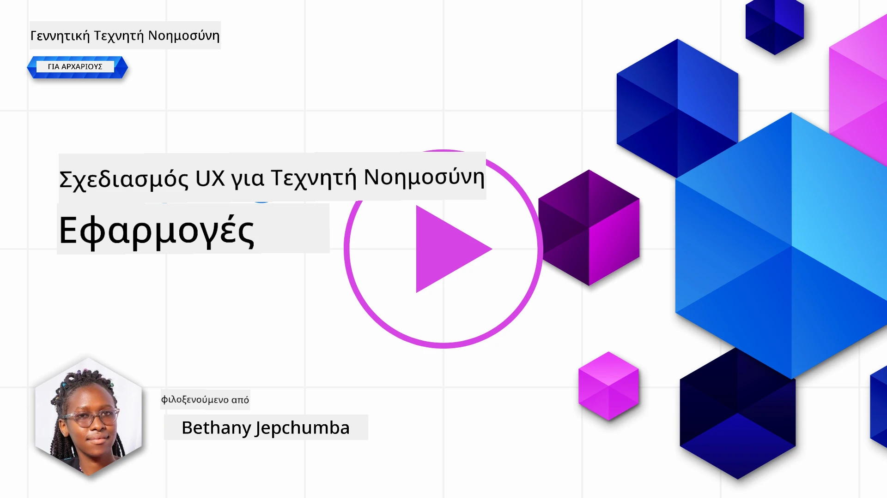
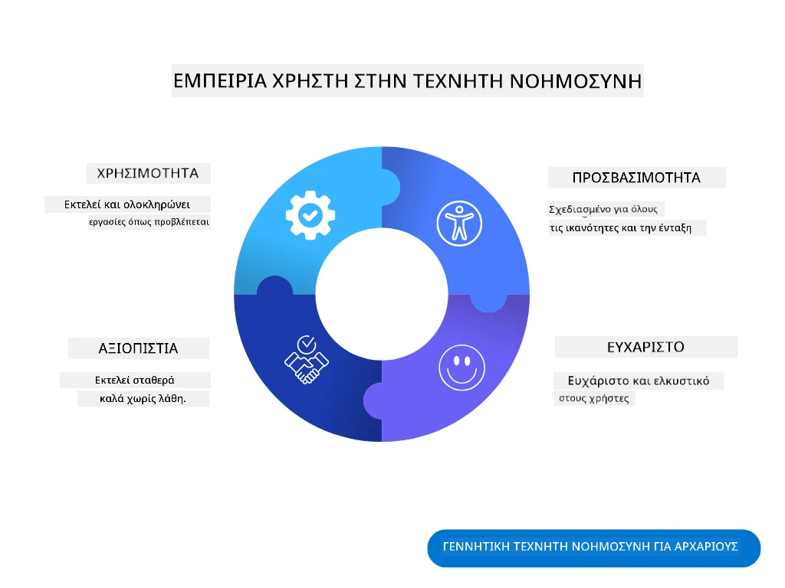
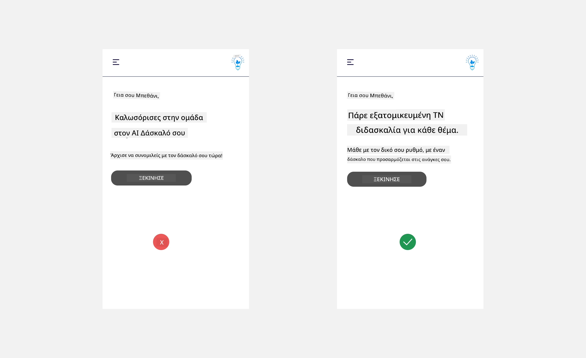
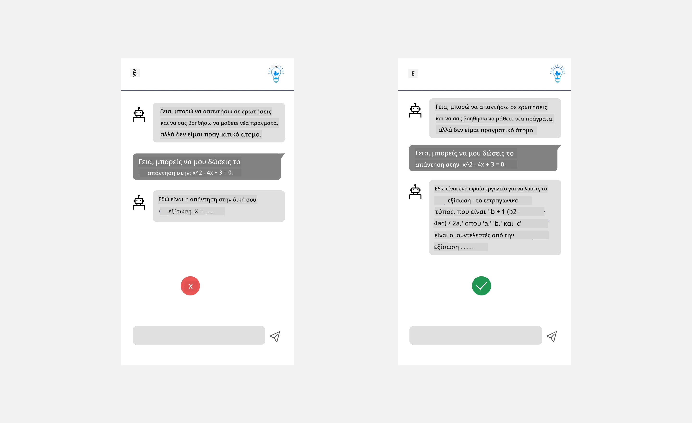
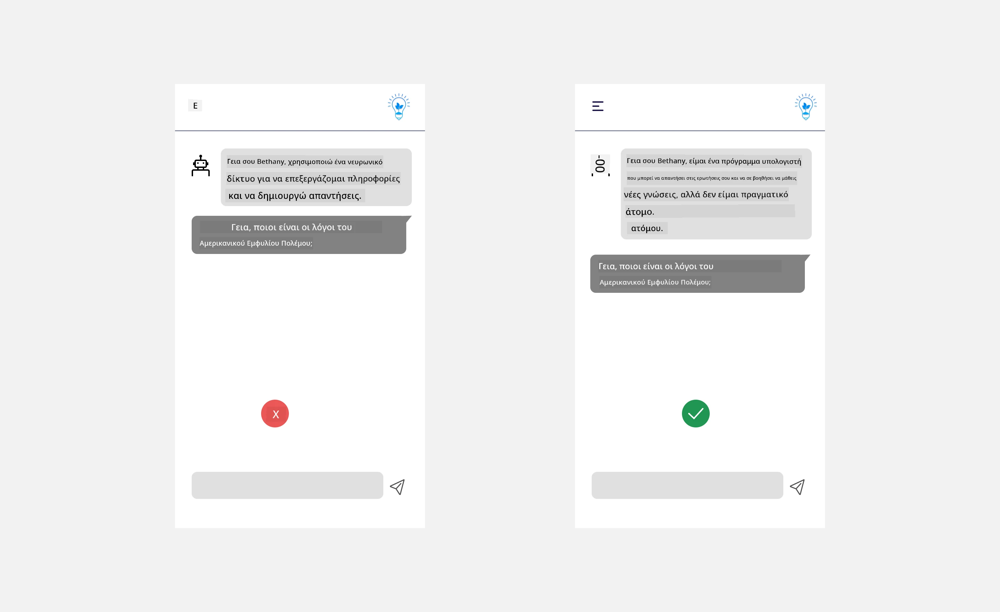
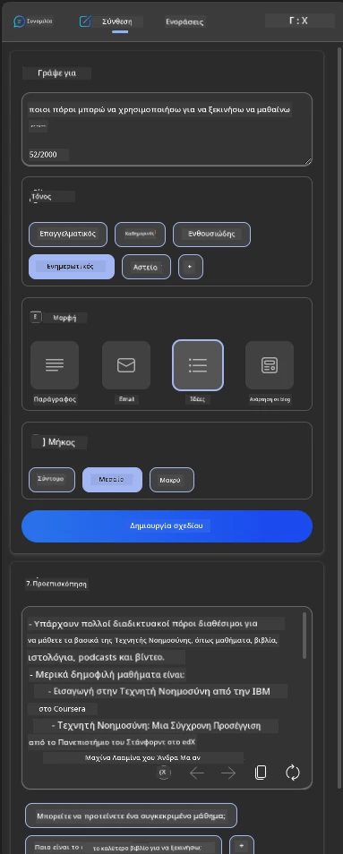
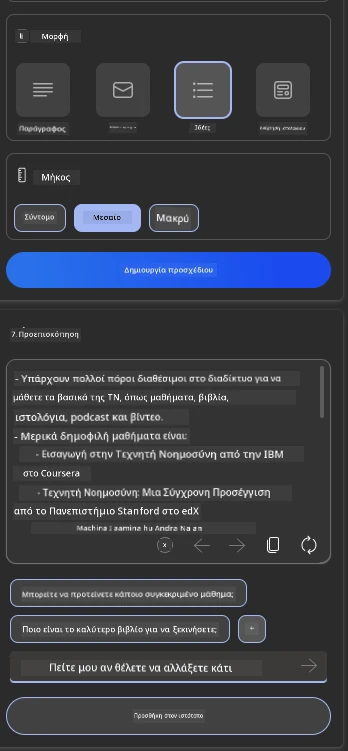
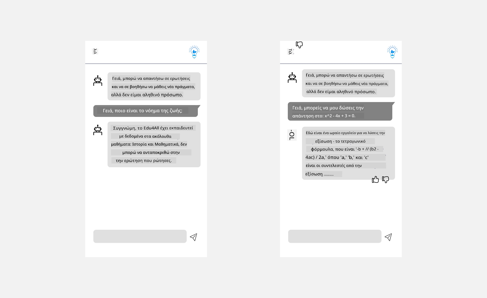

# Σχεδιασμός UX για Εφαρμογές Τεχνητής Νοημοσύνης

> _(Κάντε κλικ στην παραπάνω εικόνα για να δείτε το βίντεο αυτής της μαθήματος)_

Η εμπειρία χρήστη είναι μια πολύ σημαντική πτυχή της δημιουργίας εφαρμογών. Οι χρήστες χρειάζεται να μπορούν να χρησιμοποιούν την εφαρμογή σας αποτελεσματικά για να εκτελούν εργασίες. Η αποτελεσματικότητα είναι ένα ζήτημα, αλλά πρέπει επίσης να σχεδιάζετε εφαρμογές ώστε να μπορούν να χρησιμοποιηθούν από όλους, κάνοντάς τες _προσβάσιμες_. Αυτό το κεφάλαιο θα εστιάσει σε αυτή την περιοχή ώστε ελπίζουμε να καταλήξετε να σχεδιάσετε μια εφαρμογή που οι άνθρωποι μπορούν και θέλουν να χρησιμοποιούν.

## Εισαγωγή

Η εμπειρία χρήστη αναφέρεται σε πώς ένας χρήστης αλληλεπιδρά με και χρησιμοποιεί ένα συγκεκριμένο προϊόν ή υπηρεσία, είτε είναι σύστημα, εργαλείο ή σχεδιασμός. Όταν αναπτύσσονται εφαρμογές Τεχνητής Νοημοσύνης, οι προγραμματιστές εστιάζουν όχι μόνο στο να εξασφαλίσουν ότι η εμπειρία χρήστη είναι αποτελεσματική, αλλά και ηθική. Σε αυτό το μάθημα, καλύπτουμε το πώς να δημιουργήσετε εφαρμογές Τεχνητής Νοημοσύνης (AI) που ανταποκρίνονται στις ανάγκες των χρηστών.

Το μάθημα θα καλύψει τις ακόλουθες περιοχές:

- Εισαγωγή στην Εμπειρία Χρήστη και Κατανόηση των Αναγκών Χρήστη
- Σχεδιασμός Εφαρμογών AI για Εμπιστοσύνη και Διαφάνεια
- Σχεδιασμός Εφαρμογών AI για Συνεργασία και Ανατροφοδότηση

## Στόχοι μάθησης

Μετά από αυτό το μάθημα, θα μπορείτε να:

- Κατανοήσετε πώς να δημιουργείτε εφαρμογές AI που καλύπτουν τις ανάγκες των χρηστών.
- Σχεδιάζετε εφαρμογές AI που προάγουν την εμπιστοσύνη και τη συνεργασία.

### Προαπαιτούμενο

Αφιερώστε λίγο χρόνο και διαβάστε περισσότερα για την [εμπειρία χρήστη και το design thinking.](https://learn.microsoft.com/training/modules/ux-design?WT.mc_id=academic-105485-koreyst)

## Εισαγωγή στην Εμπειρία Χρήστη και Κατανόηση των Αναγκών Χρήστη

Στην υποθετική μας εκπαιδευτική startup, έχουμε δύο βασικούς χρήστες, δασκάλους και μαθητές. Κάθε ένας από τους δύο χρήστες έχει μοναδικές ανάγκες. Ο σχεδιασμός με επίκεντρο τον χρήστη δίνει προτεραιότητα στον χρήστη εξασφαλίζοντας ότι τα προϊόντα είναι σχετικά και ωφέλιμα για αυτούς για τους οποίους προορίζονται.

Η εφαρμογή πρέπει να είναι **χρήσιμη, αξιόπιστη, προσβάσιμη και ευχάριστη** για να παρέχει μια καλή εμπειρία χρήστη.

### Χρηστικότητα

Το να είναι χρήσιμη σημαίνει ότι η εφαρμογή διαθέτει λειτουργικότητα που ταιριάζει στο σκοπό για τον οποίο προορίζεται, όπως η αυτοματοποίηση της διαδικασίας αξιολόγησης ή η δημιουργία καρτών μνήμης για επανάληψη. Μια εφαρμογή που αυτοματοποιεί τη διαδικασία αξιολόγησης θα πρέπει να μπορεί να αναθέτει με ακρίβεια και αποτελεσματικότητα βαθμολογίες στα έργα των μαθητών βασισμένες σε προκαθορισμένα κριτήρια. Ομοίως, μια εφαρμογή που δημιουργεί κάρτες επανάληψης θα πρέπει να μπορεί να δημιουργεί σχετικά και διάφορα ερωτήματα βασισμένα στα δεδομένα της.

### Αξιοπιστία

Το να είναι αξιόπιστη σημαίνει ότι η εφαρμογή μπορεί να εκτελεί το έργο της σταθερά και χωρίς σφάλματα. Ωστόσο, η AI όπως και οι άνθρωποι δεν είναι τέλεια και μπορεί να είναι επιρρεπής σε σφάλματα. Οι εφαρμογές μπορεί να συναντήσουν σφάλματα ή απρόβλεπτες καταστάσεις που απαιτούν ανθρώπινη παρέμβαση ή διόρθωση. Πώς χειρίζεστε τα σφάλματα; Στο τελευταίο μέρος αυτού του μαθήματος θα καλύψουμε το πώς τα συστήματα και οι εφαρμογές AI σχεδιάζονται για συνεργασία και ανατροφοδότηση.

### Προσβασιμότητα

Το να είναι προσβάσιμη σημαίνει ότι επεκτείνει την εμπειρία χρήστη σε χρήστες με διάφορες ικανότητες, συμπεριλαμβανομένων αυτών με αναπηρίες, εξασφαλίζοντας ότι δεν μένει κανείς έξω. Ακολουθώντας κατευθυντήριες γραμμές και αρχές προσβασιμότητας, οι λύσεις AI γίνονται πιο συμπεριληπτικές, εύχρηστες και ωφέλιμες για όλους τους χρήστες.

### Ευχάριστη

Το να είναι ευχάριστη σημαίνει ότι η εφαρμογή είναι ευχάριστη στη χρήση. Μια ελκυστική εμπειρία χρήστη μπορεί να έχει θετικό αντίκτυπο στον χρήστη προτρέποντάς τον να επιστρέφει στην εφαρμογή και αυξάνοντας τα έσοδα της επιχείρησης.

Δεν μπορεί κάθε πρόκληση να λυθεί με την AI. Η AI έρχεται να ενισχύσει την εμπειρία του χρήστη, είτε αυτοματοποιώντας χειρωνακτικές εργασίες είτε προσωποποιώντας τις εμπειρίες χρήστη.

## Σχεδιασμός Εφαρμογών AI για Εμπιστοσύνη και Διαφάνεια

Η οικοδόμηση εμπιστοσύνης είναι κρίσιμη όταν σχεδιάζετε εφαρμογές AI. Η εμπιστοσύνη εξασφαλίζει ότι ο χρήστης είναι βέβαιος ότι η εφαρμογή θα ολοκληρώσει τη δουλειά, θα παραδίδει σταθερά αποτελέσματα και αυτά είναι όσα χρειάζεται ο χρήστης. Ένας κίνδυνος σε αυτή την περιοχή είναι η έλλειψη εμπιστοσύνης και η υπερ-εμπιστοσύνη. Η έλλειψη εμπιστοσύνης συμβαίνει όταν ένας χρήστης έχει λίγη ή καθόλου εμπιστοσύνη σε ένα σύστημα AI, το οποίο οδηγεί τον χρήστη να απορρίψει την εφαρμογή σας. Η υπερ-εμπιστοσύνη συμβαίνει όταν ένας χρήστης υπερεκτιμά τις δυνατότητες ενός συστήματος AI, οδηγώντας τους χρήστες να εμπιστεύονται υπερβολικά το σύστημα AI. Για παράδειγμα, ένα αυτοματοποιημένο σύστημα αξιολόγησης στη περίπτωση υπερ-εμπιστοσύνης μπορεί να οδηγήσει τον δάσκαλο να μην ελέγξει ορισμένα από τα χαρτιά, ώστε να διασφαλίσει ότι το σύστημα αξιολόγησης λειτουργεί σωστά. Αυτό θα μπορούσε να έχει ως αποτέλεσμα άδικους ή ανακριβείς βαθμούς για τους μαθητές ή χαμένες ευκαιρίες για ανατροφοδότηση και βελτίωση.

Δύο τρόποι για να εξασφαλιστεί ότι η εμπιστοσύνη βρίσκεται στο κέντρο του σχεδιασμού είναι η δυνατότητα εξήγησης και ο έλεγχος.

### Δυνατότητα Εξήγησης

Όταν η AI βοηθά στην ενημέρωση αποφάσεων όπως η μετάδοση γνώσης σε μελλοντικές γενιές, είναι κρίσιμο για τους δασκάλους και τους γονείς να κατανοούν πώς λαμβάνονται οι αποφάσεις της AI. Αυτό είναι η δυνατότητα εξήγησης - η κατανόηση του πώς οι εφαρμογές AI λαμβάνουν αποφάσεις. Ο σχεδιασμός για δυνατότητα εξήγησης περιλαμβάνει την προσθήκη λεπτομερειών που τονίζουν πώς η AI κατέληξε στο αποτέλεσμα. Το κοινό πρέπει να γνωρίζει ότι το αποτέλεσμα παράγεται από την AI και όχι από άνθρωπο. Για παράδειγμα, αντί για "Ξεκινήστε να συνομιλείτε με τον δάσκαλό σας τώρα" πείτε "Χρησιμοποιήστε τον AI δάσκαλο που προσαρμόζεται στις ανάγκες σας και σας βοηθά να μάθετε με το δικό σας ρυθμό."

Ένα άλλο παράδειγμα είναι πώς η AI χρησιμοποιεί δεδομένα χρηστών και προσωπικά δεδομένα. Για παράδειγμα, ένας χρήστης με τον ρόλο του μαθητή μπορεί να έχει περιορισμούς με βάση τον ρόλο του. Η AI μπορεί να μην μπορεί να αποκαλύψει απαντήσεις σε ερωτήσεις αλλά μπορεί να βοηθήσει τον χρήστη να σκεφτεί πώς μπορεί να λύσει ένα πρόβλημα.

Ένα τελευταίο βασικό μέρος της δυνατότητας εξήγησης είναι η απλοποίηση των εξηγήσεων. Οι μαθητές και οι δάσκαλοι μπορεί να μην είναι ειδικοί στην AI, επομένως οι εξηγήσεις για το τι μπορεί ή δεν μπορεί να κάνει η εφαρμογή πρέπει να είναι απλοποιημένες και εύκολα κατανοητές.

### Έλεγχος

Η Γενετική AI δημιουργεί μια συνεργασία μεταξύ AI και χρήστη, όπου για παράδειγμα ένας χρήστης μπορεί να τροποποιήσει τις εντολές για διαφορετικά αποτελέσματα. Επιπλέον, όταν παράγεται ένα αποτέλεσμα, οι χρήστες θα πρέπει να μπορούν να τροποποιούν τα αποτελέσματα δίνοντάς τους την αίσθηση ελέγχου. Για παράδειγμα, όταν χρησιμοποιείτε το Microsoft Copilot (πρώην Bing Chat), μπορείτε να προσαρμόσετε την εντολή σας βάσει μορφής, τόνου και μήκους. Επιπλέον, μπορείτε να προσθέσετε αλλαγές στο αποτέλεσμα και να το τροποποιήσετε όπως φαίνεται παρακάτω:

Ένα άλλο χαρακτηριστικό στο Microsoft Copilot που επιτρέπει σε έναν χρήστη να έχει έλεγχο πάνω στην εφαρμογή είναι η δυνατότητα να επιλέγει την είσοδο και την έξοδο από τα δεδομένα που χρησιμοποιεί η AI. Για μια σχολική εφαρμογή, ένας μαθητής μπορεί να θέλει να χρησιμοποιεί τις σημειώσεις του καθώς και τους πόρους των δασκάλων ως υλικό επανάληψης.

> Όταν σχεδιάζετε εφαρμογές AI, η σκόπιμη προσέγγιση είναι κλειδί για να διασφαλίσετε ότι οι χρήστες δεν υπερεμπιστεύονται δημιουργώντας μη ρεαλιστικές προσδοκίες για τις δυνατότητές της. Ένας τρόπος για να γίνει αυτό είναι δημιουργώντας τριβή μεταξύ των εντολών και των αποτελεσμάτων. Υπενθυμίζοντας στον χρήστη ότι αυτό είναι AI και όχι ένας άλλος άνθρωπος.

## Σχεδιασμός Εφαρμογών AI για Συνεργασία και Ανατροφοδότηση

Όπως αναφέρθηκε προηγουμένως, η γενετική AI δημιουργεί μια συνεργασία μεταξύ του χρήστη και της AI. Οι περισσότερες αλληλεπιδράσεις είναι με έναν χρήστη που εισάγει μια εντολή και η AI που παράγει ένα αποτέλεσμα. Τι γίνεται αν το αποτέλεσμα είναι λανθασμένο; Πώς χειρίζεται η εφαρμογή τα λάθη αν προκύψουν; Κατηγορεί η AI τον χρήστη ή αφιερώνει χρόνο για να εξηγήσει το λάθος;

Οι εφαρμογές AI πρέπει να σχεδιάζονται έτσι ώστε να λαμβάνουν και να δίνουν ανατροφοδότηση. Αυτό βοηθά όχι μόνο τη βελτίωση του συστήματος AI αλλά και οικοδομεί εμπιστοσύνη με τους χρήστες. Ένας κύκλος ανατροφοδότησης πρέπει να περιλαμβάνεται στο σχεδιασμό, ένα παράδειγμα μπορεί να είναι ένα απλό like ή dislike στο αποτέλεσμα.

Ένας άλλος τρόπος για να χειριστείτε αυτό είναι να επικοινωνείτε σαφώς τις δυνατότητες και τους περιορισμούς του συστήματος. Όταν ένας χρήστης κάνει ένα λάθος ζητώντας κάτι πέραν των δυνατοτήτων της AI, πρέπει επίσης να υπάρχει τρόπος να χειριστεί αυτήν την κατάσταση, όπως φαίνεται παρακάτω.

Τα σφάλματα συστήματος είναι κοινά σε εφαρμογές όπου ο χρήστης μπορεί να χρειαστεί βοήθεια με πληροφορίες εκτός του εύρους της AI ή η εφαρμογή μπορεί να έχει όριο στο πόσες ερωτήσεις/θέματα μπορεί να δημιουργήσει περίληψη ο χρήστης. Για παράδειγμα, μια εφαρμογή AI εκπαιδευμένη με δεδομένα σε περιορισμένα θέματα όπως Ιστορία και Μαθηματικά μπορεί να μην μπορεί να χειριστεί ερωτήσεις γύρω από τη Γεωγραφία. Για να μετριαστεί αυτό, το σύστημα AI μπορεί να δώσει απάντηση όπως: "Συγγνώμη, το προϊόν μας έχει εκπαιδευτεί με δεδομένα στα ακόλουθα θέματα....., δεν μπορώ να απαντήσω στην ερώτηση που κάνατε."

Οι εφαρμογές AI δεν είναι τέλειες, επομένως είναι αναπόφευκτο να κάνουν λάθη. Σχεδιάζοντας τις εφαρμογές σας, πρέπει να διασφαλίσετε ότι δημιουργείτε χώρο για ανατροφοδότηση από τους χρήστες και χειρισμό σφαλμάτων με τρόπο που είναι απλός και εύκολα επεξηγήσιμος.

## Ανάθεση

Πάρτε οποιαδήποτε εφαρμογή AI έχετε κατασκευάσει μέχρι τώρα και σκεφτείτε να εφαρμόσετε τα παρακάτω βήματα στην εφαρμογή σας:

- **Ευχάριστη:** Σκεφτείτε πώς μπορείτε να κάνετε την εφαρμογή σας πιο ευχάριστη. Προσθέτετε εξηγήσεις παντού; Ενθαρρύνετε τον χρήστη να εξερευνά; Πώς διατυπώνετε τα μηνύματα λάθους;

- **Χρηστικότητα:** Δημιουργία μιας web εφαρμογής. Βεβαιωθείτε ότι η εφαρμογή σας είναι πλοηγήσιμη τόσο με ποντίκι όσο και με πληκτρολόγιο.

- **Εμπιστοσύνη και διαφάνεια:** Μην εμπιστεύεστε πλήρως την AI και τα αποτελέσματά της, σκεφτείτε πώς θα προσθέτατε έναν άνθρωπο στη διαδικασία για να επαληθεύσει το αποτέλεσμα. Επίσης, σκεφτείτε και εφαρμόστε άλλους τρόπους για την επίτευξη εμπιστοσύνης και διαφάνειας.

- **Έλεγχος:** Δώστε στον χρήστη τον έλεγχο των δεδομένων που παρέχει στην εφαρμογή. Υλοποιήστε έναν τρόπο ώστε ο χρήστης να μπορεί να επιλέγει την ένταξη και έξοδο από τη συλλογή δεδομένων στην εφαρμογή AI.

<!-- ## [Post-lecture quiz](../../../12-designing-ux-for-ai-applications/quiz-url) -->

## Συνεχίστε τη Μάθησή σας!

Αφού ολοκληρώσετε αυτό το μάθημα, δείτε τη [συλλογή μάθησης για Γενετική AI](https://aka.ms/genai-collection?WT.mc_id=academic-105485-koreyst) για να συνεχίσετε να ανεβάζετε το επίπεδο της γνώσης σας στη Γενετική AI!

Μεταβείτε στο Μάθημα 13, όπου θα δούμε πώς να [ασφαλίζουμε τις εφαρμογές AI](../13-securing-ai-applications/README.md?WT.mc_id=academic-105485-koreyst)!

---

<!-- CO-OP TRANSLATOR DISCLAIMER START -->
**Αποποίηση ευθυνών**:
Αυτό το έγγραφο έχει μεταφραστεί χρησιμοποιώντας την υπηρεσία μετάφρασης με τεχνητή νοημοσύνη [Co-op Translator](https://github.com/Azure/co-op-translator). Ενώ επιδιώκουμε την ακρίβεια, παρακαλούμε να έχετε υπόψη ότι οι αυτοματοποιημένες μεταφράσεις ενδέχεται να περιέχουν λάθη ή ανακρίβειες. Το πρωτότυπο έγγραφο στη μητρική του γλώσσα πρέπει να θεωρείται η αυθεντική πηγή. Για κρίσιμες πληροφορίες, συνιστάται επαγγελματική ανθρώπινη μετάφραση. Δεν φέρουμε ευθύνη για τυχόν παρεξηγήσεις ή λανθασμένες ερμηνείες που προκύπτουν από τη χρήση αυτής της μετάφρασης.
<!-- CO-OP TRANSLATOR DISCLAIMER END -->