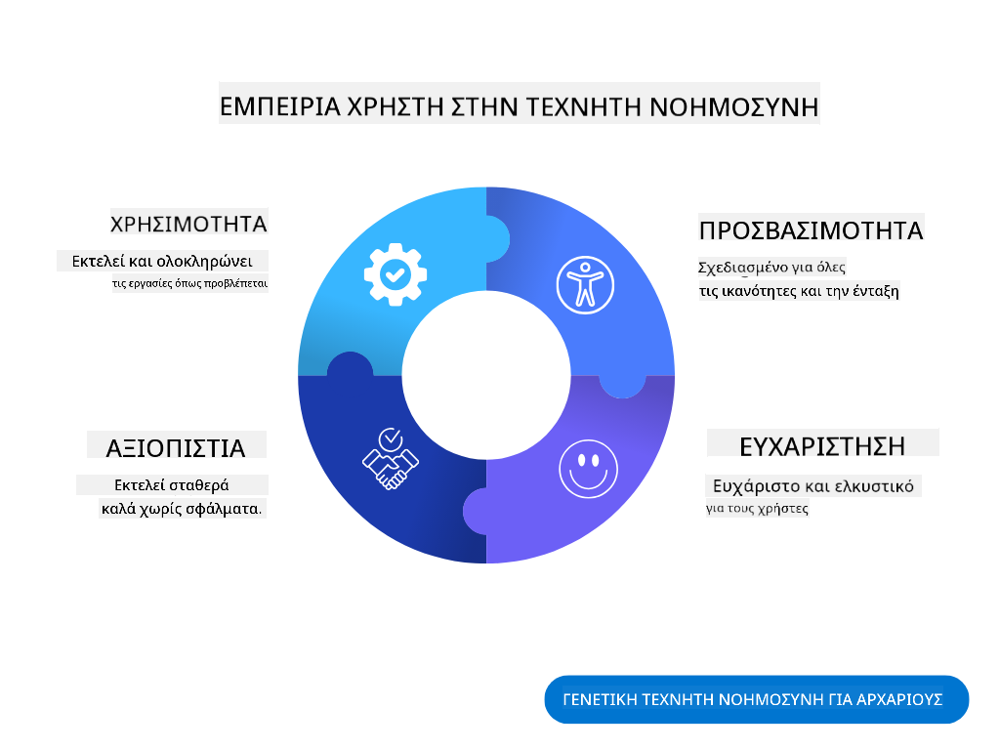
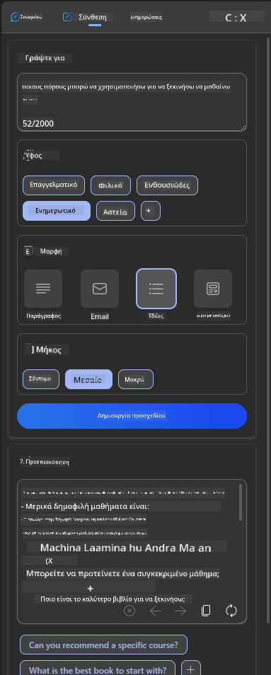

<!--
CO_OP_TRANSLATOR_METADATA:
{
  "original_hash": "ec385b41ee50579025d50cc03bfb3a25",
  "translation_date": "2025-07-09T14:57:40+00:00",
  "source_file": "12-designing-ux-for-ai-applications/README.md",
  "language_code": "el"
}
-->
# Σχεδιασμός UX για Εφαρμογές Τεχνητής Νοημοσύνης

> _(Κάντε κλικ στην εικόνα παραπάνω για να δείτε το βίντεο αυτής της ενότητας)_

Η εμπειρία χρήστη είναι μια πολύ σημαντική πτυχή στην ανάπτυξη εφαρμογών. Οι χρήστες πρέπει να μπορούν να χρησιμοποιούν την εφαρμογή σας με αποδοτικό τρόπο για να εκτελούν εργασίες. Η αποδοτικότητα είναι σημαντική, αλλά χρειάζεται επίσης να σχεδιάζετε εφαρμογές που να μπορούν να χρησιμοποιηθούν από όλους, ώστε να είναι _προσβάσιμες_. Αυτό το κεφάλαιο εστιάζει σε αυτόν τον τομέα, με στόχο να καταλήξετε σε μια εφαρμογή που οι άνθρωποι μπορούν και θέλουν να χρησιμοποιούν.

## Εισαγωγή

Η εμπειρία χρήστη είναι ο τρόπος με τον οποίο ένας χρήστης αλληλεπιδρά και χρησιμοποιεί ένα συγκεκριμένο προϊόν ή υπηρεσία, είτε πρόκειται για σύστημα, εργαλείο ή σχεδιασμό. Κατά την ανάπτυξη εφαρμογών Τεχνητής Νοημοσύνης, οι προγραμματιστές δεν εστιάζουν μόνο στο να διασφαλίσουν ότι η εμπειρία χρήστη είναι αποτελεσματική, αλλά και ηθική. Σε αυτή την ενότητα, καλύπτουμε πώς να δημιουργήσετε εφαρμογές Τεχνητής Νοημοσύνης (AI) που ανταποκρίνονται στις ανάγκες των χρηστών.

Η ενότητα θα καλύψει τα εξής θέματα:

- Εισαγωγή στην Εμπειρία Χρήστη και Κατανόηση των Αναγκών των Χρηστών  
- Σχεδιασμός Εφαρμογών AI για Εμπιστοσύνη και Διαφάνεια  
- Σχεδιασμός Εφαρμογών AI για Συνεργασία και Ανατροφοδότηση  

## Στόχοι μάθησης

Μετά την ολοκλήρωση αυτής της ενότητας, θα μπορείτε να:

- Κατανοείτε πώς να δημιουργείτε εφαρμογές AI που καλύπτουν τις ανάγκες των χρηστών.  
- Σχεδιάζετε εφαρμογές AI που προάγουν την εμπιστοσύνη και τη συνεργασία.  

### Προαπαιτούμενα

Αφιερώστε λίγο χρόνο και διαβάστε περισσότερα για την [εμπειρία χρήστη και το design thinking.](https://learn.microsoft.com/training/modules/ux-design?WT.mc_id=academic-105485-koreyst)

## Εισαγωγή στην Εμπειρία Χρήστη και Κατανόηση των Αναγκών των Χρηστών

Στην υποθετική μας εκπαιδευτική startup, έχουμε δύο βασικούς χρήστες, τους δασκάλους και τους μαθητές. Κάθε ομάδα χρηστών έχει μοναδικές ανάγκες. Ο σχεδιασμός που εστιάζει στον χρήστη δίνει προτεραιότητα στον ίδιο, διασφαλίζοντας ότι τα προϊόντα είναι σχετικά και ωφέλιμα για αυτούς που απευθύνονται.

Η εφαρμογή πρέπει να είναι **χρήσιμη, αξιόπιστη, προσβάσιμη και ευχάριστη** για να προσφέρει μια καλή εμπειρία χρήστη.

### Ευχρηστία

Το να είναι χρήσιμη σημαίνει ότι η εφαρμογή διαθέτει λειτουργίες που ταιριάζουν στον σκοπό της, όπως η αυτοματοποίηση της διαδικασίας βαθμολόγησης ή η δημιουργία καρτών επανάληψης. Μια εφαρμογή που αυτοματοποιεί τη βαθμολόγηση πρέπει να μπορεί να αναθέτει με ακρίβεια και αποδοτικότητα βαθμούς στα έργα των μαθητών βάσει προκαθορισμένων κριτηρίων. Ομοίως, μια εφαρμογή που δημιουργεί κάρτες επανάληψης πρέπει να παράγει σχετικές και ποικίλες ερωτήσεις με βάση τα δεδομένα της.

### Αξιοπιστία

Το να είναι αξιόπιστη σημαίνει ότι η εφαρμογή μπορεί να εκτελεί τη λειτουργία της σταθερά και χωρίς σφάλματα. Ωστόσο, η AI, όπως και οι άνθρωποι, δεν είναι τέλεια και μπορεί να κάνει λάθη. Οι εφαρμογές μπορεί να αντιμετωπίσουν σφάλματα ή απρόβλεπτες καταστάσεις που απαιτούν ανθρώπινη παρέμβαση ή διόρθωση. Πώς διαχειρίζεστε τα σφάλματα; Στο τελευταίο μέρος αυτής της ενότητας, θα δούμε πώς τα συστήματα και οι εφαρμογές AI σχεδιάζονται για συνεργασία και ανατροφοδότηση.

### Προσβασιμότητα

Το να είναι προσβάσιμη σημαίνει να επεκτείνει την εμπειρία χρήστη σε άτομα με διάφορες ικανότητες, συμπεριλαμβανομένων αυτών με αναπηρίες, διασφαλίζοντας ότι κανείς δεν μένει εκτός. Ακολουθώντας τις οδηγίες και τις αρχές προσβασιμότητας, οι λύσεις AI γίνονται πιο περιεκτικές, εύχρηστες και ωφέλιμες για όλους τους χρήστες.

### Ευχάριστη

Το να είναι ευχάριστη σημαίνει ότι η εφαρμογή είναι απολαυστική στη χρήση. Μια ελκυστική εμπειρία χρήστη μπορεί να έχει θετικό αντίκτυπο, ενθαρρύνοντας τον χρήστη να επιστρέψει στην εφαρμογή και αυξάνοντας τα έσοδα της επιχείρησης.

Δεν μπορεί κάθε πρόκληση να λυθεί με AI. Η AI έρχεται να ενισχύσει την εμπειρία χρήστη, είτε αυτοματοποιώντας χειροκίνητες εργασίες, είτε εξατομικεύοντας τις εμπειρίες.

## Σχεδιασμός Εφαρμογών AI για Εμπιστοσύνη και Διαφάνεια

Η οικοδόμηση εμπιστοσύνης είναι κρίσιμη κατά το σχεδιασμό εφαρμογών AI. Η εμπιστοσύνη διασφαλίζει ότι ο χρήστης είναι βέβαιος πως η εφαρμογή θα ολοκληρώσει τη δουλειά, θα παραδίδει αποτελέσματα σταθερά και τα αποτελέσματα είναι αυτά που χρειάζεται. Κίνδυνοι σε αυτόν τον τομέα είναι η έλλειψη εμπιστοσύνης και η υπερβολική εμπιστοσύνη. Η έλλειψη εμπιστοσύνης συμβαίνει όταν ο χρήστης δεν εμπιστεύεται καθόλου το σύστημα AI, οδηγώντας τον να απορρίψει την εφαρμογή σας. Η υπερβολική εμπιστοσύνη συμβαίνει όταν ο χρήστης υπερεκτιμά τις δυνατότητες του AI, με αποτέλεσμα να εμπιστεύεται υπερβολικά το σύστημα. Για παράδειγμα, ένα αυτοματοποιημένο σύστημα βαθμολόγησης σε περίπτωση υπερβολικής εμπιστοσύνης μπορεί να οδηγήσει τον δάσκαλο να μην ελέγξει κάποια γραπτά, με αποτέλεσμα άδικους ή ανακριβείς βαθμούς ή χαμένες ευκαιρίες για ανατροφοδότηση και βελτίωση.

Δύο τρόποι για να διασφαλίσετε ότι η εμπιστοσύνη βρίσκεται στο επίκεντρο του σχεδιασμού είναι η εξηγήσιμότητα και ο έλεγχος.

### Εξηγήσιμότητα

Όταν η AI βοηθά στη λήψη αποφάσεων, όπως η μετάδοση γνώσης στις μελλοντικές γενιές, είναι κρίσιμο για τους δασκάλους και τους γονείς να κατανοούν πώς λαμβάνονται οι αποφάσεις από την AI. Αυτή είναι η εξηγήσιμότητα - η κατανόηση του πώς οι εφαρμογές AI παίρνουν αποφάσεις. Ο σχεδιασμός για εξηγήσιμότητα περιλαμβάνει την προσθήκη παραδειγμάτων για το τι μπορεί να κάνει μια εφαρμογή AI. Για παράδειγμα, αντί για "Ξεκινήστε με τον AI δάσκαλο", το σύστημα μπορεί να χρησιμοποιεί: "Συνοψίστε τις σημειώσεις σας για ευκολότερη επανάληψη με τη βοήθεια της AI."

Ένα άλλο παράδειγμα είναι πώς η AI χρησιμοποιεί δεδομένα χρήστη και προσωπικά δεδομένα. Για παράδειγμα, ένας χρήστης με το προφίλ μαθητή μπορεί να έχει περιορισμούς βάσει του προφίλ του. Η AI μπορεί να μην αποκαλύπτει απαντήσεις σε ερωτήσεις, αλλά να βοηθά τον χρήστη να σκεφτεί πώς μπορεί να λύσει ένα πρόβλημα.

Ένα τελευταίο σημαντικό στοιχείο της εξηγήσιμότητας είναι η απλοποίηση των εξηγήσεων. Οι μαθητές και οι δάσκαλοι μπορεί να μην είναι ειδικοί στην AI, γι’ αυτό οι εξηγήσεις για το τι μπορεί ή δεν μπορεί να κάνει η εφαρμογή πρέπει να είναι απλές και εύκολα κατανοητές.

### Έλεγχος

Η γενετική AI δημιουργεί μια συνεργασία μεταξύ AI και χρήστη, όπου για παράδειγμα ο χρήστης μπορεί να τροποποιεί τα prompts για διαφορετικά αποτελέσματα. Επιπλέον, μόλις παραχθεί ένα αποτέλεσμα, οι χρήστες πρέπει να μπορούν να το τροποποιούν, δίνοντάς τους αίσθηση ελέγχου. Για παράδειγμα, όταν χρησιμοποιείτε το Bing, μπορείτε να προσαρμόσετε το prompt σας βάσει μορφής, τόνου και μήκους. Επιπλέον, μπορείτε να προσθέσετε αλλαγές στο αποτέλεσμα και να το τροποποιήσετε όπως φαίνεται παρακάτω:

Μια ακόμα λειτουργία στο Bing που επιτρέπει στον χρήστη να έχει έλεγχο στην εφαρμογή είναι η δυνατότητα να επιλέγει αν θα συμμετέχει ή όχι στη συλλογή δεδομένων που χρησιμοποιεί η AI. Για μια σχολική εφαρμογή, ένας μαθητής μπορεί να θέλει να χρησιμοποιεί τις σημειώσεις του καθώς και τους πόρους των δασκάλων ως υλικό επανάληψης.

> Κατά το σχεδιασμό εφαρμογών AI, η πρόθεση είναι το κλειδί για να διασφαλιστεί ότι οι χρήστες δεν θα έχουν υπερβολική εμπιστοσύνη, δημιουργώντας μη ρεαλιστικές προσδοκίες για τις δυνατότητές της. Ένας τρόπος για να γίνει αυτό είναι να δημιουργηθεί μια αντίσταση ανάμεσα στα prompts και τα αποτελέσματα, υπενθυμίζοντας στον χρήστη ότι πρόκειται για AI και όχι για έναν συνάνθρωπο.

## Σχεδιασμός Εφαρμογών AI για Συνεργασία και Ανατροφοδότηση

Όπως αναφέρθηκε νωρίτερα, η γενετική AI δημιουργεί μια συνεργασία μεταξύ χρήστη και AI. Οι περισσότερες αλληλεπιδράσεις γίνονται με τον χρήστη να εισάγει ένα prompt και την AI να παράγει ένα αποτέλεσμα. Τι γίνεται αν το αποτέλεσμα είναι λάθος; Πώς διαχειρίζεται η εφαρμογή τα σφάλματα αν προκύψουν; Κατηγορεί η AI τον χρήστη ή αφιερώνει χρόνο να εξηγήσει το σφάλμα;

Οι εφαρμογές AI πρέπει να σχεδιάζονται ώστε να λαμβάνουν και να δίνουν ανατροφοδότηση. Αυτό όχι μόνο βοηθά το σύστημα AI να βελτιωθεί, αλλά και χτίζει εμπιστοσύνη με τους χρήστες. Ένας μηχανισμός ανατροφοδότησης πρέπει να περιλαμβάνεται στο σχεδιασμό, για παράδειγμα ένα απλό «thumbs up» ή «thumbs down» στο αποτέλεσμα.

Ένας άλλος τρόπος διαχείρισης είναι η σαφής επικοινωνία των δυνατοτήτων και των περιορισμών του συστήματος. Όταν ένας χρήστης κάνει λάθος ζητώντας κάτι πέρα από τις δυνατότητες της AI, πρέπει να υπάρχει τρόπος να το διαχειριστεί, όπως φαίνεται παρακάτω.

Τα σφάλματα συστήματος είναι συνηθισμένα σε εφαρμογές όπου ο χρήστης μπορεί να χρειάζεται βοήθεια με πληροφορίες εκτός του πεδίου της AI ή η εφαρμογή μπορεί να έχει όριο στον αριθμό ερωτήσεων/θεμάτων για τα οποία μπορεί να δημιουργήσει περιλήψεις. Για παράδειγμα, μια εφαρμογή AI εκπαιδευμένη με δεδομένα σε περιορισμένα θέματα, όπως Ιστορία και Μαθηματικά, μπορεί να μην μπορεί να διαχειριστεί ερωτήσεις σχετικά με τη Γεωγραφία. Για να το αντιμετωπίσει αυτό, το σύστημα AI μπορεί να δώσει μια απάντηση όπως: "Λυπούμαστε, το προϊόν μας έχει εκπαιδευτεί με δεδομένα στα ακόλουθα θέματα..., δεν μπορώ να απαντήσω στην ερώτηση που κάνατε."

Οι εφαρμογές AI δεν είναι τέλειες, γι’ αυτό είναι αναπόφευκτο να κάνουν λάθη. Κατά το σχεδιασμό των εφαρμογών σας, πρέπει να διασφαλίσετε ότι υπάρχει χώρος για ανατροφοδότηση από τους χρήστες και διαχείριση σφαλμάτων με τρόπο απλό και εύκολα κατανοητό.

## Άσκηση

Πάρτε οποιεσδήποτε εφαρμογές AI έχετε δημιουργήσει μέχρι τώρα και σκεφτείτε να εφαρμόσετε τα παρακάτω βήματα στην εφαρμογή σας:

- **Ευχάριστη:** Σκεφτείτε πώς μπορείτε να κάνετε την εφαρμογή σας πιο ευχάριστη. Προσθέτετε εξηγήσεις παντού; Ενθαρρύνετε τον χρήστη να εξερευνήσει; Πώς διατυπώνετε τα μηνύματα σφάλματος;

- **Ευχρηστία:** Δημιουργείτε μια web εφαρμογή. Βεβαιωθείτε ότι η εφαρμογή σας είναι προσβάσιμη τόσο με ποντίκι όσο και με πληκτρολόγιο.

- **Εμπιστοσύνη και διαφάνεια:** Μην εμπιστεύεστε την AI και τα αποτελέσματά της απόλυτα. Σκεφτείτε πώς θα προσθέτατε έναν άνθρωπο στη διαδικασία για να επαληθεύει τα αποτελέσματα. Επίσης, σκεφτείτε και εφαρμόστε άλλους τρόπους για να επιτύχετε εμπιστοσύνη και διαφάνεια.

- **Έλεγχος:** Δώστε στον χρήστη τον έλεγχο των δεδομένων που παρέχει στην εφαρμογή. Υλοποιήστε έναν τρόπο ώστε ο χρήστης να μπορεί να επιλέγει αν θα συμμετέχει ή όχι στη συλλογή δεδομένων στην εφαρμογή AI.

## Συνεχίστε τη Μάθησή σας!

Μετά την ολοκλήρωση αυτής της ενότητας, ρίξτε μια ματιά στη [Συλλογή Μαθημάτων για Γενετική AI](https://aka.ms/genai-collection?WT.mc_id=academic-105485-koreyst) για να συνεχίσετε να αναβαθμίζετε τις γνώσεις σας στην Γενετική AI!

Πηγαίνετε στην Ενότητα 13, όπου θα δούμε πώς να [ασφαλίζουμε τις εφαρμογές AI](../13-securing-ai-applications/README.md?WT.mc_id=academic-105485-koreyst)!

**Αποποίηση ευθυνών**:  
Αυτό το έγγραφο έχει μεταφραστεί χρησιμοποιώντας την υπηρεσία αυτόματης μετάφρασης AI [Co-op Translator](https://github.com/Azure/co-op-translator). Παρόλο που επιδιώκουμε την ακρίβεια, παρακαλούμε να γνωρίζετε ότι οι αυτόματες μεταφράσεις ενδέχεται να περιέχουν λάθη ή ανακρίβειες. Το πρωτότυπο έγγραφο στη γλώσσα του θεωρείται η αυθεντική πηγή. Για κρίσιμες πληροφορίες, συνιστάται επαγγελματική ανθρώπινη μετάφραση. Δεν φέρουμε ευθύνη για τυχόν παρεξηγήσεις ή λανθασμένες ερμηνείες που προκύπτουν από τη χρήση αυτής της μετάφρασης.