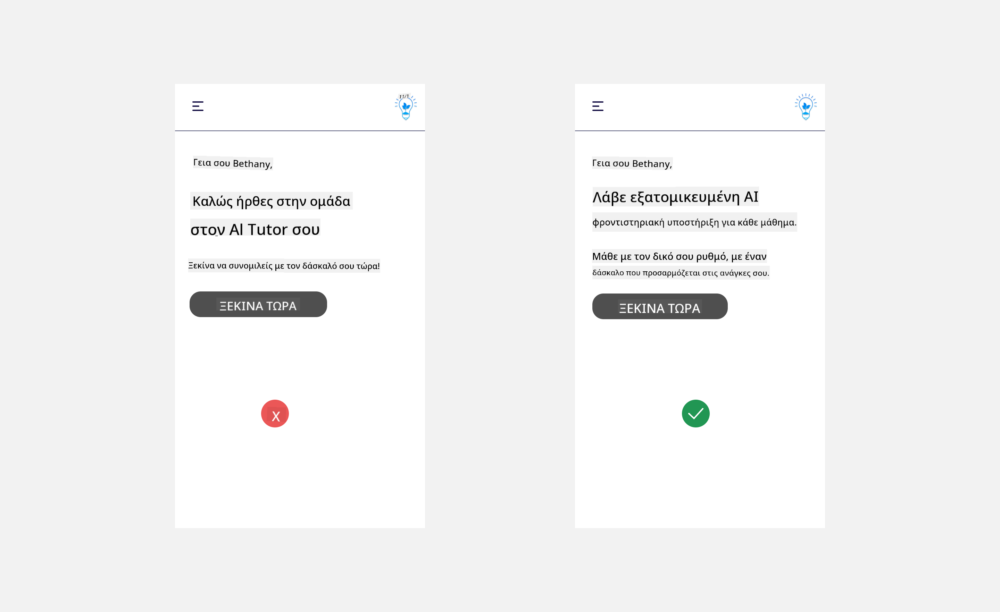

<!--
CO_OP_TRANSLATOR_METADATA:
{
  "original_hash": "78bbeed50fd4dc9fdee931f5daf98cb3",
  "translation_date": "2025-10-17T18:16:56+00:00",
  "source_file": "12-designing-ux-for-ai-applications/README.md",
  "language_code": "el"
}
-->
# Σχεδιασμός UX για Εφαρμογές AI

> _(Κάντε κλικ στην παραπάνω εικόνα για να δείτε το βίντεο αυτού του μαθήματος)_

Η εμπειρία χρήστη είναι μια πολύ σημαντική πτυχή της δημιουργίας εφαρμογών. Οι χρήστες πρέπει να μπορούν να χρησιμοποιούν την εφαρμογή σας με αποτελεσματικό τρόπο για να εκτελούν εργασίες. Η αποτελεσματικότητα είναι ένα πράγμα, αλλά πρέπει επίσης να σχεδιάσετε εφαρμογές ώστε να μπορούν να χρησιμοποιηθούν από όλους, κάνοντάς τες _προσβάσιμες_. Αυτό το κεφάλαιο επικεντρώνεται σε αυτόν τον τομέα, ώστε να καταλήξετε να σχεδιάσετε μια εφαρμογή που οι άνθρωποι μπορούν και θέλουν να χρησιμοποιήσουν.

## Εισαγωγή

Η εμπειρία χρήστη αφορά τον τρόπο με τον οποίο ένας χρήστης αλληλεπιδρά και χρησιμοποιεί ένα συγκεκριμένο προϊόν ή υπηρεσία, είτε πρόκειται για σύστημα, εργαλείο ή σχεδιασμό. Κατά την ανάπτυξη εφαρμογών AI, οι προγραμματιστές δεν εστιάζουν μόνο στη διασφάλιση της αποτελεσματικής εμπειρίας χρήστη αλλά και της ηθικής. Σε αυτό το μάθημα, καλύπτουμε πώς να δημιουργήσετε εφαρμογές Τεχνητής Νοημοσύνης (AI) που ανταποκρίνονται στις ανάγκες των χρηστών.

Το μάθημα θα καλύψει τους εξής τομείς:

- Εισαγωγή στην Εμπειρία Χρήστη και Κατανόηση των Αναγκών των Χρηστών
- Σχεδιασμός Εφαρμογών AI για Εμπιστοσύνη και Διαφάνεια
- Σχεδιασμός Εφαρμογών AI για Συνεργασία και Ανατροφοδότηση

## Στόχοι μάθησης

Μετά την ολοκλήρωση αυτού του μαθήματος, θα μπορείτε:

- Να κατανοείτε πώς να δημιουργείτε εφαρμογές AI που ανταποκρίνονται στις ανάγκες των χρηστών.
- Να σχεδιάζετε εφαρμογές AI που προάγουν την εμπιστοσύνη και τη συνεργασία.

### Προαπαιτούμενα

Αφιερώστε λίγο χρόνο και διαβάστε περισσότερα για την [εμπειρία χρήστη και τη σχεδιαστική σκέψη.](https://learn.microsoft.com/training/modules/ux-design?WT.mc_id=academic-105485-koreyst)

## Εισαγωγή στην Εμπειρία Χρήστη και Κατανόηση των Αναγκών των Χρηστών

Στην υποθετική εκπαιδευτική μας startup, έχουμε δύο κύριους χρήστες, τους δασκάλους και τους μαθητές. Κάθε ένας από τους δύο χρήστες έχει μοναδικές ανάγκες. Ένας σχεδιασμός που επικεντρώνεται στον χρήστη δίνει προτεραιότητα στον χρήστη, διασφαλίζοντας ότι τα προϊόντα είναι σχετικά και ωφέλιμα για αυτούς που προορίζονται.

Η εφαρμογή θα πρέπει να είναι **χρήσιμη, αξιόπιστη, προσβάσιμη και ευχάριστη** για να παρέχει μια καλή εμπειρία χρήστη.

### Χρησιμότητα

Το να είναι χρήσιμη σημαίνει ότι η εφαρμογή έχει λειτουργικότητα που ταιριάζει στον σκοπό της, όπως η αυτοματοποίηση της διαδικασίας βαθμολόγησης ή η δημιουργία καρτών επανάληψης. Μια εφαρμογή που αυτοματοποιεί τη διαδικασία βαθμολόγησης θα πρέπει να μπορεί να αποδίδει βαθμούς με ακρίβεια και αποτελεσματικότητα στη δουλειά των μαθητών βάσει προκαθορισμένων κριτηρίων. Παρομοίως, μια εφαρμογή που δημιουργεί κάρτες επανάληψης θα πρέπει να μπορεί να δημιουργεί σχετικές και ποικίλες ερωτήσεις βάσει των δεδομένων της.

### Αξιοπιστία

Το να είναι αξιόπιστη σημαίνει ότι η εφαρμογή μπορεί να εκτελεί την εργασία της με συνέπεια και χωρίς σφάλματα. Ωστόσο, η AI, όπως και οι άνθρωποι, δεν είναι τέλεια και μπορεί να είναι επιρρεπής σε λάθη. Οι εφαρμογές μπορεί να αντιμετωπίσουν σφάλματα ή απρόβλεπτες καταστάσεις που απαιτούν ανθρώπινη παρέμβαση ή διόρθωση. Πώς αντιμετωπίζετε τα λάθη; Στην τελευταία ενότητα αυτού του μαθήματος, θα καλύψουμε πώς τα συστήματα και οι εφαρμογές AI σχεδιάζονται για συνεργασία και ανατροφοδότηση.

### Προσβασιμότητα

Το να είναι προσβάσιμη σημαίνει να επεκτείνεται η εμπειρία χρήστη σε χρήστες με διάφορες ικανότητες, συμπεριλαμβανομένων αυτών με αναπηρίες, διασφαλίζοντας ότι κανείς δεν μένει εκτός. Ακολουθώντας τις κατευθυντήριες γραμμές και τις αρχές προσβασιμότητας, οι λύσεις AI γίνονται πιο περιεκτικές, χρήσιμες και ωφέλιμες για όλους τους χρήστες.

### Ευχάριστη

Το να είναι ευχάριστη σημαίνει ότι η εφαρμογή είναι απολαυστική στη χρήση. Μια ελκυστική εμπειρία χρήστη μπορεί να έχει θετική επίδραση στον χρήστη, ενθαρρύνοντάς τον να επιστρέψει στην εφαρμογή και αυξάνοντας τα έσοδα της επιχείρησης.

Δεν μπορούν να λυθούν όλες οι προκλήσεις με την AI. Η AI έρχεται να ενισχύσει την εμπειρία χρήστη, είτε αυτοματοποιώντας χειροκίνητες εργασίες είτε εξατομικεύοντας τις εμπειρίες των χρηστών.

## Σχεδιασμός Εφαρμογών AI για Εμπιστοσύνη και Διαφάνεια

Η οικοδόμηση εμπιστοσύνης είναι κρίσιμη κατά τον σχεδιασμό εφαρμογών AI. Η εμπιστοσύνη διασφαλίζει ότι ο χρήστης είναι σίγουρος πως η εφαρμογή θα ολοκληρώσει την εργασία, θα παρέχει αποτελέσματα με συνέπεια και τα αποτελέσματα θα είναι αυτά που χρειάζεται ο χρήστης. Ένας κίνδυνος σε αυτόν τον τομέα είναι η έλλειψη εμπιστοσύνης και η υπερβολική εμπιστοσύνη. Η έλλειψη εμπιστοσύνης συμβαίνει όταν ένας χρήστης έχει λίγη ή καθόλου εμπιστοσύνη σε ένα σύστημα AI, γεγονός που οδηγεί τον χρήστη να απορρίψει την εφαρμογή σας. Η υπερβολική εμπιστοσύνη συμβαίνει όταν ένας χρήστης υπερεκτιμά τις δυνατότητες ενός συστήματος AI, οδηγώντας τους χρήστες να εμπιστεύονται υπερβολικά το σύστημα AI. Για παράδειγμα, ένα αυτοματοποιημένο σύστημα βαθμολόγησης στην περίπτωση υπερβολικής εμπιστοσύνης μπορεί να οδηγήσει τον δάσκαλο να μην ελέγξει ορισμένα γραπτά για να διασφαλίσει ότι το σύστημα βαθμολόγησης λειτουργεί σωστά. Αυτό θα μπορούσε να οδηγήσει σε άδικους ή ανακριβείς βαθμούς για τους μαθητές ή σε χαμένες ευκαιρίες για ανατροφοδότηση και βελτίωση.

Δύο τρόποι για να διασφαλίσετε ότι η εμπιστοσύνη βρίσκεται στο επίκεντρο του σχεδιασμού είναι η εξηγησιμότητα και ο έλεγχος.

### Εξηγησιμότητα

Όταν η AI βοηθά στη λήψη αποφάσεων, όπως η μετάδοση γνώσεων στις επόμενες γενιές, είναι κρίσιμο για τους δασκάλους και τους γονείς να κατανοήσουν πώς λαμβάνονται οι αποφάσεις της AI. Αυτή είναι η εξηγησιμότητα - η κατανόηση του πώς οι εφαρμογές AI λαμβάνουν αποφάσεις. Ο σχεδιασμός για εξηγησιμότητα περιλαμβάνει την προσθήκη λεπτομερειών που αναδεικνύουν πώς η AI κατέληξε στο αποτέλεσμα. Το κοινό πρέπει να γνωρίζει ότι το αποτέλεσμα δημιουργείται από την AI και όχι από άνθρωπο. Για παράδειγμα, αντί να λέτε "Ξεκινήστε να συνομιλείτε με τον δάσκαλό σας τώρα", πείτε "Χρησιμοποιήστε τον AI δάσκαλο που προσαρμόζεται στις ανάγκες σας και σας βοηθά να μάθετε με τον δικό σας ρυθμό."

Ένα άλλο παράδειγμα είναι πώς η AI χρησιμοποιεί δεδομένα χρηστών και προσωπικά δεδομένα. Για παράδειγμα, ένας χρήστης με την περσόνα του μαθητή μπορεί να έχει περιορισμούς βάσει της περσόνας του. Η AI μπορεί να μην είναι σε θέση να αποκαλύψει απαντήσεις σε ερωτήσεις, αλλά μπορεί να βοηθήσει τον χρήστη να σκεφτεί πώς να λύσει ένα πρόβλημα.

Ένα τελευταίο βασικό μέρος της εξηγησιμότητας είναι η απλοποίηση των εξηγήσεων. Οι μαθητές και οι δάσκαλοι μπορεί να μην είναι ειδικοί στην AI, επομένως οι εξηγήσεις για το τι μπορεί ή δεν μπορεί να κάνει η εφαρμογή θα πρέπει να είναι απλές και εύκολα κατανοητές.

### Έλεγχος

Η γενετική AI δημιουργεί μια συνεργασία μεταξύ της AI και του χρήστη, όπου για παράδειγμα ένας χρήστης μπορεί να τροποποιήσει τις εντολές για διαφορετικά αποτελέσματα. Επιπλέον, μόλις δημιουργηθεί ένα αποτέλεσμα, οι χρήστες θα πρέπει να μπορούν να το τροποποιήσουν, δίνοντάς τους μια αίσθηση ελέγχου. Για παράδειγμα, όταν χρησιμοποιείτε το Bing, μπορείτε να προσαρμόσετε την εντολή σας βάσει μορφής, τόνου και μήκους. Επιπλέον, μπορείτε να κάνετε αλλαγές στο αποτέλεσμα και να το τροποποιήσετε όπως φαίνεται παρακάτω:

Μια άλλη δυνατότητα στο Bing που επιτρέπει στον χρήστη να έχει έλεγχο πάνω στην εφαρμογή είναι η δυνατότητα να επιλέξει αν θα συμμετάσχει ή όχι στη συλλογή δεδομένων που χρησιμοποιεί η AI. Για μια σχολική εφαρμογή, ένας μαθητής μπορεί να θέλει να χρησιμοποιήσει τις σημειώσεις του καθώς και τους πόρους του δασκάλου ως υλικό επανάληψης.

> Κατά τον σχεδιασμό εφαρμογών AI, η πρόθεση είναι το κλειδί για να διασφαλιστεί ότι οι χρήστες δεν υπερβάλλουν στις προσδοκίες τους για τις δυνατότητες της AI. Ένας τρόπος για να το πετύχετε αυτό είναι δημιουργώντας τριβή μεταξύ των εντολών και των αποτελεσμάτων. Υπενθυμίζοντας στον χρήστη ότι πρόκειται για AI και όχι για έναν συνάνθρωπο.

## Σχεδιασμός Εφαρμογών AI για Συνεργασία και Ανατροφοδότηση

Όπως αναφέρθηκε νωρίτερα, η γενετική AI δημιουργεί μια συνεργασία μεταξύ του χρήστη και της AI. Οι περισσότερες αλληλεπιδράσεις είναι με έναν χρήστη που εισάγει μια εντολή και η AI δημιουργεί ένα αποτέλεσμα. Τι γίνεται αν το αποτέλεσμα είναι λανθασμένο; Πώς χειρίζεται η εφαρμογή τα σφάλματα αν προκύψουν; Κατηγορεί η AI τον χρήστη ή αφιερώνει χρόνο για να εξηγήσει το σφάλμα;

Οι εφαρμογές AI θα πρέπει να είναι σχεδιασμένες ώστε να δέχονται και να παρέχουν ανατροφοδότηση. Αυτό όχι μόνο βοηθά το σύστημα AI να βελτιωθεί αλλά και χτίζει εμπιστοσύνη με τους χρήστες. Ένας βρόχος ανατροφοδότησης θα πρέπει να περιλαμβάνεται στον σχεδιασμό, ένα παράδειγμα μπορεί να είναι ένα απλό thumbs up ή down στο αποτέλεσμα.

Ένας άλλος τρόπος για να το χειριστείτε αυτό είναι να επικοινωνείτε σαφώς τις δυνατότητες και τους περιορισμούς του συστήματος. Όταν ένας χρήστης κάνει ένα λάθος ζητώντας κάτι πέρα από τις δυνατότητες της AI, θα πρέπει επίσης να υπάρχει ένας τρόπος να το χειριστεί αυτό, όπως φαίνεται παρακάτω.

Τα σφάλματα συστήματος είναι συνηθισμένα στις εφαρμογές όπου ο χρήστης μπορεί να χρειάζεται βοήθεια με πληροφορίες εκτός του πεδίου της AI ή η εφαρμογή μπορεί να έχει όριο στον αριθμό ερωτήσεων/θεμάτων που μπορεί να δημιουργήσει περιλήψεις. Για παράδειγμα, μια εφαρμογή AI που έχει εκπαιδευτεί με δεδομένα σε περιορισμένα θέματα, όπως Ιστορία και Μαθηματικά, μπορεί να μην είναι σε θέση να χειριστεί ερωτήσεις γύρω από τη Γεωγραφία. Για να μετριαστεί αυτό, το σύστημα AI μπορεί να δώσει μια απάντηση όπως: "Λυπάμαι, το προϊόν μας έχει εκπαιδευτεί με δεδομένα στα εξής θέματα....., δεν μπορώ να απαντήσω στην ερώτηση που κάνατε."

Οι εφαρμογές AI δεν είναι τέλειες, επομένως είναι πιθανό να κάνουν λάθη. Κατά τον σχεδιασμό των εφαρμογών σας, θα πρέπει να διασφαλίσετε ότι δημιουργείτε χώρο για ανατροφοδότηση από τους χρήστες και χειρισμό σφαλμάτων με τρόπο απλό και εύκολα εξηγήσιμο.

## Εργασία

Πάρτε οποιαδήποτε εφαρμογή AI έχετε δημιουργήσει μέχρι τώρα και σκεφτείτε να εφαρμόσετε τα παρακάτω βήματα στην εφαρμογή σας:

- **Ευχάριστη:** Σκεφτείτε πώς μπορείτε να κάνετε την εφαρμογή σας πιο ευχάριστη. Προσθέτετε εξηγήσεις παντού; Ενθαρρύνετε τον χρήστη να εξερευνήσει; Πώς διατυπώνετε τα μηνύματα σφάλματος;

- **Χρησιμότητα:** Δημιουργήστε μια web εφαρμογή. Βεβαιωθείτε ότι η εφαρμογή σας είναι πλοηγήσιμη τόσο με ποντίκι όσο και με πληκτρολόγιο.

- **Εμπιστοσύνη και διαφάνεια:** Μην εμπιστεύεστε πλήρως την AI και τα αποτελέσματά της, σκεφτείτε πώς θα προσθέσετε έναν άνθρωπο στη διαδικασία για να επαληθεύσει το αποτέλεσμα. Επίσης, σκεφτείτε και εφαρμόστε άλλους τρόπους για να επιτύχετε εμπιστοσύνη και διαφάνεια.

- **Έλεγχος:** Δώστε στον χρήστη έλεγχο των δεδομένων που παρέχει στην εφαρμογή. Εφαρμόστε έναν τρόπο ώστε ο χρήστης να μπορεί να επιλέξει αν θα συμμετάσχει ή όχι στη συλλογή δεδομένων στην εφαρμογή AI.

<!-- ## [Κουίζ μετά το μάθημα](../../../12-designing-ux-for-ai-applications/quiz-url) -->

## Συνεχίστε τη Μάθηση!

Αφού ολοκληρώσετε αυτό το μάθημα, δείτε τη [Συλλογή Μάθησης για Γενετική AI](https://aka.ms/genai-collection?WT.mc_id=academic-105485-koreyst) για να συνεχίσετε να αναβαθμίζετε τις γνώσεις σας στη Γενετική AI!

Προχωρήστε στο Μάθημα 13, όπου θα εξετάσουμε πώς να [διασφαλίσετε τις εφαρμογές AI](../13-securing-ai-applications/README.md?WT.mc_id=academic-105485-koreyst)!

---

**Αποποίηση ευθύνης**:  
Αυτό το έγγραφο έχει μεταφραστεί χρησιμοποιώντας την υπηρεσία αυτόματης μετάφρασης [Co-op Translator](https://github.com/Azure/co-op-translator). Παρόλο που καταβάλλουμε προσπάθειες για ακρίβεια, παρακαλούμε να έχετε υπόψη ότι οι αυτόματες μεταφράσεις ενδέχεται να περιέχουν λάθη ή ανακρίβειες. Το πρωτότυπο έγγραφο στη μητρική του γλώσσα θα πρέπει να θεωρείται η αυθεντική πηγή. Για κρίσιμες πληροφορίες, συνιστάται επαγγελματική ανθρώπινη μετάφραση. Δεν φέρουμε ευθύνη για τυχόν παρεξηγήσεις ή εσφαλμένες ερμηνείες που προκύπτουν από τη χρήση αυτής της μετάφρασης.