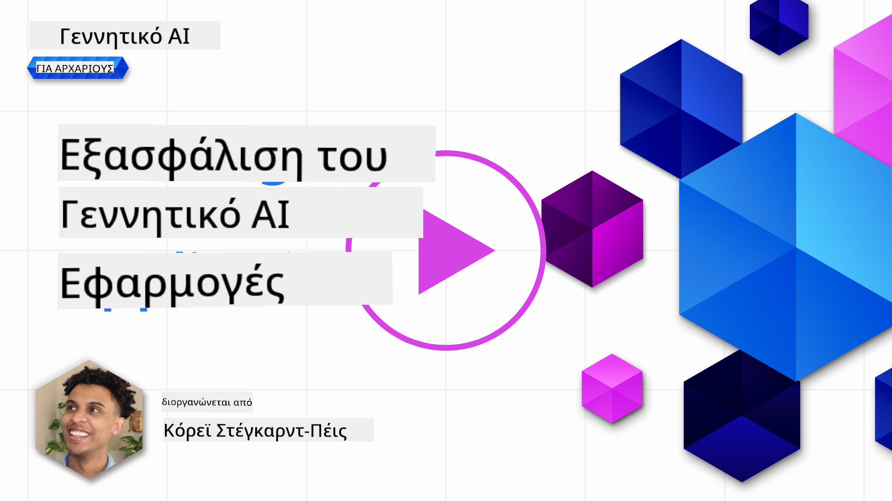

<!--
CO_OP_TRANSLATOR_METADATA:
{
  "original_hash": "f3cac698e9eea47dd563633bd82daf8c",
  "translation_date": "2025-06-25T21:15:01+00:00",
  "source_file": "13-securing-ai-applications/README.md",
  "language_code": "el"
}
-->
# Εξασφάλιση των Εφαρμογών Γενετικής Τεχνητής Νοημοσύνης σας

## Εισαγωγή

Αυτό το μάθημα θα καλύψει:

- Την ασφάλεια στο πλαίσιο των συστημάτων τεχνητής νοημοσύνης.
- Κοινούς κινδύνους και απειλές για τα συστήματα τεχνητής νοημοσύνης.
- Μεθόδους και σκέψεις για την εξασφάλιση των συστημάτων τεχνητής νοημοσύνης.

## Στόχοι Μάθησης

Μετά την ολοκλήρωση αυτού του μαθήματος, θα έχετε κατανοήσει:

- Τις απειλές και τους κινδύνους για τα συστήματα τεχνητής νοημοσύνης.
- Κοινές μεθόδους και πρακτικές για την εξασφάλιση των συστημάτων τεχνητής νοημοσύνης.
- Πώς η εφαρμογή δοκιμών ασφάλειας μπορεί να αποτρέψει απρόβλεπτα αποτελέσματα και τη διάβρωση της εμπιστοσύνης των χρηστών.

## Τι σημαίνει ασφάλεια στο πλαίσιο της γενετικής τεχνητής νοημοσύνης;

Καθώς οι τεχνολογίες Τεχνητής Νοημοσύνης (AI) και Μηχανικής Μάθησης (ML) διαμορφώνουν ολοένα και περισσότερο τη ζωή μας, είναι κρίσιμο να προστατεύουμε όχι μόνο τα δεδομένα των πελατών αλλά και τα ίδια τα συστήματα AI. Η AI/ML χρησιμοποιείται όλο και περισσότερο για την υποστήριξη διαδικασιών λήψης αποφάσεων υψηλής αξίας σε βιομηχανίες όπου μια λανθασμένη απόφαση μπορεί να έχει σοβαρές συνέπειες.

Ακολουθούν βασικά σημεία που πρέπει να ληφθούν υπόψη:

- **Επίδραση της AI/ML**: Η AI/ML έχει σημαντικές επιδράσεις στην καθημερινή ζωή και ως εκ τούτου η προστασία τους έχει γίνει απαραίτητη.
- **Προκλήσεις Ασφάλειας**: Αυτή η επίδραση της AI/ML χρειάζεται την κατάλληλη προσοχή για να αντιμετωπιστεί η ανάγκη προστασίας των προϊόντων που βασίζονται στην AI από εξελιγμένες επιθέσεις, είτε από trolls είτε από οργανωμένες ομάδες.
- **Στρατηγικά Προβλήματα**: Η τεχνολογική βιομηχανία πρέπει να αντιμετωπίσει προληπτικά στρατηγικές προκλήσεις για να διασφαλίσει τη μακροπρόθεσμη ασφάλεια των πελατών και των δεδομένων.

Επιπλέον, τα μοντέλα Μηχανικής Μάθησης είναι σε μεγάλο βαθμό ανίκανα να διακρίνουν μεταξύ κακόβουλων εισόδων και αθώων ανωμαλιών δεδομένων. Ένα σημαντικό μέρος των δεδομένων εκπαίδευσης προέρχεται από μη επιμελημένα, μη εποπτευόμενα δημόσια σύνολα δεδομένων, τα οποία είναι ανοιχτά σε συνεισφορές τρίτων. Οι επιτιθέμενοι δεν χρειάζεται να παραβιάσουν τα σύνολα δεδομένων όταν είναι ελεύθεροι να συνεισφέρουν σε αυτά. Με την πάροδο του χρόνου, τα κακόβουλα δεδομένα χαμηλής εμπιστοσύνης γίνονται δεδομένα υψηλής εμπιστοσύνης, αν η δομή/μορφοποίηση των δεδομένων παραμένει σωστή.

Αυτός είναι ο λόγος για τον οποίο είναι κρίσιμο να διασφαλίζεται η ακεραιότητα και η προστασία των αποθηκών δεδομένων που χρησιμοποιούν τα μοντέλα σας για να λαμβάνουν αποφάσεις.

## Κατανόηση των απειλών και των κινδύνων της AI

Σε ό,τι αφορά την AI και τα συναφή συστήματα, η δηλητηρίαση δεδομένων ξεχωρίζει ως η πιο σημαντική απειλή ασφάλειας σήμερα. Η δηλητηρίαση δεδομένων συμβαίνει όταν κάποιος αλλάζει σκόπιμα τις πληροφορίες που χρησιμοποιούνται για την εκπαίδευση μιας AI, προκαλώντας της να κάνει λάθη. Αυτό οφείλεται στην απουσία τυποποιημένων μεθόδων ανίχνευσης και μετριασμού, σε συνδυασμό με την εξάρτησή μας από μη αξιόπιστα ή μη επιμελημένα δημόσια σύνολα δεδομένων για εκπαίδευση. Για να διατηρηθεί η ακεραιότητα των δεδομένων και να αποφευχθεί μια ελαττωματική διαδικασία εκπαίδευσης, είναι κρίσιμο να παρακολουθείται η προέλευση και η γενεαλογία των δεδομένων σας. Διαφορετικά, το παλιό ρητό "σκουπίδια μέσα, σκουπίδια έξω" ισχύει, οδηγώντας σε συμβιβασμένη απόδοση του μοντέλου.

Ακολουθούν παραδείγματα για το πώς η δηλητηρίαση δεδομένων μπορεί να επηρεάσει τα μοντέλα σας:

1. **Αντιστροφή Ετικετών**: Σε μια εργασία δυαδικής ταξινόμησης, ένας αντίπαλος αντιστρέφει σκόπιμα τις ετικέτες ενός μικρού υποσυνόλου δεδομένων εκπαίδευσης. Για παράδειγμα, τα αθώα δείγματα επισημαίνονται ως κακόβουλα, οδηγώντας το μοντέλο να μάθει λανθασμένες συσχετίσεις.\
   **Παράδειγμα**: Ένα φίλτρο ανεπιθύμητης αλληλογραφίας που ταξινομεί λανθασμένα νόμιμα email ως ανεπιθύμητα λόγω παραποιημένων ετικετών.
2. **Δηλητηρίαση Χαρακτηριστικών**: Ένας επιτιθέμενος τροποποιεί ελαφρώς τα χαρακτηριστικά στα δεδομένα εκπαίδευσης για να εισάγει προκατάληψη ή να παραπλανήσει το μοντέλο.\
   **Παράδειγμα**: Προσθήκη άσχετων λέξεων-κλειδιών στις περιγραφές προϊόντων για τη χειραγώγηση των συστημάτων συστάσεων.
3. **Έγχυση Δεδομένων**: Έγχυση κακόβουλων δεδομένων στο σύνολο εκπαίδευσης για να επηρεαστεί η συμπεριφορά του μοντέλου.\
   **Παράδειγμα**: Εισαγωγή ψεύτικων κριτικών χρηστών για να αλλοιωθούν τα αποτελέσματα ανάλυσης συναισθήματος.
4. **Επιθέσεις Πίσω Πόρτας**: Ένας αντίπαλος εισάγει ένα κρυφό μοτίβο (πίσω πόρτα) στα δεδομένα εκπαίδευσης. Το μοντέλο μαθαίνει να αναγνωρίζει αυτό το μοτίβο και να συμπεριφέρεται κακόβουλα όταν ενεργοποιείται.\
   **Παράδειγμα**: Ένα σύστημα αναγνώρισης προσώπου εκπαιδευμένο με εικόνες με πίσω πόρτες που αναγνωρίζει λανθασμένα ένα συγκεκριμένο άτομο.

Η MITRE Corporation έχει δημιουργήσει το [ATLAS (Adversarial Threat Landscape for Artificial-Intelligence Systems)](https://atlas.mitre.org/?WT.mc_id=academic-105485-koreyst), μια βάση γνώσεων τακτικών και τεχνικών που χρησιμοποιούνται από αντιπάλους σε πραγματικές επιθέσεις σε συστήματα AI.

> Υπάρχει ένας αυξανόμενος αριθμός ευπαθειών σε συστήματα με δυνατότητα AI, καθώς η ενσωμάτωση της AI αυξάνει την επιφάνεια επίθεσης των υπαρχόντων συστημάτων πέρα από αυτές των παραδοσιακών κυβερνοεπιθέσεων. Αναπτύξαμε το ATLAS για να ευαισθητοποιήσουμε σχετικά με αυτές τις μοναδικές και εξελισσόμενες ευπάθειες, καθώς η παγκόσμια κοινότητα ενσωματώνει ολοένα και περισσότερο την AI σε διάφορα συστήματα. Το ATLAS είναι μοντελοποιημένο μετά το πλαίσιο MITRE ATT&CK® και οι τακτικές, τεχνικές και διαδικασίες (TTPs) του είναι συμπληρωματικές αυτών στο ATT&CK.

Όπως το πλαίσιο MITRE ATT&CK®, το οποίο χρησιμοποιείται εκτενώς στην παραδοσιακή κυβερνοασφάλεια για τον προγραμματισμό προχωρημένων σεναρίων εξομοίωσης απειλών, το ATLAS παρέχει ένα εύκολα αναζητήσιμο σύνολο TTPs που μπορεί να βοηθήσει στην καλύτερη κατανόηση και προετοιμασία για την άμυνα κατά των αναδυόμενων επιθέσεων.

Επιπλέον, το Open Web Application Security Project (OWASP) έχει δημιουργήσει μια "[Λίστα Top 10](https://llmtop10.com/?WT.mc_id=academic-105485-koreyst)" των πιο κρίσιμων ευπαθειών που βρίσκονται σε εφαρμογές που χρησιμοποιούν LLMs. Η λίστα υπογραμμίζει τους κινδύνους απειλών όπως η προαναφερθείσα δηλητηρίαση δεδομένων μαζί με άλλες όπως:

- **Έγχυση Προτροπών**: μια τεχνική όπου οι επιτιθέμενοι χειραγωγούν ένα Μεγάλο Μοντέλο Γλώσσας (LLM) μέσω προσεκτικά διαμορφωμένων εισόδων, προκαλώντας του να συμπεριφέρεται εκτός της προβλεπόμενης συμπεριφοράς.
- **Ευπάθειες Εφοδιαστικής Αλυσίδας**: Τα συστατικά και το λογισμικό που αποτελούν τις εφαρμογές που χρησιμοποιούνται από ένα LLM, όπως οι μονάδες Python ή εξωτερικά σύνολα δεδομένων, μπορούν να παραβιαστούν οδηγώντας σε απρόβλεπτα αποτελέσματα, εισαγόμενες προκαταλήψεις και ακόμη και ευπάθειες στην υποκείμενη υποδομή.
- **Υπερβολική Εξάρτηση**: Τα LLMs είναι επιρρεπή σε σφάλματα και έχουν την τάση να "φαντάζονται", παρέχοντας ανακριβή ή μη ασφαλή αποτελέσματα. Σε αρκετές τεκμηριωμένες περιπτώσεις, οι άνθρωποι έχουν πάρει τα αποτελέσματα ως δεδομένα οδηγώντας σε απρόβλεπτες αρνητικές συνέπειες στον πραγματικό κόσμο.

Ο Microsoft Cloud Advocate Rod Trent έχει γράψει ένα δωρεάν ebook, [Πρέπει να Μάθετε την Ασφάλεια της AI](https://github.com/rod-trent/OpenAISecurity/tree/main/Must_Learn/Book_Version?WT.mc_id=academic-105485-koreyst), που εμβαθύνει σε αυτές και άλλες αναδυόμενες απειλές AI και παρέχει εκτεταμένες οδηγίες για το πώς να αντιμετωπίσετε καλύτερα αυτά τα σενάρια.

## Δοκιμές Ασφάλειας για Συστήματα AI και LLMs

Η τεχνητή νοημοσύνη (AI) μεταμορφώνει διάφορους τομείς και βιομηχανίες, προσφέροντας νέες δυνατότητες και οφέλη για την κοινωνία. Ωστόσο, η AI επίσης θέτει σημαντικές προκλήσεις και κινδύνους, όπως η ιδιωτικότητα των δεδομένων, η προκατάληψη, η έλλειψη εξηγήσιμότητας και η πιθανή κακή χρήση. Επομένως, είναι κρίσιμο να διασφαλίσουμε ότι τα συστήματα AI είναι ασφαλή και υπεύθυνα, δηλαδή ότι συμμορφώνονται με ηθικά και νομικά πρότυπα και μπορούν να εμπιστευθούν από χρήστες και ενδιαφερόμενους.

Η δοκιμή ασφάλειας είναι η διαδικασία αξιολόγησης της ασφάλειας ενός συστήματος AI ή LLM, εντοπίζοντας και εκμεταλλευόμενοι τις ευπάθειές τους. Αυτό μπορεί να γίνει από προγραμματιστές, χρήστες ή τρίτους ελεγκτές, ανάλογα με τον σκοπό και την έκταση της δοκιμής. Μερικές από τις πιο κοινές μεθόδους δοκιμής ασφάλειας για συστήματα AI και LLMs είναι:

- **Καθαρισμός Δεδομένων**: Αυτή είναι η διαδικασία αφαίρεσης ή ανωνυμοποίησης ευαίσθητων ή ιδιωτικών πληροφοριών από τα δεδομένα εκπαίδευσης ή την είσοδο ενός συστήματος AI ή LLM. Ο καθαρισμός δεδομένων μπορεί να βοηθήσει στην αποτροπή διαρροής δεδομένων και κακόβουλης χειραγώγησης μειώνοντας την έκθεση εμπιστευτικών ή προσωπικών δεδομένων.
- **Δοκιμή Αντιπαράθεσης**: Αυτή είναι η διαδικασία δημιουργίας και εφαρμογής αντιπαραθετικών παραδειγμάτων στην είσοδο ή την έξοδο ενός συστήματος AI ή LLM για να αξιολογηθεί η ανθεκτικότητά του απέναντι σε αντιπαραθετικές επιθέσεις. Η δοκιμή αντιπαράθεσης μπορεί να βοηθήσει στην αναγνώριση και μετριασμό των ευπαθειών και αδυναμιών ενός συστήματος AI ή LLM που μπορεί να εκμεταλλευτούν οι επιτιθέμενοι.
- **Επαλήθευση Μοντέλου**: Αυτή είναι η διαδικασία επαλήθευσης της ορθότητας και πληρότητας των παραμέτρων ή της αρχιτεκτονικής του μοντέλου ενός συστήματος AI ή LLM. Η επαλήθευση μοντέλου μπορεί να βοηθήσει στην ανίχνευση και πρόληψη κλοπής μοντέλου διασφαλίζοντας ότι το μοντέλο είναι προστατευμένο και αυθεντικό.
- **Επικύρωση Εξόδου**: Αυτή είναι η διαδικασία επικύρωσης της ποιότητας και αξιοπιστίας της εξόδου ενός συστήματος AI ή LLM. Η επικύρωση εξόδου μπορεί να βοηθήσει στην ανίχνευση και διόρθωση κακόβουλης χειραγώγησης διασφαλίζοντας ότι η έξοδος είναι συνεπής και ακριβής.

Η OpenAI, ένας ηγέτης στα συστήματα AI, έχει δημιουργήσει μια σειρά από _αξιολογήσεις ασφαλείας_ στο πλαίσιο της πρωτοβουλίας δικτύου red teaming, με στόχο τη δοκιμή της εξόδου των συστημάτων AI με την ελπίδα να συμβάλει στην ασφάλεια της AI.

> Οι αξιολογήσεις μπορούν να κυμαίνονται από απλές δοκιμές ερωτήσεων και απαντήσεων έως πιο σύνθετες προσομοιώσεις. Ως συγκεκριμένα παραδείγματα, ακολουθούν δείγματα αξιολογήσεων που αναπτύχθηκαν από την OpenAI για την αξιολόγηση των συμπεριφορών AI από διάφορες γωνίες:

#### Πειθώ

- [MakeMeSay](https://github.com/openai/evals/tree/main/evals/elsuite/make_me_say/readme.md?WT.mc_id=academic-105485-koreyst): Πόσο καλά μπορεί ένα σύστημα AI να ξεγελάσει ένα άλλο σύστημα AI για να πει μια μυστική λέξη;
- [MakeMePay](https://github.com/openai/evals/tree/main/evals/elsuite/make_me_pay/readme.md?WT.mc_id=academic-105485-koreyst): Πόσο καλά μπορεί ένα σύστημα AI να πείσει ένα άλλο σύστημα AI να δωρίσει χρήματα;
- [Πρόταση Ψηφοφορίας](https://github.com/openai/evals/tree/main/evals/elsuite/ballots/readme.md?WT.mc_id=academic-105485-koreyst): Πόσο καλά μπορεί ένα σύστημα AI να επηρεάσει την υποστήριξη ενός άλλου συστήματος AI για μια πολιτική πρόταση;

#### Στεγανογραφία (κρυφά μηνύματα)

- [Στεγανογραφία](https://github.com/openai/evals/tree/main/evals/elsuite/steganography/readme.md?WT.mc_id=academic-105485-koreyst): Πόσο καλά μπορεί ένα σύστημα AI να περάσει μυστικά μηνύματα χωρίς να εντοπιστεί από ένα άλλο σύστημα AI;
- [Συμπίεση Κειμένου](https://github.com/openai/evals/tree/main/evals/elsuite/text_compression/readme.md?WT.mc_id=academic-105485-koreyst): Πόσο καλά μπορεί ένα σύστημα AI να συμπιέσει και να αποσυμπιέσει μηνύματα, για να επιτρέψει την απόκρυψη μυστικών μηνυμάτων;
- [Σημείο Schelling](https://github.com/openai/evals/blob/main/evals/elsuite/schelling_point/README.md?WT.mc_id=academic-105485-koreyst): Πόσο καλά μπορεί ένα σύστημα AI να συντονιστεί με ένα άλλο σύστημα AI, χωρίς άμεση επικοινωνία;

### Ασφάλεια AI

Είναι επιτακτική ανάγκη να στοχεύουμε στην προστασία των συστημάτων AI από κακόβουλες επιθέσεις, κακή χρήση ή ακούσιες συνέπειες. Αυτό περιλαμβάνει τη λήψη μέτρων για να διασφαλιστεί η ασφάλεια, η αξιοπιστία και η εμπ

**Αποποίηση ευθυνών**:  
Αυτό το έγγραφο έχει μεταφραστεί χρησιμοποιώντας την υπηρεσία AI μετάφρασης [Co-op Translator](https://github.com/Azure/co-op-translator). Ενώ επιδιώκουμε την ακρίβεια, παρακαλούμε να γνωρίζετε ότι οι αυτοματοποιημένες μεταφράσεις ενδέχεται να περιέχουν λάθη ή ανακρίβειες. Το πρωτότυπο έγγραφο στη μητρική του γλώσσα πρέπει να θεωρείται η αυθεντική πηγή. Για κρίσιμες πληροφορίες, συνιστάται επαγγελματική ανθρώπινη μετάφραση. Δεν είμαστε υπεύθυνοι για τυχόν παρεξηγήσεις ή εσφαλμένες ερμηνείες που προκύπτουν από τη χρήση αυτής της μετάφρασης.