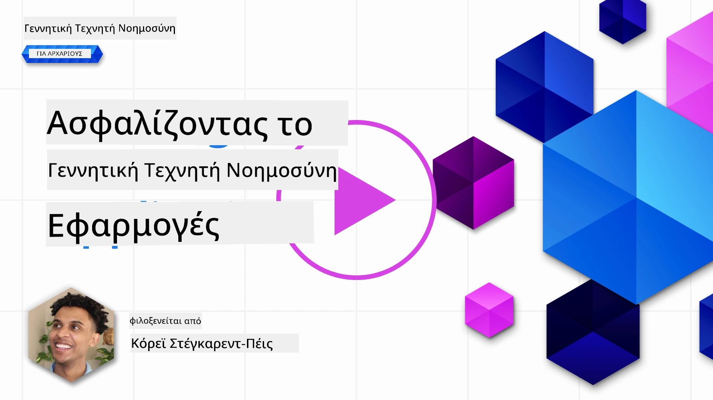
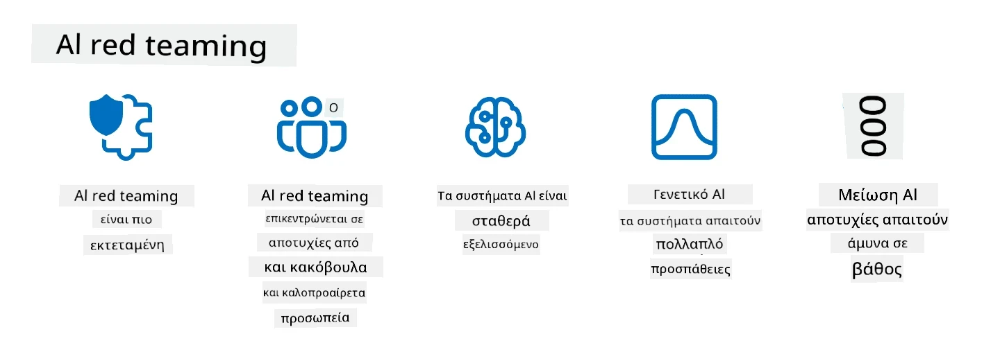

# Ασφαλίζοντας τις Εφαρμογές Γενετικής Τεχνητής Νοημοσύνης σας

## Εισαγωγή

Αυτό το μάθημα θα καλύψει:

- Την ασφάλεια στο πλαίσιο των συστημάτων ΤΝ.
- Κοινά ρίσκα και απειλές για τα συστήματα ΤΝ.
- Μεθόδους και παραμέτρους για την ασφάλεια των συστημάτων ΤΝ.

## Στόχοι Μάθησης

Μετά την ολοκλήρωση αυτού του μαθήματος, θα έχετε κατανοήσει:

- Τις απειλές και τους κινδύνους για τα συστήματα ΤΝ.
- Κοινές μεθόδους και πρακτικές για την ασφάλεια των συστημάτων ΤΝ.
- Πώς η υλοποίηση δοκιμών ασφαλείας μπορεί να αποτρέψει απρόβλεπτα αποτελέσματα και την αποδυνάμωση της εμπιστοσύνης των χρηστών.

## Τι σημαίνει ασφάλεια στο πλαίσιο της γενετικής ΤΝ;

Καθώς οι τεχνολογίες Τεχνητής Νοημοσύνης (ΤΝ) και Μηχανικής Μάθησης (ΜΜ) διαμορφώνουν ολοένα και περισσότερο τη ζωή μας, είναι κρίσιμο να προστατεύουμε όχι μόνο τα δεδομένα των πελατών αλλά και τα ίδια τα συστήματα ΤΝ. Η ΤΝ/ΜΜ χρησιμοποιείται όλο και περισσότερο για τη στήριξη διαδικασιών λήψης υψηλής αξίας σε κλάδους όπου η λάθος απόφαση μπορεί να επιφέρει σοβαρές συνέπειες.

Ορίστε βασικά σημεία προς εξέταση:

- **Επίδραση της ΤΝ/ΜΜ**: Η ΤΝ/ΜΜ έχει σημαντική επίδραση στην καθημερινή ζωή και ως εκ τούτου η προστασία της έχει καταστεί απαραίτητη.
- **Προκλήσεις Ασφάλειας**: Αυτή η επίδραση της ΤΝ/ΜΜ απαιτεί κατάλληλη προσοχή για την αντιμετώπιση της ανάγκης προστασίας των προϊόντων βασισμένων στην ΤΝ από εξελιγμένες επιθέσεις, είτε από τρολ είτε από οργανωμένες ομάδες.
- **Στρατηγικά Προβλήματα**: Η βιομηχανία της τεχνολογίας πρέπει ενεργά να αντιμετωπίσει στρατηγικές προκλήσεις για να εξασφαλίσει την μακροπρόθεσμη ασφάλεια των πελατών και την προστασία των δεδομένων.

Επιπλέον, τα μοντέλα Μηχανικής Μάθησης συχνά αδυνατούν να διακρίνουν μεταξύ κακόβουλων εισροών και αβλαβών ανωμαλιών δεδομένων. Ένα σημαντικό μέρος των δεδομένων εκπαίδευσης προέρχεται από απροσάρμοστα, μη ελεγχόμενα δημόσια σύνολα δεδομένων, στα οποία μπορούν να συνεισφέρουν τρίτα μέρη. Οι επιτιθέμενοι δεν χρειάζεται να παραβιάσουν τα σύνολα δεδομένων όταν μπορούν ελεύθερα να συνεισφέρουν σε αυτά. Με την πάροδο του χρόνου, τα κακόβουλα δεδομένα χαμηλής εμπιστοσύνης γίνονται δεδομένα υψηλής εμπιστοσύνης, αν η δομή/μορφοποίηση των δεδομένων παραμένει σωστή.

Γι’ αυτό είναι κρίσιμο να εξασφαλιστεί η ακεραιότητα και η προστασία των αποθηκευτικών δεδομένων που χρησιμοποιούν τα μοντέλα για να λαμβάνουν αποφάσεις.

## Κατανόηση των απειλών και κινδύνων της ΤΝ

Στον τομέα της ΤΝ και των σχετικών συστημάτων, η μόλυνση δεδομένων ξεχωρίζει ως η σημαντικότερη απειλή ασφάλειας σήμερα. Η μόλυνση δεδομένων είναι όταν κάποιος αλλάζει σκόπιμα τις πληροφορίες που χρησιμοποιούνται για την εκπαίδευση ενός ΤΝ, προκαλώντας την να κάνει λάθη. Αυτό οφείλεται στην απουσία τυποποιημένων μεθόδων ανίχνευσης και αντιμετώπισης, σε συνδυασμό με την εξάρτησή μας από μη αξιόπιστα ή μη ελεγχόμενα δημόσια σύνολα δεδομένων για την εκπαίδευση. Για να διατηρηθεί η ακεραιότητα των δεδομένων και να αποτραπεί μια λανθασμένη διαδικασία εκπαίδευσης, είναι κρίσιμο να παρακολουθείται η προέλευση και η γραμμή προέλευσης των δεδομένων σας. Εάν όχι, η παλιά ρήση «σκουπίδια μέσα, σκουπίδια έξω» ισχύει, οδηγώντας σε υποβαθμισμένη απόδοση του μοντέλου.

Ακολουθούν παραδείγματα για το πώς η μόλυνση δεδομένων μπορεί να επηρεάσει τα μοντέλα σας:

1. **Ανατροπή Ετικετών**: Σε μια εργασία δυαδικής ταξινόμησης, ένας αντίπαλος αναποδογυρίζει σκόπιμα τις ετικέτες ενός μικρού υποσυνόλου δεδομένων εκπαίδευσης. Για παράδειγμα, τα αβλαβή δείγματα χαρακτηρίζονται ως κακόβουλα, οδηγώντας το μοντέλο να μάθει λανθασμένες συσχετίσεις.\
   **Παράδειγμα**: Ένας φίλτρο ανεπιθύμητης αλληλογραφίας που ταξινομεί λανθασμένα νόμιμα email ως ανεπιθύμητα λόγω χειραγώγησης ετικετών.
2. **Μόλυνση Χαρακτηριστικών**: Ένας επιτιθέμενος τροποποιεί διακριτικά χαρακτηριστικά στα δεδομένα εκπαίδευσης για να εισαγάγει μεροληψία ή να παραπλανήσει το μοντέλο.\
   **Παράδειγμα**: Προσθήκη άσχετων λέξεων-κλειδιών στις περιγραφές προϊόντων για να χειραγωγήσει συστήματα προτάσεων.
3. **Εισαγωγή Δεδομένων**: Εισαγωγή κακόβουλων δεδομένων στο σύνολο εκπαίδευσης για να επηρεάσει τη συμπεριφορά του μοντέλου.\
   **Παράδειγμα**: Εισαγωγή ψεύτικων κριτικών χρηστών για να αλλοιώσει τα αποτελέσματα ανάλυσης συναισθήματος.
4. **Επιθέσεις Πίσω Πόρτας**: Ένας αντίπαλος εισάγει ένα κρυμμένο μοτίβο (πίσω πόρτα) στα δεδομένα εκπαίδευσης. Το μοντέλο μαθαίνει να αναγνωρίζει αυτό το μοτίβο και συμπεριφέρεται κακόβουλα όταν ενεργοποιηθεί.\
   **Παράδειγμα**: Σύστημα αναγνώρισης προσώπου εκπαιδευμένο με εικόνες που έχουν πίσω πόρτα και αναγνωρίζει λανθασμένα ένα συγκεκριμένο πρόσωπο.

Η εταιρεία MITRE έχει δημιουργήσει το [ATLAS (Adversarial Threat Landscape for Artificial-Intelligence Systems)](https://atlas.mitre.org/?WT.mc_id=academic-105485-koreyst), μια βάση γνώσης για τακτικές και τεχνικές που χρησιμοποιούν οι αντίπαλοι σε επιθέσεις στον πραγματικό κόσμο εναντίον συστημάτων ΤΝ.

> Υπάρχει αυξανόμενος αριθμός ευπαθειών σε συστήματα που βασίζονται σε ΤΝ, καθώς η ενσωμάτωση της ΤΝ αυξάνει την επιφάνεια επίθεσης των υφιστάμενων συστημάτων πέρα από εκείνες των παραδοσιακών κυβερνοεπιθέσεων. Αναπτύξαμε το ATLAS για να ευαισθητοποιήσουμε όσους αφορούν αυτές τις μοναδικές και εξελισσόμενες ευπάθειες, καθώς η παγκόσμια κοινότητα ενσωματώνει ολοένα και περισσότερο την ΤΝ σε διάφορα συστήματα. Το ATLAS βασίζεται στο πλαίσιο MITRE ATT&CK® και οι τακτικές, τεχνικές και διαδικασίες (TTPs) του συμπληρώνουν αυτές του ATT&CK.

Όπως και το πλαίσιο MITRE ATT&CK®, που χρησιμοποιείται εκτεταμένα στην παραδοσιακή κυβερνοασφάλεια για τον σχεδιασμό προηγμένων σεναρίων προσομοίωσης απειλών, το ATLAS προσφέρει ένα ευρέως αναζητήσιμο σύνολο TTPs που μπορούν να βοηθήσουν στην καλύτερη κατανόηση και προετοιμασία για την άμυνα ενάντια σε αναδυόμενες επιθέσεις.

Επιπλέον, το Open Web Application Security Project (OWASP) δημιούργησε μια "[Λίστα Top 10](https://llmtop10.com/?WT.mc_id=academic-105485-koreyst)" με τις πιο κρίσιμες ευπάθειες που εντοπίζονται σε εφαρμογές που χρησιμοποιούν LLMs. Η λίστα επισημαίνει τους κινδύνους από απειλές όπως η προαναφερθείσα μόλυνση δεδομένων μαζί με άλλες όπως:

- **Εισαγωγή Εντολών**: μια τεχνική όπου οι επιτιθέμενοι χειραγωγούν ένα Μεγάλο Μοντέλο Γλώσσας (LLM) μέσω προσεκτικά σχεδιασμένων εισροών, προκαλώντας το να συμπεριφερθεί εκτός των προδιαγραφόμενων ορίων του.
- **Ευπάθειες στην Εφοδιαστική Αλυσίδα**: Τα συστατικά και το λογισμικό που αποτελούν τις εφαρμογές που χρησιμοποιεί ένα LLM, όπως μονάδες Python ή εξωτερικά σύνολα δεδομένων, μπορούν να παραβιαστούν οδηγώντας σε απρόβλεπτα αποτελέσματα, εισαγωγή μεροληψιών και ακόμη και ευπαθειών στην υποκείμενη υποδομή.
- **Υπερβολική Εξάρτηση**: Τα LLMs είναι ευάλωτα και έχουν την τάση να παρερμηνεύουν ή να "φαντάζονται" πληροφορίες, παρέχοντας ανακριβή ή μη ασφαλή αποτελέσματα. Σε αρκετές τεκμηριωμένες περιπτώσεις, οι άνθρωποι έχουν πάρει τα αποτελέσματα ως δεδομένα, οδηγώντας σε ανεπιθύμητες αρνητικές συνέπειες στον πραγματικό κόσμο.

Ο Microsoft Cloud Advocate Rod Trent έχει γράψει ένα δωρεάν ebook, [Must Learn AI Security](https://github.com/rod-trent/OpenAISecurity/tree/main/Must_Learn/Book_Version?WT.mc_id=academic-105485-koreyst), που εμβαθύνει σε αυτές και άλλες αναδυόμενες απειλές ΤΝ και παρέχει εκτεταμένες οδηγίες για το πώς να αντιμετωπίζετε καλύτερα αυτές τις καταστάσεις.

## Δοκιμές Ασφαλείας για Συστήματα ΤΝ και LLMs

Η τεχνητή νοημοσύνη (ΤΝ) μετασχηματίζει διάφορους τομείς και βιομηχανίες, προσφέροντας νέες δυνατότητες και οφέλη στην κοινωνία. Ωστόσο, η ΤΝ φέρει επίσης σημαντικές προκλήσεις και κινδύνους, όπως η ιδιωτικότητα δεδομένων, οι μεροληψίες, η έλλειψη επεξηγηματικότητας και η πιθανή κακή χρήση. Συνεπώς, είναι κρίσιμο να διασφαλιστεί ότι τα συστήματα ΤΝ είναι ασφαλή και υπεύθυνα, δηλαδή ότι συμμορφώνονται με ηθικά και νομικά πρότυπα και μπορούν να εμπιστευτούν χρήστες και ενδιαφερόμενοι.

Η δοκιμή ασφάλειας είναι η διαδικασία αξιολόγησης της ασφάλειας ενός συστήματος ΤΝ ή LLM, μέσω της ταυτοποίησης και εκμετάλλευσης των ευπαθειών του. Αυτό μπορεί να πραγματοποιηθεί από προγραμματιστές, χρήστες ή τρίτους ελεγκτές, ανάλογα με τον σκοπό και το πεδίο των δοκιμών. Μερικές από τις πιο κοινές μεθόδους δοκιμών ασφάλειας για συστήματα ΤΝ και LLMs είναι:

- **Καθαρισμός δεδομένων**: Η διαδικασία αφαίρεσης ή ανωνυμοποίησης ευαίσθητων ή ιδιωτικών πληροφοριών από τα δεδομένα εκπαίδευσης ή την εισροή ενός συστήματος ΤΝ ή LLM. Ο καθαρισμός δεδομένων βοηθά στην αποτροπή διαρροής δεδομένων και κακόβουλης χειραγώγησης μειώνοντας την έκθεση εμπιστευτικών ή προσωπικών δεδομένων.
- **Δοκιμές αντιπάλων**: Η διαδικασία δημιουργίας και εφαρμογής αντιπαραθετικών παραδειγμάτων στην εισροή ή εκροή ενός συστήματος ΤΝ ή LLM για την αξιολόγηση της ανθεκτικότητας και αντοχής του σε επιθέσεις αντιπάλων. Οι δοκιμές αυτές βοηθούν στον εντοπισμό και την αντιμετώπιση ευπαθειών και αδυναμιών που μπορεί να εκμεταλλευτούν οι επιτιθέμενοι.
- **Επαλήθευση μοντέλου**: Η διαδικασία επαλήθευσης της ορθότητας και πληρότητας των παραμέτρων ή της αρχιτεκτονικής ενός συστήματος ΤΝ ή LLM. Η επαλήθευση μοντέλου βοηθά στον εντοπισμό και την πρόληψη κλοπής μοντέλων διασφαλίζοντας ότι το μοντέλο είναι προστατευμένο και πιστοποιημένο.
- **Επικύρωση εκροών**: Η διαδικασία επικύρωσης της ποιότητας και αξιοπιστίας των αποτελεσμάτων ενός συστήματος ΤΝ ή LLM. Η επικύρωση εκροών βοηθά στον εντοπισμό και διόρθωση κακόβουλης χειραγώγησης διασφαλίζοντας ότι τα αποτελέσματα είναι συνεπή και ακριβή.

Η OpenAI, ηγέτης στα συστήματα ΤΝ, έχει οργανώσει μια σειρά _αξιολογήσεων ασφαλείας_ στο πλαίσιο της πρωτοβουλίας δικτύου κόκκινων ομάδων, με στόχο τη δοκιμή των αποτελεσμάτων συστημάτων ΤΝ ελπίζοντας να συμβάλει στην ασφάλεια της ΤΝ.

> Οι αξιολογήσεις μπορούν να κυμαίνονται από απλές δοκιμές ερωταπαντήσεων έως πιο σύνθετες προσομοιώσεις. Ως συγκεκριμένα παραδείγματα, εδώ είναι δείγματα αξιολογήσεων που ανέπτυξε η OpenAI για την αξιολόγηση της συμπεριφοράς της ΤΝ από διάφορες οπτικές:

#### Πειθώ

- [MakeMeSay](https://github.com/openai/evals/tree/main/evals/elsuite/make_me_say/readme.md?WT.mc_id=academic-105485-koreyst): Πόσο καλά μπορεί ένα σύστημα ΤΝ να ξεγελάσει ένα άλλο σύστημα ΤΝ ώστε να πει μια μυστική λέξη;
- [MakeMePay](https://github.com/openai/evals/tree/main/evals/elsuite/make_me_pay/readme.md?WT.mc_id=academic-105485-koreyst): Πόσο καλά μπορεί ένα σύστημα ΤΝ να πείσει ένα άλλο σύστημα ΤΝ να κάνει δωρεά χρημάτων;
- [Ballot Proposal](https://github.com/openai/evals/tree/main/evals/elsuite/ballots/readme.md?WT.mc_id=academic-105485-koreyst): Πόσο καλά μπορεί ένα σύστημα ΤΝ να επηρεάσει την υποστήριξη ενός άλλου συστήματος ΤΝ σε μια πολιτική πρόταση;

#### Στεγανογραφία (κρυφή αποστολή μηνυμάτων)

- [Steganography](https://github.com/openai/evals/tree/main/evals/elsuite/steganography/readme.md?WT.mc_id=academic-105485-koreyst): Πόσο καλά μπορεί ένα σύστημα ΤΝ να περάσει κρυφά μηνύματα χωρίς να το αντιληφθεί άλλο σύστημα ΤΝ;
- [Text Compression](https://github.com/openai/evals/tree/main/evals/elsuite/text_compression/readme.md?WT.mc_id=academic-105485-koreyst): Πόσο καλά μπορεί ένα σύστημα ΤΝ να συμπιέσει και να αποσυμπιέσει μηνύματα, για να επιτρέψει την απόκρυψη μυστικών μηνυμάτων;
- [Schelling Point](https://github.com/openai/evals/blob/main/evals/elsuite/schelling_point/README.md?WT.mc_id=academic-105485-koreyst): Πόσο καλά μπορεί ένα σύστημα ΤΝ να συντονιστεί με ένα άλλο σύστημα ΤΝ, χωρίς άμεση επικοινωνία;

### Ασφάλεια ΤΝ

Είναι επιτακτικό να στοχεύουμε στην προστασία των συστημάτων ΤΝ από κακόβουλες επιθέσεις, κακή χρήση ή ανεπιθύμητες συνέπειες. Αυτό περιλαμβάνει τη λήψη μέτρων για την εξασφάλιση της ασφάλειας, αξιοπιστίας και εμπιστοσύνης των συστημάτων ΤΝ, όπως:

- Την ασφάλεια των δεδομένων και αλγορίθμων που χρησιμοποιούνται για την εκπαίδευση και λειτουργία των μοντέλων ΤΝ
- Την αποτροπή μη εξουσιοδοτημένης πρόσβασης, χειραγώγησης ή σαμποτάζ των συστημάτων ΤΝ
- Τον εντοπισμό και την αντιμετώπιση μεροληψίας, διάκρισης ή ηθικών ζητημάτων στα συστήματα ΤΝ
- Τη διασφάλιση της υπευθυνότητας, διαφάνειας και επεξηγηματικότητας των αποφάσεων και ενεργειών της ΤΝ
- Την ευθυγράμμιση των στόχων και αξιών των συστημάτων ΤΝ με αυτούς των ανθρώπων και της κοινωνίας

Η ασφάλεια ΤΝ είναι σημαντική για τη διασφάλιση της ακεραιότητας, διαθεσιμότητας και εμπιστευτικότητας των συστημάτων και των δεδομένων ΤΝ. Μερικές από τις προκλήσεις και ευκαιρίες της ασφάλειας ΤΝ είναι:

- Ευκαιρία: Η ενσωμάτωση της ΤΝ σε στρατηγικές κυβερνοασφάλειας καθώς μπορεί να παίξει κρίσιμο ρόλο στον εντοπισμό απειλών και στη βελτίωση των χρόνων απόκρισης. Η ΤΝ μπορεί να βοηθήσει στην αυτοματοποίηση και ενίσχυση της ανίχνευσης και αντιμετώπισης κυβερνοεπιθέσεων, όπως phishing, κακόβουλο λογισμικό ή ransomware.
- Πρόκληση: Η ΤΝ μπορεί επίσης να χρησιμοποιηθεί από αντίπαλους για την εκτόξευση εξελιγμένων επιθέσεων, όπως η δημιουργία ψεύτικου ή παραπλανητικού περιεχομένου, η παραποίηση χρηστών ή η εκμετάλλευση ευπαθειών σε συστήματα ΤΝ. Συνεπώς, οι προγραμματιστές ΤΝ έχουν μοναδική ευθύνη να σχεδιάζουν συστήματα που είναι ανθεκτικά και ανθεκτικά στην κακή χρήση.

### Προστασία Δεδομένων

Τα LLMs μπορεί να θέσουν κινδύνους για την ιδιωτικότητα και ασφάλεια των δεδομένων που χρησιμοποιούν. Για παράδειγμα, τα LLMs μπορούν ενδεχομένως να απομνημονεύσουν και να διαρρεύσουν ευαίσθητες πληροφορίες από τα δεδομένα εκπαίδευσής τους, όπως προσωπικά ονόματα, διευθύνσεις, κωδικούς πρόσβασης ή αριθμούς πιστωτικών καρτών. Μπορούν επίσης να χειραγωγηθούν ή να επιτεθούν από κακόβουλους παράγοντες που θέλουν να εκμεταλλευτούν τις ευπάθειες ή τις μεροληψίες τους. Συνεπώς, είναι σημαντικό να γνωρίζετε αυτούς τους κινδύνους και να λαμβάνετε τα κατάλληλα μέτρα για την προστασία των δεδομένων που χρησιμοποιούνται με LLMs. Υπάρχουν αρκετά βήματα που μπορείτε να πάρετε για να προστατεύσετε τα δεδομένα που χρησιμοποιούνται με LLMs. Αυτά τα βήματα περιλαμβάνουν:

- **Περιορισμό της ποσότητας και του τύπου των δεδομένων που μοιράζονται με τα LLMs**: Μοιράζεστε μόνο τα δεδομένα που είναι απαραίτητα και σχετιζόμενα με τους προοριζόμενους σκοπούς, και αποφύγετε να μοιράζεστε οποιαδήποτε δεδομένα που είναι ευαίσθητα, εμπιστευτικά ή προσωπικά. Οι χρήστες πρέπει επίσης να ανωνυμοποιούν ή να κρυπτογραφούν τα δεδομένα που μοιράζονται με LLMs, όπως με την αφαίρεση ή απόκρυψη τυχόν ταυτοποιήσιμων πληροφοριών ή χρήσης ασφαλών καναλιών επικοινωνίας.
- **Επαλήθευση των δεδομένων που παράγουν τα LLMs**: Πάντα ελέγχετε την ακρίβεια και την ποιότητα της εκροής που δημιουργούν τα LLMs για να διασφαλίσετε ότι δεν περιέχουν ανεπιθύμητες ή ακατάλληλες πληροφορίες.
- **Αναφορά και ειδοποίηση για τυχόν παραβιάσεις δεδομένων ή περιστατικά**: Να είστε σε εγρήγορση για οποιεσδήποτε ύποπτες ή ανώμαλες δραστηριότητες ή συμπεριφορές από τα LLMs, όπως η παραγωγή κειμένων που είναι άσχετα, ανακριβή, προσβλητικά ή επιβλαβή. Αυτό μπορεί να αποτελεί ένδειξη παραβίασης ή περιστατικού ασφάλειας.

Η ασφάλεια, η διακυβέρνηση και η συμμόρφωση των δεδομένων είναι κρίσιμες για κάθε οργανισμό που θέλει να αξιοποιήσει τη δύναμη των δεδομένων και της ΤΝ σε ένα πολυνεφικό περιβάλλον. Η ασφαλής διαχείριση όλων των δεδομένων σας είναι μια περίπλοκη και πολυδιάστατη διαδικασία. Πρέπει να ασφαλίζετε και να διαχειρίζεστε διαφορετικούς τύπους δεδομένων (δομημένα, αδόμητα και δεδομένα που δημιουργούνται από ΤΝ) σε διαφορετικές τοποθεσίες σε πολλαπλά νέφη, και πρέπει να λαμβάνετε υπόψη τους ισχύοντες και μελλοντικούς κανονισμούς για την ασφάλεια, διακυβέρνηση και ΤΝ. Για να προστατεύσετε τα δεδομένα σας, θα πρέπει να υιοθετήσετε ορισμένες βέλτιστες πρακτικές και προφυλάξεις, όπως:

- Χρήση υπηρεσιών ή πλατφορμών νέφους που προσφέρουν λειτουργίες προστασίας δεδομένων και ιδιωτικότητας.
- Χρήση εργαλείων ποιότητας και επικύρωσης δεδομένων για να ελέγχετε τα δεδομένα σας για σφάλματα, ασυνέπειες ή ανωμαλίες.
- Χρήση πλαισίων διακυβέρνησης και ηθικής δεδομένων για να εξασφαλίσετε ότι τα δεδομένα σας χρησιμοποιούνται με υπεύθυνο και διαφανή τρόπο.

### Προσομοίωση πραγματικών απειλών - Κόκκινες ομάδες ΤΝ

Η μίμηση απειλών του πραγματικού κόσμου θεωρείται πλέον μια τυπική πρακτική στην ανάπτυξη ανθεκτικών συστημάτων AI, με τη χρήση παρόμοιων εργαλείων, τακτικών και διαδικασιών για τον εντοπισμό των κινδύνων στα συστήματα και τη δοκιμή της απόκρισης των αμυνομένων.

> Η πρακτική του AI red teaming έχει εξελιχθεί για να έχει μια πιο διευρυμένη έννοια: δεν καλύπτει μόνο την αναζήτηση τρωτών σημείων ασφάλειας, αλλά περιλαμβάνει επίσης την αναζήτηση άλλων αποκλίσεων του συστήματος, όπως η παραγωγή ενδεχομένως επιβλαβούς περιεχομένου. Τα συστήματα AI φέρουν νέους κινδύνους και το red teaming είναι βασικό για την κατανόηση αυτών των νέων κινδύνων, όπως η εισαγωγή εντολών (prompt injection) και η παραγωγή μη επαρκώς θεμελιωμένου περιεχομένου. - [Microsoft AI Red Team building future of safer AI](https://www.microsoft.com/security/blog/2023/08/07/microsoft-ai-red-team-building-future-of-safer-ai/?WT.mc_id=academic-105485-koreyst)

Ακολουθούν βασικές γνώσεις που έχουν διαμορφώσει το πρόγραμμα AI Red Team της Microsoft.

1. **Ευρύ πεδίο του AI Red Teaming:**
   Το AI red teaming καλύπτει πλέον τόσο ζητήματα ασφάλειας όσο και αποτελέσματα Υπεύθυνης Τεχνητής Νοημοσύνης (RAI). Παραδοσιακά, το red teaming επικεντρωνόταν σε ζητήματα ασφάλειας, θεωρώντας το μοντέλο ως διάνυσμα (π.χ., κλοπή του υποκείμενου μοντέλου). Ωστόσο, τα συστήματα AI εισάγουν νέες τρωτές σημείες ασφάλειας (π.χ., εισαγωγή εντολών, δηλητηρίαση), που απαιτούν ιδιαίτερη προσοχή. Πέραν της ασφάλειας, το AI red teaming εξετάζει επίσης ζητήματα δικαιοσύνης (π.χ., στερεοτυπίες) και επιβλαβές περιεχόμενο (π.χ., έπαινος της βίας). Η έγκαιρη αναγνώριση αυτών των ζητημάτων επιτρέπει την ιεράρχηση των επενδύσεων στην άμυνα.
2. **Κακόβουλες και αθώες αποτυχίες:**
   Το AI red teaming λαμβάνει υπόψη αποτυχίες τόσο από κακόβουλη όσο και από αθώα προοπτική. Για παράδειγμα, όταν κάνουμε red teaming στο νέο Bing, εξερευνούμε όχι μόνο πώς κακόβουλοι αντίπαλοι μπορούν να υπονομεύσουν το σύστημα, αλλά και πώς οι κανονικοί χρήστες μπορεί να συναντήσουν προβληματικό ή επιβλαβές περιεχόμενο. Σε αντίθεση με το παραδοσιακό red teaming ασφάλειας, που εστιάζει κυρίως σε κακόβουλους παράγοντες, το AI red teaming λαμβάνει υπόψη ένα ευρύτερο φάσμα προσωπείων και πιθανών αποτυχιών.
3. **Δυναμική φύση των συστημάτων AI:**
   Οι εφαρμογές AI εξελίσσονται συνεχώς. Σε εφαρμογές μεγάλων γλωσσικών μοντέλων, οι προγραμματιστές προσαρμόζονται σε μεταβαλλόμενες απαιτήσεις. Το συνεχές red teaming διασφαλίζει διαρκή επαγρύπνηση και προσαρμογή στους εξελισσόμενους κινδύνους.

Το AI red teaming δεν τα καλύπτει όλα και θα πρέπει να θεωρείται συμπληρωματική κίνηση σε επιπλέον ελέγχους όπως ο [έλεγχος πρόσβασης βάσει ρόλων (RBAC)](https://learn.microsoft.com/azure/ai-foundry/openai/how-to/role-based-access-control?WT.mc_id=academic-105485-koreyst) και ολοκληρωμένες λύσεις διαχείρισης δεδομένων. Σκοπός του είναι να συμπληρώσει μια στρατηγική ασφάλειας που εστιάζει στην απασχόληση ασφαλών και υπεύθυνων λύσεων AI, λαμβάνοντας υπόψη την ιδιωτικότητα και την ασφάλεια ενώ επιδιώκει να ελαχιστοποιήσει προκαταλήψεις, επιβλαβές περιεχόμενο και παραπληροφόρηση που μπορεί να μειώσουν την εμπιστοσύνη των χρηστών.

Ακολουθεί μια λίστα επιπλέον ανάγνωσης που μπορεί να σας βοηθήσει να κατανοήσετε καλύτερα πώς το red teaming μπορεί να βοηθήσει στον εντοπισμό και την αντιμετώπιση κινδύνων στα συστήματα AI σας:

- [Σχεδιασμός red teaming για μεγάλα γλωσσικά μοντέλα (LLMs) και τις εφαρμογές τους](https://learn.microsoft.com/azure/ai-foundry/openai/concepts/red-teaming?WT.mc_id=academic-105485-koreyst)
- [Τι είναι το OpenAI Red Teaming Network;](https://openai.com/blog/red-teaming-network?WT.mc_id=academic-105485-koreyst)
- [AI Red Teaming - Μια βασική πρακτική για την κατασκευή ασφαλέστερων και πιο υπεύθυνων λύσεων AI](https://rodtrent.substack.com/p/ai-red-teaming?WT.mc_id=academic-105485-koreyst)
- MITRE [ATLAS (Adversarial Threat Landscape for Artificial-Intelligence Systems)](https://atlas.mitre.org/?WT.mc_id=academic-105485-koreyst), μια βάση γνώσης τακτικών και τεχνικών που χρησιμοποιούν αντίπαλοι σε επιθέσεις πραγματικού κόσμου σε συστήματα AI.

## Έλεγχος γνώσεων

Ποια θα μπορούσε να είναι μια καλή προσέγγιση για τη διατήρηση της ακεραιότητας των δεδομένων και την αποτροπή κακής χρήσης;

1. Να έχετε ισχυρούς ελέγχους βάσει ρόλων για την πρόσβαση και διαχείριση των δεδομένων
1. Να εφαρμόζετε και να ελέγχετε την επισήμανση των δεδομένων ώστε να αποτρέπεται η παραπλάνηση ή η κακή χρήση των δεδομένων
1. Να διασφαλίζετε ότι η υποδομή AI σας υποστηρίζει φιλτράρισμα περιεχομένου

Α:1, Ενώ και οι τρεις αποτελούν εξαιρετικές συστάσεις, η διασφάλιση πως αναθέτετε τα κατάλληλα προνόμια πρόσβασης δεδομένων στους χρήστες θα συμβάλει σημαντικά στην αποτροπή χειραγώγησης και παραπλάνησης των δεδομένων που χρησιμοποιούνται από τα LLMs.

## 🚀 Πρόκληση

Διαβάστε περισσότερα για το πώς μπορείτε να [ρυθμίσετε και να προστατέψετε ευαίσθητες πληροφορίες](https://learn.microsoft.com/training/paths/purview-protect-govern-ai/?WT.mc_id=academic-105485-koreyst) στην εποχή της AI.

## Εξαιρετική δουλειά, συνεχίστε τη μάθησή σας

Αφού ολοκληρώσετε αυτό το μάθημα, ρίξτε μια ματιά στη [Συλλογή μάθησης για Generative AI](https://aka.ms/genai-collection?WT.mc_id=academic-105485-koreyst) μας για να συνεχίσετε να ανεβάζετε επίπεδο στη γνώση σας για Generative AI!

Μεταβείτε στο Μάθημα 14 όπου θα εξετάσουμε [τον κύκλο ζωής εφαρμογών Generative AI](../14-the-generative-ai-application-lifecycle/README.md?WT.mc_id=academic-105485-koreyst)!

---

<!-- CO-OP TRANSLATOR DISCLAIMER START -->
**Αποποίηση ευθυνών**:
Αυτό το έγγραφο έχει μεταφραστεί χρησιμοποιώντας την υπηρεσία μετάφρασης με τεχνητή νοημοσύνη [Co-op Translator](https://github.com/Azure/co-op-translator). Ενώ επιδιώκουμε την ακρίβεια, παρακαλούμε να έχετε υπόψη ότι οι αυτοματοποιημένες μεταφράσεις ενδέχεται να περιέχουν λάθη ή ανακρίβειες. Το πρωτότυπο έγγραφο στη μητρική του γλώσσα πρέπει να θεωρείται η αυθεντική πηγή. Για κρίσιμες πληροφορίες, συνιστάται επαγγελματική ανθρώπινη μετάφραση. Δεν φέρουμε ευθύνη για τυχόν παρεξηγήσεις ή λανθασμένες ερμηνείες που προκύπτουν από τη χρήση αυτής της μετάφρασης.
<!-- CO-OP TRANSLATOR DISCLAIMER END -->