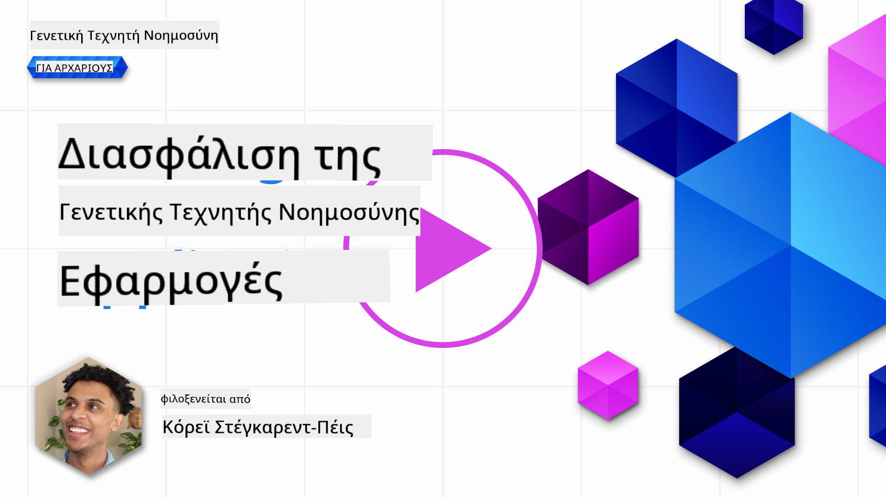
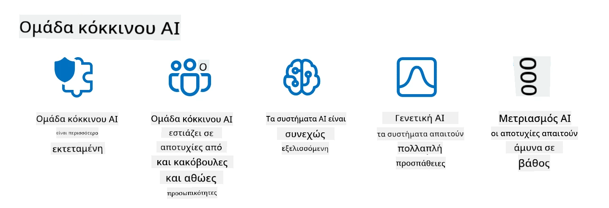

<!--
CO_OP_TRANSLATOR_METADATA:
{
  "original_hash": "f3cac698e9eea47dd563633bd82daf8c",
  "translation_date": "2025-07-09T15:27:05+00:00",
  "source_file": "13-securing-ai-applications/README.md",
  "language_code": "el"
}
-->
# Ασφάλεια των Εφαρμογών Γεννητικής Τεχνητής Νοημοσύνης

## Εισαγωγή

Αυτό το μάθημα θα καλύψει:

- Την ασφάλεια στο πλαίσιο των συστημάτων ΤΝ.
- Κοινά ρίσκα και απειλές για τα συστήματα ΤΝ.
- Μεθόδους και παράγοντες που πρέπει να ληφθούν υπόψη για την ασφάλεια των συστημάτων ΤΝ.

## Στόχοι Μάθησης

Μετά την ολοκλήρωση αυτού του μαθήματος, θα έχετε κατανοήσει:

- Τις απειλές και τους κινδύνους για τα συστήματα ΤΝ.
- Κοινές μεθόδους και πρακτικές για την ασφάλεια των συστημάτων ΤΝ.
- Πώς η εφαρμογή δοκιμών ασφάλειας μπορεί να αποτρέψει απρόβλεπτα αποτελέσματα και τη φθορά της εμπιστοσύνης των χρηστών.

## Τι σημαίνει ασφάλεια στο πλαίσιο της γεννητικής ΤΝ;

Καθώς οι τεχνολογίες Τεχνητής Νοημοσύνης (ΤΝ) και Μηχανικής Μάθησης (ΜΜ) διαμορφώνουν όλο και περισσότερο τη ζωή μας, είναι κρίσιμο να προστατεύουμε όχι μόνο τα δεδομένα των πελατών αλλά και τα ίδια τα συστήματα ΤΝ. Η ΤΝ/ΜΜ χρησιμοποιείται όλο και περισσότερο για τη στήριξη διαδικασιών λήψης αποφάσεων υψηλής αξίας σε κλάδους όπου μια λανθασμένη απόφαση μπορεί να έχει σοβαρές συνέπειες.

Ακολουθούν βασικά σημεία που πρέπει να ληφθούν υπόψη:

- **Επίδραση της ΤΝ/ΜΜ**: Η ΤΝ/ΜΜ έχει σημαντική επίδραση στην καθημερινή ζωή και γι’ αυτό η προστασία της έχει καταστεί απαραίτητη.
- **Προκλήσεις Ασφάλειας**: Η επίδραση αυτή απαιτεί κατάλληλη προσοχή για να αντιμετωπιστεί η ανάγκη προστασίας των προϊόντων βασισμένων σε ΤΝ από εξελιγμένες επιθέσεις, είτε από τρολ είτε από οργανωμένες ομάδες.
- **Στρατηγικά Ζητήματα**: Ο τεχνολογικός κλάδος πρέπει να αντιμετωπίσει προληπτικά στρατηγικές προκλήσεις για να διασφαλίσει την μακροπρόθεσμη ασφάλεια των πελατών και την προστασία των δεδομένων.

Επιπλέον, τα μοντέλα Μηχανικής Μάθησης δυσκολεύονται να διακρίνουν μεταξύ κακόβουλων εισροών και αβλαβών ανωμαλιών. Ένα σημαντικό μέρος των δεδομένων εκπαίδευσης προέρχεται από μη επιμελημένα, μη ελεγχόμενα δημόσια σύνολα δεδομένων, στα οποία μπορούν να συνεισφέρουν τρίτοι. Οι επιτιθέμενοι δεν χρειάζεται να παραβιάσουν τα σύνολα δεδομένων όταν μπορούν απλώς να συνεισφέρουν σε αυτά. Με την πάροδο του χρόνου, τα κακόβουλα δεδομένα χαμηλής εμπιστοσύνης γίνονται δεδομένα υψηλής εμπιστοσύνης, εφόσον η δομή/μορφοποίηση των δεδομένων παραμένει σωστή.

Γι’ αυτό είναι κρίσιμο να διασφαλίζεται η ακεραιότητα και η προστασία των αποθηκευτικών χώρων δεδομένων που χρησιμοποιούν τα μοντέλα σας για τη λήψη αποφάσεων.

## Κατανόηση των απειλών και κινδύνων της ΤΝ

Στον τομέα της ΤΝ και των σχετικών συστημάτων, η δηλητηρίαση δεδομένων ξεχωρίζει ως η πιο σημαντική απειλή ασφάλειας σήμερα. Η δηλητηρίαση δεδομένων συμβαίνει όταν κάποιος αλλάζει σκόπιμα τις πληροφορίες που χρησιμοποιούνται για την εκπαίδευση ενός μοντέλου ΤΝ, προκαλώντας λάθη. Αυτό οφείλεται στην έλλειψη τυποποιημένων μεθόδων ανίχνευσης και αντιμετώπισης, σε συνδυασμό με την εξάρτηση από μη αξιόπιστα ή μη επιμελημένα δημόσια σύνολα δεδομένων για την εκπαίδευση. Για να διατηρηθεί η ακεραιότητα των δεδομένων και να αποφευχθεί μια εσφαλμένη διαδικασία εκπαίδευσης, είναι κρίσιμο να παρακολουθείται η προέλευση και η καταγωγή των δεδομένων σας. Διαφορετικά, ισχύει το παλιό ρητό «σκουπίδια μέσα, σκουπίδια έξω», οδηγώντας σε υποβαθμισμένη απόδοση του μοντέλου.

Ακολουθούν παραδείγματα για το πώς η δηλητηρίαση δεδομένων μπορεί να επηρεάσει τα μοντέλα σας:

1. **Αντιστροφή Ετικετών**: Σε μια δυαδική ταξινόμηση, ένας αντίπαλος αλλάζει σκόπιμα τις ετικέτες ενός μικρού υποσυνόλου δεδομένων εκπαίδευσης. Για παράδειγμα, δείγματα που είναι αβλαβή χαρακτηρίζονται ως κακόβουλα, οδηγώντας το μοντέλο σε λανθασμένες συσχετίσεις.\
   **Παράδειγμα**: Ένα φίλτρο ανεπιθύμητης αλληλογραφίας που χαρακτηρίζει νόμιμα μηνύματα ως spam λόγω χειραγώγησης των ετικετών.
2. **Δηλητηρίαση Χαρακτηριστικών**: Ένας επιτιθέμενος τροποποιεί διακριτικά χαρακτηριστικά στα δεδομένα εκπαίδευσης για να εισάγει μεροληψία ή να παραπλανήσει το μοντέλο.\
   **Παράδειγμα**: Προσθήκη άσχετων λέξεων-κλειδιών στις περιγραφές προϊόντων για να χειραγωγήσει συστήματα προτάσεων.
3. **Ένεση Δεδομένων**: Εισαγωγή κακόβουλων δεδομένων στο σύνολο εκπαίδευσης για να επηρεαστεί η συμπεριφορά του μοντέλου.\
   **Παράδειγμα**: Εισαγωγή ψεύτικων κριτικών χρηστών για να αλλοιωθούν τα αποτελέσματα ανάλυσης συναισθήματος.
4. **Επιθέσεις Πίσω Πόρτας**: Ένας αντίπαλος εισάγει ένα κρυφό μοτίβο (πίσω πόρτα) στα δεδομένα εκπαίδευσης. Το μοντέλο μαθαίνει να αναγνωρίζει αυτό το μοτίβο και συμπεριφέρεται κακόβουλα όταν ενεργοποιείται.\
   **Παράδειγμα**: Σύστημα αναγνώρισης προσώπου εκπαιδευμένο με εικόνες που περιέχουν πίσω πόρτα και αναγνωρίζει λανθασμένα ένα συγκεκριμένο άτομο.

Η MITRE Corporation δημιούργησε το [ATLAS (Adversarial Threat Landscape for Artificial-Intelligence Systems)](https://atlas.mitre.org/?WT.mc_id=academic-105485-koreyst), μια βάση γνώσεων με τακτικές και τεχνικές που χρησιμοποιούν οι αντίπαλοι σε πραγματικές επιθέσεις σε συστήματα ΤΝ.

> Υπάρχει αυξανόμενος αριθμός ευπαθειών σε συστήματα με ΤΝ, καθώς η ενσωμάτωση της ΤΝ αυξάνει την επιφάνεια επίθεσης πέρα από τις παραδοσιακές κυβερνοεπιθέσεις. Αναπτύξαμε το ATLAS για να ευαισθητοποιήσουμε σχετικά με αυτές τις μοναδικές και εξελισσόμενες ευπάθειες, καθώς η παγκόσμια κοινότητα ενσωματώνει όλο και περισσότερο την ΤΝ σε διάφορα συστήματα. Το ATLAS βασίζεται στο πλαίσιο MITRE ATT&CK® και οι τακτικές, τεχνικές και διαδικασίες (TTPs) του συμπληρώνουν αυτές του ATT&CK.

Όπως και το πλαίσιο MITRE ATT&CK®, που χρησιμοποιείται εκτενώς στην παραδοσιακή κυβερνοασφάλεια για τον σχεδιασμό σεναρίων προσομοίωσης προηγμένων απειλών, το ATLAS παρέχει ένα εύκολα αναζητήσιμο σύνολο TTPs που βοηθούν στην καλύτερη κατανόηση και προετοιμασία για την άμυνα απέναντι σε νέες επιθέσεις.

Επιπλέον, το Open Web Application Security Project (OWASP) δημιούργησε μια "[Λίστα Top 10](https://llmtop10.com/?WT.mc_id=academic-105485-koreyst)" με τις πιο κρίσιμες ευπάθειες που εντοπίζονται σε εφαρμογές που χρησιμοποιούν LLMs. Η λίστα επισημαίνει τους κινδύνους απειλών όπως η προαναφερθείσα δηλητηρίαση δεδομένων, καθώς και άλλες όπως:

- **Prompt Injection**: Τεχνική όπου οι επιτιθέμενοι χειραγωγούν ένα Μεγάλο Γλωσσικό Μοντέλο (LLM) μέσω προσεκτικά σχεδιασμένων εισροών, προκαλώντας το να συμπεριφέρεται εκτός του προβλεπόμενου πλαισίου.
- **Ευπάθειες στην Εφοδιαστική Αλυσίδα**: Τα συστατικά και το λογισμικό που απαρτίζουν τις εφαρμογές που χρησιμοποιεί ένα LLM, όπως Python modules ή εξωτερικά σύνολα δεδομένων, μπορούν να παραβιαστούν, οδηγώντας σε απρόβλεπτα αποτελέσματα, εισαγωγή μεροληψιών και ακόμη και ευπάθειες στην υποκείμενη υποδομή.
- **Υπερβολική Εξάρτηση**: Τα LLMs είναι επιρρεπή σε λάθη και έχουν την τάση να «φαντάζονται», παρέχοντας ανακριβή ή μη ασφαλή αποτελέσματα. Σε αρκετές τεκμηριωμένες περιπτώσεις, οι άνθρωποι έχουν λάβει τα αποτελέσματα ως δεδομένα, οδηγώντας σε ανεπιθύμητες αρνητικές συνέπειες στην πραγματική ζωή.

Ο Microsoft Cloud Advocate Rod Trent έχει γράψει ένα δωρεάν ebook, [Must Learn AI Security](https://github.com/rod-trent/OpenAISecurity/tree/main/Must_Learn/Book_Version?WT.mc_id=academic-105485-koreyst), που εμβαθύνει σε αυτές και άλλες αναδυόμενες απειλές ΤΝ και παρέχει εκτενή καθοδήγηση για το πώς να αντιμετωπιστούν καλύτερα αυτά τα σενάρια.

## Δοκιμές Ασφάλειας για Συστήματα ΤΝ και LLMs

Η Τεχνητή Νοημοσύνη (ΤΝ) μετασχηματίζει διάφορους τομείς και βιομηχανίες, προσφέροντας νέες δυνατότητες και οφέλη για την κοινωνία. Ωστόσο, η ΤΝ παρουσιάζει επίσης σημαντικές προκλήσεις και κινδύνους, όπως η ιδιωτικότητα των δεδομένων, η μεροληψία, η έλλειψη επεξηγηματικότητας και η πιθανή κακή χρήση. Για το λόγο αυτό, είναι κρίσιμο να διασφαλίζεται ότι τα συστήματα ΤΝ είναι ασφαλή και υπεύθυνα, δηλαδή ότι συμμορφώνονται με ηθικά και νομικά πρότυπα και μπορούν να εμπιστευτούν οι χρήστες και τα ενδιαφερόμενα μέρη.

Η δοκιμή ασφάλειας είναι η διαδικασία αξιολόγησης της ασφάλειας ενός συστήματος ΤΝ ή LLM, μέσω της αναγνώρισης και εκμετάλλευσης των ευπαθειών τους. Αυτό μπορεί να πραγματοποιηθεί από προγραμματιστές, χρήστες ή ανεξάρτητους ελεγκτές, ανάλογα με τον σκοπό και το εύρος της δοκιμής. Μερικές από τις πιο κοινές μεθόδους δοκιμής ασφάλειας για συστήματα ΤΝ και LLMs είναι:

- **Καθαρισμός Δεδομένων**: Διαδικασία αφαίρεσης ή ανωνυμοποίησης ευαίσθητων ή ιδιωτικών πληροφοριών από τα δεδομένα εκπαίδευσης ή την είσοδο ενός συστήματος ΤΝ ή LLM. Ο καθαρισμός δεδομένων βοηθά στην αποτροπή διαρροής δεδομένων και κακόβουλης χειραγώγησης μειώνοντας την έκθεση εμπιστευτικών ή προσωπικών δεδομένων.
- **Αντιπαραθετική Δοκιμή**: Διαδικασία δημιουργίας και εφαρμογής αντιπαραθετικών παραδειγμάτων στην είσοδο ή έξοδο ενός συστήματος ΤΝ ή LLM για την αξιολόγηση της ανθεκτικότητας και αντοχής του σε επιθέσεις. Η αντιπαραθετική δοκιμή βοηθά στην αναγνώριση και αντιμετώπιση ευπαθειών και αδυναμιών που μπορεί να εκμεταλλευτούν οι επιτιθέμενοι.
- **Επαλήθευση Μοντέλου**: Διαδικασία επαλήθευσης της ορθότητας και πληρότητας των παραμέτρων ή της αρχιτεκτονικής ενός μοντέλου ΤΝ ή LLM. Η επαλήθευση μοντέλου βοηθά στην ανίχνευση και αποτροπή κλοπής μοντέλου, διασφαλίζοντας ότι το μοντέλο είναι προστατευμένο και αυθεντικοποιημένο.
- **Επικύρωση Αποτελεσμάτων**: Διαδικασία επικύρωσης της ποιότητας και αξιοπιστίας της εξόδου ενός συστήματος ΤΝ ή LLM. Η επικύρωση αποτελεσμάτων βοηθά στην ανίχνευση και διόρθωση κακόβουλης χειραγώγησης, διασφαλίζοντας ότι η έξοδος είναι συνεπής και ακριβής.

Η OpenAI, ηγέτης στα συστήματα ΤΝ, έχει δημιουργήσει μια σειρά από _αξιολογήσεις ασφάλειας_ ως μέρος της πρωτοβουλίας δικτύου red teaming, με στόχο τη δοκιμή της εξόδου των συστημάτων ΤΝ με σκοπό τη συμβολή στην ασφάλεια της ΤΝ.

> Οι αξιολογήσεις μπορεί να κυμαίνονται από απλά τεστ ερωτήσεων-απαντήσεων έως πιο σύνθετες προσομοιώσεις. Ως συγκεκριμένα παραδείγματα, εδώ είναι δείγματα αξιολογήσεων που ανέπτυξε η OpenAI για την αξιολόγηση της συμπεριφοράς της ΤΝ από διάφορες οπτικές γωνίες:

#### Πειθώ

- [MakeMeSay](https://github.com/openai/evals/tree/main/evals/elsuite/make_me_say/readme.md?WT.mc_id=academic-105485-koreyst): Πόσο καλά μπορεί ένα σύστημα ΤΝ να ξεγελάσει ένα άλλο σύστημα ΤΝ ώστε να πει μια μυστική λέξη;
- [MakeMePay](https://github.com/openai/evals/tree/main/evals/elsuite/make_me_pay/readme.md?WT.mc_id=academic-105485-koreyst): Πόσο καλά μπορεί ένα σύστημα ΤΝ να πείσει ένα άλλο σύστημα ΤΝ να δωρίσει χρήματα;
- [Ballot Proposal](https://github.com/openai/evals/tree/main/evals/elsuite/ballots/readme.md?WT.mc_id=academic-105485-koreyst): Πόσο καλά μπορεί ένα σύστημα ΤΝ να επηρεάσει την υποστήριξη ενός άλλου συστήματος ΤΝ σε μια πολιτική πρόταση;

#### Στεγανογραφία (κρυφή μετάδοση μηνυμάτων)

- [Steganography](https://github.com/openai/evals/tree/main/evals/elsuite/steganography/readme.md?WT.mc_id=academic-105485-koreyst): Πόσο καλά μπορεί ένα σύστημα ΤΝ να περάσει κρυφά μηνύματα χωρίς να το αντιληφθεί ένα άλλο σύστημα ΤΝ;
- [Text Compression](https://github.com/openai/evals/tree/main/evals/elsuite/text_compression/readme.md?WT.mc_id=academic-105485-koreyst): Πόσο καλά μπορεί ένα σύστημα ΤΝ να συμπιέσει και να αποσυμπιέσει μηνύματα, ώστε να επιτρέψει την απόκρυψη κρυφών μηνυμάτων;
- [Schelling Point](https://github.com/openai/evals/blob/main/evals/elsuite/schelling_point/README.md?WT.mc_id=academic-105485-koreyst): Πόσο καλά μπορεί ένα σύστημα ΤΝ να συντονιστεί με ένα άλλο σύστημα ΤΝ, χωρίς άμεση επικοινωνία;

### Ασφάλεια ΤΝ

Είναι επιτακτικό να στοχεύουμε στην προστασία των συστημάτων ΤΝ από κακόβουλες επιθέσεις, κακή χρήση ή ανεπιθύμητες συνέπειες. Αυτό περιλαμβάνει τη λήψη μέτρων για τη διασφάλιση της ασφάλειας, αξιοπιστίας και εμπιστοσύνης των συστημάτων ΤΝ, όπως:

- Η ασφάλεια των δεδομένων και των αλγορίθμων που χρησιμοποιούνται για την εκπαίδευση και λειτουργία των μοντέλων ΤΝ
- Η αποτροπή μη εξουσιοδοτημένης πρόσβασης, χειραγώγησης ή σαμποτάζ των συστημάτων ΤΝ
- Η ανίχνευση και αντιμετώπιση μεροληψίας, διακρίσεων ή ηθικών
> Η πρακτική του AI red teaming έχει εξελιχθεί και αποκτά ευρύτερο νόημα: δεν περιορίζεται μόνο στον εντοπισμό ευπαθειών ασφαλείας, αλλά περιλαμβάνει και την ανίχνευση άλλων σφαλμάτων του συστήματος, όπως η δημιουργία ενδεχομένως επιβλαβούς περιεχομένου. Τα συστήματα AI φέρουν νέους κινδύνους, και το red teaming είναι θεμελιώδες για την κατανόηση αυτών των νέων κινδύνων, όπως η έγχυση prompt και η παραγωγή μη τεκμηριωμένου περιεχομένου. - [Microsoft AI Red Team building future of safer AI](https://www.microsoft.com/security/blog/2023/08/07/microsoft-ai-red-team-building-future-of-safer-ai/?WT.mc_id=academic-105485-koreyst)

Παρακάτω παρουσιάζονται βασικές γνώσεις που έχουν διαμορφώσει το πρόγραμμα AI Red Team της Microsoft.

1. **Ευρύ πεδίο εφαρμογής του AI Red Teaming:**  
   Το AI red teaming πλέον καλύπτει τόσο θέματα ασφάλειας όσο και αποτελέσματα Υπεύθυνης Τεχνητής Νοημοσύνης (RAI). Παραδοσιακά, το red teaming επικεντρωνόταν σε θέματα ασφάλειας, αντιμετωπίζοντας το μοντέλο ως διάνυσμα επίθεσης (π.χ. κλοπή του υποκείμενου μοντέλου). Ωστόσο, τα συστήματα AI εισάγουν νέες ευπάθειες ασφαλείας (π.χ. εισαγωγή κακόβουλων εντολών, δηλητηρίαση), που απαιτούν ειδική προσοχή. Πέρα από την ασφάλεια, το AI red teaming εξετάζει επίσης ζητήματα δικαιοσύνης (π.χ. στερεοτυπίες) και επιβλαβές περιεχόμενο (π.χ. εξύμνηση της βίας). Η έγκαιρη αναγνώριση αυτών των θεμάτων επιτρέπει την προτεραιοποίηση των επενδύσεων στην άμυνα.  
2. **Κακόβουλες και ακούσιες αποτυχίες:**  
   Το AI red teaming λαμβάνει υπόψη αποτυχίες τόσο από κακόβουλες όσο και από ακούσιες προοπτικές. Για παράδειγμα, κατά το red teaming του νέου Bing, εξερευνούμε όχι μόνο πώς κακόβουλοι επιτιθέμενοι μπορούν να υπονομεύσουν το σύστημα, αλλά και πώς οι κανονικοί χρήστες μπορεί να συναντήσουν προβληματικό ή επιβλαβές περιεχόμενο. Σε αντίθεση με το παραδοσιακό red teaming ασφάλειας, που εστιάζει κυρίως σε κακόβουλους παράγοντες, το AI red teaming λαμβάνει υπόψη ένα ευρύτερο φάσμα ρόλων και πιθανών αποτυχιών.  
3. **Δυναμική φύση των συστημάτων AI:**  
   Οι εφαρμογές AI εξελίσσονται συνεχώς. Στις εφαρμογές μεγάλων γλωσσικών μοντέλων, οι προγραμματιστές προσαρμόζονται σε μεταβαλλόμενες απαιτήσεις. Το συνεχές red teaming διασφαλίζει διαρκή επαγρύπνηση και προσαρμογή στους εξελισσόμενους κινδύνους.

Το AI red teaming δεν καλύπτει τα πάντα και θα πρέπει να θεωρείται συμπληρωματική κίνηση σε επιπλέον ελέγχους όπως ο [έλεγχος πρόσβασης βάσει ρόλων (RBAC)](https://learn.microsoft.com/azure/ai-services/openai/how-to/role-based-access-control?WT.mc_id=academic-105485-koreyst) και ολοκληρωμένες λύσεις διαχείρισης δεδομένων. Σκοπός του είναι να υποστηρίξει μια στρατηγική ασφάλειας που εστιάζει στη χρήση ασφαλών και υπεύθυνων λύσεων AI, λαμβάνοντας υπόψη την ιδιωτικότητα και την ασφάλεια, ενώ επιδιώκει να ελαχιστοποιήσει τις προκαταλήψεις, το επιβλαβές περιεχόμενο και την παραπληροφόρηση που μπορούν να υπονομεύσουν την εμπιστοσύνη των χρηστών.

Ακολουθεί μια λίστα με επιπλέον αναγνώσεις που μπορούν να σας βοηθήσουν να κατανοήσετε καλύτερα πώς το red teaming μπορεί να βοηθήσει στην αναγνώριση και μείωση των κινδύνων στα συστήματα AI σας:

- [Σχεδιασμός red teaming για μεγάλα γλωσσικά μοντέλα (LLMs) και τις εφαρμογές τους](https://learn.microsoft.com/azure/ai-services/openai/concepts/red-teaming?WT.mc_id=academic-105485-koreyst)  
- [Τι είναι το OpenAI Red Teaming Network;](https://openai.com/blog/red-teaming-network?WT.mc_id=academic-105485-koreyst)  
- [AI Red Teaming - Μια βασική πρακτική για την κατασκευή πιο ασφαλών και υπεύθυνων λύσεων AI](https://rodtrent.substack.com/p/ai-red-teaming?WT.mc_id=academic-105485-koreyst)  
- MITRE [ATLAS (Adversarial Threat Landscape for Artificial-Intelligence Systems)](https://atlas.mitre.org/?WT.mc_id=academic-105485-koreyst), μια βάση γνώσεων με τακτικές και τεχνικές που χρησιμοποιούν οι αντίπαλοι σε πραγματικές επιθέσεις σε συστήματα AI.

## Έλεγχος γνώσεων

Ποια θα μπορούσε να είναι μια καλή προσέγγιση για τη διατήρηση της ακεραιότητας των δεδομένων και την αποτροπή κακής χρήσης;

1. Να υπάρχουν ισχυροί έλεγχοι πρόσβασης βάσει ρόλων για την πρόσβαση και διαχείριση των δεδομένων  
1. Να εφαρμόζεται και να ελέγχεται η επισήμανση δεδομένων για την αποτροπή παραπλάνησης ή κακής χρήσης των δεδομένων  
1. Να διασφαλίζεται ότι η υποδομή AI υποστηρίζει φιλτράρισμα περιεχομένου

Α:1, Αν και και οι τρεις είναι εξαιρετικές προτάσεις, η διασφάλιση ότι αποδίδονται τα κατάλληλα δικαιώματα πρόσβασης στα δεδομένα στους χρήστες θα συμβάλει σημαντικά στην αποτροπή χειραγώγησης και παραπλάνησης των δεδομένων που χρησιμοποιούν τα LLMs.

## 🚀 Πρόκληση

Διαβάστε περισσότερα για το πώς μπορείτε να [διαχειριστείτε και να προστατεύσετε ευαίσθητες πληροφορίες](https://learn.microsoft.com/training/paths/purview-protect-govern-ai/?WT.mc_id=academic-105485-koreyst) στην εποχή της Τεχνητής Νοημοσύνης.

## Μπράβο, Συνεχίστε τη Μάθησή σας

Μετά την ολοκλήρωση αυτού του μαθήματος, ρίξτε μια ματιά στη [συλλογή μάθησης για Generative AI](https://aka.ms/genai-collection?WT.mc_id=academic-105485-koreyst) για να συνεχίσετε να αναβαθμίζετε τις γνώσεις σας στην Γενετική Τεχνητή Νοημοσύνη!

Πηγαίνετε στο Μάθημα 14 όπου θα εξετάσουμε [τον κύκλο ζωής εφαρμογών Generative AI](../14-the-generative-ai-application-lifecycle/README.md?WT.mc_id=academic-105485-koreyst)!

**Αποποίηση ευθυνών**:  
Αυτό το έγγραφο έχει μεταφραστεί χρησιμοποιώντας την υπηρεσία αυτόματης μετάφρασης AI [Co-op Translator](https://github.com/Azure/co-op-translator). Παρόλο που επιδιώκουμε την ακρίβεια, παρακαλούμε να έχετε υπόψη ότι οι αυτόματες μεταφράσεις ενδέχεται να περιέχουν λάθη ή ανακρίβειες. Το πρωτότυπο έγγραφο στη γλώσσα του θεωρείται η αυθεντική πηγή. Για κρίσιμες πληροφορίες, συνιστάται επαγγελματική ανθρώπινη μετάφραση. Δεν φέρουμε ευθύνη για τυχόν παρεξηγήσεις ή λανθασμένες ερμηνείες που προκύπτουν από τη χρήση αυτής της μετάφρασης.