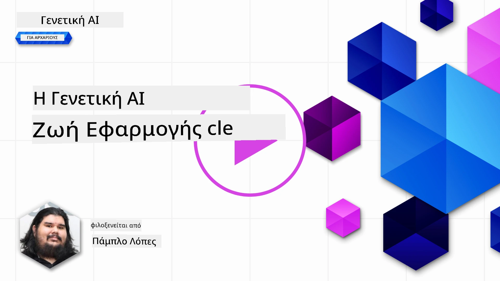
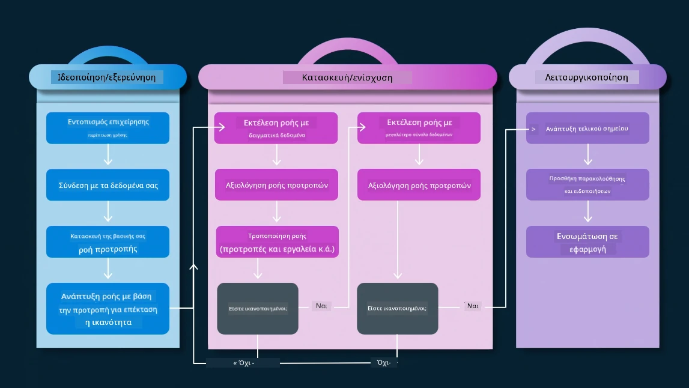
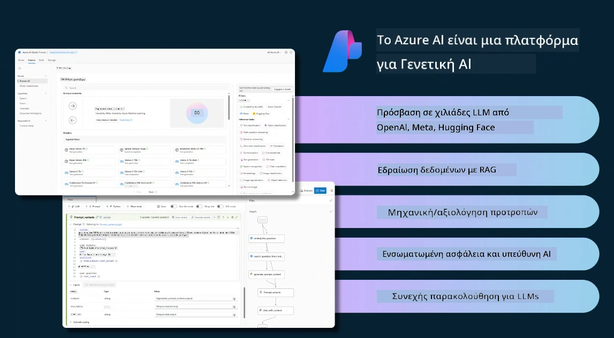
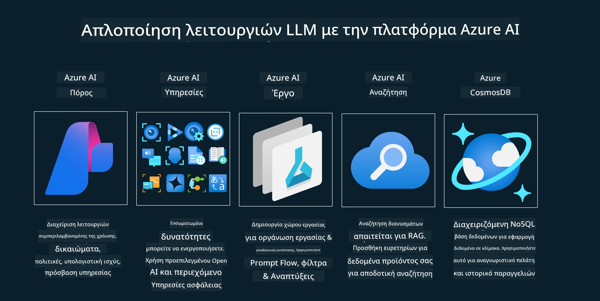
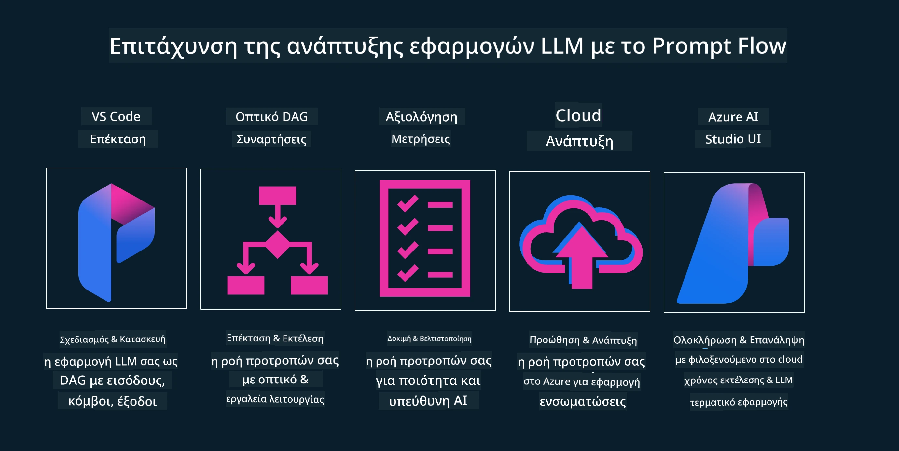

# Ο Κύκλος Ζωής Εφαρμογών Γενετικής Τεχνητής Νοημοσύνης

Ένα σημαντικό ερώτημα για όλες τις εφαρμογές ΤΝ είναι η συνάφεια των λειτουργιών ΤΝ, καθώς η ΤΝ είναι ένας ταχέως εξελισσόμενος τομέας, για να διασφαλίσετε ότι η εφαρμογή σας παραμένει σχετική, αξιόπιστη και ανθεκτική, πρέπει να την παρακολουθείτε, να την αξιολογείτε και να την βελτιώνετε συνεχώς. Εδώ έρχεται ο κύκλος ζωής της γενετικής ΤΝ.

Ο κύκλος ζωής της γενετικής ΤΝ είναι ένα πλαίσιο που σας καθοδηγεί στα στάδια ανάπτυξης, ανάπτυξης και συντήρησης μιας εφαρμογής γενετικής ΤΝ. Σας βοηθά να ορίσετε τους στόχους σας, να μετρήσετε την απόδοσή σας, να εντοπίσετε τις προκλήσεις σας και να εφαρμόσετε τις λύσεις σας. Σας βοηθά επίσης να ευθυγραμμίσετε την εφαρμογή σας με τα ηθικά και νομικά πρότυπα του τομέα σας και των ενδιαφερομένων σας. Ακολουθώντας τον κύκλο ζωής της γενετικής ΤΝ, μπορείτε να διασφαλίσετε ότι η εφαρμογή σας παρέχει πάντα αξία και ικανοποιεί τους χρήστες σας.

## Εισαγωγή

Σε αυτό το κεφάλαιο, θα:

- Κατανοήσετε τη Μετατόπιση Παραδείγματος από MLOps σε LLMOps
- Τον Κύκλο Ζωής LLM
- Εργαλεία Κύκλου Ζωής
- Μετρική και Αξιολόγηση Κύκλου Ζωής

## Κατανοήστε τη Μετατόπιση Παραδείγματος από MLOps σε LLMOps

Τα LLMs είναι ένα νέο εργαλείο στο οπλοστάσιο της Τεχνητής Νοημοσύνης, είναι απίστευτα ισχυρά σε εργασίες ανάλυσης και δημιουργίας για εφαρμογές, ωστόσο αυτή η δύναμη έχει κάποιες συνέπειες στον τρόπο που απλοποιούμε τις εργασίες ΤΝ και Κλασικής Μηχανικής Μάθησης.

Με αυτό, χρειαζόμαστε ένα νέο Παράδειγμα για να προσαρμόσουμε αυτό το εργαλείο δυναμικά, με τα σωστά κίνητρα. Μπορούμε να κατηγοριοποιήσουμε τις παλαιότερες εφαρμογές ΤΝ ως "ML Apps" και τις νεότερες εφαρμογές ΤΝ ως "GenAI Apps" ή απλά "AI Apps", αντανακλώντας την κυρίαρχη τεχνολογία και τεχνικές που χρησιμοποιούνται εκείνη την εποχή. Αυτό μετατοπίζει την αφήγησή μας με πολλούς τρόπους, δείτε την παρακάτω σύγκριση.

Παρατηρήστε ότι στο LLMOps, εστιάζουμε περισσότερο στους Προγραμματιστές Εφαρμογών, χρησιμοποιώντας ενσωματώσεις ως βασικό σημείο, χρησιμοποιώντας "Models-as-a-Service" και σκεπτόμενοι τα ακόλουθα σημεία για μετρικές.

- Ποιότητα: Ποιότητα απάντησης
- Βλάβη: Υπεύθυνη ΤΝ
- Ειλικρίνεια: Βάση απάντησης (Έχει νόημα; Είναι σωστή;)
- Κόστος: Προϋπολογισμός λύσης
- Καθυστέρηση: Μέσος χρόνος απόκρισης token

## Ο Κύκλος Ζωής LLM

Πρώτα, για να κατανοήσουμε τον κύκλο ζωής και τις τροποποιήσεις, ας σημειώσουμε το επόμενο infographic.

Όπως ίσως παρατηρήσετε, αυτό διαφέρει από τους συνήθεις Κύκλους Ζωής του MLOps. Τα LLM έχουν πολλές νέες απαιτήσεις, όπως το Prompting, διαφορετικές τεχνικές για βελτίωση ποιότητας (Fine-Tuning, RAG, Meta-Prompts), διαφορετική αξιολόγηση και υπευθυνότητα με υπεύθυνη ΤΝ, τέλος, νέες μετρικές αξιολόγησης (Ποιότητα, Βλάβη, Ειλικρίνεια, Κόστος και Καθυστέρηση).

Για παράδειγμα, ρίξτε μια ματιά στο πώς ιδεολογούμε. Χρησιμοποιώντας μηχανική προτροπής για να πειραματιστούμε με διάφορα LLMs για να εξερευνήσουμε δυνατότητες και να δοκιμάσουμε αν η Υπόθεσή τους μπορεί να είναι σωστή.

Σημειώστε ότι αυτό δεν είναι γραμμικό, αλλά ενσωματωμένοι βρόχοι, επαναληπτικοί και με έναν υπερκείμενο κύκλο.

Πώς θα μπορούσαμε να εξερευνήσουμε αυτά τα βήματα; Ας δούμε λεπτομερώς πώς θα μπορούσαμε να δημιουργήσουμε έναν κύκλο ζωής.

Αυτό μπορεί να φαίνεται λίγο περίπλοκο, ας εστιάσουμε πρώτα στα τρία μεγάλα βήματα.

1. Ιδεολογία/Εξερεύνηση: Εξερεύνηση, εδώ μπορούμε να εξερευνήσουμε σύμφωνα με τις επιχειρηματικές μας ανάγκες. Πρωτοτυποποίηση, δημιουργία ενός [PromptFlow](https://microsoft.github.io/promptflow/index.html?WT.mc_id=academic-105485-koreyst) και δοκιμή αν είναι αρκετά αποδοτικό για την Υπόθεσή μας.
1. Κατασκευή/Ενίσχυση: Υλοποίηση, τώρα, αρχίζουμε να αξιολογούμε για μεγαλύτερα σύνολα δεδομένων, εφαρμόζουμε τεχνικές, όπως Fine-tuning και RAG, για να ελέγξουμε την ανθεκτικότητα της λύσης μας. Αν δεν λειτουργεί, η επανεφαρμογή της, η προσθήκη νέων βημάτων στη ροή μας ή η αναδιάρθρωση των δεδομένων μπορεί να βοηθήσει. Μετά τη δοκιμή της ροής και της κλίμακας μας, αν λειτουργεί και ελέγξουμε τις Μετρικές μας, είναι έτοιμο για το επόμενο βήμα.
1. Λειτουργικοποίηση: Ενσωμάτωση, τώρα προσθέτουμε Συστήματα Παρακολούθησης και Ειδοποιήσεων στο σύστημά μας, ανάπτυξη και ενσωμάτωση εφαρμογής στην Εφαρμογή μας.

Στη συνέχεια, έχουμε τον υπερκείμενο κύκλο Διαχείρισης, εστιάζοντας στην ασφάλεια, τη συμμόρφωση και τη διακυβέρνηση.

Συγχαρητήρια, τώρα έχετε την εφαρμογή ΤΝ έτοιμη για λειτουργία. Για μια πρακτική εμπειρία, ρίξτε μια ματιά στο [Contoso Chat Demo.](https://nitya.github.io/contoso-chat/?WT.mc_id=academic-105485-koreys)

Τώρα, ποια εργαλεία μπορούμε να χρησιμοποιήσουμε;

## Εργαλεία Κύκλου Ζωής

Για εργαλεία, η Microsoft παρέχει την [Azure AI Platform](https://azure.microsoft.com/solutions/ai/?WT.mc_id=academic-105485-koreys) και το [PromptFlow](https://microsoft.github.io/promptflow/index.html?WT.mc_id=academic-105485-koreyst) που διευκολύνουν και κάνουν τον κύκλο σας εύκολο στην υλοποίηση και έτοιμο για χρήση.

Η [Azure AI Platform](https://azure.microsoft.com/solutions/ai/?WT.mc_id=academic-105485-koreys), σας επιτρέπει να χρησιμοποιήσετε το [AI Studio](https://ai.azure.com/?WT.mc_id=academic-105485-koreys). Το AI Studio είναι μια διαδικτυακή πύλη που σας επιτρέπει να εξερευνήσετε μοντέλα, δείγματα και εργαλεία. Διαχειρίζεστε τους πόρους σας, ροές ανάπτυξης UI και επιλογές SDK/CLI για ανάπτυξη με κώδικα.

Το Azure AI, σας επιτρέπει να χρησιμοποιήσετε πολλαπλούς πόρους, για να διαχειριστείτε τις λειτουργίες, τις υπηρεσίες, τα έργα, την αναζήτηση διανυσμάτων και τις ανάγκες βάσεων δεδομένων.

Κατασκευάστε, από Proof-of-Concept (POC) μέχρι εφαρμογές μεγάλης κλίμακας με το PromptFlow:

- Σχεδιάστε και δημιουργήστε εφαρμογές από το VS Code, με οπτικά και λειτουργικά εργαλεία
- Δοκιμάστε και βελτιστοποιήστε τις εφαρμογές σας για ποιοτική ΤΝ, με ευκολία.
- Χρησιμοποιήστε το Azure AI Studio για να ενσωματώσετε και να επαναλάβετε με το cloud, Push και Deploy για γρήγορη ενσωμάτωση.

## Υπέροχα! Συνεχίστε τη Μάθησή σας!

Καταπληκτικά, τώρα μάθετε περισσότερα για το πώς δομούμε μια εφαρμογή για να χρησιμοποιήσετε τις έννοιες με την [Εφαρμογή Contoso Chat](https://nitya.github.io/contoso-chat/?WT.mc_id=academic-105485-koreyst), για να δείτε πώς το Cloud Advocacy προσθέτει αυτές τις έννοιες σε επιδείξεις. Για περισσότερο περιεχόμενο, δείτε τη [συνεδρία breakout του Ignite!](https://www.youtube.com/watch?v=DdOylyrTOWg)

Τώρα, δείτε το Μάθημα 15, για να κατανοήσετε πώς το [Retrieval Augmented Generation και οι Βάσεις Δεδομένων Διανυσμάτων](../15-rag-and-vector-databases/README.md?WT.mc_id=academic-105485-koreyst) επηρεάζουν τη Γενετική ΤΝ και να δημιουργήσετε πιο ελκυστικές Εφαρμογές!

---

<!-- CO-OP TRANSLATOR DISCLAIMER START -->
**Αποποίηση ευθυνών**:  
Αυτό το έγγραφο έχει μεταφραστεί χρησιμοποιώντας την υπηρεσία αυτόματης μετάφρασης AI [Co-op Translator](https://github.com/Azure/co-op-translator). Παρόλο που επιδιώκουμε την ακρίβεια, παρακαλούμε να λάβετε υπόψη ότι οι αυτόματες μεταφράσεις ενδέχεται να περιέχουν λάθη ή ανακρίβειες. Το πρωτότυπο έγγραφο στη μητρική του γλώσσα πρέπει να θεωρείται η αυθεντική πηγή. Για κρίσιμες πληροφορίες, συνιστάται επαγγελματική ανθρώπινη μετάφραση. Δεν φέρουμε ευθύνη για τυχόν παρεξηγήσεις ή λανθασμένες ερμηνείες που προκύπτουν από τη χρήση αυτής της μετάφρασης.
<!-- CO-OP TRANSLATOR DISCLAIMER END -->