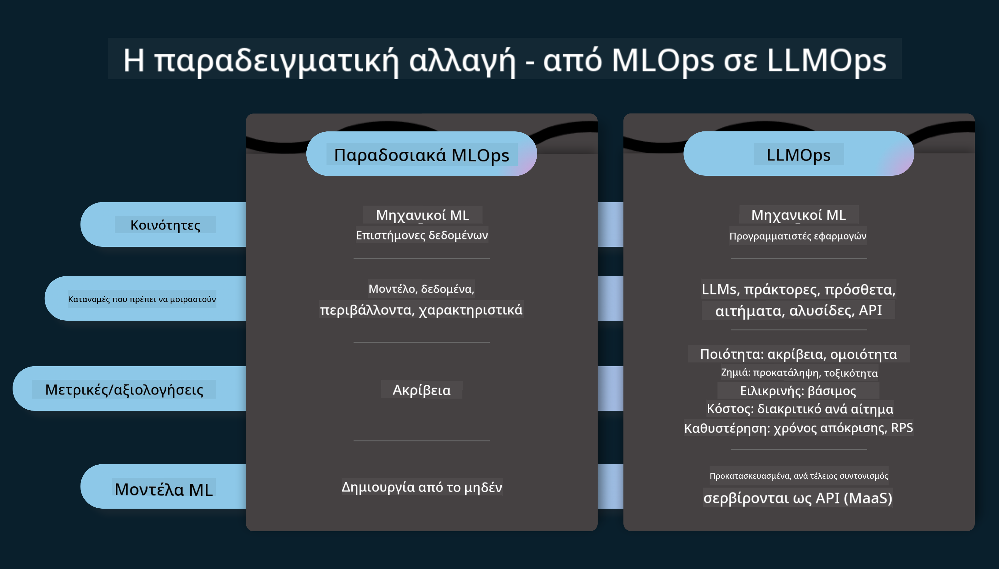
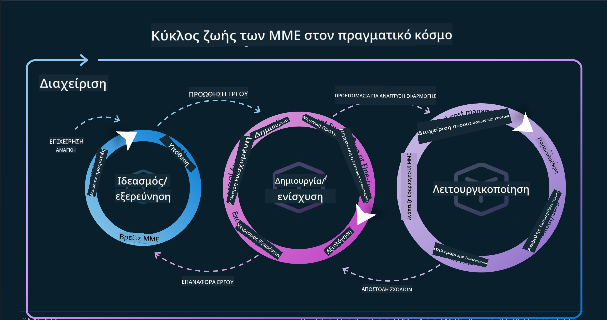
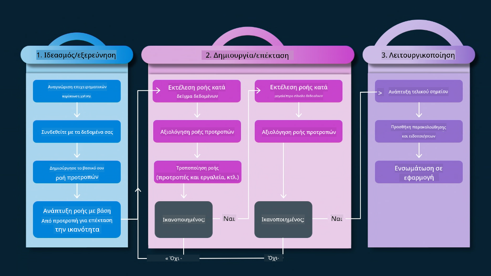
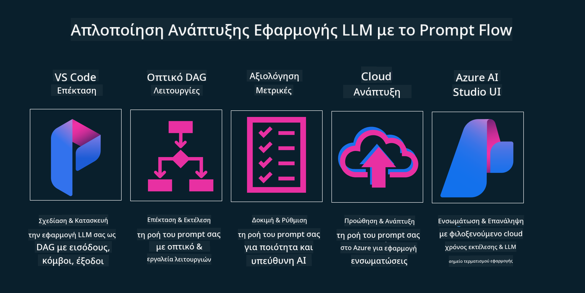

<!--
CO_OP_TRANSLATOR_METADATA:
{
  "original_hash": "27a5347a5022d5ef0a72ab029b03526a",
  "translation_date": "2025-07-09T15:53:32+00:00",
  "source_file": "14-the-generative-ai-application-lifecycle/README.md",
  "language_code": "el"
}
-->

# Ο Κύκλος Ζωής Εφαρμογών Γεννητικής Τεχνητής Νοημοσύνης

Ένα σημαντικό ερώτημα για όλες τις εφαρμογές ΤΝ είναι η συνάφεια των λειτουργιών ΤΝ, καθώς η ΤΝ εξελίσσεται ραγδαία. Για να διασφαλίσετε ότι η εφαρμογή σας παραμένει σχετική, αξιόπιστη και ανθεκτική, χρειάζεται να την παρακολουθείτε, να την αξιολογείτε και να την βελτιώνετε συνεχώς. Εδώ έρχεται ο κύκλος ζωής της γεννητικής ΤΝ.

Ο κύκλος ζωής της γεννητικής ΤΝ είναι ένα πλαίσιο που σας καθοδηγεί στα στάδια ανάπτυξης, υλοποίησης και συντήρησης μιας εφαρμογής γεννητικής ΤΝ. Σας βοηθά να ορίσετε τους στόχους σας, να μετρήσετε την απόδοσή σας, να εντοπίσετε τις προκλήσεις και να εφαρμόσετε λύσεις. Επιπλέον, σας βοηθά να ευθυγραμμίσετε την εφαρμογή σας με τα ηθικά και νομικά πρότυπα του τομέα σας και των ενδιαφερομένων σας. Ακολουθώντας τον κύκλο ζωής της γεννητικής ΤΝ, διασφαλίζετε ότι η εφαρμογή σας προσφέρει πάντα αξία και ικανοποιεί τους χρήστες σας.

## Εισαγωγή

Σε αυτό το κεφάλαιο, θα:

- Κατανοήσετε τη Μετατόπιση Παραδείγματος από MLOps σε LLMOps  
- Τον Κύκλο Ζωής των LLM  
- Εργαλεία Κύκλου Ζωής  
- Μετρικές και Αξιολόγηση Κύκλου Ζωής

## Κατανοήστε τη Μετατόπιση Παραδείγματος από MLOps σε LLMOps

Τα LLMs είναι ένα νέο εργαλείο στο οπλοστάσιο της Τεχνητής Νοημοσύνης, εξαιρετικά ισχυρά σε εργασίες ανάλυσης και δημιουργίας για εφαρμογές. Ωστόσο, αυτή η ισχύς έχει συνέπειες στον τρόπο που οργανώνουμε τις εργασίες ΤΝ και Κλασικής Μηχανικής Μάθησης.

Για αυτό χρειαζόμαστε ένα νέο παράδειγμα για να προσαρμόσουμε αυτό το εργαλείο δυναμικά, με τα σωστά κίνητρα. Μπορούμε να κατηγοριοποιήσουμε τις παλαιότερες εφαρμογές ΤΝ ως "ML Apps" και τις νεότερες ως "GenAI Apps" ή απλά "AI Apps", αντανακλώντας την κυρίαρχη τεχνολογία και τεχνικές της εποχής. Αυτό αλλάζει την αφήγησή μας με πολλούς τρόπους, δείτε την παρακάτω σύγκριση.

Παρατηρήστε ότι στο LLMOps, εστιάζουμε περισσότερο στους προγραμματιστές εφαρμογών, χρησιμοποιώντας ενσωματώσεις ως βασικό σημείο, αξιοποιώντας "Models-as-a-Service" και σκεπτόμενοι τα εξής για τις μετρικές:

- Ποιότητα: Ποιότητα απάντησης  
- Βλάβη: Υπεύθυνη ΤΝ  
- Ειλικρίνεια: Βάση απάντησης (Έχει νόημα; Είναι σωστή;)  
- Κόστος: Προϋπολογισμός λύσης  
- Καθυστέρηση: Μέσος χρόνος απόκρισης ανά token

## Ο Κύκλος Ζωής των LLM

Πρώτα, για να κατανοήσουμε τον κύκλο ζωής και τις τροποποιήσεις, ας δούμε το παρακάτω infographic.

Όπως ίσως παρατηρήσετε, αυτό διαφέρει από τους συνήθεις κύκλους ζωής του MLOps. Τα LLM έχουν πολλές νέες απαιτήσεις, όπως το Prompting, διαφορετικές τεχνικές βελτίωσης ποιότητας (Fine-Tuning, RAG, Meta-Prompts), διαφορετική αξιολόγηση και υπευθυνότητα με υπεύθυνη ΤΝ, και τέλος, νέες μετρικές αξιολόγησης (Ποιότητα, Βλάβη, Ειλικρίνεια, Κόστος και Καθυστέρηση).

Για παράδειγμα, δείτε πώς κάνουμε ιδεασμό. Χρησιμοποιώντας prompt engineering για να πειραματιστούμε με διάφορα LLMs και να εξερευνήσουμε πιθανότητες για να ελέγξουμε αν η υπόθεσή μας μπορεί να είναι σωστή.

Σημειώστε ότι δεν είναι γραμμικό, αλλά ενσωματωμένοι βρόχοι, επαναληπτικοί και με έναν υπερκείμενο κύκλο.

Πώς μπορούμε να εξερευνήσουμε αυτά τα βήματα; Ας δούμε λεπτομερώς πώς μπορούμε να χτίσουμε έναν κύκλο ζωής.

Αυτό μπορεί να φαίνεται λίγο περίπλοκο, ας εστιάσουμε πρώτα στα τρία μεγάλα βήματα.

1. Ιδεασμός/Εξερεύνηση: Εξερεύνηση, εδώ μπορούμε να εξερευνήσουμε ανάλογα με τις επιχειρηματικές μας ανάγκες. Πρωτοτυποποίηση, δημιουργία ενός [PromptFlow](https://microsoft.github.io/promptflow/index.html?WT.mc_id=academic-105485-koreyst) και έλεγχος αν είναι αρκετά αποδοτικό για την υπόθεσή μας.  
1. Κατασκευή/Ενίσχυση: Υλοποίηση, τώρα ξεκινάμε την αξιολόγηση σε μεγαλύτερα σύνολα δεδομένων, εφαρμόζοντας τεχνικές όπως Fine-tuning και RAG, για να ελέγξουμε την ανθεκτικότητα της λύσης μας. Αν δεν λειτουργεί, η επανυλοποίηση, η προσθήκη νέων βημάτων στη ροή ή η αναδιάρθρωση των δεδομένων μπορεί να βοηθήσει. Μετά τον έλεγχο της ροής και της κλίμακας, αν λειτουργεί και οι μετρικές είναι ικανοποιητικές, είναι έτοιμο για το επόμενο βήμα.  
1. Λειτουργικοποίηση: Ενσωμάτωση, τώρα προσθέτουμε συστήματα παρακολούθησης και ειδοποιήσεων, ανάπτυξη και ενσωμάτωση της εφαρμογής στην πλατφόρμα μας.

Στη συνέχεια, υπάρχει ο υπερκείμενος κύκλος της Διαχείρισης, με έμφαση στην ασφάλεια, τη συμμόρφωση και τη διακυβέρνηση.

Συγχαρητήρια, τώρα η εφαρμογή ΤΝ σας είναι έτοιμη και λειτουργική. Για πρακτική εμπειρία, ρίξτε μια ματιά στο [Contoso Chat Demo.](https://nitya.github.io/contoso-chat/?WT.mc_id=academic-105485-koreys)

Τώρα, ποια εργαλεία μπορούμε να χρησιμοποιήσουμε;

## Εργαλεία Κύκλου Ζωής

Για εργαλεία, η Microsoft παρέχει την [Azure AI Platform](https://azure.microsoft.com/solutions/ai/?WT.mc_id=academic-105485-koreys) και το [PromptFlow](https://microsoft.github.io/promptflow/index.html?WT.mc_id=academic-105485-koreyst) που διευκολύνουν και κάνουν τον κύκλο σας εύκολο στην υλοποίηση και έτοιμο για χρήση.

Η [Azure AI Platform](https://azure.microsoft.com/solutions/ai/?WT.mc_id=academic-105485-koreys) σας επιτρέπει να χρησιμοποιήσετε το [AI Studio](https://ai.azure.com/?WT.mc_id=academic-105485-koreys). Το AI Studio είναι μια διαδικτυακή πύλη που σας επιτρέπει να εξερευνήσετε μοντέλα, δείγματα και εργαλεία. Διαχειρίζεστε τους πόρους σας, τις ροές ανάπτυξης UI και τις επιλογές SDK/CLI για ανάπτυξη με κώδικα.

Το Azure AI σας επιτρέπει να χρησιμοποιήσετε πολλαπλούς πόρους για να διαχειριστείτε τις λειτουργίες, τις υπηρεσίες, τα έργα, τις ανάγκες αναζήτησης vector και βάσεων δεδομένων.

Κατασκευάστε, από Proof-of-Concept (POC) μέχρι εφαρμογές μεγάλης κλίμακας με το PromptFlow:

- Σχεδιάστε και δημιουργήστε εφαρμογές από το VS Code, με οπτικά και λειτουργικά εργαλεία  
- Δοκιμάστε και βελτιστοποιήστε τις εφαρμογές σας για ποιοτική ΤΝ, εύκολα  
- Χρησιμοποιήστε το Azure AI Studio για να ενσωματώσετε και να επαναλάβετε με το cloud, να προωθήσετε και να αναπτύξετε για γρήγορη ενσωμάτωση

## Τέλεια! Συνεχίστε τη Μάθησή σας!

Καταπληκτικά, τώρα μάθετε περισσότερα για το πώς δομούμε μια εφαρμογή για να χρησιμοποιήσετε τις έννοιες με το [Contoso Chat App](https://nitya.github.io/contoso-chat/?WT.mc_id=academic-105485-koreyst), για να δείτε πώς το Cloud Advocacy ενσωματώνει αυτές τις έννοιες σε επιδείξεις. Για περισσότερο περιεχόμενο, δείτε την [Ignite breakout session!](https://www.youtube.com/watch?v=DdOylyrTOWg)

Τώρα, δείτε το Μάθημα 15, για να κατανοήσετε πώς το [Retrieval Augmented Generation και οι Vector Databases](../15-rag-and-vector-databases/README.md?WT.mc_id=academic-105485-koreyst) επηρεάζουν τη Γεννητική ΤΝ και πώς να δημιουργήσετε πιο ελκυστικές εφαρμογές!

**Αποποίηση ευθυνών**:  
Αυτό το έγγραφο έχει μεταφραστεί χρησιμοποιώντας την υπηρεσία αυτόματης μετάφρασης AI [Co-op Translator](https://github.com/Azure/co-op-translator). Παρόλο που επιδιώκουμε την ακρίβεια, παρακαλούμε να έχετε υπόψη ότι οι αυτόματες μεταφράσεις ενδέχεται να περιέχουν λάθη ή ανακρίβειες. Το πρωτότυπο έγγραφο στη γλώσσα του θεωρείται η αυθεντική πηγή. Για κρίσιμες πληροφορίες, συνιστάται επαγγελματική ανθρώπινη μετάφραση. Δεν φέρουμε ευθύνη για τυχόν παρεξηγήσεις ή λανθασμένες ερμηνείες που προκύπτουν από τη χρήση αυτής της μετάφρασης.