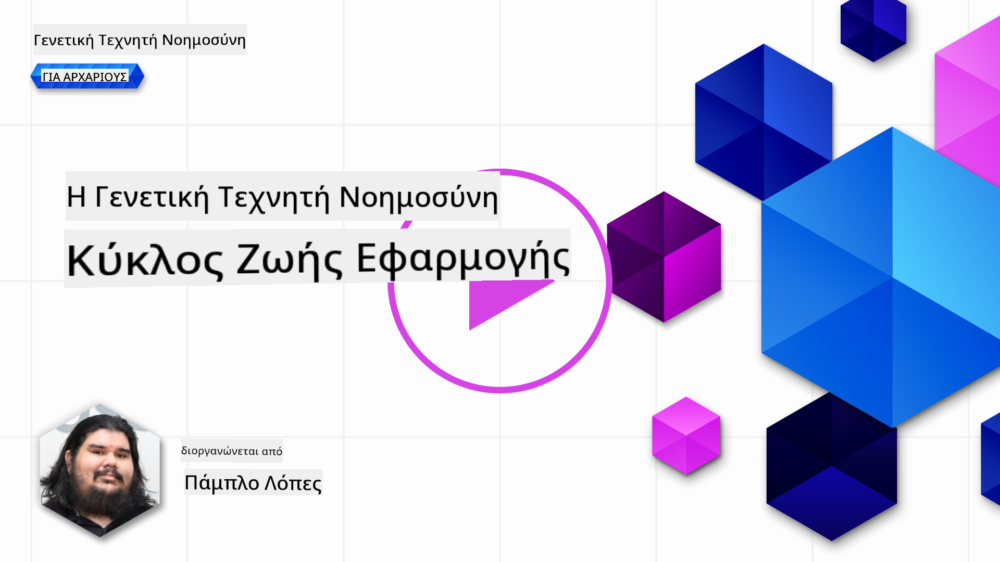
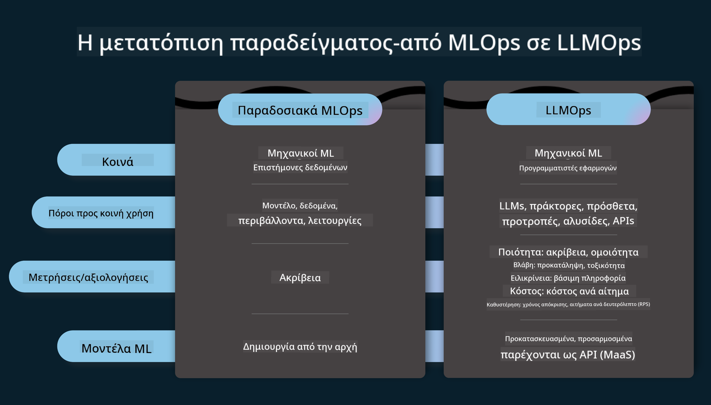
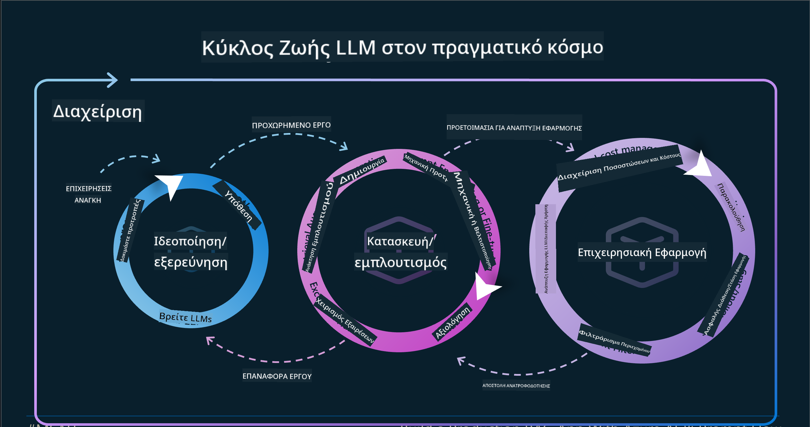
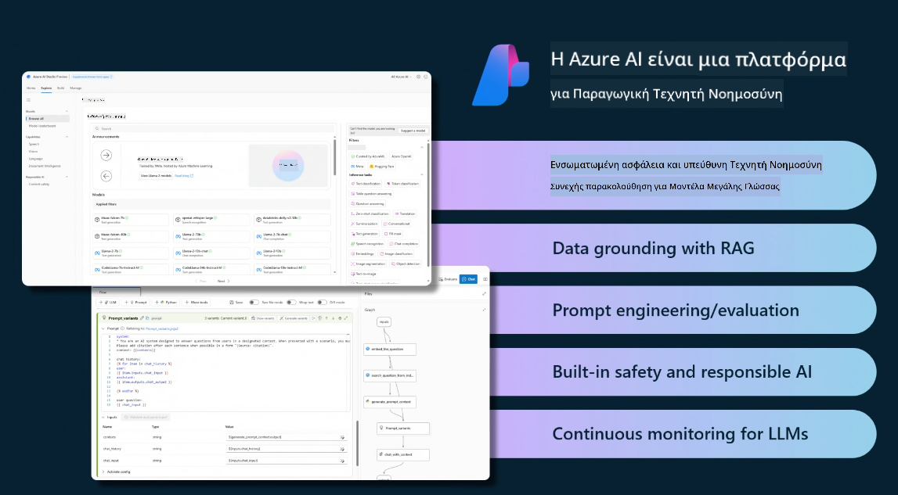
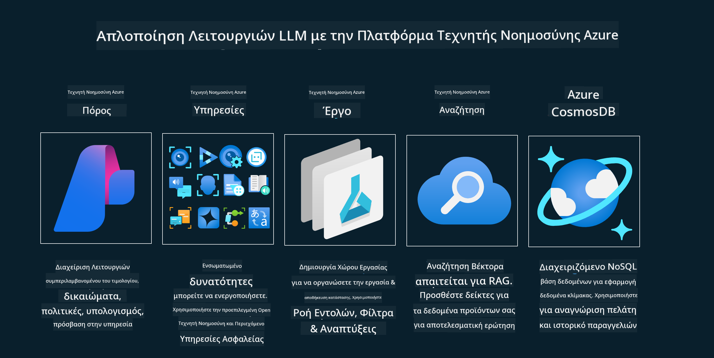
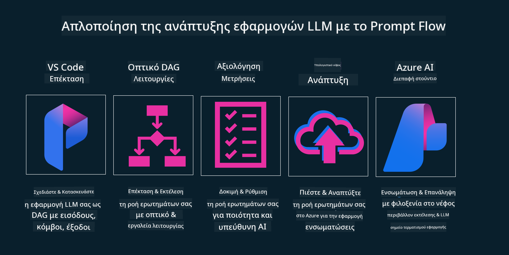

<!--
CO_OP_TRANSLATOR_METADATA:
{
  "original_hash": "27a5347a5022d5ef0a72ab029b03526a",
  "translation_date": "2025-05-19T23:27:48+00:00",
  "source_file": "14-the-generative-ai-application-lifecycle/README.md",
  "language_code": "el"
}
-->

# Ο Κύκλος Ζωής Εφαρμογών Γεννητικής AI

Ένα σημαντικό ερώτημα για όλες τις εφαρμογές AI είναι η συνάφεια των χαρακτηριστικών AI, καθώς η AI είναι ένα πεδίο που εξελίσσεται γρήγορα. Για να διασφαλίσετε ότι η εφαρμογή σας παραμένει σχετική, αξιόπιστη και ανθεκτική, πρέπει να την παρακολουθείτε, να την αξιολογείτε και να τη βελτιώνετε συνεχώς. Εδώ μπαίνει ο κύκλος ζωής της γεννητικής AI.

Ο κύκλος ζωής της γεννητικής AI είναι ένα πλαίσιο που σας καθοδηγεί μέσα από τα στάδια ανάπτυξης, ανάπτυξης και συντήρησης μιας εφαρμογής γεννητικής AI. Σας βοηθά να καθορίσετε τους στόχους σας, να μετρήσετε την απόδοσή σας, να εντοπίσετε τις προκλήσεις σας και να εφαρμόσετε τις λύσεις σας. Σας βοηθά επίσης να ευθυγραμμίσετε την εφαρμογή σας με τα ηθικά και νομικά πρότυπα του τομέα σας και των ενδιαφερόμενων μερών σας. Ακολουθώντας τον κύκλο ζωής της γεννητικής AI, μπορείτε να διασφαλίσετε ότι η εφαρμογή σας προσφέρει πάντα αξία και ικανοποιεί τους χρήστες σας.

## Εισαγωγή

Σε αυτό το κεφάλαιο, θα:

- Κατανοήσετε τη Μετατόπιση Παραδείγματος από MLOps σε LLMOps
- Ο Κύκλος Ζωής του LLM
- Εργαλεία Κύκλου Ζωής
- Μετρήσεις και Αξιολόγηση Κύκλου Ζωής

## Κατανοήστε τη Μετατόπιση Παραδείγματος από MLOps σε LLMOps

Τα LLMs είναι ένα νέο εργαλείο στο οπλοστάσιο της Τεχνητής Νοημοσύνης, είναι εξαιρετικά ισχυρά σε αναλυτικές και γεννητικές εργασίες για εφαρμογές, ωστόσο αυτή η δύναμη έχει κάποιες συνέπειες στον τρόπο που βελτιστοποιούμε τις εργασίες AI και Κλασικής Μηχανικής Μάθησης.

Με αυτό, χρειαζόμαστε ένα νέο Παραδείγμα για να προσαρμόσουμε αυτό το εργαλείο δυναμικά, με τα σωστά κίνητρα. Μπορούμε να κατηγοριοποιήσουμε παλαιότερες εφαρμογές AI ως "ML Apps" και νεότερες εφαρμογές AI ως "GenAI Apps" ή απλά "AI Apps", αντικατοπτρίζοντας την κυρίαρχη τεχνολογία και τις τεχνικές που χρησιμοποιούνται εκείνη την εποχή. Αυτό μετατοπίζει την αφήγησή μας με πολλούς τρόπους, δείτε την παρακάτω σύγκριση.

Σημειώστε ότι στο LLMOps, επικεντρωνόμαστε περισσότερο στους Προγραμματιστές Εφαρμογών, χρησιμοποιώντας ενσωματώσεις ως βασικό σημείο, χρησιμοποιώντας "Models-as-a-Service" και σκεφτόμαστε τα παρακάτω σημεία για μετρήσεις.

- Ποιότητα: Ποιότητα απάντησης
- Βλάβη: Υπεύθυνη AI
- Ειλικρίνεια: Βάση απάντησης (Έχει νόημα; Είναι σωστή;)
- Κόστος: Προϋπολογισμός λύσης
- Καθυστέρηση: Μέσος χρόνος για απάντηση token

## Ο Κύκλος Ζωής του LLM

Πρώτα, για να κατανοήσουμε τον κύκλο ζωής και τις τροποποιήσεις, ας σημειώσουμε το επόμενο infographic.

Όπως μπορεί να παρατηρήσετε, αυτό διαφέρει από τους συνήθεις Κύκλους Ζωής από MLOps. Τα LLMs έχουν πολλές νέες απαιτήσεις, όπως Prompting, διαφορετικές τεχνικές για βελτίωση ποιότητας (Fine-Tuning, RAG, Meta-Prompts), διαφορετική αξιολόγηση και ευθύνη με υπεύθυνη AI, τέλος, νέες μετρικές αξιολόγησης (Ποιότητα, Βλάβη, Ειλικρίνεια, Κόστος και Καθυστέρηση).

Για παράδειγμα, δείτε πώς ιδεαζόμαστε. Χρησιμοποιώντας την προσαρμογή προτροπής για να πειραματιστούμε με διάφορα LLMs για να εξερευνήσουμε δυνατότητες και να δοκιμάσουμε αν η Υπόθεσή τους θα μπορούσε να είναι σωστή.

Σημειώστε ότι αυτό δεν είναι γραμμικό, αλλά ενσωματωμένοι κύκλοι, επαναληπτικοί και με έναν υπερκείμενο κύκλο.

Πώς θα μπορούσαμε να εξερευνήσουμε αυτά τα βήματα; Ας προχωρήσουμε σε λεπτομέρειες για το πώς θα μπορούσαμε να δημιουργήσουμε έναν κύκλο ζωής.

Αυτό μπορεί να φαίνεται λίγο περίπλοκο, ας επικεντρωθούμε πρώτα στα τρία μεγάλα βήματα.

1. Ιδεασμός/Εξερεύνηση: Εξερεύνηση, εδώ μπορούμε να εξερευνήσουμε σύμφωνα με τις επιχειρηματικές μας ανάγκες. Πρωτότυπα, δημιουργώντας ένα [PromptFlow](https://microsoft.github.io/promptflow/index.html?WT.mc_id=academic-105485-koreyst) και να δοκιμάσουμε αν είναι αρκετά αποδοτικό για την Υπόθεσή μας.
2. Κατασκευή/Ενίσχυση: Υλοποίηση, τώρα, ξεκινάμε να αξιολογούμε για μεγαλύτερα σύνολα δεδομένων και να εφαρμόζουμε τεχνικές, όπως Fine-tuning και RAG, για να ελέγξουμε την ανθεκτικότητα της λύσης μας. Αν δεν είναι, η επαναφορά του, προσθέτοντας νέα βήματα στη ροή μας ή αναδιάρθρωση των δεδομένων, μπορεί να βοηθήσει. Μετά τη δοκιμή της ροής μας και της κλίμακας μας, αν λειτουργεί και ελέγξουμε τις Μετρικές μας, είναι έτοιμη για το επόμενο βήμα.
3. Λειτουργικοποίηση: Ενσωμάτωση, τώρα προσθέτοντας Συστήματα Παρακολούθησης και Ειδοποιήσεων στο σύστημά μας, ανάπτυξη και ενσωμάτωση εφαρμογής στην Εφαρμογή μας.

Στη συνέχεια, έχουμε τον υπερκείμενο κύκλο της Διαχείρισης, επικεντρωμένος στην ασφάλεια, συμμόρφωση και διακυβέρνηση.

Συγχαρητήρια, τώρα έχετε την AI Εφαρμογή σας έτοιμη και λειτουργική. Για μια πρακτική εμπειρία, ρίξτε μια ματιά στο [Contoso Chat Demo.](https://nitya.github.io/contoso-chat/?WT.mc_id=academic-105485-koreys)

Τώρα, ποια εργαλεία μπορούμε να χρησιμοποιήσουμε;

## Εργαλεία Κύκλου Ζωής

Για εργαλεία, η Microsoft παρέχει την [Azure AI Platform](https://azure.microsoft.com/solutions/ai/?WT.mc_id=academic-105485-koreys) και το [PromptFlow](https://microsoft.github.io/promptflow/index.html?WT.mc_id=academic-105485-koreyst) διευκολύνει και καθιστά τον κύκλο σας εύκολο να υλοποιηθεί και έτοιμο προς χρήση.

Η [Azure AI Platform](https://azure.microsoft.com/solutions/ai/?WT.mc_id=academic-105485-koreys), σας επιτρέπει να χρησιμοποιείτε το [AI Studio](https://ai.azure.com/?WT.mc_id=academic-105485-koreys). Το AI Studio είναι μια διαδικτυακή πύλη που σας επιτρέπει να εξερευνήσετε μοντέλα, δείγματα και εργαλεία. Διαχείριση των πόρων σας, ροές ανάπτυξης UI και επιλογές SDK/CLI για ανάπτυξη με κώδικα πρώτα.

Το Azure AI, σας επιτρέπει να χρησιμοποιείτε πολλαπλούς πόρους, για να διαχειρίζεστε τις λειτουργίες σας, υπηρεσίες, έργα, αναζήτηση με διανύσματα και ανάγκες βάσεων δεδομένων.

Δημιουργήστε, από Proof-of-Concept(POC) έως εφαρμογές μεγάλης κλίμακας με το PromptFlow:

- Σχεδιάστε και Δημιουργήστε εφαρμογές από το VS Code, με οπτικά και λειτουργικά εργαλεία
- Δοκιμάστε και βελτιώστε τις εφαρμογές σας για ποιοτική AI, με ευκολία.
- Χρησιμοποιήστε το Azure AI Studio για να Ενσωματώσετε και να Επαναλάβετε με το cloud, Push και Deploy για γρήγορη ενσωμάτωση.

## Υπέροχα! Συνεχίστε τη Μάθησή σας!

Καταπληκτικά, τώρα μάθετε περισσότερα για το πώς δομείται μια εφαρμογή για να χρησιμοποιεί τις έννοιες με την [Contoso Chat App](https://nitya.github.io/contoso-chat/?WT.mc_id=academic-105485-koreyst), για να δείτε πώς η Υποστήριξη Cloud προσθέτει αυτές τις έννοιες στις επιδείξεις. Για περισσότερο περιεχόμενο, δείτε τη [συνεδρία διακοπής Ignite!
](https://www.youtube.com/watch?v=DdOylyrTOWg)

Τώρα, δείτε το Μάθημα 15, για να κατανοήσετε πώς η [Ανάκτηση Ενισχυμένης Γενιάς και οι Βάσεις Δεδομένων με Διανύσματα](../15-rag-and-vector-databases/README.md?WT.mc_id=academic-105485-koreyst) επηρεάζουν τη Γεννητική AI και δημιουργούν πιο ελκυστικές Εφαρμογές!

**Αποποίηση ευθυνών**:  
Αυτό το έγγραφο έχει μεταφραστεί χρησιμοποιώντας την υπηρεσία αυτόματης μετάφρασης [Co-op Translator](https://github.com/Azure/co-op-translator). Παρόλο που επιδιώκουμε την ακρίβεια, παρακαλούμε να γνωρίζετε ότι οι αυτόματες μεταφράσεις ενδέχεται να περιέχουν σφάλματα ή ανακρίβειες. Το αρχικό έγγραφο στη μητρική του γλώσσα θα πρέπει να θεωρείται η αυθεντική πηγή. Για κρίσιμες πληροφορίες, συνιστάται επαγγελματική ανθρώπινη μετάφραση. Δεν φέρουμε ευθύνη για τυχόν παρεξηγήσεις ή παρερμηνείες που προκύπτουν από τη χρήση αυτής της μετάφρασης.