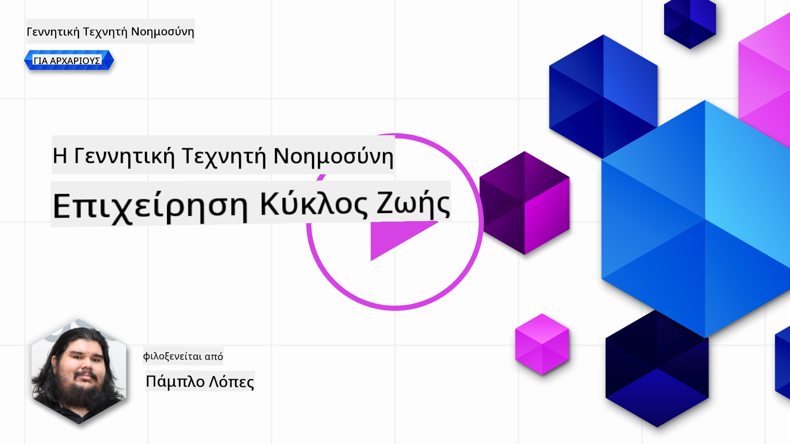
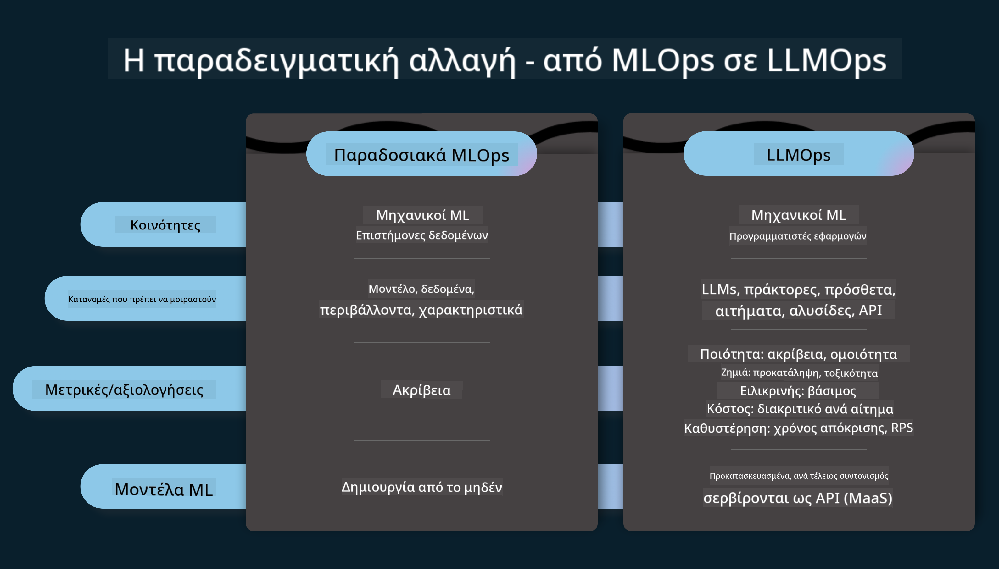
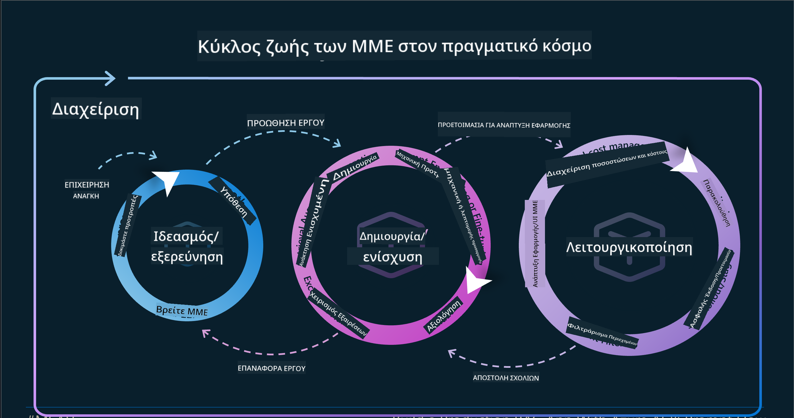
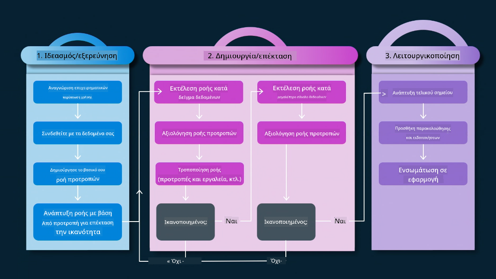
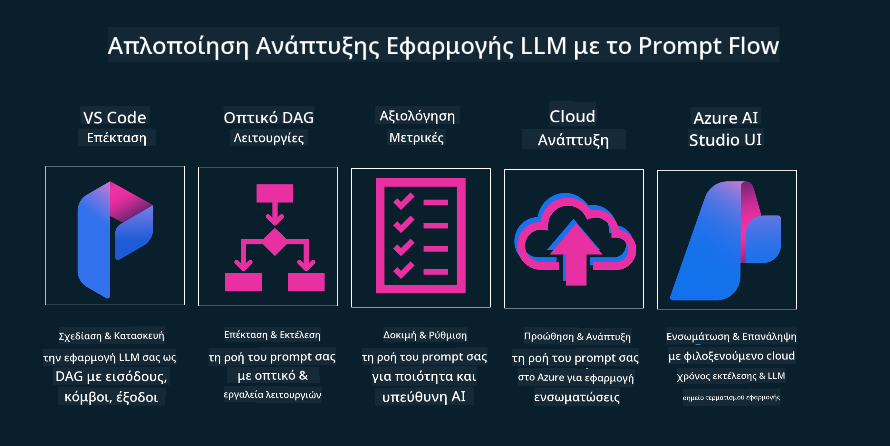

<!--
CO_OP_TRANSLATOR_METADATA:
{
  "original_hash": "27a5347a5022d5ef0a72ab029b03526a",
  "translation_date": "2025-06-25T22:03:31+00:00",
  "source_file": "14-the-generative-ai-application-lifecycle/README.md",
  "language_code": "el"
}
-->

# Ο Κύκλος Ζωής Εφαρμογής Γενετικής Τεχνητής Νοημοσύνης

Μια σημαντική ερώτηση για όλες τις εφαρμογές τεχνητής νοημοσύνης είναι η συνάφεια των χαρακτηριστικών της τεχνητής νοημοσύνης, καθώς η τεχνητή νοημοσύνη είναι ένα πεδίο που εξελίσσεται γρήγορα. Για να διασφαλίσετε ότι η εφαρμογή σας παραμένει σχετική, αξιόπιστη και ανθεκτική, πρέπει να την παρακολουθείτε, να την αξιολογείτε και να τη βελτιώνετε συνεχώς. Εδώ έρχεται ο κύκλος ζωής της γενετικής τεχνητής νοημοσύνης.

Ο κύκλος ζωής της γενετικής τεχνητής νοημοσύνης είναι ένα πλαίσιο που σας καθοδηγεί στα στάδια ανάπτυξης, υλοποίησης και συντήρησης μιας εφαρμογής γενετικής τεχνητής νοημοσύνης. Σας βοηθά να ορίσετε τους στόχους σας, να μετρήσετε την απόδοσή σας, να εντοπίσετε τις προκλήσεις σας και να εφαρμόσετε τις λύσεις σας. Επίσης, σας βοηθά να ευθυγραμμίσετε την εφαρμογή σας με τα ηθικά και νομικά πρότυπα του τομέα σας και των ενδιαφερόμενων μερών σας. Ακολουθώντας τον κύκλο ζωής της γενετικής τεχνητής νοημοσύνης, μπορείτε να διασφαλίσετε ότι η εφαρμογή σας προσφέρει πάντα αξία και ικανοποιεί τους χρήστες σας.

## Εισαγωγή

Σε αυτό το κεφάλαιο, θα:

- Κατανοήσετε την Αλλαγή Παραδείγματος από MLOps σε LLMOps
- Ο Κύκλος Ζωής LLM
- Εργαλεία Κύκλου Ζωής
- Μετρησιμότητα και Αξιολόγηση Κύκλου Ζωής

## Κατανοήστε την Αλλαγή Παραδείγματος από MLOps σε LLMOps

Τα LLMs είναι ένα νέο εργαλείο στο οπλοστάσιο της Τεχνητής Νοημοσύνης, είναι εξαιρετικά ισχυρά σε αναλυτικές και γενετικές εργασίες για εφαρμογές, ωστόσο αυτή η ισχύς έχει κάποιες συνέπειες στο πώς βελτιώνουμε τις εργασίες τεχνητής νοημοσύνης και κλασικής μηχανικής μάθησης.

Με αυτό, χρειαζόμαστε ένα νέο Παραδείγμα για να προσαρμόσουμε αυτό το εργαλείο σε ένα δυναμικό, με τα σωστά κίνητρα. Μπορούμε να κατηγοριοποιήσουμε παλιές εφαρμογές τεχνητής νοημοσύνης ως "ML Apps" και νεότερες εφαρμογές τεχνητής νοημοσύνης ως "GenAI Apps" ή απλά "AI Apps", αντανακλώντας την κυρίαρχη τεχνολογία και τις τεχνικές που χρησιμοποιούνται εκείνη την εποχή. Αυτό μετατοπίζει την αφήγησή μας με πολλούς τρόπους, δείτε την ακόλουθη σύγκριση.

Σημειώστε ότι στο LLMOps, εστιάζουμε περισσότερο στους Προγραμματιστές Εφαρμογών, χρησιμοποιώντας ενσωματώσεις ως βασικό σημείο, χρησιμοποιώντας "Μοντέλα-ως-Υπηρεσία" και σκεπτόμενοι τα ακόλουθα σημεία για μετρήσεις.

- Ποιότητα: Ποιότητα απάντησης
- Βλάβη: Υπεύθυνη Τεχνητή Νοημοσύνη
- Ειλικρίνεια: Βάση απάντησης (Έχει νόημα; Είναι σωστό;)
- Κόστος: Προϋπολογισμός λύσης
- Καθυστέρηση: Μέσος χρόνος για απάντηση με διακριτικά

## Ο Κύκλος Ζωής LLM

Πρώτα, για να κατανοήσουμε τον κύκλο ζωής και τις τροποποιήσεις, ας σημειώσουμε το επόμενο infographic.

Όπως μπορεί να παρατηρήσετε, αυτό διαφέρει από τους συνήθεις Κύκλους Ζωής από MLOps. Τα LLMs έχουν πολλές νέες απαιτήσεις, όπως Prompting, διάφορες τεχνικές για τη βελτίωση της ποιότητας (Fine-Tuning, RAG, Meta-Prompts), διαφορετική αξιολόγηση και ευθύνη με υπεύθυνη τεχνητή νοημοσύνη, τέλος, νέες μετρικές αξιολόγησης (Ποιότητα, Βλάβη, Ειλικρίνεια, Κόστος και Καθυστέρηση).

Για παράδειγμα, δείτε πώς δημιουργούμε ιδέες. Χρησιμοποιώντας την μηχανική προτροπής για να πειραματιστούμε με διάφορα LLMs για να εξερευνήσουμε τις δυνατότητες και να δοκιμάσουμε αν η υπόθεσή τους θα μπορούσε να είναι σωστή.

Σημειώστε ότι αυτό δεν είναι γραμμικό, αλλά ενσωματωμένοι βρόχοι, επαναληπτικοί και με έναν γενικό κύκλο.

Πώς μπορούμε να εξερευνήσουμε αυτά τα βήματα; Ας προχωρήσουμε σε λεπτομέρειες για το πώς μπορούμε να δημιουργήσουμε έναν κύκλο ζωής.

Αυτό μπορεί να φαίνεται λίγο περίπλοκο, ας εστιάσουμε στα τρία μεγάλα βήματα πρώτα.

1. Δημιουργία Ιδεών/Εξερεύνηση: Εξερεύνηση, εδώ μπορούμε να εξερευνήσουμε σύμφωνα με τις επιχειρηματικές μας ανάγκες. Δημιουργία πρωτοτύπου, δημιουργία ενός [PromptFlow](https://microsoft.github.io/promptflow/index.html?WT.mc_id=academic-105485-koreyst) και δοκιμή αν είναι αρκετά αποτελεσματικό για την υπόθεσή μας.
2. Κατασκευή/Ενίσχυση: Υλοποίηση, τώρα, αρχίζουμε να αξιολογούμε για μεγαλύτερα σύνολα δεδομένων, να εφαρμόζουμε τεχνικές, όπως Fine-tuning και RAG, για να ελέγξουμε την ανθεκτικότητα της λύσης μας. Αν δεν είναι, η επανυλοποίηση της, η προσθήκη νέων βημάτων στη ροή μας ή η αναδιάρθρωση των δεδομένων, μπορεί να βοηθήσει. Μετά τη δοκιμή της ροής μας και της κλίμακάς μας, αν λειτουργεί και ελέγξουμε τις μετρικές μας, είναι έτοιμο για το επόμενο βήμα.
3. Λειτουργικοποίηση: Ενσωμάτωση, τώρα προσθέτοντας Συστήματα Παρακολούθησης και Ειδοποιήσεων στο σύστημά μας, υλοποίηση και ενσωμάτωση εφαρμογής στην Εφαρμογή μας.

Στη συνέχεια, έχουμε τον γενικό κύκλο Διαχείρισης, με έμφαση στην ασφάλεια, συμμόρφωση και διακυβέρνηση.

Συγχαρητήρια, τώρα έχετε την εφαρμογή AI σας έτοιμη για χρήση και λειτουργική. Για μια πρακτική εμπειρία, δείτε το [Contoso Chat Demo.](https://nitya.github.io/contoso-chat/?WT.mc_id=academic-105485-koreys)

Τώρα, ποια εργαλεία μπορούμε να χρησιμοποιήσουμε;

## Εργαλεία Κύκλου Ζωής

Για τα Εργαλεία, η Microsoft παρέχει την [Azure AI Platform](https://azure.microsoft.com/solutions/ai/?WT.mc_id=academic-105485-koreys) και το [PromptFlow](https://microsoft.github.io/promptflow/index.html?WT.mc_id=academic-105485-koreyst) διευκολύνουν και κάνουν τον κύκλο σας εύκολο να υλοποιηθεί και έτοιμο να ξεκινήσει.

Η [Azure AI Platform](https://azure.microsoft.com/solutions/ai/?WT.mc_id=academic-105485-koreys), σας επιτρέπει να χρησιμοποιήσετε το [AI Studio](https://ai.azure.com/?WT.mc_id=academic-105485-koreys). Το AI Studio είναι μια διαδικτυακή πύλη που σας επιτρέπει να εξερευνήσετε μοντέλα, δείγματα και εργαλεία. Διαχείριση των πόρων σας, ροές ανάπτυξης UI και επιλογές SDK/CLI για ανάπτυξη πρώτου κώδικα.

Το Azure AI, σας επιτρέπει να χρησιμοποιήσετε πολλούς πόρους, για να διαχειριστείτε τις λειτουργίες σας, υπηρεσίες, έργα, αναζήτηση με διανύσματα και ανάγκες βάσεων δεδομένων.

Κατασκευάστε, από Proof-of-Concept(POC) έως εφαρμογές μεγάλης κλίμακας με PromptFlow:

- Σχεδιάστε και κατασκευάστε εφαρμογές από το VS Code, με οπτικά και λειτουργικά εργαλεία
- Δοκιμάστε και βελτιώστε τις εφαρμογές σας για ποιοτική τεχνητή νοημοσύνη, με ευκολία.
- Χρησιμοποιήστε το Azure AI Studio για να ενσωματώσετε και να επαναλάβετε με το cloud, να πιέσετε και να υλοποιήσετε για γρήγορη ενσωμάτωση.

## Τέλεια! Συνεχίστε τη Μάθηση!

Εκπληκτικό, τώρα μάθετε περισσότερα για το πώς δομούμε μια εφαρμογή για να χρησιμοποιήσουμε τις έννοιες με την [Εφαρμογή Συνομιλίας Contoso](https://nitya.github.io/contoso-chat/?WT.mc_id=academic-105485-koreyst), για να δείτε πώς η Cloud Advocacy προσθέτει αυτές τις έννοιες σε επιδείξεις. Για περισσότερο περιεχόμενο, δείτε την [συνεδρία διάσπασης Ignite!
](https://www.youtube.com/watch?v=DdOylyrTOWg)

Τώρα, δείτε το Μάθημα 15, για να κατανοήσετε πώς [Η Ανάκτηση Ενισχυμένης Γενετικής και Βάσεις Δεδομένων Διανυσμάτων](../15-rag-and-vector-databases/README.md?WT.mc_id=academic-105485-koreyst) επηρεάζουν τη Γενετική Τεχνητή Νοημοσύνη και να δημιουργήσετε πιο ελκυστικές Εφαρμογές!

**Αποποίηση ευθυνών**:  
Αυτό το έγγραφο έχει μεταφραστεί χρησιμοποιώντας την υπηρεσία αυτόματης μετάφρασης [Co-op Translator](https://github.com/Azure/co-op-translator). Ενώ προσπαθούμε για την ακρίβεια, παρακαλούμε να γνωρίζετε ότι οι αυτόματες μεταφράσεις μπορεί να περιέχουν λάθη ή ανακρίβειες. Το αρχικό έγγραφο στη μητρική του γλώσσα θα πρέπει να θεωρείται η αυθεντική πηγή. Για κρίσιμες πληροφορίες, συνιστάται επαγγελματική ανθρώπινη μετάφραση. Δεν ευθυνόμαστε για τυχόν παρεξηγήσεις ή παρερμηνείες που προκύπτουν από τη χρήση αυτής της μετάφρασης.