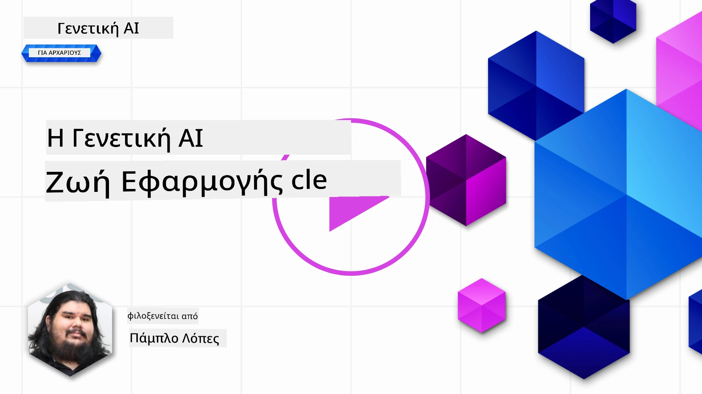
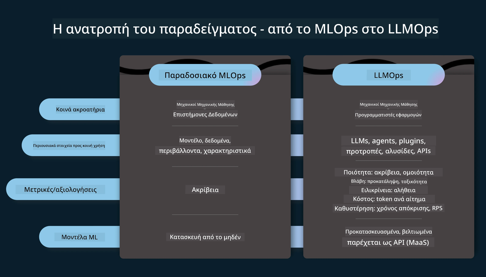
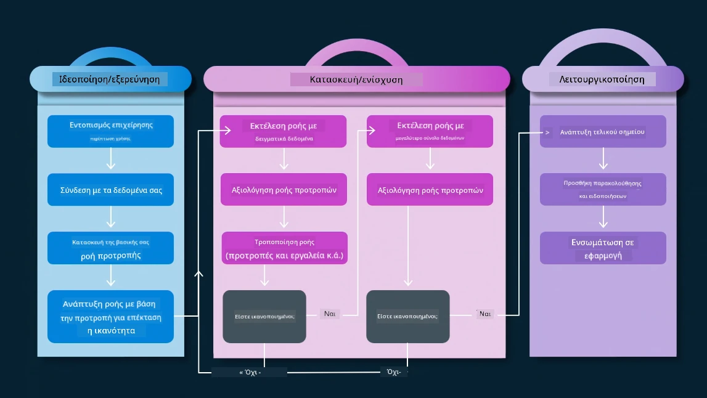
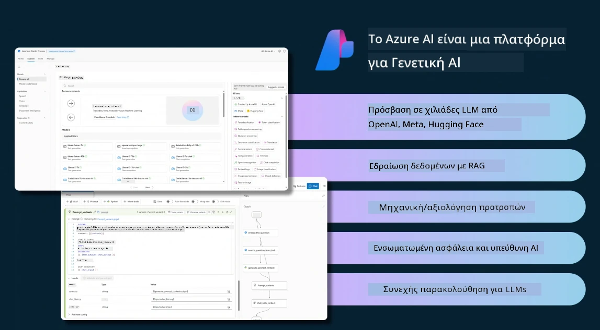
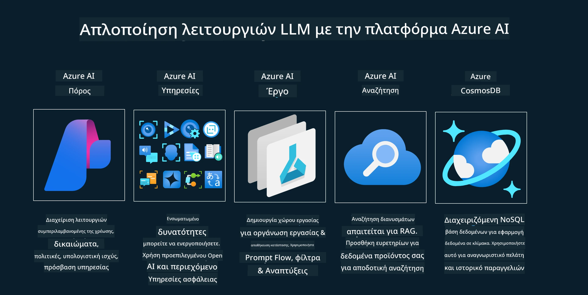
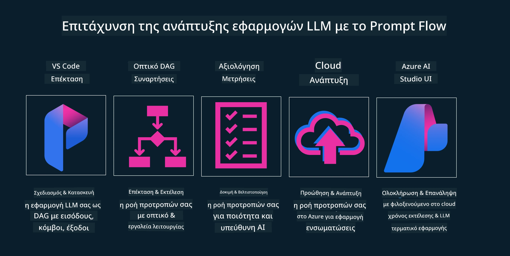

# Ο Κύκλος Ζωής της Εφαρμογής Γεννητικής Τεχνητής Νοημοσύνης

Ένα σημαντικό ερώτημα για όλες τις εφαρμογές τεχνητής νοημοσύνης είναι η συνάφεια των λειτουργιών AI, καθώς η AI είναι ένα πεδίο που εξελίσσεται γρήγορα, για να εξασφαλίσετε ότι η εφαρμογή σας παραμένει σχετική, αξιόπιστη και ανθεκτική, πρέπει να την παρακολουθείτε, να την αξιολογείτε και να την βελτιώνετε συνεχώς. Εδώ έρχεται ο κύκλος ζωής της γεννητικής AI.

Ο κύκλος ζωής της γεννητικής AI είναι ένα πλαίσιο που σας καθοδηγεί στα στάδια ανάπτυξης, υλοποίησης και συντήρησης μιας εφαρμογής γεννητικής AI. Σας βοηθά να ορίσετε τους στόχους σας, να μετρήσετε την απόδοσή σας, να εντοπίσετε τις προκλήσεις σας και να εφαρμόσετε τις λύσεις σας. Σας βοηθά επίσης να ευθυγραμμίσετε την εφαρμογή σας με τα ηθικά και νομικά πρότυπα του τομέα σας και των ενδιαφερόμενων. Ακολουθώντας τον κύκλο ζωής της γεννητικής AI, μπορείτε να διασφαλίσετε ότι η εφαρμογή σας προσφέρει πάντα αξία και ικανοποιεί τους χρήστες σας.

## Εισαγωγή

Σε αυτό το κεφάλαιο, θα:

- Κατανοήσετε τη Μετατόπιση Παραδείγματος από MLOps σε LLMOps
- Τον Κύκλο Ζωής των LLM
- Τα Εργαλεία Κύκλου Ζωής
- Τη Μετριοποίηση και Αξιολόγηση Κύκλου Ζωής

## Κατανοήστε τη Μετατόπιση Παραδείγματος από MLOps σε LLMOps

Τα LLMs είναι ένα νέο εργαλείο στον οπλοστάσιο της Τεχνητής Νοημοσύνης, είναι εξαιρετικά ισχυρά σε αναλυτικές και δημιουργικές εργασίες για εφαρμογές, ωστόσο αυτή η δύναμη έχει κάποιες συνέπειες στον τρόπο με τον οποίο βελτιστοποιούμε τις εργασίες AI και Κλασικής Μηχανικής Μάθησης.

Με αυτό, χρειαζόμαστε ένα νέο Παράδειγμα για να προσαρμόσουμε αυτό το εργαλείο δυναμικά, με τα σωστά κίνητρα. Μπορούμε να κατηγοριοποιήσουμε τις παλαιότερες εφαρμογές AI ως "Εφαρμογές ML" και τις νεότερες ως "Εφαρμογές GenAI" ή απλά "Εφαρμογές AI", αντανακλώντας την κυρίαρχη τεχνολογία και τεχνικές που χρησιμοποιούσαν την εποχή εκείνη. Αυτό μετατοπίζει την αφήγησή μας με πολλούς τρόπους, δείτε την παρακάτω σύγκριση.

Παρατηρήστε ότι στα LLMOps, εστιάζουμε περισσότερο στους Προγραμματιστές Εφαρμογών, χρησιμοποιώντας ενσωματώσεις ως βασικό σημείο, χρησιμοποιώντας "Μοντέλα-ως-Υπηρεσία" και σκεπτόμενοι στα ακόλουθα σημεία για τις μετρήσεις.

- Ποιότητα: Ποιότητα απάντησης
- Βλάβη: Υπεύθυνη AI
- Ειλικρίνεια: Βάση απάντησης (Έχει νόημα; Είναι σωστή;)
- Κόστος: Προϋπολογισμός λύσης
- Καθυστέρηση: Μέσος χρόνος απόκρισης token

## Ο Κύκλος Ζωής των LLM

Αρχικά, για να κατανοήσουμε τον κύκλο ζωής και τις τροποποιήσεις, ας σημειώσουμε την επόμενη γραφική παράσταση.

Όπως ίσως παρατηρήσετε, αυτό διαφέρει από τους συνήθεις Κύκλους Ζωής του MLOps. Τα LLM έχουν πολλές νέες απαιτήσεις, όπως το Prompting, διαφορετικές τεχνικές βελτίωσης ποιότητας (Fine-Tuning, RAG, Meta-Prompts), διαφορετική αξιολόγηση και υπευθυνότητα με την υπεύθυνη AI, τελικά, νέες μετρικές αξιολόγησης (Ποιότητα, Βλάβη, Ειλικρίνεια, Κόστος και Καθυστέρηση).

Για παράδειγμα, δείτε πώς γεννάμε ιδέες. Χρησιμοποιώντας το engineering προτροπών για να πειραματιστούμε με διάφορα LLMs και να εξερευνήσουμε πιθανότητες για να δοκιμάσουμε αν η υπόθεσή τους μπορεί να είναι σωστή.

Σημειώστε ότι αυτό δεν είναι γραμμικό, αλλά ενσωματωμένοι βρόχοι, επαναληπτικοί με έναν επικαλυπτικό κύκλο.

Πώς θα εξερευνήσουμε αυτά τα βήματα; Ας δούμε λεπτομερέστερα πώς θα μπορούσαμε να δημιουργήσουμε έναν κύκλο ζωής.

Αυτό μπορεί να φαίνεται λίγο περίπλοκο, ας εστιάσουμε πρώτα στα τρία μεγάλα βήματα.

1. Ιδεασμός/Εξερεύνηση: Εξερεύνηση, εδώ μπορούμε να εξερευνήσουμε σύμφωνα με τις ανάγκες της επιχείρησής μας. Δημιουργία πρωτοτύπων, κατασκευή [PromptFlow](https://microsoft.github.io/promptflow/index.html?WT.mc_id=academic-105485-koreyst) και δοκιμή αν είναι αρκετά αποδοτικό για την υπόθεσή μας.
1. Κατασκευή/Ενίσχυση: Υλοποίηση, τώρα ξεκινάμε να αξιολογούμε για μεγαλύτερα σύνολα δεδομένων, εφαρμόζοντας τεχνικές όπως Fine-tuning και RAG, για να ελέγξουμε τη σταθερότητα της λύσης μας. Αν δεν είναι, η επανεφαρμογή, η προσθήκη νέων βημάτων στη ροή μας ή η αναδόμηση των δεδομένων μπορεί να βοηθήσει. Αφού δοκιμάσουμε τη ροή και το μέγεθός μας, αν λειτουργεί και ελέγξουμε τις Μετρήσεις μας, είναι έτοιμο για το επόμενο βήμα.
1. Λειτουργικοποίηση: Ενσωμάτωση, τώρα προσθέτουμε Συστήματα Παρακολούθησης και Ειδοποίησης στο σύστημά μας, ανάπτυξη και ενσωμάτωση εφαρμογής στην Εφαρμογή μας.

Στη συνέχεια, έχουμε τον επικαλυπτικό κύκλο Διοίκησης, με εστίαση στην ασφάλεια, τη συμμόρφωση και τη διακυβέρνηση.

Συγχαρητήρια, τώρα έχετε την εφαρμογή AI έτοιμη προς χρήση και λειτουργική. Για πρακτική εμπειρία, ρίξτε μια ματιά στο [Demo του Contoso Chat.](https://nitya.github.io/contoso-chat/?WT.mc_id=academic-105485-koreyst)

Τώρα, ποια εργαλεία μπορούμε να χρησιμοποιήσουμε;

## Εργαλεία Κύκλου Ζωής

Για εργαλεία, η Microsoft παρέχει το [Azure AI Platform](https://azure.microsoft.com/solutions/ai/?WT.mc_id=academic-105485-koreyst) και το [PromptFlow](https://microsoft.github.io/promptflow/index.html?WT.mc_id=academic-105485-koreyst) που διευκολύνουν και κάνουν τον κύκλο σας εύκολο στην υλοποίηση και έτοιμο για χρήση.

Η [Πλατφόρμα Azure AI](https://azure.microsoft.com/solutions/ai/?WT.mc_id=academic-105485-koreyst), σας επιτρέπει να χρησιμοποιήσετε το [AI Studio](https://ai.azure.com/?WT.mc_id=academic-105485-koreyst). Το AI Studio είναι μια διαδικτυακή πύλη που σας επιτρέπει να εξερευνήσετε μοντέλα, δείγματα και εργαλεία. Διαχειρίζοντας τους πόρους σας, ανάπτυξη ροών UI και επιλογές SDK/CLI για ανάπτυξη με κώδικα.

Το Azure AI, σας επιτρέπει να χρησιμοποιείτε πολλούς πόρους για τη διαχείριση λειτουργιών, υπηρεσιών, έργων, αναζήτησης σε διανύσματα και βάσεων δεδομένων.

Κατασκευή, από Proof-of-Concept (POC) μέχρι εφαρμογές μεγάλης κλίμακας με το PromptFlow:

- Σχεδιάστε και κατασκευάστε εφαρμογές από το VS Code, με οπτικά και λειτουργικά εργαλεία
- Δοκιμάστε και επαναφέρετε τις εφαρμογές σας για ποιοτική AI, εύκολα.
- Χρησιμοποιήστε το Azure AI Studio για να ενσωματώσετε και να επαναλάβετε με το cloud, αποστολή και ανάπτυξη για γρήγορη ενσωμάτωση.

## Υπέροχα! Συνεχίστε την Μάθησή σας!

Καταπληκτικά, τώρα μάθετε περισσότερα για το πώς δομούμε μια εφαρμογή για να χρησιμοποιήσετε τις έννοιες με την [Εφαρμογή Contoso Chat](https://nitya.github.io/contoso-chat/?WT.mc_id=academic-105485-koreyst), για να δείτε πώς το Cloud Advocacy προσθέτει αυτές τις έννοιες σε παρουσιάσεις. Για περισσότερο περιεχόμενο, δείτε τη [συνεδρία Ignite breakout!](https://www.youtube.com/watch?v=DdOylyrTOWg)

Τώρα, ελέγξτε το Μάθημα 15, για να κατανοήσετε πώς η [Αναζήτηση Αναπλαισιωμένη με Ανάκτηση και Βάσεις Διανυσμάτων](../15-rag-and-vector-databases/README.md?WT.mc_id=academic-105485-koreyst) επηρεάζει τη Γεννητική AI και να δημιουργήσετε πιο ελκυστικές Εφαρμογές!

---

<!-- CO-OP TRANSLATOR DISCLAIMER START -->
**Αποποίηση Ευθύνης**:  
Αυτό το έγγραφο έχει μεταφραστεί χρησιμοποιώντας την υπηρεσία μετάφρασης με τεχνητή νοημοσύνη [Co-op Translator](https://github.com/Azure/co-op-translator). Παρόλο που επιδιώκουμε ακρίβεια, παρακαλούμε να λάβετε υπόψη ότι οι αυτοματοποιημένες μεταφράσεις ενδέχεται να περιέχουν λάθη ή ανακρίβειες. Το πρωτότυπο έγγραφο στην αρχική του γλώσσα πρέπει να θεωρείται η έγκυρη πηγή. Για κρίσιμες πληροφορίες, συνιστάται η επαγγελματική μετάφραση από ανθρώπους. Δεν ευθυνόμαστε για οποιεσδήποτε παρεξηγήσεις ή λανθασμένες ερμηνείες προκύψουν από τη χρήση αυτής της μετάφρασης.
<!-- CO-OP TRANSLATOR DISCLAIMER END -->