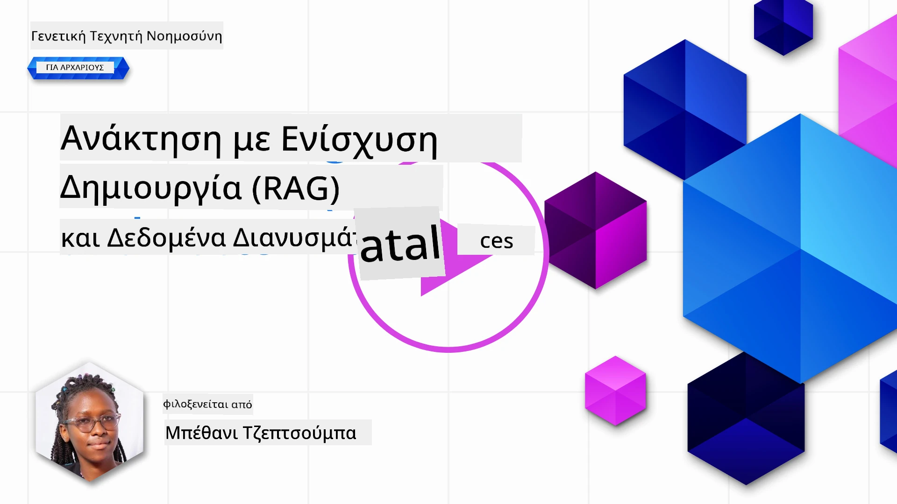
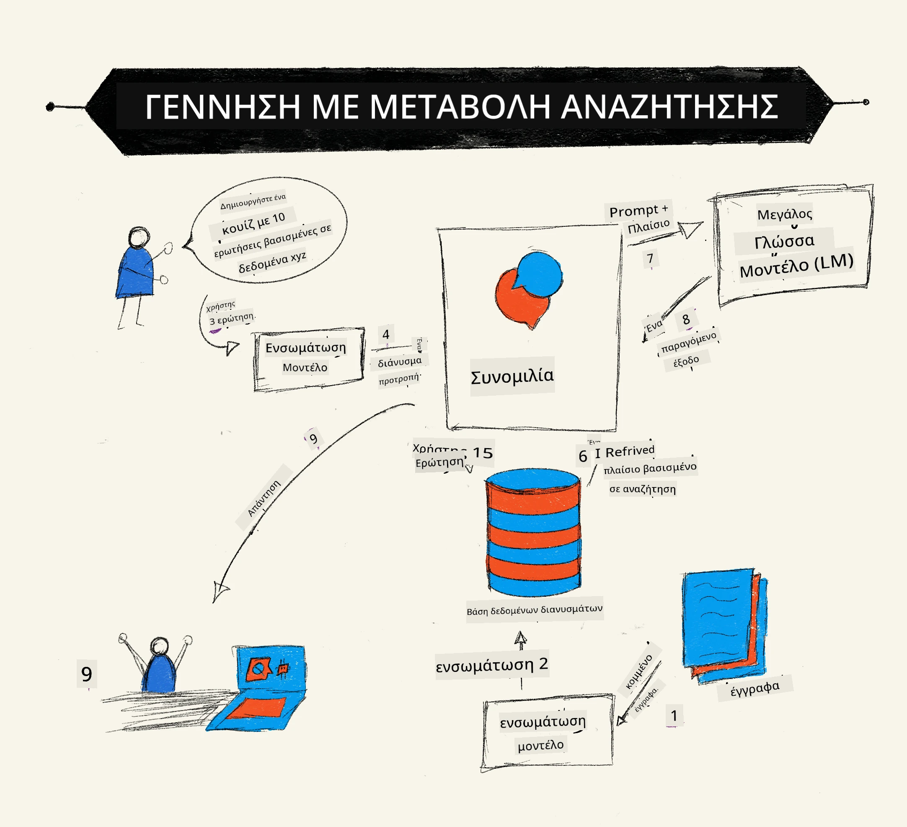
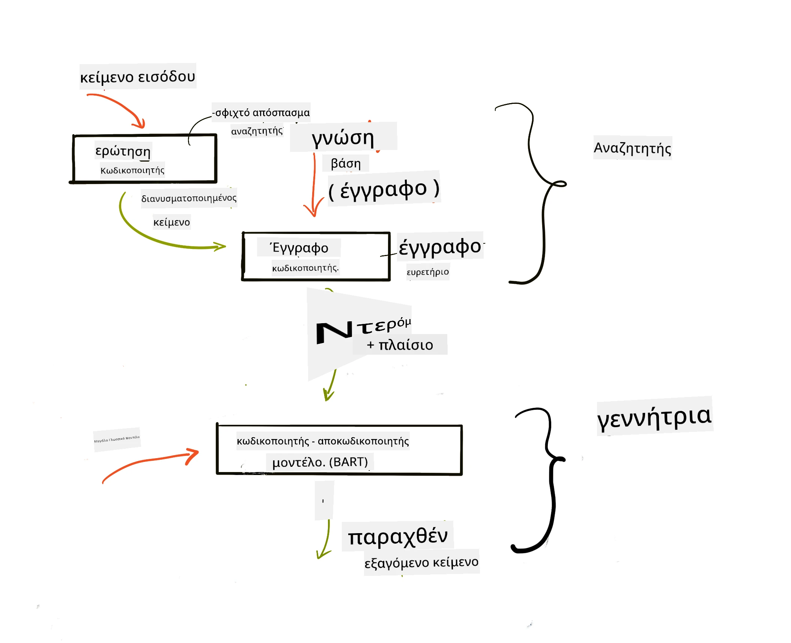
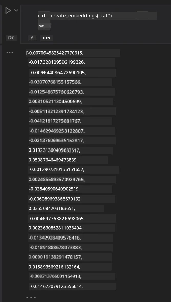

# Παραγωγή με Ενισχυμένη Ανάκτηση (RAG) και Βάσεις Δεδομένων Διανυσμάτων

[](https://youtu.be/4l8zhHUBeyI?si=BmvDmL1fnHtgQYkL)

Στο μάθημα εφαρμογών αναζήτησης, μάθαμε σύντομα πώς να ενσωματώνουμε τα δικά σας δεδομένα σε Μεγάλα Γλωσσικά Μοντέλα (LLMs). Σε αυτό το μάθημα, θα εμβαθύνουμε περαιτέρω στις έννοιες της θεμελίωσης των δεδομένων σας στην εφαρμογή LLM, τους μηχανισμούς της διαδικασίας και τις μεθόδους αποθήκευσης δεδομένων, συμπεριλαμβανομένων τόσο των embeddings όσο και του κειμένου.

> **Βίντεο Ερχόμενο Σύντομα**

## Εισαγωγή

Σε αυτό το μάθημα θα καλύψουμε τα εξής:

- Μια εισαγωγή στην RAG, τι είναι και γιατί χρησιμοποιείται στην τεχνητή νοημοσύνη (AI).

- Κατανόηση τι είναι οι βάσεις δεδομένων διανυσμάτων και δημιουργία μιας για την εφαρμογή μας.

- Ένα πρακτικό παράδειγμα για το πώς να ενσωματώσετε την RAG σε μια εφαρμογή.

## Στόχοι Μάθησης

Μετά την ολοκλήρωση αυτού του μαθήματος, θα μπορείτε να:

- Εξηγήσετε τη σημασία της RAG στην ανάκτηση και επεξεργασία δεδομένων.

- Ρυθμίσετε εφαρμογή RAG και να θεμελιώσετε τα δεδομένα σας σε ένα LLM.

- Αποτελεσματική ενσωμάτωση της RAG και των βάσεων δεδομένων διανυσμάτων στις εφαρμογές LLM.

## Το Σενάριό μας: ενίσχυση των LLMs μας με τα δικά μας δεδομένα

Για αυτό το μάθημα, θέλουμε να προσθέσουμε τις δικές μας σημειώσεις στην εκπαιδευτική startup, που επιτρέπει στο chatbot να λαμβάνει περισσότερες πληροφορίες για τα διάφορα θέματα. Χρησιμοποιώντας τις σημειώσεις που έχουμε, οι μαθητές θα μπορούν να μελετούν καλύτερα και να κατανοούν τα διαφορετικά θέματα, καθιστώντας ευκολότερη τη μελέτη για τις εξετάσεις τους. Για να δημιουργήσουμε το σενάριο μας, θα χρησιμοποιήσουμε:

- `Azure OpenAI:` το LLM που θα χρησιμοποιήσουμε για να δημιουργήσουμε το chatbot μας

- `Μάθημα Τεχνητής Νοημοσύνης για Αρχάριους σχετικά με τα Νευρωνικά Δίκτυα`: αυτά θα είναι τα δεδομένα πάνω στα οποία θα θεμελιώσουμε το LLM μας

- `Azure AI Search` και `Azure Cosmos DB:` βάση δεδομένων διανυσμάτων για αποθήκευση των δεδομένων μας και δημιουργία ευρετηρίου αναζήτησης

Οι χρήστες θα μπορούν να δημιουργούν πρακτικά κουίζ από τις σημειώσεις τους, κάρτες ανακεφαλαίωσης και σύντομα περιληπτικά. Για να ξεκινήσουμε, ας δούμε τι είναι η RAG και πώς λειτουργεί:

## Παραγωγή με Ενισχυμένη Ανάκτηση (RAG)

Ένα chatbot που τροφοδοτείται από LLM επεξεργάζεται τις εντολές των χρηστών για να δημιουργήσει απαντήσεις. Έχει σχεδιαστεί να είναι διαδραστικό και να αλληλεπιδρά με τους χρήστες σε ένα ευρύ φάσμα θεμάτων. Ωστόσο, οι απαντήσεις του περιορίζονται στο πλαίσιο που του παρέχεται και στα βασικά δεδομένα εκπαίδευσής του. Για παράδειγμα, η γνώση του GPT-4 φτάνει μέχρι τον Σεπτέμβριο του 2021, που σημαίνει ότι δεν γνωρίζει γεγονότα μετά από αυτή την περίοδο. Επιπλέον, τα δεδομένα που χρησιμοποιούνται για την εκπαίδευση των LLM αποκλείουν εμπιστευτικές πληροφορίες, όπως προσωπικές σημειώσεις ή εγχειρίδιο προϊόντος μιας εταιρείας.

### Πώς λειτουργούν οι RAG (Παραγωγή με Ενισχυμένη Ανάκτηση)



Ας υποθέσουμε ότι θέλετε να αναπτύξετε ένα chatbot που δημιουργεί κουίζ από τις σημειώσεις σας, θα χρειαστείτε μια σύνδεση με τη βάση γνώσεων. Εδώ έρχεται η RAG να βοηθήσει. Οι RAG λειτουργούν ως εξής:

- **Βάση γνώσεων:** Πριν την ανάκτηση, αυτά τα έγγραφα πρέπει να εισαχθούν και να προεπεξεργαστούν, συνήθως διασπώντας μεγάλα έγγραφα σε μικρότερα τμήματα, μετατρέποντάς τα σε ενσωματώσεις κειμένου και αποθηκεύοντάς τα σε βάση δεδομένων.

- **Ερώτηση χρήστη:** ο χρήστης κάνει μια ερώτηση

- **Ανάκτηση:** Όταν ένας χρήστης κάνει μια ερώτηση, το μοντέλο ενσωμάτωσης ανακτά σχετικές πληροφορίες από τη βάση γνώσεών μας για να προσφέρει περισσότερο πλαίσιο που θα ενσωματωθεί στην εντολή.

- **Ενισχυμένη Παραγωγή:** το LLM βελτιώνει την απάντησή του βασιζόμενο στα ανάκτημένα δεδομένα. Επιτρέπει στην παραγόμενη απάντηση να βασίζεται όχι μόνο σε προεκπαιδευμένα δεδομένα, αλλά και σε σχετικές πληροφορίες από το πρόσθετο πλαίσιο. Τα δεδομένα που ανακτώνται χρησιμοποιούνται για την ενίσχυση των απαντήσεων του LLM. Το LLM στη συνέχεια επιστρέφει μια απάντηση στην ερώτηση του χρήστη.



Η αρχιτεκτονική για τις RAG υλοποιείται χρησιμοποιώντας μετασχηματιστές που αποτελούνται από δύο μέρη: έναν κωδικοποιητή (encoder) και έναν αποκωδικοποιητή (decoder). Για παράδειγμα, όταν ένας χρήστης κάνει μια ερώτηση, το εισαγόμενο κείμενο 'κωδικοποιείται' σε διανύσματα που αποτυπώνουν το νόημα των λέξεων και τα διανύσματα 'αποκωδικοποιούνται' στο ευρετήριο εγγράφων μας και παράγουν νέο κείμενο βασισμένο στην ερώτηση του χρήστη. Το LLM χρησιμοποιεί και ένα μοντέλο encoder-decoder για να δημιουργήσει την έξοδο.

Δύο προσεγγίσεις κατά την υλοποίηση RAG σύμφωνα με το προτεινόμενο άρθρο: [Retrieval-Augmented Generation for Knowledge intensive NLP (natural language processing software) Tasks](https://arxiv.org/pdf/2005.11401.pdf?WT.mc_id=academic-105485-koreyst) είναι:

- **_RAG-Sequence_** χρησιμοποιώντας ανακτημένα έγγραφα για να προβλέψει την καλύτερη πιθανή απάντηση σε μια ερώτηση χρήστη

- **RAG-Token** χρησιμοποιώντας έγγραφα για να δημιουργήσει το επόμενο token και στη συνέχεια ανακτώντας τα για να απαντήσει στην ερώτηση του χρήστη

### Γιατί να χρησιμοποιήσετε RAG; 

- **Πληθωρικότητα πληροφοριών:** διασφαλίζει ότι οι απαντήσεις κειμένου είναι ενημερωμένες και τρέχουσες. Βελτιώνει επομένως τις επιδόσεις σε εργασίες συγκεκριμένου τομέα με πρόσβαση στη βάση γνώσης.

- Μειώνει τη δημιουργία ψευδών πληροφοριών χρησιμοποιώντας **επαληθεύσιμα δεδομένα** στη βάση γνώσης για να παρέχει πλαίσιο στις ερωτήσεις των χρηστών.

- Είναι **οικονομικά αποδοτική** καθώς κοστίζει λιγότερο σε σχέση με το fine-tuning ενός LLM

## Δημιουργία βάσης γνώσης

Η εφαρμογή μας βασίζεται στα προσωπικά μας δεδομένα, δηλαδή στο μάθημα Νευρωνικών Δικτύων του προγράμματος Τεχνητής Νοημοσύνης για Αρχάριους.

### Βάσεις Δεδομένων Διανυσμάτων

Μια βάση δεδομένων διανυσμάτων, σε αντίθεση με τις παραδοσιακές βάσεις δεδομένων, είναι μια εξειδικευμένη βάση δεδομένων σχεδιασμένη για την αποθήκευση, διαχείριση και αναζήτηση ενσωματωμένων διανυσμάτων. Αποθηκεύει αριθμητικές αναπαραστάσεις εγγράφων. Η διάσπαση των δεδομένων σε αριθμητικές ενσωματώσεις καθιστά πιο εύκολη την κατανόηση και επεξεργασία των δεδομένων από το σύστημα AI μας.

Αποθηκεύουμε τις ενσωματώσεις μας σε βάσεις δεδομένων διανυσμάτων καθώς τα LLM έχουν όριο στον αριθμό των tokens που δέχονται ως είσοδο. Επειδή δεν μπορείτε να περάσετε όλες τις ενσωματώσεις σε ένα LLM, θα χρειαστεί να τις διασπάσουμε σε τμήματα και όταν ένας χρήστης κάνει ερώτηση, θα επιστρέφονται οι ενσωματώσεις που μοιάζουν περισσότερο με την ερώτηση μαζί με την εντολή. Το διαχωρισμό σε chunks μειώνει επίσης το κόστος στον αριθμό των tokens που περνούν μέσω ενός LLM.

Μερικές δημοφιλείς βάσεις δεδομένων διανυσμάτων είναι οι Azure Cosmos DB, Clarifyai, Pinecone, Chromadb, ScaNN, Qdrant και DeepLake. Μπορείτε να δημιουργήσετε ένα μοντέλο Azure Cosmos DB χρησιμοποιώντας το Azure CLI με την ακόλουθη εντολή:

```bash
az login
az group create -n <resource-group-name> -l <location>
az cosmosdb create -n <cosmos-db-name> -r <resource-group-name>
az cosmosdb list-keys -n <cosmos-db-name> -g <resource-group-name>
```

### Από κείμενο σε ενσωματώσεις

Πριν αποθηκεύσουμε τα δεδομένα μας, θα χρειαστεί να τα μετατρέψουμε σε ενσωματώσεις διανυσμάτων πριν αποθηκευτούν στη βάση δεδομένων. Αν εργάζεστε με μεγάλα έγγραφα ή μακροσκελές κείμενο, μπορείτε να τα διασπάσετε σε chunks ανάλογα με τις ερωτήσεις που αναμένετε. Ο διαχωρισμός μπορεί να γίνει σε επίπεδο πρότασης ή παραγράφου. Καθώς ο διαχωρισμός εξάγει νοήματα από τις λέξεις γύρω τους, μπορείτε να προσθέσετε και άλλο πλαίσιο σε ένα chunk, π.χ. προσθέτοντας τον τίτλο του εγγράφου ή συμπεριλαμβάνοντας λίγο κείμενο πριν ή μετά το chunk. Μπορείτε να διαχωρίσετε τα δεδομένα ως εξής:

```python
def split_text(text, max_length, min_length):
    words = text.split()
    chunks = []
    current_chunk = []

    for word in words:
        current_chunk.append(word)
        if len(' '.join(current_chunk)) < max_length and len(' '.join(current_chunk)) > min_length:
            chunks.append(' '.join(current_chunk))
            current_chunk = []

    # Εάν το τελευταίο κομμάτι δεν έφτασε το ελάχιστο μήκος, πρόσθεσέ το ούτως ή άλλως
    if current_chunk:
        chunks.append(' '.join(current_chunk))

    return chunks
```

Μόλις διαχωριστούν, μπορούμε να ενσωματώσουμε το κείμενό μας χρησιμοποιώντας διάφορα μοντέλα ενσωμάτωσης. Μερικά μοντέλα που μπορείτε να χρησιμοποιήσετε είναι: word2vec, ada-002 από OpenAI, Azure Computer Vision και πολλά άλλα. Η επιλογή μοντέλου εξαρτάται από τις γλώσσες που χρησιμοποιείτε, τον τύπο του κωδικοποιημένου περιεχομένου (κείμενο/εικόνες/ήχος), το μέγεθος της εισόδου που μπορεί να κωδικοποιήσει και το μήκος της ενσωμάτωσης εξόδου.

Ένα παράδειγμα ενσωματωμένου κειμένου χρησιμοποιώντας το μοντέλο `text-embedding-ada-002` της OpenAI είναι:


## Ανάκτηση και Αναζήτηση Διανυσμάτων

Όταν ένας χρήστης κάνει μια ερώτηση, ο ανακτών τη μετασχηματίζει σε διάνυσμα χρησιμοποιώντας τον κωδικοποιητή ερωτήσεων, στη συνέχεια ψάχνει στον ευρετήριο αναζήτησης εγγράφων για σχετικά διανύσματα που σχετίζονται με την είσοδο. Μόλις ολοκληρωθεί, μετατρέπει και τα δύο, το διάνυσμα εισόδου και τα διανύσματα εγγράφων, σε κείμενο και τα περνάει στο LLM.

### Ανάκτηση

Η ανάκτηση συμβαίνει όταν το σύστημα προσπαθεί να βρει γρήγορα τα έγγραφα από το ευρετήριο που ικανοποιούν τα κριτήρια αναζήτησης. Ο στόχος του ανακτών είναι να πάρει έγγραφα που θα χρησιμοποιηθούν για να προσφέρουν πλαίσιο και να θεμελιώσουν το LLM στα δεδομένα σας.

Υπάρχουν διάφοροι τρόποι να πραγματοποιηθεί αναζήτηση στη βάση δεδομένων μας, όπως:

- **Αναζήτηση με λέξεις-κλειδιά** - χρησιμοποιείται για κειμενικές αναζητήσεις

- **Αναζήτηση διανύσματος** - μετατρέπει έγγραφα από κείμενο σε διανυσματικές αναπαραστάσεις χρησιμοποιώντας μοντέλα ενσωμάτωσης, επιτρέποντας **σημασιολογική αναζήτηση** με βάση το νόημα των λέξεων. Η ανάκτηση γίνεται ερωτώντας τα έγγραφα των οποίων οι διανυσματικές αναπαραστάσεις είναι πιο κοντά στην ερώτηση του χρήστη.

- **Υβριδική** - ένας συνδυασμός τόσο αναζήτησης με λέξεις-κλειδιά όσο και αναζήτησης διανυσμάτων.

Μια πρόκληση στην ανάκτηση προκύπτει όταν δεν υπάρχει παρόμοια απάντηση στο ερώτημα στη βάση δεδομένων, τότε το σύστημα επιστρέφει τις καλύτερες δυνατές πληροφορίες, ωστόσο μπορείτε να χρησιμοποιήσετε τακτικές όπως ο καθορισμός μέγιστης απόστασης για τη σχετικότητα ή τη χρήση υβριδικής αναζήτησης που συνδυάζει και τις δύο μεθόδους. Στο μάθημα αυτό θα χρησιμοποιήσουμε υβριδική αναζήτηση, συνδυασμό διανυσματικής και αναζήτησης με λέξεις-κλειδιά. Θα αποθηκεύσουμε τα δεδομένα μας σε ένα dataframe με στήλες που περιέχουν τα chunks καθώς και τις ενσωματώσεις.

### Ομοιότητα Διανυσμάτων

Ο ανακτών θα ψάξει στη βάση γνώσης για ενσωματώσεις που βρίσκονται κοντά, τον πλησιέστερο γείτονα, καθώς είναι κείμενα που είναι παρόμοια. Στο σενάριο όπου ένας χρήστης κάνει μια ερώτηση, αρχικά αυτή ενσωματώνεται και στη συνέχεια ταιριάζει με παρόμοιες ενσωματώσεις. Η κοινή μέτρηση που χρησιμοποιείται για να βρεθεί πόσο παρόμοια είναι δύο διαφορετικά διανύσματα είναι η συνημίτονα ομοιότητα βασισμένη στη γωνία μεταξύ δύο διανυσμάτων.

Μπορούμε να μετρήσουμε την ομοιότητα χρησιμοποιώντας άλλες εναλλακτικές όπως η ευκλείδεια απόσταση που είναι η ευθεία γραμμή μεταξύ των άκρων των διανυσμάτων και το εσωτερικό γινόμενο που μετρά το άθροισμα των γινομένων των αντίστοιχων στοιχείων δύο διανυσμάτων.

### Ευρετήριο Αναζήτησης

Κατά την ανάκτηση, θα χρειαστεί να δημιουργήσουμε ένα ευρετήριο αναζήτησης για τη βάση γνώσης μας πριν πραγματοποιήσουμε την αναζήτηση. Ένα ευρετήριο θα αποθηκεύει τις ενσωματώσεις μας και μπορεί γρήγορα να ανακτήσει τα πιο παρόμοια chunks ακόμα και σε μια μεγάλη βάση δεδομένων. Μπορούμε να δημιουργήσουμε το ευρετήριό μας τοπικά χρησιμοποιώντας:

```python
from sklearn.neighbors import NearestNeighbors

embeddings = flattened_df['embeddings'].to_list()

# Δημιουργήστε τον δείκτη αναζήτησης
nbrs = NearestNeighbors(n_neighbors=5, algorithm='ball_tree').fit(embeddings)

# Για να κάνετε ερώτηση στον δείκτη, μπορείτε να χρησιμοποιήσετε τη μέθοδο kneighbors
distances, indices = nbrs.kneighbors(embeddings)
```

### Επανακατάταξη (Re-ranking)

Μόλις κάνετε αναζήτηση στη βάση δεδομένων, μπορεί να χρειαστεί να ταξινομήσετε τα αποτελέσματα από τα πιο σχετικά. Ένα LLM επανακατάταξης χρησιμοποιεί Μηχανική Μάθηση για να βελτιώσει τη σχετικότητα των αποτελεσμάτων αναζήτησης ταξινομώντας τα από το πιο σχετικό. Χρησιμοποιώντας το Azure AI Search, η επανακατάταξη γίνεται αυτόματα για εσάς με χρήση ενός σημασιολογικού επαναταξινομητή. Ένα παράδειγμα για το πώς λειτουργεί η επανακατάταξη με χρήση πλησιέστερων γειτόνων:

```python
# Βρείτε τα πιο παρόμοια έγγραφα
distances, indices = nbrs.kneighbors([query_vector])

index = []
# Εκτυπώστε τα πιο παρόμοια έγγραφα
for i in range(3):
    index = indices[0][i]
    for index in indices[0]:
        print(flattened_df['chunks'].iloc[index])
        print(flattened_df['path'].iloc[index])
        print(flattened_df['distances'].iloc[index])
    else:
        print(f"Index {index} not found in DataFrame")
```

## Ολοκλήρωση όλων

Το τελευταίο βήμα είναι να προσθέσουμε το LLM μας στο σύστημα ώστε να μπορούμε να αποκτούμε απαντήσεις που είναι θεμελιωμένες στα δεδομένα μας. Μπορούμε να το υλοποιήσουμε ως εξής:

```python
user_input = "what is a perceptron?"

def chatbot(user_input):
    # Μετατρέψτε την ερώτηση σε διάνυσμα αναζήτησης
    query_vector = create_embeddings(user_input)

    # Βρείτε τα πιο παρόμοια έγγραφα
    distances, indices = nbrs.kneighbors([query_vector])

    # προσθέστε έγγραφα στην αναζήτηση για να παρέχετε πλαίσιο
    history = []
    for index in indices[0]:
        history.append(flattened_df['chunks'].iloc[index])

    # συνδυάστε το ιστορικό και την είσοδο χρήστη
    history.append(user_input)

    # δημιουργήστε ένα αντικείμενο μηνύματος
    messages=[
        {"role": "system", "content": "You are an AI assistant that helps with AI questions."},
        {"role": "user", "content": "\n\n".join(history) }
    ]

    # χρησιμοποιήστε το Responses API για να δημιουργήσετε μια απάντηση
    response = client.responses.create(
        model="gpt-4o-mini",
        temperature=0.7,
        max_output_tokens=800,
        input=messages,
        store=False,
    )

    return response.output_text

chatbot(user_input)
```

## Αξιολόγηση της εφαρμογής μας

### Μετρικές Αξιολόγησης

- Ποιότητα των απαντήσεων που παρέχονται διασφαλίζοντας ότι ακούγονται φυσικές, ρέουσες και ανθρώπινες

- Θεμελίωση των δεδομένων: αξιολόγηση αν η απάντηση προήλθε από τα παρεχόμενα έγγραφα

- Σχετικότητα: αξιολόγηση αν η απάντηση ταιριάζει και σχετίζεται με την ερώτηση που τέθηκε

- Ρευστότητα - αν η απάντηση έχει νοηματική ορθότητα γραμματικά

## Χρήσεις για RAG (Παραγωγή με Ενισχυμένη Ανάκτηση) και βάσεις δεδομένων διανυσμάτων

Υπάρχουν πολλές διαφορετικές χρήσεις όπου οι κλήσεις λειτουργιών μπορούν να βελτιώσουν την εφαρμογή σας, όπως:

- Ερωτήσεις και Απαντήσεις: θεμελίωση των εταιρικών σας δεδομένων σε μια συζήτηση που μπορούν να χρησιμοποιούν οι εργαζόμενοι για να κάνουν ερωτήσεις.

- Συστήματα προτάσεων: όπου μπορείτε να δημιουργήσετε ένα σύστημα που ταιριάζει τις πιο παρόμοιες τιμές π.χ. ταινίες, εστιατόρια και πολλά άλλα.

- Υπηρεσίες chatbot: μπορείτε να αποθηκεύσετε το ιστορικό συνομιλιών και να εξατομικεύσετε τη συζήτηση με βάση τα δεδομένα του χρήστη.

- Αναζήτηση εικόνων βασισμένη σε ενσωματώσεις διανυσμάτων, χρήσιμο όταν κάνετε αναγνώριση εικόνας και ανίχνευση ανωμαλιών.

## Περίληψη

Έχουμε καλύψει τα βασικά σημεία της RAG από την προσθήκη των δεδομένων μας στην εφαρμογή, την ερώτηση του χρήστη και την έξοδο. Για να απλοποιήσετε τη δημιουργία RAG, μπορείτε να χρησιμοποιήσετε πλαίσια εργασίας όπως το Semantic Kernel, Langchain ή Autogen.

## Ανάθεση

Για να συνεχίσετε τη μάθησή σας στην Παραγωγή με Ενισχυμένη Ανάκτηση (RAG), μπορείτε να δημιουργήσετε:

- Δημιουργήστε ένα front-end για την εφαρμογή χρησιμοποιώντας το πλαίσιο της επιλογής σας

- Χρησιμοποιήστε ένα πλαίσιο, είτε LangChain είτε Semantic Kernel, και αναδημιουργήστε την εφαρμογή σας.

Συγχαρητήρια για την ολοκλήρωση του μαθήματος 👏.

## Η μάθηση δεν σταματά εδώ, συνεχίστε το ταξίδι

Μετά την ολοκλήρωση αυτού του μαθήματος, δείτε τη συλλογή μας [Generative AI Learning collection](https://aka.ms/genai-collection?WT.mc_id=academic-105485-koreyst) για να συνεχίσετε να αναπτύσσετε τις γνώσεις σας στο Generative AI!

---

<!-- CO-OP TRANSLATOR DISCLAIMER START -->
**Αποποίηση ευθυνών**:
Αυτό το έγγραφο έχει μεταφραστεί χρησιμοποιώντας την υπηρεσία μετάφρασης με τεχνητή νοημοσύνη [Co-op Translator](https://github.com/Azure/co-op-translator). Ενώ επιδιώκουμε την ακρίβεια, παρακαλούμε να έχετε υπόψη ότι οι αυτοματοποιημένες μεταφράσεις ενδέχεται να περιέχουν λάθη ή ανακρίβειες. Το πρωτότυπο έγγραφο στη μητρική του γλώσσα πρέπει να θεωρείται η αυθεντική πηγή. Για κρίσιμες πληροφορίες, συνιστάται επαγγελματική ανθρώπινη μετάφραση. Δεν φέρουμε ευθύνη για τυχόν παρεξηγήσεις ή λανθασμένες ερμηνείες που προκύπτουν από τη χρήση αυτής της μετάφρασης.
<!-- CO-OP TRANSLATOR DISCLAIMER END -->