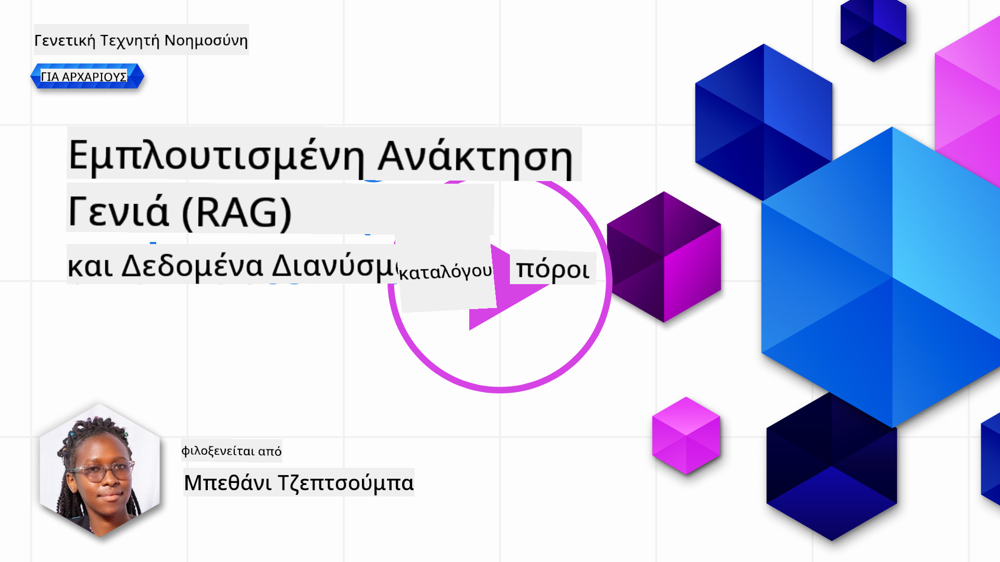
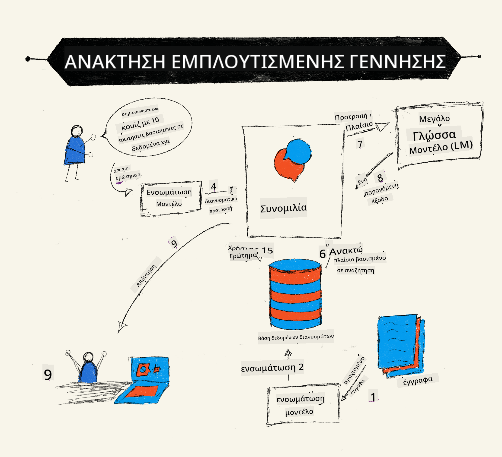
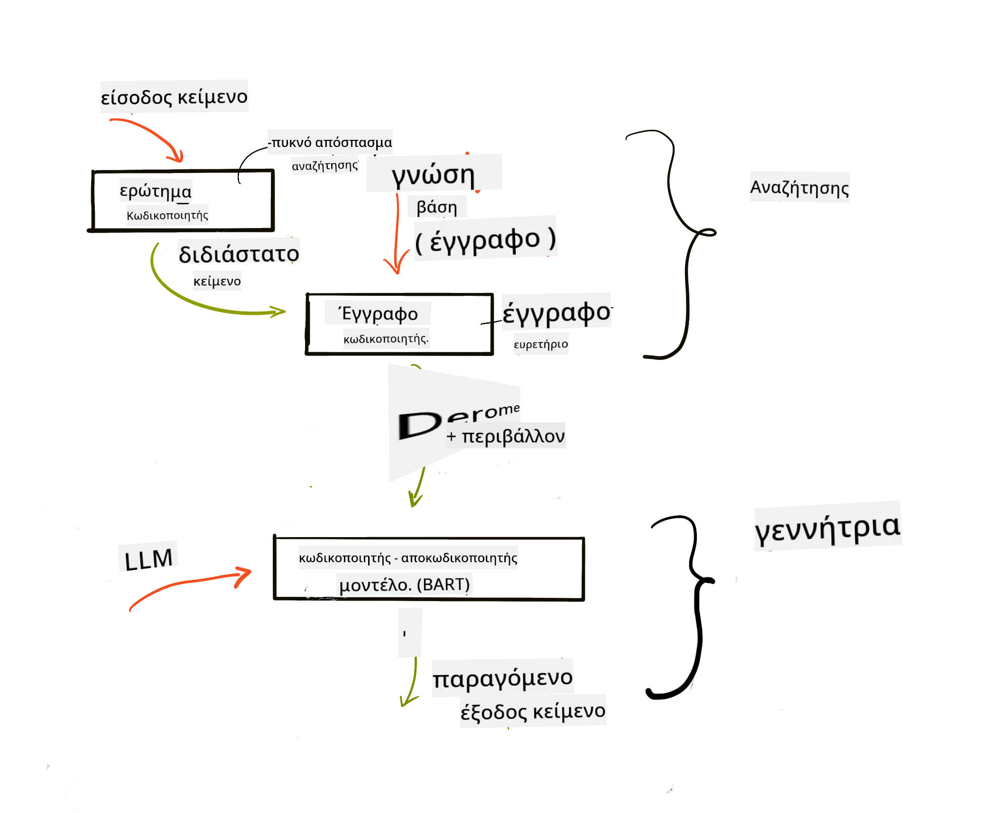
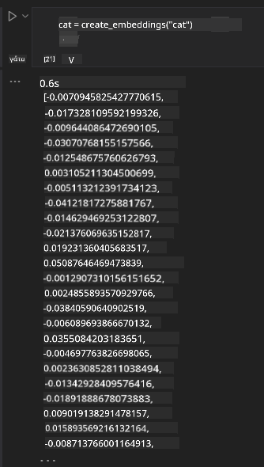

<!--
CO_OP_TRANSLATOR_METADATA:
{
  "original_hash": "e2861bbca91c0567ef32bc77fe054f9e",
  "translation_date": "2025-06-25T22:33:12+00:00",
  "source_file": "15-rag-and-vector-databases/README.md",
  "language_code": "el"
}
-->
# Ανάκτηση Ενισχυμένης Δημιουργίας (RAG) και Βάσεις Δεδομένων Διανυσμάτων

[](https://aka.ms/gen-ai-lesson15-gh?WT.mc_id=academic-105485-koreyst)

Στο μάθημα των εφαρμογών αναζήτησης, μάθαμε σύντομα πώς να ενσωματώνετε τα δικά σας δεδομένα σε Μεγάλα Γλωσσικά Μοντέλα (LLMs). Σε αυτό το μάθημα, θα εξετάσουμε περαιτέρω τις έννοιες της θεμελίωσης των δεδομένων σας στην εφαρμογή LLM, τους μηχανισμούς της διαδικασίας και τις μεθόδους αποθήκευσης δεδομένων, συμπεριλαμβανομένων των ενσωματώσεων και του κειμένου.

> **Βίντεο σύντομα διαθέσιμο**

## Εισαγωγή

Σε αυτό το μάθημα θα καλύψουμε τα εξής:

- Μια εισαγωγή στο RAG, τι είναι και γιατί χρησιμοποιείται στην τεχνητή νοημοσύνη (AI).

- Κατανόηση τι είναι οι βάσεις δεδομένων διανυσμάτων και δημιουργία μιας για την εφαρμογή μας.

- Ένα πρακτικό παράδειγμα για το πώς να ενσωματώσετε το RAG σε μια εφαρμογή.

## Στόχοι Μάθησης

Μετά την ολοκλήρωση αυτού του μαθήματος, θα μπορείτε να:

- Εξηγήσετε τη σημασία του RAG στην ανάκτηση και επεξεργασία δεδομένων.

- Ρυθμίσετε την εφαρμογή RAG και να θεμελιώσετε τα δεδομένα σας σε ένα LLM.

- Αποτελεσματική ενσωμάτωση του RAG και των Βάσεων Δεδομένων Διανυσμάτων σε Εφαρμογές LLM.

## Το Σενάριό μας: ενισχύοντας τα LLM μας με τα δικά μας δεδομένα

Για αυτό το μάθημα, θέλουμε να προσθέσουμε τις δικές μας σημειώσεις στη νεοφυή επιχείρηση εκπαίδευσης, επιτρέποντας στο chatbot να αποκτήσει περισσότερες πληροφορίες για τα διάφορα θέματα. Χρησιμοποιώντας τις σημειώσεις που έχουμε, οι μαθητές θα μπορούν να μελετούν καλύτερα και να κατανοούν τα διάφορα θέματα, διευκολύνοντας την επανάληψη για τις εξετάσεις τους. Για να δημιουργήσουμε το σενάριό μας, θα χρησιμοποιήσουμε:

- `Azure OpenAI:` το LLM που θα χρησιμοποιήσουμε για να δημιουργήσουμε το chatbot μας

- `AI for beginners' lesson on Neural Networks`: αυτά θα είναι τα δεδομένα στα οποία θα θεμελιώσουμε το LLM μας

- `Azure AI Search` και `Azure Cosmos DB:` βάση δεδομένων διανυσμάτων για να αποθηκεύσουμε τα δεδομένα μας και να δημιουργήσουμε έναν δείκτη αναζήτησης

Οι χρήστες θα μπορούν να δημιουργούν κουίζ πρακτικής από τις σημειώσεις τους, κάρτες επανάληψης και να τις συνοψίζουν σε συνοπτικές επισκοπήσεις. Για να ξεκινήσουμε, ας δούμε τι είναι το RAG και πώς λειτουργεί:

## Ανάκτηση Ενισχυμένης Δημιουργίας (RAG)

Ένα chatbot που λειτουργεί με LLM επεξεργάζεται τις προτροπές των χρηστών για να δημιουργήσει απαντήσεις. Είναι σχεδιασμένο να είναι διαδραστικό και να εμπλέκεται με τους χρήστες σε ένα ευρύ φάσμα θεμάτων. Ωστόσο, οι απαντήσεις του περιορίζονται στο πλαίσιο που παρέχεται και στα θεμελιώδη δεδομένα εκπαίδευσής του. Για παράδειγμα, το σημείο διακοπής γνώσης του GPT-4 είναι ο Σεπτέμβριος 2021, που σημαίνει ότι δεν έχει γνώση των γεγονότων που έχουν συμβεί μετά από αυτήν την περίοδο. Επιπλέον, τα δεδομένα που χρησιμοποιούνται για την εκπαίδευση των LLMs εξαιρούν εμπιστευτικές πληροφορίες όπως προσωπικές σημειώσεις ή το εγχειρίδιο προϊόντων μιας εταιρείας.

### Πώς λειτουργούν τα RAGs (Ανάκτηση Ενισχυμένης Δημιουργίας)



Ας υποθέσουμε ότι θέλετε να αναπτύξετε ένα chatbot που δημιουργεί κουίζ από τις σημειώσεις σας, θα χρειαστείτε μια σύνδεση με τη βάση γνώσεων. Εδώ έρχεται το RAG για να σας σώσει. Τα RAGs λειτουργούν ως εξής:

- **Βάση γνώσεων:** Πριν από την ανάκτηση, αυτά τα έγγραφα πρέπει να καταχωρηθούν και να προεπεξεργαστούν, συνήθως διασπώντας μεγάλα έγγραφα σε μικρότερα κομμάτια, μετατρέποντάς τα σε ενσωματώσεις κειμένου και αποθηκεύοντάς τα σε μια βάση δεδομένων.

- **Ερώτηση Χρήστη:** ο χρήστης κάνει μια ερώτηση

- **Ανάκτηση:** Όταν ο χρήστης κάνει μια ερώτηση, το μοντέλο ενσωμάτωσης ανακτά σχετικές πληροφορίες από τη βάση γνώσεων μας για να παρέχει περισσότερο πλαίσιο που θα ενσωματωθεί στην προτροπή.

- **Ενισχυμένη Δημιουργία:** το LLM ενισχύει την απάντησή του με βάση τα δεδομένα που ανακτήθηκαν. Επιτρέπει στην απάντηση που δημιουργείται να βασίζεται όχι μόνο στα προ-εκπαιδευμένα δεδομένα αλλά και σε σχετικές πληροφορίες από το προστιθέμενο πλαίσιο. Τα ανακτημένα δεδομένα χρησιμοποιούνται για να ενισχύσουν τις απαντήσεις του LLM. Στη συνέχεια, το LLM επιστρέφει μια απάντηση στην ερώτηση του χρήστη.



Η αρχιτεκτονική για τα RAGs υλοποιείται χρησιμοποιώντας μετασχηματιστές που αποτελούνται από δύο μέρη: έναν κωδικοποιητή και έναν αποκωδικοποιητή. Για παράδειγμα, όταν ένας χρήστης κάνει μια ερώτηση, το εισαγόμενο κείμενο 'κωδικοποιείται' σε διανύσματα που καταγράφουν τη σημασία των λέξεων και τα διανύσματα 'αποκωδικοποιούνται' στον δείκτη εγγράφων μας και δημιουργούν νέο κείμενο με βάση την ερώτηση του χρήστη. Το LLM χρησιμοποιεί τόσο ένα μοντέλο κωδικοποιητή-αποκωδικοποιητή για να δημιουργήσει την έξοδο.

Δύο προσεγγίσεις κατά την υλοποίηση του RAG σύμφωνα με την προτεινόμενη εργασία: [Ανάκτηση-Ενισχυμένη Δημιουργία για Γνώσεις εντατικές Εργασίες NLP (λογισμικό επεξεργασίας φυσικής γλώσσας)](https://arxiv.org/pdf/2005.11401.pdf?WT.mc_id=academic-105485-koreyst) είναι:

- **_RAG-Sequence_** χρησιμοποιώντας ανακτημένα έγγραφα για να προβλέψει την καλύτερη δυνατή απάντηση σε μια ερώτηση χρήστη

- **RAG-Token** χρησιμοποιώντας έγγραφα για να δημιουργήσει το επόμενο token, στη συνέχεια να τα ανακτήσει για να απαντήσει στην ερώτηση του χρήστη

### Γιατί να χρησιμοποιήσετε τα RAGs; 

- **Πλούτος πληροφοριών:** διασφαλίζει ότι οι απαντήσεις κειμένου είναι ενημερωμένες και τρέχουσες. Επομένως, βελτιώνει την απόδοση σε εργασίες συγκεκριμένου τομέα με πρόσβαση στην εσωτερική βάση γνώσεων.

- Μειώνει την κατασκευή χρησιμοποιώντας **επαληθεύσιμα δεδομένα** στη βάση γνώσεων για να παρέχει πλαίσιο στις ερωτήσεις των χρηστών.

- Είναι **οικονομικά αποδοτικό** καθώς είναι πιο οικονομικά σε σύγκριση με την προσαρμογή ενός LLM.

## Δημιουργία μιας βάσης γνώσεων

Η εφαρμογή μας βασίζεται στα προσωπικά μας δεδομένα, δηλαδή το μάθημα Νευρωνικών Δικτύων στο πρόγραμμα σπουδών AI For Beginners.

### Βάσεις Δεδομένων Διανυσμάτων

Μια βάση δεδομένων διανυσμάτων, σε αντίθεση με τις παραδοσιακές βάσεις δεδομένων, είναι μια εξειδικευμένη βάση δεδομένων σχεδιασμένη να αποθηκεύει, να διαχειρίζεται και να αναζητά ενσωματωμένα διανύσματα. Αποθηκεύει αριθμητικές αναπαραστάσεις εγγράφων. Η διάσπαση δεδομένων σε αριθμητικές ενσωματώσεις διευκολύνει το σύστημά μας AI να κατανοεί και να επεξεργάζεται τα δεδομένα.

Αποθηκεύουμε τις ενσωματώσεις μας σε βάσεις δεδομένων διανυσμάτων καθώς τα LLMs έχουν ένα όριο στον αριθμό των tokens που δέχονται ως είσοδο. Καθώς δεν μπορείτε να περάσετε ολόκληρες τις ενσωματώσεις σε ένα LLM, θα χρειαστεί να τις διασπάσετε σε κομμάτια και όταν ένας χρήστης κάνει μια ερώτηση, οι ενσωματώσεις που μοιάζουν περισσότερο με την ερώτηση θα επιστραφούν μαζί με την προτροπή. Η διάσπαση επίσης μειώνει το κόστος στον αριθμό των tokens που περνούν μέσω ενός LLM.

Μερικές δημοφιλείς βάσεις δεδομένων διανυσμάτων περιλαμβάνουν το Azure Cosmos DB, Clarifyai, Pinecone, Chromadb, ScaNN, Qdrant και DeepLake. Μπορείτε να δημιουργήσετε ένα μοντέλο Azure Cosmos DB χρησιμοποιώντας το Azure CLI με την ακόλουθη εντολή:

```bash
az login
az group create -n <resource-group-name> -l <location>
az cosmosdb create -n <cosmos-db-name> -r <resource-group-name>
az cosmosdb list-keys -n <cosmos-db-name> -g <resource-group-name>
```

### Από το κείμενο στις ενσωματώσεις

Πριν αποθηκεύσουμε τα δεδομένα μας, θα χρειαστεί να τα μετατρέψουμε σε ενσωματώσεις διανυσμάτων πριν αποθηκευτούν στη βάση δεδομένων. Εάν εργάζεστε με μεγάλα έγγραφα ή μακροσκελή κείμενα, μπορείτε να τα διασπάσετε με βάση τις ερωτήσεις που αναμένετε. Η διάσπαση μπορεί να γίνει σε επίπεδο πρότασης ή σε επίπεδο παραγράφου. Καθώς η διάσπαση αποδίδει σημασίες από τις λέξεις γύρω τους, μπορείτε να προσθέσετε κάποιο άλλο πλαίσιο σε ένα κομμάτι, για παράδειγμα, προσθέτοντας τον τίτλο του εγγράφου ή περιλαμβάνοντας κάποιο κείμενο πριν ή μετά το κομμάτι. Μπορείτε να διασπάσετε τα δεδομένα ως εξής:

```python
def split_text(text, max_length, min_length):
    words = text.split()
    chunks = []
    current_chunk = []

    for word in words:
        current_chunk.append(word)
        if len(' '.join(current_chunk)) < max_length and len(' '.join(current_chunk)) > min_length:
            chunks.append(' '.join(current_chunk))
            current_chunk = []

    # If the last chunk didn't reach the minimum length, add it anyway
    if current_chunk:
        chunks.append(' '.join(current_chunk))

    return chunks
```

Αφού διασπαστούν, μπορούμε στη συνέχεια να ενσωματώσουμε το κείμενό μας χρησιμοποιώντας διαφορετικά μοντέλα ενσωμάτωσης. Μερικά μοντέλα που μπορείτε να χρησιμοποιήσετε περιλαμβάνουν: word2vec, ada-002 από την OpenAI, Azure Computer Vision και πολλά άλλα. Η επιλογή ενός μοντέλου για χρήση θα εξαρτηθεί από τις γλώσσες που χρησιμοποιείτε, τον τύπο του περιεχομένου που κωδικοποιείται (κείμενο/εικόνες/ήχος), το μέγεθος της εισόδου που μπορεί να κωδικοποιήσει και το μήκος της εξόδου ενσωμάτωσης.

Ένα παράδειγμα ενσωματωμένου κειμένου χρησιμοποιώντας το μοντέλο `text-embedding-ada-002` της OpenAI είναι:


## Ανάκτηση και Αναζήτηση Διανυσμάτων

Όταν ένας χρήστης κάνει μια ερώτηση, ο ανακτητής τη μετατρέπει σε ένα διάνυσμα χρησιμοποιώντας τον κωδικοποιητή ερωτήματος, στη συνέχεια αναζητά μέσω του δείκτη αναζήτησης εγγράφων μας για σχετικά διανύσματα στο έγγραφο που σχετίζονται με την είσοδο. Μόλις ολοκληρωθεί, μετατρέπει τόσο το διάνυσμα εισόδου όσο και τα διανύσματα εγγράφων σε κείμενο και το περνά μέσω του LLM.

### Ανάκτηση

Η ανάκτηση συμβαίνει όταν το σύστημα προσπαθεί να βρει γρήγορα τα έγγραφα από τον δείκτη που ικανοποιούν τα κριτήρια αναζήτησης. Ο στόχος του ανακτητή είναι να πάρει έγγραφα που θα χρησιμοποιηθούν για να παρέχουν πλαίσιο και να θεμελιώσουν το LLM στα δεδομένα σας.

Υπάρχουν διάφοροι τρόποι για να εκτελέσετε αναζήτηση μέσα στη βάση δεδομένων μας, όπως:

- **Αναζήτηση με λέξεις-κλειδιά** - χρησιμοποιείται για αναζητήσεις κειμένου

- **Σημασιολογική αναζήτηση** - χρησιμοποιεί τη σημασιολογική σημασία των λέξεων

- **Αναζήτηση διανυσμάτων** - μετατρέπει τα έγγραφα από κείμενο σε αναπαραστάσεις διανυσμάτων χρησιμοποιώντας μοντέλα ενσωμάτωσης. Η ανάκτηση θα γίνει με την αναζήτηση των εγγράφων των οποίων οι αναπαραστάσεις διανυσμάτων είναι πλησιέστερες στην ερώτηση του χρήστη.

- **Υβριδική** - ένας συνδυασμός τόσο αναζήτησης με λέξεις-κλειδιά όσο και αναζήτησης διανυσμάτων.

Μια πρόκληση με την ανάκτηση έρχεται όταν δεν υπάρχει παρόμοια απάντηση στην ερώτηση στη βάση δεδομένων, το σύστημα θα επιστρέψει τότε τις καλύτερες πληροφορίες που μπορεί να λάβει, ωστόσο, μπορείτε να χρησιμοποιήσετε τακτικές όπως να ορίσετε τη μέγιστη απόσταση για τη συνάφεια ή να χρησιμοποιήσετε υβριδική αναζήτηση που συνδυάζει τόσο λέξεις-κλειδιά όσο και αναζήτηση διανυσμάτων. Σε αυτό το μάθημα θα χρησιμοποιήσουμε υβριδική αναζήτηση, έναν συνδυασμό τόσο αναζήτησης διανυσμάτων όσο και λέξεων-κλειδιών. Θα αποθηκεύσουμε τα δεδομένα μας σε ένα πλαίσιο δεδομένων με στήλες που περιέχουν τα κομμάτια καθώς και τις ενσωματώσεις.

### Ομοιότητα Διανυσμάτων

Ο ανακτητής θα αναζητήσει στη βάση γνώσεων για ενσωματώσεις που είναι κοντά μεταξύ τους, ο πλησιέστερος γείτονας, καθώς είναι κείμενα που είναι παρόμοια. Σε περίπτωση που ένας χρήστης κάνει μια ερώτηση, πρώτα ενσωματώνεται και στη συνέχεια ταιριάζει με παρόμοιες ενσωματώσεις. Η κοινή μέτρηση που χρησιμοποιείται για να βρει πόσο παρόμοια είναι διαφορετικά διανύσματα είναι η συνημιτονική ομοιότητα, η οποία βασίζεται στη γωνία μεταξύ δύο διανυσμάτων.

Μπορούμε να μετρήσουμε την ομοιότητα χρησιμοποιώντας άλλες εναλλακτικές που μπορούμε να χρησιμοποιήσουμε είναι η απόσταση Ευκλείδης, η οποία είναι η ευθεία γραμμή μεταξύ των τελικών σημείων των διανυσμάτων και το εσωτερικό γινόμενο, το οποίο μετρά το άθροισμα των γινομένων των αντίστοιχων στοιχείων δύο διανυσμάτων.

### Δείκτης Αναζήτησης

Όταν κάνουμε ανάκτηση, θα χρειαστεί να κατασκευάσουμε έναν δείκτη αναζήτησης για τη βάση γνώσεων μας πριν εκτελέσουμε αναζήτηση. Ένας δείκτης θα αποθηκεύσει τις ενσωματώσεις μας και μπορεί να ανακτήσει γρήγορα τα πιο παρόμοια κομμάτια ακόμα και σε μια μεγάλη βάση δεδομένων. Μπορούμε να δημιουργήσουμε τον δείκτη μας τοπικά χρησιμοποιώντας:

```python
from sklearn.neighbors import NearestNeighbors

embeddings = flattened_df['embeddings'].to_list()

# Create the search index
nbrs = NearestNeighbors(n_neighbors=5, algorithm='ball_tree').fit(embeddings)

# To query the index, you can use the kneighbors method
distances, indices = nbrs.kneighbors(embeddings)
```

### Ανακατάταξη

Αφού έχετε αναζητήσει τη βάση δεδομένων, μπορεί να χρειαστεί να ταξινομήσετε τα αποτελέσματα από τα πιο σχετικά. Ένα LLM ανακατάταξης χρησιμοποιεί Μηχανική Μάθηση για να βελτιώσει τη συνάφεια των αποτελεσμάτων αναζήτησης, τακτοποιώντας τα από τα πιο σχετικά. Χρησιμοποιώντας το Azure AI Search, η ανακατάταξη γίνεται αυτόματα για εσάς χρησιμοποιώντας έναν σημασιολογικό ανακατάτακτη. Ένα παράδειγμα για το πώς λειτουργεί η ανακατάταξη χρησιμοποιώντας τους πλησιέστερους γείτονες:

```python
# Find the most similar documents
distances, indices = nbrs.kneighbors([query_vector])

index = []
# Print the most similar documents
for i in range(3):
    index = indices[0][i]
    for index in indices[0]:
        print(flattened_df['chunks'].iloc[index])
        print(flattened_df['path'].iloc[index])
        print(flattened_df['distances'].iloc[index])
    else:
        print(f"Index {index} not found in DataFrame")
```

## Συνδυάζοντας όλα μαζί

Το τελευταίο βήμα είναι να προσθέσουμε το LLM μας στο μείγμα για να μπορέσουμε να πάρουμε απαντήσεις που βασίζονται στα δεδομένα μας. Μπορούμε να το υλοποιήσουμε ως εξής:

```python
user_input = "what is a perceptron?"

def chatbot(user_input):
    # Convert the question to a query vector
    query_vector = create_embeddings(user_input)

    # Find the most similar documents
    distances, indices = nbrs.kneighbors([query_vector])

    # add documents to query  to provide context
    history = []
    for index in indices[0]:
        history.append(flattened_df['chunks'].iloc[index])

    # combine the history and the user input
    history.append(user_input)

    # create a message object
    messages=[
        {"role": "system", "content": "You are an AI assistant that helps with AI questions."},
        {"role": "user", "content": history[-1]}
    ]

    # use chat completion to generate a response
    response = openai.chat.completions.create(
        model="gpt-4",
        temperature=0.7,
        max_tokens=800,
        messages=messages
    )

    return response.choices[0].message

chatbot(user_input)
```

## Αξιολόγηση της εφαρμογής μας

### Μετρικές Αξιολόγησης

- Ποιότητα των απαν

**Αποποίηση ευθύνης**:  
Αυτό το έγγραφο έχει μεταφραστεί χρησιμοποιώντας την υπηρεσία αυτόματης μετάφρασης [Co-op Translator](https://github.com/Azure/co-op-translator). Παρόλο που καταβάλλουμε προσπάθειες για ακρίβεια, παρακαλούμε να γνωρίζετε ότι οι αυτόματες μεταφράσεις ενδέχεται να περιέχουν λάθη ή ανακρίβειες. Το πρωτότυπο έγγραφο στη μητρική του γλώσσα θα πρέπει να θεωρείται η αυθεντική πηγή. Για κρίσιμες πληροφορίες, συνιστάται επαγγελματική ανθρώπινη μετάφραση. Δεν φέρουμε ευθύνη για τυχόν παρεξηγήσεις ή εσφαλμένες ερμηνείες που προκύπτουν από τη χρήση αυτής της μετάφρασης.