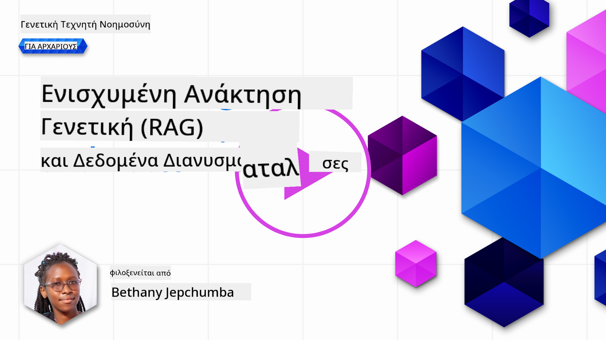
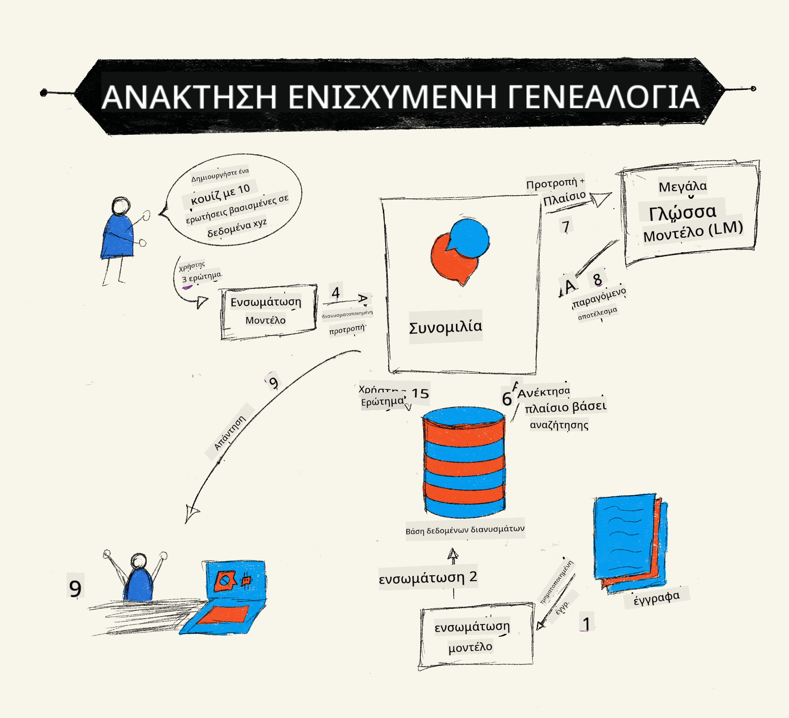
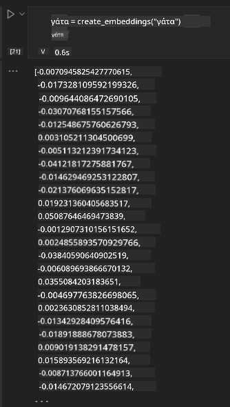

<!--
CO_OP_TRANSLATOR_METADATA:
{
  "original_hash": "e2861bbca91c0567ef32bc77fe054f9e",
  "translation_date": "2025-07-09T16:12:37+00:00",
  "source_file": "15-rag-and-vector-databases/README.md",
  "language_code": "el"
}
-->
# Retrieval Augmented Generation (RAG) και Βάσεις Δεδομένων Διανυσμάτων

[](https://aka.ms/gen-ai-lesson15-gh?WT.mc_id=academic-105485-koreyst)

Στο μάθημα για τις εφαρμογές αναζήτησης, μάθαμε σύντομα πώς να ενσωματώνουμε τα δικά μας δεδομένα σε Μεγάλα Γλωσσικά Μοντέλα (LLMs). Σε αυτό το μάθημα, θα εμβαθύνουμε περισσότερο στις έννοιες της θεμελίωσης των δεδομένων σας στην εφαρμογή LLM, στη μηχανική της διαδικασίας και στις μεθόδους αποθήκευσης δεδομένων, συμπεριλαμβανομένων τόσο των embeddings όσο και του κειμένου.

> **Βίντεο Έρχεται Σύντομα**

## Εισαγωγή

Σε αυτό το μάθημα θα καλύψουμε τα εξής:

- Μια εισαγωγή στο RAG, τι είναι και γιατί χρησιμοποιείται στην Τεχνητή Νοημοσύνη (AI).

- Κατανόηση των βάσεων δεδομένων διανυσμάτων και δημιουργία μίας για την εφαρμογή μας.

- Ένα πρακτικό παράδειγμα για το πώς να ενσωματώσετε το RAG σε μια εφαρμογή.

## Στόχοι Μάθησης

Μετά την ολοκλήρωση αυτού του μαθήματος, θα μπορείτε να:

- Εξηγήσετε τη σημασία του RAG στην ανάκτηση και επεξεργασία δεδομένων.

- Ρυθμίσετε μια εφαρμογή RAG και να θεμελιώσετε τα δεδομένα σας σε ένα LLM.

- Ενσωματώσετε αποτελεσματικά το RAG και τις βάσεις δεδομένων διανυσμάτων σε εφαρμογές LLM.

## Το Σενάριό μας: βελτίωση των LLMs μας με τα δικά μας δεδομένα

Για αυτό το μάθημα, θέλουμε να προσθέσουμε τις δικές μας σημειώσεις στην εκπαιδευτική startup, που επιτρέπει στο chatbot να λαμβάνει περισσότερες πληροφορίες για τα διάφορα θέματα. Χρησιμοποιώντας τις σημειώσεις που έχουμε, οι μαθητές θα μπορούν να μελετούν καλύτερα και να κατανοούν τα διάφορα θέματα, καθιστώντας ευκολότερη την επανάληψη για τις εξετάσεις τους. Για να δημιουργήσουμε το σενάριό μας, θα χρησιμοποιήσουμε:

- `Azure OpenAI:` το LLM που θα χρησιμοποιήσουμε για να δημιουργήσουμε το chatbot μας

- `Μάθημα AI για αρχάριους σχετικά με τα Νευρωνικά Δίκτυα:` αυτά θα είναι τα δεδομένα στα οποία θα θεμελιώσουμε το LLM μας

- `Azure AI Search` και `Azure Cosmos DB:` βάση δεδομένων διανυσμάτων για την αποθήκευση των δεδομένων μας και τη δημιουργία ευρετηρίου αναζήτησης

Οι χρήστες θα μπορούν να δημιουργούν πρακτικά κουίζ από τις σημειώσεις τους, κάρτες επανάληψης και να συνοψίζουν σε σύντομες επισκοπήσεις. Για να ξεκινήσουμε, ας δούμε τι είναι το RAG και πώς λειτουργεί:

## Retrieval Augmented Generation (RAG)

Ένα chatbot που τροφοδοτείται από LLM επεξεργάζεται τα ερωτήματα των χρηστών για να δημιουργήσει απαντήσεις. Έχει σχεδιαστεί να είναι διαδραστικό και να αλληλεπιδρά με τους χρήστες σε ένα ευρύ φάσμα θεμάτων. Ωστόσο, οι απαντήσεις του περιορίζονται στο πλαίσιο που του παρέχεται και στα βασικά δεδομένα εκπαίδευσής του. Για παράδειγμα, το GPT-4 έχει cutoff γνώσης τον Σεπτέμβριο του 2021, που σημαίνει ότι δεν γνωρίζει γεγονότα που συνέβησαν μετά από αυτή την περίοδο. Επιπλέον, τα δεδομένα που χρησιμοποιούνται για την εκπαίδευση των LLM αποκλείουν εμπιστευτικές πληροφορίες όπως προσωπικές σημειώσεις ή εγχειρίδια προϊόντων εταιρειών.

### Πώς λειτουργούν τα RAG (Retrieval Augmented Generation)



Ας υποθέσουμε ότι θέλετε να αναπτύξετε ένα chatbot που δημιουργεί κουίζ από τις σημειώσεις σας, θα χρειαστείτε μια σύνδεση με τη βάση γνώσεων. Εδώ έρχεται το RAG να βοηθήσει. Τα RAG λειτουργούν ως εξής:

- **Βάση γνώσεων:** Πριν από την ανάκτηση, αυτά τα έγγραφα πρέπει να εισαχθούν και να προεπεξεργαστούν, συνήθως διασπώντας μεγάλα έγγραφα σε μικρότερα κομμάτια, μετατρέποντάς τα σε text embeddings και αποθηκεύοντάς τα σε μια βάση δεδομένων.

- **Ερώτημα χρήστη:** ο χρήστης θέτει μια ερώτηση

- **Ανάκτηση:** Όταν ο χρήστης θέτει μια ερώτηση, το μοντέλο embedding ανακτά σχετικές πληροφορίες από τη βάση γνώσεων για να παρέχει περισσότερο πλαίσιο που θα ενσωματωθεί στο prompt.

- **Ενισχυμένη Γενιά:** το LLM βελτιώνει την απάντησή του βασιζόμενο στα δεδομένα που ανακτήθηκαν. Επιτρέπει στην απάντηση να βασίζεται όχι μόνο σε προεκπαιδευμένα δεδομένα αλλά και σε σχετικές πληροφορίες από το πρόσθετο πλαίσιο. Τα ανακτηθέντα δεδομένα χρησιμοποιούνται για να ενισχύσουν τις απαντήσεις του LLM. Στη συνέχεια, το LLM επιστρέφει μια απάντηση στην ερώτηση του χρήστη.


Η αρχιτεκτονική των RAG υλοποιείται με χρήση transformers που αποτελούνται από δύο μέρη: έναν encoder και έναν decoder. Για παράδειγμα, όταν ένας χρήστης θέτει μια ερώτηση, το εισαγόμενο κείμενο «κωδικοποιείται» σε διανύσματα που αποτυπώνουν το νόημα των λέξεων και τα διανύσματα «αποκωδικοποιούνται» στο ευρετήριο εγγράφων μας και παράγουν νέο κείμενο βασισμένο στο ερώτημα του χρήστη. Το LLM χρησιμοποιεί μοντέλο encoder-decoder για να παράγει το αποτέλεσμα.

Δύο προσεγγίσεις κατά την υλοποίηση του RAG σύμφωνα με το προτεινόμενο άρθρο: [Retrieval-Augmented Generation for Knowledge intensive NLP Tasks](https://arxiv.org/pdf/2005.11401.pdf?WT.mc_id=academic-105485-koreyst) είναι:

- **_RAG-Sequence_** που χρησιμοποιεί τα ανακτημένα έγγραφα για να προβλέψει την καλύτερη δυνατή απάντηση σε ένα ερώτημα χρήστη

- **RAG-Token** που χρησιμοποιεί έγγραφα για να δημιουργήσει το επόμενο token και στη συνέχεια τα ανακτά για να απαντήσει στο ερώτημα του χρήστη

### Γιατί να χρησιμοποιήσετε RAG; 

- **Πλούτος πληροφοριών:** διασφαλίζει ότι οι απαντήσεις κειμένου είναι ενημερωμένες και τρέχουσες. Ενισχύει έτσι την απόδοση σε εργασίες συγκεκριμένου τομέα με πρόσβαση στη βάση γνώσεων.

- Μειώνει τις ψευδείς πληροφορίες χρησιμοποιώντας **επαληθεύσιμα δεδομένα** στη βάση γνώσεων για να παρέχει πλαίσιο στα ερωτήματα των χρηστών.

- Είναι **οικονομικό** καθώς κοστίζει λιγότερο σε σχέση με την εκπαίδευση (fine-tuning) ενός LLM.

## Δημιουργία βάσης γνώσεων

Η εφαρμογή μας βασίζεται στα προσωπικά μας δεδομένα, δηλαδή το μάθημα Νευρωνικών Δικτύων από το πρόγραμμα AI For Beginners.

### Βάσεις Δεδομένων Διανυσμάτων

Μια βάση δεδομένων διανυσμάτων, σε αντίθεση με τις παραδοσιακές βάσεις δεδομένων, είναι μια εξειδικευμένη βάση σχεδιασμένη για την αποθήκευση, διαχείριση και αναζήτηση ενσωματωμένων διανυσμάτων. Αποθηκεύει αριθμητικές αναπαραστάσεις εγγράφων. Η διάσπαση των δεδομένων σε αριθμητικά embeddings διευκολύνει το σύστημα AI να κατανοήσει και να επεξεργαστεί τα δεδομένα.

Αποθηκεύουμε τα embeddings μας σε βάσεις δεδομένων διανυσμάτων καθώς τα LLM έχουν όριο στον αριθμό των tokens που δέχονται ως είσοδο. Επειδή δεν μπορείτε να περάσετε ολόκληρα τα embeddings σε ένα LLM, θα χρειαστεί να τα χωρίσουμε σε κομμάτια και όταν ένας χρήστης θέτει μια ερώτηση, τα embeddings που ταιριάζουν περισσότερο με την ερώτηση θα επιστραφούν μαζί με το prompt. Η διάσπαση μειώνει επίσης το κόστος στον αριθμό των tokens που περνούν από το LLM.

Μερικές δημοφιλείς βάσεις δεδομένων διανυσμάτων είναι οι Azure Cosmos DB, Clarifyai, Pinecone, Chromadb, ScaNN, Qdrant και DeepLake. Μπορείτε να δημιουργήσετε ένα μοντέλο Azure Cosmos DB χρησιμοποιώντας το Azure CLI με την ακόλουθη εντολή:

```bash
az login
az group create -n <resource-group-name> -l <location>
az cosmosdb create -n <cosmos-db-name> -r <resource-group-name>
az cosmosdb list-keys -n <cosmos-db-name> -g <resource-group-name>
```

### Από κείμενο σε embeddings

Πριν αποθηκεύσουμε τα δεδομένα μας, πρέπει να τα μετατρέψουμε σε vector embeddings πριν αποθηκευτούν στη βάση δεδομένων. Αν εργάζεστε με μεγάλα έγγραφα ή μεγάλα κείμενα, μπορείτε να τα χωρίσετε σε κομμάτια με βάση τα ερωτήματα που περιμένετε. Η διάσπαση μπορεί να γίνει σε επίπεδο πρότασης ή παραγράφου. Επειδή η διάσπαση αντλεί νόημα από τις λέξεις γύρω, μπορείτε να προσθέσετε και άλλο πλαίσιο σε ένα κομμάτι, για παράδειγμα, προσθέτοντας τον τίτλο του εγγράφου ή συμπεριλαμβάνοντας κάποιο κείμενο πριν ή μετά το κομμάτι. Μπορείτε να χωρίσετε τα δεδομένα ως εξής:

```python
def split_text(text, max_length, min_length):
    words = text.split()
    chunks = []
    current_chunk = []

    for word in words:
        current_chunk.append(word)
        if len(' '.join(current_chunk)) < max_length and len(' '.join(current_chunk)) > min_length:
            chunks.append(' '.join(current_chunk))
            current_chunk = []

    # If the last chunk didn't reach the minimum length, add it anyway
    if current_chunk:
        chunks.append(' '.join(current_chunk))

    return chunks
```

Αφού χωριστούν, μπορούμε να ενσωματώσουμε το κείμενο χρησιμοποιώντας διάφορα μοντέλα embedding. Μερικά μοντέλα που μπορείτε να χρησιμοποιήσετε είναι: word2vec, ada-002 της OpenAI, Azure Computer Vision και πολλά άλλα. Η επιλογή μοντέλου εξαρτάται από τις γλώσσες που χρησιμοποιείτε, τον τύπο περιεχομένου που κωδικοποιείται (κείμενο/εικόνες/ήχος), το μέγεθος της εισόδου που μπορεί να κωδικοποιήσει και το μήκος της εξόδου embedding.

Ένα παράδειγμα ενσωματωμένου κειμένου με το μοντέλο `text-embedding-ada-002` της OpenAI είναι:


## Ανάκτηση και Αναζήτηση Διανυσμάτων

Όταν ένας χρήστης θέτει μια ερώτηση, ο retriever τη μετατρέπει σε διάνυσμα χρησιμοποιώντας τον query encoder, στη συνέχεια αναζητά στο ευρετήριο αναζήτησης εγγράφων για σχετικά διανύσματα που σχετίζονται με την είσοδο. Μόλις ολοκληρωθεί, μετατρέπει τόσο το διάνυσμα εισόδου όσο και τα διανύσματα εγγράφων σε κείμενο και τα περνάει στο LLM.

### Ανάκτηση

Η ανάκτηση συμβαίνει όταν το σύστημα προσπαθεί γρήγορα να βρει τα έγγραφα από το ευρετήριο που ικανοποιούν τα κριτήρια αναζήτησης. Ο στόχος του retriever είναι να πάρει έγγραφα που θα χρησιμοποιηθούν για να παρέχουν πλαίσιο και να θεμελιώσουν το LLM στα δεδομένα σας.

Υπάρχουν διάφοροι τρόποι για να πραγματοποιήσουμε αναζήτηση στη βάση δεδομένων μας, όπως:

- **Αναζήτηση με λέξεις-κλειδιά** - χρησιμοποιείται για αναζητήσεις κειμένου

- **Σημασιολογική αναζήτηση** - χρησιμοποιεί το σημασιολογικό νόημα των λέξεων

- **Αναζήτηση διανυσμάτων** - μετατρέπει έγγραφα από κείμενο σε διανυσματικές αναπαραστάσεις χρησιμοποιώντας μοντέλα embedding. Η ανάκτηση γίνεται με ερώτημα στα έγγραφα των οποίων οι διανυσματικές αναπαραστάσεις είναι πιο κοντά στην ερώτηση του χρήστη.

- **Υβριδική** - συνδυασμός αναζήτησης με λέξεις-κλειδιά και διανυσμάτων.

Μια πρόκληση στην ανάκτηση εμφανίζεται όταν δεν υπάρχει παρόμοια απάντηση στο ερώτημα στη βάση δεδομένων, τότε το σύστημα επιστρέφει την καλύτερη δυνατή πληροφορία που μπορεί να βρει, ωστόσο μπορείτε να χρησιμοποιήσετε τακτικές όπως ορισμός μέγιστης απόστασης για τη σχετικότητα ή χρήση υβριδικής αναζήτησης που συνδυάζει λέξεις-κλειδιά και αναζήτηση διανυσμάτων. Σε αυτό το μάθημα θα χρησιμοποιήσουμε υβριδική αναζήτηση, συνδυασμό αναζήτησης διανυσμάτων και λέξεων-κλειδιών. Θα αποθηκεύσουμε τα δεδομένα μας σε dataframe με στήλες που περιέχουν τα κομμάτια καθώς και τα embeddings.

### Ομοιότητα Διανυσμάτων

Ο retriever θα αναζητήσει στη βάση γνώσεων για embeddings που είναι κοντά μεταξύ τους, τον πιο κοντινό γείτονα, καθώς είναι κείμενα που μοιάζουν. Στο σενάριο που ένας χρήστης θέτει ένα ερώτημα, αυτό πρώτα ενσωματώνεται και στη συνέχεια ταιριάζει με παρόμοια embeddings. Η κοινή μέτρηση που χρησιμοποιείται για να βρεθεί πόσο παρόμοια είναι δύο διανύσματα είναι η cosine similarity, που βασίζεται στη γωνία μεταξύ δύο διανυσμάτων.

Μπορούμε να μετρήσουμε την ομοιότητα και με άλλες μεθόδους όπως η Ευκλείδεια απόσταση, που είναι η ευθεία γραμμή μεταξύ των άκρων των διανυσμάτων, και το dot product που μετρά το άθροισμα των γινομένων των αντίστοιχων στοιχείων δύο διανυσμάτων.

### Ευρετήριο αναζήτησης

Κατά την ανάκτηση, θα χρειαστεί να δημιουργήσουμε ένα ευρετήριο αναζήτησης για τη βάση γνώσεων πριν εκτελέσουμε την αναζήτηση. Ένα ευρετήριο αποθηκεύει τα embeddings μας και μπορεί γρήγορα να ανακτήσει τα πιο παρόμοια κομμάτια ακόμα και σε μια μεγάλη βάση δεδομένων. Μπορούμε να δημιουργήσουμε το ευρετήριό μας τοπικά χρησιμοποιώντας:

```python
from sklearn.neighbors import NearestNeighbors

embeddings = flattened_df['embeddings'].to_list()

# Create the search index
nbrs = NearestNeighbors(n_neighbors=5, algorithm='ball_tree').fit(embeddings)

# To query the index, you can use the kneighbors method
distances, indices = nbrs.kneighbors(embeddings)
```

### Επαναταξινόμηση (Re-ranking)

Αφού κάνετε το ερώτημα στη βάση δεδομένων, μπορεί να χρειαστεί να ταξινομήσετε τα αποτελέσματα από τα πιο σχετικά. Ένα reranking LLM χρησιμοποιεί Μηχανική Μάθηση για να βελτιώσει τη σχετικότητα των αποτελεσμάτων αναζήτησης ταξινομώντας τα από τα πιο σχετικά. Χρησιμοποιώντας το Azure AI Search, η επαναταξινόμηση γίνεται αυτόματα για εσάς με χρήση semantic reranker. Ένα παράδειγμα για το πώς λειτουργεί η επαναταξινόμηση με βάση τους κοντινότερους γείτονες:

```python
# Find the most similar documents
distances, indices = nbrs.kneighbors([query_vector])

index = []
# Print the most similar documents
for i in range(3):
    index = indices[0][i]
    for index in indices[0]:
        print(flattened_df['chunks'].iloc[index])
        print(flattened_df['path'].iloc[index])
        print(flattened_df['distances'].iloc[index])
    else:
        print(f"Index {index} not found in DataFrame")
```

## Όλα μαζί

Το τελευταίο βήμα είναι να προσθέσουμε το LLM μας στο μείγμα ώστε να μπορούμε να λαμβάνουμε απαντήσεις που βασίζονται στα δεδομένα μας. Μπορούμε να το υλοποιήσουμε ως εξής:

```python
user_input = "what is a perceptron?"

def chatbot(user_input):
    # Convert the question to a query vector
    query_vector = create_embeddings(user_input)

    # Find the most similar documents
    distances, indices = nbrs.kneighbors([query_vector])

    # add documents to query  to provide context
    history = []
    for index in indices[0]:
        history.append(flattened_df['chunks'].iloc[index])

    # combine the history and the user input
    history.append(user_input)

    # create a message object
    messages=[
        {"role": "system", "content": "You are an AI assistant that helps with AI questions."},
        {"role": "user", "content": history[-1]}
    ]

    # use chat completion to generate a response
    response = openai.chat.completions.create(
        model="gpt-4",
        temperature=0.7,
        max_tokens=800,
        messages=messages
    )

    return response.choices[0].message

chatbot(user_input)
```

## Αξιολόγηση της εφαρμογής μας

### Μετρικές Αξιολόγησης

- Ποιότητα των απαντήσεων, διασφαλίζοντας ότι ακούγονται φυσικές, ρέουσες και ανθρώπινες

- Θεμελίωση των δεδομένων: αξιολόγηση αν η απάντηση προέρχεται από τα παρεχόμενα έγγραφα

- Σχετικότητα: αξιολόγηση αν η απάντηση ταιριάζει και σχετίζεται με την ερώτηση που τέθηκε

- Ρευστότητα - αν η απάντηση έχει γραμματικό νόημα

## Περίπτωσεις χρήσης για RAG και βάσεις δεδομένων διανυσμάτων

Υπάρχουν πολλές διαφορετικές περιπτώσεις όπου οι κλήσεις λειτουργιών μπορούν να βελτιώσουν την εφαρμογή σας, όπως:

- Ερωτήσεις και Απαντήσεις: θεμελίωση των εταιρικών δεδομένων σε ένα chat που μπορούν να χρησιμοποιούν οι υπάλληλοι για να κάνουν ερωτήσεις.

- Συστήματα Συστάσεων: όπου μπορείτε να δημιουργήσετε ένα σύστημα που ταιριάζει τις πιο παρόμοιες τιμές π.χ. ταινίες, εστιατόρια και πολλά άλλα.

- Υπηρεσίες chatbot: μπορείτε να αποθηκεύσετε το ιστορικό συνομιλιών και να προσωποποιήσετε

**Αποποίηση ευθυνών**:  
Αυτό το έγγραφο έχει μεταφραστεί χρησιμοποιώντας την υπηρεσία αυτόματης μετάφρασης AI [Co-op Translator](https://github.com/Azure/co-op-translator). Παρόλο που επιδιώκουμε την ακρίβεια, παρακαλούμε να έχετε υπόψη ότι οι αυτόματες μεταφράσεις ενδέχεται να περιέχουν λάθη ή ανακρίβειες. Το πρωτότυπο έγγραφο στη γλώσσα του θεωρείται η αυθεντική πηγή. Για κρίσιμες πληροφορίες, συνιστάται επαγγελματική ανθρώπινη μετάφραση. Δεν φέρουμε ευθύνη για τυχόν παρεξηγήσεις ή λανθασμένες ερμηνείες που προκύπτουν από τη χρήση αυτής της μετάφρασης.