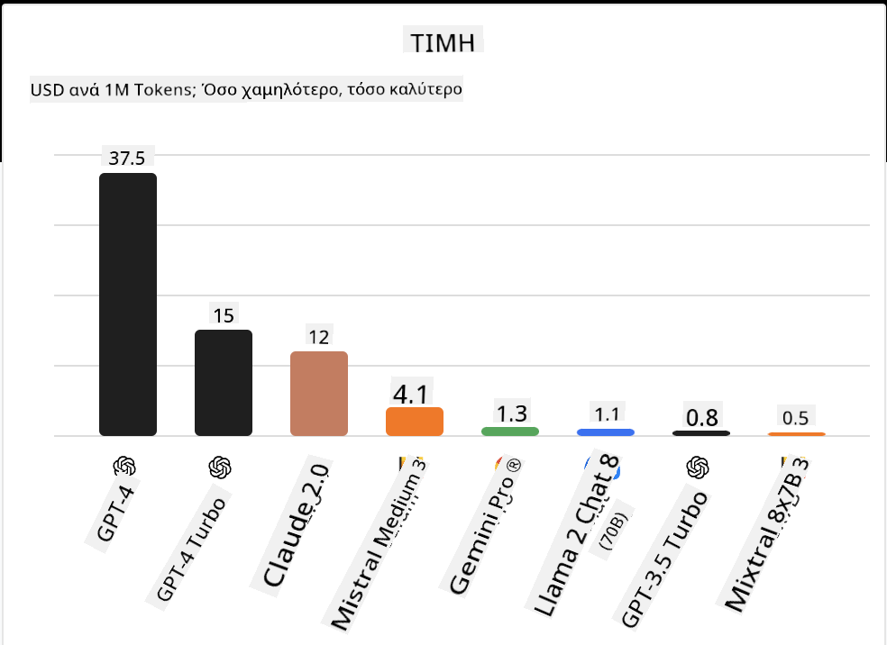
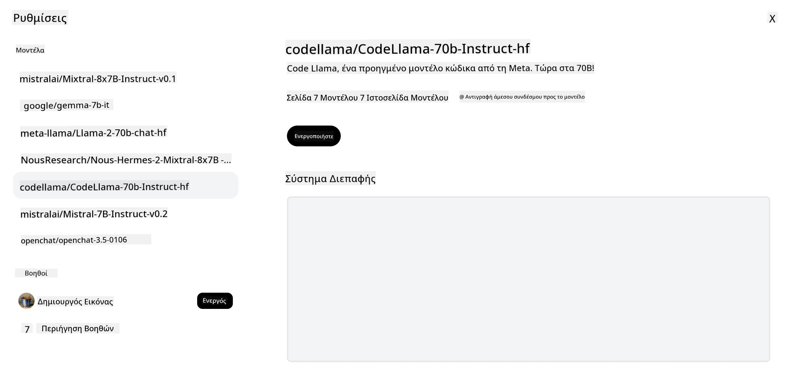

<!--
CO_OP_TRANSLATOR_METADATA:
{
  "original_hash": "0bba96e53ab841d99db731892a51fab8",
  "translation_date": "2025-05-20T06:55:46+00:00",
  "source_file": "16-open-source-models/README.md",
  "language_code": "el"
}
-->

## Εισαγωγή

Ο κόσμος των ανοιχτού κώδικα LLMs είναι συναρπαστικός και συνεχώς εξελίσσεται. Αυτό το μάθημα στοχεύει να παρέχει μια εις βάθος ματιά στα μοντέλα ανοιχτού κώδικα. Αν αναζητάτε πληροφορίες για το πώς συγκρίνονται τα ιδιόκτητα μοντέλα με τα μοντέλα ανοιχτού κώδικα, επισκεφθείτε το μάθημα ["Εξερεύνηση και Σύγκριση Διαφορετικών LLMs"](../02-exploring-and-comparing-different-llms/README.md?WT.mc_id=academic-105485-koreyst). Αυτό το μάθημα θα καλύψει επίσης το θέμα της λεπτομερούς ρύθμισης, αλλά μια πιο λεπτομερής εξήγηση μπορεί να βρεθεί στο μάθημα ["Λεπτομερής Ρύθμιση LLMs"](../18-fine-tuning/README.md?WT.mc_id=academic-105485-koreyst).

## Στόχοι μάθησης

- Απόκτηση κατανόησης των μοντέλων ανοιχτού κώδικα
- Κατανόηση των πλεονεκτημάτων της εργασίας με μοντέλα ανοιχτού κώδικα
- Εξερεύνηση των ανοιχτών μοντέλων που είναι διαθέσιμα στο Hugging Face και το Azure AI Studio

## Τι είναι τα Μοντέλα Ανοιχτού Κώδικα;

Το λογισμικό ανοιχτού κώδικα έχει παίξει κρίσιμο ρόλο στην ανάπτυξη της τεχνολογίας σε διάφορους τομείς. Η Open Source Initiative (OSI) έχει ορίσει [10 κριτήρια για το λογισμικό](https://web.archive.org/web/20241126001143/https://opensource.org/osd?WT.mc_id=academic-105485-koreyst) για να ταξινομηθεί ως ανοιχτού κώδικα. Ο πηγαίος κώδικας πρέπει να είναι ανοιχτά κοινοποιημένος υπό άδεια εγκεκριμένη από την OSI.

Ενώ η ανάπτυξη των LLMs έχει παρόμοια στοιχεία με την ανάπτυξη λογισμικού, η διαδικασία δεν είναι ακριβώς η ίδια. Αυτό έχει προκαλέσει πολλές συζητήσεις στην κοινότητα σχετικά με τον ορισμό του ανοιχτού κώδικα στο πλαίσιο των LLMs. Για να ευθυγραμμιστεί ένα μοντέλο με τον παραδοσιακό ορισμό του ανοιχτού κώδικα, οι ακόλουθες πληροφορίες πρέπει να είναι δημόσια διαθέσιμες:

- Σύνολα δεδομένων που χρησιμοποιήθηκαν για την εκπαίδευση του μοντέλου.
- Πλήρη βάρη μοντέλου ως μέρος της εκπαίδευσης.
- Ο κώδικας αξιολόγησης.
- Ο κώδικας λεπτομερούς ρύθμισης.
- Πλήρη βάρη μοντέλου και μετρικές εκπαίδευσης.

Προς το παρόν, υπάρχουν μόνο λίγα μοντέλα που πληρούν αυτά τα κριτήρια. Το [μοντέλο OLMo που δημιουργήθηκε από το Allen Institute for Artificial Intelligence (AllenAI)](https://huggingface.co/allenai/OLMo-7B?WT.mc_id=academic-105485-koreyst) είναι ένα από αυτά που ανήκουν σε αυτήν την κατηγορία.

Για αυτό το μάθημα, θα αναφερόμαστε στα μοντέλα ως "ανοιχτά μοντέλα" στο εξής, καθώς μπορεί να μην πληρούν τα παραπάνω κριτήρια τη στιγμή της συγγραφής.

## Πλεονεκτήματα των Ανοιχτών Μοντέλων

**Εξαιρετικά Προσαρμόσιμα** - Δεδομένου ότι τα ανοιχτά μοντέλα κυκλοφορούν με λεπτομερείς πληροφορίες εκπαίδευσης, οι ερευνητές και οι προγραμματιστές μπορούν να τροποποιήσουν τα εσωτερικά του μοντέλου. Αυτό επιτρέπει τη δημιουργία εξειδικευμένων μοντέλων που είναι λεπτομερώς ρυθμισμένα για μια συγκεκριμένη εργασία ή τομέα μελέτης. Μερικά παραδείγματα αυτού είναι η δημιουργία κώδικα, οι μαθηματικές λειτουργίες και η βιολογία.

**Κόστος** - Το κόστος ανά token για τη χρήση και την ανάπτυξη αυτών των μοντέλων είναι χαμηλότερο από αυτό των ιδιόκτητων μοντέλων. Όταν χτίζετε εφαρμογές Generative AI, πρέπει να εξετάσετε την απόδοση σε σχέση με την τιμή όταν εργάζεστε με αυτά τα μοντέλα για τη χρήση σας.

 Πηγή: Artificial Analysis

**Ευελιξία** - Η εργασία με ανοιχτά μοντέλα σας επιτρέπει να είστε ευέλικτοι όσον αφορά τη χρήση διαφορετικών μοντέλων ή τον συνδυασμό τους. Ένα παράδειγμα αυτού είναι οι [HuggingChat Assistants](https://huggingface.co/chat?WT.mc_id=academic-105485-koreyst) όπου ο χρήστης μπορεί να επιλέξει το μοντέλο που χρησιμοποιείται απευθείας στη διεπαφή χρήστη:

## Εξερεύνηση Διαφορετικών Ανοιχτών Μοντέλων

### Llama 2

Το [LLama2](https://huggingface.co/meta-llama?WT.mc_id=academic-105485-koreyst), που αναπτύχθηκε από τη Meta, είναι ένα ανοιχτό μοντέλο που είναι βελτιστοποιημένο για εφαρμογές βασισμένες σε συνομιλίες. Αυτό οφείλεται στη μέθοδο λεπτομερούς ρύθμισης, η οποία περιλάμβανε μεγάλο όγκο διαλόγου και ανθρώπινης ανατροφοδότησης. Με αυτή τη μέθοδο, το μοντέλο παράγει περισσότερα αποτελέσματα που ευθυγραμμίζονται με τις ανθρώπινες προσδοκίες, παρέχοντας μια καλύτερη εμπειρία χρήστη.

Μερικά παραδείγματα λεπτομερώς ρυθμισμένων εκδόσεων του Llama περιλαμβάνουν το [Japanese Llama](https://huggingface.co/elyza/ELYZA-japanese-Llama-2-7b?WT.mc_id=academic-105485-koreyst), που ειδικεύεται στα Ιαπωνικά και το [Llama Pro](https://huggingface.co/TencentARC/LLaMA-Pro-8B?WT.mc_id=academic-105485-koreyst), που είναι μια βελτιωμένη έκδοση του βασικού μοντέλου.

### Mistral

Το [Mistral](https://huggingface.co/mistralai?WT.mc_id=academic-105485-koreyst) είναι ένα ανοιχτό μοντέλο με έντονη εστίαση στην υψηλή απόδοση και αποδοτικότητα. Χρησιμοποιεί την προσέγγιση Mixture-of-Experts, η οποία συνδυάζει μια ομάδα εξειδικευμένων μοντέλων εμπειρογνωμόνων σε ένα σύστημα όπου ανάλογα με την είσοδο, επιλέγονται ορισμένα μοντέλα για να χρησιμοποιηθούν. Αυτό καθιστά τον υπολογισμό πιο αποτελεσματικό καθώς τα μοντέλα ασχολούνται μόνο με τις εισόδους στις οποίες είναι εξειδικευμένα.

Μερικά παραδείγματα λεπτομερώς ρυθμισμένων εκδόσεων του Mistral περιλαμβάνουν το [BioMistral](https://huggingface.co/BioMistral/BioMistral-7B?text=Mon+nom+est+Thomas+et+mon+principal?WT.mc_id=academic-105485-koreyst), που εστιάζει στον ιατρικό τομέα και το [OpenMath Mistral](https://huggingface.co/nvidia/OpenMath-Mistral-7B-v0.1-hf?WT.mc_id=academic-105485-koreyst), που εκτελεί μαθηματικούς υπολογισμούς.

### Falcon

Το [Falcon](https://huggingface.co/tiiuae?WT.mc_id=academic-105485-koreyst) είναι ένα LLM που δημιουργήθηκε από το Technology Innovation Institute (**TII**). Το Falcon-40B εκπαιδεύτηκε σε 40 δισεκατομμύρια παραμέτρους, κάτι που έχει αποδειχθεί ότι αποδίδει καλύτερα από το GPT-3 με λιγότερο υπολογιστικό προϋπολογισμό. Αυτό οφείλεται στη χρήση του αλγορίθμου FlashAttention και της πολυερωτικής προσοχής που του επιτρέπει να μειώσει τις απαιτήσεις μνήμης κατά τον χρόνο πρόβλεψης. Με αυτόν τον μειωμένο χρόνο πρόβλεψης, το Falcon-40B είναι κατάλληλο για εφαρμογές συνομιλίας.

Μερικά παραδείγματα λεπτομερώς ρυθμισμένων εκδόσεων του Falcon είναι το [OpenAssistant](https://huggingface.co/OpenAssistant/falcon-40b-sft-top1-560?WT.mc_id=academic-105485-koreyst), ένας βοηθός που βασίζεται σε ανοιχτά μοντέλα και το [GPT4ALL](https://huggingface.co/nomic-ai/gpt4all-falcon?WT.mc_id=academic-105485-koreyst), που προσφέρει υψηλότερη απόδοση από το βασικό μοντέλο.

## Πώς να Επιλέξετε

Δεν υπάρχει μία απάντηση για την επιλογή ενός ανοιχτού μοντέλου. Ένα καλό σημείο εκκίνησης είναι η χρήση της δυνατότητας φιλτραρίσματος κατά εργασία του Azure AI Studio. Αυτό θα σας βοηθήσει να κατανοήσετε για ποιους τύπους εργασιών έχει εκπαιδευτεί το μοντέλο. Το Hugging Face διατηρεί επίσης έναν πίνακα κατάταξης LLM που σας δείχνει τα μοντέλα με την καλύτερη απόδοση βάσει ορισμένων μετρικών.

Όταν θέλετε να συγκρίνετε LLMs ανάμεσα στους διαφορετικούς τύπους, το [Artificial Analysis](https://artificialanalysis.ai/?WT.mc_id=academic-105485-koreyst) είναι ένας άλλος εξαιρετικός πόρος:

 Πηγή: Artifical Analysis

Αν εργάζεστε σε μια συγκεκριμένη περίπτωση χρήσης, η αναζήτηση για λεπτομερώς ρυθμισμένες εκδόσεις που εστιάζουν στην ίδια περιοχή μπορεί να είναι αποτελεσματική. Η δοκιμή πολλών ανοιχτών μοντέλων για να δείτε πώς αποδίδουν σύμφωνα με τις προσδοκίες σας και των χρηστών σας είναι μια άλλη καλή πρακτική.

## Επόμενα Βήματα

Το καλύτερο μέρος για τα ανοιχτά μοντέλα είναι ότι μπορείτε να ξεκινήσετε να εργάζεστε με αυτά αρκετά γρήγορα. Δείτε τον [Κατάλογο Μοντέλων Azure AI Studio](https://ai.azure.com?WT.mc_id=academic-105485-koreyst), ο οποίος περιλαμβάνει μια συγκεκριμένη συλλογή Hugging Face με αυτά τα μοντέλα που συζητήσαμε εδώ.

## Η Μάθηση δεν σταματά εδώ, συνεχίστε το Ταξίδι

Μετά την ολοκλήρωση αυτού του μαθήματος, δείτε τη [Συλλογή Μάθησης Generative AI](https://aka.ms/genai-collection?WT.mc_id=academic-105485-koreyst) για να συνεχίσετε να αναβαθμίζετε τις γνώσεις σας στην Generative AI!

**Αποποίηση ευθυνών**:
Αυτό το έγγραφο έχει μεταφραστεί χρησιμοποιώντας την υπηρεσία AI μετάφρασης [Co-op Translator](https://github.com/Azure/co-op-translator). Ενώ επιδιώκουμε την ακρίβεια, παρακαλούμε να γνωρίζετε ότι οι αυτοματοποιημένες μεταφράσεις ενδέχεται να περιέχουν λάθη ή ανακρίβειες. Το αρχικό έγγραφο στη μητρική του γλώσσα θα πρέπει να θεωρείται η αυθεντική πηγή. Για κρίσιμες πληροφορίες, συνιστάται η επαγγελματική ανθρώπινη μετάφραση. Δεν είμαστε υπεύθυνοι για τυχόν παρεξηγήσεις ή παρερμηνείες που προκύπτουν από τη χρήση αυτής της μετάφρασης.