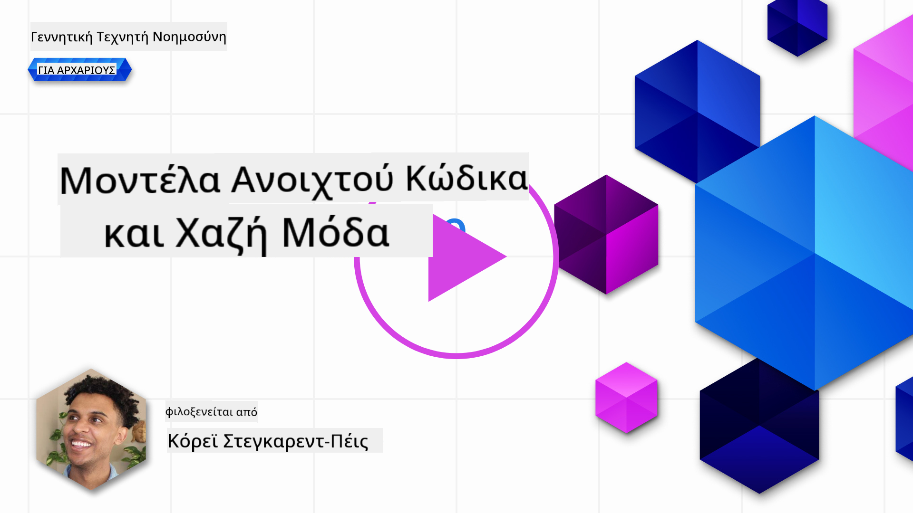
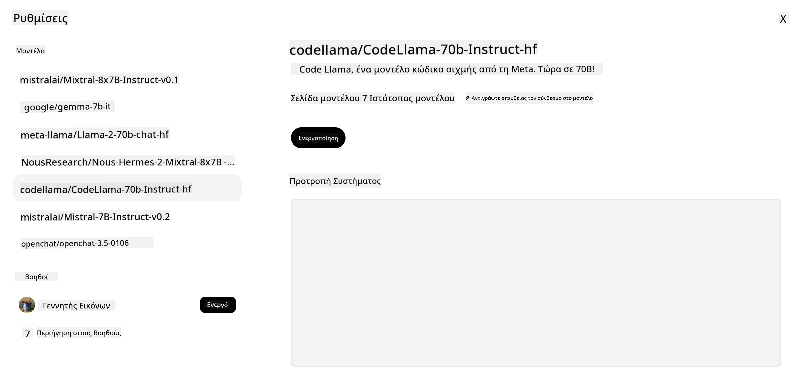
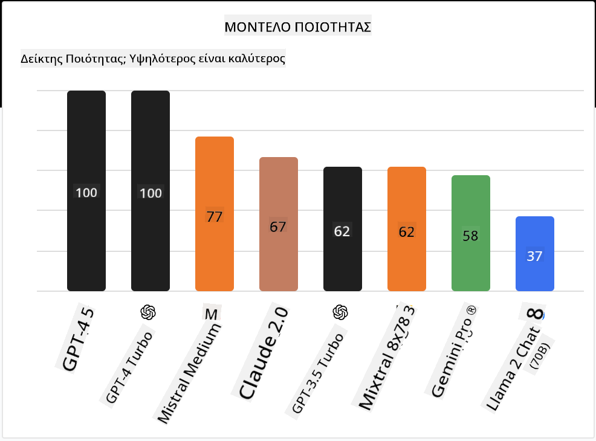

<!--
CO_OP_TRANSLATOR_METADATA:
{
  "original_hash": "0bba96e53ab841d99db731892a51fab8",
  "translation_date": "2025-07-09T17:09:53+00:00",
  "source_file": "16-open-source-models/README.md",
  "language_code": "el"
}
-->

## Εισαγωγή

Ο κόσμος των ανοιχτών LLM είναι συναρπαστικός και συνεχώς εξελίσσεται. Αυτό το μάθημα στοχεύει να προσφέρει μια εις βάθος ματιά στα ανοιχτά μοντέλα. Αν ψάχνετε πληροφορίες για το πώς συγκρίνονται τα ιδιόκτητα μοντέλα με τα ανοιχτά, μεταβείτε στο ["Exploring and Comparing Different LLMs" μάθημα](../02-exploring-and-comparing-different-llms/README.md?WT.mc_id=academic-105485-koreyst). Το μάθημα αυτό θα καλύψει επίσης το θέμα της fine-tuning, αλλά μια πιο αναλυτική εξήγηση μπορείτε να βρείτε στο ["Fine-Tuning LLMs" μάθημα](../18-fine-tuning/README.md?WT.mc_id=academic-105485-koreyst).

## Στόχοι μάθησης

- Κατανόηση των ανοιχτών μοντέλων  
- Κατανόηση των πλεονεκτημάτων της εργασίας με ανοιχτά μοντέλα  
- Εξερεύνηση των ανοιχτών μοντέλων που είναι διαθέσιμα στο Hugging Face και το Azure AI Studio  

## Τι είναι τα Ανοιχτά Μοντέλα;

Το ανοιχτό λογισμικό έχει παίξει καθοριστικό ρόλο στην ανάπτυξη της τεχνολογίας σε διάφορους τομείς. Η Open Source Initiative (OSI) έχει ορίσει [10 κριτήρια για το λογισμικό](https://web.archive.org/web/20241126001143/https://opensource.org/osd?WT.mc_id=academic-105485-koreyst) ώστε να χαρακτηριστεί ως ανοιχτό. Ο πηγαίος κώδικας πρέπει να διατίθεται ανοιχτά υπό μια άδεια εγκεκριμένη από την OSI.

Παρόλο που η ανάπτυξη των LLM έχει κοινά στοιχεία με την ανάπτυξη λογισμικού, η διαδικασία δεν είναι ακριβώς η ίδια. Αυτό έχει προκαλέσει πολλές συζητήσεις στην κοινότητα σχετικά με τον ορισμό του ανοιχτού κώδικα στο πλαίσιο των LLM. Για να θεωρηθεί ένα μοντέλο σύμφωνο με τον παραδοσιακό ορισμό του ανοιχτού κώδικα, οι παρακάτω πληροφορίες θα πρέπει να είναι δημόσια διαθέσιμες:

- Τα σύνολα δεδομένων που χρησιμοποιήθηκαν για την εκπαίδευση του μοντέλου.  
- Πλήρη βάρη του μοντέλου ως μέρος της εκπαίδευσης.  
- Ο κώδικας αξιολόγησης.  
- Ο κώδικας fine-tuning.  
- Πλήρη βάρη μοντέλου και μετρικές εκπαίδευσης.  

Προς το παρόν, υπάρχουν μόνο λίγα μοντέλα που πληρούν αυτά τα κριτήρια. Το [μοντέλο OLMo που δημιούργησε το Allen Institute for Artificial Intelligence (AllenAI)](https://huggingface.co/allenai/OLMo-7B?WT.mc_id=academic-105485-koreyst) είναι ένα από αυτά.

Για το μάθημα αυτό, θα αναφερόμαστε στα μοντέλα ως "ανοιχτά μοντέλα", καθώς μπορεί να μην πληρούν όλα τα παραπάνω κριτήρια τη στιγμή της συγγραφής.

## Πλεονεκτήματα των Ανοιχτών Μοντέλων

**Υψηλή Παραμετροποίηση** - Επειδή τα ανοιχτά μοντέλα κυκλοφορούν με λεπτομερείς πληροφορίες εκπαίδευσης, οι ερευνητές και οι προγραμματιστές μπορούν να τροποποιήσουν τα εσωτερικά του μοντέλου. Αυτό επιτρέπει τη δημιουργία εξειδικευμένων μοντέλων που έχουν fine-tune για συγκεκριμένη εργασία ή τομέα μελέτης. Παραδείγματα είναι η δημιουργία κώδικα, οι μαθηματικές λειτουργίες και η βιολογία.

**Κόστος** - Το κόστος ανά token για τη χρήση και την ανάπτυξη αυτών των μοντέλων είναι χαμηλότερο από αυτό των ιδιόκτητων μοντέλων. Όταν δημιουργείτε εφαρμογές Generative AI, είναι σημαντικό να εξετάζετε την απόδοση σε σχέση με την τιμή για το συγκεκριμένο use case.

  
Πηγή: Artificial Analysis

**Ευελιξία** - Η εργασία με ανοιχτά μοντέλα σας επιτρέπει να είστε ευέλικτοι όσον αφορά τη χρήση διαφορετικών μοντέλων ή τον συνδυασμό τους. Ένα παράδειγμα είναι οι [HuggingChat Assistants](https://huggingface.co/chat?WT.mc_id=academic-105485-koreyst), όπου ο χρήστης μπορεί να επιλέξει το μοντέλο που χρησιμοποιείται απευθείας από το περιβάλλον χρήστη:

## Εξερεύνηση Διαφόρων Ανοιχτών Μοντέλων

### Llama 2

Το [Llama2](https://huggingface.co/meta-llama?WT.mc_id=academic-105485-koreyst), που αναπτύχθηκε από τη Meta, είναι ένα ανοιχτό μοντέλο βελτιστοποιημένο για εφαρμογές συνομιλίας. Αυτό οφείλεται στη μέθοδο fine-tuning που περιλαμβάνει μεγάλο όγκο διαλόγων και ανθρώπινης ανατροφοδότησης. Με αυτή τη μέθοδο, το μοντέλο παράγει αποτελέσματα πιο ευθυγραμμισμένα με τις ανθρώπινες προσδοκίες, προσφέροντας καλύτερη εμπειρία χρήστη.

Παραδείγματα fine-tuned εκδόσεων του Llama περιλαμβάνουν το [Japanese Llama](https://huggingface.co/elyza/ELYZA-japanese-Llama-2-7b?WT.mc_id=academic-105485-koreyst), που ειδικεύεται στα Ιαπωνικά, και το [Llama Pro](https://huggingface.co/TencentARC/LLaMA-Pro-8B?WT.mc_id=academic-105485-koreyst), που είναι μια βελτιωμένη έκδοση του βασικού μοντέλου.

### Mistral

Το [Mistral](https://huggingface.co/mistralai?WT.mc_id=academic-105485-koreyst) είναι ένα ανοιχτό μοντέλο με έντονη εστίαση στην υψηλή απόδοση και αποδοτικότητα. Χρησιμοποιεί την προσέγγιση Mixture-of-Experts, που συνδυάζει μια ομάδα εξειδικευμένων μοντέλων σε ένα σύστημα, όπου ανάλογα με την είσοδο, επιλέγονται συγκεκριμένα μοντέλα για χρήση. Αυτό καθιστά τον υπολογισμό πιο αποτελεσματικό, καθώς τα μοντέλα επεξεργάζονται μόνο τις εισόδους στις οποίες είναι εξειδικευμένα.

Παραδείγματα fine-tuned εκδόσεων του Mistral είναι το [BioMistral](https://huggingface.co/BioMistral/BioMistral-7B?text=Mon+nom+est+Thomas+et+mon+principal?WT.mc_id=academic-105485-koreyst), που εστιάζει στον ιατρικό τομέα, και το [OpenMath Mistral](https://huggingface.co/nvidia/OpenMath-Mistral-7B-v0.1-hf?WT.mc_id=academic-105485-koreyst), που εκτελεί μαθηματικούς υπολογισμούς.

### Falcon

Το [Falcon](https://huggingface.co/tiiuae?WT.mc_id=academic-105485-koreyst) είναι ένα LLM που δημιουργήθηκε από το Technology Innovation Institute (**TII**). Το Falcon-40B εκπαιδεύτηκε με 40 δισεκατομμύρια παραμέτρους και έχει αποδειχθεί ότι αποδίδει καλύτερα από το GPT-3 με μικρότερο υπολογιστικό κόστος. Αυτό οφείλεται στη χρήση του αλγορίθμου FlashAttention και της multiquery attention, που μειώνουν τις απαιτήσεις μνήμης κατά τον χρόνο inference. Με αυτόν τον μειωμένο χρόνο inference, το Falcon-40B είναι κατάλληλο για εφαρμογές συνομιλίας.

Παραδείγματα fine-tuned εκδόσεων του Falcon είναι το [OpenAssistant](https://huggingface.co/OpenAssistant/falcon-40b-sft-top1-560?WT.mc_id=academic-105485-koreyst), ένας βοηθός βασισμένος σε ανοιχτά μοντέλα, και το [GPT4ALL](https://huggingface.co/nomic-ai/gpt4all-falcon?WT.mc_id=academic-105485-koreyst), που προσφέρει καλύτερη απόδοση από το βασικό μοντέλο.

## Πώς να Επιλέξετε

Δεν υπάρχει μία μοναδική απάντηση για την επιλογή ενός ανοιχτού μοντέλου. Ένα καλό σημείο εκκίνησης είναι η χρήση του φίλτρου ανά εργασία στο Azure AI Studio. Αυτό θα σας βοηθήσει να κατανοήσετε για ποιους τύπους εργασιών έχει εκπαιδευτεί το μοντέλο. Το Hugging Face διατηρεί επίσης έναν LLM Leaderboard που δείχνει τα καλύτερα μοντέλα βάσει συγκεκριμένων μετρικών.

Όταν θέλετε να συγκρίνετε LLMs ανάμεσα σε διαφορετικούς τύπους, το [Artificial Analysis](https://artificialanalysis.ai/?WT.mc_id=academic-105485-koreyst) είναι μια εξαιρετική πηγή:

  
Πηγή: Artificial Analysis

Αν εργάζεστε σε ένα συγκεκριμένο use case, η αναζήτηση fine-tuned εκδόσεων που εστιάζουν στον ίδιο τομέα μπορεί να είναι αποτελεσματική. Η πειραματική χρήση πολλών ανοιχτών μοντέλων για να δείτε πώς αποδίδουν σύμφωνα με τις δικές σας και των χρηστών σας προσδοκίες είναι επίσης καλή πρακτική.

## Επόμενα Βήματα

Το καλύτερο με τα ανοιχτά μοντέλα είναι ότι μπορείτε να ξεκινήσετε να δουλεύετε μαζί τους πολύ γρήγορα. Δείτε τον [Κατάλογο Μοντέλων του Azure AI Studio](https://ai.azure.com?WT.mc_id=academic-105485-koreyst), που περιλαμβάνει μια ειδική συλλογή Hugging Face με τα μοντέλα που συζητήσαμε εδώ.

## Η μάθηση δεν σταματά εδώ, συνεχίστε το ταξίδι

Μετά την ολοκλήρωση αυτού του μαθήματος, εξερευνήστε τη [Συλλογή Μάθησης Generative AI](https://aka.ms/genai-collection?WT.mc_id=academic-105485-koreyst) για να συνεχίσετε να αναβαθμίζετε τις γνώσεις σας στο Generative AI!

**Αποποίηση ευθυνών**:  
Αυτό το έγγραφο έχει μεταφραστεί χρησιμοποιώντας την υπηρεσία αυτόματης μετάφρασης AI [Co-op Translator](https://github.com/Azure/co-op-translator). Παρόλο που επιδιώκουμε την ακρίβεια, παρακαλούμε να γνωρίζετε ότι οι αυτόματες μεταφράσεις ενδέχεται να περιέχουν λάθη ή ανακρίβειες. Το πρωτότυπο έγγραφο στη γλώσσα του θεωρείται η αυθεντική πηγή. Για κρίσιμες πληροφορίες, συνιστάται επαγγελματική ανθρώπινη μετάφραση. Δεν φέρουμε ευθύνη για τυχόν παρεξηγήσεις ή λανθασμένες ερμηνείες που προκύπτουν από τη χρήση αυτής της μετάφρασης.