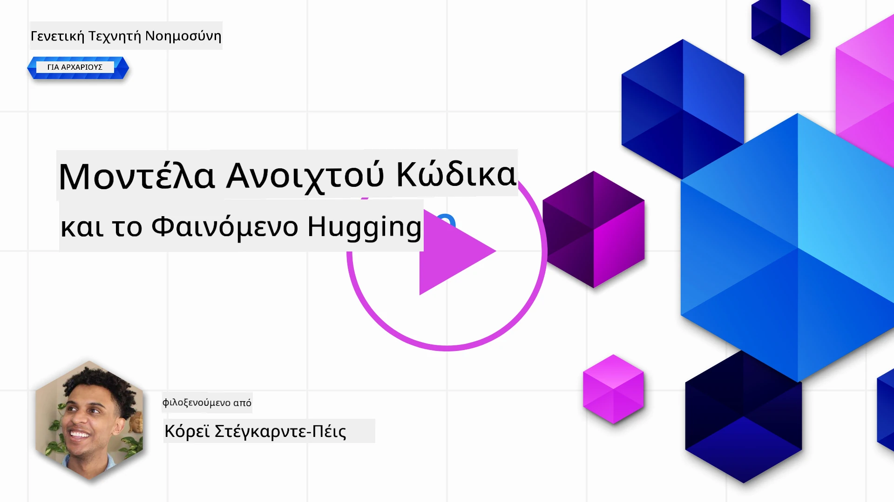
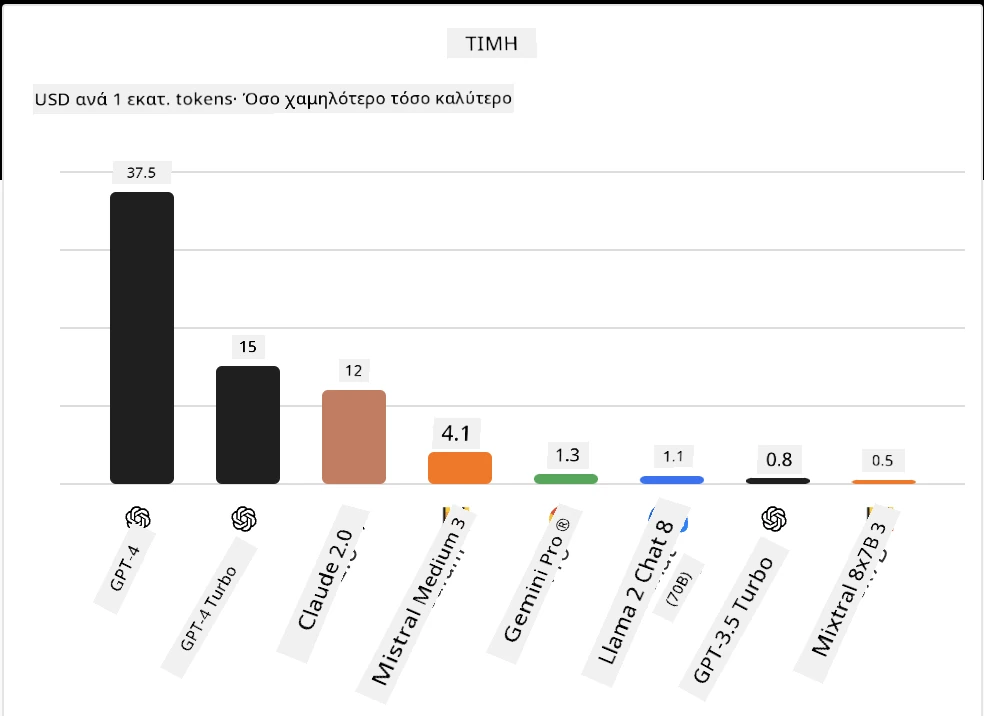
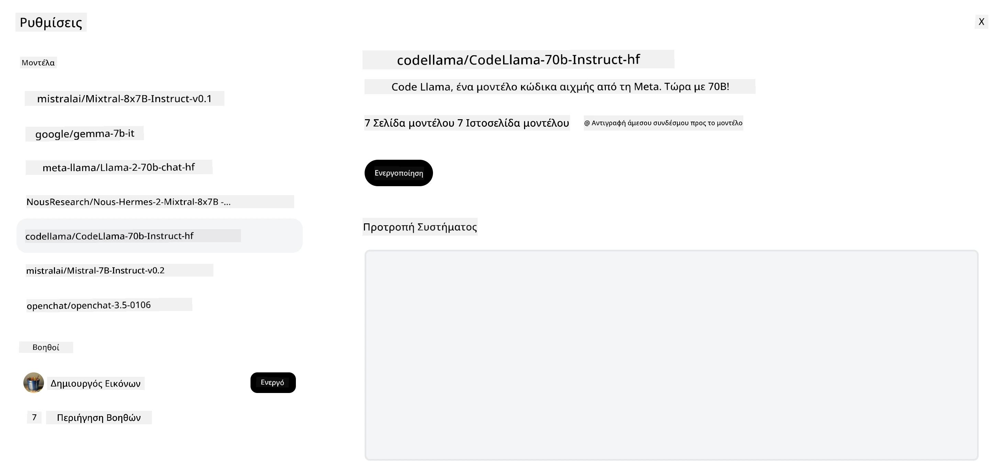
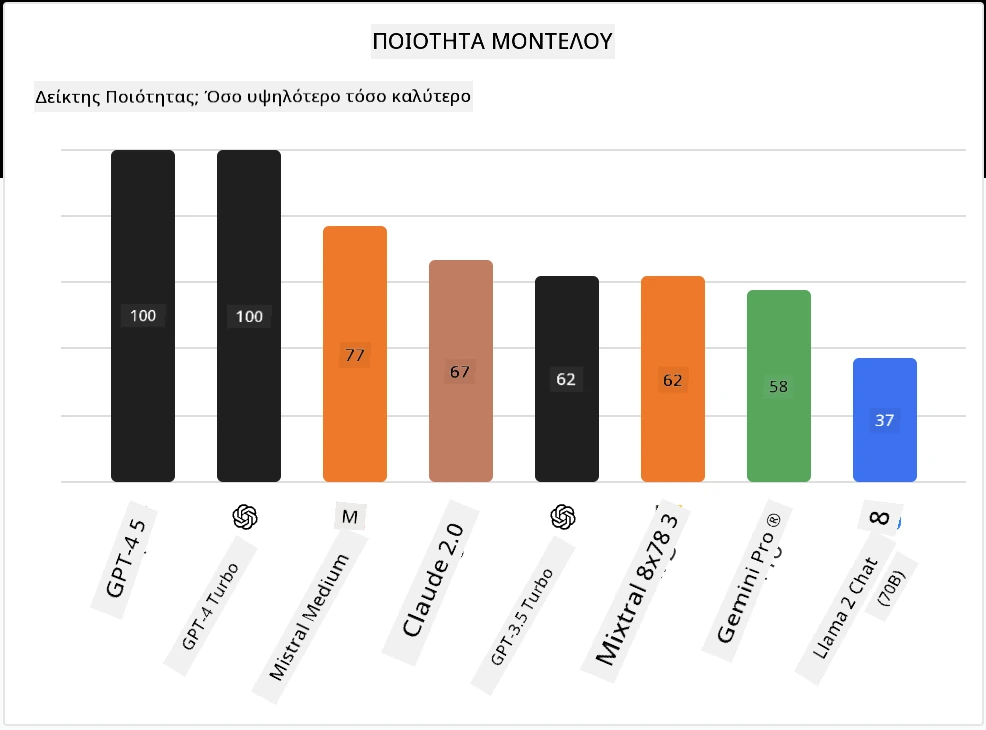

## Εισαγωγή

Ο κόσμος των ανοιχτών LLM είναι συναρπαστικός και συνεχώς εξελισσόμενος. Αυτό το μάθημα έχει ως στόχο να παρέχει μια εις βάθος ματιά στα ανοιχτά μοντέλα. Εάν αναζητάτε πληροφορίες για το πώς τα ιδιόκτητα μοντέλα συγκρίνονται με τα ανοιχτά μοντέλα, μεταβείτε στο μάθημα ["Εξερεύνηση και Σύγκριση Διαφόρων LLM"](../02-exploring-and-comparing-different-llms/README.md?WT.mc_id=academic-105485-koreyst). Αυτό το μάθημα θα καλύψει επίσης το θέμα της λεπτομερούς ρύθμισης (fine-tuning), αλλά μια πιο αναλυτική εξήγηση μπορεί να βρεθεί στο μάθημα ["Λεπτομερής Ρύθμιση LLM"](../18-fine-tuning/README.md?WT.mc_id=academic-105485-koreyst).

## Στόχοι μάθησης

- Κατανόηση των Ανοιχτών Μοντέλων
- Κατανόηση των οφελών από τη χρήση των ανοιχτών μοντέλων
- Εξερεύνηση των ανοιχτών μοντέλων που είναι διαθέσιμα στο Hugging Face και στο κατάλογο μοντέλων Microsoft Foundry

## Τι είναι τα Ανοιχτά Μοντέλα;

Το ανοιχτό λογισμικό έχει διαδραματίσει καθοριστικό ρόλο στην ανάπτυξη της τεχνολογίας σε διάφορους τομείς. Η Ομοσπονδία Ανοιχτού Κώδικα (Open Source Initiative - OSI) έχει ορίσει [10 κριτήρια για το λογισμικό](https://web.archive.org/web/20241126001143/https://opensource.org/osd?WT.mc_id=academic-105485-koreyst) ώστε να ταξινομηθεί ως ανοιχτού κώδικα. Ο πηγαίος κώδικας πρέπει να διαμοιράζεται ανοιχτά υπό μια άδεια εγκεκριμένη από την OSI.

Ενώ η ανάπτυξη των LLM έχει παρόμοια στοιχεία με την ανάπτυξη λογισμικού, η διαδικασία δεν είναι ακριβώς η ίδια. Αυτό έχει φέρει πολλές συζητήσεις στην κοινότητα σχετικά με τον ορισμό του ανοιχτού κώδικα στην περίπτωση των LLM. Για να ευθυγραμμιστεί ένα μοντέλο με τον παραδοσιακό ορισμό του ανοιχτού κώδικα, θα πρέπει οι ακόλουθες πληροφορίες να είναι δημόσια διαθέσιμες:

- Σύνολα δεδομένων που χρησιμοποιούνται για την εκπαίδευση του μοντέλου.
- Πλήρη βάρη του μοντέλου ως μέρος της εκπαίδευσης.
- Ο κώδικας αξιολόγησης.
- Ο κώδικας λεπτομερούς ρύθμισης (fine-tuning).
- Πλήρη βάρη μοντέλου και μετρικές εκπαίδευσης.

Επί του παρόντος υπάρχουν μόνο λίγα μοντέλα που πληρούν αυτά τα κριτήρια. Το [μοντέλο OLMo που δημιούργησε το Allen Institute for Artificial Intelligence (AllenAI)](https://huggingface.co/allenai/OLMo-7B?WT.mc_id=academic-105485-koreyst) είναι ένα που ταιριάζει σε αυτήν την κατηγορία.

Για αυτό το μάθημα, θα αναφερόμαστε στα μοντέλα ως "ανοιχτά μοντέλα" στο εξής, καθώς μπορεί να μην πληρούν τα παραπάνω κριτήρια τη στιγμή της συγγραφής.

## Οφέλη των Ανοιχτών Μοντέλων

**Υψηλή Προσαρμοστικότητα** - Εφόσον τα ανοιχτά μοντέλα κυκλοφορούν με λεπτομερείς πληροφορίες εκπαίδευσης, οι ερευνητές και οι προγραμματιστές μπορούν να τροποποιήσουν το εσωτερικό του μοντέλου. Αυτό επιτρέπει τη δημιουργία εξειδικευμένων μοντέλων που έχουν καθοριστεί ειδικά για μια συγκεκριμένη εργασία ή τομέα μελέτης. Μερικά παραδείγματα είναι η σύνθεση κώδικα, οι μαθηματικές πράξεις και η βιολογία.

**Κόστος** - Το κόστος ανά τοκέν για τη χρήση και την ανάπτυξη αυτών των μοντέλων είναι χαμηλότερο από εκείνο των ιδιόκτητων μοντέλων. Κατά την ανάπτυξη εφαρμογών Γενετικής Τεχνητής Νοημοσύνης, πρέπει να εξεταστεί η απόδοση σε σχέση με την τιμή όταν εργάζεστε με αυτά τα μοντέλα για τη δική σας περίπτωση χρήσης.

Πηγή: Artificial Analysis

**Ευελιξία** - Η εργασία με ανοιχτά μοντέλα σας επιτρέπει να είστε ευέλικτοι όσον αφορά τη χρήση διαφορετικών μοντέλων ή τον συνδυασμό τους. Ένα παράδειγμα αυτού είναι οι [Βοηθοί HuggingChat](https://huggingface.co/chat?WT.mc_id=academic-105485-koreyst), όπου ο χρήστης μπορεί να επιλέξει το μοντέλο που χρησιμοποιείται απευθείας στη διεπαφή χρήστη:

## Εξερεύνηση Διαφόρων Ανοιχτών Μοντέλων

### Llama 2

Το [Llama2](https://huggingface.co/meta-llama?WT.mc_id=academic-105485-koreyst), που αναπτύχθηκε από τη Meta, είναι ένα ανοιχτό μοντέλο που είναι βελτιστοποιημένο για εφαρμογές συνομιλίας. Αυτό οφείλεται στη μέθοδο λεπτομερούς ρύθμισης, η οποία περιελάμβανε μεγάλο όγκο διαλόγων και ανατροφοδότηση από ανθρώπους. Με αυτή τη μέθοδο, το μοντέλο παράγει περισσότερα αποτελέσματα που ευθυγραμμίζονται με τις ανθρώπινες προσδοκίες, προσφέροντας μια καλύτερη εμπειρία χρήστη.

Μερικά παραδείγματα εκδόσεων Llama με λεπτομερή ρύθμιση περιλαμβάνουν το [Ιαπωνικό Llama](https://huggingface.co/elyza/ELYZA-japanese-Llama-2-7b?WT.mc_id=academic-105485-koreyst), που εξειδικεύεται στα ιαπωνικά και το [Llama Pro](https://huggingface.co/TencentARC/LLaMA-Pro-8B?WT.mc_id=academic-105485-koreyst), που είναι μια βελτιωμένη έκδοση του βασικού μοντέλου.

### Mistral

Το [Mistral](https://huggingface.co/mistralai?WT.mc_id=academic-105485-koreyst) είναι ένα ανοιχτό μοντέλο με έντονη εστίαση στην υψηλή απόδοση και αποδοτικότητα. Χρησιμοποιεί την προσέγγιση Mixture-of-Experts, που συνδυάζει μια ομάδα εξειδικευμένων μοντέλων ειδικών σε ένα σύστημα όπου ανάλογα με την είσοδο, επιλέγονται συγκεκριμένα μοντέλα για χρήση. Αυτό καθιστά τον υπολογισμό πιο αποτελεσματικό καθώς τα μοντέλα ασχολούνται μόνο με τις εισόδους στις οποίες είναι εξειδικευμένα.

Μερικά παραδείγματα εκδόσεων Mistral με λεπτομερή ρύθμιση περιλαμβάνουν το [BioMistral](https://huggingface.co/BioMistral/BioMistral-7B?text=Mon+nom+est+Thomas+et+mon+principal?WT.mc_id=academic-105485-koreyst), που εστιάζει στον ιατρικό τομέα και το [OpenMath Mistral](https://huggingface.co/nvidia/OpenMath-Mistral-7B-v0.1-hf?WT.mc_id=academic-105485-koreyst), που εκτελεί μαθηματικούς υπολογισμούς.

### Falcon

Το [Falcon](https://huggingface.co/tiiuae?WT.mc_id=academic-105485-koreyst) είναι ένα LLM που δημιούργησε το Technology Innovation Institute (**TII**). Το Falcon-40B εκπαιδεύτηκε με 40 δισεκατομμύρια παραμέτρους, και έχει αποδειχθεί ότι αποδίδει καλύτερα από το GPT-3 με μικρότερο υπολογιστικό κόστος. Αυτό οφείλεται στη χρήση του αλγορίθμου FlashAttention και της multiquery προσοχής που επιτρέπει τη μείωση των απαιτήσεων μνήμης κατά τον χρόνο συμπερασμού. Με αυτόν τον μειωμένο χρόνο συμπερασμού, το Falcon-40B είναι κατάλληλο για εφαρμογές συνομιλίας.

Μερικά παραδείγματα εκδόσεων Falcon με λεπτομερή ρύθμιση είναι το [OpenAssistant](https://huggingface.co/OpenAssistant/falcon-40b-sft-top1-560?WT.mc_id=academic-105485-koreyst), ένας βοηθός που είναι χτισμένος σε ανοιχτά μοντέλα και το [GPT4ALL](https://huggingface.co/nomic-ai/gpt4all-falcon?WT.mc_id=academic-105485-koreyst), που προσφέρει καλύτερη απόδοση από το βασικό μοντέλο.

## Πώς να Επιλέξετε

Δεν υπάρχει μία απάντηση για την επιλογή ενός ανοιχτού μοντέλου. Μια καλή αρχή είναι η χρήση του φίλτρου κατά εργασία του καταλόγου μοντέλων Microsoft Foundry. Αυτό θα σας βοηθήσει να κατανοήσετε για ποιους τύπους εργασιών έχει εκπαιδευτεί το μοντέλο. Το Hugging Face διατηρεί επίσης έναν πίνακα επιδόσεων LLM που δείχνει τα καλύτερα μοντέλα βάσει ορισμένων μετρικών.

Όταν θέλετε να συγκρίνετε LLM ανάμεσα σε διαφορετικούς τύπους, το [Artificial Analysis](https://artificialanalysis.ai/?WT.mc_id=academic-105485-koreyst) είναι μια ακόμα εξαιρετική πηγή:

Πηγή: Artificial Analysis

Αν εργάζεστε σε μια συγκεκριμένη περίπτωση χρήσης, η αναζήτηση εκδόσεων με λεπτομερή ρύθμιση που εστιάζουν στον ίδιο τομέα μπορεί να είναι αποτελεσματική. Η πειραματική χρήση πολλαπλών ανοιχτών μοντέλων για να δείτε πώς αποδίδουν σύμφωνα με τις δικές σας και των χρηστών σας προσδοκίες είναι επίσης μια καλή πρακτική.

## Επόμενα Βήματα

Το καλύτερο με τα ανοιχτά μοντέλα είναι ότι μπορείτε να ξεκινήσετε να εργάζεστε μαζί τους αρκετά γρήγορα. Δείτε τον [κατάλογο μοντέλων Microsoft Foundry](https://ai.azure.com?WT.mc_id=academic-105485-koreyst), που περιλαμβάνει μια συγκεκριμένη συλλογή του Hugging Face με τα μοντέλα που συζητήσαμε εδώ.

## Η μάθηση δεν σταματά εδώ, συνεχίστε το Ταξίδι

Μετά την ολοκλήρωση αυτού του μαθήματος, δείτε τη [συλλογή Μαθημάτων Γενετικής Τεχνητής Νοημοσύνης](https://aka.ms/genai-collection?WT.mc_id=academic-105485-koreyst) για να συνεχίσετε να εξελίσσετε τις γνώσεις σας στην Γενετική Τεχνητή Νοημοσύνη!

---

<!-- CO-OP TRANSLATOR DISCLAIMER START -->
**Αποποίηση ευθυνών**:
Αυτό το έγγραφο έχει μεταφραστεί χρησιμοποιώντας την υπηρεσία μετάφρασης με τεχνητή νοημοσύνη [Co-op Translator](https://github.com/Azure/co-op-translator). Ενώ επιδιώκουμε την ακρίβεια, παρακαλούμε να έχετε υπόψη ότι οι αυτοματοποιημένες μεταφράσεις ενδέχεται να περιέχουν λάθη ή ανακρίβειες. Το πρωτότυπο έγγραφο στη μητρική του γλώσσα πρέπει να θεωρείται η αυθεντική πηγή. Για κρίσιμες πληροφορίες, συνιστάται επαγγελματική ανθρώπινη μετάφραση. Δεν φέρουμε ευθύνη για τυχόν παρεξηγήσεις ή λανθασμένες ερμηνείες που προκύπτουν από τη χρήση αυτής της μετάφρασης.
<!-- CO-OP TRANSLATOR DISCLAIMER END -->