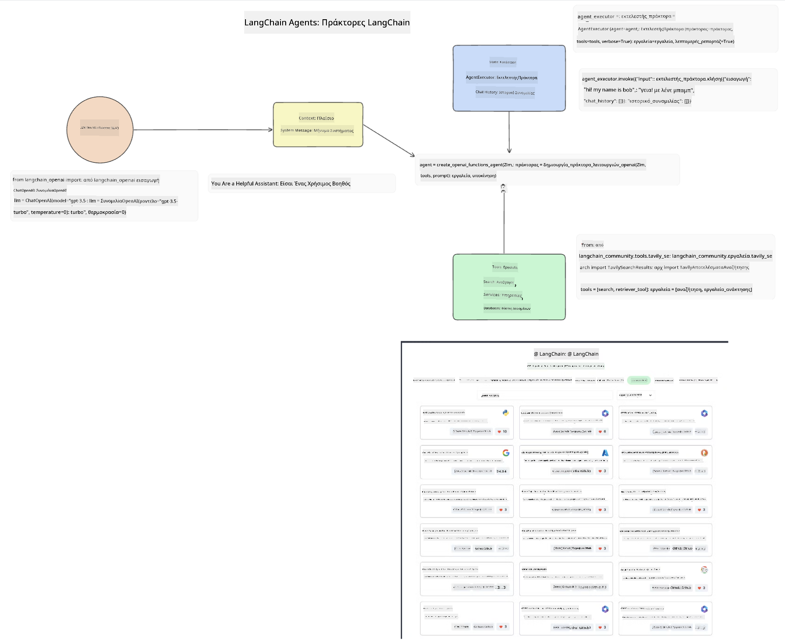
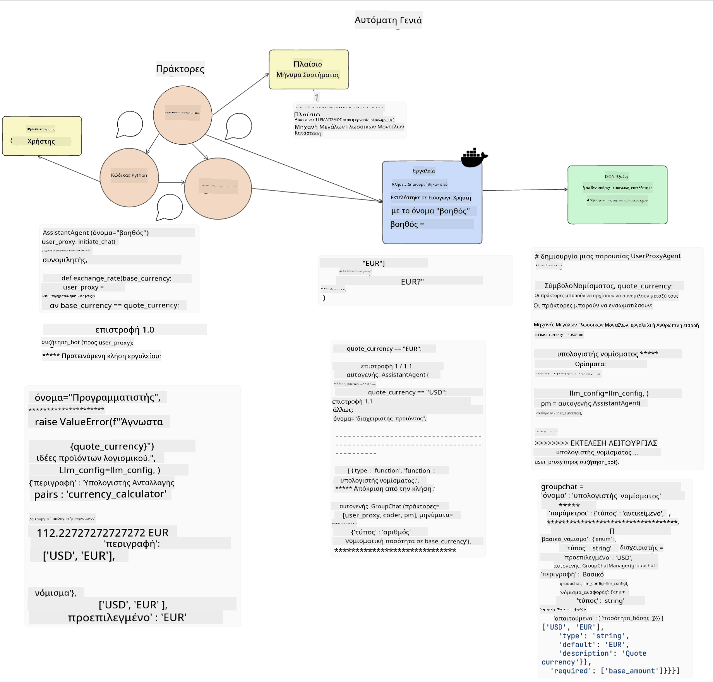
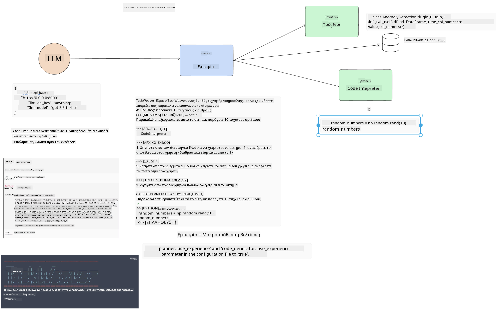
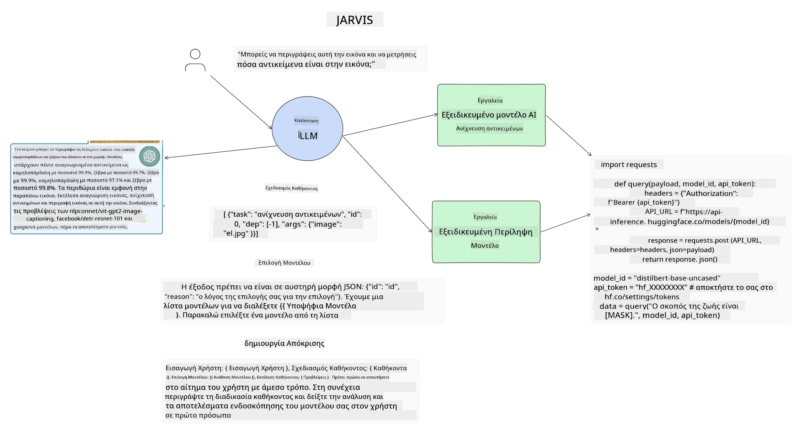

<!--
CO_OP_TRANSLATOR_METADATA:
{
  "original_hash": "11f03c81f190d9cbafd0f977dcbede6c",
  "translation_date": "2025-05-20T07:23:38+00:00",
  "source_file": "17-ai-agents/README.md",
  "language_code": "el"
}
-->
[](https://aka.ms/gen-ai-lesson17-gh?WT.mc_id=academic-105485-koreyst)

## Εισαγωγή

Οι AI Agents αποτελούν μια συναρπαστική εξέλιξη στην Γενετική AI, επιτρέποντας στα Μεγάλα Γλωσσικά Μοντέλα (LLMs) να εξελιχθούν από βοηθούς σε πράκτορες ικανούς να αναλαμβάνουν δράση. Τα πλαίσια AI Agent επιτρέπουν στους προγραμματιστές να δημιουργούν εφαρμογές που παρέχουν στα LLMs πρόσβαση σε εργαλεία και διαχείριση κατάστασης. Αυτά τα πλαίσια επίσης βελτιώνουν την ορατότητα, επιτρέποντας στους χρήστες και τους προγραμματιστές να παρακολουθούν τις ενέργειες που έχουν προγραμματιστεί από τα LLMs, βελτιώνοντας έτσι τη διαχείριση εμπειρίας.

Το μάθημα θα καλύψει τις εξής περιοχές:

- Κατανόηση τι είναι ένας AI Agent - Τι ακριβώς είναι ένας AI Agent;
- Εξερεύνηση τεσσάρων διαφορετικών πλαισίων AI Agent - Τι τα κάνει μοναδικά;
- Εφαρμογή αυτών των AI Agents σε διαφορετικές περιπτώσεις χρήσης - Πότε πρέπει να χρησιμοποιούμε AI Agents;

## Στόχοι μάθησης

Μετά την ολοκλήρωση αυτού του μαθήματος, θα είστε σε θέση να:

- Εξηγήσετε τι είναι οι AI Agents και πώς μπορούν να χρησιμοποιηθούν.
- Έχετε μια κατανόηση των διαφορών μεταξύ κάποιων από τα δημοφιλή πλαίσια AI Agent και πώς διαφέρουν.
- Κατανοήσετε πώς λειτουργούν οι AI Agents ώστε να δημιουργήσετε εφαρμογές με αυτούς.

## Τι είναι οι AI Agents;

Οι AI Agents είναι ένα πολύ συναρπαστικό πεδίο στον κόσμο της Γενετικής AI. Με αυτή τη συναρπαστική εξέλιξη έρχεται μερικές φορές και μια σύγχυση των όρων και της εφαρμογής τους. Για να διατηρήσουμε τα πράγματα απλά και περιεκτικά για τα περισσότερα εργαλεία που αναφέρονται ως AI Agents, θα χρησιμοποιήσουμε τον εξής ορισμό:

Οι AI Agents επιτρέπουν στα Μεγάλα Γλωσσικά Μοντέλα (LLMs) να εκτελούν εργασίες δίνοντάς τους πρόσβαση σε μια **κατάσταση** και **εργαλεία**.


Ας ορίσουμε αυτούς τους όρους:

**Μεγάλα Γλωσσικά Μοντέλα** - Αυτά είναι τα μοντέλα που αναφέρονται καθ' όλη τη διάρκεια αυτού του μαθήματος, όπως τα GPT-3.5, GPT-4, Llama-2, κ.λπ.

**Κατάσταση** - Αυτό αναφέρεται στο πλαίσιο στο οποίο εργάζεται το LLM. Το LLM χρησιμοποιεί το πλαίσιο των προηγούμενων ενεργειών του και το τρέχον πλαίσιο, καθοδηγώντας τη λήψη αποφάσεων για τις επόμενες ενέργειες. Τα πλαίσια AI Agent επιτρέπουν στους προγραμματιστές να διατηρούν αυτό το πλαίσιο πιο εύκολα.

**Εργαλεία** - Για να ολοκληρωθεί η εργασία που έχει ζητήσει ο χρήστης και που έχει σχεδιάσει το LLM, το LLM χρειάζεται πρόσβαση σε εργαλεία. Μερικά παραδείγματα εργαλείων μπορεί να είναι μια βάση δεδομένων, ένα API, μια εξωτερική εφαρμογή ή ακόμα και ένα άλλο LLM!

Αυτοί οι ορισμοί ελπίζουμε να σας δώσουν μια καλή βάση καθώς προχωράμε και εξετάζουμε πώς υλοποιούνται. Ας εξερευνήσουμε μερικά διαφορετικά πλαίσια AI Agent:

## LangChain Agents

[LangChain Agents](https://python.langchain.com/docs/how_to/#agents?WT.mc_id=academic-105485-koreyst) είναι μια υλοποίηση των ορισμών που παρέχουμε παραπάνω.

Για τη διαχείριση της **κατάστασης**, χρησιμοποιεί μια ενσωματωμένη λειτουργία που ονομάζεται `AgentExecutor`. Αυτή δέχεται την καθορισμένη `agent` και τα `tools` που είναι διαθέσιμα.

Το `Agent Executor` επίσης αποθηκεύει το ιστορικό συνομιλιών για να παρέχει το πλαίσιο της συνομιλίας.



Το LangChain προσφέρει έναν [κατάλογο εργαλείων](https://integrations.langchain.com/tools?WT.mc_id=academic-105485-koreyst) που μπορούν να εισαχθούν στην εφαρμογή σας και στα οποία το LLM μπορεί να έχει πρόσβαση. Αυτά είναι φτιαγμένα από την κοινότητα και από την ομάδα του LangChain.

Μπορείτε στη συνέχεια να ορίσετε αυτά τα εργαλεία και να τα περάσετε στο `Agent Executor`.

Η ορατότητα είναι μια άλλη σημαντική πτυχή όταν μιλάμε για AI Agents. Είναι σημαντικό για τους προγραμματιστές εφαρμογών να κατανοούν ποιο εργαλείο χρησιμοποιεί το LLM και γιατί. Για αυτό, η ομάδα του LangChain έχει αναπτύξει το LangSmith.

## AutoGen

Το επόμενο πλαίσιο AI Agent που θα συζητήσουμε είναι το [AutoGen](https://microsoft.github.io/autogen/?WT.mc_id=academic-105485-koreyst). Το κύριο επίκεντρο του AutoGen είναι οι συνομιλίες. Οι πράκτορες είναι και **συνομιλητικοί** και **προσαρμόσιμοι**.

**Συνομιλητικοί -** Τα LLMs μπορούν να ξεκινήσουν και να συνεχίσουν μια συνομιλία με ένα άλλο LLM για να ολοκληρώσουν μια εργασία. Αυτό γίνεται δημιουργώντας `AssistantAgents` και δίνοντάς τους ένα συγκεκριμένο μήνυμα συστήματος.

```python

autogen.AssistantAgent( name="Coder", llm_config=llm_config, ) pm = autogen.AssistantAgent( name="Product_manager", system_message="Creative in software product ideas.", llm_config=llm_config, )

```

**Προσαρμόσιμοι** - Οι πράκτορες μπορούν να οριστούν όχι μόνο ως LLMs αλλά και ως χρήστης ή εργαλείο. Ως προγραμματιστής, μπορείτε να ορίσετε έναν `UserProxyAgent` που είναι υπεύθυνος για την αλληλεπίδραση με τον χρήστη για ανατροφοδότηση στην ολοκλήρωση μιας εργασίας. Αυτή η ανατροφοδότηση μπορεί είτε να συνεχίσει την εκτέλεση της εργασίας είτε να την σταματήσει.

```python
user_proxy = UserProxyAgent(name="user_proxy")
```

### Κατάσταση και Εργαλεία

Για να αλλάξει και να διαχειριστεί την κατάσταση, ένας βοηθός Agent δημιουργεί κώδικα Python για να ολοκληρώσει την εργασία.

Εδώ είναι ένα παράδειγμα της διαδικασίας:



#### LLM Ορισμένο με Μήνυμα Συστήματος

```python
system_message="For weather related tasks, only use the functions you have been provided with. Reply TERMINATE when the task is done."
```

Αυτό το μήνυμα συστήματος κατευθύνει το συγκεκριμένο LLM προς τις λειτουργίες που είναι σχετικές για την εργασία του. Θυμηθείτε, με το AutoGen μπορείτε να έχετε πολλούς καθορισμένους AssistantAgents με διαφορετικά μηνύματα συστήματος.

#### Συνομιλία Ξεκινά από τον Χρήστη

```python
user_proxy.initiate_chat( chatbot, message="I am planning a trip to NYC next week, can you help me pick out what to wear? ", )

```

Αυτό το μήνυμα από το user_proxy (Άνθρωπος) είναι αυτό που θα ξεκινήσει τη διαδικασία του Agent να εξερευνήσει τις πιθανές λειτουργίες που πρέπει να εκτελέσει.

#### Λειτουργία Εκτελείται

```bash
chatbot (to user_proxy):

***** Suggested tool Call: get_weather ***** Arguments: {"location":"New York City, NY","time_periond:"7","temperature_unit":"Celsius"} ******************************************************** --------------------------------------------------------------------------------

>>>>>>>> EXECUTING FUNCTION get_weather... user_proxy (to chatbot): ***** Response from calling function "get_weather" ***** 112.22727272727272 EUR ****************************************************************

```

Μόλις η αρχική συνομιλία επεξεργαστεί, ο Agent θα στείλει το προτεινόμενο εργαλείο για κλήση. Σε αυτή την περίπτωση, είναι μια λειτουργία που ονομάζεται `get_weather`. Depending on your configuration, this function can be automatically executed and read by the Agent or can be executed based on user input.

You can find a list of [AutoGen code samples](https://microsoft.github.io/autogen/docs/Examples/?WT.mc_id=academic-105485-koreyst) to further explore how to get started building.

## Taskweaver

The next agent framework we will explore is [Taskweaver](https://microsoft.github.io/TaskWeaver/?WT.mc_id=academic-105485-koreyst). It is known as a "code-first" agent because instead of working strictly with `strings` , it can work with DataFrames in Python. This becomes extremely useful for data analysis and generation tasks. This can be things like creating graphs and charts or generating random numbers.

### State and Tools

To manage the state of the conversation, TaskWeaver uses the concept of a `Planner`. The `Planner` is a LLM that takes the request from the users and maps out the tasks that need to be completed to fulfill this request.

To complete the tasks the `Planner` is exposed to the collection of tools called `Plugins`. Αυτά μπορεί να είναι κλάσεις Python ή ένας γενικός διερμηνευτής κώδικα. Αυτά τα plugins αποθηκεύονται ως embeddings ώστε το LLM να μπορεί καλύτερα να αναζητήσει το σωστό plugin.



Εδώ είναι ένα παράδειγμα plugin για την αντιμετώπιση ανίχνευσης ανωμαλιών:

```python
class AnomalyDetectionPlugin(Plugin): def __call__(self, df: pd.DataFrame, time_col_name: str, value_col_name: str):
```

Ο κώδικας επαληθεύεται πριν εκτελεστεί. Μια άλλη λειτουργία για τη διαχείριση του πλαισίου στο Taskweaver είναι η `experience`. Experience allows for the context of a conversation to be stored over to the long term in a YAML file. This can be configured so that the LLM improves over time on certain tasks given that it is exposed to prior conversations.

## JARVIS

The last agent framework we will explore is [JARVIS](https://github.com/microsoft/JARVIS?tab=readme-ov-file?WT.mc_id=academic-105485-koreyst). What makes JARVIS unique is that it uses an LLM to manage the `state` της συνομιλίας και οι `tools`είναι άλλα μοντέλα AI. Κάθε ένα από τα μοντέλα AI είναι εξειδικευμένα μοντέλα που εκτελούν συγκεκριμένες εργασίες όπως ανίχνευση αντικειμένων, μεταγραφή ή περιγραφή εικόνας.



Το LLM, ως γενικό μοντέλο, λαμβάνει το αίτημα από τον χρήστη και εντοπίζει την συγκεκριμένη εργασία και οποιαδήποτε επιχειρήματα/δεδομένα που χρειάζονται για την ολοκλήρωση της εργασίας.

```python
[{"task": "object-detection", "id": 0, "dep": [-1], "args": {"image": "e1.jpg" }}]
```

Στη συνέχεια, το LLM μορφοποιεί το αίτημα με τρόπο που το εξειδικευμένο μοντέλο AI μπορεί να ερμηνεύσει, όπως JSON. Μόλις το μοντέλο AI επιστρέψει την πρόβλεψή του βάσει της εργασίας, το LLM λαμβάνει την απάντηση.

Εάν απαιτούνται πολλαπλά μοντέλα για την ολοκλήρωση της εργασίας, θα ερμηνεύσει επίσης την απάντηση από αυτά τα μοντέλα πριν τα συνδυάσει για να δημιουργήσει την απάντηση στον χρήστη.

Το παρακάτω παράδειγμα δείχνει πώς θα λειτουργούσε αυτό όταν ένας χρήστης ζητά περιγραφή και μέτρηση των αντικειμένων σε μια εικόνα:

## Ανάθεση

Για να συνεχίσετε την εκμάθηση των AI Agents μπορείτε να δημιουργήσετε με το AutoGen:

- Μια εφαρμογή που προσομοιώνει μια επιχειρηματική συνάντηση με διαφορετικά τμήματα μιας εκπαιδευτικής startup.
- Δημιουργήστε μηνύματα συστήματος που καθοδηγούν τα LLMs στην κατανόηση διαφορετικών προσώπων και προτεραιοτήτων, και επιτρέψτε στον χρήστη να παρουσιάσει μια νέα ιδέα προϊόντος.
- Το LLM θα πρέπει στη συνέχεια να δημιουργήσει επόμενες ερωτήσεις από κάθε τμήμα για να βελτιώσει και να βελτιώσει την παρουσίαση και την ιδέα προϊόντος.

## Η μάθηση δεν σταματά εδώ, συνεχίστε το ταξίδι

Αφού ολοκληρώσετε αυτό το μάθημα, δείτε τη [Συλλογή μάθησης Γενετικής AI](https://aka.ms/genai-collection?WT.mc_id=academic-105485-koreyst) για να συνεχίσετε να αναβαθμίζετε τις γνώσεις σας στη Γενετική AI!

**Αποποίηση ευθυνών**: 
Αυτό το έγγραφο έχει μεταφραστεί χρησιμοποιώντας την υπηρεσία μετάφρασης AI [Co-op Translator](https://github.com/Azure/co-op-translator). Ενώ επιδιώκουμε την ακρίβεια, παρακαλώ να γνωρίζετε ότι οι αυτοματοποιημένες μεταφράσεις μπορεί να περιέχουν λάθη ή ανακρίβειες. Το πρωτότυπο έγγραφο στη μητρική του γλώσσα θα πρέπει να θεωρείται η έγκυρη πηγή. Για κρίσιμες πληροφορίες, συνιστάται η επαγγελματική ανθρώπινη μετάφραση. Δεν φέρουμε ευθύνη για τυχόν παρεξηγήσεις ή ερμηνείες που προκύπτουν από τη χρήση αυτής της μετάφρασης.